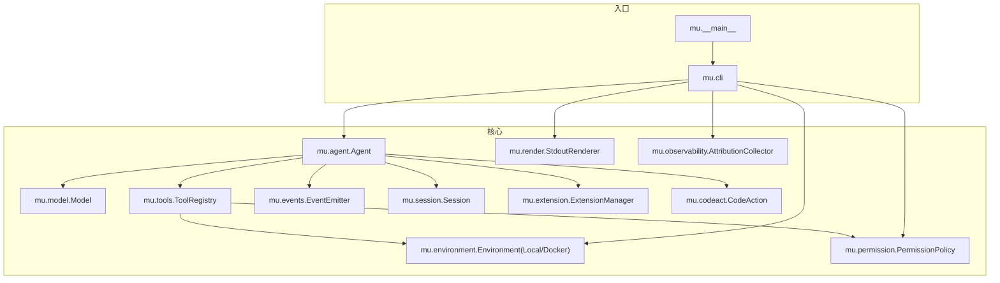
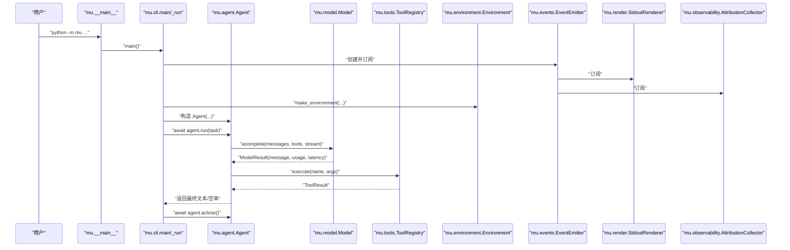
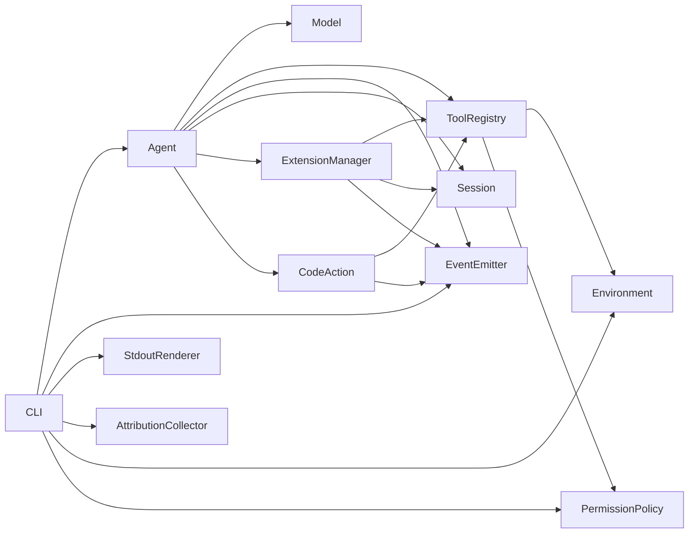

# API 参考

<cite>
**本文档引用的文件**
- [mu/__init__.py](file://mu/__init__.py)
- [mu/__main__.py](file://mu/__main__.py)
- [mu/agent.py](file://mu/agent.py)
- [mu/cli.py](file://mu/cli.py)
- [mu/codeact.py](file://mu/codeact.py)
- [mu/environment.py](file://mu/environment.py)
- [mu/events.py](file://mu/events.py)
- [mu/model.py](file://mu/model.py)
- [mu/session.py](file://mu/session.py)
- [mu/tools.py](file://mu/tools.py)
- [mu/permission.py](file://mu/permission.py)
- [mu/render.py](file://mu/render.py)
- [mu/observability.py](file://mu/observability.py)
- [mu/extension.py](file://mu/extension.py)
- [mu/extsdk.py](file://mu/extsdk.py)
</cite>

## 目录
1. [简介](#简介)
2. [项目结构](#项目结构)
3. [核心组件](#核心组件)
4. [架构总览](#架构总览)
5. [详细组件分析](#详细组件分析)
6. [依赖分析](#依赖分析)
7. [性能考量](#性能考量)
8. [故障排查指南](#故障排查指南)
9. [结论](#结论)
10. [附录](#附录)

## 简介
本文件为 μ (mu) 项目的完整 API 参考，覆盖公共接口、类与方法的定义、参数与返回值说明，模块间依赖与导入路径，使用示例与注意事项，版本兼容性与变更历史提示，错误码与异常处理，性能特征与使用限制，以及 API 索引与交叉引用。文档严格依据仓库源码进行梳理，确保与实现同步。

## 项目结构
- 包根导出通过包级 __init__.py 暴露核心 API，便于用户从 mu 包直接导入所需类型。
- CLI 入口位于 mu.__main__，通过 mu.cli.main 提供命令行能力。
- 核心子系统包括：Agent（智能体循环）、Model（大模型封装）、Tools（工具注册与执行）、Environment（执行环境抽象）、Events（事件流）、Session（会话树）、Permission（权限策略）、Render（渲染订阅者）、Observability（可观测性）、Extension（扩展管理）、CodeAction（原生代码动作）。

图表来源
- [mu/__main__.py:1-5](file://mu/__main__.py#L1-L5)
- [mu/cli.py:1-134](file://mu/cli.py#L1-L134)
- [mu/agent.py:43-223](file://mu/agent.py#L43-L223)
- [mu/model.py:91-147](file://mu/model.py#L91-L147)
- [mu/tools.py:191-269](file://mu/tools.py#L191-L269)
- [mu/environment.py:23-149](file://mu/environment.py#L23-L149)
- [mu/events.py:121-133](file://mu/events.py#L121-L133)
- [mu/session.py:38-115](file://mu/session.py#L38-L115)
- [mu/permission.py:15-69](file://mu/permission.py#L15-L69)
- [mu/render.py:31-78](file://mu/render.py#L31-L78)
- [mu/observability.py:26-90](file://mu/observability.py#L26-L90)
- [mu/extension.py:85-364](file://mu/extension.py#L85-L364)
- [mu/codeact.py:84-133](file://mu/codeact.py#L84-L133)

章节来源
- [mu/__init__.py:1-33](file://mu/__init__.py#L1-L33)
- [mu/__main__.py:1-5](file://mu/__main__.py#L1-L5)
- [mu/cli.py:1-134](file://mu/cli.py#L1-L134)

## 核心组件
- 包导出与版本
  - 导出：Agent、Model、ModelResult、ToolRegistry、ToolResult、LocalEnvironment、Environment、make_environment、PermissionPolicy、make_policy、CodeAction、Session、EventEmitter、StdoutRenderer、AttributionCollector、ExtensionManager。
  - 版本：__version__ = "0.1.0"。
- 主要职责
  - Agent：驱动一轮轮对话与工具调用，维护会话树，发出结构化事件。
  - Model：封装异步 OpenAI 兼容客户端，支持流式与非流式补全，返回 ModelResult。
  - ToolRegistry：注册/注销工具，校验权限，执行工具并返回 ToolResult。
  - Environment：抽象执行环境，提供 bash、读写文件能力；LocalEnvironment 为默认实现；DockerEnvironment 为可选沙箱。
  - Events：事件数据类与 EventEmitter，支持订阅分发。
  - Session：树形会话存储，支持分支、摘要、持久化。
  - Permission：基于能力的权限策略，支持 allow/readonly/workspace。
  - StdoutRenderer：事件到标准输出的渲染订阅者。
  - AttributionCollector：可观测性收集器，统计轮次、耗时、token、工具明细。
  - ExtensionManager：扩展生命周期管理，子进程通信，注册扩展工具。
  - CodeAction：原生代码动作工具，将多轮工具调用压缩为单轮执行。

章节来源
- [mu/__init__.py:14-33](file://mu/__init__.py#L14-L33)
- [mu/agent.py:43-223](file://mu/agent.py#L43-L223)
- [mu/model.py:91-147](file://mu/model.py#L91-L147)
- [mu/tools.py:191-269](file://mu/tools.py#L191-L269)
- [mu/environment.py:23-149](file://mu/environment.py#L23-L149)
- [mu/events.py:121-133](file://mu/events.py#L121-L133)
- [mu/session.py:38-115](file://mu/session.py#L38-L115)
- [mu/permission.py:15-69](file://mu/permission.py#L15-L69)
- [mu/render.py:31-78](file://mu/render.py#L31-L78)
- [mu/observability.py:26-90](file://mu/observability.py#L26-L90)
- [mu/extension.py:85-364](file://mu/extension.py#L85-L364)
- [mu/codeact.py:84-133](file://mu/codeact.py#L84-L133)

## 架构总览
以下序列图展示 CLI 启动到 Agent 执行的典型流程，包括事件订阅者与环境初始化。

图表来源
- [mu/__main__.py:1-5](file://mu/__main__.py#L1-L5)
- [mu/cli.py:51-134](file://mu/cli.py#L51-L134)
- [mu/agent.py:82-133](file://mu/agent.py#L82-L133)
- [mu/model.py:112-147](file://mu/model.py#L112-L147)
- [mu/tools.py:253-269](file://mu/tools.py#L253-L269)
- [mu/environment.py:139-149](file://mu/environment.py#L139-L149)
- [mu/events.py:121-133](file://mu/events.py#L121-L133)
- [mu/render.py:31-78](file://mu/render.py#L31-L78)
- [mu/observability.py:26-90](file://mu/observability.py#L26-L90)

## 详细组件分析

### Agent 类
- 角色与职责
  - 驱动主循环，构建上下文，调用模型，执行工具，发出结构化事件，支持流式输出与取消。
- 关键属性
  - model: Model
  - tools: ToolRegistry
  - emitter: EventEmitter
  - session: Session
  - stream: bool
  - code_action: bool
  - extensions: ExtensionManager | None
- 关键方法
  - run(task: str) -> str：执行一轮任务，直至无工具调用或终止。
  - summarize_branch(branch_leaf_id: str, return_to: str, summary_text: str | None = None) -> str：将分支摘要合并回主线。
  - aclose() -> None：关闭扩展子进程。
- 事件触发
  - RunStarted、TurnStarted、ModelCallStarted、AssistantText/AssistantTextDelta、ModelCallFinished、ToolCallStarted、ToolCallFinished、TurnFinished、RunFinished、RunAborted。
- 参数与返回
  - run(task): 输入任务字符串；返回最终文本或空串。
  - summarize_branch(...): 返回新增分支摘要节点 id。
  - aclose(): 无返回。
- 使用注意
  - 若开启流式，需订阅 AssistantTextDelta 以实时输出。
  - 取消时会发出 RunAborted 并保持会话可恢复。
- 示例
  - 通过 CLI 启动：参见“命令行参数”小节。
  - 编程式使用：参考“CLI 入口与运行流程”小节。

章节来源
- [mu/agent.py:43-223](file://mu/agent.py#L43-L223)
- [mu/events.py:18-116](file://mu/events.py#L18-L116)

### Model 类
- 角色与职责
  - 封装异步 OpenAI 兼容客户端，支持流式与非流式补全，返回 ModelResult。
- 关键方法
  - acomplete(messages: list[dict], tools: list[dict], stream: bool = False, on_delta: Callable | None = None) -> ModelResult
- 数据结构
  - ModelResult：包含 message、prompt_tokens、completion_tokens、total_tokens、latency_s。
  - consume_stream(chunks, on_delta) -> tuple[_StreamMessage, Any]：累积流式响应。
- 参数与返回
  - acomplete：输入 messages 与 tools；可选 stream 与 on_delta；返回 ModelResult。
- 使用注意
  - 配置缺失会抛出 ConfigError（MU_MODEL/MU_API_KEY/OPENAI_API_KEY）。
  - 流式模式下，on_delta 接收增量文本。
- 示例
  - 参考 Agent.run 中对 acomplete 的调用。

章节来源
- [mu/model.py:91-147](file://mu/model.py#L91-L147)

### ToolRegistry 类
- 角色与职责
  - 工具注册中心，统一处理工具调用，执行前进行权限检查，返回 ToolResult。
- 内置工具
  - read、write、edit、bash；对应 schema 与 handler。
- 关键方法
  - register(name, schema, handler, capabilities) -> None
  - unregister(name) -> None
  - execute(name, args) -> ToolResult
  - schemas() -> list[dict]
  - names() -> list[str]
  - capabilities(name) -> set[str]
  - permits(name, args) -> bool
- 数据结构
  - ToolResult：继承 str，带 terminate 标志。
- 参数与返回
  - execute：根据工具返回 ToolResult；未知工具/权限不足/参数缺失/执行异常均返回错误字符串。
- 使用注意
  - 权限策略按能力 gate，非按工具名黑名单。
  - 内置工具不产生 terminate。
- 示例
  - 参考 Agent._run_tool_calls 中的调用。

章节来源
- [mu/tools.py:191-269](file://mu/tools.py#L191-L269)

### Environment 抽象与实现
- 抽象
  - Environment 协议：run_bash、read_file、write_file。
- 实现
  - LocalEnvironment：本地 bash 子进程与文件 IO；支持超时与进程组清理。
  - DockerEnvironment：将 bash 放入容器（网络 none），文件 IO 委托宿主。
  - make_environment(kind, ...) -> Environment：工厂函数。
- 参数与返回
  - run_bash(command, timeout) -> BashResult(stdout, stderr, exit_code)
  - read_file(path, offset, limit) -> str
  - write_file(path, content) -> None
- 使用注意
  - DockerEnvironment 当前仅沙箱 bash，不隔离文件读写。
- 示例
  - 参考 ToolRegistry._read/_write/_edit/_bash 的调用。

章节来源
- [mu/environment.py:23-149](file://mu/environment.py#L23-L149)

### 事件系统
- 事件基类与常用事件
  - Event、RunStarted、TurnStarted、ModelCallStarted、ModelCallFinished、AssistantText、AssistantTextDelta、ToolCallStarted、ToolCallFinished、TurnFinished、RunFinished、RunAborted、ErrorEvent、ExtensionLoaded、ExtensionUnloaded、ExtensionLog、ExtensionError。
- EventEmitter
  - subscribe(fn) -> None；emit(event) -> None。
- 使用注意
  - 订阅者应轻量处理，避免阻塞事件循环。
- 示例
  - StdoutRenderer 与 AttributionCollector 均为订阅者。

章节来源
- [mu/events.py:121-133](file://mu/events.py#L121-L133)

### Session 会话树
- 角色与职责
  - 以树存储消息，支持 append-only、分支、摘要、持久化。
- 关键方法
  - append(msg) -> str：追加节点并持久化。
  - path_to(node_id) -> list[dict]：返回从根到节点的线性路径。
  - path_to_head() -> list[dict]：当前分支路径。
  - branch_from(node_id) -> None：切换当前头节点。
  - add_branch_summary(content) -> str：在主线追加分支摘要。
  - load(session_id, base_dir) -> Session：从 JSONL 恢复。
- 参数与返回
  - path_to/head/branch_from/add_branch_summary/append/load 等。
- 使用注意
  - 默认会话目录可通过环境变量覆盖。
- 示例
  - 参考 Agent.messages 与分支摘要合并。

章节来源
- [mu/session.py:38-115](file://mu/session.py#L38-L115)

### 权限策略
- 策略类型
  - PermissionPolicy = Callable[[str, dict, set[str]], str | None]
- 能力集合
  - READ/WRITE/SHELL/CODE_EXEC/EXTENSION_EXEC。
- 内置策略
  - allow_all：放行。
  - read_only：禁止写、shell、code_exec、extension_exec。
  - workspace_write(root)：限制写入在工作区范围内，且上述能力不可被工作区约束。
- 工厂
  - make_policy(kind, root) -> PermissionPolicy。
- 使用注意
  - 策略在 ToolRegistry.execute 前检查。
- 示例
  - CLI 通过 --permission 选择策略。

章节来源
- [mu/permission.py:15-69](file://mu/permission.py#L15-L69)

### 渲染与可观测性
- StdoutRenderer
  - 订阅事件并在标准输出打印；支持流式增量。
- AttributionCollector
  - 统计轮次、LLM/工具耗时、token、工具明细；可在 RunFinished/RunAborted 时输出报告。
- 使用注意
  - 可选传入价格表进行估算成本（best-effort）。
- 示例
  - CLI 默认订阅两者。

章节来源
- [mu/render.py:31-78](file://mu/render.py#L31-L78)
- [mu/observability.py:26-90](file://mu/observability.py#L26-L90)

### 扩展管理
- ExtensionManager
  - 生命周期：load/reload/unload；自动加载；IPC JSONL；注册管理工具（load_extension、reload_extension、list_extensions）。
  - 事件：ExtensionLoaded、ExtensionUnloaded、ExtensionLog、ExtensionError。
  - 超时与清理：加载、调用、读取均有超时与进程组清理。
- 扩展 SDK
  - @tool 装饰器声明工具；run_extension 启动；set_state/get_state/log。
- 使用注意
  - 扩展以同等权限运行，隔离非沙箱；权限/沙箱见 roadmap。
- 示例
  - 参考 extensions/example_textstats.py。

章节来源
- [mu/extension.py:85-364](file://mu/extension.py#L85-L364)
- [mu/extsdk.py:34-130](file://mu/extsdk.py#L34-L130)

### 原生代码动作（CodeAction）
- 功能
  - 将多轮工具调用压缩为单轮 Python 代码执行；通过 _MuApi 在线程中执行，经事件循环代理工具调用。
- 关键点
  - schema 描述；超时软中断；日志与结果聚合。
- 使用注意
  - 风险等同 bash；建议容器隔离。
- 示例
  - CLI 通过 --code 开启；Agent 构造时传入 code_action。

章节来源
- [mu/codeact.py:84-133](file://mu/codeact.py#L84-L133)

## 依赖分析
- 包导出
  - mu.__init__ 从各模块导入并统一导出，形成稳定 API 表面。
- 组件耦合
  - Agent 依赖 Model、ToolRegistry、EventEmitter、Session、ExtensionManager、CodeAction。
  - ToolRegistry 依赖 Environment 与 PermissionPolicy。
  - CLI 依赖 Agent、EventEmitter、StdoutRenderer、AttributionCollector、make_environment、make_policy。
  - ExtensionManager 依赖 ToolRegistry、Session、EventEmitter。
  - CodeAction 依赖 ToolRegistry、EventEmitter。
- 外部依赖
  - openai 异步 SDK（Model）。
  - asyncio、subprocess、signal、dataclasses、typing、pathlib、json、time 等标准库。
- 循环依赖
  - 未发现直接循环导入；事件与渲染通过订阅者模式解耦。

图表来源
- [mu/agent.py:33-75](file://mu/agent.py#L33-L75)
- [mu/tools.py:198-210](file://mu/tools.py#L198-L210)
- [mu/cli.py:12-20](file://mu/cli.py#L12-L20)
- [mu/extension.py:85-103](file://mu/extension.py#L85-L103)
- [mu/codeact.py:84-91](file://mu/codeact.py#L84-L91)

章节来源
- [mu/__init__.py:14-31](file://mu/__init__.py#L14-L31)
- [mu/agent.py:33-75](file://mu/agent.py#L33-L75)
- [mu/tools.py:198-210](file://mu/tools.py#L198-L210)
- [mu/cli.py:12-20](file://mu/cli.py#L12-L20)
- [mu/extension.py:85-103](file://mu/extension.py#L85-L103)
- [mu/codeact.py:84-91](file://mu/codeact.py#L84-L91)

## 性能考量
- 流式输出
  - Model 支持流式，通过 on_delta 累积增量文本，降低感知延迟。
- 事件开销
  - EventEmitter 采用同步分发，订阅者应保持轻量，避免阻塞。
- I/O 隔离
  - 所有潜在阻塞操作（bash、文件读写）通过子进程/线程 offload，避免阻塞事件循环。
- 超时与清理
  - bash 调用与扩展 IPC 均设置超时；超时后清理进程组，防止孤儿进程。
- 成本估算
  - AttributionCollector 提供 token 统计与工具明细，支持按价格表估算（best-effort）。

[本节为通用性能讨论，无需特定文件来源]

## 故障排查指南
- 配置错误
  - 症状：启动时报 ConfigError，提示缺少 MU_MODEL 或 MU_API_KEY/OPENAI_API_KEY。
  - 处理：设置相应环境变量或在构造 Model 时传入。
  - 参考：Model.__init__ 与 CLI 中的配置检查。
- 会话错误
  - 症状：--resume 指定的会话不存在或节点无效。
  - 处理：确认会话 ID 与节点 ID 正确；必要时重新开始。
  - 参考：Session.load 与 CLI 会话解析。
- 权限拒绝
  - 症状：工具返回“权限不足”。
  - 处理：调整 --permission 策略；检查工具能力集合。
  - 参考：PermissionPolicy 与 ToolRegistry.execute。
- 扩展问题
  - 症状：扩展未产生有效清单、重复加载、调用超时、进程异常退出。
  - 处理：检查扩展清单与工具名冲突；查看 ExtensionError 事件；确认超时与进程组清理。
  - 参考：ExtensionManager.load/reload/unload 与事件。
- 取消与中断
  - 症状：Ctrl-C 导致 RunAborted。
  - 处理：Agent 会在 finally 中关闭扩展；可从会话恢复。
  - 参考：Agent.run 与 CLI 的 KeyboardInterrupt 处理。

章节来源
- [mu/model.py:19-21](file://mu/model.py#L19-L21)
- [mu/cli.py:66-83](file://mu/cli.py#L66-L83)
- [mu/session.py:99-114](file://mu/session.py#L99-L114)
- [mu/permission.py:29-58](file://mu/permission.py#L29-L58)
- [mu/extension.py:131-188](file://mu/extension.py#L131-L188)
- [mu/agent.py:130-132](file://mu/agent.py#L130-L132)
- [mu/cli.py:80-82](file://mu/cli.py#L80-L82)

## 结论
μ (mu) 通过清晰的模块划分与事件驱动设计，提供了简洁而强大的异步编码智能体能力。核心 API 易于组合使用，CLI 与 TUI 提供多种交互方式；权限与扩展机制为安全与可扩展性奠定基础。遵循本文档的参数、返回值与使用注意，可高效集成与扩展。

[本节为总结性内容，无需特定文件来源]

## 附录

### API 索引与交叉引用
- 包级导出
  - Agent、Model、ModelResult、ToolRegistry、ToolResult、LocalEnvironment、Environment、make_environment、PermissionPolicy、make_policy、CodeAction、Session、EventEmitter、StdoutRenderer、AttributionCollector、ExtensionManager。
  - 参考：[mu/__init__.py:14-31](file://mu/__init__.py#L14-L31)
- CLI 参数与行为
  - 参数：task、--resume、--branch、--stream、--tui、--code、--permission、--sandbox。
  - 行为：headless 与 TUI 启动、事件订阅、Agent 构造与运行、aclose。
  - 参考：[mu/cli.py:26-134](file://mu/cli.py#L26-L134)
- Agent 方法
  - run(task)、summarize_branch(...)、aclose()。
  - 参考：[mu/agent.py:82-204](file://mu/agent.py#L82-L204)
- Model 方法
  - acomplete(...)、consume_stream(...)。
  - 参考：[mu/model.py:112-147](file://mu/model.py#L112-L147)
- ToolRegistry 方法
  - register/unregister/execute/schemas/names/capabilities/permits。
  - 参考：[mu/tools.py:191-269](file://mu/tools.py#L191-L269)
- Environment 抽象与工厂
  - Environment、LocalEnvironment、DockerEnvironment、make_environment。
  - 参考：[mu/environment.py:23-149](file://mu/environment.py#L23-L149)
- 事件与订阅者
  - Event、RunStarted/TurnStarted/...、EventEmitter、StdoutRenderer、AttributionCollector。
  - 参考：[mu/events.py:121-133](file://mu/events.py#L121-L133)
- Session 方法
  - append/path_to/path_to_head/branch_from/add_branch_summary/load。
  - 参考：[mu/session.py:38-115](file://mu/session.py#L38-L115)
- 权限策略
  - PermissionPolicy、allow_all/read_only/workspace_write/make_policy。
  - 参考：[mu/permission.py:15-69](file://mu/permission.py#L15-L69)
- 扩展管理
  - ExtensionManager、Extension、load/reload/unload/autoload/call。
  - 参考：[mu/extension.py:85-364](file://mu/extension.py#L85-L364)
- 扩展 SDK
  - @tool、run_extension、get/set_state、log。
  - 参考：[mu/extsdk.py:34-130](file://mu/extsdk.py#L34-L130)
- 原生代码动作
  - CodeAction、_MuApi、register。
  - 参考：[mu/codeact.py:84-133](file://mu/codeact.py#L84-L133)

### 版本兼容性与变更历史提示
- 版本号
  - __version__ = "0.1.0"。
- 变更要点（来自注释）
  - Agent：从内存列表迁移到 Session 树；事件流改为结构化多订阅；上下文管线增强；支持 asyncio 取消与增量落盘。
  - Model：返回 ModelResult，支持流式与 consume_stream。
  - Tools：统一 ToolResult，权限按能力 gate。
  - Environment：新增 DockerEnvironment（M3.5 roadmap）。
  - CodeAction：M3.5 新增原生代码动作工具。
  - Extension：M3 起支持扩展管理工具与 IPC。
- 建议
  - 以 __version__ 为准；关注后续版本的 roadmap 变更。

章节来源
- [mu/__init__.py:32-33](file://mu/__init__.py#L32-L33)
- [mu/agent.py:1-10](file://mu/agent.py#L1-L10)
- [mu/model.py:1-8](file://mu/model.py#L1-L8)
- [mu/tools.py:1-5](file://mu/tools.py#L1-L5)
- [mu/environment.py:1-5](file://mu/environment.py#L1-L5)
- [mu/codeact.py:1-9](file://mu/codeact.py#L1-L9)
- [mu/extension.py:1-9](file://mu/extension.py#L1-L9)

### 错误码与异常处理
- 运行期异常
  - ConfigError：配置缺失。
  - FileNotFoundError/KeyError：会话加载失败。
  - asyncio.CancelledError：用户取消，Agent 发出 RunAborted。
- 工具执行错误
  - ToolResult：错误信息字符串；未知工具/权限不足/参数缺失/执行异常均返回错误字符串。
- 扩展错误
  - ExtensionError：扩展加载/调用/退出过程中的错误事件。
- 处理建议
  - 捕获并记录事件；必要时重试或回退；通过会话恢复。

章节来源
- [mu/model.py:19-21](file://mu/model.py#L19-L21)
- [mu/cli.py:66-83](file://mu/cli.py#L66-L83)
- [mu/agent.py:130-132](file://mu/agent.py#L130-L132)
- [mu/tools.py:253-269](file://mu/tools.py#L253-L269)
- [mu/extension.py:147-160](file://mu/extension.py#L147-L160)

### 使用示例与最佳实践
- 命令行使用
  - headless：python -m mu "<task>" [--resume ID] [--branch NODE] [--stream] [--code] [--permission allow|readonly|workspace] [--sandbox local|docker]
  - TUI：--tui 启动交互界面。
  - 参考：[mu/cli.py:26-112](file://mu/cli.py#L26-L112)
- 编程式使用
  - 构造 Agent、EventEmitter、StdoutRenderer、AttributionCollector、make_environment、make_policy，然后调用 agent.run(task)，最后 agent.aclose()。
  - 参考：[mu/cli.py:115-130](file://mu/cli.py#L115-L130)
- 最佳实践
  - 使用流式输出提升交互体验。
  - 严格控制权限策略，优先 readonly/workspace。
  - 使用 Session 持久化与分支功能进行复杂任务拆分与合并。
  - 扩展与代码动作存在执行风险，建议容器隔离。
  - 通过 AttributionCollector 进行性能与成本分析。

章节来源
- [mu/cli.py:26-134](file://mu/cli.py#L26-L134)
- [mu/render.py:31-78](file://mu/render.py#L31-L78)
- [mu/observability.py:26-90](file://mu/observability.py#L26-L90)
- [mu/permission.py:29-58](file://mu/permission.py#L29-L58)
- [mu/codeact.py:1-9](file://mu/codeact.py#L1-L9)