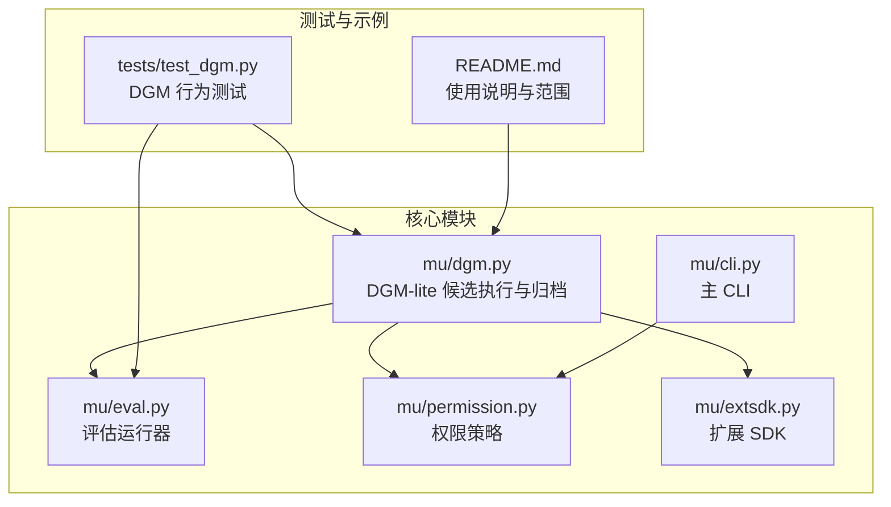
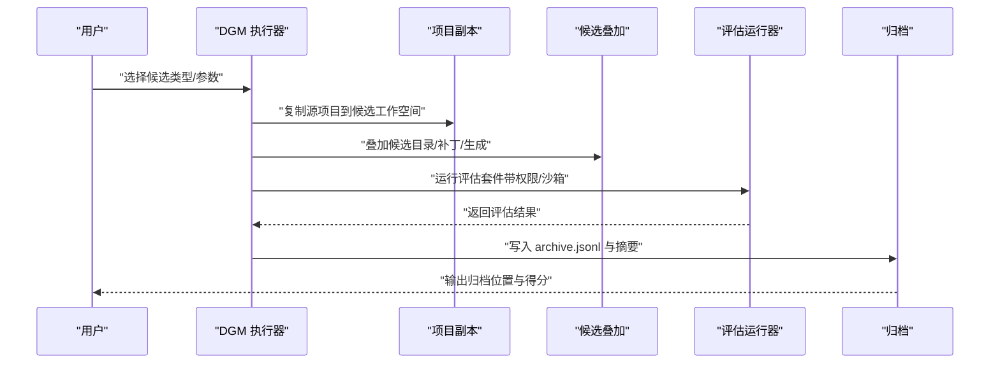
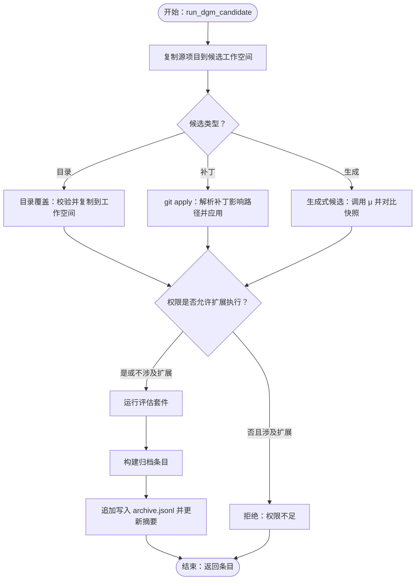
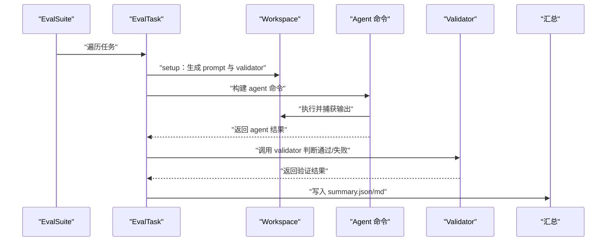
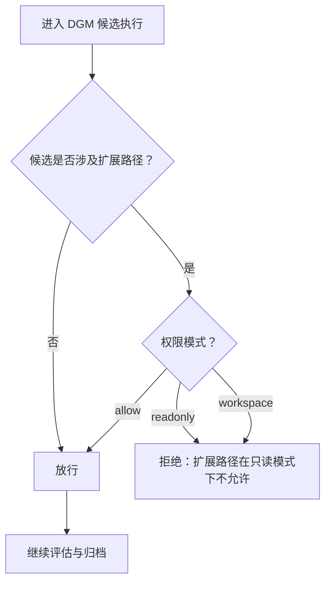
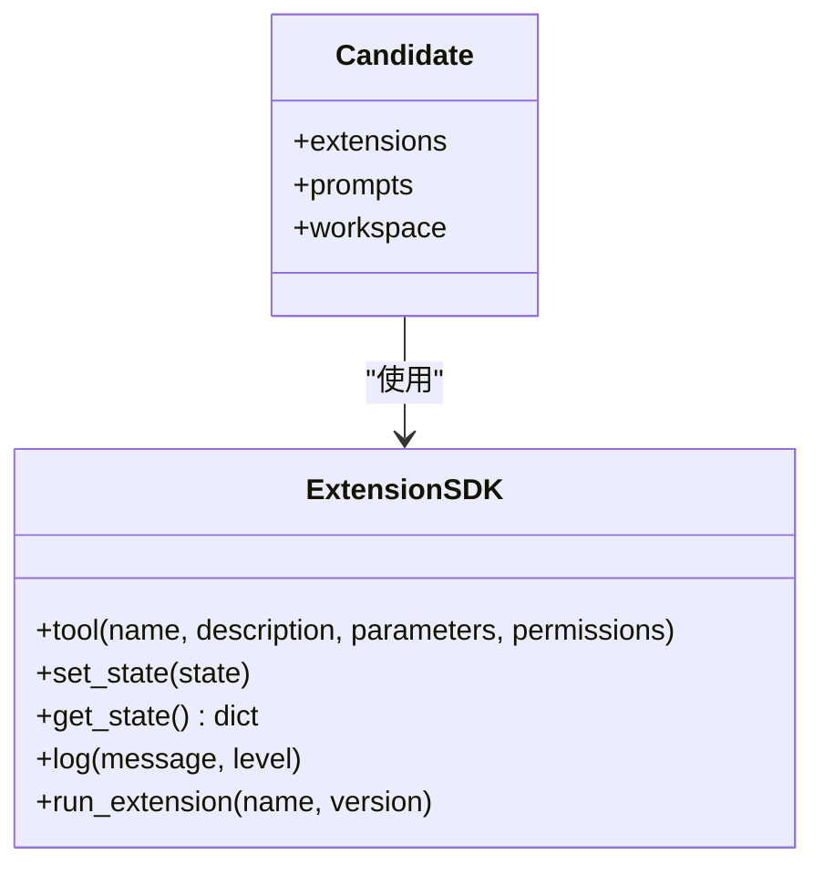
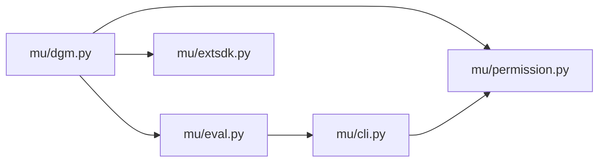

# DGM 系统

<cite>
**本文引用的文件**
- [mu/dgm.py](file://mu/dgm.py)
- [mu/eval.py](file://mu/eval.py)
- [mu/permission.py](file://mu/permission.py)
- [mu/extsdk.py](file://mu/extsdk.py)
- [mu/cli.py](file://mu/cli.py)
- [tests/test_dgm.py](file://tests/test_dgm.py)
- [README.md](file://README.md)
</cite>

## 目录
1. [简介](#简介)
2. [项目结构](#项目结构)
3. [核心组件](#核心组件)
4. [架构总览](#架构总览)
5. [详细组件分析](#详细组件分析)
6. [依赖分析](#依赖分析)
7. [性能考量](#性能考量)
8. [故障排查指南](#故障排查指南)
9. [结论](#结论)
10. [附录](#附录)

## 简介
本文件面向 μ (mu) DGM（设计生成方法）系统，聚焦 DGM-lite 基座的设计理念与实现原理，系统阐述以下主题：
- 候选隔离验证与 append-only archive 机制
- 项目复制、覆盖与补丁应用的工作流程
- 候选目录的管理、描述信息与版本控制
- DGM 工作流的使用指南与最佳实践
- 与评估套件的集成关系
- 权限控制对 DGM 操作的影响与安全考虑

DGM-lite 的核心思想是“在复制的工作空间中叠加候选变更，运行统一评估套件进行隔离验证，通过项只归档不自动应用回主仓库”，从而在保障主仓库稳定的同时，系统化探索与沉淀高质量设计。

## 项目结构
- 核心模块
  - mu/dgm.py：DGM-lite 候选执行、复制、叠加、评估与归档的完整实现
  - mu/eval.py：通用评估运行器，支持任务定义、执行、汇总与敏感信息脱敏
  - mu/permission.py：权限策略（allow/readonly/workspace），用于限制工具能力
  - mu/extsdk.py：扩展 SDK，支撑扩展工具声明与 JSONL 协议通信
  - mu/cli.py：μ 主 CLI，承载权限/沙箱/会话等参数解析与运行入口
- 测试与示例
  - tests/test_dgm.py：针对 DGM 行为的单元测试，覆盖复制、叠加、补丁、路径校验、权限拦截等
  - README.md：项目总体说明，包含 DGM 使用示例与范围说明

**图表来源**
- [mu/dgm.py](file://mu/dgm.py)
- [mu/eval.py](file://mu/eval.py)
- [mu/permission.py](file://mu/permission.py)
- [mu/extsdk.py](file://mu/extsdk.py)
- [mu/cli.py](file://mu/cli.py)
- [tests/test_dgm.py](file://tests/test_dgm.py)
- [README.md](file://README.md)

**章节来源**
- [README.md](file://README.md)
- [mu/dgm.py](file://mu/dgm.py)
- [mu/eval.py](file://mu/eval.py)
- [mu/permission.py](file://mu/permission.py)
- [mu/extsdk.py](file://mu/extsdk.py)
- [mu/cli.py](file://mu/cli.py)
- [tests/test_dgm.py](file://tests/test_dgm.py)

## 核心组件
- DGM 候选执行器
  - 负责复制源项目、叠加候选（目录覆盖、补丁应用、生成式候选）、运行评估套件、构建归档条目并写入 append-only archive
- 评估运行器
  - 提供统一的 EvalSuite/EvalTask/EvalRun 抽象，封装 agent 命令构建、超时控制、验证逻辑、结果汇总与敏感信息脱敏
- 权限策略
  - 基于能力（capabilities）的 gate，支持 allow、readonly、workspace 三种模式，严格限制 write/shell/code/extension 等高风险能力
- 扩展 SDK
  - 为扩展作者提供工具声明与 JSONL 协议支持，扩展在独立子进程中运行，便于隔离与可观测
- 主 CLI
  - 解析任务、会话、权限、沙箱等参数，驱动 Agent 执行并在 headless/TUI 模式间切换

**章节来源**
- [mu/dgm.py](file://mu/dgm.py)
- [mu/eval.py](file://mu/eval.py)
- [mu/permission.py](file://mu/permission.py)
- [mu/extsdk.py](file://mu/extsdk.py)
- [mu/cli.py](file://mu/cli.py)

## 架构总览
DGM-lite 将“候选叠加—评估—归档”作为闭环：候选在复制的工作空间中被叠加，评估在该工作空间内执行，结果以不可变形式追加写入 archive.jsonl，并生成最新摘要。评估套件与权限策略贯穿其中，确保可控与安全。

**图表来源**
- [mu/dgm.py](file://mu/dgm.py)
- [mu/eval.py](file://mu/eval.py)
- [mu/permission.py](file://mu/permission.py)

## 详细组件分析

### DGM 候选执行与归档
- 候选来源与叠加
  - 目录覆盖：将允许范围内的候选文件复制到工作空间
  - 补丁应用：解析补丁影响的路径，使用 git apply 应用到工作空间
  - 生成式候选：在工作空间内调用 μ 以生成扩展/提示词候选，并通过快照对比确定变更
- 路径与范围校验
  - 严格限制候选路径范围：.mu/extensions/*.py、.mu/prompts/*.{md,txt}、extensions/*.{py,md,txt}
  - 对扩展路径有额外校验，防止在受限权限下执行扩展
- 评估与归档
  - 评估在候选工作空间内执行，结果汇总后生成 DgmArchiveEntry
  - 归档采用 append-only JSONL，同时维护 latest-summary.json/md，标记当前 best 候选
- 安全与权限
  - 在非 allow 权限下，若候选涉及扩展路径，则直接拒绝，避免绕过权限边界

**图表来源**
- [mu/dgm.py](file://mu/dgm.py)

**章节来源**
- [mu/dgm.py](file://mu/dgm.py)

### 评估运行器与套件
- 任务抽象
  - EvalTask 定义任务名称、setup 函数（生成 prompt 与 validator）与超时
  - EvalSuite 聚合多个任务
- 执行流程
  - 为每个任务创建独立 workspace，写入 task_prompt.txt
  - 通过 agent_cmd_builder 构建命令，subprocess 执行并捕获 stdout/stderr
  - 调用 validator 判断通过/失败，记录 attribution 信息
- 汇总与脱敏
  - 生成 summary.json/md，脱敏敏感信息（如 API Key）
  - 评估运行器还负责构建 agent 环境变量，确保模型相关环境变量可用

**图表来源**
- [mu/eval.py](file://mu/eval.py)

**章节来源**
- [mu/eval.py](file://mu/eval.py)

### 权限策略与安全
- 能力模型
  - 支持 WRITE、SHELL、CODE_EXEC、EXTENSION_EXEC 等能力
  - readonly 模式完全阻断上述能力
  - workspace 模式仅允许在工作空间内进行 write，但对 shell/code/extension 仍不可约束
- DGM 中的应用
  - 当 permission 非 allow 且候选涉及扩展路径时，直接拒绝，避免绕过权限边界
- 与 CLI 的集成
  - CLI 提供 --permission 参数，贯穿到 Agent/Session 生命周期

**图表来源**
- [mu/dgm.py](file://mu/dgm.py)
- [mu/permission.py](file://mu/permission.py)

**章节来源**
- [mu/dgm.py](file://mu/dgm.py)
- [mu/permission.py](file://mu/permission.py)
- [mu/cli.py](file://mu/cli.py)

### 扩展 SDK 与候选生态
- 扩展声明
  - 使用 @tool 装饰器声明工具，支持参数 schema 与权限列表
- 协议与生命周期
  - 首行输出 manifest，随后通过 JSONL 交换 init/execute/shutdown 等消息
  - 支持 set_state/get_state 持久化状态，log 输出日志
- 在 DGM 中的作用
  - 候选可包含扩展与提示词，DGM 通过 extra_env 注入 MU_EXT_DIR/MU_PROMPT_SNIPPET_DIR，使评估阶段可见

**图表来源**
- [mu/extsdk.py](file://mu/extsdk.py)
- [mu/dgm.py](file://mu/dgm.py)

**章节来源**
- [mu/extsdk.py](file://mu/extsdk.py)
- [mu/dgm.py](file://mu/dgm.py)

## 依赖分析
- 模块耦合
  - DGM 依赖评估运行器（EvalSuite/EvalRun）与权限策略（make_policy）
  - 评估运行器依赖 agent 命令构建器与 validator，负责输出与脱敏
  - CLI 依赖权限策略与环境构建，驱动 Agent 执行
- 外部依赖
  - git apply 用于补丁应用
  - subprocess 用于执行 agent 与 pytest
  - 文件系统用于复制、快照与归档

**图表来源**
- [mu/dgm.py](file://mu/dgm.py)
- [mu/eval.py](file://mu/eval.py)
- [mu/permission.py](file://mu/permission.py)
- [mu/extsdk.py](file://mu/extsdk.py)
- [mu/cli.py](file://mu/cli.py)

**章节来源**
- [mu/dgm.py](file://mu/dgm.py)
- [mu/eval.py](file://mu/eval.py)
- [mu/permission.py](file://mu/permission.py)
- [mu/extsdk.py](file://mu/extsdk.py)
- [mu/cli.py](file://mu/cli.py)

## 性能考量
- 候选复制
  - 使用 copytree 并忽略特定目录与 .egg-info，减少无关文件拷贝
- 快照对比
  - 仅对工作空间内文件计算 SHA256，增量识别变更路径
- 评估执行
  - 每任务独立 workspace，避免相互干扰；超时控制防止长时间卡顿
- 归档写入
  - 追加写入 JSONL，避免重复扫描；摘要文件定期更新

[本节为通用指导，不直接分析具体文件]

## 故障排查指南
- 常见错误与定位
  - DgmConfigError：通常由候选路径不在允许范围内、补丁未触达允许路径、生成候选缺少必要环境变量等触发
  - EvalConfigError：评估运行时缺少模型相关环境变量或任务选择无效
- 测试用例参考
  - 目录覆盖与归档：验证候选复制、变更路径、归档条目与摘要
  - 补丁应用：验证补丁解析与 git apply 成功
  - 路径校验：核心文件路径被拒绝
  - 权限拦截：在 readonly/workspace 下扩展候选被拒绝
- 排查步骤
  - 检查候选路径是否在允许范围内
  - 确认权限模式与候选类型匹配
  - 查看评估运行目录中的 stdout/stderr/validation 文件
  - 核对 archive.jsonl 与 latest-summary.md 是否包含敏感信息泄露

**章节来源**
- [tests/test_dgm.py](file://tests/test_dgm.py)
- [mu/dgm.py](file://mu/dgm.py)
- [mu/eval.py](file://mu/eval.py)

## 结论
DGM-lite 通过“复制—叠加—评估—归档”的闭环，实现了对设计候选的系统化验证与沉淀。严格的路径范围与权限策略确保了在探索过程中的安全性与可控性；评估运行器提供了统一、可观测的验证框架；扩展 SDK 为候选生态提供了可扩展能力。结合 README 中的使用示例，用户可以快速上手并形成稳定的 DGM 工作流。

[本节为总结性内容，不直接分析具体文件]

## 附录

### 使用指南与最佳实践
- 基本用法
  - 目录候选：将允许范围内的候选文件放入目录，使用 --candidate-dir 指定
  - 补丁候选：准备 diff 文件，使用 --patch 指定
  - 生成式候选：提供生成提示，使用 --generate
- 最佳实践
  - 候选范围严格限制在 .mu/extensions、.mu/prompts、extensions
  - 在 readonly/workspace 下避免扩展候选，确保权限边界
  - 使用 --timeout 控制单任务超时，避免长时间卡顿
  - 定期检查 archive.jsonl 与 latest-summary.md，关注 best 候选变化
- 示例路径参考
  - 目录候选示例与补丁候选示例可参考测试用例与 README 中的命令

**章节来源**
- [README.md](file://README.md)
- [tests/test_dgm.py](file://tests/test_dgm.py)
- [mu/dgm.py](file://mu/dgm.py)