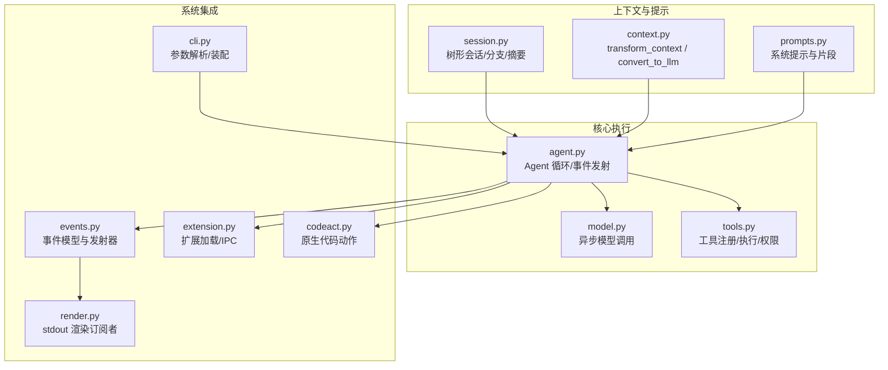
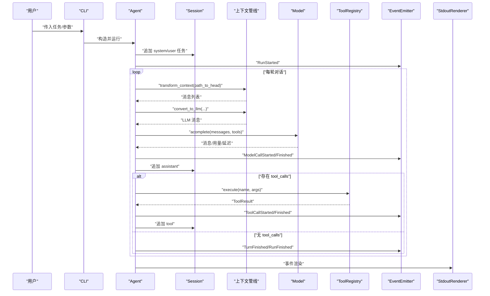
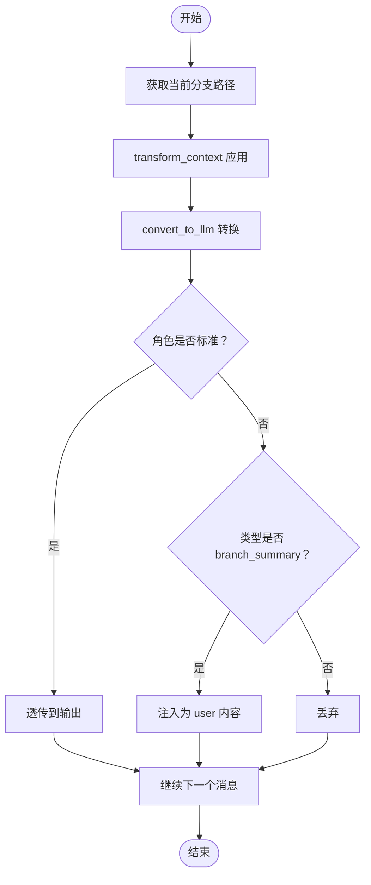
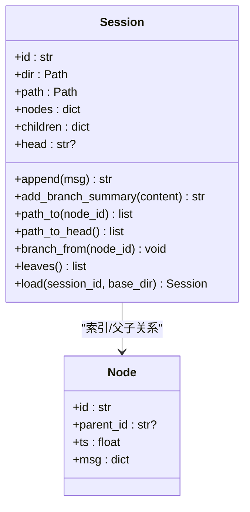
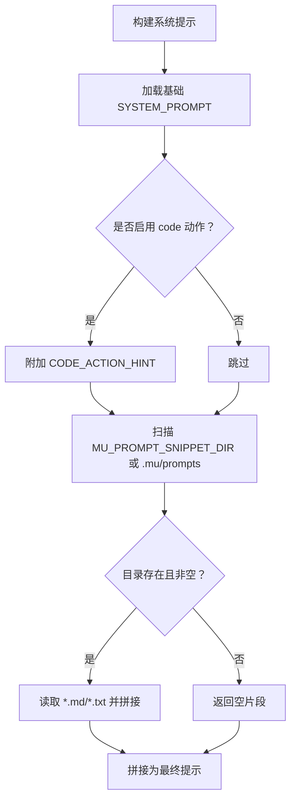
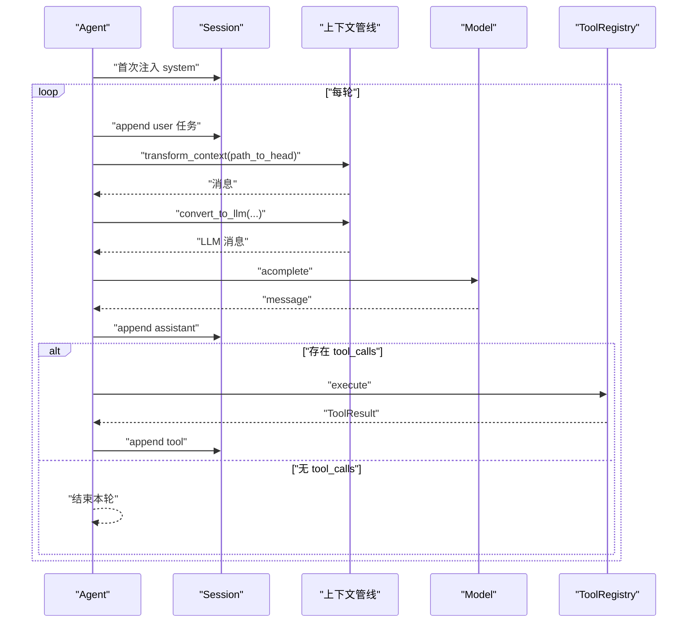
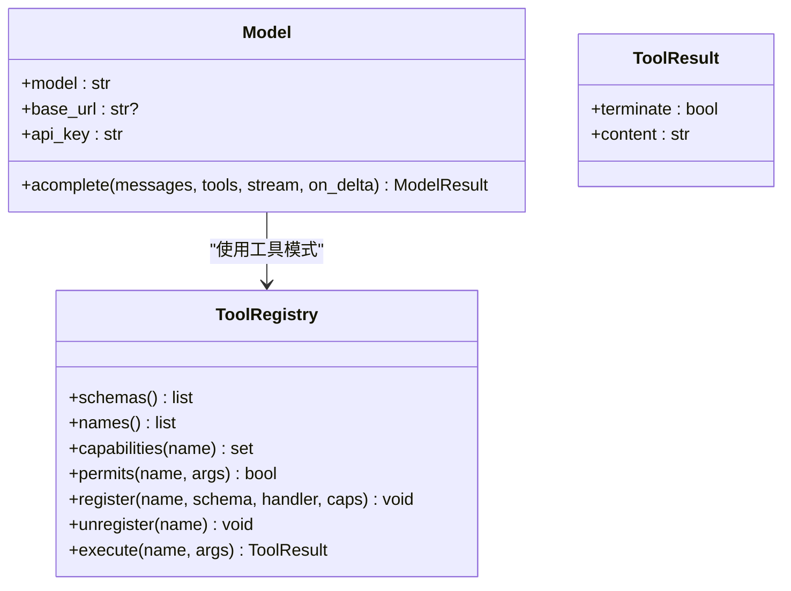
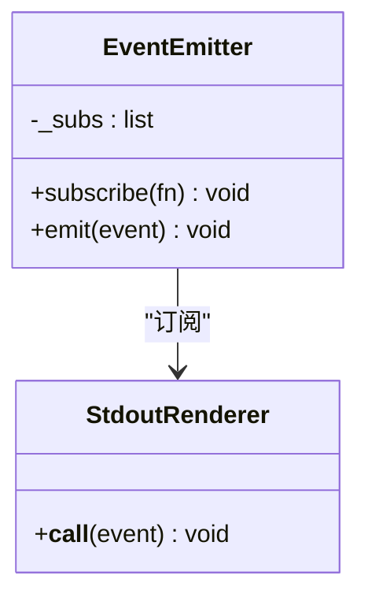
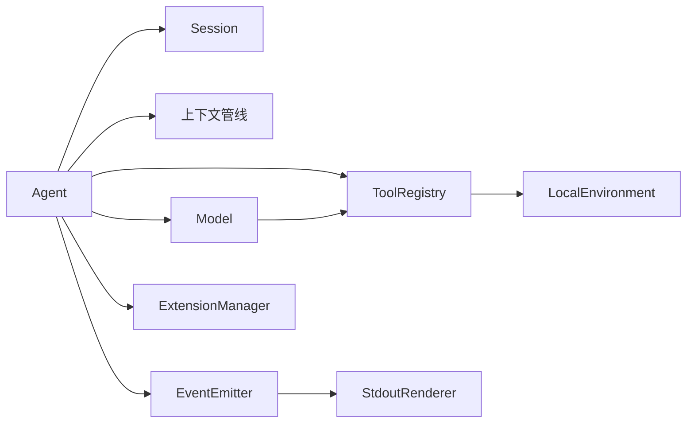

# 上下文管理

<cite>
**本文引用的文件**
- [mu/context.py](file://mu/context.py)
- [mu/session.py](file://mu/session.py)
- [mu/prompts.py](file://mu/prompts.py)
- [mu/agent.py](file://mu/agent.py)
- [mu/model.py](file://mu/model.py)
- [mu/tools.py](file://mu/tools.py)
- [mu/events.py](file://mu/events.py)
- [mu/cli.py](file://mu/cli.py)
- [mu/render.py](file://mu/render.py)
- [mu/extension.py](file://mu/extension.py)
- [mu/codeact.py](file://mu/codeact.py)
- [tests/test_context.py](file://tests/test_context.py)
- [tests/test_session.py](file://tests/test_session.py)
</cite>

## 目录
1. [引言](#引言)
2. [项目结构](#项目结构)
3. [核心组件](#核心组件)
4. [架构总览](#架构总览)
5. [组件详解](#组件详解)
6. [依赖关系分析](#依赖关系分析)
7. [性能考量](#性能考量)
8. [故障排查指南](#故障排查指南)
9. [结论](#结论)
10. [附录](#附录)

## 引言
本文件系统性阐述 μ（mu）上下文管理系统的实现与使用，聚焦以下主题：
- 上下文定义与管线：transform_context 与 convert_to_llm 的职责、数据流转与扩展点
- 提示词管理：系统提示的构建、提示词片段的动态注入与组织
- 环境变量处理：模型与运行时参数的环境变量注入与安全控制
- 会话与分支：基于树形会话的消息持久化、分支与摘要注入
- 事件系统与工具系统：事件驱动的可观测性与工具注册/执行
- 最佳实践与性能优化：配置、安全与吞吐建议
- 使用场景与示例：结合 CLI 与测试用例的实际应用

## 项目结构
μ 的上下文管理涉及如下模块：
- 上下文管线：context.py
- 会话与分支：session.py
- 提示词与模板：prompts.py
- 代理与循环：agent.py
- 模型调用：model.py
- 工具与权限：tools.py
- 事件系统：events.py
- CLI 入口与装配：cli.py
- 输出渲染：render.py
- 扩展管理：extension.py
- 原生代码动作（M3.5）：codeact.py

图表来源
- [mu/context.py:1-31](file://mu/context.py#L1-L31)
- [mu/session.py:1-115](file://mu/session.py#L1-L115)
- [mu/prompts.py:1-60](file://mu/prompts.py#L1-L60)
- [mu/agent.py:1-223](file://mu/agent.py#L1-L223)
- [mu/model.py:1-147](file://mu/model.py#L1-L147)
- [mu/tools.py:1-269](file://mu/tools.py#L1-L269)
- [mu/events.py:1-133](file://mu/events.py#L1-L133)
- [mu/render.py:1-78](file://mu/render.py#L1-L78)
- [mu/extension.py:1-364](file://mu/extension.py#L1-L364)
- [mu/codeact.py:1-133](file://mu/codeact.py#L1-L133)
- [mu/cli.py:1-134](file://mu/cli.py#L1-L134)

章节来源
- [mu/context.py:1-31](file://mu/context.py#L1-L31)
- [mu/session.py:1-115](file://mu/session.py#L1-L115)
- [mu/prompts.py:1-60](file://mu/prompts.py#L1-L60)
- [mu/agent.py:1-223](file://mu/agent.py#L1-L223)
- [mu/model.py:1-147](file://mu/model.py#L1-L147)
- [mu/tools.py:1-269](file://mu/tools.py#L1-L269)
- [mu/events.py:1-133](file://mu/events.py#L1-L133)
- [mu/render.py:1-78](file://mu/render.py#L1-L78)
- [mu/extension.py:1-364](file://mu/extension.py#L1-L364)
- [mu/codeact.py:1-133](file://mu/codeact.py#L1-L133)
- [mu/cli.py:1-134](file://mu/cli.py#L1-L134)

## 核心组件
- 上下文管线
  - transform_context：M1 默认为恒等变换，预留压缩/裁剪/注入的钩子
  - convert_to_llm：将内部历史转换为 OpenAI 格式消息列表，标准角色透传，自定义类型按规则注入或丢弃
- 会话与分支
  - Session：以 JSONL 持久化的树形消息存储，支持从任意节点分叉、回溯路径、追加分支摘要
- 提示词与模板
  - 系统提示：简洁明确的工具能力声明
  - 片段注入：通过环境变量或指定目录加载 .md/.txt 片段，拼接至系统提示
- 代理与循环
  - Agent：围绕 Session 与事件发射器的异步 while 循环，调用上下文管线与模型，顺序执行工具调用
- 模型与工具
  - Model：封装异步 OpenAI 兼容客户端，支持流式累积与用量统计
  - ToolRegistry：内置 read/write/edit/bash 与权限策略，支持动态注册扩展工具
- 事件系统与渲染
  - EventEmitter：同步事件总线，StdoutRenderer 将事件渲染为人类可读输出
- 扩展与原生代码动作
  - ExtensionManager：扩展子进程生命周期与 IPC，支持加载/重载/卸载与状态恢复
  - CodeAction：在单轮对话中组合多个工具调用的原生代码动作（M3.5）

章节来源
- [mu/context.py:15-31](file://mu/context.py#L15-L31)
- [mu/session.py:38-115](file://mu/session.py#L38-L115)
- [mu/prompts.py:32-60](file://mu/prompts.py#L32-L60)
- [mu/agent.py:43-223](file://mu/agent.py#L43-L223)
- [mu/model.py:91-147](file://mu/model.py#L91-L147)
- [mu/tools.py:191-269](file://mu/tools.py#L191-L269)
- [mu/events.py:121-133](file://mu/events.py#L121-L133)
- [mu/render.py:31-78](file://mu/render.py#L31-L78)
- [mu/extension.py:85-364](file://mu/extension.py#L85-L364)
- [mu/codeact.py:84-133](file://mu/codeact.py#L84-L133)

## 架构总览
上下文管理贯穿“会话 → 上下文管线 → 模型调用 → 工具执行 → 事件渲染”的闭环。

图表来源
- [mu/agent.py:82-133](file://mu/agent.py#L82-L133)
- [mu/context.py:15-31](file://mu/context.py#L15-L31)
- [mu/model.py:112-147](file://mu/model.py#L112-L147)
- [mu/tools.py:253-269](file://mu/tools.py#L253-L269)
- [mu/events.py:121-133](file://mu/events.py#L121-L133)
- [mu/render.py:36-78](file://mu/render.py#L36-L78)

## 组件详解

### 上下文管线：transform_context 与 convert_to_llm
- transform_context
  - 默认行为：恒等映射，保留未来压缩/裁剪/注入的扩展点
  - 输入/输出：消息列表（字典数组）
- convert_to_llm
  - 标准角色透传：system/user/assistant/tool
  - 自定义类型处理：
    - branch_summary：注入为 user 角色内容，用于将侧分支结论带回主线
    - 其他未知类型：丢弃，不进入 LLM 上下文
  - 作用：将内部历史转换为 LLM 可消费的 OpenAI 格式

图表来源
- [mu/context.py:15-31](file://mu/context.py#L15-L31)

章节来源
- [mu/context.py:15-31](file://mu/context.py#L15-L31)
- [tests/test_context.py:7-40](file://tests/test_context.py#L7-L40)

### 会话与分支：树形消息存储与摘要注入
- Session
  - 追加只读历史：append 返回节点 id，维护 nodes/children/head
  - 路径回溯：path_to/head 生成当前分支线性历史
  - 分支：branch_from 将 head 移动到指定节点，形成新分支
  - 分支摘要：add_branch_summary 追加自定义消息 type:"branch_summary"，由 convert_to_llm 注入 LLM 上下文
- 目录与持久化
  - 默认目录：MU_SESSION_DIR 或当前工作目录下的 .mu/sessions
  - 每条消息一行 JSONL，KV-cache 友好，便于复现

图表来源
- [mu/session.py:30-115](file://mu/session.py#L30-L115)

章节来源
- [mu/session.py:38-115](file://mu/session.py#L38-L115)
- [tests/test_session.py:7-59](file://tests/test_session.py#L7-L59)

### 提示词与模板：系统提示与片段注入
- 系统提示
  - 明确列出可用工具（read/write/edit/bash），强调绝对路径、逐步工作与简洁回复
- 片段注入
  - 通过环境变量 MU_PROMPT_SNIPPET_DIR 或默认 .mu/prompts 目录加载 *.md/*.txt
  - 按文件名排序拼接，形成可选增强提示
- 动态生成
  - build_system_prompt(code_action) 可选择性加入 code 动作提示

图表来源
- [mu/prompts.py:32-60](file://mu/prompts.py#L32-L60)

章节来源
- [mu/prompts.py:1-60](file://mu/prompts.py#L1-L60)

### 代理与循环：上下文管线的调用时机
- 初始化
  - 首次运行注入 system 消息（来自 build_system_prompt）
  - 可选加载扩展（受权限策略约束）
- 主循环
  - 每轮：transform_context → convert_to_llm → 模型调用 → 追加 assistant
  - 若 assistant 包含 tool_calls：顺序执行工具，追加 tool 结果
  - 无 tool_calls：结束本轮并发出 RunFinished
- 取消与异常
  - 支持 asyncio.CancelledError，发出 RunAborted 并清理扩展子进程

图表来源
- [mu/agent.py:82-133](file://mu/agent.py#L82-L133)
- [mu/context.py:15-31](file://mu/context.py#L15-L31)
- [mu/model.py:112-147](file://mu/model.py#L112-L147)
- [mu/tools.py:253-269](file://mu/tools.py#L253-L269)

章节来源
- [mu/agent.py:43-223](file://mu/agent.py#L43-L223)

### 模型与工具：环境变量注入与安全控制
- 模型配置
  - 通过 MU_MODEL/MU_BASE_URL/MU_API_KEY 或 OPENAI_API_KEY 注入
  - 缺少任一关键配置将抛出配置错误
- 工具与权限
  - 内置工具：read/write/edit/bash
  - 权限策略：按“能力”维度 gate，扩展工具默认保守能力集
  - 执行流程：策略检查 → handler 执行 → 结果包装为 ToolResult（可带 terminate）

图表来源
- [mu/model.py:91-147](file://mu/model.py#L91-L147)
- [mu/tools.py:191-269](file://mu/tools.py#L191-L269)

章节来源
- [mu/model.py:91-147](file://mu/model.py#L91-L147)
- [mu/tools.py:191-269](file://mu/tools.py#L191-L269)

### 事件系统与渲染：结构化事件与订阅
- 事件类型
  - RunStarted/TurnStarted/ModelCallStarted/Finished
  - AssistantText/Delta、ToolCallStarted/Finished
  - ExtensionLoaded/Unloaded/Log/Error
  - RunAborted、ErrorEvent
- 订阅者
  - StdoutRenderer：将事件渲染为纯文本，支持流式增量
- 同步分发
  - EventEmitter 采用同步订阅与顺序分发，避免引入复杂 pub/sub

图表来源
- [mu/events.py:121-133](file://mu/events.py#L121-L133)
- [mu/render.py:31-78](file://mu/render.py#L31-L78)

章节来源
- [mu/events.py:1-133](file://mu/events.py#L1-L133)
- [mu/render.py:1-78](file://mu/render.py#L1-L78)

### 扩展与原生代码动作：自延伸与隔离边界
- 扩展管理
  - 子进程长驻，JSONL IPC；支持 load/reload/unload/list
  - manifest 校验失败将清理进程并上报错误
  - 状态恢复：通过会话中的 ext_state 消息恢复扩展状态
- 原生代码动作（CodeAction）
  - 在单轮对话中组合多个工具调用，提升吞吐
  - 通过 _MuApi 将线程内调用 marshaled 回事件循环执行
  - 软超时：线程内超时后阻止进一步工具调用，但无法硬停止线程内 I/O

章节来源
- [mu/extension.py:85-364](file://mu/extension.py#L85-L364)
- [mu/codeact.py:84-133](file://mu/codeact.py#L84-L133)

## 依赖关系分析
- 组件耦合
  - Agent 依赖 Session、上下文管线、Model、ToolRegistry、EventEmitter、ExtensionManager
  - Model 与 ToolRegistry 通过工具 schema 与权限策略协作
  - 上下文管线与会话紧密耦合：convert_to_llm 依赖 Session 中的自定义消息类型
- 外部依赖
  - OpenAI 异步 SDK
  - asyncio 与子进程/信号处理
- 潜在循环依赖
  - 未发现直接循环；事件渲染与 Agent 通过订阅解耦

图表来源
- [mu/agent.py:43-223](file://mu/agent.py#L43-L223)
- [mu/model.py:91-147](file://mu/model.py#L91-L147)
- [mu/tools.py:191-269](file://mu/tools.py#L191-L269)
- [mu/events.py:121-133](file://mu/events.py#L121-L133)
- [mu/render.py:31-78](file://mu/render.py#L31-L78)
- [mu/extension.py:85-364](file://mu/extension.py#L85-L364)

章节来源
- [mu/agent.py:43-223](file://mu/agent.py#L43-L223)
- [mu/model.py:91-147](file://mu/model.py#L91-L147)
- [mu/tools.py:191-269](file://mu/tools.py#L191-L269)
- [mu/events.py:121-133](file://mu/events.py#L121-L133)
- [mu/render.py:31-78](file://mu/render.py#L31-L78)
- [mu/extension.py:85-364](file://mu/extension.py#L85-L364)

## 性能考量
- 上下文管线
  - transform_context 默认恒等映射，开销极低；如需压缩/裁剪，建议在内存中进行 O(n) 遍历，避免重复序列化
- 会话持久化
  - JSONL 追加写入，KV-cache 友好；分支较多时注意路径回溯的线性成本
- 模型调用
  - 流式输出可降低首字节延迟；合理设置 stream/on_delta 回调频率
  - 用量统计与延迟记录可用于归因与性能分析
- 工具执行
  - 顺序执行工具调用，避免并发带来的锁争用；若扩展工具具备并发能力，可在策略层面放宽
- 扩展与代码动作
  - 扩展子进程 IPC 有固定开销；频繁调用建议合并工具调用（CodeAction）
  - 代码动作软超时后线程内 I/O 无法硬停止，建议在容器或沙箱中运行

## 故障排查指南
- 配置错误
  - 模型配置缺失：MU_MODEL 或 MU_API_KEY（或 OPENAI_API_KEY）未设置
  - 排查：检查环境变量与 .env 示例
- 会话错误
  - 会话不存在或节点无效：Session.load/branch_from 抛出 FileNotFoundError/KeyError
  - 排查：确认会话 ID 与节点 ID 正确
- 工具执行错误
  - 参数缺失或权限不足：ToolRegistry.execute 返回错误字符串
  - 排查：检查工具 schema 与权限策略
- 扩展加载失败
  - manifest 校验失败或进程异常退出：ExtensionManager 记录 ExtensionError 并清理
  - 排查：查看扩展日志与 stderr 输出
- 事件渲染问题
  - 流式增量渲染：确保 StdoutRenderer 正常订阅 EventEmitter

章节来源
- [mu/model.py:19-21](file://mu/model.py#L19-L21)
- [mu/cli.py:66-68](file://mu/cli.py#L66-L68)
- [mu/tools.py:253-269](file://mu/tools.py#L253-L269)
- [mu/extension.py:146-160](file://mu/extension.py#L146-L160)
- [mu/render.py:36-78](file://mu/render.py#L36-L78)

## 结论
μ 的上下文管理系统以“恒等变换 + 可插拔注入”为核心设计，结合树形会话与分支摘要，实现了可控的历史裁剪与知识注入。通过事件驱动与结构化提示词，系统在保持 Pi 哲学（朴素 while、无最大步数）的同时，提供了可观测性、可扩展性与可复现性。建议在生产环境中：
- 明确上下文压缩策略与注入规则
- 使用会话目录与分支摘要提升复盘效率
- 严格配置与权限策略，必要时启用沙箱
- 利用流式输出与 CodeAction 提升吞吐

## 附录

### 环境变量与配置要点
- 模型与运行时
  - MU_MODEL：模型名称
  - MU_BASE_URL：可选，自建兼容端点
  - MU_API_KEY 或 OPENAI_API_KEY：密钥
- 会话与扩展
  - MU_SESSION_DIR：会话目录
  - MU_EXT_DIR：扩展目录
- CLI 选项
  - --permission：权限策略（allow/readonly/workspace）
  - --sandbox：沙箱提供者（local/docker）
  - --stream：流式输出
  - --code：启用原生代码动作
  - --tui：启动 TUI（需要安装依赖）

章节来源
- [mu/model.py:98-110](file://mu/model.py#L98-L110)
- [mu/cli.py:26-39](file://mu/cli.py#L26-L39)
- [mu/cli.py:104-111](file://mu/cli.py#L104-L111)

### 使用场景与最佳实践
- 场景一：代码补全与验证
  - 使用 system 提示 + 片段注入，结合 bash 工具探索与验证
  - 建议开启流式输出，以便实时反馈
- 场景二：多分支探索与总结
  - 在分支中尝试不同方案，使用 summarize_branch 将结论注入主线
  - 通过 branch_summary 保持上下文连贯
- 场景三：扩展工具集成
  - 通过 ExtensionManager 动态加载扩展，注意权限策略与隔离边界
  - 使用 CodeAction 合并多次工具调用，减少往返次数
- 最佳实践
  - 明确提示词片段来源与作用域，避免污染主提示
  - 控制上下文长度，必要时在 transform_context 中裁剪
  - 使用会话持久化与分支摘要，便于复盘与回归
  - 严格配置校验与权限策略，优先使用沙箱/容器隔离

章节来源
- [mu/agent.py:82-133](file://mu/agent.py#L82-L133)
- [mu/session.py:175-199](file://mu/session.py#L175-L199)
- [mu/prompts.py:32-60](file://mu/prompts.py#L32-L60)
- [mu/extension.py:235-244](file://mu/extension.py#L235-L244)
- [mu/codeact.py:89-133](file://mu/codeact.py#L89-L133)