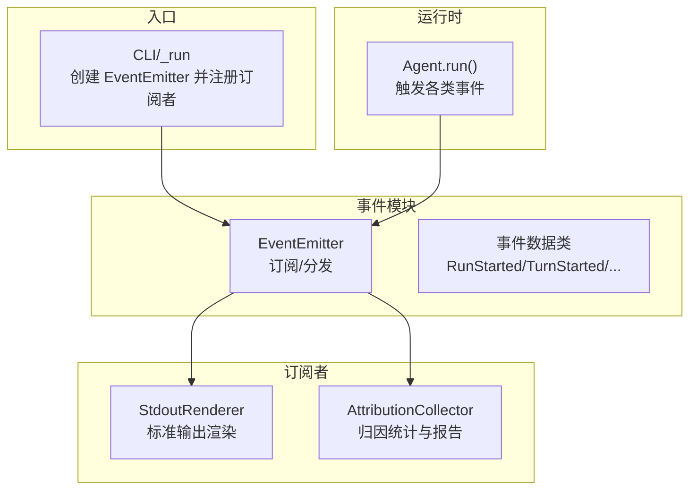
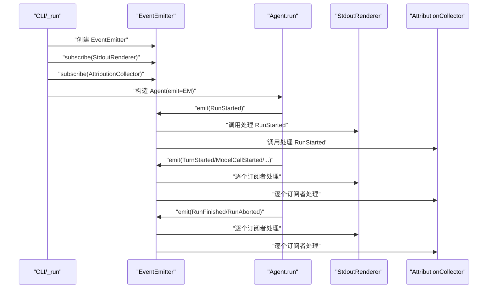
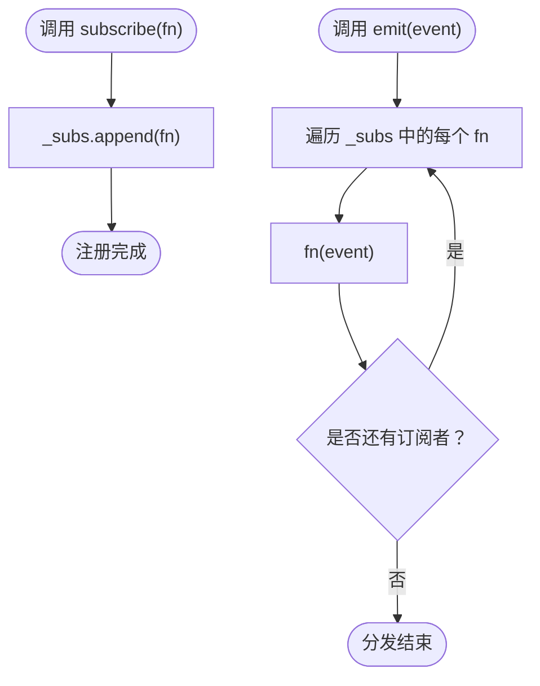
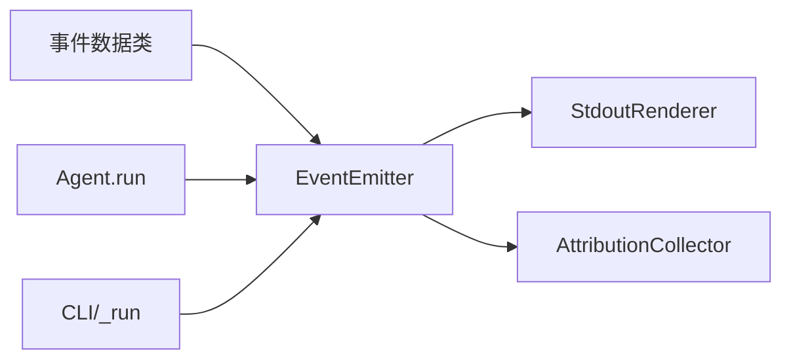

# 事件发射器

<cite>
**本文引用的文件**
- [mu/events.py](file://mu/events.py)
- [tests/test_events.py](file://tests/test_events.py)
- [mu/agent.py](file://mu/agent.py)
- [mu/cli.py](file://mu/cli.py)
- [mu/render.py](file://mu/render.py)
- [mu/observability.py](file://mu/observability.py)
- [mu/__init__.py](file://mu/__init__.py)
</cite>

## 目录
1. [简介](#简介)
2. [项目结构](#项目结构)
3. [核心组件](#核心组件)
4. [架构概览](#架构概览)
5. [详细组件分析](#详细组件分析)
6. [依赖分析](#依赖分析)
7. [性能考量](#性能考量)
8. [故障排查指南](#故障排查指南)
9. [结论](#结论)
10. [附录](#附录)

## 简介
本文件围绕 μ (mu) 事件系统中的 EventEmitter 类，提供一份面向工程实践与可维护性的技术文档。重点涵盖：
- 订阅者模式的实现原理与同步分发机制
- subscribe 方法的注册流程与 emit 方法的事件传播过程
- 事件发射器的内存管理与性能考虑
- 使用示例、最佳实践与错误处理策略
- 如何正确注册/注销订阅者，以及事件处理函数的编写规范

## 项目结构
EventEmitter 位于事件模块中，配合 Agent 循环在运行期发出各类结构化事件；CLI 层负责创建 EventEmitter 并注册订阅者（如 StdoutRenderer、AttributionCollector），从而实现“一次事件、多方消费”的可观测与可视化目标。

图表来源
- [mu/events.py:121-133](file://mu/events.py#L121-L133)
- [mu/agent.py:82-132](file://mu/agent.py#L82-L132)
- [mu/cli.py:70-72](file://mu/cli.py#L70-L72)
- [mu/render.py:31-78](file://mu/render.py#L31-L78)
- [mu/observability.py:26-90](file://mu/observability.py#L26-L90)

章节来源
- [mu/events.py:1-133](file://mu/events.py#L1-L133)
- [mu/agent.py:82-132](file://mu/agent.py#L82-L132)
- [mu/cli.py:65-83](file://mu/cli.py#L65-L83)
- [mu/render.py:1-78](file://mu/render.py#L1-L78)
- [mu/observability.py:1-90](file://mu/observability.py#L1-L90)

## 核心组件
- 事件数据类：以 dataclass 定义的事件类型，承载结构化信息（如任务标识、轮次、延迟、token 统计等）。
- 订阅者类型：Callable[[Event], None]，即接收事件对象并进行处理的回调。
- EventEmitter：提供 subscribe 注册与 emit 同步分发能力，内部维护订阅者列表，按注册顺序依次调用。

章节来源
- [mu/events.py:13-118](file://mu/events.py#L13-L118)
- [mu/events.py:118-133](file://mu/events.py#L118-L133)

## 架构概览
EventEmitter 采用“发布-订阅”中的“发布端”角色，Agent 在运行过程中产生事件并通过 emit 发布；CLI 创建 EventEmitter 并注册多个订阅者，形成“单源事件、多路消费”的架构。该设计避免引入外部消息中间件，降低复杂度，同时保证事件处理的轻量与可观察性。

图表来源
- [mu/cli.py:70-72](file://mu/cli.py#L70-L72)
- [mu/agent.py:82-132](file://mu/agent.py#L82-L132)
- [mu/events.py:121-133](file://mu/events.py#L121-L133)
- [mu/render.py:36-78](file://mu/render.py#L36-L78)
- [mu/observability.py:45-65](file://mu/observability.py#L45-L65)

## 详细组件分析

### EventEmitter 类
- 设计要点
  - 最小化：仅维护订阅者列表，提供 subscribe 与 emit 两个方法。
  - 同步分发：emit 时按注册顺序逐一调用订阅者，不引入并发或队列。
  - 无注销：当前实现未提供取消订阅接口，订阅者生命周期由上层管理。
- 数据结构
  - 订阅者集合：list[Subscriber]，顺序即分发顺序。
- 复杂度
  - 订阅：O(1) 追加
  - 分发：O(N) 遍历调用
- 错误处理
  - 当前实现不对订阅者异常进行捕获或隔离，任一订阅者抛错会导致分发中断；建议在订阅者内部做好健壮性处理。

```mermaid
classDiagram
class Event {
}
class RunStarted {
+string task
+string session_id
}
class TurnStarted {
+int turn
}
class ModelCallStarted {
+int turn
}
class ModelCallFinished {
+int turn
+float latency_s
+int|None prompt_tokens
+int|None completion_tokens
+int|None total_tokens
}
class AssistantText {
+string text
}
class AssistantTextDelta {
+string delta
}
class ToolCallStarted {
+string call_id
+string name
+string args_preview
}
class ToolCallFinished {
+string call_id
+string name
+string result
+float latency_s
+bool terminate
}
class TurnFinished {
+int turn
}
class RunFinished {
+string final_text
}
class RunAborted {
+string reason
}
class ErrorEvent {
+string message
}
class ExtensionLoaded {
+string name
+string version
+string[] tools
}
class ExtensionUnloaded {
+string name
}
class ExtensionLog {
+string name
+string level
+string message
}
class ExtensionError {
+string name
+string message
}
class EventEmitter {
-Subscriber[] _subs
+subscribe(fn : Subscriber) void
+emit(event : Event) void
}
class StdoutRenderer {
+__call__(event : Event) void
}
class AttributionCollector {
+__call__(event : Event) void
}
Event <|-- RunStarted
Event <|-- TurnStarted
Event <|-- ModelCallStarted
Event <|-- ModelCallFinished
Event <|-- AssistantText
Event <|-- AssistantTextDelta
Event <|-- ToolCallStarted
Event <|-- ToolCallFinished
Event <|-- TurnFinished
Event <|-- RunFinished
Event <|-- RunAborted
Event <|-- ErrorEvent
Event <|-- ExtensionLoaded
Event <|-- ExtensionUnloaded
Event <|-- ExtensionLog
Event <|-- ExtensionError
EventEmitter --> StdoutRenderer : "emit -> 调用"
EventEmitter --> AttributionCollector : "emit -> 调用"
```

图表来源
- [mu/events.py:13-118](file://mu/events.py#L13-L118)
- [mu/events.py:121-133](file://mu/events.py#L121-L133)
- [mu/render.py:31-78](file://mu/render.py#L31-L78)
- [mu/observability.py:26-90](file://mu/observability.py#L26-L90)

章节来源
- [mu/events.py:121-133](file://mu/events.py#L121-L133)

### 订阅者模式与同步分发
- 订阅流程
  - CLI 创建 EventEmitter 实例，并通过 subscribe 注册多个订阅者（例如 StdoutRenderer、AttributionCollector）。
  - 订阅者需实现 Callable[[Event], None] 接口，以便 EventEmitter 能够直接调用。
- 分发流程
  - Agent 在运行期间调用 emitter.emit(...) 发布事件。
  - EventEmitter 依次调用已注册的订阅者，保持严格的顺序一致性。
- 顺序保证
  - 测试覆盖了“按注册顺序分发至所有订阅者”的行为，确保订阅者对事件序列的依赖稳定可靠。

图表来源
- [mu/events.py:127-132](file://mu/events.py#L127-L132)
- [tests/test_events.py:7-21](file://tests/test_events.py#L7-L21)

章节来源
- [mu/events.py:121-133](file://mu/events.py#L121-L133)
- [tests/test_events.py:7-27](file://tests/test_events.py#L7-L27)

### 事件类型与使用场景
- 事件类型覆盖 Agent 生命周期的关键节点：RunStarted/TurnStarted/ModelCallStarted/ModelCallFinished/AssistantText/AssistantTextDelta/ToolCallStarted/ToolCallFinished/TurnFinished/RunFinished/RunAborted/ErrorEvent，以及扩展相关事件。
- 使用场景
  - StdoutRenderer：将事件转为人类可读的输出，支持流式增量（AssistantTextDelta）。
  - AttributionCollector：统计轮次、调用次数、耗时与 token，生成归因报告。
  - Agent.run：在循环中 emit 各类事件，驱动订阅者进行渲染与统计。

章节来源
- [mu/events.py:13-118](file://mu/events.py#L13-L118)
- [mu/render.py:36-78](file://mu/render.py#L36-L78)
- [mu/observability.py:45-65](file://mu/observability.py#L45-L65)
- [mu/agent.py:82-132](file://mu/agent.py#L82-L132)

## 依赖分析
- 内部依赖
  - EventEmitter 依赖事件数据类（dataclass）与类型别名 Subscriber。
  - Agent 依赖 EventEmitter 以发布事件；CLI 依赖 EventEmitter 以创建并注册订阅者。
- 外部依赖
  - 订阅者依赖标准库（如 sys、time）与事件模块。
- 耦合与内聚
  - EventEmitter 低耦合：仅依赖事件类型与回调签名。
  - 订阅者高内聚：各自专注单一职责（渲染/统计）。

图表来源
- [mu/events.py:13-118](file://mu/events.py#L13-L118)
- [mu/events.py:121-133](file://mu/events.py#L121-L133)
- [mu/render.py:31-78](file://mu/render.py#L31-L78)
- [mu/observability.py:26-90](file://mu/observability.py#L26-L90)
- [mu/agent.py:82-132](file://mu/agent.py#L82-L132)
- [mu/cli.py:70-72](file://mu/cli.py#L70-L72)

章节来源
- [mu/events.py:1-133](file://mu/events.py#L1-L133)
- [mu/agent.py:82-132](file://mu/agent.py#L82-L132)
- [mu/cli.py:65-83](file://mu/cli.py#L65-L83)
- [mu/render.py:1-78](file://mu/render.py#L1-L78)
- [mu/observability.py:1-90](file://mu/observability.py#L1-L90)

## 性能考量
- 时间复杂度
  - 订阅：O(1)，追加到列表尾部。
  - 分发：O(N)，N 为订阅者数量；由于同步顺序调用，无额外调度开销。
- 空间复杂度
  - O(N) 存储订阅者列表；事件对象为 dataclass，占用与字段数量线性相关。
- 同步分发的优势
  - 无锁、无队列、无并发，适合轻量处理（打印/统计），避免引入额外复杂度。
- 注意事项
  - 若订阅者处理逻辑较重，可能阻塞后续订阅者的处理；建议将重计算移至后台或异步任务，仅在订阅者中触发任务。
  - 订阅者内部应尽量避免抛错，否则会中断后续分发；可在订阅者中包裹 try/except 并记录日志。

[本节为通用性能讨论，无需特定文件来源]

## 故障排查指南
- 症状：emit 无输出
  - 检查是否已注册订阅者；测试用例验证“无订阅者时静默不报错”，但不会有任何输出。
- 症状：事件未按预期顺序到达
  - 确认订阅者注册顺序与期望一致；EventEmitter 严格按注册顺序分发。
- 症状：订阅者抛错导致后续订阅者未执行
  - 订阅者内部需自行捕获异常并记录日志，避免影响其他订阅者。
- 症状：内存持续增长
  - EventEmitter 仅持有订阅者引用；若订阅者内部缓存事件或状态，需在合适时机清理。
- 症状：CPU 占用偏高
  - 检查订阅者是否执行重计算或频繁 IO；将重任务异步化。

章节来源
- [tests/test_events.py:24-27](file://tests/test_events.py#L24-L27)
- [mu/events.py:121-133](file://mu/events.py#L121-L133)

## 结论
EventEmitter 提供了最小可用的同步事件总线，结合 Agent 的事件发布与 CLI 的订阅者注册，实现了“一次事件、多方消费”的可观测与可视化目标。其简洁的设计使得扩展与维护变得容易，同时通过测试保障了分发顺序与静默行为的正确性。在实际使用中，建议将订阅者处理逻辑保持轻量，并在订阅者内部做好健壮性与异常处理，以获得稳定的运行体验。

[本节为总结性内容，无需特定文件来源]

## 附录

### 使用示例与最佳实践
- 示例一：在 CLI 中创建 EventEmitter 并注册订阅者
  - 步骤
    - 创建 EventEmitter 实例
    - 调用 subscribe 注册 StdoutRenderer 与 AttributionCollector
    - 将 EventEmitter 传递给 Agent 构造函数
    - 在 Agent.run 中 emit 各类事件
  - 参考路径
    - [mu/cli.py:70-72](file://mu/cli.py#L70-L72)
    - [mu/agent.py:82-132](file://mu/agent.py#L82-L132)

- 示例二：编写自定义订阅者
  - 规范
    - 实现 Callable[[Event], None] 接口
    - 对不同事件类型进行分支处理
    - 处理流式事件（如 AssistantTextDelta）时注意换行与刷新
    - 内部做好异常捕获与日志记录
  - 参考路径
    - [mu/render.py:36-78](file://mu/render.py#L36-L78)
    - [mu/observability.py:45-65](file://mu/observability.py#L45-L65)

- 示例三：单元测试验证分发顺序
  - 行为
    - 注册多个订阅者，分别收集事件
    - emit 多个事件，断言每个订阅者均按顺序收到
  - 参考路径
    - [tests/test_events.py:7-21](file://tests/test_events.py#L7-L21)

- 最佳实践清单
  - 订阅者职责单一：一个订阅者只做一件事（渲染/统计/日志）
  - 轻量处理：避免在订阅者中执行重计算或阻塞 IO
  - 异常隔离：订阅者内部 try/except 并记录错误，不影响其他订阅者
  - 顺序敏感：若业务强依赖事件顺序，确保订阅者注册顺序与期望一致
  - 生命周期管理：EventEmitter 不提供取消订阅，订阅者生命周期由上层控制

章节来源
- [mu/cli.py:70-72](file://mu/cli.py#L70-L72)
- [mu/agent.py:82-132](file://mu/agent.py#L82-L132)
- [mu/render.py:36-78](file://mu/render.py#L36-L78)
- [mu/observability.py:45-65](file://mu/observability.py#L45-L65)
- [tests/test_events.py:7-21](file://tests/test_events.py#L7-L21)