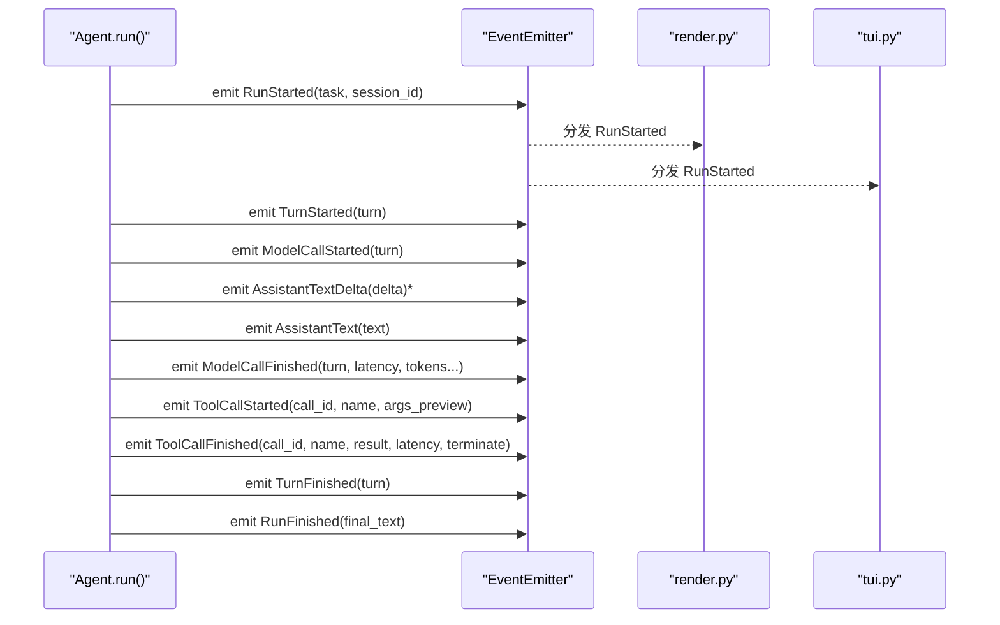

# 事件类型定义

<cite>
**本文引用的文件列表**
- [mu/events.py](file://mu/events.py)
- [mu/agent.py](file://mu/agent.py)
- [mu/render.py](file://mu/render.py)
- [mu/tui.py](file://mu/tui.py)
- [mu/extension.py](file://mu/extension.py)
- [tests/test_events.py](file://tests/test_events.py)
</cite>

## 目录
1. [简介](#简介)
2. [项目结构](#项目结构)
3. [核心组件](#核心组件)
4. [架构总览](#架构总览)
5. [详细组件分析](#详细组件分析)
6. [依赖分析](#依赖分析)
7. [性能考虑](#性能考虑)
8. [故障排查指南](#故障排查指南)
9. [结论](#结论)
10. [附录](#附录)

## 简介
本文件面向 μ（mu）事件系统中的事件类型，系统性梳理事件类的定义、字段语义、使用场景与继承体系，并结合渲染器与 TUI 的订阅行为，给出事件流转时序与典型使用示例，帮助开发者在智能体循环中正确地创建与消费事件。

## 项目结构
事件系统位于 mu/events.py，围绕 dataclass 定义的事件类型与同步事件总线 EventEmitter 构建。Agent 在其主循环中按阶段 emit 事件，渲染器与 TUI 订阅这些事件以驱动 UI 输出与统计。

```mermaid
graph TB
subgraph "事件定义"
Evt["Event 基类"]
RS["RunStarted"]
TS["TurnStarted"]
MCS["ModelCallStarted"]
MCF["ModelCallFinished"]
AT["AssistantText"]
ATD["AssistantTextDelta"]
TCS["ToolCallStarted"]
TCF["ToolCallFinished"]
TF["TurnFinished"]
RF["RunFinished"]
RA["RunAborted"]
EE["ErrorEvent"]
EL["ExtensionLoaded"]
EU["ExtensionUnloaded"]
EXL["ExtensionLog"]
EXE["ExtensionError"]
end
subgraph "事件总线"
EEvt["EventEmitter"]
end
subgraph "订阅者"
R["render.py 渲染器"]
TUI["tui.py TUI"]
end
Evt --> RS
Evt --> TS
Evt --> MCS
Evt --> MCF
Evt --> AT
Evt --> ATD
Evt --> TCS
Evt --> TCF
Evt --> TF
Evt --> RF
Evt --> RA
Evt --> EE
Evt --> EL
Evt --> EU
Evt --> EXL
Evt --> EXE
EEvt --> RS
EEvt --> TS
EEvt --> MCS
EEvt --> MCF
EEvt --> AT
EEvt --> ATD
EEvt --> TCS
EEvt --> TCF
EEvt --> TF
EEvt --> RF
EEvt --> RA
EEvt --> EE
EEvt --> EL
EEvt --> EU
EEvt --> EXL
EEvt --> EXE
RS --> R
TS --> R
MCS --> R
MCF --> R
AT --> R
ATD --> R
TCS --> R
TCF --> R
TF --> R
RF --> R
RA --> R
EE --> R
EL --> R
EU --> R
EXL --> R
EXE --> R
RS --> TUI
TS --> TUI
MCS --> TUI
MCF --> TUI
AT --> TUI
ATD --> TUI
TCS --> TUI
TCF --> TUI
TF --> TUI
RF --> TUI
RA --> TUI
```

图表来源
- [mu/events.py:13-133](file://mu/events.py#L13-L133)
- [mu/render.py:49-77](file://mu/render.py#L49-L77)
- [mu/tui.py:64-91](file://mu/tui.py#L64-L91)

章节来源
- [mu/events.py:1-133](file://mu/events.py#L1-L133)
- [mu/render.py:49-77](file://mu/render.py#L49-L77)
- [mu/tui.py:64-91](file://mu/tui.py#L64-L91)

## 核心组件
- 事件基类 Event：所有事件类型的父类，用于统一类型识别与序列化。
- 事件总线 EventEmitter：提供 subscribe 与 emit 接口，采用同步顺序分发，确保订阅者按注册顺序接收事件。
- 事件类型族：
  - 任务生命周期：RunStarted、RunFinished、RunAborted
  - 轮次生命周期：TurnStarted、TurnFinished
  - 模型调用：ModelCallStarted、ModelCallFinished
  - 助手文本：AssistantText（一次性）、AssistantTextDelta（流式增量）
  - 工具调用：ToolCallStarted、ToolCallFinished
  - 错误与扩展：ErrorEvent、ExtensionLoaded、ExtensionUnloaded、ExtensionLog、ExtensionError

章节来源
- [mu/events.py:13-133](file://mu/events.py#L13-L133)

## 架构总览
事件系统采用“结构化事件 + 同步订阅分发”的设计，替代早期单点输出方式，使多个订阅者（如 stdout 渲染、TUI、统计）共享同一事件流，且订阅者仅承担轻量工作，避免引入复杂发布/订阅框架。

图表来源
- [mu/agent.py:82-132](file://mu/agent.py#L82-L132)
- [mu/render.py:49-77](file://mu/render.py#L49-L77)
- [mu/tui.py:64-91](file://mu/tui.py#L64-L91)

## 详细组件分析

### 事件基类与总线
- Event：空基类，用于类型守卫与统一序列化。
- EventEmitter：
  - subscribe(fn)：注册订阅者函数
  - emit(event)：同步顺序调用所有订阅者，不做异常吞吐或重试

章节来源
- [mu/events.py:13-133](file://mu/events.py#L13-L133)

### 任务生命周期事件
- RunStarted
  - 字段：task（任务描述）、session_id（会话标识）
  - 场景：Agent.run 开始时发出，通知订阅者任务启动与会话上下文
- RunFinished
  - 字段：final_text（最终文本）
  - 场景：智能体循环结束时发出，表示任务完成
- RunAborted
  - 字段：reason（中止原因）
  - 场景：收到取消信号时发出，保证可观测性

章节来源
- [mu/events.py:18-83](file://mu/events.py#L18-L83)
- [mu/agent.py:82-132](file://mu/agent.py#L82-L132)

### 轮次生命周期事件
- TurnStarted
  - 字段：turn（轮次数）
  - 场景：每轮开始时发出，便于统计与 UI 更新
- TurnFinished
  - 字段：turn（轮次数）
  - 场景：每轮结束时发出，用于轮次统计与下一步判断

章节来源
- [mu/events.py:24-74](file://mu/events.py#L24-L74)
- [mu/agent.py:92-126](file://mu/agent.py#L92-L126)

### 模型调用事件
- ModelCallStarted
  - 字段：turn（轮次数）
  - 场景：向模型发起请求前发出，便于计时与统计
- ModelCallFinished
  - 字段：turn、latency_s（耗时秒）、prompt_tokens、completion_tokens、total_tokens（可为空）
  - 场景：模型响应返回后发出，携带计费与性能指标

章节来源
- [mu/events.py:29-41](file://mu/events.py#L29-L41)
- [mu/agent.py:98-111](file://mu/agent.py#L98-L111)

### 助手文本事件
- AssistantText
  - 字段：text（一次性文本）
  - 场景：非流式响应时发出，渲染器与 TUI 均可消费
- AssistantTextDelta
  - 字段：delta（流式增量）
  - 场景：开启流式时，模型逐字增量推送，TUI 可实时更新

章节来源
- [mu/events.py:43-53](file://mu/events.py#L43-L53)
- [mu/agent.py:100-116](file://mu/agent.py#L100-L116)

### 工具调用事件
- ToolCallStarted
  - 字段：call_id（调用唯一标识）、name（工具名）、args_preview（参数预览）
  - 场景：检测到工具调用时发出，便于记录与 UI 展示
- ToolCallFinished
  - 字段：call_id、name、result（结果字符串）、latency_s（耗时）、terminate（是否终止本轮）
  - 场景：工具执行完成时发出，决定是否跳过自动后续 LLM 调用

章节来源
- [mu/events.py:55-69](file://mu/events.py#L55-L69)
- [mu/agent.py:134-163](file://mu/agent.py#L134-L163)

### 错误与扩展事件
- ErrorEvent
  - 字段：message（错误信息）
  - 场景：通用错误事件，供渲染器与 TUI 统一展示
- ExtensionLoaded
  - 字段：name、version、tools（工具名列表）
  - 场景：扩展加载成功后发出，通知订阅者扩展可用
- ExtensionUnloaded
  - 字段：name
  - 场景：扩展卸载时发出
- ExtensionLog
  - 字段：name、level、message
  - 场景：扩展日志事件，便于调试与监控
- ExtensionError
  - 字段：name、message
  - 场景：扩展加载或执行失败时发出

章节来源
- [mu/events.py:87-116](file://mu/events.py#L87-L116)
- [mu/extension.py:131-200](file://mu/extension.py#L131-L200)

### 订阅者消费行为
- render.py：根据事件类型输出块状内容或行级信息，覆盖任务、助手、工具、扩展等事件
- tui.py：对流式文本进行增量缓冲与实时更新，统计 LLM 与工具耗时、令牌数等

章节来源
- [mu/render.py:49-77](file://mu/render.py#L49-L77)
- [mu/tui.py:64-91](file://mu/tui.py#L64-L91)

## 依赖分析
- Agent.run 依赖 EventEmitter 并在关键节点 emit 事件，形成完整的可观测闭环
- 渲染器与 TUI 通过 isinstance 分派消费事件，耦合于事件类型集合
- 扩展管理器在加载/卸载/日志/错误时 emit 扩展相关事件，供订阅者感知

```mermaid
classDiagram
class Event
class RunStarted
class TurnStarted
class ModelCallStarted
class ModelCallFinished
class AssistantText
class AssistantTextDelta
class ToolCallStarted
class ToolCallFinished
class TurnFinished
class RunFinished
class RunAborted
class ErrorEvent
class ExtensionLoaded
class ExtensionUnloaded
class ExtensionLog
class ExtensionError
class EventEmitter
Event <|-- RunStarted
Event <|-- TurnStarted
Event <|-- ModelCallStarted
Event <|-- ModelCallFinished
Event <|-- AssistantText
Event <|-- AssistantTextDelta
Event <|-- ToolCallStarted
Event <|-- ToolCallFinished
Event <|-- TurnFinished
Event <|-- RunFinished
Event <|-- RunAborted
Event <|-- ErrorEvent
Event <|-- ExtensionLoaded
Event <|-- ExtensionUnloaded
Event <|-- ExtensionLog
Event <|-- ExtensionError
EventEmitter --> RunStarted
EventEmitter --> TurnStarted
EventEmitter --> ModelCallStarted
EventEmitter --> ModelCallFinished
EventEmitter --> AssistantText
EventEmitter --> AssistantTextDelta
EventEmitter --> ToolCallStarted
EventEmitter --> ToolCallFinished
EventEmitter --> TurnFinished
EventEmitter --> RunFinished
EventEmitter --> RunAborted
EventEmitter --> ErrorEvent
EventEmitter --> ExtensionLoaded
EventEmitter --> ExtensionUnloaded
EventEmitter --> ExtensionLog
EventEmitter --> ExtensionError
```

图表来源
- [mu/events.py:13-133](file://mu/events.py#L13-L133)

章节来源
- [mu/agent.py:82-163](file://mu/agent.py#L82-L163)
- [mu/extension.py:131-200](file://mu/extension.py#L131-L200)

## 性能考虑
- 同步分发：EventEmitter 顺序遍历订阅者，避免并发与锁开销，适合轻量订阅逻辑
- 数据类字段：使用 dataclass 生成高效字段访问与序列化，减少样板代码
- 流式增量：AssistantTextDelta 降低 UI 抖动，提升交互体验
- 统计聚合：ModelCallFinished 与 ToolCallFinished 提供耗时与令牌统计入口，便于性能分析

## 故障排查指南
- 订阅者未收到事件
  - 检查是否在 Agent.run 关键节点 emit 对应事件
  - 确认订阅者是否正确注册到 EventEmitter
- 事件顺序异常
  - EventEmitter 保证顺序分发，若出现乱序，检查订阅者内部状态是否影响后续事件处理
- 流式文本未显示
  - 确认 Agent.run 中 stream 参数与 on_delta 回调设置
  - 检查 TUI 是否正确拼接 AssistantTextDelta
- 扩展加载失败
  - 关注 ExtensionError 事件，定位 manifest 或工具注册冲突问题
  - 检查 ExtensionLog 事件获取扩展侧日志

章节来源
- [tests/test_events.py:7-27](file://tests/test_events.py#L7-L27)
- [mu/agent.py:82-163](file://mu/agent.py#L82-L163)
- [mu/extension.py:131-200](file://mu/extension.py#L131-L200)

## 结论
μ 事件系统通过结构化的事件类型与同步事件总线，实现了从任务启动到工具调用的全链路可观测。开发者只需在 Agent 循环中按阶段 emit 事件，即可被渲染器与 TUI 等订阅者消费，从而构建响应式 UI 与统计能力。扩展事件进一步增强了生态透明度，便于调试与审计。

## 附录

### 事件类型与字段一览
- RunStarted：task, session_id
- TurnStarted：turn
- ModelCallStarted：turn
- ModelCallFinished：turn, latency_s, prompt_tokens?, completion_tokens?, total_tokens?
- AssistantText：text
- AssistantTextDelta：delta
- ToolCallStarted：call_id, name, args_preview
- ToolCallFinished：call_id, name, result, latency_s, terminate
- TurnFinished：turn
- RunFinished：final_text
- RunAborted：reason
- ErrorEvent：message
- ExtensionLoaded：name, version, tools
- ExtensionUnloaded：name
- ExtensionLog：name, level, message
- ExtensionError：name, message

### 实际使用示例（步骤说明）
- 创建事件总线并注册订阅者
  - 参考：[tests/test_events.py:7-27](file://tests/test_events.py#L7-L27)
- 在 Agent.run 中按阶段 emit 事件
  - 参考：[mu/agent.py:82-163](file://mu/agent.py#L82-L163)
- 订阅者消费事件
  - 渲染器：参考 [mu/render.py:49-77](file://mu/render.py#L49-L77)
  - TUI：参考 [mu/tui.py:64-91](file://mu/tui.py#L64-L91)
- 扩展生命周期事件
  - 参考：[mu/extension.py:131-200](file://mu/extension.py#L131-L200)