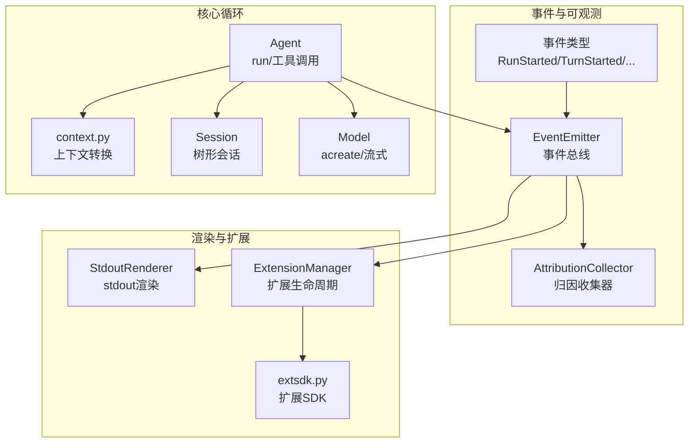
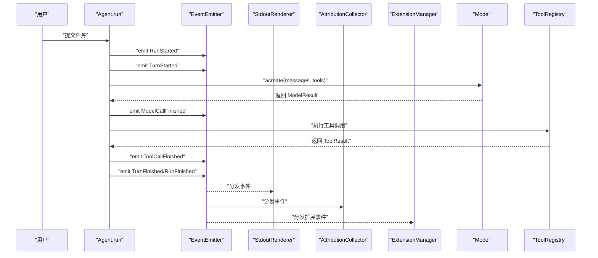
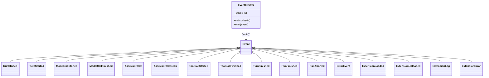
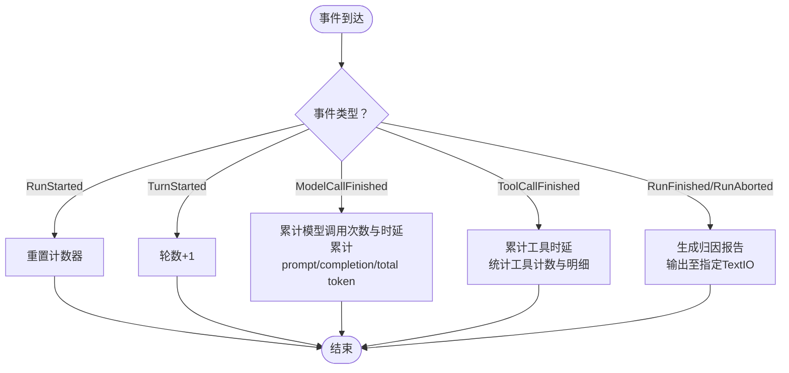
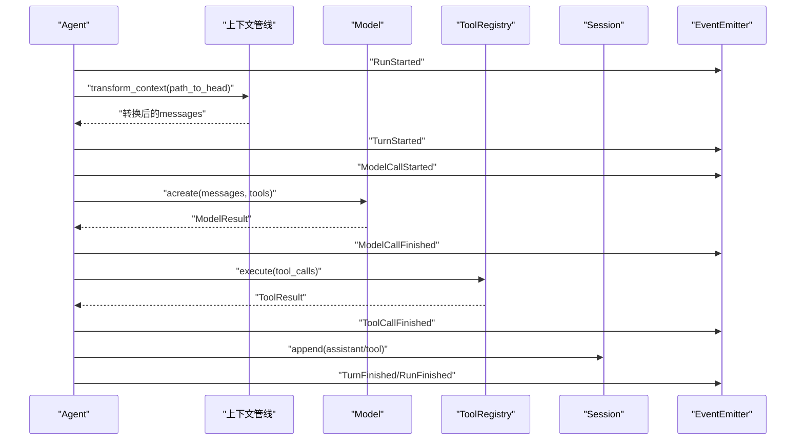
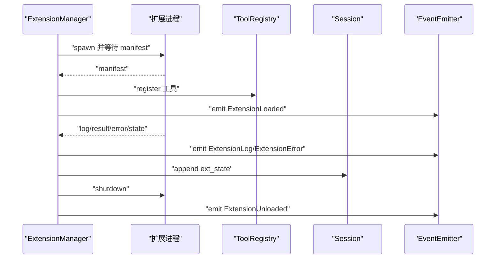
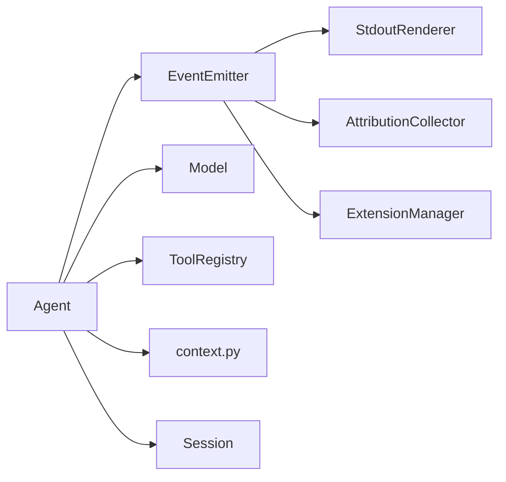

# 事件系统

<cite>
**本文引用的文件列表**
- [events.py](file://mu/events.py)
- [observability.py](file://mu/observability.py)
- [agent.py](file://mu/agent.py)
- [session.py](file://mu/session.py)
- [context.py](file://mu/context.py)
- [render.py](file://mu/render.py)
- [extension.py](file://mu/extension.py)
- [extsdk.py](file://mu/extsdk.py)
- [tools.py](file://mu/tools.py)
- [model.py](file://mu/model.py)
- [test_events.py](file://tests/test_events.py)
- [test_observability.py](file://tests/test_observability.py)
- [example_textstats.py](file://extensions/example_textstats.py)
- [README.md](file://README.md)
</cite>

## 目录
1. [引言](#引言)
2. [项目结构](#项目结构)
3. [核心组件](#核心组件)
4. [架构总览](#架构总览)
5. [详细组件分析](#详细组件分析)
6. [依赖关系分析](#依赖关系分析)
7. [性能考量](#性能考量)
8. [故障排查指南](#故障排查指南)
9. [结论](#结论)
10. [附录](#附录)

## 引言
本文件面向 μ (mu) 事件系统，系统性阐述事件定义、事件类型与事件传播机制；解释订阅者模式的实现与事件处理器的注册管理；深入分析可观测性系统的架构（日志记录、指标收集与性能监控）；说明事件流在智能体循环中的作用与数据流向；提供事件系统的扩展指南与自定义事件实现方法；并给出实际代码示例路径与调试技巧，以及事件系统与各组件的集成关系与耦合度控制建议。

## 项目结构
μ 事件系统围绕“结构化事件 + 同步订阅分发”的设计展开，核心位于 mu/events.py，配合可观测性模块、渲染器、扩展系统与工具链共同构成完整的事件生态。关键文件与职责如下：
- 事件定义与总线：mu/events.py
- 观测性归因：mu/observability.py
- 智能体循环与事件发射：mu/agent.py
- 会话树与事件持久化：mu/session.py
- 上下文管线：mu/context.py
- 标准输出渲染器：mu/render.py
- 扩展管理与事件发射：mu/extension.py
- 扩展 SDK：mu/extsdk.py
- 工具注册与执行：mu/tools.py
- 模型调用与流式事件：mu/model.py
- 测试用例：tests/test_events.py、tests/test_observability.py
- 示例扩展：extensions/example_textstats.py
- 项目说明：README.md

图表来源
- [events.py:121-133](file://mu/events.py#L121-L133)
- [observability.py:26-90](file://mu/observability.py#L26-L90)
- [agent.py:82-133](file://mu/agent.py#L82-L133)
- [context.py:15-31](file://mu/context.py#L15-L31)
- [session.py:38-115](file://mu/session.py#L38-L115)
- [render.py:31-78](file://mu/render.py#L31-L78)
- [extension.py:85-364](file://mu/extension.py#L85-L364)
- [extsdk.py:111-130](file://mu/extsdk.py#L111-L130)
- [model.py:91-147](file://mu/model.py#L91-L147)

章节来源
- [README.md:1-127](file://README.md#L1-L127)

## 核心组件
- 事件类型与数据结构：以 dataclass 定义的事件类型集合，覆盖任务开始/结束、轮次开始/结束、模型调用开始/结束、助手文本（一次性/增量）、工具调用开始/结束、扩展加载/卸载/日志/错误、错误事件等。
- 事件总线 EventEmitter：提供 subscribe 与 emit 接口，维护订阅者列表并进行同步顺序分发。
- 观测性归因 Collector：作为事件订阅者，按任务维度累计轮数、模型调用次数与时延、token 数量、工具调用次数与时延、工具明细与可选成本估算，并在任务结束时输出报告。
- 标准输出渲染器 StdoutRenderer：作为事件订阅者，将事件映射为人类可读的 stdout 输出，支持流式增量助手文本。
- 扩展事件：ExtensionLoaded/ExtensionUnloaded/ExtensionLog/ExtensionError，由扩展管理器在扩展生命周期中发射，驱动工具注册与状态持久化。
- Agent 循环：在 run/工具调用/模型调用等关键节点发射事件，形成完整的事件流。
- 上下文管线：将内部消息转换为 LLM 输入格式，保证标准消息透传与自定义消息的可控注入。
- 会话树：以 JSONL 追加写入，支持分支与摘要注入，事件驱动的状态持久化。

章节来源
- [events.py:13-133](file://mu/events.py#L13-L133)
- [observability.py:26-90](file://mu/observability.py#L26-L90)
- [render.py:31-78](file://mu/render.py#L31-L78)
- [extension.py:85-364](file://mu/extension.py#L85-L364)
- [agent.py:82-133](file://mu/agent.py#L82-L133)
- [context.py:15-31](file://mu/context.py#L15-L31)
- [session.py:38-115](file://mu/session.py#L38-L115)

## 架构总览
事件系统采用“结构化事件 + 同步订阅分发”的轻量总线模式，避免引入外部发布/订阅框架，降低复杂度与耦合度。Agent 在智能体循环的关键节点发射事件，渲染器、归因收集器与扩展管理器作为订阅者分别承担可视化、可观测与扩展生命周期管理职责。

图表来源
- [agent.py:82-133](file://mu/agent.py#L82-L133)
- [events.py:121-133](file://mu/events.py#L121-L133)
- [render.py:36-78](file://mu/render.py#L36-L78)
- [observability.py:45-65](file://mu/observability.py#L45-L65)
- [extension.py:131-188](file://mu/extension.py#L131-L188)
- [model.py:112-147](file://mu/model.py#L112-L147)
- [tools.py:253-269](file://mu/tools.py#L253-L269)

## 详细组件分析

### 事件定义与类型体系
- 事件基类 Event 与具体事件类型：RunStarted/TurnStarted/ModelCallStarted/ModelCallFinished/AssistantText/AssistantTextDelta/ToolCallStarted/ToolCallFinished/TurnFinished/RunFinished/RunAborted/ErrorEvent/ExtensionLoaded/ExtensionUnloaded/ExtensionLog/ExtensionError。
- 事件携带上下文信息：如任务标识、轮次编号、延迟时间、token 统计、工具名称与参数预览、扩展名称与版本、错误消息等。
- 设计原则：事件为不可变数据载体，便于订阅者按需消费；扩展事件用于透明化扩展生命周期，避免扩展成为黑盒。

章节来源
- [events.py:13-116](file://mu/events.py#L13-L116)

### 订阅者模式与事件总线
- EventEmitter：维护订阅者列表，emit 时按注册顺序依次调用，保证确定性的事件传播。
- 订阅者注册：通过 subscribe 注册任意 callable，接收 Event 类型实例。
- 传播特性：同步分发，无并发与去重；订阅者负责幂等与轻量处理。

图表来源
- [events.py:13-133](file://mu/events.py#L13-L133)

章节来源
- [events.py:121-133](file://mu/events.py#L121-L133)
- [test_events.py:7-27](file://tests/test_events.py#L7-L27)

### 观测性系统：归因与报告
- 归因收集器 AttributionCollector：作为事件订阅者，按任务维度累计轮数、模型调用次数与时延、token 数量、工具调用次数与时延、工具明细；在 RunFinished/RunAborted 时输出报告。
- 成本估算：可选价格表按千 token 计算 prompt/completion 成本，输出为最佳努力估算。
- 重置策略：RunStarted 时重置计数，确保同一收集器可复用于多个任务且不跨任务累计。

图表来源
- [observability.py:45-65](file://mu/observability.py#L45-L65)
- [observability.py:66-90](file://mu/observability.py#L66-L90)

章节来源
- [observability.py:26-90](file://mu/observability.py#L26-L90)
- [test_observability.py:16-71](file://tests/test_observability.py#L16-L71)

### 智能体循环中的事件流与数据流向
- Agent.run：在任务开始、每轮开始、模型调用前后、工具调用前后、轮结束与任务结束/中止时发射事件。
- 上下文管线：transform_context → convert_to_llm 将内部消息转换为 LLM 输入，标准消息透传，自定义消息可注入或丢弃。
- 会话树：事件驱动的状态持久化（如扩展状态、分支摘要），支持续跑与分支。

图表来源
- [agent.py:82-133](file://mu/agent.py#L82-L133)
- [context.py:15-31](file://mu/context.py#L15-L31)
- [model.py:112-147](file://mu/model.py#L112-L147)
- [tools.py:253-269](file://mu/tools.py#L253-L269)
- [session.py:49-73](file://mu/session.py#L49-L73)

章节来源
- [agent.py:82-133](file://mu/agent.py#L82-L133)
- [context.py:15-31](file://mu/context.py#L15-L31)
- [session.py:38-115](file://mu/session.py#L38-L115)

### 扩展系统与事件传播
- 扩展管理器 ExtensionManager：加载/重载/卸载扩展子进程，注册扩展工具到 ToolRegistry，将扩展状态持久化到 Session，并在生命周期中发射扩展事件。
- 扩展 SDK：扩展作者使用工具装饰器声明工具，通过 run_extension 启动 JSONL 协议，支持日志、状态持久化与结果/错误回传。
- 事件驱动：扩展加载成功发射 ExtensionLoaded；卸载发射 ExtensionUnloaded；日志与错误分别发射 ExtensionLog/ExtensionError；扩展崩溃时统一降级并清理。

图表来源
- [extension.py:131-188](file://mu/extension.py#L131-L188)
- [extension.py:275-317](file://mu/extension.py#L275-L317)
- [extsdk.py:111-130](file://mu/extsdk.py#L111-L130)

章节来源
- [extension.py:85-364](file://mu/extension.py#L85-L364)
- [extsdk.py:1-130](file://mu/extsdk.py#L1-L130)
- [example_textstats.py:1-67](file://extensions/example_textstats.py#L1-L67)

### 渲染器与事件消费
- StdoutRenderer：将事件映射为人类可读的 stdout 输出，支持流式增量助手文本；在收到非增量事件时结束当前增量行。
- 事件映射：RunStarted、AssistantText、ToolCallStarted/Finished、RunAborted、ErrorEvent、ExtensionLoaded/Unloaded/Log/Error 等均有对应输出格式。

章节来源
- [render.py:31-78](file://mu/render.py#L31-L78)

## 依赖关系分析
- 低耦合高内聚：事件总线仅负责分发，订阅者各自处理自身领域逻辑；Agent 与扩展管理器通过事件与工具注册表交互，不直接耦合第三方服务。
- 数据流向清晰：事件从 Agent 发出，经 EventEmitter 分发到渲染器、归因收集器与扩展管理器；工具执行与模型调用的结果通过事件反馈到会话树与事件流。
- 可替换性：上下文管线、模型后端、权限策略、沙箱实现均可通过接口替换，不影响事件流。

图表来源
- [agent.py:82-133](file://mu/agent.py#L82-L133)
- [events.py:121-133](file://mu/events.py#L121-L133)
- [render.py:36-78](file://mu/render.py#L36-L78)
- [observability.py:45-65](file://mu/observability.py#L45-L65)
- [extension.py:85-103](file://mu/extension.py#L85-L103)
- [model.py:112-147](file://mu/model.py#L112-L147)
- [tools.py:191-269](file://mu/tools.py#L191-L269)
- [context.py:15-31](file://mu/context.py#L15-L31)
- [session.py:49-73](file://mu/session.py#L49-L73)

章节来源
- [agent.py:82-133](file://mu/agent.py#L82-L133)
- [extension.py:85-103](file://mu/extension.py#L85-L103)

## 性能考量
- 同步分发：事件总线采用同步顺序分发，避免引入并发与锁开销，适合轻量订阅者（打印/计数）。
- 计时与统计：模型调用与工具调用均记录延迟与 token 使用，归因收集器按任务维度聚合，避免重复计算。
- 流式输出：模型流式响应通过 on_delta 回调增量输出，减少等待时间；StdoutRenderer 在增量事件间保持同一行输出，提升可读性。
- 事件粒度：事件类型覆盖任务、轮次、模型调用、工具调用、扩展生命周期等关键节点，有助于细粒度性能分析与问题定位。

[本节为通用性能讨论，不直接分析具体文件]

## 故障排查指南
- 事件未触发：检查 EventEmitter 是否正确实例化与订阅；确认 Agent 在相应阶段调用了 emit。
- 订阅者未生效：确认订阅者函数签名与事件类型匹配；检查订阅顺序与事件分发顺序。
- 归因报告为空：确认 RunStarted 是否先于其它事件到达；检查 RunFinished/RunAborted 是否触发。
- 扩展加载失败：查看 ExtensionError 事件内容；检查扩展 manifest 输出与工具 schema；确认扩展进程是否正常退出。
- 工具执行错误：检查 ToolResult 的 content 与 terminate 字段；确认权限策略是否拦截。
- 流式输出中断：检查 on_delta 回调是否正确传递；确认 StdoutRenderer 的增量状态切换逻辑。

章节来源
- [test_events.py:7-27](file://tests/test_events.py#L7-L27)
- [test_observability.py:16-71](file://tests/test_observability.py#L16-L71)
- [extension.py:131-188](file://mu/extension.py#L131-L188)
- [render.py:36-78](file://mu/render.py#L36-L78)
- [tools.py:253-269](file://mu/tools.py#L253-L269)

## 结论
μ 事件系统以简洁的结构化事件与同步订阅分发为核心，实现了可观测性、可视化与扩展管理的解耦。通过在智能体循环的关键节点发射事件，系统能够高效地收集性能指标、输出人类可读的日志，并透明化扩展生命周期。该设计在保持低复杂度的同时，提供了良好的可扩展性与可维护性，便于进一步演进到 M3/M3.5/M4.0 的高级能力。

[本节为总结性内容，不直接分析具体文件]

## 附录

### 事件类型与字段参考
- RunStarted(task, session_id)
- TurnStarted(turn)
- ModelCallStarted(turn)
- ModelCallFinished(turn, latency_s, prompt_tokens, completion_tokens, total_tokens)
- AssistantText(text)
- AssistantTextDelta(delta)
- ToolCallStarted(call_id, name, args_preview)
- ToolCallFinished(call_id, name, result, latency_s, terminate)
- TurnFinished(turn)
- RunFinished(final_text)
- RunAborted(reason)
- ErrorEvent(message)
- ExtensionLoaded(name, version, tools)
- ExtensionUnloaded(name)
- ExtensionLog(name, level, message)
- ExtensionError(name, message)

章节来源
- [events.py:13-116](file://mu/events.py#L13-L116)

### 订阅者注册与事件发射示例路径
- 订阅者注册与顺序分发：[tests/test_events.py:7-27](file://tests/test_events.py#L7-L27)
- 归因收集与报告：[tests/test_observability.py:16-71](file://tests/test_observability.py#L16-L71)
- Agent 发射事件：[mu/agent.py:82-133](file://mu/agent.py#L82-L133)
- 扩展事件发射：[mu/extension.py:131-188](file://mu/extension.py#L131-L188)

章节来源
- [test_events.py:7-27](file://tests/test_events.py#L7-L27)
- [test_observability.py:16-71](file://tests/test_observability.py#L16-L71)
- [agent.py:82-133](file://mu/agent.py#L82-L133)
- [extension.py:131-188](file://mu/extension.py#L131-L188)

### 扩展开发与自定义事件实现指南
- 扩展 SDK 使用：装饰器声明工具、日志与状态持久化、JSONL 协议处理。
- 自定义事件：可在扩展中通过 SDK 发射 ExtensionLog/ExtensionError 等事件，或在核心侧新增事件类型并在 Agent/扩展管理器中发射。
- 示例扩展：[extensions/example_textstats.py:1-67](file://extensions/example_textstats.py#L1-L67)

章节来源
- [extsdk.py:1-130](file://mu/extsdk.py#L1-L130)
- [example_textstats.py:1-67](file://extensions/example_textstats.py#L1-L67)

### 事件系统与组件集成关系
- 与 Agent 的集成：在 run/工具调用/模型调用等关键节点发射事件，驱动可观测与可视化。
- 与工具注册表的集成：工具执行结果通过 ToolResult 与 terminate 字段影响循环终止条件。
- 与会话树的集成：扩展状态与分支摘要通过事件持久化到 Session，支持续跑与分支。
- 与上下文管线的集成：事件驱动的上下文转换保证标准消息透传与自定义消息可控注入。

章节来源
- [agent.py:82-133](file://mu/agent.py#L82-L133)
- [tools.py:191-269](file://mu/tools.py#L191-L269)
- [session.py:49-73](file://mu/session.py#L49-L73)
- [context.py:15-31](file://mu/context.py#L15-L31)