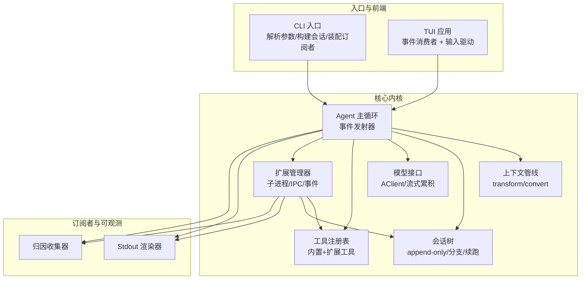
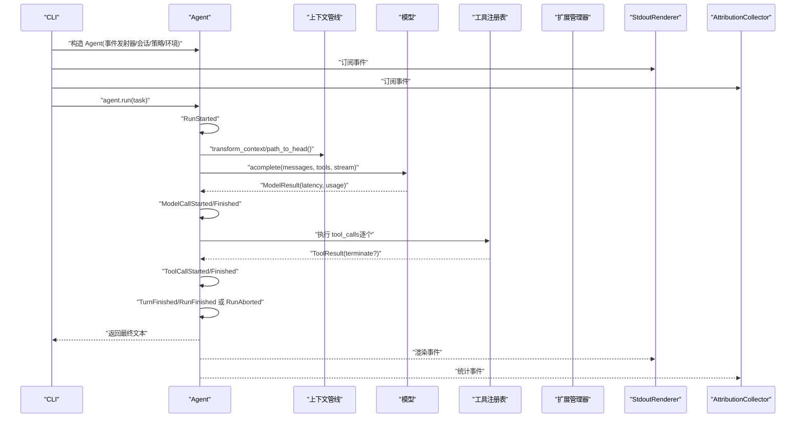
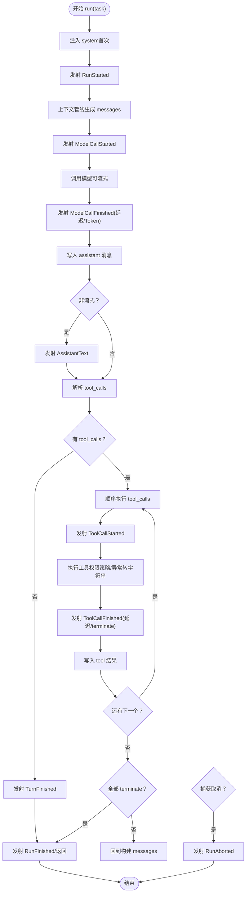
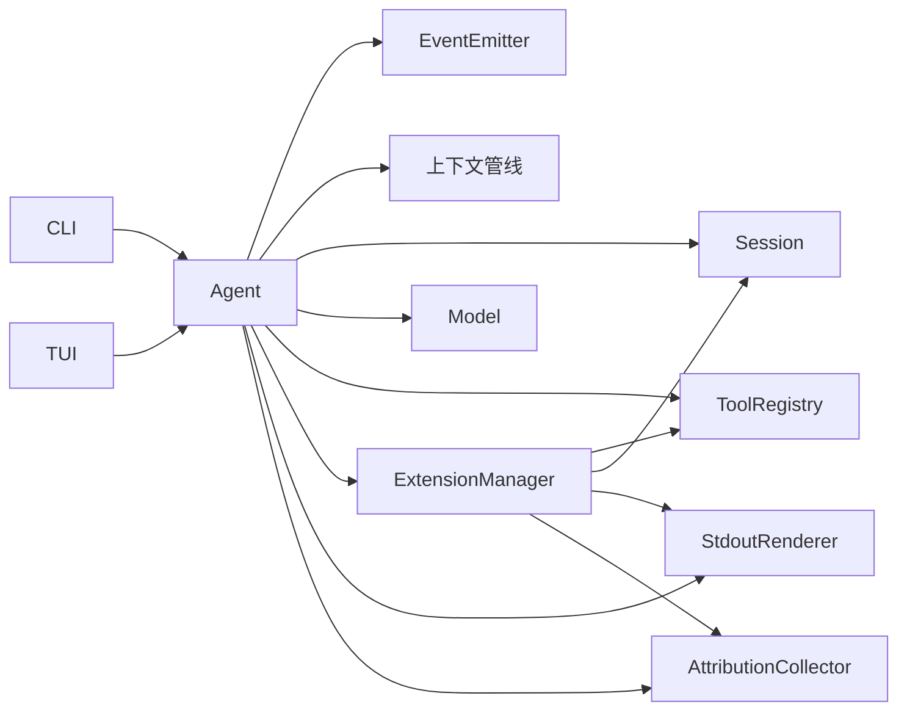
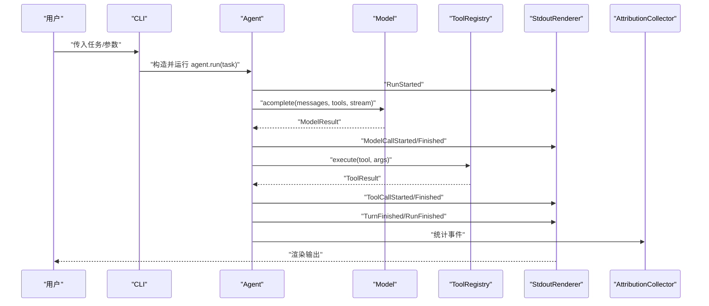

# 事件系统集成

<cite>
**本文引用的文件**
- [mu/events.py](file://mu/events.py)
- [mu/agent.py](file://mu/agent.py)
- [mu/cli.py](file://mu/cli.py)
- [mu/session.py](file://mu/session.py)
- [mu/tools.py](file://mu/tools.py)
- [mu/render.py](file://mu/render.py)
- [mu/observability.py](file://mu/observability.py)
- [mu/model.py](file://mu/model.py)
- [mu/context.py](file://mu/context.py)
- [mu/extension.py](file://mu/extension.py)
- [mu/tui.py](file://mu/tui.py)
- [mu/codeact.py](file://mu/codeact.py)
- [mu/environment.py](file://mu/environment.py)
- [tests/test_events.py](file://tests/test_events.py)
- [README.md](file://README.md)
</cite>

## 目录
1. [引言](#引言)
2. [项目结构](#项目结构)
3. [核心组件](#核心组件)
4. [架构总览](#架构总览)
5. [详细组件分析](#详细组件分析)
6. [依赖分析](#依赖分析)
7. [性能考虑](#性能考虑)
8. [故障排查指南](#故障排查指南)
9. [结论](#结论)
10. [附录](#附录)

## 引言
本文件面向 μ (mu) 事件系统与其他组件的集成，系统化阐述事件流如何贯穿 CLI 输入到最终输出的完整数据路径，以及事件系统在智能体循环中的位置与作用机制。文档重点包括：
- 事件系统在 Agent 循环中的触发点与传播路径
- 事件流与工具系统、会话管理、模型接口、扩展系统、可观测性等核心模块的交互关系
- 事件系统的扩展点与自定义事件实现指南
- 性能优化建议与调试技巧
- 如何通过事件系统提升系统的可观测性与可维护性

## 项目结构
μ 采用“事件驱动”的轻量架构：CLI 负责参数解析与生命周期调度，Agent 负责主循环与事件发射，工具/模型/会话/扩展等模块通过事件与渲染器、归因收集器等订阅者协同工作。

图示来源
- [mu/cli.py:51-83](file://mu/cli.py#L51-L83)
- [mu/tui.py:122-200](file://mu/tui.py#L122-L200)
- [mu/agent.py:82-133](file://mu/agent.py#L82-L133)
- [mu/context.py:15-31](file://mu/context.py#L15-L31)
- [mu/session.py:38-115](file://mu/session.py#L38-L115)
- [mu/model.py:91-147](file://mu/model.py#L91-L147)
- [mu/tools.py:191-269](file://mu/tools.py#L191-L269)
- [mu/extension.py:85-364](file://mu/extension.py#L85-L364)
- [mu/render.py:31-78](file://mu/render.py#L31-L78)
- [mu/observability.py:26-90](file://mu/observability.py#L26-L90)

章节来源
- [mu/cli.py:51-83](file://mu/cli.py#L51-L83)
- [mu/tui.py:122-200](file://mu/tui.py#L122-L200)
- [mu/agent.py:82-133](file://mu/agent.py#L82-L133)
- [mu/context.py:15-31](file://mu/context.py#L15-L31)
- [mu/session.py:38-115](file://mu/session.py#L38-L115)
- [mu/model.py:91-147](file://mu/model.py#L91-L147)
- [mu/tools.py:191-269](file://mu/tools.py#L191-L269)
- [mu/extension.py:85-364](file://mu/extension.py#L85-L364)
- [mu/render.py:31-78](file://mu/render.py#L31-L78)
- [mu/observability.py:26-90](file://mu/observability.py#L26-L90)

## 核心组件
- 事件与事件总线
  - 事件类型：RunStarted、TurnStarted、ModelCallStarted/Finished、AssistantText/AssistantTextDelta、ToolCallStarted/Finished、TurnFinished、RunFinished、RunAborted、ErrorEvent、ExtensionLoaded/Unloaded/Log/Error 等
  - 事件发射器：同步订阅分发，无外部 pub/sub 依赖
- Agent 主循环
  - 在每轮中发射“开始/结束”事件，调用模型前后发射模型调用事件，工具调用前后发射工具事件，流式模式下发射增量文本事件
- 订阅者
  - StdoutRenderer：将事件渲染为纯文本输出
  - AttributionCollector：按任务聚合统计（轮数、耗时、token、工具明细等）
- 工具系统
  - ToolRegistry：统一工具注册与执行，返回 ToolResult（可携带 terminate 标志）
- 会话系统
  - Session：树形结构，append-only JSONL 持久化，支持分支与续跑
- 模型接口
  - Model：封装 OpenAI 兼容客户端，支持流式累积与统计
- 扩展系统
  - ExtensionManager：子进程扩展加载/调用/卸载，通过事件与会话进行状态同步
- 上下文管线
  - transform_context/convert_to_llm：将内部历史转换为 LLM 输入格式

章节来源
- [mu/events.py:13-133](file://mu/events.py#L13-L133)
- [mu/agent.py:18-39](file://mu/agent.py#L18-L39)
- [mu/render.py:31-78](file://mu/render.py#L31-L78)
- [mu/observability.py:26-90](file://mu/observability.py#L26-L90)
- [mu/tools.py:19-36](file://mu/tools.py#L19-L36)
- [mu/session.py:38-115](file://mu/session.py#L38-L115)
- [mu/model.py:23-147](file://mu/model.py#L23-L147)
- [mu/extension.py:85-364](file://mu/extension.py#L85-L364)
- [mu/context.py:15-31](file://mu/context.py#L15-L31)

## 架构总览
事件系统位于 Agent 循环与各子系统之间，形成“发射-订阅”的解耦通道。CLI/TUI 仅负责装配订阅者与启动 Agent，Agent 负责在关键节点发射事件，订阅者各自消费并产生副作用（渲染、统计、扩展日志等）。

图示来源
- [mu/cli.py:70-83](file://mu/cli.py#L70-L83)
- [mu/agent.py:82-133](file://mu/agent.py#L82-L133)
- [mu/model.py:112-147](file://mu/model.py#L112-L147)
- [mu/tools.py:253-269](file://mu/tools.py#L253-L269)
- [mu/render.py:36-78](file://mu/render.py#L36-L78)
- [mu/observability.py:45-90](file://mu/observability.py#L45-L90)

## 详细组件分析

### 事件与事件总线
- 设计要点
  - 使用 dataclass 定义事件，保证结构清晰、序列化友好
  - EventEmitter 采用同步分发，订阅者列表顺序调用，避免引入外部依赖
- 关键事件
  - 运行期：RunStarted/RunFinished/RunAborted
  - 轮次：TurnStarted/TurnFinished
  - 模型：ModelCallStarted/ModelCallFinished（含延迟与 token 统计）
  - 输出：AssistantText（非流式一次性）、AssistantTextDelta（流式增量）
  - 工具：ToolCallStarted/ToolCallFinished（含延迟与 terminate 标志）
  - 扩展：ExtensionLoaded/Unloaded/Log/Error
- 订阅者职责
  - StdoutRenderer：纯文本渲染，支持流式增量
  - AttributionCollector：按任务聚合统计，输出归因报告

章节来源
- [mu/events.py:13-133](file://mu/events.py#L13-L133)
- [mu/render.py:31-78](file://mu/render.py#L31-L78)
- [mu/observability.py:26-90](file://mu/observability.py#L26-L90)

### Agent 主循环与事件发射
- 初始化
  - 构造 EventEmitter、Session、Model、ToolRegistry、ExtensionManager
  - 可选启用 native code-action（注册 code 工具）
- 运行流程
  - 注入 system 消息（首次会话）
  - 发射 RunStarted
  - 通过上下文管线生成 LLM 输入
  - 发射 ModelCallStarted，调用模型，发射 ModelCallFinished（含延迟与 token）
  - 将 assistant 消息写入会话，若非流式则发射 AssistantText
  - 若存在 tool_calls：顺序执行，逐个发射 ToolCallStarted/Finished，并将 tool 结果写入会话
  - 若无 tool_calls 或全部 terminate，则发射 TurnFinished/RunFinished 并返回
  - 捕获取消：发射 RunAborted
- 取消与恢复
  - 工具执行阶段捕获取消，补写 pending 工具错误，保持会话可恢复

图示来源
- [mu/agent.py:82-133](file://mu/agent.py#L82-L133)
- [mu/agent.py:134-173](file://mu/agent.py#L134-L173)
- [mu/context.py:15-31](file://mu/context.py#L15-L31)
- [mu/model.py:112-147](file://mu/model.py#L112-L147)
- [mu/tools.py:253-269](file://mu/tools.py#L253-L269)

章节来源
- [mu/agent.py:82-133](file://mu/agent.py#L82-L133)
- [mu/agent.py:134-173](file://mu/agent.py#L134-L173)
- [mu/context.py:15-31](file://mu/context.py#L15-L31)
- [mu/model.py:112-147](file://mu/model.py#L112-L147)
- [mu/tools.py:253-269](file://mu/tools.py#L253-L269)

### CLI 与 TUI 的事件装配
- CLI
  - 构造 EventEmitter，订阅 StdoutRenderer 与 AttributionCollector
  - 解析参数，构建 Session（支持 resume/branch），组装 Agent 并运行
  - 捕获配置错误与键盘中断
- TUI
  - 复用同一 EventEmitter/Agent/Session，事件消费者为 TuiRenderer
  - 在 Textual worker 中运行 agent.run，支持取消（escape）

章节来源
- [mu/cli.py:51-83](file://mu/cli.py#L51-L83)
- [mu/cli.py:115-134](file://mu/cli.py#L115-L134)
- [mu/tui.py:122-200](file://mu/tui.py#L122-L200)

### 工具系统与事件
- ToolRegistry
  - 统一注册/注销工具，暴露 schemas 与 execute
  - execute 前后可结合事件（如 code-action 中的 ToolCallStarted/Finished）
- ToolResult
  - 字符串结果 + terminate 标志，影响 Agent 是否继续自动 LLM 调用
- code-action
  - 注册 code 工具，线程内执行 Python，通过 _MuApi 将同步调用 marshaled 回事件循环
  - 发射 ToolCallStarted/Finished，过权限策略，支持日志与返回值

章节来源
- [mu/tools.py:191-269](file://mu/tools.py#L191-L269)
- [mu/codeact.py:84-133](file://mu/codeact.py#L84-L133)

### 会话管理与事件
- Session
  - 树形节点（id/parent_id/ts/msg），append-only JSONL 持久化
  - path_to/path_to_head 获取当前分支线性历史
  - add_branch_summary 将侧分支结论注入主线上下文
- 事件与会话
  - Agent 在工具调用后将 tool 结果写入会话
  - 扩展状态通过 ext_state 类型消息写入会话，供后续恢复

章节来源
- [mu/session.py:38-115](file://mu/session.py#L38-L115)
- [mu/agent.py:160-162](file://mu/agent.py#L160-L162)
- [mu/extension.py:294-297](file://mu/extension.py#L294-L297)

### 模型接口与事件
- Model
  - 封装 AsyncOpenAI，支持流式累积与 usage 提取
  - 返回 ModelResult（message/usage/latency），供事件与归因
- 流式处理
  - consume_stream 聚合 content 与 tool_calls 增量，支持 on_delta 回调

章节来源
- [mu/model.py:91-147](file://mu/model.py#L91-L147)
- [mu/model.py:52-88](file://mu/model.py#L52-L88)

### 扩展系统与事件
- ExtensionManager
  - 子进程扩展加载/重载/卸载，注册管理工具（load/reload/list）
  - IPC 读取扩展日志/结果/状态，发射 Extension* 事件
  - 将扩展状态写入会话，支持恢复
- 事件与状态
  - ExtensionLoaded/Unloaded/Log/Error
  - ext_state 消息写入会话，供恢复

章节来源
- [mu/extension.py:85-364](file://mu/extension.py#L85-L364)
- [mu/extension.py:275-317](file://mu/extension.py#L275-L317)
- [mu/extension.py:294-297](file://mu/extension.py#L294-L297)

### 上下文管线与事件
- transform_context
  - 默认 identity，后续可做压缩/裁剪/注入
- convert_to_llm
  - 标准消息透传，自定义类型（如 branch_summary）转换为 user 内容注入

章节来源
- [mu/context.py:15-31](file://mu/context.py#L15-L31)

## 依赖分析
- 组件耦合
  - Agent 依赖 EventEmitter、Session、Model、ToolRegistry、ExtensionManager、上下文管线
  - 订阅者（StdoutRenderer、AttributionCollector）仅依赖事件类型
  - 扩展管理器依赖工具注册表与会话，通过事件与 IPC 协同
- 直接依赖链
  - CLI/TUI → Agent → Model/Tools/Session/ExtMgr → Stdout/Obs
- 潜在循环依赖
  - 事件系统为单向广播，无循环依赖风险

图示来源
- [mu/cli.py:70-83](file://mu/cli.py#L70-L83)
- [mu/tui.py:149-165](file://mu/tui.py#L149-L165)
- [mu/agent.py:18-39](file://mu/agent.py#L18-L39)
- [mu/extension.py:85-103](file://mu/extension.py#L85-L103)

章节来源
- [mu/cli.py:70-83](file://mu/cli.py#L70-L83)
- [mu/tui.py:149-165](file://mu/tui.py#L149-L165)
- [mu/agent.py:18-39](file://mu/agent.py#L18-L39)
- [mu/extension.py:85-103](file://mu/extension.py#L85-L103)

## 性能考虑
- 同步事件分发
  - 事件发射为 O(N) 顺序分发，N 为订阅者数量；订阅者应保持轻量（打印/累加），避免阻塞
- 流式输出
  - 模型流式时，on_delta 回调在事件循环中触发，建议订阅者尽快写出，避免缓冲堆积
- 工具执行
  - ToolResult.terminate 可避免不必要的后续 LLM 调用，减少 token 与延迟
- 扩展 IPC
  - 扩展进程间通信采用 JSONL 协议，注意日志与状态写入会话的频率，避免频繁 I/O
- 归因统计
  - 归因收集器在 RunFinished/RunAborted 时输出报告，建议仅在需要时启用，避免额外开销

[本节为通用指导，无需特定文件来源]

## 故障排查指南
- 事件未触发
  - 检查是否正确订阅事件（CLI/TUI 均需订阅）
  - 确认 Agent.run 是否正常执行（查看 RunStarted/RunFinished）
- 订阅者无输出
  - 确认订阅者实现是否覆盖相应事件类型
  - 检查流式模式下是否正确处理 AssistantTextDelta
- 工具执行失败
  - 查看 ToolCallFinished.result 中的错误信息
  - 检查权限策略是否拦截（ToolRegistry.permits）
- 扩展问题
  - 查看 ExtensionError/Log 事件
  - 检查扩展进程是否存活与 manifest 是否有效
- 会话异常
  - 检查 resume/branch 参数与节点是否存在
  - 确认 JSONL 文件可读且格式正确

章节来源
- [tests/test_events.py:7-27](file://tests/test_events.py#L7-L27)
- [mu/render.py:36-78](file://mu/render.py#L36-L78)
- [mu/observability.py:45-90](file://mu/observability.py#L45-L90)
- [mu/tools.py:253-269](file://mu/tools.py#L253-L269)
- [mu/extension.py:131-188](file://mu/extension.py#L131-L188)
- [mu/session.py:98-115](file://mu/session.py#L98-L115)

## 结论
μ 的事件系统以“结构化事件 + 同步订阅分发”为核心，将 CLI/TUI、Agent、工具、模型、会话与扩展等模块解耦为可观察、可扩展的协作单元。通过在关键节点发射事件，系统实现了：
- 清晰的数据路径与可观测性（渲染与归因）
- 可插拔的扩展与工具生态
- 可恢复的会话与分支能力
- 可维护的架构演进（M3/M3.5/M4.0）

建议在生产环境中：
- 保持订阅者轻量，避免阻塞事件循环
- 合理使用 terminate 与流式输出，降低 token 与延迟
- 通过事件与会话实现可审计与可追溯

[本节为总结，无需特定文件来源]

## 附录

### 事件系统扩展点与自定义事件实现指南
- 扩展事件类型
  - 在事件模块新增 dataclass 事件类型，遵循现有命名风格
  - 在 Agent/扩展管理器中按需发射新事件
- 订阅者实现
  - 在渲染器/归因器中添加对新事件类型的处理分支
  - 保持订阅者轻量，避免阻塞
- 与工具/会话/模型的集成
  - 工具：在 ToolRegistry.execute 前后发射事件，传递必要上下文
  - 会话：将自定义消息类型转换为标准消息或注入上下文
  - 模型：在流式/非流式路径中补充事件发射点

章节来源
- [mu/events.py:13-133](file://mu/events.py#L13-L133)
- [mu/render.py:36-78](file://mu/render.py#L36-L78)
- [mu/observability.py:45-90](file://mu/observability.py#L45-L90)
- [mu/tools.py:253-269](file://mu/tools.py#L253-L269)
- [mu/context.py:20-31](file://mu/context.py#L20-L31)
- [mu/model.py:112-147](file://mu/model.py#L112-L147)

### 事件流完整数据路径（CLI → 输出）

图示来源
- [mu/cli.py:51-83](file://mu/cli.py#L51-L83)
- [mu/agent.py:82-133](file://mu/agent.py#L82-L133)
- [mu/model.py:112-147](file://mu/model.py#L112-L147)
- [mu/tools.py:253-269](file://mu/tools.py#L253-L269)
- [mu/render.py:36-78](file://mu/render.py#L36-L78)
- [mu/observability.py:45-90](file://mu/observability.py#L45-L90)