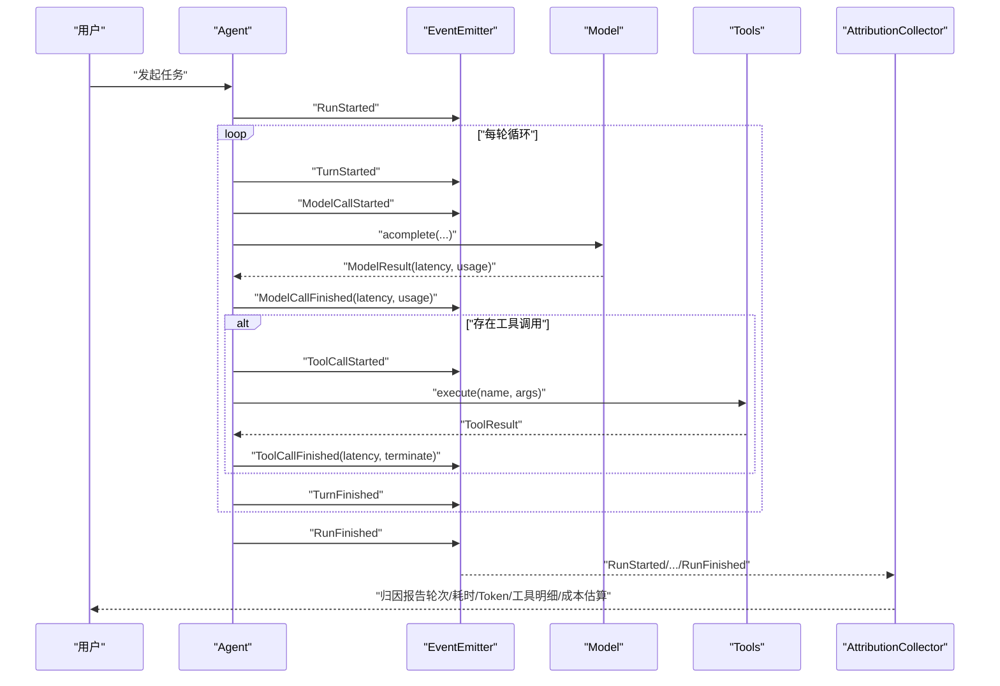
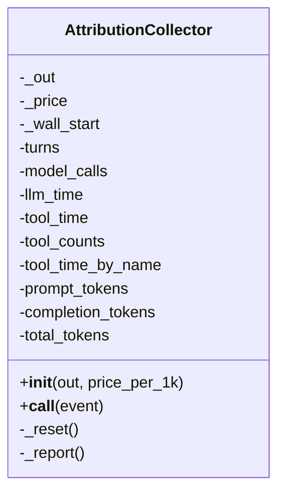
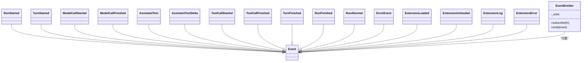
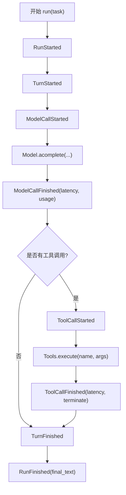
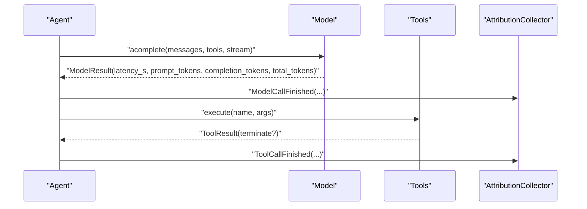
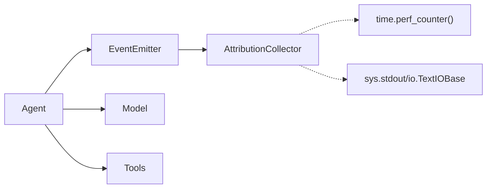

# 可观测性系统

<cite>
**本文引用的文件**
- [mu/observability.py](file://mu/observability.py)
- [tests/test_observability.py](file://tests/test_observability.py)
- [mu/events.py](file://mu/events.py)
- [mu/agent.py](file://mu/agent.py)
- [mu/model.py](file://mu/model.py)
- [mu/tools.py](file://mu/tools.py)
- [mu/session.py](file://mu/session.py)
- [mu/context.py](file://mu/context.py)
- [plan/M1-Harness-Core-plan.md](file://plan/M1-Harness-Core-plan.md)
</cite>

## 目录
1. [简介](#简介)
2. [项目结构](#项目结构)
3. [核心组件](#核心组件)
4. [架构总览](#架构总览)
5. [组件详解](#组件详解)
6. [依赖关系分析](#依赖关系分析)
7. [性能考量](#性能考量)
8. [故障排查指南](#故障排查指南)
9. [结论](#结论)
10. [附录](#附录)

## 简介
本文件面向 μ (mu) 项目的可观测性系统，聚焦于“日志记录、指标采集与性能监控”的实现机制与集成方式。可观测性系统以事件驱动为核心，通过结构化事件流与订阅者模式，将 Agent 执行过程中的关键行为（如轮次、模型调用、工具调用、会话状态等）转化为可聚合、可打印的归因报告。报告内容覆盖轮次数、墙钟耗时、LLM 与工具耗时、Token 使用量以及工具调用次数与耗时明细，并支持基于价格表的成本估算（最佳努力，不用于精确计费）。

## 项目结构
可观测性系统位于 mu/observability.py，围绕事件流与订阅者模式构建，与 Agent、Model、Tools、Session、Context 等模块协同工作，形成从“事件产生”到“指标聚合与报告”的闭环。

```mermaid
graph TB
subgraph "事件层"
E["Event 类型<br/>RunStarted/TurnStarted/ModelCallFinished/ToolCallFinished/RunFinished/..."]
EM["EventEmitter<br/>订阅/分发"]
end
subgraph "核心执行层"
AG["Agent<br/>run 循环/事件发射"]
MD["Model<br/>acomplete/usage/latency"]
TL["Tools<br/>execute/ToolResult"]
SE["Session<br/>JSONL 持久化"]
CT["Context<br/>transform_context/convert_to_llm"]
end
subgraph "可观测性层"
AC["AttributionCollector<br/>订阅者/聚合/报告"]
end
E --> EM
AG --> EM
MD --> AG
TL --> AG
SE --> AG
CT --> AG
EM --> AC
```

图表来源
- [mu/events.py:13-133](file://mu/events.py#L13-L133)
- [mu/agent.py:82-133](file://mu/agent.py#L82-L133)
- [mu/model.py:112-147](file://mu/model.py#L112-L147)
- [mu/tools.py:253-269](file://mu/tools.py#L253-L269)
- [mu/session.py:38-115](file://mu/session.py#L38-L115)
- [mu/context.py:15-31](file://mu/context.py#L15-L31)
- [mu/observability.py:26-90](file://mu/observability.py#L26-L90)

章节来源
- [mu/observability.py:1-90](file://mu/observability.py#L1-L90)
- [mu/events.py:1-133](file://mu/events.py#L1-L133)
- [mu/agent.py:1-223](file://mu/agent.py#L1-L223)
- [mu/model.py:1-147](file://mu/model.py#L1-L147)
- [mu/tools.py:1-269](file://mu/tools.py#L1-L269)
- [mu/session.py:1-115](file://mu/session.py#L1-L115)
- [mu/context.py:1-31](file://mu/context.py#L1-L31)
- [plan/M1-Harness-Core-plan.md:25-41](file://plan/M1-Harness-Core-plan.md#L25-L41)

## 核心组件
- 事件与事件总线
  - 事件类型：RunStarted、TurnStarted、ModelCallFinished、ToolCallFinished、RunFinished、RunAborted、ErrorEvent、扩展相关事件等。
  - 事件总线：EventEmitter 提供订阅与顺序分发，确保各订阅者（渲染器、归因收集器等）均可消费同一事件序列。
- 归因收集器（AttributionCollector）
  - 作为订阅者，接收事件并累计指标：轮次、模型调用次数与耗时、工具总耗时与明细、Token 使用量（prompt/completion/total）。
  - 在 RunFinished/RunAborted 时生成归因报告；支持可选的价格表进行成本估算（最佳努力）。
- Agent 执行循环
  - 在每次迭代中发射结构化事件，包括轮次开始、模型调用开始/结束、工具调用开始/结束、回合与运行结束/中止等。
- Model 与 Tools
  - Model 返回包含 usage 与 latency 的结果，供归因收集器使用。
  - Tools 返回 ToolResult，其中可携带 terminate 标志，影响后续流程。
- Session 与 Context
  - Session 以树形结构持久化消息，支持分支与摘要注入。
  - Context 将内部消息转换为 LLM 输入格式，保证标准消息透传。

章节来源
- [mu/events.py:13-133](file://mu/events.py#L13-L133)
- [mu/observability.py:26-90](file://mu/observability.py#L26-L90)
- [mu/agent.py:82-133](file://mu/agent.py#L82-L133)
- [mu/model.py:24-30](file://mu/model.py#L24-L30)
- [mu/tools.py:19-36](file://mu/tools.py#L19-L36)
- [mu/session.py:38-115](file://mu/session.py#L38-L115)
- [mu/context.py:20-31](file://mu/context.py#L20-L31)

## 架构总览
可观测性系统通过事件驱动实现“零侵入”的指标采集与报告输出。Agent 在执行过程中持续发射事件，EventEmitter 将事件按顺序分发给所有订阅者。AttributionCollector 作为订阅者之一，负责累计与打印归因报告。

图表来源
- [mu/agent.py:82-133](file://mu/agent.py#L82-L133)
- [mu/model.py:112-147](file://mu/model.py#L112-L147)
- [mu/tools.py:253-269](file://mu/tools.py#L253-L269)
- [mu/events.py:13-133](file://mu/events.py#L13-L133)
- [mu/observability.py:45-90](file://mu/observability.py#L45-L90)

## 组件详解

### 归因收集器（AttributionCollector）
- 角色定位
  - 作为事件订阅者，对 Agent 生命周期内的关键事件进行累计与汇总。
- 关键指标
  - 轮次：TurnStarted 计数。
  - LLM 调用：ModelCallFinished 累计次数与总耗时，并累加 prompt/completion/total Token。
  - 工具调用：ToolCallFinished 累计总耗时与按名称的次数与耗时明细。
  - 墙钟耗时：RunStarted 时记录起始时间，RunFinished/RunAborted 时计算总耗时。
  - 成本估算：可选价格表（每千 Tokens 的 prompt/completion 价格），按 Token 数量估算美元成本（最佳努力）。
- 输出与复位
  - 在 RunFinished/RunAborted 时打印归因报告；在 RunStarted 时重置内部计数，确保跨 run 独立统计。
- 可扩展性
  - 通过构造函数接受输出目标与价格表，便于在 CLI、TUI 或测试场景中定制输出与成本估算。

图表来源
- [mu/observability.py:26-90](file://mu/observability.py#L26-L90)

章节来源
- [mu/observability.py:26-90](file://mu/observability.py#L26-L90)

### 事件与事件总线（Event/EventEmitter）
- 事件类型
  - 包含运行期、回合期、模型调用期、工具调用期、扩展期等事件，支撑可观测性与未来扩展。
- 事件总线
  - 订阅者列表顺序分发，避免引入外部发布/订阅框架，降低复杂度。

图表来源
- [mu/events.py:13-133](file://mu/events.py#L13-L133)

章节来源
- [mu/events.py:13-133](file://mu/events.py#L13-L133)

### Agent 执行循环与事件发射
- 在每次迭代中，Agent 发射结构化事件，包括回合开始、模型调用开始/结束、工具调用开始/结束、回合结束与运行结束/中止。
- 通过事件发射，归因收集器无需修改 Agent 代码即可获得所需指标。

图表来源
- [mu/agent.py:82-133](file://mu/agent.py#L82-L133)

章节来源
- [mu/agent.py:82-133](file://mu/agent.py#L82-L133)

### Model 与 Tools 的可观测性集成
- Model 返回包含 usage 与 latency 的结果，供归因收集器使用。
- Tools 返回 ToolResult，其中可携带 terminate 标志，影响后续流程。

图表来源
- [mu/model.py:112-147](file://mu/model.py#L112-L147)
- [mu/tools.py:253-269](file://mu/tools.py#L253-L269)
- [mu/observability.py:51-62](file://mu/observability.py#L51-L62)

章节来源
- [mu/model.py:112-147](file://mu/model.py#L112-L147)
- [mu/tools.py:253-269](file://mu/tools.py#L253-L269)
- [mu/observability.py:51-62](file://mu/observability.py#L51-L62)

### Session 与 Context 的可观测性关联
- Session 以树形结构持久化消息，支持分支与摘要注入，便于事后分析与回放。
- Context 将内部消息转换为 LLM 输入格式，保证标准消息透传，不影响可观测性指标。

章节来源
- [mu/session.py:38-115](file://mu/session.py#L38-L115)
- [mu/context.py:20-31](file://mu/context.py#L20-L31)

## 依赖关系分析
- 组件耦合
  - Agent 依赖 EventEmitter 发射事件，不直接依赖归因收集器，保持低耦合。
  - 归因收集器仅依赖事件类型与时间库，解耦于具体执行细节。
  - Model/Tools 通过返回值提供可观测性所需的数据，不感知订阅者。
- 外部依赖
  - 时间测量使用 perf_counter，保证高精度与单调递增。
  - 可选成本估算依赖传入的价格表字典。

图表来源
- [mu/agent.py:82-133](file://mu/agent.py#L82-L133)
- [mu/observability.py:27-29](file://mu/observability.py#L27-L29)
- [mu/model.py:140-146](file://mu/model.py#L140-L146)
- [mu/tools.py:253-269](file://mu/tools.py#L253-L269)

章节来源
- [mu/agent.py:82-133](file://mu/agent.py#L82-L133)
- [mu/observability.py:27-29](file://mu/observability.py#L27-L29)
- [mu/model.py:140-146](file://mu/model.py#L140-L146)
- [mu/tools.py:253-269](file://mu/tools.py#L253-L269)

## 性能考量
- 事件发射为同步分发，避免引入额外的网络或队列开销，适合轻量指标采集与实时报告。
- 归因收集器仅做累加与格式化输出，CPU 开销极低，适合在生产与开发环境长期启用。
- Token 与耗时均来自模型 SDK 返回值，避免重复计算，减少误差源。
- 墙钟耗时使用高精度计时器，确保跨平台一致性。

## 故障排查指南
- 问题：归因报告为空或指标为 0
  - 排查要点：确认 Agent 是否正确发射事件；确认 EventEmitter 是否存在订阅者；确认 RunStarted 是否触发重置。
  - 参考路径：[mu/agent.py:87-133](file://mu/agent.py#L87-L133)，[mu/observability.py:46-48](file://mu/observability.py#L46-L48)
- 问题：工具调用次数与耗时不准确
  - 排查要点：确认 ToolCallFinished 事件是否被发射；检查工具执行是否抛出异常导致未发射事件。
  - 参考路径：[mu/agent.py:148-158](file://mu/agent.py#L148-L158)，[mu/observability.py:57-62](file://mu/observability.py#L57-L62)
- 问题：Token 数量异常
  - 排查要点：确认 Model 返回的 usage 字段是否包含 prompt/completion/total；检查流式与非流式的处理差异。
  - 参考路径：[mu/model.py:140-146](file://mu/model.py#L140-L146)，[mu/observability.py:54-56](file://mu/observability.py#L54-L56)
- 问题：成本估算未显示
  - 排查要点：确认构造归因收集器时是否传入价格表；确认 total_tokens 是否大于 0。
  - 参考路径：[mu/observability.py:83-89](file://mu/observability.py#L83-L89)
- 问题：跨 run 指标交叉污染
  - 排查要点：确认 RunStarted 是否触发重置；测试用例验证同一实例多次 run 的独立性。
  - 参考路径：[tests/test_observability.py:53-71](file://tests/test_observability.py#L53-L71)

章节来源
- [mu/agent.py:87-133](file://mu/agent.py#L87-L133)
- [mu/observability.py:46-48](file://mu/observability.py#L46-L48)
- [mu/observability.py:57-62](file://mu/observability.py#L57-L62)
- [mu/model.py:140-146](file://mu/model.py#L140-L146)
- [mu/observability.py:83-89](file://mu/observability.py#L83-L89)
- [tests/test_observability.py:53-71](file://tests/test_observability.py#L53-L71)

## 结论
μ 项目的可观测性系统以事件驱动为核心，通过结构化事件与订阅者模式实现了对 Agent 执行过程的“零侵入”观测。归因收集器在不改变业务逻辑的前提下，提供了轮次、耗时、Token 与工具明细等关键指标，并支持成本估算。该设计具备良好的扩展性与可维护性，既满足当前需求，也为未来引入更多订阅者（如 TUI、审计日志、指标上报）奠定了基础。

## 附录

### 监控指标定义与采集频率
- 指标定义
  - 轮次：回合开始事件计数。
  - LLM 总耗时与调用次数：模型调用结束事件累计。
  - 工具总耗时与明细：工具调用结束事件累计，按名称分组。
  - Token 使用量：prompt/completion/total，来自模型返回的 usage。
  - 墙钟总耗时：运行开始到运行结束的时间差。
  - 成本估算（可选）：基于价格表与 Token 数量的美元估算。
- 采集频率
  - 事件级采集：在每次关键事件发生时即时更新。
  - 报告级输出：在运行结束或中止时一次性打印归因报告。

章节来源
- [mu/observability.py:33-90](file://mu/observability.py#L33-L90)

### 存储策略
- 会话存储：Session 以 JSONL 追加写入，支持分支与摘要注入，便于事后分析与回放。
- 观测数据：归因报告默认输出到标准输出，可通过构造函数指定输出目标，便于集成到日志系统或文件。

章节来源
- [mu/session.py:65-72](file://mu/session.py#L65-L72)
- [mu/observability.py:27-29](file://mu/observability.py#L27-L29)

### 调试与性能分析实践
- 使用测试用例构造合成事件，验证指标累计与报告输出。
  - 参考路径：[tests/test_observability.py:16-42](file://tests/test_observability.py#L16-L42)
- 在 CLI/TUI 中启用归因收集器，观察实时报告。
- 通过价格表进行成本估算，辅助资源与预算控制。

章节来源
- [tests/test_observability.py:16-42](file://tests/test_observability.py#L16-L42)
- [mu/observability.py:27-29](file://mu/observability.py#L27-L29)

### 可观测性配置与自定义
- 配置输出目标
  - 通过构造函数的 out 参数指定输出位置（如文件句柄或 StringIO）。
- 配置成本估算
  - 通过构造函数的 price_per_1k 参数传入价格表（prompt/completion 每千 Token 价格）。
- 自定义订阅者
  - 实现订阅函数，接收事件并进行日志、指标上报或可视化展示。
- 与 Agent 集成
  - 将归因收集器作为订阅者加入 EventEmitter，即可自动接收事件并生成报告。

章节来源
- [mu/observability.py:27-29](file://mu/observability.py#L27-L29)
- [mu/events.py:127-133](file://mu/events.py#L127-L133)