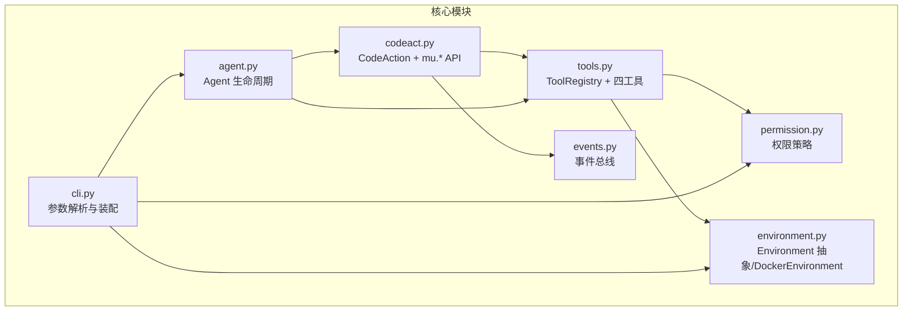
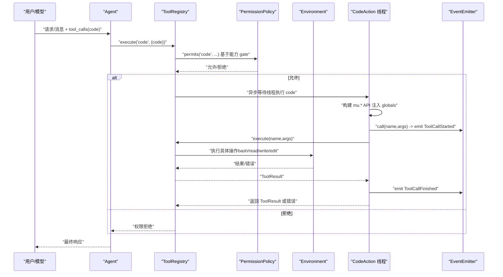
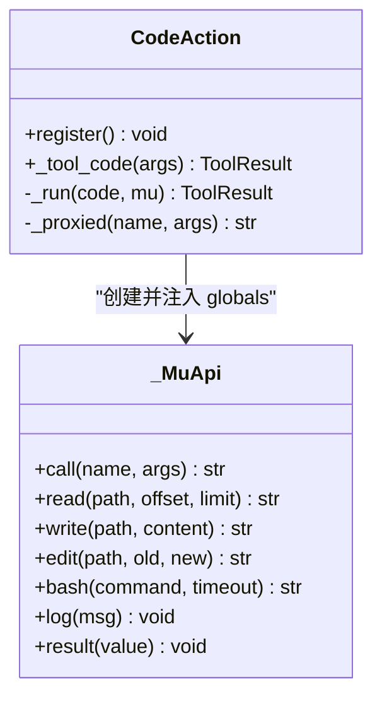
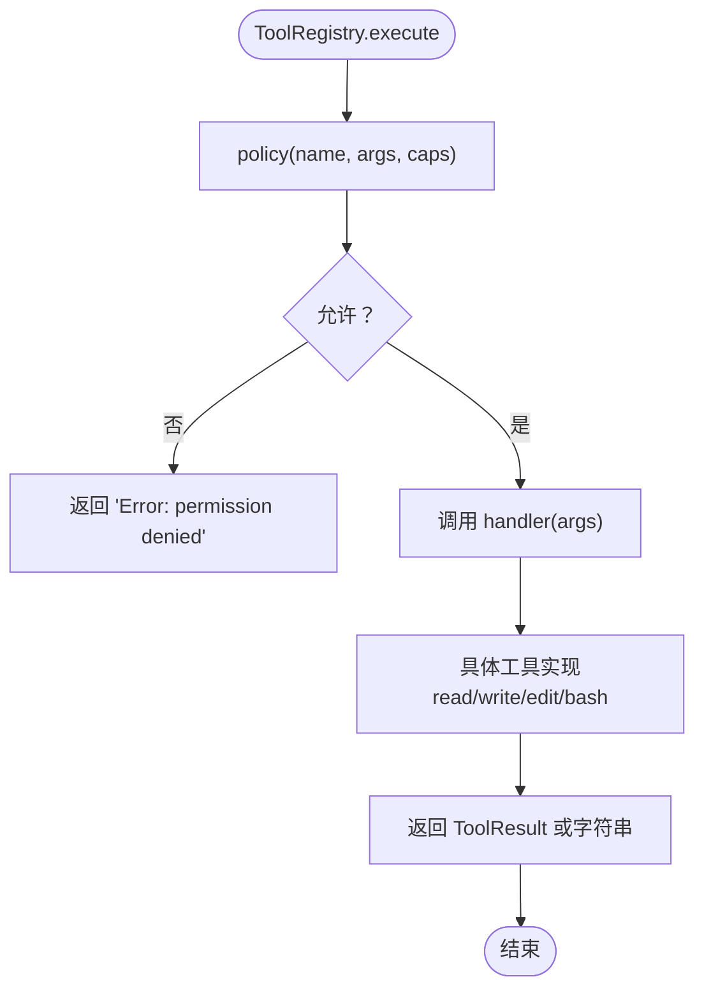
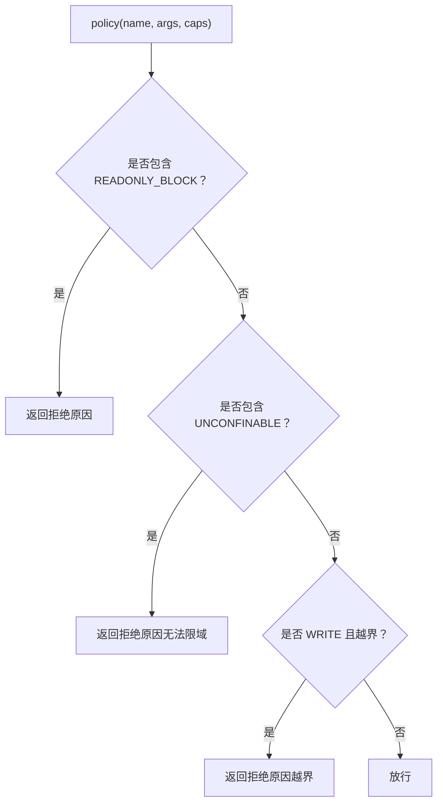
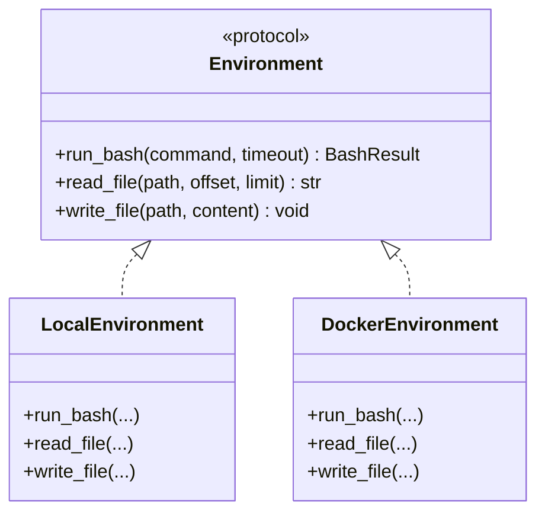
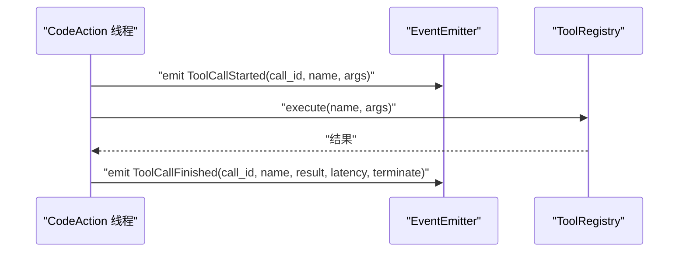
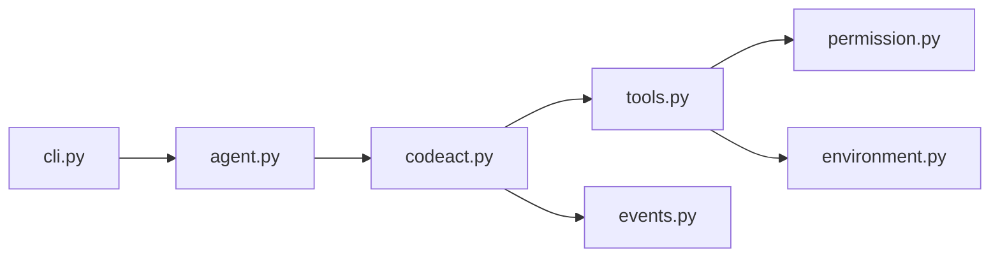

# 代码行动

<cite>
**本文引用的文件列表**
- [mu/codeact.py](file://mu/codeact.py)
- [mu/tools.py](file://mu/tools.py)
- [mu/permission.py](file://mu/permission.py)
- [mu/events.py](file://mu/events.py)
- [mu/environment.py](file://mu/environment.py)
- [mu/agent.py](file://mu/agent.py)
- [mu/cli.py](file://mu/cli.py)
- [tests/test_codeact.py](file://tests/test_codeact.py)
- [plan/M3.5-CodeAction-Sandbox-plan.md](file://plan/M3.5-CodeAction-Sandbox-plan.md)
</cite>

## 目录
1. [简介](#简介)
2. [项目结构](#项目结构)
3. [核心组件](#核心组件)
4. [架构总览](#架构总览)
5. [组件详解](#组件详解)
6. [依赖关系分析](#依赖关系分析)
7. [性能与可靠性](#性能与可靠性)
8. [故障排查指南](#故障排查指南)
9. [结论](#结论)
10. [附录](#附录)

## 简介
本文件系统性阐述 μ（mu）代码行动（Native Code Action）的技术方案与实现要点，重点覆盖：
- native code-action 的概念与“一次性 Python 组合多工具”的能力边界
- 安全控制机制、权限限制与沙箱隔离现状
- 进程内执行的工作原理、软超时与潜在风险
- 使用示例、最佳实践与常见问题
- 与工具系统（ToolRegistry）的集成与事件传播机制
- readonly/workspace 权限模式对代码行动的影响

## 项目结构
与代码行动相关的模块主要集中在 mu 包中，核心文件如下：
- 代码行动与工具 API：mu/codeact.py
- 工具注册与执行：mu/tools.py
- 权限策略与能力门控：mu/permission.py
- 事件总线与可观测：mu/events.py
- 环境抽象与沙箱：mu/environment.py
- Agent 生命周期与 CLI 参数：mu/agent.py、mu/cli.py
- 行为验证与回归测试：tests/test_codeact.py
- 规划文档与设计要点：plan/M3.5-CodeAction-Sandbox-plan.md

图表来源
- [mu/codeact.py:1-133](file://mu/codeact.py#L1-L133)
- [mu/tools.py:191-269](file://mu/tools.py#L191-L269)
- [mu/permission.py:29-69](file://mu/permission.py#L29-L69)
- [mu/events.py:121-133](file://mu/events.py#L121-L133)
- [mu/environment.py:99-150](file://mu/environment.py#L99-L150)
- [mu/agent.py:43-76](file://mu/agent.py#L43-L76)
- [mu/cli.py:26-83](file://mu/cli.py#L26-L83)

章节来源
- [mu/codeact.py:1-133](file://mu/codeact.py#L1-L133)
- [mu/tools.py:191-269](file://mu/tools.py#L191-L269)
- [mu/permission.py:29-69](file://mu/permission.py#L29-L69)
- [mu/events.py:121-133](file://mu/events.py#L121-L133)
- [mu/environment.py:99-150](file://mu/environment.py#L99-L150)
- [mu/agent.py:43-76](file://mu/agent.py#L43-L76)
- [mu/cli.py:26-83](file://mu/cli.py#L26-L83)

## 核心组件
- CodeAction：在进程内线程执行模型提供的 Python 代码，注入 mu.* 工具 API，将多次工具调用压缩为一次模型往返。
- _MuApi：在 worker 线程中提供 mu.read/write/edit/bash/call/log/result 等方法，通过 run_coroutine_threadsafe 将调用回送到事件循环，触发 ToolRegistry.execute 并发出 ToolCallStarted/Finished 事件。
- ToolRegistry：统一的工具注册与执行入口，支持内置四工具与扩展工具，按能力门控策略（PermissionPolicy）进行权限检查。
- PermissionPolicy：基于能力（capabilities）的策略，支持 allow_all、read_only、workspace_write 等模式。
- Environment：本地/容器化的执行环境抽象，当前默认 local，DockerEnvironment 仅对 bash 进行容器隔离。
- Agent 与 CLI：负责装配策略、环境与 CodeAction 能力，并通过命令行参数开启 code-action。

章节来源
- [mu/codeact.py:84-133](file://mu/codeact.py#L84-L133)
- [mu/tools.py:191-269](file://mu/tools.py#L191-L269)
- [mu/permission.py:29-69](file://mu/permission.py#L29-L69)
- [mu/environment.py:23-88](file://mu/environment.py#L23-L88)
- [mu/agent.py:43-76](file://mu/agent.py#L43-L76)
- [mu/cli.py:26-83](file://mu/cli.py#L26-L83)

## 架构总览
下面的序列图展示了从模型生成 code 工具调用到内部工具链路的完整流程，以及权限策略与事件传播的关键节点。

图表来源
- [mu/codeact.py:93-133](file://mu/codeact.py#L93-L133)
- [mu/tools.py:253-269](file://mu/tools.py#L253-L269)
- [mu/permission.py:29-69](file://mu/permission.py#L29-L69)
- [mu/environment.py:26-88](file://mu/environment.py#L26-L88)
- [mu/events.py:56-69](file://mu/events.py#L56-L69)

## 组件详解

### CodeAction 与 mu.* API
- 注册：在初始化时将 code 工具注册到 ToolRegistry，具备 capabilities={"code_exec"}。
- 执行：在事件循环中通过 asyncio.wait_for(asyncio.to_thread(...), timeout) 在 worker 线程执行模型代码。
- API：mu.read/write/edit/bash/call/log/result，其中 call/name,args 通过 run_coroutine_threadsafe 回到事件循环，触发 ToolCallStarted/Finished 事件与 ToolRegistry.execute。
- 超时：软超时（soft timeout）会标记 _cancelled，后续 mu.* 调用会被拒绝，但线程内 exec 无法被强制中断，存在滞留风险。

图表来源
- [mu/codeact.py:84-133](file://mu/codeact.py#L84-L133)

章节来源
- [mu/codeact.py:89-133](file://mu/codeact.py#L89-L133)
- [plan/M3.5-CodeAction-Sandbox-plan.md:48-55](file://plan/M3.5-CodeAction-Sandbox-plan.md#L48-L55)

### 工具注册与执行（ToolRegistry）
- 内置四工具：read/write/edit/bash，分别绑定 LocalEnvironment 的对应方法。
- 扩展工具：通过 register 动态注册，支持 capabilities 与 schema 合规。
- 权限门控：execute 前先调用 policy(name, args, caps)，若拒绝则直接返回错误。
- 统一返回：ToolResult，支持 terminate 标记用于控制自动后续 LLM 调用。

图表来源
- [mu/tools.py:253-269](file://mu/tools.py#L253-L269)
- [mu/tools.py:191-269](file://mu/tools.py#L191-L269)

章节来源
- [mu/tools.py:191-269](file://mu/tools.py#L191-L269)

### 权限策略与能力门控
- 能力常量：WRITE、SHELL、CODE_EXEC、EXTENSION_EXEC。
- 策略：
  - allow_all：默认策略，不拦截。
  - read_only：拦截 WRITE/SHELL/CODE_EXEC/EXTENSION_EXEC。
  - workspace_write：对 WRITE 进行路径约束，拒绝越界写。
- 门控位置：ToolRegistry.execute 前调用 policy，确保所有工具调用（含 code-action 内层调用）均受控。

图表来源
- [mu/permission.py:33-58](file://mu/permission.py#L33-L58)

章节来源
- [mu/permission.py:29-69](file://mu/permission.py#L29-L69)

### 环境抽象与沙箱
- Environment Protocol：定义 run_bash/read_file/write_file 三元组，便于替换实现。
- LocalEnvironment：默认实现，bash 使用进程组隔离，read/write 使用线程 offload。
- DockerEnvironment：实验性实现，仅对 bash 进行容器隔离（--network none），文件 IO 仍由宿主执行（最小实现）。
- make_environment(kind)：根据参数选择 local/docker。

图表来源
- [mu/environment.py:90-150](file://mu/environment.py#L90-L150)

章节来源
- [mu/environment.py:23-88](file://mu/environment.py#L23-L88)
- [mu/environment.py:99-150](file://mu/environment.py#L99-L150)

### 事件传播与可观测
- 事件类型：ToolCallStarted/Finished 记录内层工具调用的 call_id、名称、参数预览、耗时与 terminate 标记。
- 分发：EventEmitter 同步订阅分发，不引入外部发布订阅框架。
- 用途：归因统计、渲染与未来 TUI 消费同一事件流。

图表来源
- [mu/codeact.py:123-133](file://mu/codeact.py#L123-L133)
- [mu/events.py:56-69](file://mu/events.py#L56-L69)

章节来源
- [mu/events.py:121-133](file://mu/events.py#L121-L133)

### Agent 与 CLI 集成
- Agent：在 code_action=True 时注册 code 工具；根据 policy/env 构建 ToolRegistry；支持扩展管理。
- CLI：支持 --code/--permission/--sandbox 与环境变量 MU_CODE_ACTION/MU_PERMISSION/MU_SANDBOX；将参数传递给 Agent。

章节来源
- [mu/agent.py:43-76](file://mu/agent.py#L43-L76)
- [mu/cli.py:26-83](file://mu/cli.py#L26-L83)

## 依赖关系分析
- CodeAction 依赖 ToolRegistry 与 EventEmitter；通过 run_coroutine_threadsafe 将内层调用桥接到事件循环。
- ToolRegistry 依赖 PermissionPolicy 与 Environment；权限策略在执行前生效，环境抽象决定 bash 与文件 IO 的执行方式。
- Agent/CLI 负责装配策略与环境，并在需要时启用 CodeAction。

图表来源
- [mu/cli.py:26-83](file://mu/cli.py#L26-L83)
- [mu/agent.py:43-76](file://mu/agent.py#L43-L76)
- [mu/codeact.py:84-133](file://mu/codeact.py#L84-L133)
- [mu/tools.py:191-269](file://mu/tools.py#L191-L269)
- [mu/permission.py:29-69](file://mu/permission.py#L29-L69)
- [mu/environment.py:99-150](file://mu/environment.py#L99-L150)
- [mu/events.py:121-133](file://mu/events.py#L121-L133)

## 性能与可靠性
- 一次性组合多工具：通过在一次模型往返中用 Python 控制流组合多个工具调用，减少轮次与 token 消耗，带来“可测量收益”。
- 软超时与线程滞留：code-action 使用软超时（soft timeout），超时后会阻止后续 mu.* 调用，但线程内 exec 无法被强制中断，存在滞留风险。建议在容器中运行以获得真隔离。
- bash 超时与进程组清理：LocalEnvironment.run_bash 使用 start_new_session=True 并在超时后按进程组整组清理，避免孤儿进程。
- DockerEnvironment 限制：当前仅对 bash 进行容器隔离，文件 IO 仍由宿主执行，若需文件级隔离，建议将 μ 整体放入容器或实现更严格的环境抽象。

章节来源
- [plan/M3.5-CodeAction-Sandbox-plan.md:48-55](file://plan/M3.5-CodeAction-Sandbox-plan.md#L48-L55)
- [mu/environment.py:26-88](file://mu/environment.py#L26-L88)
- [mu/environment.py:112-137](file://mu/environment.py#L112-L137)

## 故障排查指南
- 代码行动默认关闭：未启用 --code 或 code_action=False 时，ToolRegistry 中不存在 code 工具。
- readonly 模式下被完全拦截：code 工具（code_exec）与内层工具（write/edit/bash）均被拒绝，连直接 Python open() 写也不会执行。
- workspace 模式下的路径约束：对 write 工具进行越界写检测，拒绝超出工作区的路径。
- 超时后调用被拒：超时后 _MuApi._cancelled=True，后续 mu.* 调用会抛出 RuntimeError，防止与下一轮交错。
- bash 超时与孤儿进程：确认 bash 命令在超时后被进程组清理，避免遗留子进程。

章节来源
- [tests/test_codeact.py:61-94](file://tests/test_codeact.py#L61-L94)
- [mu/codeact.py:97-106](file://mu/codeact.py#L97-L106)
- [mu/tools.py:253-269](file://mu/tools.py#L253-L269)
- [mu/environment.py:26-88](file://mu/environment.py#L26-L88)

## 结论
- native code-action 将“一次性 Python 组合多工具”的能力带入 μ，显著减少工具调用轮次与 token 消耗，具备“可测量收益”。
- 安全方面，权限策略基于能力门控，对 code-exec、shell、扩展执行等高危面进行有效拦截；readonly/workspace 模式下可进一步限制副作用范围。
- 沙箱隔离目前仅对 bash 提供容器级隔离，文件 IO 仍为宿主直通；如需真隔离，建议将 μ 运行在容器中。
- 软超时与线程滞留是已知限制，需结合策略与运行环境谨慎使用。

## 附录

### 使用示例与最佳实践
- 启用代码行动：通过命令行参数 --code 或设置环境变量 MU_CODE_ACTION=true。
- 权限策略选择：
  - 默认 allow（YOLO）：适合开发与测试。
  - readonly：生产或受限环境中优先选择，完全阻断写/执行/扩展加载等高危操作。
  - workspace：在允许写入的前提下，严格限制路径范围。
- 沙箱选择：
  - local：默认，bash 采用进程组隔离，文件 IO 由宿主执行。
  - docker：实验性，仅对 bash 进行容器隔离，文件 IO 仍由宿主执行；若需文件级隔离，建议整体容器化。
- 最佳实践：
  - 在 readonly/workspace 模式下优先尝试工具链组合，必要时再启用 code-action。
  - 对长时间运行的 bash 命令设置合理 timeout，避免资源占用。
  - 将 μ 运行在容器中以获得真隔离，降低代码行动带来的风险。

章节来源
- [mu/cli.py:33-38](file://mu/cli.py#L33-L38)
- [mu/agent.py:64-75](file://mu/agent.py#L64-L75)
- [mu/permission.py:61-69](file://mu/permission.py#L61-L69)
- [mu/environment.py:139-150](file://mu/environment.py#L139-L150)