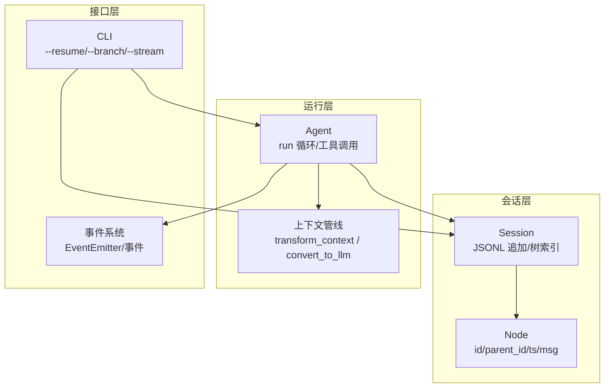
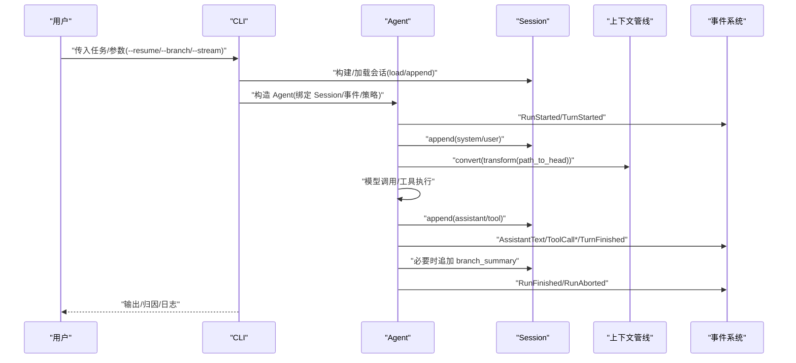
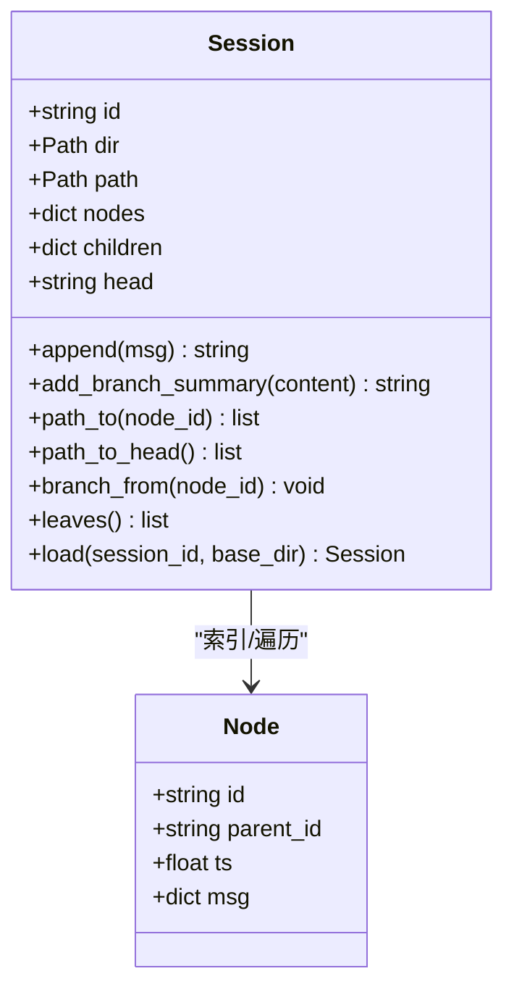
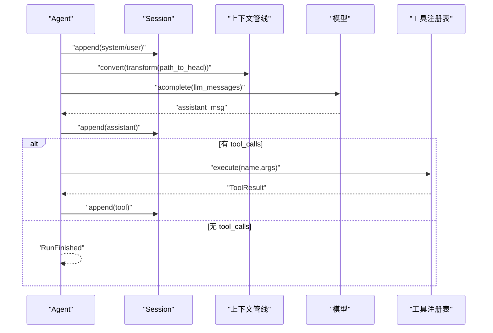
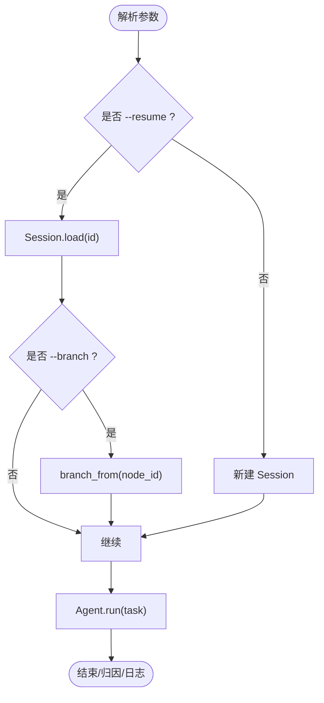
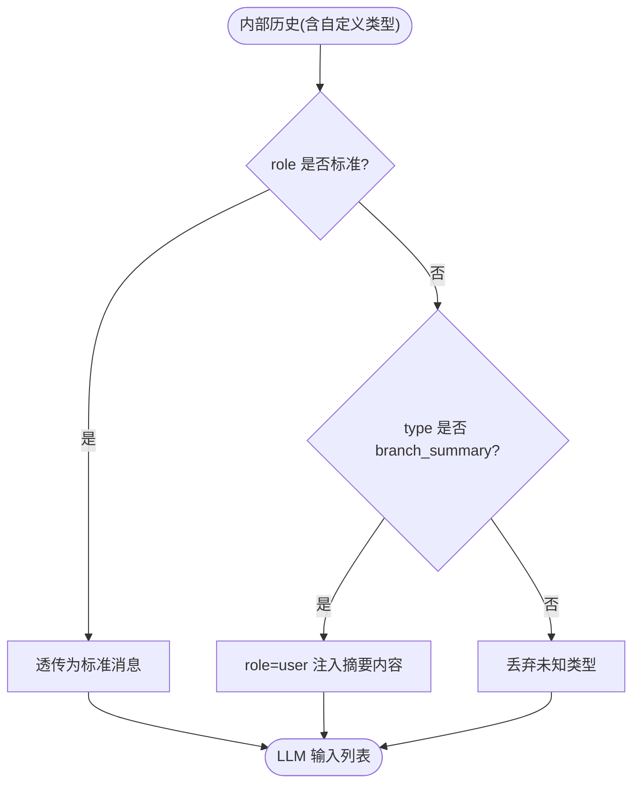
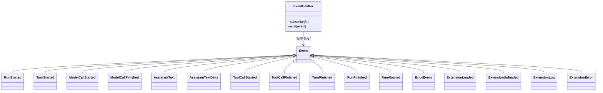
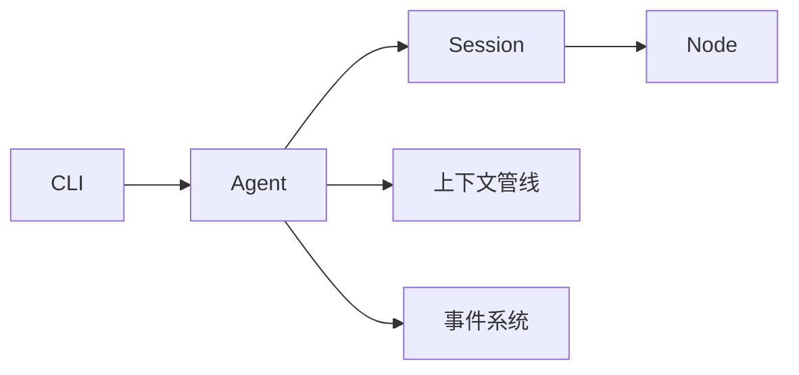

# 会话管理

<cite>
**本文引用的文件**   
- [mu/session.py](file://mu/session.py)
- [mu/agent.py](file://mu/agent.py)
- [mu/cli.py](file://mu/cli.py)
- [mu/context.py](file://mu/context.py)
- [mu/events.py](file://mu/events.py)
- [mu/__init__.py](file://mu/__init__.py)
- [tests/test_session.py](file://tests/test_session.py)
- [tests/test_agent_loop.py](file://tests/test_agent_loop.py)
- [tests/test_context.py](file://tests/test_context.py)
- [README.md](file://README.md)
</cite>

## 目录
1. [引言](#引言)
2. [项目结构](#项目结构)
3. [核心组件](#核心组件)
4. [架构总览](#架构总览)
5. [详细组件分析](#详细组件分析)
6. [依赖分析](#依赖分析)
7. [性能考量](#性能考量)
8. [故障排除指南](#故障排除指南)
9. [结论](#结论)
10. [附录](#附录)

## 引言
本文件面向 μ (mu) 会话管理系统，聚焦“树形结构会话存储”的设计与实现，系统性阐述会话的创建、加载、保存与恢复机制；详解分支与合并（侧分支摘要与结论带回主线）的工作流；说明 JSONL 格式的会话持久化与数据结构；并结合事件系统，给出最佳实践、性能建议、使用示例与故障排除方法。

## 项目结构
- 会话核心位于 mu/session.py，提供 Session 类与 Node 数据结构，采用 JSONL 追加式持久化与树形父子关系索引。
- Agent 在运行循环中使用 Session.path_to_head() 作为当前分支的线性历史，并通过上下文管线 convert_to_llm 将自定义消息（如 branch_summary）注入 LLM 上下文。
- CLI 支持 --resume/--branch 参数，负责构建/加载会话并驱动 Agent 运行。
- 事件系统 events.py 提供结构化事件与同步分发，贯穿运行生命周期。
- 上下文管线 context.py 定义 transform_context 与 convert_to_llm，确保自定义消息可控地参与模型输入。

图表来源
- [mu/session.py:38-114](file://mu/session.py#L38-L114)
- [mu/agent.py:43-133](file://mu/agent.py#L43-L133)
- [mu/context.py:15-30](file://mu/context.py#L15-L30)
- [mu/cli.py:26-83](file://mu/cli.py#L26-L83)
- [mu/events.py:121-133](file://mu/events.py#L121-L133)

章节来源
- [mu/session.py:1-115](file://mu/session.py#L1-L115)
- [mu/agent.py:1-200](file://mu/agent.py#L1-L200)
- [mu/cli.py:1-134](file://mu/cli.py#L1-L134)
- [mu/context.py:1-31](file://mu/context.py#L1-L31)
- [mu/events.py:1-133](file://mu/events.py#L1-L133)
- [README.md:52-61](file://README.md#L52-L61)

## 核心组件
- Session：树形会话存储的核心，支持追加消息、索引父子关系、计算从根到任一节点的线性路径、从任意节点分支、加载/保存 JSONL。
- Node：树节点，包含唯一 id、父节点 id、时间戳与消息体。
- Agent.messages：当前分支的线性历史（path_to_head），作为上下文管线输入。
- 上下文管线：transform_context（默认透传）与 convert_to_llm（标准消息透传，自定义类型 branch_summary 注入为 user 消息）。
- 事件系统：结构化事件与同步订阅分发，用于渲染、归因与可观测性。

章节来源
- [mu/session.py:30-114](file://mu/session.py#L30-L114)
- [mu/agent.py:77-80](file://mu/agent.py#L77-L80)
- [mu/context.py:15-30](file://mu/context.py#L15-L30)
- [mu/events.py:121-133](file://mu/events.py#L121-L133)

## 架构总览
下图展示从 CLI 到 Agent、Session、上下文管线与事件系统的端到端流程。

图表来源
- [mu/cli.py:42-83](file://mu/cli.py#L42-L83)
- [mu/agent.py:82-133](file://mu/agent.py#L82-L133)
- [mu/session.py:49-72](file://mu/session.py#L49-L72)
- [mu/context.py:20-30](file://mu/context.py#L20-L30)
- [mu/events.py:18-89](file://mu/events.py#L18-L89)

## 详细组件分析

### 会话类 Session：树形存储与 JSONL 持久化
- 设计要点
  - 追加式写入：每条消息以 JSONL 行形式追加，便于 KV-cache 友好与可复现。
  - 树索引：nodes 字典维护节点，children 字典维护父到子的映射；head 指向当前分支尾节点。
  - 路径查询：path_to(node_id) 从目标节点沿 parent_id 回溯至根，reverse 后得到线性路径；path_to_head() 获取当前分支线性历史。
  - 分支控制：branch_from(node_id) 将 head 移动到指定节点，后续 append 即从该节点派生新分支；若 node_id 不存在抛出 KeyError。
  - 侧分支摘要：add_branch_summary(content) 在当前 head（通常为主线）追加 type=branch_summary 的自定义消息，供 convert_to_llm 注入 LLM 上下文。
  - 加载/保存：load(session_id) 从 JSONL 重建 nodes/children/head；_persist(node) 将节点序列化写入文件。

图表来源
- [mu/session.py:30-114](file://mu/session.py#L30-L114)

章节来源
- [mu/session.py:38-114](file://mu/session.py#L38-L114)
- [tests/test_session.py:7-58](file://tests/test_session.py#L7-L58)

### Agent 与会话：运行循环中的会话使用
- Agent.messages 属性返回当前分支线性历史（path_to_head），作为上下文管线输入。
- 运行循环中：
  - 首次运行注入 system 消息；
  - 每轮将 llm_messages = convert(transform(path_to_head)) 输入模型；
  - 工具执行结果以 role=tool 追加到会话；
  - 当模型不再产生 tool_calls 时，本轮结束并发出 RunFinished。
- 分支摘要带回主线：Agent.summarize_branch(branch_leaf_id, return_to, summary_text?) 在 return_to 节点后追加 branch_summary，实现 side-quest 结论带回主线。

图表来源
- [mu/agent.py:82-133](file://mu/agent.py#L82-L133)
- [mu/context.py:20-30](file://mu/context.py#L20-L30)
- [mu/session.py:76-88](file://mu/session.py#L76-L88)

章节来源
- [mu/agent.py:77-133](file://mu/agent.py#L77-L133)
- [tests/test_agent_loop.py:205-224](file://tests/test_agent_loop.py#L205-L224)

### CLI 与会话：续跑与分支
- 解析参数：--resume 与 --branch 控制会话加载与分支位置。
- 构建会话：_build_session(ns) 在 resume 模式下调用 Session.load 并可选 branch_from。
- 运行：_run 创建 Agent 并执行 run，最终统一关闭资源。

图表来源
- [mu/cli.py:26-83](file://mu/cli.py#L26-L83)

章节来源
- [mu/cli.py:42-83](file://mu/cli.py#L42-L83)
- [README.md:54-61](file://README.md#L54-L61)

### 上下文管线与自定义消息：branch_summary 注入
- transform_context 默认透传，保留扩展点。
- convert_to_llm 对标准角色消息透传；对 type=branch_summary 的消息转换为 role=user 的注入消息，从而将侧分支结论纳入 LLM 上下文。

图表来源
- [mu/context.py:20-30](file://mu/context.py#L20-L30)
- [tests/test_context.py:22-39](file://tests/test_context.py#L22-L39)

章节来源
- [mu/context.py:15-30](file://mu/context.py#L15-L30)
- [tests/test_context.py:7-39](file://tests/test_context.py#L7-L39)

### 事件系统：结构化事件与同步分发
- 事件类型覆盖运行生命周期（RunStarted/TurnStarted/ModelCall*/AssistantText/ToolCall*/TurnFinished/RunFinished/RunAborted/ErrorEvent 等）。
- EventEmitter 提供 subscribe/emit，同步分发给多个订阅者（如 StdoutRenderer、AttributionCollector）。

图表来源
- [mu/events.py:13-133](file://mu/events.py#L13-L133)

章节来源
- [mu/events.py:1-133](file://mu/events.py#L1-L133)

## 依赖分析
- Session 与 Node：Session 维护 nodes/children/head，提供 path_to/path_to_head/branch_from/add_branch_summary/load/_persist 等方法。
- Agent 依赖 Session（messages）、上下文管线（transform/convert）、事件系统（emitter）与工具注册表（tools）。
- CLI 依赖 Session（构建/加载）、Agent（运行）、事件系统（订阅渲染与归因）。
- 上下文管线与事件系统相互独立，但共同服务于 Agent 的运行与可观测性。

图表来源
- [mu/cli.py:42-83](file://mu/cli.py#L42-L83)
- [mu/agent.py:43-75](file://mu/agent.py#L43-L75)
- [mu/session.py:38-114](file://mu/session.py#L38-L114)
- [mu/context.py:15-30](file://mu/context.py#L15-L30)
- [mu/events.py:121-133](file://mu/events.py#L121-L133)

章节来源
- [mu/__init__.py:14-31](file://mu/__init__.py#L14-L31)
- [mu/agent.py:43-75](file://mu/agent.py#L43-L75)
- [mu/cli.py:42-83](file://mu/cli.py#L42-L83)

## 性能考量
- 追加式 JSONL 写入：每次 append 仅追加一行，I/O 成本低且可复现；适合长会话与 KV-cache 场景。
- 内存索引：nodes/children 字典提供 O(1) 查找与 O(k) 路径回溯（k 为路径长度），适合频繁分支与导航。
- 路径反转：path_to 中 reverse 操作为 O(k)，在典型对话轮次下开销可忽略。
- 事件同步分发：事件总线为同步订阅，避免引入额外并发与锁，降低复杂度。
- 上下文转换：convert_to_llm 仅线性扫描消息，复杂度 O(n)，其中 n 为历史长度。

[本节为通用性能讨论，不直接分析具体文件]

## 故障排除指南
- 会话文件不存在
  - 现象：Session.load 抛出 FileNotFoundError。
  - 排查：确认 MU_SESSION_DIR 或默认 .mu/sessions 路径存在；检查 session_id 是否正确。
  - 参考
    - [mu/session.py:98-114](file://mu/session.py#L98-L114)
    - [tests/test_session.py:22-24](file://tests/test_session.py#L22-L24)
- 分支节点不存在
  - 现象：branch_from 抛出 KeyError。
  - 排查：确认 node_id 来源于同一会话；检查会话加载是否完整。
  - 参考
    - [mu/session.py:90-93](file://mu/session.py#L90-L93)
    - [tests/test_session.py:51-58](file://tests/test_session.py#L51-L58)
- 侧分支摘要未注入 LLM 上下文
  - 现象：branch_summary 未出现在 convert_to_llm 输出。
  - 排查：确认 type=branch_summary 的消息已追加；确认 convert_to_llm 正常执行。
  - 参考
    - [mu/context.py:20-30](file://mu/context.py#L20-L30)
    - [tests/test_context.py:22-39](file://tests/test_context.py#L22-L39)
- 运行中断导致工具执行缺失
  - 现象：工具调用被取消，后续无法 resume。
  - 处理：Agent 在 _append_pending_tool_errors 中为剩余未执行的 tool call 追加错误消息，保证每个 tool_call 都有对应 tool 结果，可安全 resume。
  - 参考
    - [mu/agent.py:165-173](file://mu/agent.py#L165-L173)
- CLI 参数错误
  - 现象：--resume 未指定 session_id 或 --branch 未指定 node_id。
  - 处理：根据帮助信息补齐参数；或从 stdout/stderr 查看 usage 提示。
  - 参考
    - [mu/cli.py:26-39](file://mu/cli.py#L26-L39)
    - [README.md:54-61](file://README.md#L54-L61)

章节来源
- [mu/session.py:98-114](file://mu/session.py#L98-L114)
- [mu/agent.py:165-173](file://mu/agent.py#L165-L173)
- [mu/context.py:20-30](file://mu/context.py#L20-L30)
- [mu/cli.py:26-39](file://mu/cli.py#L26-L39)
- [README.md:54-61](file://README.md#L54-L61)

## 结论
μ 的会话管理以“树形结构 + JSONL 追加”为核心，既保证了会话的可复现与可分支，又通过上下文管线与事件系统实现了可控的 LLM 输入与可观测性。侧分支摘要（branch_summary）与程序化 API（Agent.summarize_branch）使 side-quest 的结论能够带回主线，形成闭环的工作流。结合测试用例与 CLI 使用方式，可稳定地进行会话创建、加载、保存、恢复与分支合并。

[本节为总结性内容，不直接分析具体文件]

## 附录

### JSONL 持久化格式与数据结构
- 文件位置：默认在工作目录下的 .mu/sessions/<session_id>.jsonl；可通过 MU_SESSION_DIR 覆盖。
- 每行一条 JSON 对象，字段含义：
  - id：节点唯一标识
  - parent_id：父节点 id（根节点为 null/None）
  - ts：时间戳
  - msg：消息体（字典）
- 读取逻辑：逐行解析，重建 nodes/children/head；默认 head 指向最后一个节点。

章节来源
- [mu/session.py:65-72](file://mu/session.py#L65-L72)
- [mu/session.py:98-114](file://mu/session.py#L98-L114)
- [README.md:52-53](file://README.md#L52-L53)

### 使用示例与最佳实践
- 创建与续跑
  - 新建会话：直接运行命令，首次注入 system 消息并追加 user 任务。
  - 续跑：使用 --resume <session_id>，从上次结束处继续。
  - 参考
    - [README.md:54-59](file://README.md#L54-L59)
- 分支与合并
  - 从某节点分支：--resume <session_id> --branch <node_id>，随后在新分支上继续工作。
  - 将侧分支结论带回主线：调用 Agent.summarize_branch(branch_leaf_id, return_to) 或 Session.add_branch_summary(...)，由 convert_to_llm 注入为 user 消息。
  - 参考
    - [README.md:61-61](file://README.md#L61-L61)
    - [tests/test_agent_loop.py:205-224](file://tests/test_agent_loop.py#L205-L224)
    - [tests/test_session.py:42-48](file://tests/test_session.py#L42-L48)
- 事件与可观测性
  - 订阅事件：StdoutRenderer 与 AttributionCollector 作为订阅者，同步接收事件并输出/统计。
  - 参考
    - [mu/cli.py:70-72](file://mu/cli.py#L70-L72)
    - [mu/events.py:121-133](file://mu/events.py#L121-L133)

章节来源
- [README.md:52-61](file://README.md#L52-L61)
- [tests/test_agent_loop.py:205-224](file://tests/test_agent_loop.py#L205-L224)
- [tests/test_session.py:42-48](file://tests/test_session.py#L42-L48)
- [mu/cli.py:70-72](file://mu/cli.py#L70-L72)
- [mu/events.py:121-133](file://mu/events.py#L121-L133)