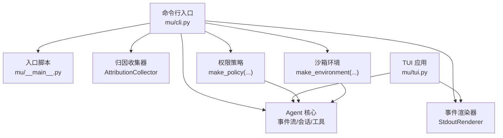
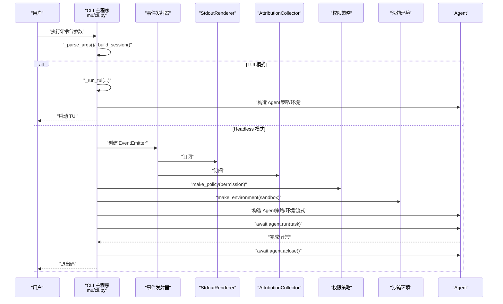
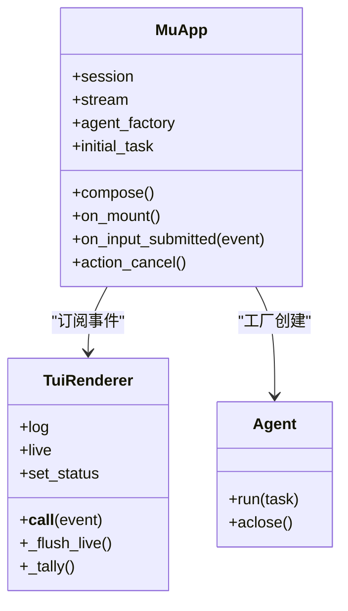
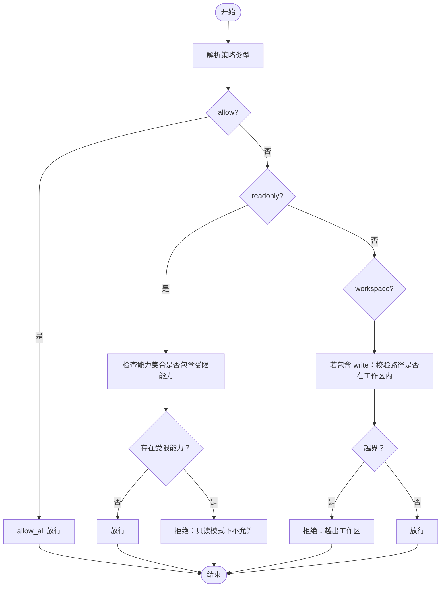
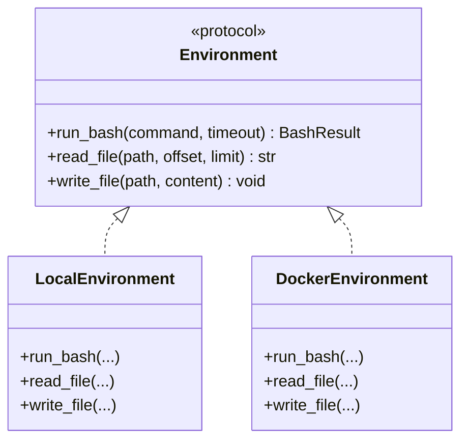
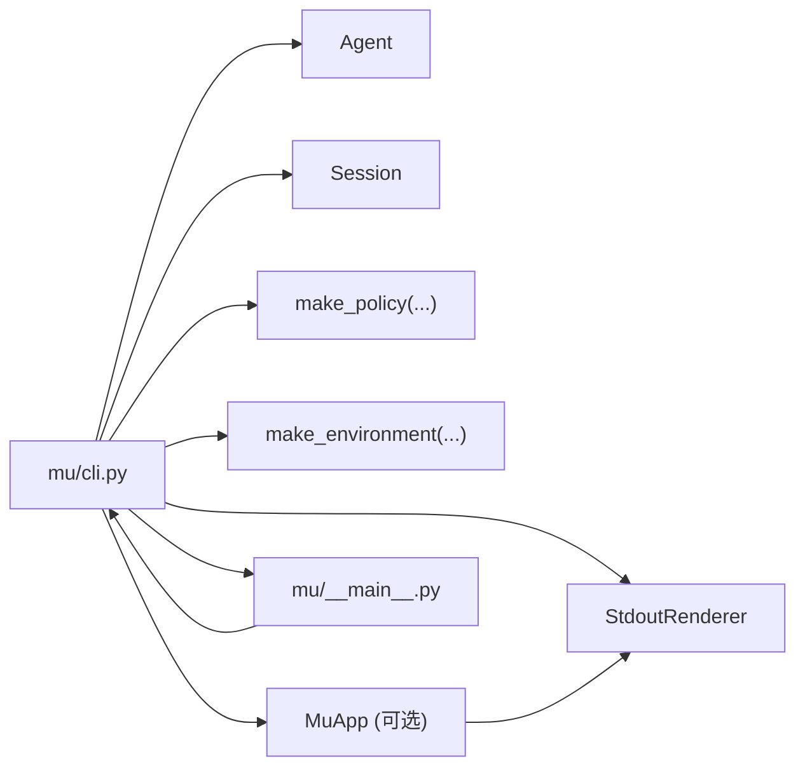

# 命令行接口

<cite>
**本文引用的文件**
- [mu/cli.py](file://mu/cli.py)
- [mu/__main__.py](file://mu/__main__.py)
- [README.md](file://README.md)
- [pyproject.toml](file://pyproject.toml)
- [mu/tui.py](file://mu/tui.py)
- [mu/permission.py](file://mu/permission.py)
- [mu/environment.py](file://mu/environment.py)
- [mu/render.py](file://mu/render.py)
- [tests/test_tui.py](file://tests/test_tui.py)
- [tests/test_sandbox.py](file://tests/test_sandbox.py)
- [tests/test_permission.py](file://tests/test_permission.py)
- [extensions/README.md](file://extensions/README.md)
- [extensions/example_textstats.py](file://extensions/example_textstats.py)
</cite>

## 目录
1. [简介](#简介)
2. [项目结构](#项目结构)
3. [核心组件](#核心组件)
4. [架构总览](#架构总览)
5. [详细组件分析](#详细组件分析)
6. [依赖分析](#依赖分析)
7. [性能考虑](#性能考虑)
8. [故障排查指南](#故障排查指南)
9. [结论](#结论)
10. [附录](#附录)

## 简介
本文件面向 μ（mu）命令行接口的使用者与维护者，系统化阐述命令行参数与选项、运行模式（headless 与 TUI）、流式输出、权限控制与沙箱配置，并提供从入门到进阶的使用示例、参数组合效果与最佳实践、错误处理与调试技巧以及性能优化建议。目标是帮助用户快速上手并在复杂场景中稳定高效地使用 μ。

## 项目结构
- 命令行入口位于 mu/cli.py，负责解析参数、构建会话、装配事件订阅者、调度 Agent 并处理异常。
- 入口脚本通过 mu/__main__.py 调用 CLI 主函数。
- README.md 提供安装、配置与典型用法示例。
- pyproject.toml 定义可选依赖（如 TUI）与命令入口。
- TUI 实现位于 mu/tui.py，与 headless 共享同一 Agent/Session/事件流。
- 权限策略位于 mu/permission.py，提供 allow/readonly/workspace 三种策略。
- 沙箱环境抽象位于 mu/environment.py，提供 local 与 docker 两种 provider。
- 标准输出渲染器位于 mu/render.py，支持流式增量输出。
- 测试文件覆盖 TUI 行为、权限策略与沙箱选择逻辑。

图表来源
- [mu/cli.py:51-83](file://mu/cli.py#L51-L83)
- [mu/__main__.py:1-5](file://mu/__main__.py#L1-L5)
- [mu/tui.py:122-200](file://mu/tui.py#L122-L200)
- [mu/permission.py:61-69](file://mu/permission.py#L61-L69)
- [mu/environment.py:139-150](file://mu/environment.py#L139-L150)

章节来源
- [mu/cli.py:26-39](file://mu/cli.py#L26-L39)
- [mu/__main__.py:1-5](file://mu/__main__.py#L1-L5)
- [README.md:42-71](file://README.md#L42-L71)
- [pyproject.toml:23-24](file://pyproject.toml#L23-L24)

## 核心组件
- 命令行参数与选项
  - 任务输入：位置参数 task（可从标准输入读取）
  - 续跑与分支：--resume 会话 ID；--branch 从指定节点分支
  - 输出模式：--stream 开启流式输出；默认 headless（无 --tui）
  - 交互界面：--tui 启动 Textual TUI
  - 原生代码动作：--code 启用 code 工具；可通过环境变量 MU_CODE_ACTION 控制
  - 权限策略：--permission 可选 allow/readonly/workspace；可通过环境变量 MU_PERMISSION 控制
  - 沙箱提供方：--sandbox 可选 local/docker；可通过环境变量 MU_SANDBOX 控制
- 事件订阅者
  - StdoutRenderer：headless 模式下的标准输出渲染
  - AttributionCollector：归因报告收集（轮数、LLM 时延、工具时延、Token）
- 会话管理
  - Session：支持新建、加载、分支（branch_from）

章节来源
- [mu/cli.py:26-39](file://mu/cli.py#L26-L39)
- [mu/cli.py:42-48](file://mu/cli.py#L42-L48)
- [mu/render.py:31-78](file://mu/render.py#L31-L78)

## 架构总览
μ CLI 的运行流程如下：
- 解析参数，决定是否进入 TUI 或 headless 模式
- headless 模式下，若未显式提供任务，则从标准输入读取
- 构建事件发射器，订阅 StdoutRenderer 与 AttributionCollector
- 基于 --permission 与 --sandbox 生成策略与环境
- 创建 Agent 并运行任务，最终关闭扩展子进程

图表来源
- [mu/cli.py:51-83](file://mu/cli.py#L51-L83)
- [mu/cli.py:86-112](file://mu/cli.py#L86-L112)
- [mu/render.py:31-78](file://mu/render.py#L31-L78)

## 详细组件分析

### 命令行参数与选项详解
- 任务输入
  - 位置参数 task：字符串列表，拼接后作为任务
  - 未提供 task 且未开启 --tui：尝试从标准输入读取
- 续跑与分支
  - --resume：加载已有会话
  - --branch：从指定节点 ID 分支（需配合 --resume）
- 输出模式
  - --stream：启用流式输出（增量打印）
  - --tui：启动交互式 TUI（Textual）
- 原生代码动作
  - --code：启用 code 工具（一次写 Python 组合多工具）
  - 环境变量 MU_CODE_ACTION：默认关闭，设为“真值”可默认开启
- 权限控制
  - --permission：allow/readonly/workspace
  - 环境变量 MU_PERMISSION：默认 allow
  - readonly 与 workspace 会整体拦截 code 工具
- 沙箱配置
  - --sandbox：local/docker
  - 环境变量 MU_SANDBOX：默认 local
  - docker 仅对 bash 在容器内执行，文件工具仍为宿主 IO

章节来源
- [mu/cli.py:26-39](file://mu/cli.py#L26-L39)
- [mu/cli.py:42-48](file://mu/cli.py#L42-L48)
- [README.md:84-96](file://README.md#L84-L96)
- [mu/permission.py:61-69](file://mu/permission.py#L61-L69)
- [mu/environment.py:99-137](file://mu/environment.py#L99-L137)

### TUI 模式（Textual）
- TUI 与 headless 共享同一 Agent/Session/事件流
- TUI 通过事件订阅者将动态内容渲染至 RichLog 与实时静态区域
- 支持取消运行（Esc）、退出（Ctrl+Q）
- 可通过 --stream 在 TUI 中启用流式输出

图表来源
- [mu/tui.py:122-200](file://mu/tui.py#L122-L200)
- [mu/tui.py:44-120](file://mu/tui.py#L44-L120)

章节来源
- [mu/cli.py:86-112](file://mu/cli.py#L86-L112)
- [mu/tui.py:122-200](file://mu/tui.py#L122-L200)
- [tests/test_tui.py:59-91](file://tests/test_tui.py#L59-L91)

### 权限策略（Policy）
- 策略类型
  - allow_all：默认策略，允许所有能力
  - read_only：只读策略，拦截 write/edit/bash/code_exec/extension_exec
  - workspace_write：工作区写入策略，仅允许在工作区内写入，且无法限制 shell/code/exec 的逃逸
- 能力维度
  - write/shell/code_exec/extension_exec 用于细粒度控制
- 策略选择
  - 通过 make_policy(kind, root=...) 返回策略函数
  - 与工具注册时的能力集合进行匹配，统一在 ToolRegistry.execute 钩子处生效

图表来源
- [mu/permission.py:29-58](file://mu/permission.py#L29-L58)
- [mu/permission.py:61-69](file://mu/permission.py#L61-L69)

章节来源
- [mu/permission.py:1-69](file://mu/permission.py#L1-L69)
- [tests/test_permission.py:16-37](file://tests/test_permission.py#L16-L37)
- [tests/test_permission.py:55-71](file://tests/test_permission.py#L55-L71)

### 沙箱环境（Environment）
- LocalEnvironment
  - 本地 bash 子进程执行，文件读写在宿主 IO
  - 超时采用进程组级清理，避免孤儿进程
- DockerEnvironment（实验性）
  - 仅对 bash 在容器内执行（--network none），文件工具仍为宿主 IO
  - 通过卷映射将工作区挂载到 /workspace
- make_environment(kind, ...) 选择具体 provider

图表来源
- [mu/environment.py:90-150](file://mu/environment.py#L90-L150)

章节来源
- [mu/environment.py:23-88](file://mu/environment.py#L23-L88)
- [mu/environment.py:99-137](file://mu/environment.py#L99-L137)
- [tests/test_sandbox.py:11-25](file://tests/test_sandbox.py#L11-L25)

### 流式输出（Stream）
- StdoutRenderer 支持 AssistantTextDelta 增量输出，保持同一行连续打印
- TUI 与 headless 均可启用 --stream，TUI 中增量内容显示在实时静态区域

章节来源
- [mu/render.py:31-78](file://mu/render.py#L31-L78)
- [mu/tui.py:72-78](file://mu/tui.py#L72-L78)

### 使用示例与最佳实践
- 基础运行
  - 从命令行传入任务
  - 从标准输入传入任务
  - 流式输出（默认关闭）
- 续跑与分支
  - --resume 加载会话，--branch 从指定节点分支
- TUI 模式
  - --tui 启动交互界面；--tui --stream 启用流式
- 权限控制
  - --permission readonly：只读模式，拒绝所有写/执行/扩展加载
  - --permission workspace：仅允许在工作区内写入，拒绝 shell/code/exec
- 沙箱配置
  - --sandbox docker：仅 bash 在容器内执行（需本机安装 Docker）
- 组合示例
  - --code 与 --permission readonly：冲突，readonly 会整体拦截 code 工具
  - --sandbox docker 与文件工具：文件读写仍在宿主 IO，不隔离

章节来源
- [README.md:42-71](file://README.md#L42-L71)
- [README.md:84-96](file://README.md#L84-L96)
- [mu/cli.py:59-63](file://mu/cli.py#L59-L63)

## 依赖分析
- CLI 依赖
  - Agent、Session、EventEmitter、StdoutRenderer、AttributionCollector
  - 权限策略与沙箱环境由外部模块提供
- 可选依赖
  - TUI：textual
- 命令入口
  - 通过 pyproject.toml 的 scripts 将 mu 指向 mu.cli:main

图表来源
- [mu/cli.py:12-19](file://mu/cli.py#L12-L19)
- [pyproject.toml:23-24](file://pyproject.toml#L23-L24)

章节来源
- [pyproject.toml:14-21](file://pyproject.toml#L14-L21)
- [mu/__main__.py:1-5](file://mu/__main__.py#L1-L5)

## 性能考虑
- 流式输出
  - --stream 可降低感知延迟，适合长输出任务
- 超时与资源清理
  - bash 超时采用进程组级清理，避免僵尸进程
- I/O 与并发
  - 文件读写与阻塞操作通过线程/子进程 offload，避免阻塞事件循环
- TUI 与 headless 共享核心
  - 减少重复初始化开销，提高复用效率

章节来源
- [mu/environment.py:26-48](file://mu/environment.py#L26-L48)
- [mu/environment.py:50-65](file://mu/environment.py#L50-L65)
- [mu/render.py:36-47](file://mu/render.py#L36-L47)

## 故障排查指南
- 会话错误
  - --resume 指定的会话不存在或节点 ID 错误：返回非零退出码
- 配置错误
  - 模型配置缺失或无效：抛出 ConfigError，打印错误信息并返回非零退出码
- TUI 依赖缺失
  - 未安装 [tui] 可选依赖：提示安装 textual
- 权限问题
  - readonly/workspace 拦截写/执行/扩展加载：根据策略拒绝并返回相应信息
- 沙箱问题
  - docker 不可用：测试中通过 shutil.which("docker") 跳过相关用例
- 中断信号
  - Ctrl+C：捕获 KeyboardInterrupt，打印中断信息并返回特定退出码

章节来源
- [mu/cli.py:64-83](file://mu/cli.py#L64-L83)
- [mu/cli.py:89-103](file://mu/cli.py#L89-L103)
- [tests/test_sandbox.py:19-25](file://tests/test_sandbox.py#L19-L25)
- [tests/test_permission.py:16-27](file://tests/test_permission.py#L16-L27)

## 结论
μ 的命令行接口以简洁参数与清晰职责划分为核心设计原则：通过 --stream/--tui 控制输出与交互，通过 --permission/--sandbox 管理安全边界，通过 --resume/--branch 支持会话续跑与分支探索。结合 TUI 与 headless 的统一核心，用户可在不同场景下灵活切换，并获得一致的可观察能力与归因报告。

## 附录

### 参数速查表
- 任务与输入
  - task：任务描述（可为空，从 stdin 读取）
  - --resume SESSION_ID：续跑已有会话
  - --branch NODE_ID：从指定节点分支（需配合 --resume）
- 输出与交互
  - --stream：启用流式输出
  - --tui：启动 Textual 交互界面
- 安全与沙箱
  - --permission {allow,readonly,workspace}
  - --sandbox {local,docker}
  - 环境变量：MU_PERMISSION、MU_SANDBOX、MU_CODE_ACTION
- 典型组合
  - --tui --stream：交互式流式输出
  - --permission readonly + --code：冲突，code 将被整体拦截
  - --sandbox docker：仅 bash 在容器内执行，文件工具仍为宿主 IO

章节来源
- [mu/cli.py:26-39](file://mu/cli.py#L26-L39)
- [README.md:84-96](file://README.md#L84-L96)

### 使用示例索引
- 基础运行与流式输出
  - [README.md:44-50](file://README.md#L44-L50)
- 续跑与分支
  - [README.md:54-61](file://README.md#L54-L61)
- TUI 模式
  - [README.md:63-71](file://README.md#L63-L71)
- 权限与沙箱
  - [README.md:84-96](file://README.md#L84-L96)
- 扩展加载与自延伸
  - [extensions/README.md:1-58](file://extensions/README.md#L1-L58)
  - [extensions/example_textstats.py:1-67](file://extensions/example_textstats.py#L1-L67)