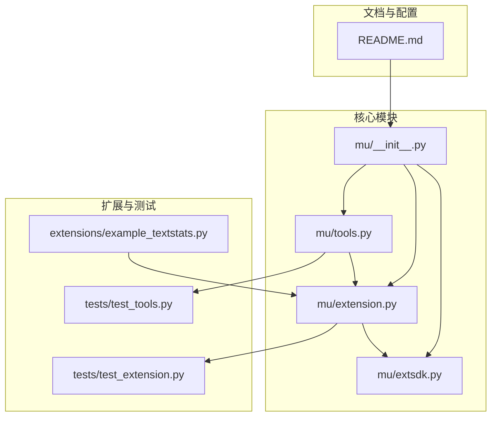
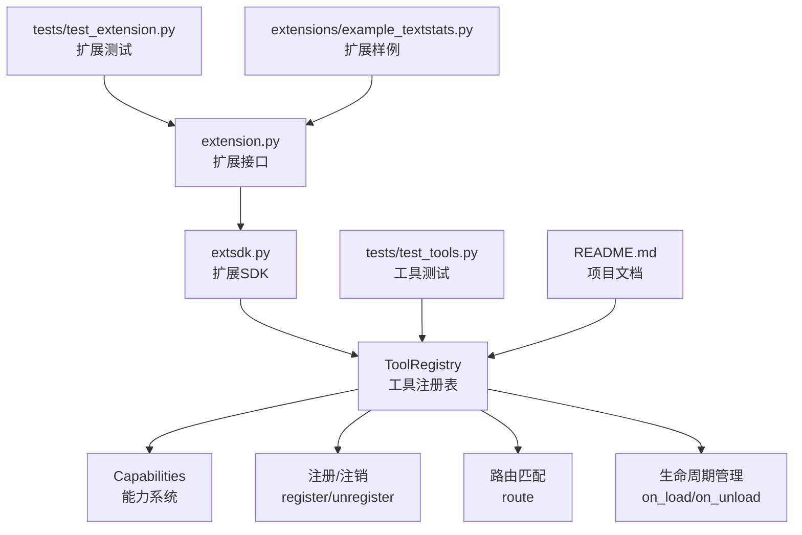
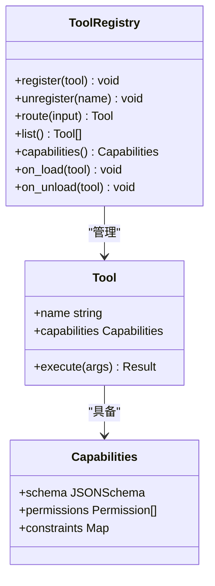
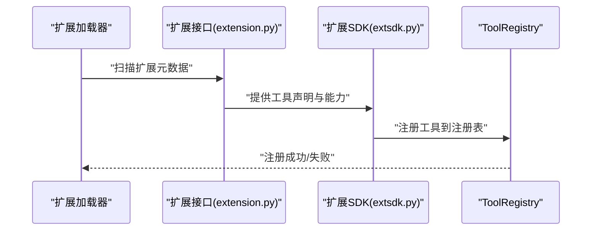
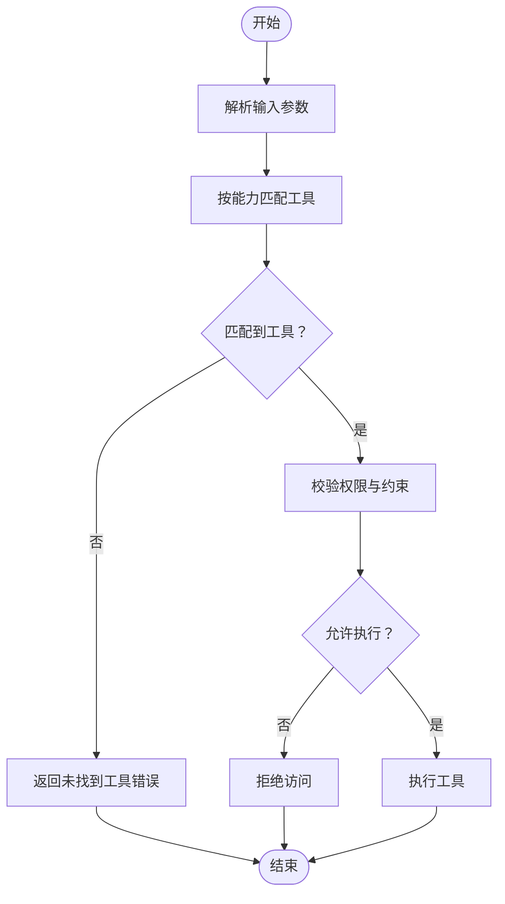
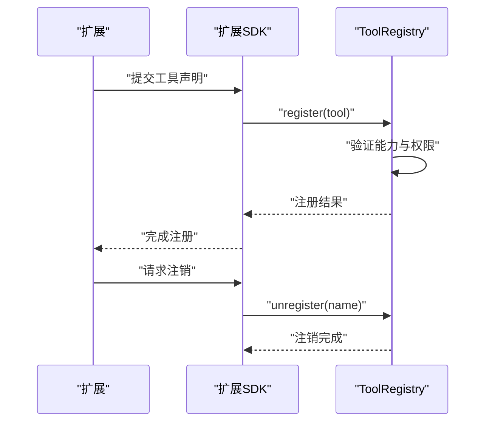
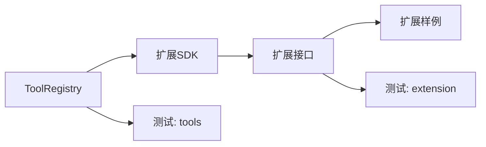

# 工具注册表

<cite>
**本文引用的文件**
- [tools.py](file://mu/tools.py)
- [extension.py](file://mu/extension.py)
- [extsdk.py](file://mu/extsdk.py)
- [test_tools.py](file://tests/test_tools.py)
- [test_extension.py](file://tests/test_extension.py)
- [example_textstats.py](file://extensions/example_textstats.py)
- [README.md](file://README.md)
- [__init__.py](file://mu/__init__.py)
</cite>

## 目录
1. [简介](#简介)
2. [项目结构](#项目结构)
3. [核心组件](#核心组件)
4. [架构总览](#架构总览)
5. [详细组件分析](#详细组件分析)
6. [依赖关系分析](#依赖关系分析)
7. [性能考虑](#性能考虑)
8. [故障排除指南](#故障排除指南)
9. [结论](#结论)
10. [附录](#附录)

## 简介
本技术文档围绕 μ（mu）工具注册表系统展开，重点阐述 ToolRegistry 的设计架构、工具注册机制与生命周期管理；解释内置工具与扩展工具的差异、动态注册与注销流程；深入分析工具能力系统（capabilities）、模式匹配与路由机制；并提供最佳实践、性能优化建议与故障排除指南。文档同时给出基于仓库现有实现的完整使用示例路径，帮助读者快速上手并正确使用注册表进行工具管理。

## 项目结构
μ 工具注册表相关的核心代码位于 mu/tools.py，并通过扩展机制在 mu/extension.py 与 mu/extsdk.py 中得到扩展支持。测试用例位于 tests/test_tools.py 与 tests/test_extension.py，扩展样例位于 extensions/example_textstats.py。README.md 提供了项目背景与使用说明，mu/__init__.py 暴露了模块入口。

**图表来源**
- [tools.py](file://mu/tools.py)
- [extension.py](file://mu/extension.py)
- [extsdk.py](file://mu/extsdk.py)
- [example_textstats.py](file://extensions/example_textstats.py)
- [test_tools.py](file://tests/test_tools.py)
- [test_extension.py](file://tests/test_extension.py)
- [README.md](file://README.md)
- [__init__.py](file://mu/__init__.py)

**章节来源**
- [README.md](file://README.md)
- [__init__.py](file://mu/__init__.py)

## 核心组件
- ToolRegistry：工具注册表的核心类，负责工具的注册、查询、路由与生命周期管理。
- 扩展接口与SDK：通过 extension.py 与 extsdk.py 提供扩展加载、能力声明与运行时集成。
- 内置工具与扩展工具：内置工具由核心模块定义，扩展工具通过扩展SDK动态加载。
- 能力系统（capabilities）：用于描述工具的能力边界与约束，驱动模式匹配与路由决策。
- 测试与示例：通过测试用例与扩展样例验证注册表行为与扩展加载流程。

**章节来源**
- [tools.py](file://mu/tools.py)
- [extension.py](file://mu/extension.py)
- [extsdk.py](file://mu/extsdk.py)
- [test_tools.py](file://tests/test_tools.py)
- [test_extension.py](file://tests/test_extension.py)
- [example_textstats.py](file://extensions/example_textstats.py)

## 架构总览
下图展示了工具注册表的整体架构：ToolRegistry 作为核心协调者，负责工具的注册与查询；扩展通过 extension.py 与 extsdk.py 注入；测试用例覆盖注册、路由与扩展加载等关键场景。

**图表来源**
- [tools.py](file://mu/tools.py)
- [extension.py](file://mu/extension.py)
- [extsdk.py](file://mu/extsdk.py)
- [test_tools.py](file://tests/test_tools.py)
- [test_extension.py](file://tests/test_extension.py)
- [example_textstats.py](file://extensions/example_textstats.py)
- [README.md](file://README.md)

## 详细组件分析

### ToolRegistry 设计与职责
- 注册与注销：维护工具集合，支持动态注册与注销，确保并发安全与一致性。
- 路由与匹配：根据工具能力（capabilities）与输入参数进行模式匹配，选择合适的工具执行。
- 生命周期：在工具加载（on_load）与卸载（on_unload）阶段执行初始化与清理逻辑。
- 查询与访问控制：提供受控的工具查询接口，结合权限与能力约束保障安全调用。

**图表来源**
- [tools.py](file://mu/tools.py)

**章节来源**
- [tools.py](file://mu/tools.py)

### 扩展机制与 SDK
- 扩展接口（extension.py）：定义扩展的统一接口，包括工具声明、能力描述与生命周期钩子。
- 扩展SDK（extsdk.py）：提供扩展加载器、能力解析与运行时集成能力，支持动态发现与注入。
- 扩展样例（extensions/example_textstats.py）：演示如何编写扩展工具并接入注册表。

**图表来源**
- [extension.py](file://mu/extension.py)
- [extsdk.py](file://mu/extsdk.py)
- [tools.py](file://mu/tools.py)

**章节来源**
- [extension.py](file://mu/extension.py)
- [extsdk.py](file://mu/extsdk.py)
- [example_textstats.py](file://extensions/example_textstats.py)

### 能力系统（capabilities）
- 能力描述：每个工具声明其能力边界（如输入模式、权限要求、约束条件），用于路由与安全校验。
- 模式匹配：注册表依据输入与能力进行匹配，选择最合适的工具执行。
- 权限与约束：能力系统可包含权限列表与约束映射，驱动访问控制与执行前置检查。

**图表来源**
- [tools.py](file://mu/tools.py)

**章节来源**
- [tools.py](file://mu/tools.py)

### 动态注册与注销流程
- 注册：扩展通过SDK向注册表提交工具声明，注册表验证能力与权限后完成注册。
- 注销：支持按名称注销工具，清理资源并更新内部索引。
- 并发与一致性：注册与注销操作需保证线程安全与状态一致。

**图表来源**
- [extension.py](file://mu/extension.py)
- [extsdk.py](file://mu/extsdk.py)
- [tools.py](file://mu/tools.py)

**章节来源**
- [extension.py](file://mu/extension.py)
- [extsdk.py](file://mu/extsdk.py)
- [tools.py](file://mu/tools.py)

### 内置工具与扩展工具
- 内置工具：由核心模块定义，能力明确、生命周期可控，适合基础功能。
- 扩展工具：通过扩展SDK动态加载，能力可插拔，便于功能扩展与生态建设。
- 区分策略：通过工具来源标识与能力声明区分内置与扩展，注册表统一管理。

**章节来源**
- [tools.py](file://mu/tools.py)
- [extension.py](file://mu/extension.py)
- [extsdk.py](file://mu/extsdk.py)
- [example_textstats.py](file://extensions/example_textstats.py)

## 依赖关系分析
- 组件耦合：ToolRegistry 与扩展SDK存在直接依赖，扩展接口对注册表提供只读能力查询。
- 外部依赖：扩展样例依赖扩展接口与SDK；测试用例依赖注册表与扩展接口。
- 循环依赖：当前设计避免循环依赖，扩展通过SDK间接接入注册表。

**图表来源**
- [tools.py](file://mu/tools.py)
- [extension.py](file://mu/extension.py)
- [extsdk.py](file://mu/extsdk.py)
- [test_tools.py](file://tests/test_tools.py)
- [test_extension.py](file://tests/test_extension.py)
- [example_textstats.py](file://extensions/example_textstats.py)

**章节来源**
- [tools.py](file://mu/tools.py)
- [extension.py](file://mu/extension.py)
- [extsdk.py](file://mu/extsdk.py)
- [test_tools.py](file://tests/test_tools.py)
- [test_extension.py](file://tests/test_extension.py)
- [example_textstats.py](file://extensions/example_textstats.py)

## 性能考虑
- 注册表缓存：对工具索引与能力映射进行缓存，减少重复解析与查找开销。
- 并发控制：在高并发场景下使用锁或无锁结构保护注册表状态，避免竞争条件。
- 能力预编译：对JSON Schema与权限规则进行预编译，提升匹配与校验效率。
- 延迟加载：扩展工具采用延迟加载策略，仅在首次调用时初始化，降低启动成本。
- 路由优化：优先使用能力键值快速过滤候选工具，再进行精细匹配，缩短匹配链路。

## 故障排除指南
- 工具未找到：检查工具是否已注册、名称是否正确、能力是否满足路由条件。
- 权限拒绝：确认工具能力中的权限列表与当前上下文权限一致。
- 注册失败：检查扩展声明格式、能力Schema合法性与SDK版本兼容性。
- 注销异常：确认工具是否存在、是否被其他组件占用、生命周期回调是否正常。
- 扩展加载失败：核对扩展路径、元数据完整性与依赖库版本。

**章节来源**
- [test_tools.py](file://tests/test_tools.py)
- [test_extension.py](file://tests/test_extension.py)
- [tools.py](file://mu/tools.py)
- [extension.py](file://mu/extension.py)
- [extsdk.py](file://mu/extsdk.py)

## 结论
μ 工具注册表通过清晰的职责划分与扩展机制，实现了工具的统一管理与灵活扩展。能力系统与路由匹配确保了工具选择的准确性与安全性；动态注册与注销提供了良好的可维护性。结合本文提供的最佳实践与故障排除建议，用户可以高效地构建与维护工具生态。

## 附录

### 使用示例（基于仓库现有实现）
以下示例以“代码片段路径”的形式展示如何正确使用注册表进行工具管理，避免直接粘贴具体代码内容：

- 注册一个扩展工具
  - 示例路径：[扩展样例工具声明](file://extensions/example_textstats.py)
  - 加载与注册流程参考：[扩展SDK注册接口](file://mu/extsdk.py)
  - 注册表对接参考：[工具注册接口](file://mu/tools.py)

- 查询与路由工具
  - 路由匹配流程参考：[工具路由实现](file://mu/tools.py)
  - 能力系统参考：[工具能力声明](file://mu/tools.py)

- 卸载扩展工具
  - 注销流程参考：[工具注销接口](file://mu/tools.py)
  - 扩展卸载回调参考：[扩展接口生命周期](file://mu/extension.py)

- 运行测试验证
  - 工具注册与路由测试：[工具测试用例](file://tests/test_tools.py)
  - 扩展加载与能力测试：[扩展测试用例](file://tests/test_extension.py)

**章节来源**
- [example_textstats.py](file://extensions/example_textstats.py)
- [extsdk.py](file://mu/extsdk.py)
- [tools.py](file://mu/tools.py)
- [extension.py](file://mu/extension.py)
- [test_tools.py](file://tests/test_tools.py)
- [test_extension.py](file://tests/test_extension.py)