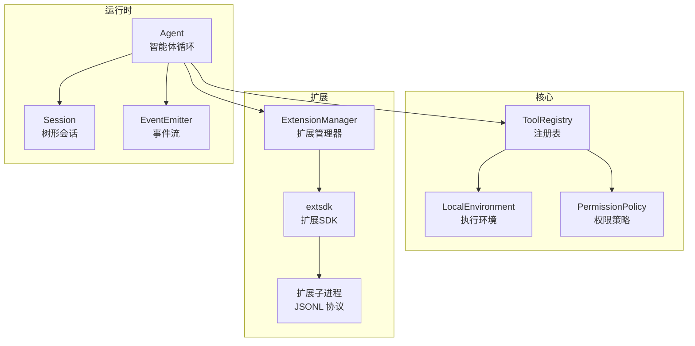
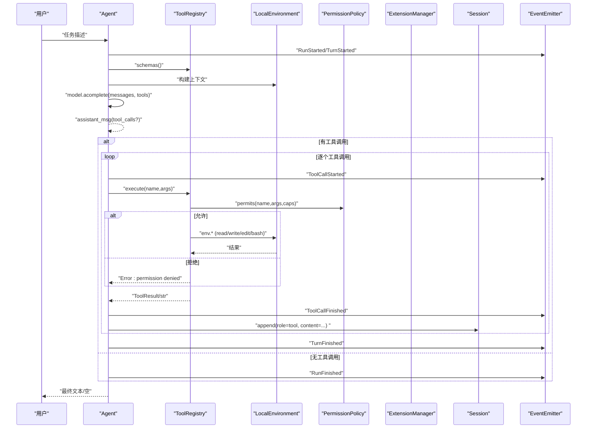
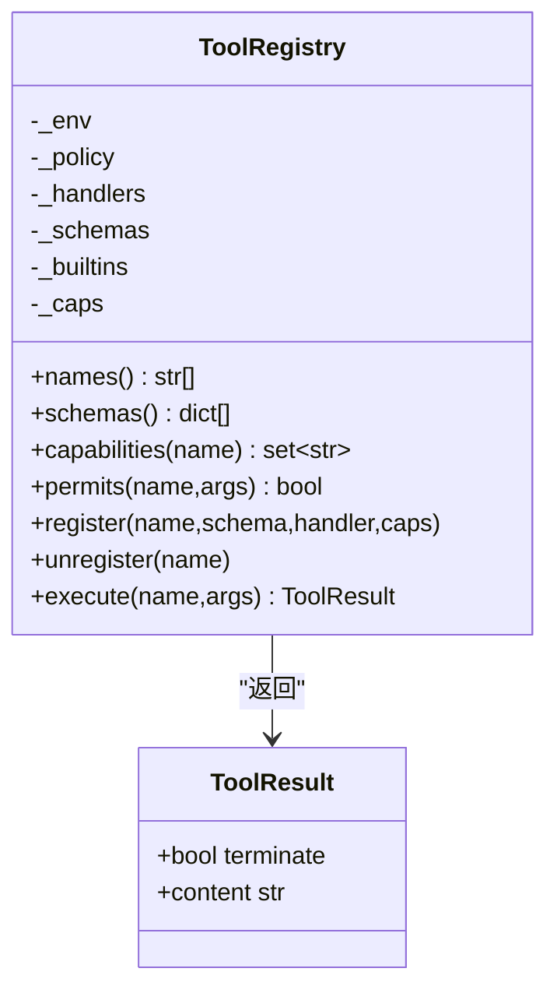
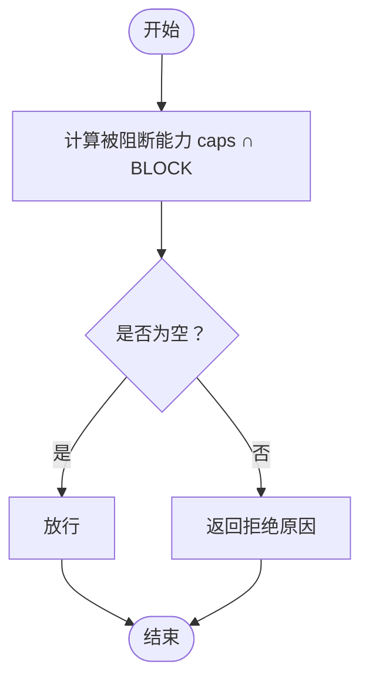
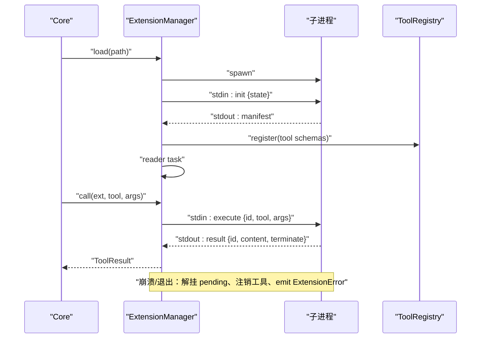
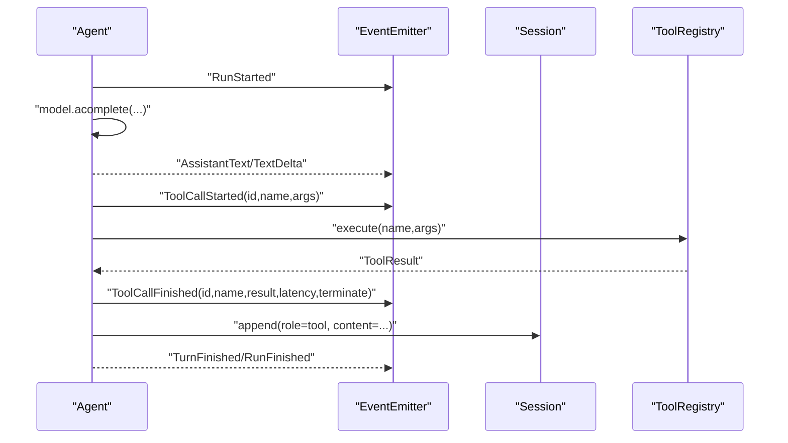
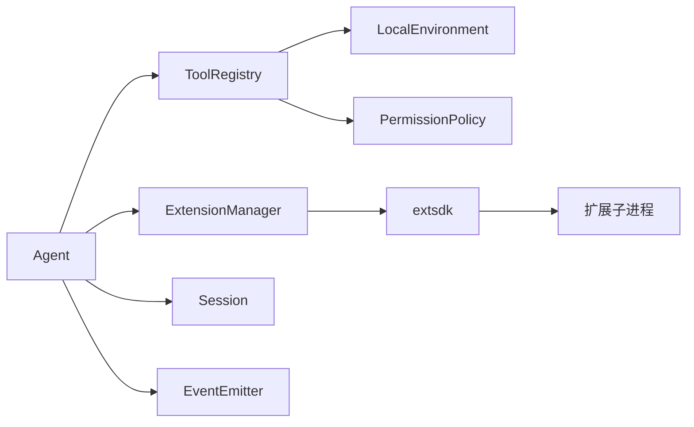

# 工具系统

<cite>
**本文引用的文件列表**
- [mu/tools.py](file://mu/tools.py)
- [mu/permission.py](file://mu/permission.py)
- [mu/extension.py](file://mu/extension.py)
- [mu/extsdk.py](file://mu/extsdk.py)
- [mu/environment.py](file://mu/environment.py)
- [mu/session.py](file://mu/session.py)
- [mu/events.py](file://mu/events.py)
- [mu/agent.py](file://mu/agent.py)
- [extensions/README.md](file://extensions/README.md)
- [extensions/example_textstats.py](file://extensions/example_textstats.py)
- [tests/test_tools.py](file://tests/test_tools.py)
- [tests/test_extension.py](file://tests/test_extension.py)
- [README.md](file://README.md)
</cite>

## 目录
1. [简介](#简介)
2. [项目结构](#项目结构)
3. [核心组件](#核心组件)
4. [架构总览](#架构总览)
5. [详细组件分析](#详细组件分析)
6. [依赖关系分析](#依赖关系分析)
7. [性能考量](#性能考量)
8. [故障排查指南](#故障排查指南)
9. [结论](#结论)
10. [附录](#附录)

## 简介
本文件面向 μ (mu) 工具系统，系统性阐述四个内置工具（read、write、edit、bash）的功能、参数与使用限制；解释工具注册表（ToolRegistry）的工作机制、权限控制系统与安全考虑；提供自定义工具开发的完整指南（扩展开发、子进程通信与 JSONL 协议）；展示工具的生命周期管理、错误处理与性能优化；并说明工具与智能体循环的集成方式与事件传播机制。文档同时给出面向测试与生产的最佳实践与参考路径。

## 项目结构
- 工具与权限：工具实现与注册表位于 mu/tools.py；权限策略位于 mu/permission.py。
- 执行环境：本地执行层 LocalEnvironment 位于 mu/environment.py，支持 bash 与文件读写。
- 扩展与协议：扩展管理器位于 mu/extension.py，扩展 SDK 位于 mu/extsdk.py；扩展协议说明位于 extensions/README.md。
- 会话与事件：会话持久化位于 mu/session.py；事件流位于 mu/events.py。
- 智能体循环：Agent 在 mu/agent.py 中驱动工具调用与事件传播。
- 示例与测试：extensions/example_textstats.py 展示扩展写法；tests/test_tools.py 与 tests/test_extension.py 提供功能与回归测试。

图表来源
- [mu/agent.py:82-163](file://mu/agent.py#L82-L163)
- [mu/tools.py:191-269](file://mu/tools.py#L191-L269)
- [mu/permission.py:29-68](file://mu/permission.py#L29-L68)
- [mu/environment.py:23-88](file://mu/environment.py#L23-L88)
- [mu/extension.py:85-248](file://mu/extension.py#L85-L248)
- [mu/extsdk.py:111-130](file://mu/extsdk.py#L111-L130)
- [mu/session.py:38-115](file://mu/session.py#L38-L115)
- [mu/events.py:121-133](file://mu/events.py#L121-L133)

章节来源
- [README.md:1-127](file://README.md#L1-L127)

## 核心组件
- 四个内置工具：read、write、edit、bash，均返回字符串结果，错误也以字符串形式返回，遵循“模型自纠错”的 Pi 哲学。
- 工具注册表：ToolRegistry 统一管理工具 schema 与 handler，内置四工具固定，支持动态注册扩展工具。
- 权限策略：基于 capability（能力）gate，而非工具名黑名单，支持 allow_all、read_only、workspace_write 等策略。
- 执行环境：LocalEnvironment 提供 bash 与文件读写，支持超时与进程组清理；DockerEnvironment 为实验性沙箱（仅 bash）。
- 扩展系统：ExtensionManager 管理扩展子进程，JSONL 协议通信；extsdk 提供声明工具与状态持久化的 SDK。
- 事件流：EventEmitter 提供结构化事件，Agent 在工具调用前后发出 ToolCallStarted/Finished 等事件。
- 会话系统：Session 以 JSONL 追加存储，支持分支、摘要与恢复。

章节来源
- [mu/tools.py:19-106](file://mu/tools.py#L19-L106)
- [mu/tools.py:191-269](file://mu/tools.py#L191-L269)
- [mu/permission.py:15-68](file://mu/permission.py#L15-L68)
- [mu/environment.py:23-149](file://mu/environment.py#L23-L149)
- [mu/extension.py:85-248](file://mu/extension.py#L85-L248)
- [mu/extsdk.py:34-130](file://mu/extsdk.py#L34-L130)
- [mu/events.py:121-133](file://mu/events.py#L121-L133)
- [mu/session.py:38-115](file://mu/session.py#L38-L115)

## 架构总览
工具系统围绕 ToolRegistry 展开，Agent 在每轮对话中根据上下文生成工具调用，ToolRegistry 依据权限策略与 schema 执行工具，返回 ToolResult 或字符串结果。扩展通过 ExtensionManager 以子进程方式接入，遵循 JSONL 协议，支持状态持久化与日志事件回流。

图表来源
- [mu/agent.py:82-163](file://mu/agent.py#L82-L163)
- [mu/tools.py:253-269](file://mu/tools.py#L253-L269)
- [mu/permission.py:29-68](file://mu/permission.py#L29-L68)
- [mu/environment.py:26-88](file://mu/environment.py#L26-L88)
- [mu/events.py:121-133](file://mu/events.py#L121-L133)
- [mu/session.py:49-73](file://mu/session.py#L49-L73)

## 详细组件分析

### 四个内置工具详解
- read
  - 功能：读取文件内容，支持 offset 与 limit（行号偏移与最大行数）。
  - 参数：path（绝对路径，必填）、offset（可选，整数）、limit（可选，整数）。
  - 限制：文件不存在或为目录时返回错误字符串；空文件返回提示信息。
  - 返回：文件内容或错误字符串。
- write
  - 功能：创建或覆写文件，父目录自动创建。
  - 参数：path（绝对路径，必填）、content（内容，必填）。
  - 限制：无；返回写入字节数与行数。
- edit
  - 功能：在文件中唯一替换旧字符串为新字符串。
  - 参数：path（绝对路径，必填）、old_string（必须唯一，必填）、new_string（必填）。
  - 限制：未找到或不唯一时返回错误字符串，不修改文件。
- bash
  - 功能：运行 shell 命令，返回 stdout、stderr 与 exit code。
  - 参数：command（命令，必填）、timeout（秒，可选，默认 120）。
  - 限制：超时返回超时信息与退出码 124；进程组清理避免孤儿进程。

章节来源
- [mu/tools.py:40-106](file://mu/tools.py#L40-L106)
- [tests/test_tools.py:7-117](file://tests/test_tools.py#L7-L117)

### 工具注册表（ToolRegistry）
- 统一签名：RegisteredHandler 接受 dict[str, Any]，返回 ToolResult 或 str。
- 内置工具绑定：通过 functools.partial 将 LocalEnvironment 绑定到内置处理器。
- 动态注册：register(name, schema, handler, capabilities) 支持扩展工具；unregister 保护内置工具。
- 权限检查：permits(name, args) 基于能力集合 gate 工具调用。
- 执行流程：execute(name, args) 先策略检查，再调用 handler，捕获缺失参数与异常，返回 ToolResult。

图表来源
- [mu/tools.py:191-269](file://mu/tools.py#L191-L269)
- [mu/tools.py:19-36](file://mu/tools.py#L19-L36)

章节来源
- [mu/tools.py:191-269](file://mu/tools.py#L191-L269)

### 权限控制系统
- 能力常量：WRITE、SHELL、CODE_EXEC、EXTENSION_EXEC。
- 策略类型：
  - allow_all：默认策略，放行。
  - read_only：阻止 WRITE/SHELL/CODE_EXEC/EXTENSION_EXEC。
  - workspace_write：限制写入路径在工作区；对 SHELL/CODE/EXTENSION 一律拒绝（无法限定）。
- 策略钩子：policy(name, args, caps) -> None|str，ToolRegistry.execute 内部调用。

图表来源
- [mu/permission.py:29-68](file://mu/permission.py#L29-L68)

章节来源
- [mu/permission.py:15-68](file://mu/permission.py#L15-L68)

### 执行环境与安全考虑
- LocalEnvironment
  - run_bash：新进程组执行，超时整组 SIGKILL，避免孤儿进程；返回 stdout/stderr/exit_code。
  - read_file/write_file：线程池执行，支持 offset/limit 读取片段。
- DockerEnvironment（实验性）
  - 仅对 bash 进行容器隔离（网络 none），文件工具仍宿主 IO。
- 安全说明：扩展以 agent 同等权限运行，隔离≠安全沙箱；M3.5 引入权限/沙箱层。

章节来源
- [mu/environment.py:23-149](file://mu/environment.py#L23-L149)
- [README.md:84-96](file://README.md#L84-L96)

### 扩展系统与 JSONL 协议
- 扩展 SDK（extsdk）
  - @tool 声明工具（OpenAI JSON Schema），支持 permissions。
  - get_state/set_state：扩展状态持久化至 Session。
  - log：输出日志事件。
  - run_extension：启动协议循环，首行输出 manifest。
- 扩展管理器（ExtensionManager）
  - spawn 子进程 → 读 manifest → 注册工具 → 启动 reader 任务 → 发 init（含 session 恢复 state）。
  - call：发送 execute → 等待对应 id 的 result → ToolResult。
  - reader：result/error→resolve future；log→emit 事件；state→持久化进 session。
  - 生命周期：load/reload/unload/aclose；崩溃快速降级（解挂 pending、注销工具、emit 错误事件）。
- 协议（JSONL）
  - 启动：扩展 stdout 首行 manifest。
  - core→ext：init/state、execute、shutdown。
  - ext→core：result、error、log、state。

图表来源
- [mu/extension.py:131-248](file://mu/extension.py#L131-L248)
- [mu/extsdk.py:111-130](file://mu/extsdk.py#L111-L130)
- [extensions/README.md:44-58](file://extensions/README.md#L44-L58)

章节来源
- [mu/extension.py:85-364](file://mu/extension.py#L85-L364)
- [mu/extsdk.py:34-130](file://mu/extsdk.py#L34-L130)
- [extensions/README.md:1-58](file://extensions/README.md#L1-L58)
- [extensions/example_textstats.py:1-67](file://extensions/example_textstats.py#L1-L67)

### 事件传播与智能体循环集成
- Agent.run：构建上下文 → 调用模型 → 记录 assistant 消息 → 顺序执行 tool_calls → 发出 ToolCallStarted/Finished → 写入 Session → 判断是否全部 terminate 以决定是否继续自动 LLM 调用。
- 事件流：EventEmitter 同步分发，支持 ToolCallStarted/Finished、AssistantText/TextDelta、RunStarted/Finished/Aborted 等。
- 与扩展：ExtensionLoaded/Unloaded/Log/Error 事件回流，便于可观测与调试。

图表来源
- [mu/agent.py:82-163](file://mu/agent.py#L82-L163)
- [mu/events.py:121-133](file://mu/events.py#L121-L133)
- [mu/session.py:49-73](file://mu/session.py#L49-L73)

章节来源
- [mu/agent.py:43-200](file://mu/agent.py#L43-L200)
- [mu/events.py:13-116](file://mu/events.py#L13-L116)

## 依赖关系分析
- ToolRegistry 依赖 LocalEnvironment 与 PermissionPolicy；扩展通过 ExtensionManager 间接依赖 ToolRegistry。
- Agent 依赖 ToolRegistry、EventEmitter、Session、ExtensionManager（可选）。
- 扩展 SDK 与扩展子进程之间通过 JSONL 协议耦合，扩展管理器负责生命周期与错误处理。
- 会话与事件为横切关注点，贯穿工具调用与扩展交互。

图表来源
- [mu/agent.py:43-75](file://mu/agent.py#L43-L75)
- [mu/tools.py:191-207](file://mu/tools.py#L191-L207)
- [mu/extension.py:85-103](file://mu/extension.py#L85-L103)
- [mu/extsdk.py:111-130](file://mu/extsdk.py#L111-L130)

章节来源
- [mu/agent.py:43-75](file://mu/agent.py#L43-L75)
- [mu/tools.py:191-207](file://mu/tools.py#L191-L207)
- [mu/extension.py:85-103](file://mu/extension.py#L85-L103)

## 性能考量
- I/O 并发：文件读写与 bash 命令通过线程池与子进程执行，避免阻塞事件循环。
- 超时控制：bash 默认 120 秒，超时整组清理；扩展调用默认 120 秒，崩溃快速降级。
- 进程组清理：超时与崩溃场景下 SIGKILL 整组，防止孤儿进程与资源泄露。
- 事件同步：EventEmitter 同步分发，避免引入复杂 pub/sub 框架带来的开销。
- 会话持久化：JSONL 追加写入，适合大体量数据与复现需求。

章节来源
- [mu/environment.py:26-88](file://mu/environment.py#L26-L88)
- [mu/extension.py:31-33](file://mu/extension.py#L31-L33)
- [mu/events.py:121-133](file://mu/events.py#L121-L133)
- [mu/session.py:65-73](file://mu/session.py#L65-L73)

## 故障排查指南
- 工具调用失败
  - 未知工具：检查 ToolRegistry 名称与 schema 是否匹配。
  - 缺少参数：确认 required 字段是否满足。
  - 权限拒绝：检查策略与能力集合，必要时切换策略或调整 capabilities。
- 文件操作问题
  - read：确认路径存在且为文件；空文件返回特殊提示。
  - write：确认父目录可创建；返回写入字节与行数。
  - edit：old_string 必须唯一；不唯一或未找到时不修改。
- bash 超时与孤儿进程
  - 超时返回 124 与超时信息；确认命令是否产生后台进程；进程组清理应生效。
- 扩展加载与调用
  - manifest 校验失败：检查扩展是否正确输出首行 manifest。
  - 工具冲突：扩展工具名与现有工具冲突，需修改名称。
  - 崩溃与降级：扩展崩溃会快速返回错误、注销工具并发出 ExtensionError 事件。
- 事件与可观测
  - 使用 ExtensionLog/ExtensionError 观察扩展日志与错误；使用 ToolCallFinished 查看耗时与 terminate 标志。

章节来源
- [tests/test_tools.py:28-117](file://tests/test_tools.py#L28-L117)
- [tests/test_extension.py:68-245](file://tests/test_extension.py#L68-L245)
- [mu/extension.py:145-161](file://mu/extension.py#L145-L161)
- [mu/extension.py:275-317](file://mu/extension.py#L275-L317)
- [mu/events.py:93-116](file://mu/events.py#L93-L116)

## 结论
μ 工具系统以简洁的四个内置工具为核心，配合统一的注册表与基于能力的权限策略，实现了可控、可观测、可扩展的工具生态。通过 ExtensionManager 与 JSONL 协议，扩展以子进程方式接入，既满足“缺能力就现写工具”的 Pi 哲学，又通过事件流与会话系统保障可观测与可复现。在 M3.5 之前，扩展与 bash 以 agent 同等权限运行，建议仅加载可信扩展；M3.5 将引入更严格的权限与沙箱控制。

## 附录

### 自定义工具开发指南
- 声明工具
  - 使用 @tool(name, description, parameters, permissions=None) 声明工具，parameters 遵循 OpenAI JSON Schema。
  - 函数签名：fn(args: dict) -> str 或 (str, terminate: bool)；支持同步或异步。
- 状态持久化
  - 使用 set_state(dict) 持久化状态；--resume 时自动恢复；get_state() 读取。
- 日志输出
  - 使用 log(message, level="info") 输出日志，回流到事件流。
- 启动协议
  - run_extension(name, version) 输出 manifest 并进入请求循环。
- 示例参考
  - extensions/example_textstats.py 展示 word_count、reverse_text、set_prefix、greet 的完整用法。

章节来源
- [mu/extsdk.py:34-130](file://mu/extsdk.py#L34-L130)
- [extensions/README.md:34-58](file://extensions/README.md#L34-L58)
- [extensions/example_textstats.py:1-67](file://extensions/example_textstats.py#L1-L67)

### 工具与智能体循环集成最佳实践
- 顺序执行：M1 仍顺序执行工具调用，便于可观测与调试。
- 终止语义：ToolResult.terminate=true 时，Agent 跳过本轮工具调用后的自动 LLM 调用。
- 取消与恢复：工具调用被取消时，Agent 补充 tool 错误消息，保证可恢复性。
- 事件消费：stdout 渲染、TUI、归因统计等均可订阅事件流。

章节来源
- [mu/agent.py:134-174](file://mu/agent.py#L134-L174)
- [mu/events.py:121-133](file://mu/events.py#L121-L133)