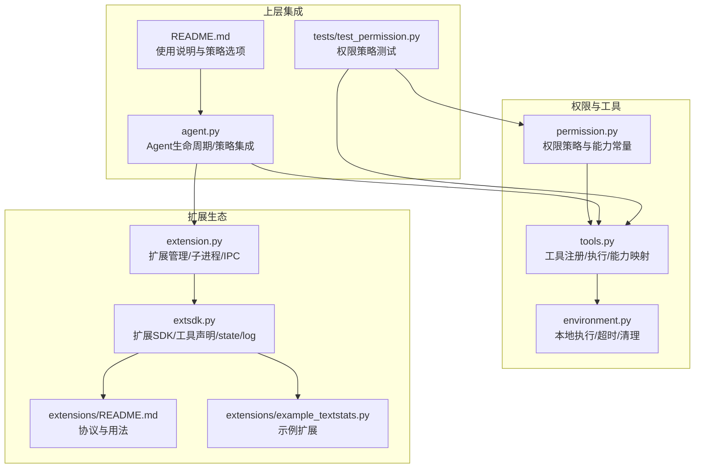
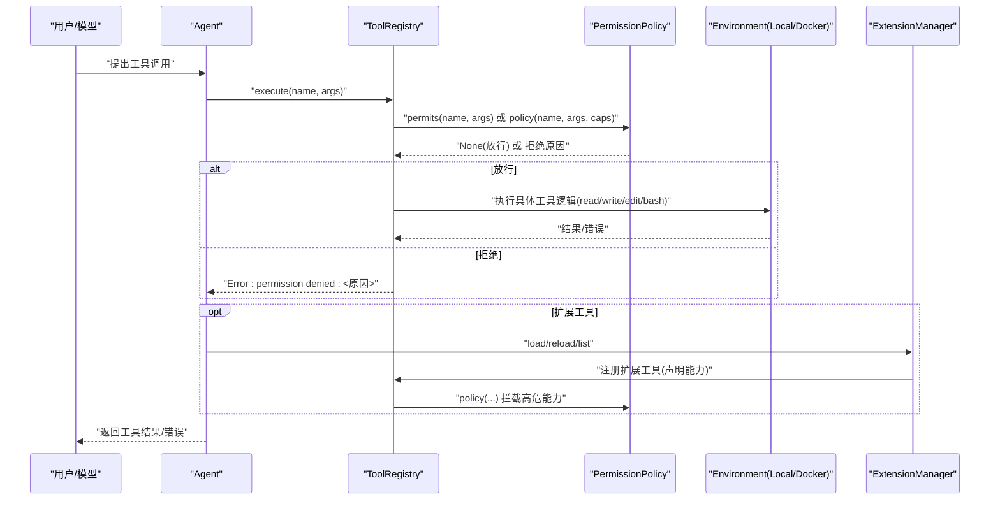
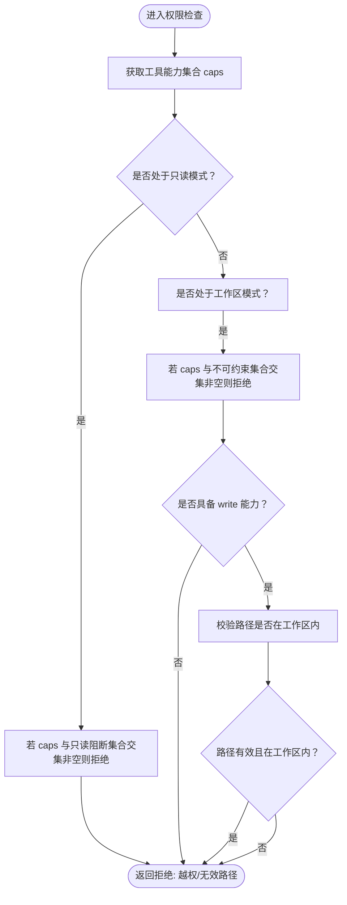
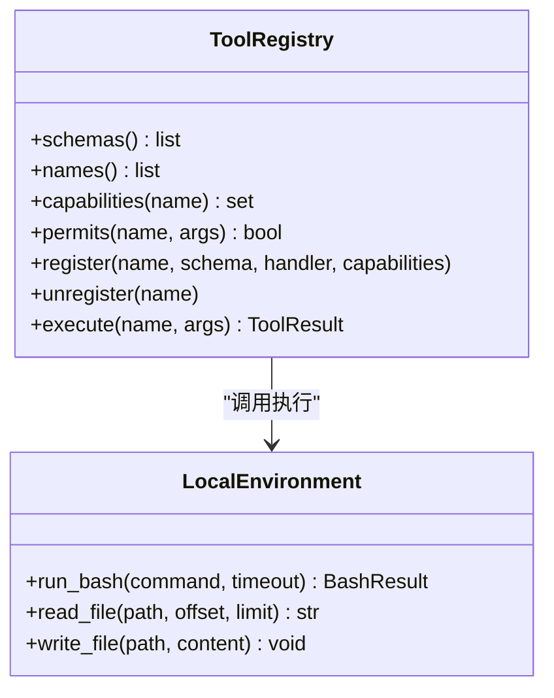
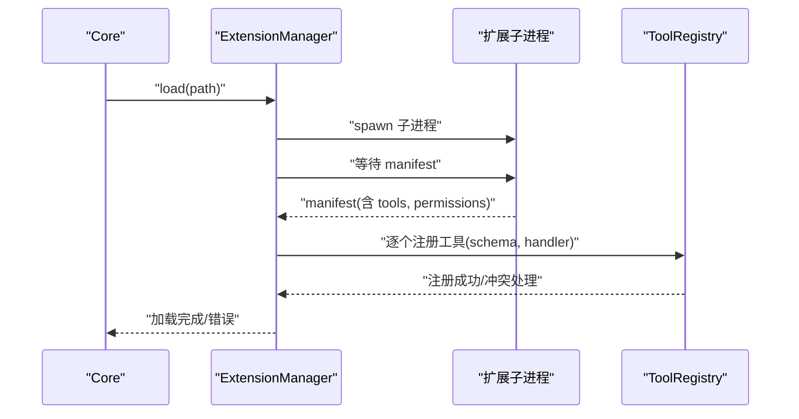
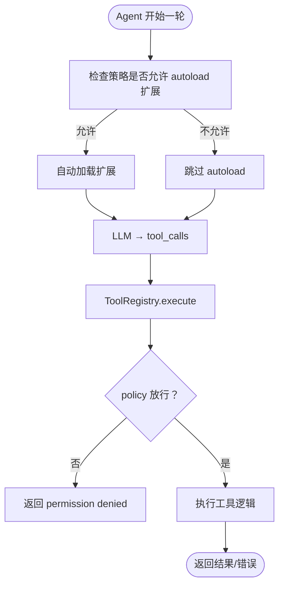
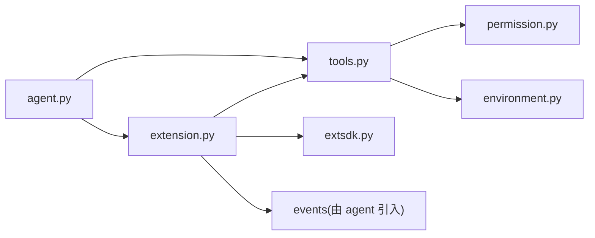

# 权限控制

<cite>
**本文引用的文件**
- [mu/permission.py](file://mu/permission.py)
- [mu/tools.py](file://mu/tools.py)
- [mu/extension.py](file://mu/extension.py)
- [mu/extsdk.py](file://mu/extsdk.py)
- [mu/environment.py](file://mu/environment.py)
- [mu/agent.py](file://mu/agent.py)
- [extensions/README.md](file://extensions/README.md)
- [extensions/example_textstats.py](file://extensions/example_textstats.py)
- [tests/test_permission.py](file://tests/test_permission.py)
- [README.md](file://README.md)
</cite>

## 目录
1. [简介](#简介)
2. [项目结构](#项目结构)
3. [核心组件](#核心组件)
4. [架构总览](#架构总览)
5. [组件详解](#组件详解)
6. [依赖关系分析](#依赖关系分析)
7. [性能考量](#性能考量)
8. [故障排查指南](#故障排查指南)
9. [结论](#结论)
10. [附录](#附录)

## 简介
本文面向 μ (mu) 权限控制系统，系统性阐述 PermissionPolicy 的设计原理、能力门控机制与安全策略实现，覆盖内置工具的能力映射、扩展工具的默认权限设置、权限检查流程、错误处理与安全边界，并提供自定义权限策略的开发指南与最佳实践，帮助读者实现细粒度访问控制与审计日志。

## 项目结构
围绕权限控制的关键模块与文件如下：
- 权限策略与能力常量：mu/permission.py
- 工具注册与执行、能力映射：mu/tools.py
- 扩展管理与加载、能力注册：mu/extension.py
- 扩展 SDK 与工具声明：mu/extsdk.py
- 环境抽象与执行边界：mu/environment.py
- Agent 生命周期与权限集成：mu/agent.py
- 扩展协议与示例：extensions/README.md、extensions/example_textstats.py
- 权限策略测试：tests/test_permission.py
- 项目说明与使用示例：README.md

图表来源
- [mu/permission.py:1-69](file://mu/permission.py#L1-L69)
- [mu/tools.py:1-269](file://mu/tools.py#L1-L269)
- [mu/extension.py:1-364](file://mu/extension.py#L1-L364)
- [mu/extsdk.py:1-130](file://mu/extsdk.py#L1-L130)
- [mu/environment.py:1-150](file://mu/environment.py#L1-L150)
- [mu/agent.py:1-223](file://mu/agent.py#L1-L223)
- [extensions/README.md:1-58](file://extensions/README.md#L1-L58)
- [extensions/example_textstats.py:1-67](file://extensions/example_textstats.py#L1-L67)
- [tests/test_permission.py:1-116](file://tests/test_permission.py#L1-L116)
- [README.md:1-127](file://README.md#L1-L127)

章节来源
- [mu/permission.py:1-69](file://mu/permission.py#L1-L69)
- [mu/tools.py:1-269](file://mu/tools.py#L1-L269)
- [mu/extension.py:1-364](file://mu/extension.py#L1-L364)
- [mu/extsdk.py:1-130](file://mu/extsdk.py#L1-L130)
- [mu/environment.py:1-150](file://mu/environment.py#L1-L150)
- [mu/agent.py:1-223](file://mu/agent.py#L1-L223)
- [extensions/README.md:1-58](file://extensions/README.md#L1-L58)
- [extensions/example_textstats.py:1-67](file://extensions/example_textstats.py#L1-L67)
- [tests/test_permission.py:1-116](file://tests/test_permission.py#L1-L116)
- [README.md:1-127](file://README.md#L1-L127)

## 核心组件
- 权限策略类型与策略工厂
  - 权限策略签名：接收工具名、参数、能力集合，返回 None（放行）或拒绝原因字符串。
  - 策略工厂：支持 allow、readonly、workspace 三种模式，其中 workspace 需指定根目录。
- 能力常量与阻断集合
  - 能力枚举：read、write、shell、code_exec、extension_exec。
  - 只读阻断集合：包含 write、shell、code_exec、extension_exec。
  - 无法被“限定在工作区”保证的能力集合：shell、code_exec、extension_exec。
- 工具注册与能力映射
  - 内置工具能力映射：read/read、write/write、edit/write、bash/shell。
  - 动态工具默认能力：若未显式提供，采用保守默认 {write, shell}。
- 执行门控
  - ToolRegistry.execute 在单一入口进行权限检查，失败返回“权限拒绝”错误。
- 扩展与权限
  - 扩展管理工具 load_extension/reload_extension/list_extensions 注册时声明能力（如 extension_exec）。
  - 严格策略下会拦截扩展加载/重载等高危能力。

章节来源
- [mu/permission.py:15-68](file://mu/permission.py#L15-L68)
- [mu/tools.py:182-268](file://mu/tools.py#L182-L268)
- [mu/extension.py:107-111](file://mu/extension.py#L107-L111)

## 架构总览
权限控制贯穿“策略定义—能力映射—执行门控—扩展集成”的链路，形成统一的“能力门控”模型。

图表来源
- [mu/agent.py:82-163](file://mu/agent.py#L82-L163)
- [mu/tools.py:253-268](file://mu/tools.py#L253-L268)
- [mu/permission.py:29-68](file://mu/permission.py#L29-L68)
- [mu/extension.py:131-188](file://mu/extension.py#L131-L188)
- [mu/environment.py:26-87](file://mu/environment.py#L26-L87)

## 组件详解

### 权限策略与能力门控
- 设计原则
  - 基于“能力”而非“工具名黑名单”进行门控，确保 code_exec、extension_exec、shell 等高危能力在 restrict 模式下真正被拦截。
  - Policy 作为单一钩子，统一在 ToolRegistry.execute 中调用。
- 策略实现要点
  - allow_all：默认放行。
  - read_only：若工具具备 write/shell/code_exec/extension_exec 任一能力，则拒绝。
  - workspace_write：对 shell/code/exec/extension_exec 直接拒绝；对 write 仅允许在工作区路径内；对非法路径返回“无效路径”或“越权”。
  - make_policy：根据 kind 返回对应策略，未知类型抛出异常。
- 能力集合与阻断规则
  - 只读阻断集合：{write, shell, code_exec, extension_exec}
  - 无法被工作区约束的能力集合：{shell, code_exec, extension_exec}

图表来源
- [mu/permission.py:29-68](file://mu/permission.py#L29-L68)

章节来源
- [mu/permission.py:15-68](file://mu/permission.py#L15-L68)

### 内置工具与能力映射
- 工具与能力映射
  - read → {read}
  - write → {write}
  - edit → {write}
  - bash → {shell}
- 执行与错误处理
  - ToolRegistry.execute 在执行前调用 policy，失败返回“权限拒绝”错误；参数缺失返回“缺少必要参数”；其他异常返回“执行工具时发生错误”。

图表来源
- [mu/tools.py:191-268](file://mu/tools.py#L191-L268)
- [mu/environment.py:23-87](file://mu/environment.py#L23-L87)

章节来源
- [mu/tools.py:182-268](file://mu/tools.py#L182-L268)
- [mu/environment.py:23-87](file://mu/environment.py#L23-L87)

### 扩展工具与默认权限
- 扩展 SDK
  - 使用 @tool 声明工具，支持 permissions 参数；run_extension 输出 manifest 并进入 JSONL 协议循环。
  - set_state/get_state 支持扩展状态持久化；log 输出日志到事件流。
- 扩展管理
  - ExtensionManager.load：启动子进程，读取 manifest，注册工具；失败则清理并发出错误事件。
  - 管理工具 load_extension/reload_extension/list_extensions 注册时声明能力（如 extension_exec）。
- 默认权限策略
  - ToolRegistry.register 对动态工具若未显式提供 capabilities，则采用保守默认 {write, shell}，确保在 restrict 模式下默认拦截。

图表来源
- [mu/extension.py:131-188](file://mu/extension.py#L131-L188)
- [mu/extsdk.py:76-129](file://mu/extsdk.py#L76-L129)
- [mu/tools.py:225-241](file://mu/tools.py#L225-L241)

章节来源
- [mu/extension.py:107-111](file://mu/extension.py#L107-L111)
- [mu/extsdk.py:34-74](file://mu/extsdk.py#L34-L74)
- [mu/tools.py:225-241](file://mu/tools.py#L225-L241)

### 权限检查流程与错误处理
- 流程
  - Agent.run 在开始时根据策略决定是否 autoload 扩展。
  - ToolRegistry.execute 在执行前调用 policy(name, args, caps)，返回 None 则放行，否则返回拒绝原因。
  - 执行过程中捕获参数缺失与异常，统一转换为错误字符串返回。
- 错误处理
  - “未知工具”、“缺少必要参数”、“执行工具时发生错误”等均以字符串形式返回，便于模型自纠错。
  - 扩展加载失败、超时、进程退出等场景均有明确的错误事件与降级处理。

图表来源
- [mu/agent.py:82-163](file://mu/agent.py#L82-L163)
- [mu/tools.py:253-268](file://mu/tools.py#L253-L268)

章节来源
- [mu/agent.py:82-163](file://mu/agent.py#L82-L163)
- [mu/tools.py:253-268](file://mu/tools.py#L253-L268)

### 安全边界与隔离
- 进程组隔离与超时清理
  - LocalEnvironment.run_bash 使用 start_new_session=True，配合进程组清理，避免僵尸进程。
  - DockerEnvironment 将 bash 放入容器执行（网络隔离），文件工具仍由宿主 IO，不构成文件层面的隔离。
- 扩展隔离
  - M3 子进程仅做崩溃隔离，扩展以与 agent 同等权限运行；权限/沙箱在 M3.5。
- 策略边界
  - readonly：完全阻断 write/edit/bash/code_exec/extension_exec。
  - workspace：阻断 shell/code/exec/extension_exec；write 仅限工作区。

章节来源
- [mu/environment.py:26-87](file://mu/environment.py#L26-L87)
- [mu/environment.py:99-136](file://mu/environment.py#L99-L136)
- [README.md:82-96](file://README.md#L82-L96)

### 自定义权限策略开发指南
- 设计原则
  - 以能力为单位进行判断，避免工具名黑名单带来的绕过风险。
  - 保持策略函数纯函数特性，便于测试与复用。
- 开发步骤
  - 定义策略函数：接收 (name, args, caps) → str|None。
  - 在 ToolRegistry 初始化时注入策略，或通过 make_policy(kind, root=...) 获取。
  - 对动态工具，建议显式声明 capabilities，避免使用默认保守集合。
- 安全考虑与最佳实践
  - 优先选择 readonly/workspace 模式，除非明确需要更高权限。
  - 对扩展工具，尽量减少能力授予，必要时拆分工具与能力。
  - 在生产中结合审计日志与事件流，记录策略拒绝与工具调用详情。
  - 避免在策略中引入外部副作用，保持幂等与可预测性。

章节来源
- [mu/permission.py:29-68](file://mu/permission.py#L29-L68)
- [mu/tools.py:225-241](file://mu/tools.py#L225-L241)
- [README.md:84-96](file://README.md#L84-L96)

### 审计与可观测性
- 事件流
  - Agent 使用 EventEmitter 输出结构化事件，包括 RunStarted/RunFinished、ToolCallStarted/ToolCallFinished、ExtensionLog 等，可用于审计与追踪。
- 日志与状态
  - 扩展通过 log(level, message) 输出日志；set_state/get_state 支持状态持久化，便于恢复与审计。
- 建议
  - 在策略拒绝与工具执行失败处补充事件，记录工具名、参数摘要、能力集合与拒绝原因。
  - 对敏感操作（如 bash、write）增加额外审计标记，便于合规审查。

章节来源
- [mu/agent.py:19-38](file://mu/agent.py#L19-L38)
- [mu/extsdk.py:67-68](file://mu/extsdk.py#L67-L68)
- [mu/extsdk.py:60-64](file://mu/extsdk.py#L60-L64)

## 依赖关系分析
- 组件耦合
  - ToolRegistry 依赖 PermissionPolicy 与 LocalEnvironment；ExtensionManager 依赖 ToolRegistry 与 Session/EventEmitter。
  - Agent 依赖 ToolRegistry 与 ExtensionManager，并在启动时依据策略决定是否 autoload 扩展。
- 外部依赖
  - 扩展通过 JSONL 协议与 core 通信；DockerEnvironment 依赖本机 Docker。
- 循环依赖
  - 代码中未发现循环导入；各模块职责清晰，接口稳定。

图表来源
- [mu/agent.py:43-75](file://mu/agent.py#L43-L75)
- [mu/tools.py:191-209](file://mu/tools.py#L191-L209)
- [mu/extension.py:85-103](file://mu/extension.py#L85-L103)
- [mu/permission.py:15](file://mu/permission.py#L15)
- [mu/environment.py:23](file://mu/environment.py#L23)
- [mu/extsdk.py:21-29](file://mu/extsdk.py#L21-L29)

章节来源
- [mu/agent.py:43-75](file://mu/agent.py#L43-L75)
- [mu/tools.py:191-209](file://mu/tools.py#L191-L209)
- [mu/extension.py:85-103](file://mu/extension.py#L85-L103)
- [mu/permission.py:15](file://mu/permission.py#L15)
- [mu/environment.py:23](file://mu/environment.py#L23)
- [mu/extsdk.py:21-29](file://mu/extsdk.py#L21-L29)

## 性能考量
- 异步执行与阻塞规避
  - 文件读写与 bash 执行均在异步上下文中 offload 至线程/子进程，避免阻塞事件循环。
- 超时与清理
  - bash 调用设置超时，超时后按进程组清理，防止资源泄露。
- 策略开销
  - 策略检查为 O(k)（k 为能力数量），通常可忽略；建议将复杂策略缓存或预计算。
- 扩展 IPC
  - 扩展子进程间 JSONL 通信，注意序列化与日志开销；建议在扩展内部聚合日志与状态变更。

章节来源
- [mu/environment.py:26-87](file://mu/environment.py#L26-L87)
- [mu/extension.py:275-300](file://mu/extension.py#L275-L300)

## 故障排查指南
- 常见问题与定位
  - “权限拒绝”：检查策略类型与工具能力集合；确认是否为动态工具且未声明能力导致默认保守。
  - “未知工具”：确认工具是否正确注册，或是否在只读策略下被拦截。
  - “缺少必要参数”：核对工具 schema 与调用参数。
  - “扩展加载失败”：检查 manifest 输出、工具名冲突、子进程退出码与 stderr。
- 测试参考
  - 使用 tests/test_permission.py 中的用例快速验证策略行为与动态工具默认能力。

章节来源
- [tests/test_permission.py:10-116](file://tests/test_permission.py#L10-L116)
- [mu/tools.py:253-268](file://mu/tools.py#L253-L268)
- [mu/extension.py:131-188](file://mu/extension.py#L131-L188)

## 结论
μ 的权限控制以“能力门控”为核心，通过统一的 Policy 接口与 ToolRegistry 执行钩子，实现了对内置与扩展工具的细粒度访问控制。结合只读、工作区与宽松三种策略，既能满足安全需求，又能保留灵活性。建议在生产中优先采用只读/工作区策略，并通过事件流与扩展状态持久化构建完善的审计与可观测体系。

## 附录
- 使用示例与策略选项
  - README.md 提供了 --permission 与 --sandbox 的使用说明，以及默认 YOLO 的安全边界提示。
- 扩展协议与示例
  - extensions/README.md 与 extensions/example_textstats.py 展示了扩展编写、加载与状态持久化的完整流程。

章节来源
- [README.md:84-96](file://README.md#L84-L96)
- [extensions/README.md:1-58](file://extensions/README.md#L1-L58)
- [extensions/example_textstats.py:1-67](file://extensions/example_textstats.py#L1-L67)