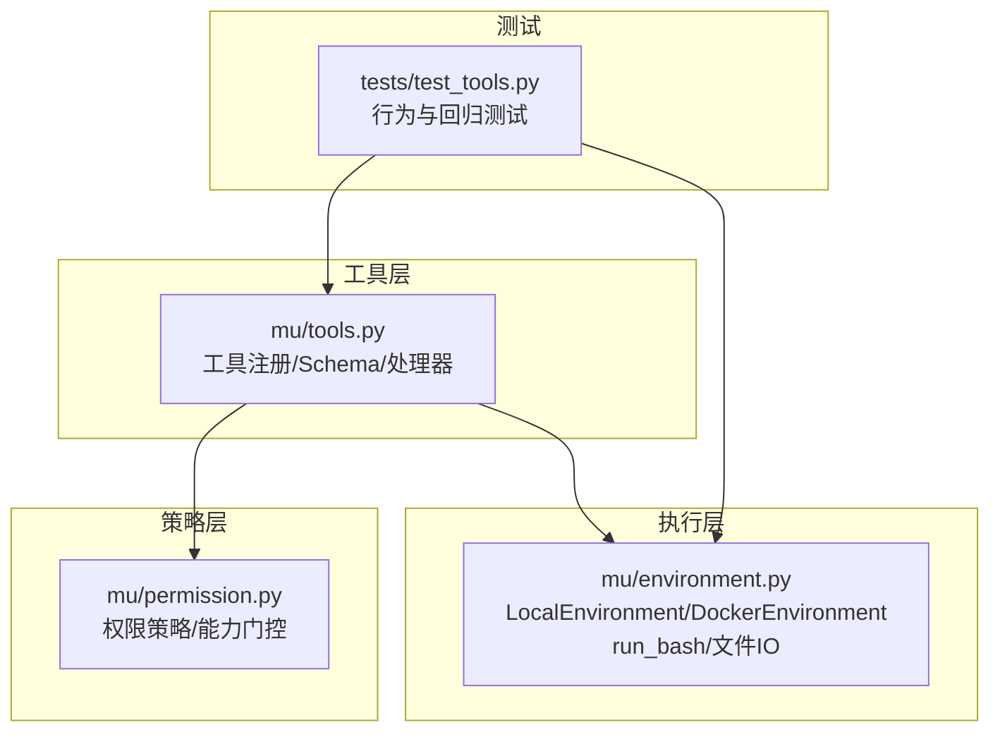
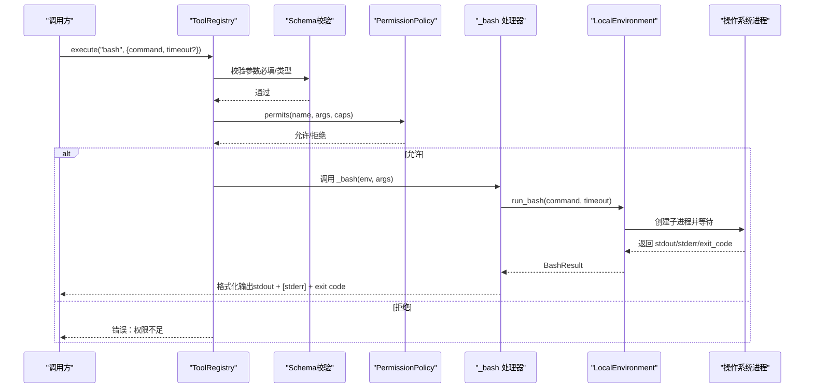
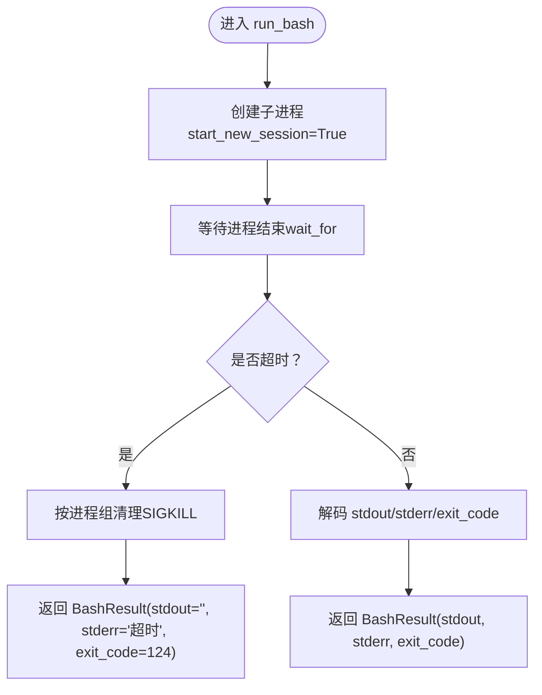
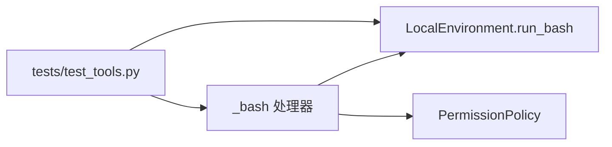

# 命令执行工具（bash）

<cite>
**本文引用的文件**
- [mu/tools.py](file://mu/tools.py)
- [mu/environment.py](file://mu/environment.py)
- [mu/permission.py](file://mu/permission.py)
- [tests/test_tools.py](file://tests/test_tools.py)
</cite>

## 目录
1. [简介](#简介)
2. [项目结构](#项目结构)
3. [核心组件](#核心组件)
4. [架构总览](#架构总览)
5. [组件详解](#组件详解)
6. [依赖关系分析](#依赖关系分析)
7. [性能与资源特性](#性能与资源特性)
8. [故障排查指南](#故障排查指南)
9. [结论](#结论)
10. [附录：使用示例与最佳实践](#附录使用示例与最佳实践)

## 简介
本文件面向“命令执行工具（bash）”的技术文档，聚焦以下目标：
- 深入解析 _bash 函数的实现细节：命令执行、超时控制、标准输出与错误输出处理。
- 说明 JSON Schema 定义：命令参数与超时设置。
- 解释安全限制、沙箱隔离与资源限制现状与边界。
- 提供具体使用示例与常见错误场景（命令不存在、权限不足、超时等）的处理方式。
- 明确输出格式与 exit code 返回机制。

## 项目结构
围绕 bash 工具的核心代码位于以下模块：
- 工具注册与分发：mu/tools.py
- 本地执行与超时控制：mu/environment.py
- 权限策略与能力门控：mu/permission.py
- 行为验证与回归测试：tests/test_tools.py

图表来源
- [mu/tools.py:191-269](file://mu/tools.py#L191-L269)
- [mu/environment.py:23-88](file://mu/environment.py#L23-L88)
- [mu/permission.py:29-68](file://mu/permission.py#L29-L68)
- [tests/test_tools.py:70-116](file://tests/test_tools.py#L70-L116)

章节来源
- [mu/tools.py:1-269](file://mu/tools.py#L1-L269)
- [mu/environment.py:1-150](file://mu/environment.py#L1-L150)
- [mu/permission.py:1-69](file://mu/permission.py#L1-L69)
- [tests/test_tools.py:1-117](file://tests/test_tools.py#L1-L117)

## 核心组件
- 工具注册与分发（ToolRegistry）
  - 将工具名称映射到处理器函数，并提供 OpenAI Function Calling 格式的 JSON Schema。
  - 内置工具包括 read、write、edit、bash；其中 bash 的能力为 shell。
- 本地执行环境（LocalEnvironment）
  - 通过 asyncio subprocess 执行 shell 命令，支持超时与进程组清理。
- 权限策略（PermissionPolicy）
  - 基于“能力”进行门控，而非简单工具名黑名单，确保 bash 等高风险工具可被严格限制。

章节来源
- [mu/tools.py:191-269](file://mu/tools.py#L191-L269)
- [mu/environment.py:23-88](file://mu/environment.py#L23-L88)
- [mu/permission.py:29-68](file://mu/permission.py#L29-L68)

## 架构总览
bash 工具从 ToolRegistry 接收调用请求，经权限策略校验后，委派给 LocalEnvironment.run_bash 执行命令。执行结果封装为 BashResult 并由 _bash 处理器格式化输出。

图表来源
- [mu/tools.py:253-269](file://mu/tools.py#L253-L269)
- [mu/tools.py:95-105](file://mu/tools.py#L95-L105)
- [mu/environment.py:26-48](file://mu/environment.py#L26-L48)
- [mu/permission.py:29-37](file://mu/permission.py#L29-L37)

## 组件详解

### _bash 处理器实现细节
- 参数解析
  - 必填：command（字符串）
  - 可选：timeout（数字，默认 120 秒）
- 执行流程
  - 调用 env.run_bash(command, timeout)
  - 收集 stdout、stderr 与 exit_code
  - 格式化输出：先拼接 stdout，再拼接 "[stderr]" 块（若有），最后追加 "[exit code: N]"
- 错误与边界
  - 若 stdout 为空则不输出空行段
  - 若 stderr 为空则不输出 "[stderr]" 段
  - exit code 为实际进程退出码；若无法获取则回退为 -1

章节来源
- [mu/tools.py:95-105](file://mu/tools.py#L95-L105)

### LocalEnvironment.run_bash 超时与进程组管理
- 进程创建
  - 使用 asyncio subprocess 以 shell 方式启动命令
  - start_new_session=True：命令成为新会话/进程组的 leader（pgid==pid）
- 超时控制
  - 使用 asyncio.wait_for 等待进程结束
  - 超时触发：调用 _kill_process_group 清理整个进程组
  - 返回 BashResult：stdout 置空，stderr 包含超时提示，exit_code=124
- 进程组清理
  - 优先向进程组发送 SIGKILL
  - 回退到仅 kill 顶层进程
  - 等待进程回收，避免僵尸进程

图表来源
- [mu/environment.py:26-48](file://mu/environment.py#L26-L48)
- [mu/environment.py:50-65](file://mu/environment.py#L50-L65)

章节来源
- [mu/environment.py:26-48](file://mu/environment.py#L26-L48)
- [mu/environment.py:50-65](file://mu/environment.py#L50-L65)

### JSON Schema 定义（OpenAI Tools）
- 工具名称：bash
- 描述：运行 shell 命令并返回其 stdout、stderr 与 exit code；每次调用无状态
- 参数
  - command（字符串，必填）
  - timeout（数字，可选，默认 120）
- 能力：shell

章节来源
- [mu/tools.py:158-173](file://mu/tools.py#L158-L173)

### 权限策略与安全边界
- 能力门控
  - bash 的能力集合包含 shell，策略按能力判断，而非仅工具名黑名单
- 策略类型
  - allow_all：默认放行
  - read_only：阻止 write、shell、code_exec、extension_exec
  - workspace_write：限制写入路径在工作区范围内；对 bash 的路径逃逸无法约束（策略仅检查 write/edit 的 path）
- Docker 沙箱现状
  - DockerEnvironment 仅将 bash 放入容器执行，文件读写仍委托宿主
  - 注释中“隔离网络/进程”与实现存在偏差：未设置 --network none，且文件 IO 未隔离

章节来源
- [mu/permission.py:29-68](file://mu/permission.py#L29-L68)
- [mu/environment.py:99-150](file://mu/environment.py#L99-L150)

### 输出格式与 exit code 返回机制
- 输出格式
  - 若存在 stdout：先输出 stdout（末尾换行去除）
  - 若存在 stderr：输出 "[stderr]" 分节及其内容（末尾换行去除）
  - 总是输出 "[exit code: N]" 行
- exit code 规范
  - 正常：进程实际返回码
  - 超时：124
  - 无法获取：-1

章节来源
- [mu/tools.py:99-105](file://mu/tools.py#L99-L105)
- [mu/environment.py:39-47](file://mu/environment.py#L39-L47)

## 依赖关系分析
- 工具层依赖执行层与策略层
  - _bash 依赖 LocalEnvironment.run_bash
  - ToolRegistry.execute 依赖 PermissionPolicy
- 执行层内部
  - LocalEnvironment.run_bash 依赖 asyncio subprocess 与信号/进程组 API
  - DockerEnvironment.run_bash 依赖 docker CLI（需本机安装）
- 测试层覆盖
  - 行为测试：echo、非零退出、stderr 捕获、超时、未知工具、缺失参数
  - 回归测试：超时后子进程组清理（孤儿进程检测）

图表来源
- [mu/tools.py:95-105](file://mu/tools.py#L95-L105)
- [mu/environment.py:26-48](file://mu/environment.py#L26-L48)
- [mu/permission.py:29-37](file://mu/permission.py#L29-L37)
- [tests/test_tools.py:70-116](file://tests/test_tools.py#L70-L116)

章节来源
- [mu/tools.py:95-105](file://mu/tools.py#L95-L105)
- [mu/environment.py:26-48](file://mu/environment.py#L26-L48)
- [mu/permission.py:29-37](file://mu/permission.py#L29-L37)
- [tests/test_tools.py:70-116](file://tests/test_tools.py#L70-L116)

## 性能与资源特性
- I/O 与并发
  - 所有可能阻塞事件循环的操作均通过 asyncio.to_thread/offload 至线程池，避免阻塞
- 超时与资源限制
  - run_bash 通过 wait_for 实现硬超时，超时后整组清理，防止僵尸进程与孤儿进程
  - DockerEnvironment 仅对 bash 进程进行容器化，未对文件 IO 或网络进行隔离
- 字符编码
  - 输出解码采用 utf-8，错误处理为替换模式，确保稳定性

章节来源
- [mu/environment.py:26-48](file://mu/environment.py#L26-L48)
- [mu/environment.py:50-65](file://mu/environment.py#L50-L65)
- [mu/environment.py:112-130](file://mu/environment.py#L112-L130)

## 故障排查指南
- 常见错误与定位
  - 未知工具：ToolRegistry 未找到处理器，返回“unknown tool”
  - 缺少必填参数：KeyError 被捕获并提示“missing required argument”
  - 权限不足：PermissionPolicy 拒绝，返回“permission denied”
  - 命令不存在/执行失败：根据进程 exit code 判断；stderr 通常包含错误信息
  - 超时：返回“command timed out after Xs”，exit code=124
  - 子进程孤儿问题：确认使用了 start_new_session=True 并在超时后整组清理
- 验证方法
  - echo/exit：验证 stdout 与 exit code
  - stderr 捕获：验证 "[stderr]" 分节出现
  - 超时：设置较小 timeout，观察超时提示与 exit code
  - 子进程清理：构造后台子进程命令，超时后检查临时文件是否生成

章节来源
- [mu/tools.py:253-269](file://mu/tools.py#L253-L269)
- [tests/test_tools.py:70-116](file://tests/test_tools.py#L70-L116)

## 结论
- bash 工具通过清晰的参数与输出规范、严格的超时与进程组清理机制，提供了稳定可靠的命令执行能力。
- 权限策略以“能力”为核心，能够有效限制高风险工具的使用范围。
- 沙箱隔离目前仅覆盖 bash 进程层面，文件 IO 与网络隔离尚未完全实现，使用时需结合策略与工作区约束。

## 附录：使用示例与最佳实践
- 基本用法
  - 执行 echo：传入 command 为 echo hello，期望 stdout 包含“hello”，exit code 为 0
  - 设置超时：传入 timeout=0.2，期望超时提示与 exit code=124
  - 捕获 stderr：传入将输出重定向到 stderr 的命令，期望输出包含 "[stderr]" 分节
- 最佳实践
  - 明确设置合理的 timeout，避免长时间阻塞
  - 通过权限策略限制 shell 能力，尤其在只读或受限环境中
  - 如需更强隔离，考虑将整个运行环境置于容器中，或使用更完善的沙箱方案
- 常见错误场景
  - 未知工具名：返回“unknown tool”
  - 缺少必填参数：返回“missing required argument”
  - 权限不足：返回“permission denied”

章节来源
- [tests/test_tools.py:70-116](file://tests/test_tools.py#L70-L116)
- [mu/tools.py:158-173](file://mu/tools.py#L158-L173)