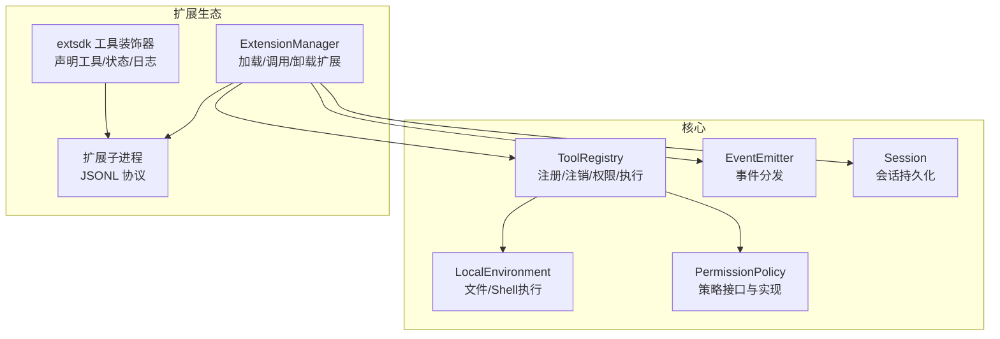
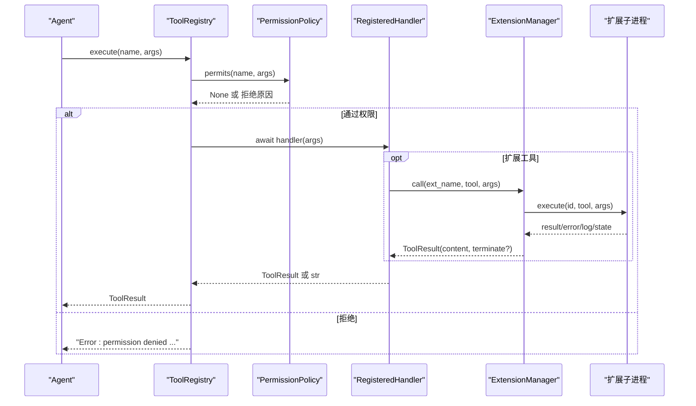
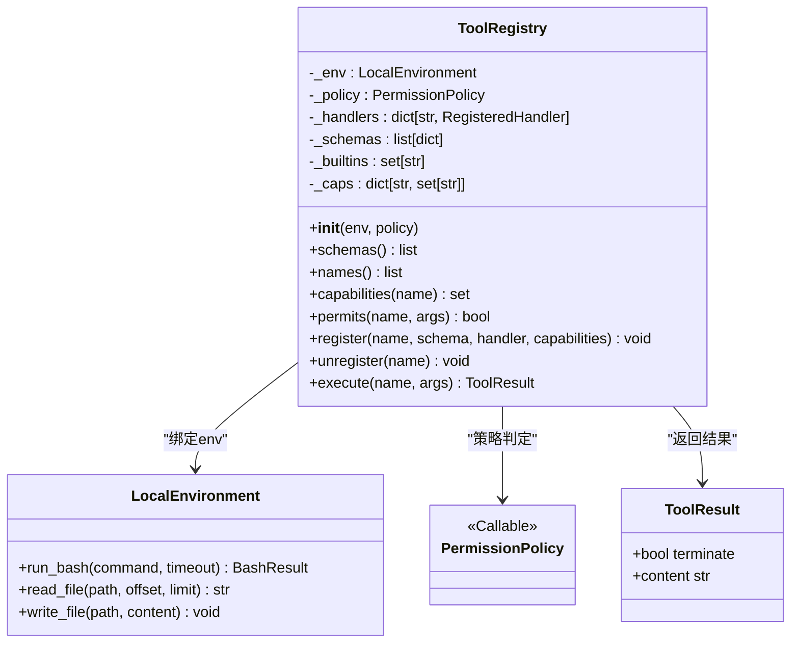
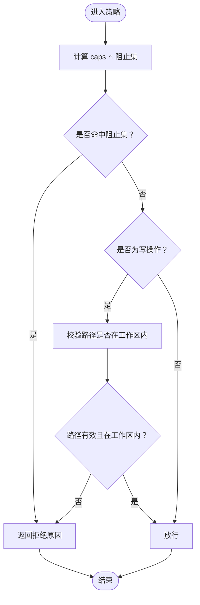
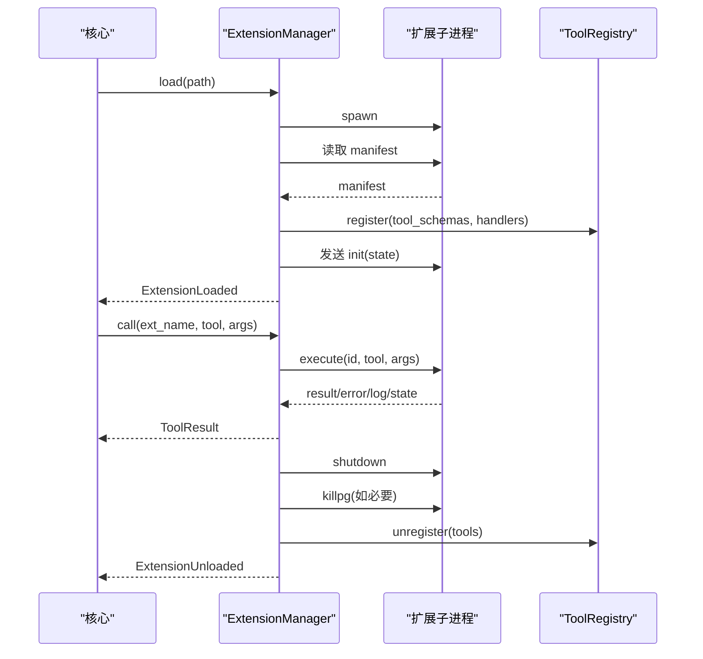
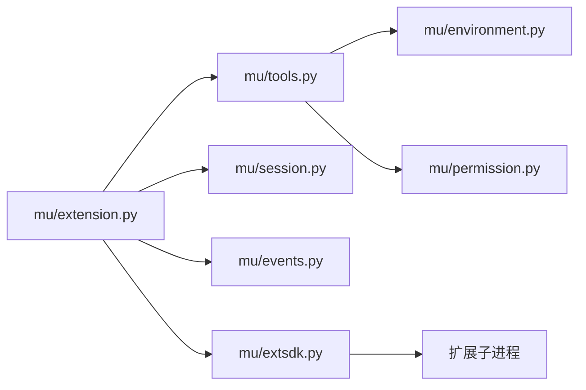

# 工具注册表

<cite>
**本文引用的文件**
- [mu/tools.py](file://mu/tools.py)
- [mu/permission.py](file://mu/permission.py)
- [mu/extension.py](file://mu/extension.py)
- [mu/extsdk.py](file://mu/extsdk.py)
- [mu/environment.py](file://mu/environment.py)
- [mu/session.py](file://mu/session.py)
- [mu/events.py](file://mu/events.py)
- [tests/test_tools.py](file://tests/test_tools.py)
- [tests/test_extension.py](file://tests/test_extension.py)
- [extensions/example_textstats.py](file://extensions/example_textstats.py)
- [README.md](file://README.md)
</cite>

## 目录
1. [简介](#简介)
2. [项目结构](#项目结构)
3. [核心组件](#核心组件)
4. [架构总览](#架构总览)
5. [组件详解](#组件详解)
6. [依赖关系分析](#依赖关系分析)
7. [性能考量](#性能考量)
8. [故障排查指南](#故障排查指南)
9. [结论](#结论)
10. [附录](#附录)

## 简介
本文件面向“工具注册表系统”的技术文档，聚焦 ToolRegistry 类的设计与实现，涵盖以下主题：
- 工具注册、注销、权限检查与执行流程
- 工具处理器的统一签名、functools.partial 绑定机制与异步执行模式
- 工具能力系统（capabilities）与权限策略（PermissionPolicy）及安全控制
- 工具生命周期管理与错误处理策略
- 使用示例：如何注册自定义工具、查询工具信息、执行工具调用

本系统以“Pi 哲学”为基础：工具返回字符串，错误也返回字符串（不抛异常），让模型自纠错；工具遵循 OpenAI function-calling schema；内置四工具（read/write/edit/bash）固定，M3 起支持动态注册扩展工具。

## 项目结构
围绕工具注册表的关键模块如下：
- 工具与注册表：mu/tools.py
- 权限策略：mu/permission.py
- 扩展管理与子进程：mu/extension.py
- 扩展 SDK：mu/extsdk.py
- 本地执行环境：mu/environment.py
- 会话与状态：mu/session.py
- 事件系统：mu/events.py
- 示例扩展：extensions/example_textstats.py
- 测试用例：tests/test_tools.py、tests/test_extension.py
- 项目说明：README.md

图表来源
- [mu/tools.py:191-269](file://mu/tools.py#L191-L269)
- [mu/permission.py:15-69](file://mu/permission.py#L15-L69)
- [mu/extension.py:85-364](file://mu/extension.py#L85-L364)
- [mu/extsdk.py:34-130](file://mu/extsdk.py#L34-L130)
- [mu/environment.py:23-88](file://mu/environment.py#L23-L88)
- [mu/session.py:38-115](file://mu/session.py#L38-L115)
- [mu/events.py:121-133](file://mu/events.py#L121-L133)

章节来源
- [README.md:1-127](file://README.md#L1-L127)

## 核心组件
- ToolRegistry：统一管理工具的 schema、处理器、能力与权限策略，提供注册、注销、查询与执行能力。
- PermissionPolicy：基于“能力”进行权限判定的策略接口与多种实现（允许、只读、工作区写入）。
- ExtensionManager：负责扩展子进程的生命周期管理、工具注册、IPC 通讯与错误降级。
- extsdk：扩展开发 SDK，提供工具装饰器、状态持久化与日志接口。
- LocalEnvironment：提供文件读写与 Shell 执行（异步、进程组超时清理）。
- Session：会话树结构，用于扩展状态的持久化与恢复。
- EventEmitter：事件总线，承载扩展加载/卸载/日志/错误等事件。

章节来源
- [mu/tools.py:191-269](file://mu/tools.py#L191-L269)
- [mu/permission.py:15-69](file://mu/permission.py#L15-L69)
- [mu/extension.py:85-364](file://mu/extension.py#L85-L364)
- [mu/extsdk.py:34-130](file://mu/extsdk.py#L34-L130)
- [mu/environment.py:23-88](file://mu/environment.py#L23-L88)
- [mu/session.py:38-115](file://mu/session.py#L38-L115)
- [mu/events.py:121-133](file://mu/events.py#L121-L133)

## 架构总览
工具注册表系统采用“核心注册表 + 可插拔扩展”的架构。核心注册表持有内置工具与策略，扩展通过子进程以 JSONL 协议接入，动态注册工具并共享状态。

图表来源
- [mu/tools.py:253-269](file://mu/tools.py#L253-L269)
- [mu/permission.py:29-68](file://mu/permission.py#L29-L68)
- [mu/extension.py:251-271](file://mu/extension.py#L251-L271)
- [mu/extsdk.py:86-130](file://mu/extsdk.py#L86-L130)

## 组件详解

### ToolRegistry 设计与实现
- 统一处理器签名
  - 内置工具处理器签名：ToolHandler = Callable[[LocalEnvironment, dict[str, Any]], Awaitable[str]]
  - 注册后统一为 RegisteredHandler = Callable[[dict[str, Any]], Awaitable[Any]]
  - 通过 functools.partial 将 LocalEnvironment 绑定到内置工具，形成对外统一签名
- 工具能力系统
  - 每个工具映射一组能力集合（如 read/write/shell 等）
  - 权限策略按能力 gate，而非按工具名黑名单
- 权限检查
  - permits(name, args) 仅判断是否允许，不执行
  - execute 在执行前调用策略进行权限判定
- 注册与注销
  - register(name, schema, handler, capabilities)
    - capabilities 默认保守策略 {write, shell}
    - 重名直接拒绝
  - unregister(name)
    - 保护内置工具（不可注销）
    - 同步更新 schema 与 capabilities
- 执行流程
  - 查找处理器 → 权限判定 → 异步调用 → 异常捕获 → 统一封装为 ToolResult

图表来源
- [mu/tools.py:191-269](file://mu/tools.py#L191-L269)
- [mu/tools.py:19-36](file://mu/tools.py#L19-L36)
- [mu/environment.py:23-88](file://mu/environment.py#L23-L88)
- [mu/permission.py:15-31](file://mu/permission.py#L15-L31)

章节来源
- [mu/tools.py:191-269](file://mu/tools.py#L191-L269)
- [tests/test_tools.py:1-117](file://tests/test_tools.py#L1-L117)

### 权限策略（PermissionPolicy）
- 策略接口：PermissionPolicy = Callable[[str, dict, set[str]], str | None]
- 能力常量：WRITE、SHELL、CODE_EXEC、EXTENSION_EXEC
- 策略实现
  - allow_all：始终放行
  - read_only：若工具具备 write/shell/code_exec/extension_exec 之一则拒绝
  - workspace_write(root)：对 shell/code/exec 一律拒绝；对 write 限制在工作区内
- 策略选择：make_policy(kind, root)

图表来源
- [mu/permission.py:40-58](file://mu/permission.py#L40-L58)
- [mu/permission.py:33-37](file://mu/permission.py#L33-L37)
- [mu/permission.py:29-30](file://mu/permission.py#L29-L30)

章节来源
- [mu/permission.py:15-69](file://mu/permission.py#L15-L69)

### 扩展管理与子进程（ExtensionManager）
- 生命周期
  - load：启动子进程 → 读取首行 manifest → 注册工具 → 启动 reader 任务 → 发送 init
  - reload：先 unload 再 load
  - unload：注销工具 → 发送 shutdown → 等待退出或强制杀死 → 取消 reader 任务
  - aclose：统一卸载所有扩展
- 调用流程
  - call：生成请求 ID → 注册 Future → 发送 execute → 等待结果或超时
  - _make_handler：将扩展工具包装为 RegisteredHandler
- IPC 协议
  - 扩展子进程以 JSONL 行协议与核心通讯：manifest/init/execute/shutdown/result/error/log/state
- 错误降级
  - 扩展崩溃：解挂 pending、注销工具、发出 ExtensionError 事件
  - 超时：返回超时错误，不等待完整 _CALL_TIMEOUT
- 状态持久化
  - 通过 Session 记录 ext_state，支持 resume 恢复

图表来源
- [mu/extension.py:131-248](file://mu/extension.py#L131-L248)
- [mu/extension.py:251-271](file://mu/extension.py#L251-L271)
- [mu/extension.py:275-317](file://mu/extension.py#L275-L317)
- [mu/extsdk.py:76-130](file://mu/extsdk.py#L76-L130)

章节来源
- [mu/extension.py:85-364](file://mu/extension.py#L85-L364)
- [tests/test_extension.py:68-245](file://tests/test_extension.py#L68-L245)
- [extensions/example_textstats.py:1-67](file://extensions/example_textstats.py#L1-L67)

### 扩展 SDK（extsdk）
- 工具装饰器
  - @tool(name, description, parameters, permissions)：声明工具 schema 与权限
- 状态与日志
  - get_state()/set_state(state)：持久化扩展状态
  - log(message, level)：上报日志事件
- 协议实现
  - run_extension(name, version)：输出 manifest → 主循环处理 init/execute/shutdown
  - _handle：执行工具函数，支持同步/异步返回，错误回传

章节来源
- [mu/extsdk.py:34-130](file://mu/extsdk.py#L34-L130)

### 本地执行环境（LocalEnvironment）
- 提供 run_bash/read_file/write_file 的异步封装
- run_bash 使用 start_new_session=True 并在超时时按进程组整组清理，避免孤儿进程
- 文件读写通过线程池 offload，避免阻塞事件循环

章节来源
- [mu/environment.py:23-88](file://mu/environment.py#L23-L88)

### 会话与事件
- Session：树形结构消息存储，支持分支、摘要与恢复
- EventEmitter：同步事件分发，扩展加载/卸载/日志/错误均以事件形式呈现

章节来源
- [mu/session.py:38-115](file://mu/session.py#L38-L115)
- [mu/events.py:121-133](file://mu/events.py#L121-L133)

## 依赖关系分析
- ToolRegistry 依赖 LocalEnvironment 提供文件/Shell 能力，依赖 PermissionPolicy 进行权限判定
- ExtensionManager 依赖 ToolRegistry 注册/注销扩展工具，依赖 Session 持久化状态，依赖 EventEmitter 发布扩展事件
- 扩展子进程通过 extsdk 与核心进行 JSONL 协议通讯
- 测试覆盖了内置工具行为、扩展加载/调用/状态恢复、错误与超时处理等场景

图表来源
- [mu/tools.py:11-16](file://mu/tools.py#L11-L16)
- [mu/extension.py:28-29](file://mu/extension.py#L28-L29)
- [mu/extsdk.py:24-130](file://mu/extsdk.py#L24-L130)

章节来源
- [mu/tools.py:11-16](file://mu/tools.py#L11-L16)
- [mu/extension.py:28-29](file://mu/extension.py#L28-L29)

## 性能考量
- 异步优先：文件读写与 Shell 执行均采用异步与线程池 offload，避免阻塞事件循环
- 进程组超时清理：run_bash 使用 start_new_session 并在超时后按进程组整组清理，防止孤儿进程与资源泄漏
- 扩展 IPC：JSONL 协议简单可靠，call 超时短于扩展默认超时，快速失败降低等待时间
- 策略判定开销低：权限策略仅做集合运算与路径校验，复杂度低

## 故障排查指南
- “未知工具”
  - 现象：execute 返回“unknown tool”
  - 排查：确认工具是否已注册（names/schemas），扩展是否成功加载
  - 参考：[mu/tools.py:253-257](file://mu/tools.py#L253-L257)
- “权限拒绝”
  - 现象：execute 返回“permission denied”
  - 排查：检查策略类型（allow/readonly/workspace），工具能力集合，路径是否在工作区内
  - 参考：[mu/tools.py:257-259](file://mu/tools.py#L257-L259)、[mu/permission.py:33-58](file://mu/permission.py#L33-L58)
- “缺少必需参数”
  - 现象：KeyError 导致返回“missing required argument”
  - 排查：核对工具 schema 的 required 字段与调用参数
  - 参考：[mu/tools.py:262-263](file://mu/tools.py#L262-L263)
- “扩展超时”
  - 现象：返回“timed out”
  - 排查：检查扩展内部逻辑、是否产生孤儿进程；确认进程组清理生效
  - 参考：[mu/extension.py:261-265](file://mu/extension.py#L261-L265)、[mu/environment.py:26-48](file://mu/environment.py#L26-L48)
- “扩展崩溃”
  - 现象：当前调用快速失败、工具被注销、触发 ExtensionError 事件
  - 排查：查看扩展日志事件，定位崩溃点；确认扩展进程组清理
  - 参考：[mu/extension.py:299-317](file://mu/extension.py#L299-L317)、[mu/extsdk.py:92-109](file://mu/extsdk.py#L92-L109)

章节来源
- [mu/tools.py:253-269](file://mu/tools.py#L253-L269)
- [mu/permission.py:29-68](file://mu/permission.py#L29-L68)
- [mu/extension.py:251-271](file://mu/extension.py#L251-L271)
- [mu/environment.py:26-48](file://mu/environment.py#L26-L48)
- [mu/extsdk.py:86-130](file://mu/extsdk.py#L86-L130)

## 结论
ToolRegistry 以统一签名与能力驱动的权限体系为核心，结合 ExtensionManager 的子进程扩展机制，构建了可演进、可扩展、可观察的工具平台。通过策略化的权限控制与严格的生命周期管理，系统在 M3 形态下实现了“自延伸”的能力边界，在 M3.5 及以后阶段进一步引入更细粒度的安全与沙箱能力。

## 附录

### 如何注册自定义工具
- 步骤
  - 准备工具处理器（RegisteredHandler）：接收 dict[str, Any] 参数，返回 str 或 ToolResult
  - 准备 OpenAI function schema
  - 调用 registry.register(name, schema, handler, capabilities)
- 示例参考
  - [tests/test_extension.py:33-51](file://tests/test_extension.py#L33-L51)
  - [mu/tools.py:225-242](file://mu/tools.py#L225-L242)

章节来源
- [tests/test_extension.py:33-51](file://tests/test_extension.py#L33-L51)
- [mu/tools.py:225-242](file://mu/tools.py#L225-L242)

### 如何查询工具信息
- 查询工具名列表：registry.names()
- 查询工具 schema 列表：registry.schemas()
- 查询工具能力集合：registry.capabilities(name)
- 示例参考
  - [tests/test_tools.py:103-106](file://tests/test_tools.py#L103-L106)
  - [mu/tools.py:212-220](file://mu/tools.py#L212-L220)

章节来源
- [tests/test_tools.py:103-106](file://tests/test_tools.py#L103-L106)
- [mu/tools.py:212-220](file://mu/tools.py#L212-L220)

### 如何执行工具调用
- 调用入口：await registry.execute(name, args)
- 内置工具：已绑定 LocalEnvironment，直接传参即可
- 扩展工具：通过 ExtensionManager 注册，统一走子进程执行
- 示例参考
  - [tests/test_tools.py:7-91](file://tests/test_tools.py#L7-L91)
  - [tests/test_extension.py:68-84](file://tests/test_extension.py#L68-L84)

章节来源
- [tests/test_tools.py:7-91](file://tests/test_tools.py#L7-L91)
- [tests/test_extension.py:68-84](file://tests/test_extension.py#L68-L84)

### 工具处理器统一签名与 functools.partial 绑定
- 统一签名：RegisteredHandler(args) -> Awaitable[Any]
- 绑定机制：内置工具通过 functools.partial 绑定 LocalEnvironment，形成对外统一签名
- 异步执行：所有处理器均为异步，支持 await handler(args)

章节来源
- [mu/tools.py:14-16](file://mu/tools.py#L14-L16)
- [mu/tools.py:198-207](file://mu/tools.py#L198-L207)

### 工具能力系统与权限策略
- 能力定义：write、shell、code_exec、extension_exec
- 策略实现：allow_all、read_only、workspace_write
- 使用建议：根据部署形态选择策略；扩展工具默认保守能力集

章节来源
- [mu/permission.py:17-26](file://mu/permission.py#L17-L26)
- [mu/permission.py:29-68](file://mu/permission.py#L29-L68)

### 扩展示例与状态持久化
- 示例扩展：extensions/example_textstats.py 展示 @tool、set_state/get_state、log 的使用
- 状态恢复：通过 Session 的 ext_state 消息实现 resume 恢复

章节来源
- [extensions/example_textstats.py:1-67](file://extensions/example_textstats.py#L1-L67)
- [tests/test_extension.py:101-120](file://tests/test_extension.py#L101-L120)