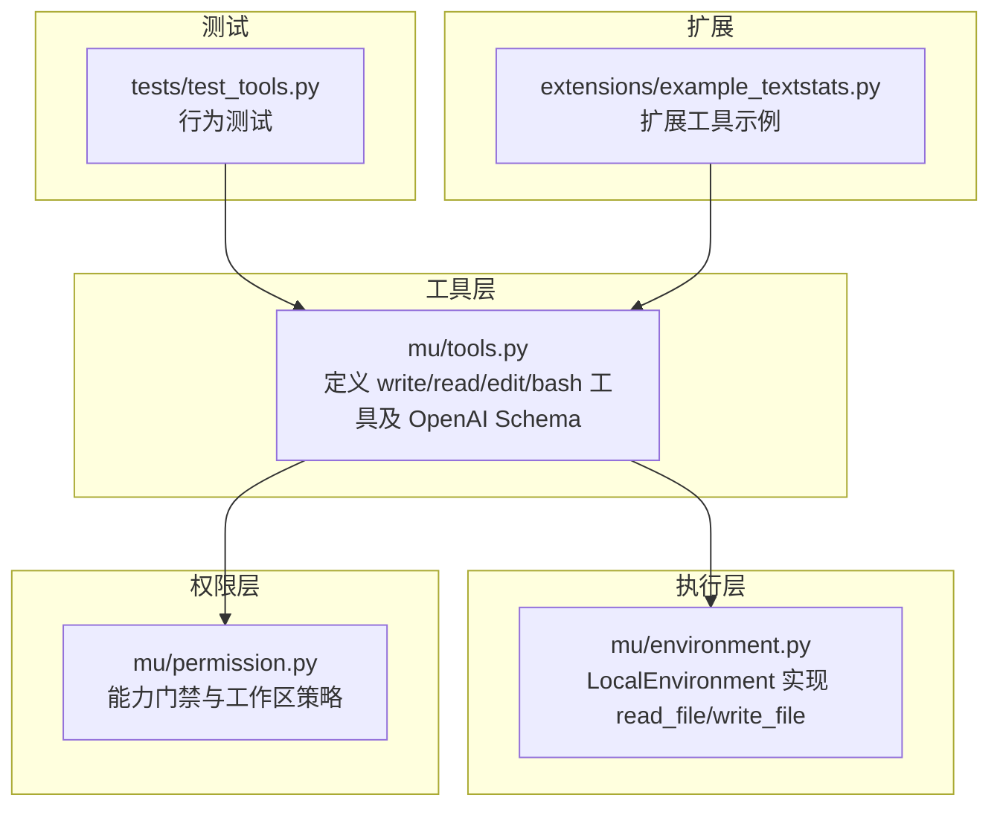
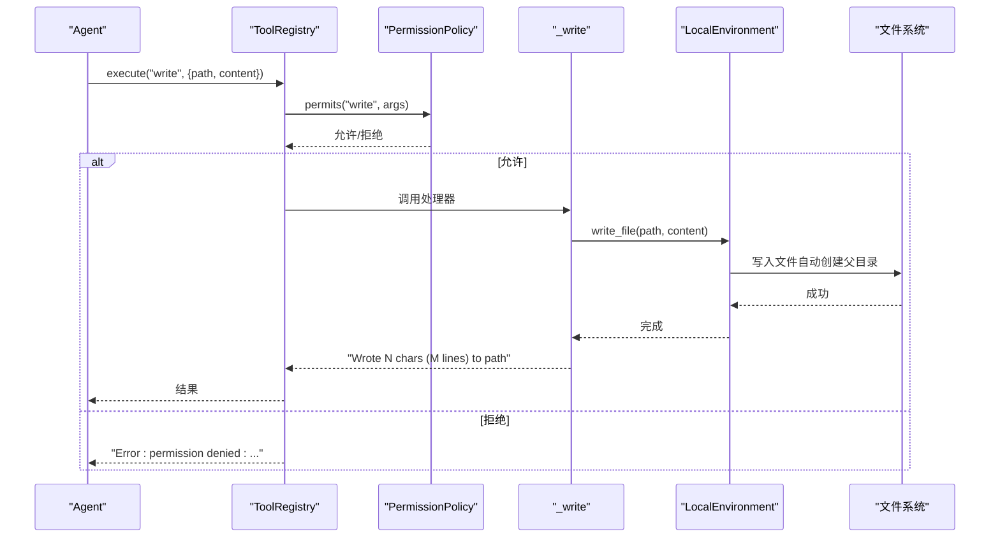
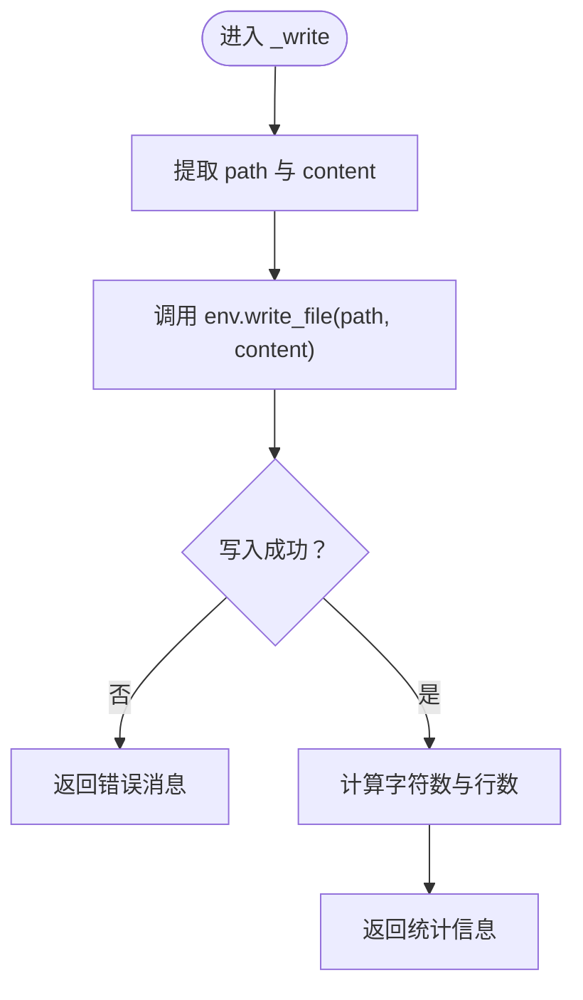
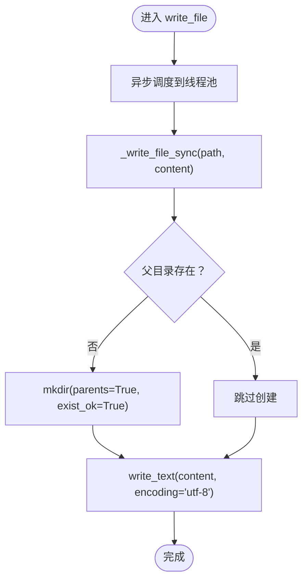
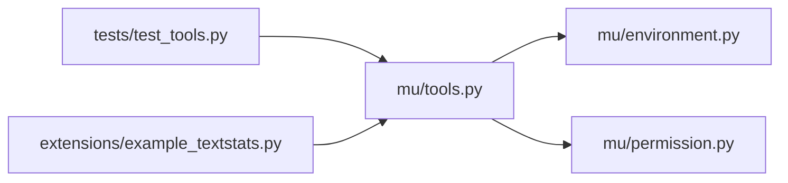

# 文件写入工具 (write)

<cite>
**本文档引用的文件**
- [tools.py](file://mu/tools.py)
- [environment.py](file://mu/environment.py)
- [permission.py](file://mu/permission.py)
- [test_tools.py](file://tests/test_tools.py)
- [example_textstats.py](file://extensions/example_textstats.py)
</cite>

## 目录
1. [简介](#简介)
2. [项目结构](#项目结构)
3. [核心组件](#核心组件)
4. [架构总览](#架构总览)
5. [详细组件分析](#详细组件分析)
6. [依赖分析](#依赖分析)
7. [性能考虑](#性能考虑)
8. [故障排除指南](#故障排除指南)
9. [结论](#结论)
10. [附录](#附录)

## 简介
本文件写入工具用于在本地环境中创建或覆盖文件内容，支持绝对路径，具备以下关键特性：
- 参数校验：要求提供 path 和 content
- 文件创建与覆盖：将 content 写入指定路径
- 父目录自动创建：当目标路径不存在时，自动递归创建父目录
- 权限控制：通过能力门禁（capabilities）与工作区策略进行限制
- 统计信息：返回写入的字符数与行数
- 错误处理：将异常转换为可读的错误消息

## 项目结构
与 write 工具相关的核心模块如下：
- 工具定义与注册：mu/tools.py
- 本地环境实现（文件读写）：mu/environment.py
- 权限策略：mu/permission.py
- 行为测试：tests/test_tools.py
- 扩展示例：extensions/example_textstats.py

图表来源
- [tools.py:108-173](file://mu/tools.py#L108-L173)
- [environment.py:79-87](file://mu/environment.py#L79-L87)
- [permission.py:40-68](file://mu/permission.py#L40-L68)
- [test_tools.py:7-18](file://tests/test_tools.py#L7-L18)
- [example_textstats.py:6](file://extensions/example_textstats.py#L6)

章节来源
- [tools.py:108-173](file://mu/tools.py#L108-L173)
- [environment.py:79-87](file://mu/environment.py#L79-L87)
- [permission.py:40-68](file://mu/permission.py#L40-L68)
- [test_tools.py:7-18](file://tests/test_tools.py#L7-L18)
- [example_textstats.py:6](file://extensions/example_textstats.py#L6)

## 核心组件
- write 工具函数：负责参数解析、调用环境写入、统计信息生成与错误处理
- LocalEnvironment：封装异步文件写入，包含父目录自动创建逻辑
- 权限策略：基于能力门禁（write 能力）与工作区限制
- JSON Schema：描述工具名称、参数类型与必填字段

章节来源
- [tools.py:58-66](file://mu/tools.py#L58-L66)
- [environment.py:79-87](file://mu/environment.py#L79-L87)
- [permission.py:40-68](file://mu/permission.py#L40-L68)
- [tools.py:130-141](file://mu/tools.py#L130-L141)

## 架构总览
write 工具的调用流程如下：
- ToolRegistry 接收工具调用请求
- 权限策略检查（能力门禁与工作区限制）
- 调用 _write 工具函数
- _write 调用 LocalEnvironment.write_file 异步写入
- 返回统计信息（字符数、行数）

图表来源
- [tools.py:253-268](file://mu/tools.py#L253-L268)
- [permission.py:40-68](file://mu/permission.py#L40-L68)
- [tools.py:58-66](file://mu/tools.py#L58-L66)
- [environment.py:79-87](file://mu/environment.py#L79-L87)

## 详细组件分析

### write 工具函数实现
- 参数验证：从 args 中提取 path 与 content
- 调用环境写入：通过 LocalEnvironment.write_file 异步写入
- 错误处理：捕获异常并返回人类可读的错误消息
- 统计信息：计算字符数与行数并返回

图表来源
- [tools.py:58-66](file://mu/tools.py#L58-L66)

章节来源
- [tools.py:58-66](file://mu/tools.py#L58-L66)

### LocalEnvironment.write_file 实现
- 异步写入：通过线程池执行同步写入方法，避免阻塞事件循环
- 父目录自动创建：若父目录不存在则递归创建
- 字符编码：使用 UTF-8 写入文本

图表来源
- [environment.py:79-87](file://mu/environment.py#L79-L87)

章节来源
- [environment.py:79-87](file://mu/environment.py#L79-L87)

### JSON Schema 定义与参数约束
- 工具名称：write
- 描述：创建或覆盖文件，父目录自动创建
- 参数对象 properties：
  - path：字符串，绝对路径
  - content：字符串，完整文件内容
- 必填字段：path、content

章节来源
- [tools.py:130-141](file://mu/tools.py#L130-L141)

### 权限策略与工作区限制
- 能力门禁：write 工具需要 write 能力
- 工作区策略：workspace_write 限制写入路径必须位于指定根目录内
- 不可约束能力：shell、code_exec、extension_exec 无法被工作区策略约束

章节来源
- [permission.py:40-68](file://mu/permission.py#L40-L68)
- [tools.py:182-188](file://mu/tools.py#L182-L188)

### 使用示例与最佳实践
- 正确使用：提供绝对路径与完整内容
- 自动创建父目录：无需预先创建中间目录
- 统计信息：工具返回写入的字符数与行数
- 错误处理：权限不足、路径无效、磁盘空间不足等异常会被转换为错误消息

章节来源
- [test_tools.py:7-18](file://tests/test_tools.py#L7-L18)
- [tools.py:58-66](file://mu/tools.py#L58-L66)

## 依赖分析
- 工具层依赖执行层：write 工具调用 LocalEnvironment.write_file
- 工具层依赖权限层：ToolRegistry 在执行前调用权限策略
- 测试依赖工具层：测试用例验证 write 的行为与统计信息
- 扩展示例依赖工具层：扩展通过 SDK 声明工具，与 write 工具共享相同调用模式

图表来源
- [tools.py:108-173](file://mu/tools.py#L108-L173)
- [environment.py:79-87](file://mu/environment.py#L79-L87)
- [permission.py:40-68](file://mu/permission.py#L40-L68)
- [test_tools.py:7-18](file://tests/test_tools.py#L7-L18)
- [example_textstats.py:6](file://extensions/example_textstats.py#L6)

章节来源
- [tools.py:108-173](file://mu/tools.py#L108-L173)
- [environment.py:79-87](file://mu/environment.py#L79-L87)
- [permission.py:40-68](file://mu/permission.py#L40-L68)
- [test_tools.py:7-18](file://tests/test_tools.py#L7-L18)
- [example_textstats.py:6](file://extensions/example_textstats.py#L6)

## 性能考虑
- 异步写入：write_file 通过线程池执行同步写入，避免阻塞事件循环
- 父目录创建：仅在必要时创建，避免重复 I/O
- 统计计算：字符数与行数计算为 O(n)，对大文件影响较小
- 大文件处理：建议分块写入或流式写入以减少内存占用（当前实现一次性写入）
- 磁盘空间管理：工具不进行磁盘空间预检，应在外部策略中进行容量监控

[本节为通用性能讨论，不直接分析具体文件]

## 故障排除指南
常见错误与处理方式：
- 权限不足：权限策略拒绝写入，返回“permission denied”
- 路径无效：工作区策略检测到路径不在允许范围内，返回“invalid path”或“write outside workspace”
- 磁盘空间不足：底层文件系统抛出异常，工具捕获并返回“Error writing ...”
- 文件被占用：底层文件系统抛出异常，工具捕获并返回“Error writing ...”

章节来源
- [permission.py:40-68](file://mu/permission.py#L40-L68)
- [tools.py:58-66](file://mu/tools.py#L58-L66)

## 结论
write 工具提供了简单可靠的文件写入能力，具备参数校验、自动父目录创建与统计信息返回。通过能力门禁与工作区策略，可在不同安全级别下灵活控制写入行为。对于大文件与磁盘空间管理，建议结合外部策略与分块写入方案提升稳定性与性能。

[本节为总结性内容，不直接分析具体文件]

## 附录

### JSON Schema 参数定义
- 工具名称：write
- 描述：创建或覆盖文件，父目录自动创建
- 参数对象 properties：
  - path：字符串，绝对路径
  - content：字符串，完整文件内容
- 必填字段：path、content

章节来源
- [tools.py:130-141](file://mu/tools.py#L130-L141)

### 统计信息返回格式
- 返回字符串包含：写入的字符数与行数
- 示例格式：Wrote N chars (M lines) to path

章节来源
- [tools.py:65-66](file://mu/tools.py#L65-L66)

### 安全限制
- 能力门禁：write 需要 write 能力
- 工作区限制：仅允许写入指定根目录内的路径
- 不可约束能力：shell、code_exec、extension_exec 无法被工作区策略约束

章节来源
- [permission.py:40-68](file://mu/permission.py#L40-L68)
- [tools.py:182-188](file://mu/tools.py#L182-L188)