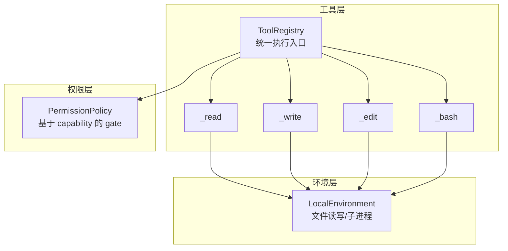
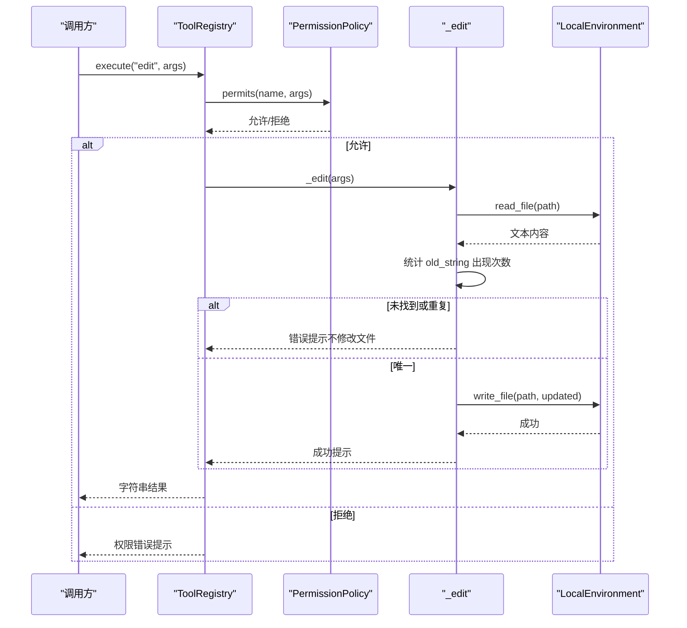
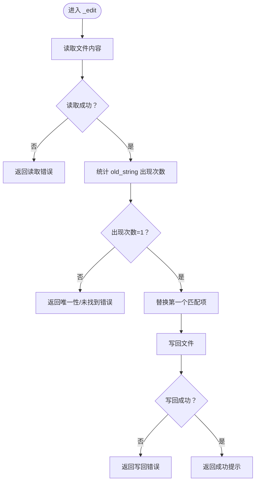
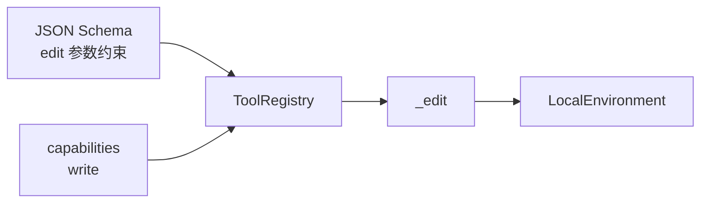

# 文件编辑工具 (edit)

<cite>
**本文引用的文件列表**
- [mu/tools.py](file://mu/tools.py)
- [mu/environment.py](file://mu/environment.py)
- [mu/permission.py](file://mu/permission.py)
- [tests/test_tools.py](file://tests/test_tools.py)
</cite>

## 目录
1. [简介](#简介)
2. [项目结构](#项目结构)
3. [核心组件](#核心组件)
4. [架构总览](#架构总览)
5. [详细组件分析](#详细组件分析)
6. [依赖关系分析](#依赖关系分析)
7. [性能考量](#性能考量)
8. [故障排查指南](#故障排查指南)
9. [结论](#结论)
10. [附录](#附录)

## 简介
本文件面向“文件编辑工具（edit）”的技术文档，聚焦于 _edit 函数的实现细节与行为边界，包括：
- 三参数验证（path、old_string、new_string）
- 唯一性检查与字符串替换逻辑
- JSON Schema 定义与严格参数约束
- 编辑操作的原子性保证、回滚机制与并发安全性
- 正确使用示例与常见错误场景（目标字符串不存在、重复匹配等）
- 安全限制与幂等性保证

## 项目结构
围绕 edit 工具的相关文件与职责如下：
- mu/tools.py：定义四个内置工具（read、write、edit、bash）及其 OpenAI Tools Schema，提供工具注册表与统一执行入口
- mu/environment.py：提供本地执行环境（文件读写、bash 子进程），封装异步 IO 与进程管理
- mu/permission.py：权限策略（基于 capability 的 gate），用于限制 edit 的使用范围
- tests/test_tools.py：针对 edit 的单元测试，覆盖唯一替换、重复匹配、未找到等关键场景

图表来源
- [mu/tools.py:191-269](file://mu/tools.py#L191-L269)
- [mu/environment.py:23-87](file://mu/environment.py#L23-L87)
- [mu/permission.py:29-68](file://mu/permission.py#L29-L68)

章节来源
- [mu/tools.py:108-173](file://mu/tools.py#L108-L173)
- [mu/environment.py:1-150](file://mu/environment.py#L1-L150)
- [mu/permission.py:1-69](file://mu/permission.py#L1-L69)

## 核心组件
- 工具注册表（ToolRegistry）：维护工具名称到处理器与 JSON Schema 的映射，负责参数校验、权限 gate、异常转字符串返回
- _edit 实现：读取文件内容、统计旧字符串出现次数、唯一性校验、替换并写回
- LocalEnvironment：封装文件读写与 bash 子进程执行，确保阻塞操作异步化
- 权限策略：基于 capability 的细粒度控制，限制 write/edit/bash 等能力的使用

章节来源
- [mu/tools.py:191-269](file://mu/tools.py#L191-L269)
- [mu/tools.py:69-92](file://mu/tools.py#L69-L92)
- [mu/environment.py:23-87](file://mu/environment.py#L23-L87)
- [mu/permission.py:29-68](file://mu/permission.py#L29-L68)

## 架构总览
edit 工具的调用链路如下：
- ToolRegistry.execute 接收工具名与参数，先通过权限策略校验
- 若通过，调用对应处理器（_edit）
- _edit 先读取文件，统计旧字符串出现次数，唯一性校验通过后进行一次替换并写回
- 所有文件 IO 由 LocalEnvironment 异步执行，避免阻塞事件循环

图表来源
- [mu/tools.py:253-269](file://mu/tools.py#L253-L269)
- [mu/tools.py:69-92](file://mu/tools.py#L69-L92)
- [mu/environment.py:67-87](file://mu/environment.py#L67-L87)
- [mu/permission.py:29-68](file://mu/permission.py#L29-L68)

## 详细组件分析

### _edit 函数实现与行为
- 参数要求
  - path：绝对路径（Schema 中明确描述）
  - old_string：必须在文件中唯一出现一次，否则拒绝
  - new_string：替换文本
- 三参数验证
  - 读取文件失败：返回错误字符串（文件不存在、目录、其他 IO 异常）
  - old_string 未找到：返回错误字符串（不修改文件）
  - old_string 出现多次：返回错误字符串（不修改文件），提示增加上下文使其唯一
- 替换逻辑
  - 使用一次性替换（仅替换第一个匹配项），避免意外扩大影响
  - 写回成功后返回成功提示
- 错误处理
  - 所有异常转换为字符串返回，便于模型自纠错

图表来源
- [mu/tools.py:69-92](file://mu/tools.py#L69-L92)

章节来源
- [mu/tools.py:69-92](file://mu/tools.py#L69-L92)
- [tests/test_tools.py:40-67](file://tests/test_tools.py#L40-L67)

### JSON Schema 与严格参数约束
- 工具名称：edit
- 描述：将文件中某个精确且唯一的 old_string 替换为 new_string
- 参数对象属性
  - path：string，绝对路径
  - old_string：string，必须唯一
  - new_string：string
- 必填字段：path、old_string、new_string
- 该 Schema 作为 OpenAI Tools 的函数调用规范，确保外部系统对参数进行强类型与必填校验

章节来源
- [mu/tools.py:142-157](file://mu/tools.py#L142-L157)

### 幂等性与原子性保证
- 幂等性
  - 若 old_string 在文件中唯一存在，则执行一次替换即完成；再次执行相同请求不会产生额外副作用（第二次会触发“未找到”或“重复”校验）
- 原子性
  - 当前实现采用“读取 -> 唯一性校验 -> 替换 -> 写回”的顺序，未使用文件锁或临时文件回滚机制
  - 在并发场景下，若多个 edit 同时作用于同一文件且 old_string 唯一，可能出现竞争条件导致最终写回的内容取决于最后一次写回
- 回滚机制
  - 未实现显式的回滚（例如临时文件/快照），因此不建议在高并发或关键路径上直接依赖 edit 的原子性

章节来源
- [mu/tools.py:69-92](file://mu/tools.py#L69-L92)
- [mu/environment.py:79-87](file://mu/environment.py#L79-L87)

### 并发安全性
- 文件 IO 采用异步线程执行（读写均通过线程池），避免阻塞事件循环
- 未使用文件级互斥锁或原子写入（例如 rename 原子替换）
- 并发风险
  - 多个 edit 同时对同一文件进行唯一替换，可能导致最后写回的结果不确定
  - 建议在应用层通过协调（如队列、分布式锁）或在调用前先 read 再 edit 的方式降低并发冲突

章节来源
- [mu/environment.py:67-87](file://mu/environment.py#L67-L87)
- [mu/tools.py:69-92](file://mu/tools.py#L69-L92)

### 安全限制
- 权限策略
  - edit 属于写能力（capabilities 包含 write），可通过策略限制其使用范围
  - read_only 策略会拦截具备 write/shell/code_exec/extension_exec 的能力
  - workspace_write 策略可限制写入路径不得越出工作区
- 策略选择
  - 默认策略 allow_all（宽松）
  - readonly（严格只读）
  - workspace（限定工作区）

章节来源
- [mu/tools.py:183-188](file://mu/tools.py#L183-L188)
- [mu/permission.py:29-68](file://mu/permission.py#L29-L68)

### 使用示例与最佳实践
- 正确使用
  - 确保 old_string 在文件中唯一出现一次
  - 使用绝对路径
  - 在调用前先 read 验证目标字符串位置
- 常见错误场景
  - 目标字符串不存在：返回“未找到”错误，文件保持不变
  - 目标字符串重复：返回“非唯一”错误，文件保持不变
- 测试参考
  - 唯一替换成功
  - 未找到时不修改文件
  - 重复匹配时不修改文件

章节来源
- [tests/test_tools.py:40-67](file://tests/test_tools.py#L40-L67)

## 依赖关系分析
- 工具注册表持有处理器映射与 Schema 列表，并在执行时进行权限校验
- _edit 依赖 LocalEnvironment 的文件读写接口
- 权限策略通过 capability 与工具名解耦，支持更广泛的扩展能力

图表来源
- [mu/tools.py:108-173](file://mu/tools.py#L108-L173)
- [mu/tools.py:175-188](file://mu/tools.py#L175-L188)
- [mu/environment.py:67-87](file://mu/environment.py#L67-L87)

章节来源
- [mu/tools.py:108-173](file://mu/tools.py#L108-L173)
- [mu/tools.py:175-188](file://mu/tools.py#L175-L188)
- [mu/environment.py:67-87](file://mu/environment.py#L67-L87)

## 性能考量
- 时间复杂度
  - 读取文件：O(n)，n 为文件大小
  - 统计 old_string：O(n)
  - 替换一次：O(n)
  - 写回文件：O(n)
  - 总体 O(n)
- 空间复杂度
  - 需要完整加载文件内容，空间 O(n)
- 异步优化
  - 文件读写通过线程池异步执行，避免阻塞事件循环

章节来源
- [mu/environment.py:67-87](file://mu/environment.py#L67-L87)
- [mu/tools.py:69-92](file://mu/tools.py#L69-L92)

## 故障排查指南
- “文件未找到”
  - 检查 path 是否为绝对路径，文件是否存在
- “old_string 未找到”
  - 确认目标字符串存在于文件中
- “old_string 非唯一”
  - 增加上下文字符使 old_string 唯一
- “写回失败”
  - 检查权限与磁盘空间，确认目标路径可写
- 并发问题
  - 在多实例或多线程场景下，考虑引入外部协调或在调用前先 read 再 edit

章节来源
- [mu/tools.py:69-92](file://mu/tools.py#L69-L92)
- [tests/test_tools.py:40-67](file://tests/test_tools.py#L40-L67)

## 结论
edit 工具提供了简洁而严格的文本替换能力：要求目标字符串唯一、参数严格校验、错误以字符串形式返回，便于模型自纠错。当前实现未提供显式的原子性与回滚保障，建议在高并发或关键路径上结合外部协调或在调用前先 read 再 edit 的方式降低风险。通过权限策略可灵活限制 edit 的使用范围，满足不同安全等级的需求。

## 附录
- 三参数验证要点
  - path：绝对路径
  - old_string：必须唯一
  - new_string：替换文本
- 幂等性
  - 唯一替换一次即完成；重复调用不会产生额外副作用
- 安全建议
  - 在 readonly 或 workspace 策略下谨慎使用
  - 高并发场景建议引入外部协调或先 read 再 edit