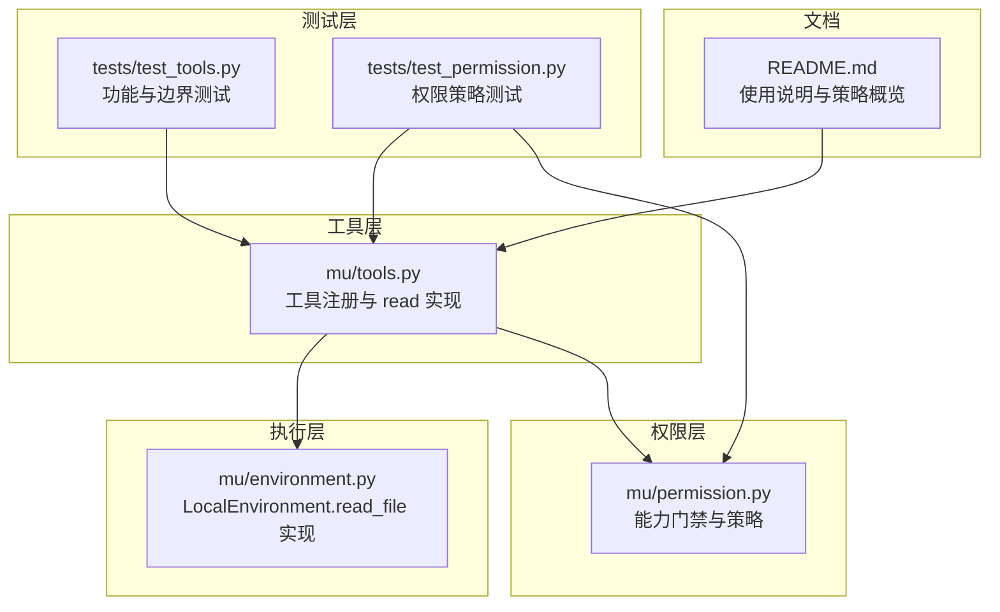
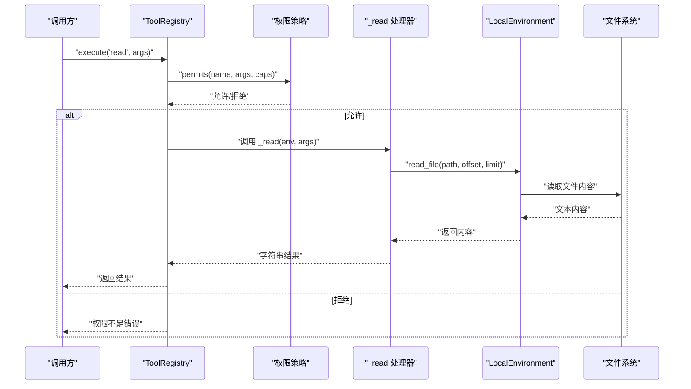
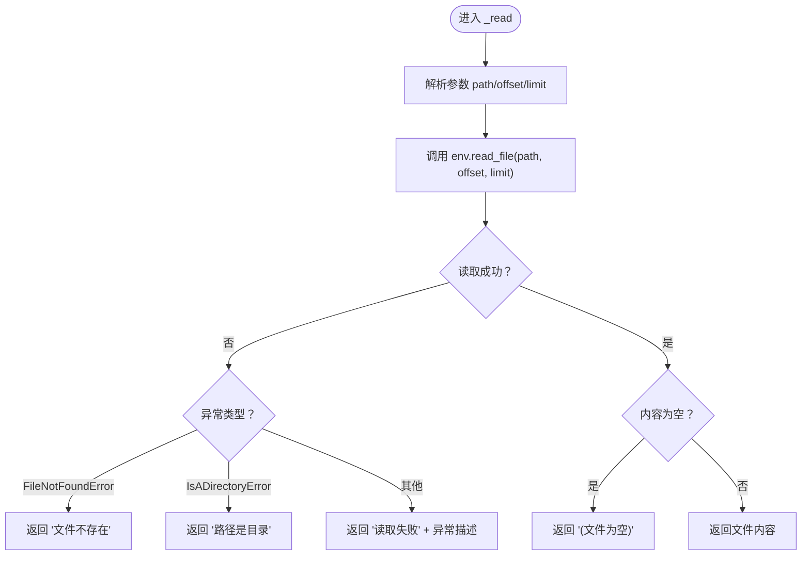
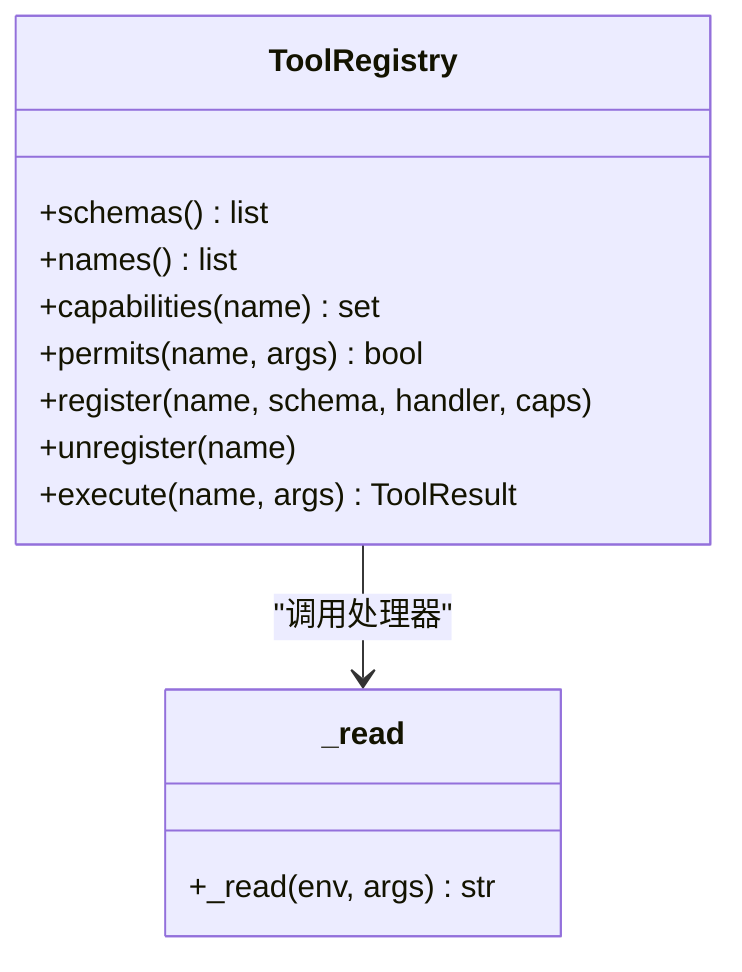
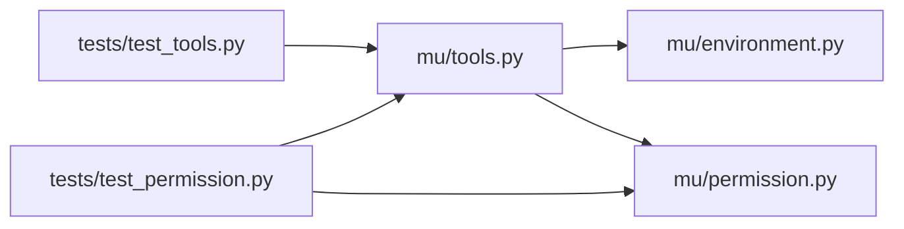

# 文件读取工具 (read)

<cite>
**本文引用的文件**
- [mu/tools.py](file://mu/tools.py)
- [mu/environment.py](file://mu/environment.py)
- [mu/permission.py](file://mu/permission.py)
- [tests/test_tools.py](file://tests/test_tools.py)
- [tests/test_permission.py](file://tests/test_permission.py)
- [README.md](file://README.md)
</cite>

## 目录
1. [简介](#简介)
2. [项目结构](#项目结构)
3. [核心组件](#核心组件)
4. [架构总览](#架构总览)
5. [详细组件分析](#详细组件分析)
6. [依赖分析](#依赖分析)
7. [性能考量](#性能考量)
8. [故障排查指南](#故障排查指南)
9. [结论](#结论)
10. [附录](#附录)

## 简介
本文件面向“文件读取工具（read）”提供一份深入且可操作的技术文档。重点涵盖以下方面：
- _read 函数的实现细节：参数解析（path、offset、limit）、文件系统访问、错误处理机制
- JSON Schema 定义：支持的参数类型与约束条件
- 性能与内存：读取策略、大文件处理建议
- 使用示例与常见错误场景：文件不存在、路径是目录、空文件等
- 安全限制与权限控制：能力门禁、工作区约束、只读模式

## 项目结构
与 read 工具相关的核心模块与测试如下：
- 工具定义与注册：mu/tools.py
- 环境抽象与文件读写实现：mu/environment.py
- 权限策略与能力门禁：mu/permission.py
- 行为与边界测试：tests/test_tools.py、tests/test_permission.py
- 项目背景与使用说明：README.md

图表来源
- [mu/tools.py:191-269](file://mu/tools.py#L191-L269)
- [mu/environment.py:23-88](file://mu/environment.py#L23-L88)
- [mu/permission.py:29-68](file://mu/permission.py#L29-L68)
- [tests/test_tools.py:1-117](file://tests/test_tools.py#L1-L117)
- [tests/test_permission.py:39-69](file://tests/test_permission.py#L39-L69)
- [README.md:1-127](file://README.md#L1-L127)

章节来源
- [mu/tools.py:1-269](file://mu/tools.py#L1-L269)
- [mu/environment.py:1-150](file://mu/environment.py#L1-L150)
- [mu/permission.py:1-69](file://mu/permission.py#L1-L69)
- [tests/test_tools.py:1-117](file://tests/test_tools.py#L1-L117)
- [tests/test_permission.py:39-69](file://tests/test_permission.py#L39-L69)
- [README.md:1-127](file://README.md#L1-L127)

## 核心组件
- 工具注册与执行：ToolRegistry 将工具名称映射到处理器，并在执行前进行权限校验与参数校验。
- 工具处理器：_read 接收参数并委托 LocalEnvironment.read_file 完成实际读取。
- 环境实现：LocalEnvironment.read_file 通过线程池将同步读取逻辑 offload 至线程，支持 offset/limit 的行切片。
- 权限策略：基于能力集合（capabilities）进行门禁，支持 allow、readonly、workspace 等策略。

章节来源
- [mu/tools.py:191-269](file://mu/tools.py#L191-L269)
- [mu/tools.py:40-55](file://mu/tools.py#L40-L55)
- [mu/environment.py:67-88](file://mu/environment.py#L67-L88)
- [mu/permission.py:29-68](file://mu/permission.py#L29-L68)

## 架构总览
read 工具的调用链路如下：

图表来源
- [mu/tools.py:253-269](file://mu/tools.py#L253-L269)
- [mu/tools.py:40-55](file://mu/tools.py#L40-L55)
- [mu/environment.py:67-88](file://mu/environment.py#L67-L88)
- [mu/permission.py:29-68](file://mu/permission.py#L29-L68)

## 详细组件分析

### _read 函数实现细节
- 参数解析
  - path：必填，绝对路径字符串
  - offset：可选，整型，0 基起始行号
  - limit：可选，整型，最大行数
- 文件系统访问
  - 通过 env.read_file(path, offset, limit) 异步读取
  - 读取过程在独立线程中完成，避免阻塞事件循环
- 错误处理
  - FileNotFoundError：返回“文件不存在”的错误信息
  - IsADirectoryError：返回“路径是目录”的错误信息
  - 其他异常：统一包装为“读取失败”的错误信息
  - 空内容：返回“文件为空”的提示信息

图表来源
- [mu/tools.py:40-55](file://mu/tools.py#L40-L55)
- [mu/environment.py:67-88](file://mu/environment.py#L67-L88)

章节来源
- [mu/tools.py:40-55](file://mu/tools.py#L40-L55)
- [mu/environment.py:67-88](file://mu/environment.py#L67-L88)

### JSON Schema 定义
- 工具名称：read
- 描述：读取文本文件内容，使用绝对路径
- 参数
  - path：string，必填
  - offset：integer，可选，0 基起始行
  - limit：integer，可选，最大行数
- 能力：read

章节来源
- [mu/tools.py:110-173](file://mu/tools.py#L110-L173)

### 工具注册与执行流程
- 工具处理器绑定：_HANDLERS 将 "read" 映射到 _read
- 能力映射：_CAPABILITIES 将 "read" 映射到 {"read"}
- 执行流程：ToolRegistry.execute 在执行前进行权限检查与参数完整性检查，随后调用处理器

图表来源
- [mu/tools.py:191-269](file://mu/tools.py#L191-L269)
- [mu/tools.py:40-55](file://mu/tools.py#L40-L55)

章节来源
- [mu/tools.py:175-188](file://mu/tools.py#L175-L188)
- [mu/tools.py:191-269](file://mu/tools.py#L191-L269)

### 环境实现与线程池 offload
- LocalEnvironment.read_file 将同步读取逻辑 offload 至线程池，避免阻塞事件循环
- _read_file_sync 实现 UTF-8 文本读取，并根据 offset/limit 进行行切片

章节来源
- [mu/environment.py:67-88](file://mu/environment.py#L67-L88)

### 权限控制与安全限制
- 能力门禁：read 工具具备 "read" 能力，策略按能力集合 gate，而非工具名黑名单
- 策略类型
  - allow_all：默认放行
  - read_only：阻止 write、shell、code_exec、extension_exec
  - workspace_write：将 write 限定在指定根目录内，且 shell/code/extension 无法被约束，因此一律拒绝
- 读取行为不受 workspace 约束影响，但 write/bash/code/extension 受约束

章节来源
- [mu/permission.py:29-68](file://mu/permission.py#L29-L68)
- [mu/tools.py:183-188](file://mu/tools.py#L183-L188)

## 依赖分析
- 工具层依赖环境层与权限层
- 环境层提供线程池 offload 与同步实现
- 权限层提供能力门禁与策略工厂

图表来源
- [mu/tools.py:1-269](file://mu/tools.py#L1-L269)
- [mu/environment.py:1-150](file://mu/environment.py#L1-L150)
- [mu/permission.py:1-69](file://mu/permission.py#L1-L69)
- [tests/test_tools.py:1-117](file://tests/test_tools.py#L1-L117)
- [tests/test_permission.py:39-69](file://tests/test_permission.py#L39-L69)

章节来源
- [mu/tools.py:1-269](file://mu/tools.py#L1-L269)
- [mu/environment.py:1-150](file://mu/environment.py#L1-L150)
- [mu/permission.py:1-69](file://mu/permission.py#L1-L69)
- [tests/test_tools.py:1-117](file://tests/test_tools.py#L1-L117)
- [tests/test_permission.py:39-69](file://tests/test_permission.py#L39-L69)

## 性能考量
- 线程池 offload：文件读取在独立线程中执行，避免阻塞事件循环
- 行切片策略：当 offset/limit 存在时，先按行分割再拼接，适合大文件的部分读取
- 内存占用：完整读取会将整个文件载入内存；建议配合 limit 限制返回大小
- 大文件处理建议
  - 优先使用 offset/limit 进行分段读取
  - 对于超大文件，结合 bash 或外部工具进行流式处理
  - 注意 UTF-8 错误替换策略，避免解码异常导致读取中断

章节来源
- [mu/environment.py:67-88](file://mu/environment.py#L67-L88)

## 故障排查指南
- 文件不存在
  - 现象：返回“文件不存在”
  - 排查：确认 path 是否为绝对路径，目标文件是否存在
- 路径是目录
  - 现象：返回“路径是目录”
  - 排查：确保 path 指向文件而非目录
- 空文件
  - 现象：返回“(文件为空)”
  - 排查：确认文件是否为空
- 缺少必要参数
  - 现象：返回“缺少必需参数”
  - 排查：确保提供 path
- 权限不足
  - 现象：返回“权限不足”
  - 排查：检查策略是否为 readonly 或 workspace，确认工具能力集合

章节来源
- [tests/test_tools.py:28-37](file://tests/test_tools.py#L28-L37)
- [tests/test_tools.py:98-100](file://tests/test_tools.py#L98-L100)
- [mu/tools.py:47-52](file://mu/tools.py#L47-L52)
- [mu/permission.py:33-37](file://mu/permission.py#L33-L37)
- [tests/test_permission.py:55-63](file://tests/test_permission.py#L55-L63)

## 结论
read 工具通过清晰的参数定义、稳健的错误处理与线程池 offload，提供了可靠的文件读取能力。结合能力门禁与策略，可在不同安全级别下灵活使用。对于大文件与高吞吐场景，建议采用 offset/limit 分段读取，并配合合适的权限策略与工作区约束，确保安全与性能的平衡。

## 附录

### 使用示例（基于测试用例）
- 基本读取：先写后读，断言内容一致
- 分段读取：设置 offset 与 limit，断言返回指定行区间
- 错误场景：读取不存在文件、空文件、缺少参数

章节来源
- [tests/test_tools.py:7-12](file://tests/test_tools.py#L7-L12)
- [tests/test_tools.py:21-25](file://tests/test_tools.py#L21-L25)
- [tests/test_tools.py:28-30](file://tests/test_tools.py#L28-L30)
- [tests/test_tools.py:33-37](file://tests/test_tools.py#L33-L37)
- [tests/test_tools.py:98-100](file://tests/test_tools.py#L98-L100)

### 权限策略与使用说明
- 策略选择：allow、readonly、workspace
- 使用说明：README 中对 --permission 与 --sandbox 的说明

章节来源
- [README.md:84-96](file://README.md#L84-L96)
- [mu/permission.py:61-68](file://mu/permission.py#L61-L68)