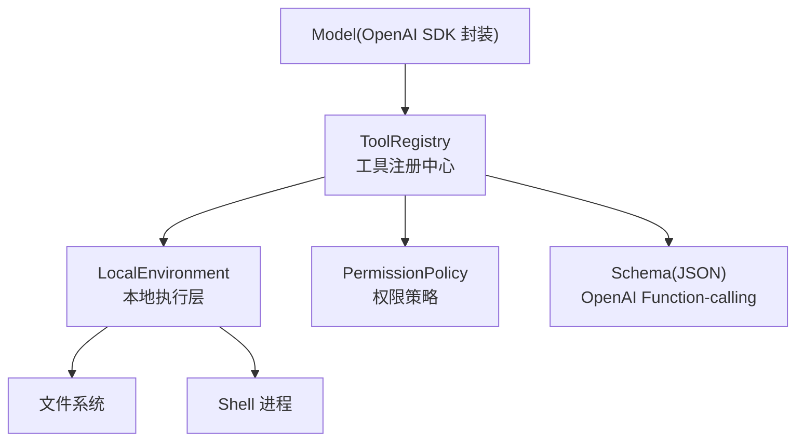
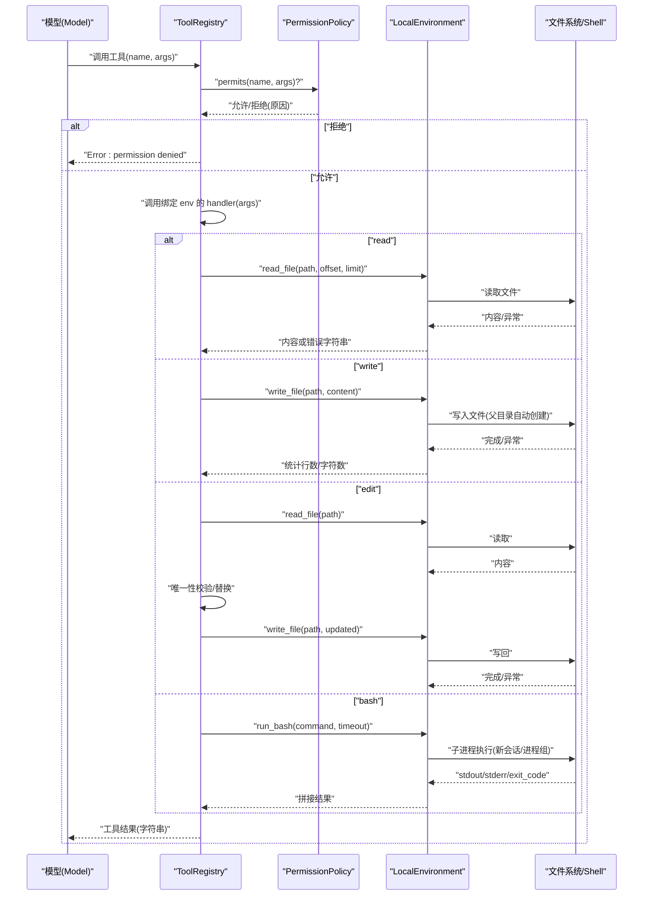
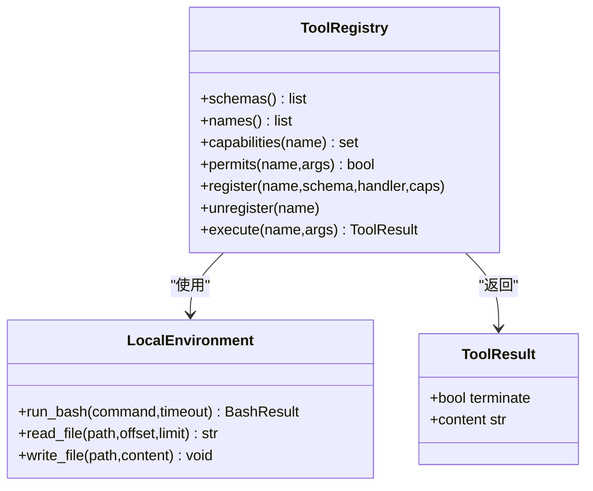
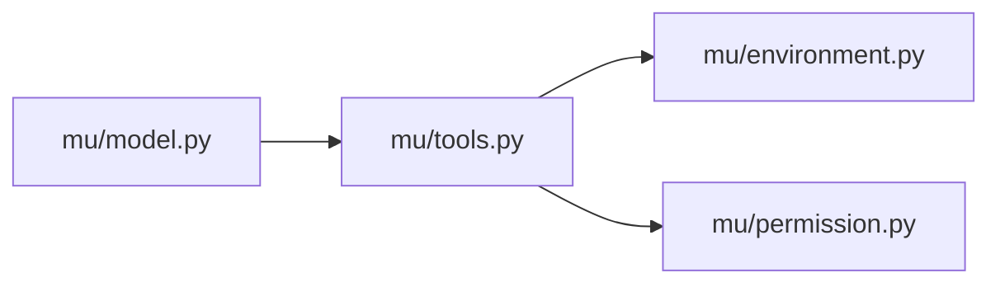

# 核心工具

<cite>
**本文引用的文件**
- [mu/tools.py](file://mu/tools.py)
- [mu/environment.py](file://mu/environment.py)
- [mu/permission.py](file://mu/permission.py)
- [tests/test_tools.py](file://tests/test_tools.py)
- [tests/test_permission.py](file://tests/test_permission.py)
- [mu/__init__.py](file://mu/__init__.py)
- [mu/model.py](file://mu/model.py)
</cite>

## 目录
1. [简介](#简介)
2. [项目结构](#项目结构)
3. [核心组件](#核心组件)
4. [架构总览](#架构总览)
5. [详细组件分析](#详细组件分析)
6. [依赖分析](#依赖分析)
7. [性能考虑](#性能考虑)
8. [故障排查指南](#故障排查指南)
9. [结论](#结论)
10. [附录](#附录)

## 简介
本文面向 μ (mu) 核心工具，系统性阐述四个内置工具的实现细节、参数校验、错误处理、返回值格式、安全限制、性能考量与使用场景。同时给出 JSON Schema 定义与 OpenAI Function-calling 兼容性说明，并通过测试用例路径提供可复现实操示例与常见错误场景的解决思路。

## 项目结构
- 工具与注册中心位于 mu/tools.py，定义了 read、write、edit、bash 四个工具及统一的 ToolRegistry。
- 执行环境抽象与本地实现位于 mu/environment.py，负责文件读写与 bash 子进程执行。
- 权限策略位于 mu/permission.py，基于“能力（capability）”进行细粒度控制。
- 测试用例位于 tests/test_tools.py 与 tests/test_permission.py，覆盖工具行为与权限策略。
- 模型对接 OpenAI Function-calling 的能力由 mu/model.py 提供，用于流式累积与工具调用解析。

图表来源
- [mu/tools.py:191-269](file://mu/tools.py#L191-L269)
- [mu/environment.py:23-88](file://mu/environment.py#L23-L88)
- [mu/permission.py:29-68](file://mu/permission.py#L29-L68)
- [mu/model.py:112-146](file://mu/model.py#L112-L146)

章节来源
- [mu/tools.py:1-269](file://mu/tools.py#L1-L269)
- [mu/environment.py:1-150](file://mu/environment.py#L1-L150)
- [mu/permission.py:1-69](file://mu/permission.py#L1-L69)
- [tests/test_tools.py:1-117](file://tests/test_tools.py#L1-L117)
- [tests/test_permission.py:39-69](file://tests/test_permission.py#L39-L69)
- [mu/model.py:1-146](file://mu/model.py#L1-L146)

## 核心组件
- ToolRegistry：内置四工具固定注册，支持动态扩展工具注册/注销；统一执行入口，返回 ToolResult 字符串并携带 terminate 标志位（内置工具永不 terminate）。
- 工具函数：read、write、edit、bash，均以 (env, args) -> str 的异步签名实现，错误统一转换为字符串返回。
- LocalEnvironment：提供 run_bash、read_file、write_file 的异步实现，文件读写通过线程池 offload，bash 使用新会话/进程组以支持超时整组清理。
- 权限策略：基于能力集合（read、write、shell 等）进行细粒度拦截，支持 allow_all、read_only、workspace_write 三种策略。
- JSON Schema：内置四工具的 OpenAI Function-calling 规范定义，描述参数类型、必填项与用途。

章节来源
- [mu/tools.py:191-269](file://mu/tools.py#L191-L269)
- [mu/tools.py:40-106](file://mu/tools.py#L40-L106)
- [mu/environment.py:23-88](file://mu/environment.py#L23-L88)
- [mu/permission.py:29-68](file://mu/permission.py#L29-L68)

## 架构总览
以下序列图展示了从模型发出工具调用到工具执行与返回的完整流程，包括权限检查、参数校验与错误处理。

图表来源
- [mu/tools.py:253-269](file://mu/tools.py#L253-L269)
- [mu/tools.py:40-106](file://mu/tools.py#L40-L106)
- [mu/environment.py:26-48](file://mu/environment.py#L26-L48)
- [mu/permission.py:29-68](file://mu/permission.py#L29-L68)

## 详细组件分析

### 工具：read（文件读取）
- 功能概述
  - 读取指定绝对路径文件内容；支持 offset 行偏移与 limit 行数限制，实现“分页式”读取。
  - 返回内容字符串；空文件返回特定提示；异常统一转为错误字符串。
- 参数与校验
  - 必填：path（绝对路径）
  - 可选：offset（整数，0 基起始行）、limit（整数，最大行数）
  - 校验：offset/limit 转换为整数；未提供 limit 时视为全量。
- 错误处理
  - 文件不存在：返回“文件不存在”错误字符串
  - 路径为目录：返回“路径是目录”错误字符串
  - 其他异常：返回“读取失败 + 异常信息”
  - 空文件：返回“(文件为空)”提示
- 返回值格式
  - 成功：文件内容字符串
  - 失败：以“Error: ...”开头的字符串
- 性能与安全
  - 读取通过线程池 offload，避免阻塞事件循环
  - 仅按能力 gate 控制，不强制工作区约束
- 使用场景
  - 查看日志、源码片段、配置文件等
- OpenAI Function-calling 兼容性
  - JSON Schema 名称为 “read”，参数 properties 包含 path、offset、limit，required 为 ["path"]

章节来源
- [mu/tools.py:40-55](file://mu/tools.py#L40-L55)
- [mu/environment.py:67-77](file://mu/environment.py#L67-L77)
- [mu/tools.py:110-126](file://mu/tools.py#L110-L126)

### 工具：write（文件写入）
- 功能概述
  - 创建或覆盖文件内容；父目录不存在时自动创建
  - 返回写入统计：字符数与行数
- 参数与校验
  - 必填：path（绝对路径）、content（字符串）
- 错误处理
  - 写入异常：返回“写入失败 + 异常信息”
- 返回值格式
  - 成功：形如 “Wrote X chars (Y lines) to /abs/path”
  - 失败：以“Error: ...”开头的字符串
- 性能与安全
  - 写入通过线程池 offload
  - 工作区策略可限制写入范围；非工作区路径会被拒绝
- 使用场景
  - 新建/覆盖文件，如生成测试用例、脚本、配置
- OpenAI Function-calling 兼容性
  - JSON Schema 名称为 “write”，required 为 ["path","content"]

章节来源
- [mu/tools.py:58-66](file://mu/tools.py#L58-L66)
- [mu/environment.py:79-87](file://mu/environment.py#L79-L87)
- [mu/tools.py:128-141](file://mu/tools.py#L128-L141)

### 工具：edit（文件编辑）
- 功能概述
  - 在文件中精确替换一次出现的旧字符串为新字符串
  - 严格要求 old_string 在文件中唯一出现，否则拒绝修改
- 参数与校验
  - 必填：path、old_string、new_string
  - 校验：先读取文件，统计 old_string 出现次数
- 错误处理
  - 文件不存在：返回“文件不存在”错误字符串
  - 读取异常：返回“读取失败 + 异常信息”
  - 未找到：返回“未找到旧字符串”错误字符串
  - 非唯一：返回“旧字符串不唯一”错误字符串
  - 写入异常：返回“写入失败 + 异常信息”
- 返回值格式
  - 成功：形如 “Edited /abs/path (1 replacement)”
  - 失败：以“Error: ...”开头的字符串
- 性能与安全
  - 两次文件 IO：读取 + 写入；通过线程池 offload
  - 仅按能力 gate 控制，不强制工作区约束
- 使用场景
  - 修改少量、唯一的字符串，如版本号、占位符
- OpenAI Function-calling 兼容性
  - JSON Schema 名称为 “edit”，required 为 ["path","old_string","new_string"]

章节来源
- [mu/tools.py:69-92](file://mu/tools.py#L69-L92)
- [mu/environment.py:67-87](file://mu/environment.py#L67-L87)
- [mu/tools.py:143-157](file://mu/tools.py#L143-L157)

### 工具：bash（命令执行）
- 功能概述
  - 在新会话/进程组中执行 shell 命令，捕获 stdout、stderr 与退出码
  - 支持超时；超时后整组清理子进程，避免孤儿进程
- 参数与校验
  - 必填：command（字符串）
  - 可选：timeout（数值，默认 120 秒）
- 错误处理
  - 正常：拼接 stdout、stderr 与 “[exit code: N]”
  - 超时：返回 “command timed out after T seconds” 并退出码 124
- 返回值格式
  - 成功：stdout（若有）+ “\n” + “[stderr]\nstderr（若有）” + “\n[exit code: N]”
  - 失败：同上，N 为非零退出码
- 性能与安全
  - 使用新会话/进程组，确保超时能整组清理
  - Docker 环境仅对 bash 进行容器化，文件工具仍为宿主 IO（见环境注释说明）
- 使用场景
  - 构建、测试、系统诊断、安装依赖等
- OpenAI Function-calling 兼容性
  - JSON Schema 名称为 “bash”，required 为 ["command"]

章节来源
- [mu/tools.py:95-105](file://mu/tools.py#L95-L105)
- [mu/environment.py:26-48](file://mu/environment.py#L26-L48)
- [mu/environment.py:50-65](file://mu/environment.py#L50-L65)
- [mu/tools.py:158-172](file://mu/tools.py#L158-L172)

### 权限策略与安全限制
- 能力集合
  - read：read
  - write：write
  - edit：write
  - bash：shell
- 策略
  - allow_all：默认放行
  - read_only：阻止 write、shell、code_exec、extension_exec
  - workspace_write：阻止无法限定在工作区内的能力（shell/code/extension），并对 write 路径进行工作区约束
- 注册扩展工具的默认能力保守策略：若未显式提供，按 {"write","shell"} 拦截，避免未知副作用

章节来源
- [mu/permission.py:17-26](file://mu/permission.py#L17-L26)
- [mu/permission.py:29-68](file://mu/permission.py#L29-L68)
- [mu/tools.py:225-241](file://mu/tools.py#L225-L241)

### OpenAI Function-calling 兼容性与 JSON Schema
- 四个工具的 JSON Schema 定义位于 _SCHEMAS，字段遵循 OpenAI function-calling 规范：
  - type: "function"
  - function.name：工具名
  - function.description：用途说明
  - function.parameters.properties：参数定义
  - function.parameters.required：必填参数列表
- ToolRegistry.schemas() 暴露完整的 Schema 列表，供模型调用

章节来源
- [mu/tools.py:110-173](file://mu/tools.py#L110-L173)
- [mu/tools.py:212-213](file://mu/tools.py#L212-L213)

### 类与关系图（代码级）

图表来源
- [mu/tools.py:191-269](file://mu/tools.py#L191-L269)
- [mu/tools.py:19-36](file://mu/tools.py#L19-L36)
- [mu/environment.py:23-88](file://mu/environment.py#L23-L88)

## 依赖分析
- 组件耦合
  - ToolRegistry 依赖 LocalEnvironment 与 PermissionPolicy
  - 工具函数通过 env 接口访问文件与 shell，保持与具体实现解耦
- 外部依赖
  - OpenAI SDK（通过 Model 封装）用于 Function-calling 与流式累积
- 循环依赖
  - 无循环导入；模块职责清晰

图表来源
- [mu/tools.py:11-16](file://mu/tools.py#L11-L16)
- [mu/model.py:16](file://mu/model.py#L16)

章节来源
- [mu/tools.py:11-16](file://mu/tools.py#L11-L16)
- [mu/model.py:16](file://mu/model.py#L16)

## 性能考虑
- IO offload：文件读写通过线程池执行，避免阻塞事件循环
- 超时与进程组：bash 使用新会话/进程组，超时后整组清理，防止僵尸进程
- 流式累积：模型侧支持流式增量累积，降低等待延迟
- 建议
  - 大文件读取优先使用 offset/limit 分段
  - bash 命令尽量短时、幂等，必要时设置合理 timeout
  - 避免在热路径频繁触发多次文件 IO

章节来源
- [mu/environment.py:67-87](file://mu/environment.py#L67-L87)
- [mu/environment.py:26-48](file://mu/environment.py#L26-L48)
- [mu/model.py:52-87](file://mu/model.py#L52-L87)

## 故障排查指南
- 常见错误与定位
  - 未知工具名：返回 “Error: unknown tool '...'”
  - 缺少必填参数：返回 “Error: missing required argument ...”
  - 权限拒绝：返回 “Error: permission denied: ...”
  - read：文件不存在/路径是目录/读取异常；空文件返回特殊提示
  - write：写入异常；父目录自动创建
  - edit：old_string 未找到/不唯一；写入异常
  - bash：命令超时（退出码 124）；stderr 输出；非零退出码
- 测试用例参考（路径）
  - 写入后读取、父目录自动创建、offset/limit 读取、空文件、缺失文件
  - edit 唯一性校验、未找到/不唯一分支
  - bash echo/非零退出/stderr 捕获/超时/进程组清理
  - 权限策略：read_only 按能力拦截、workspace_write 对 unconfinable 能力拦截
- 解决方案
  - 确保提供所有 required 参数
  - 使用绝对路径；必要时启用工作区策略
  - 为 bash 设置合理 timeout；避免后台守护进程
  - 对 edit 提供足够上下文使 old_string 唯一

章节来源
- [tests/test_tools.py:7-117](file://tests/test_tools.py#L7-L117)
- [tests/test_permission.py:39-69](file://tests/test_permission.py#L39-L69)
- [mu/tools.py:253-269](file://mu/tools.py#L253-L269)

## 结论
μ 的核心工具以“返回字符串”的统一契约简化了模型自纠错；通过 OpenAI Function-calling 兼容的 JSON Schema 与细粒度能力策略，兼顾易用性与安全性。read/write/edit/bash 各司其职：文件读取、创建/覆盖、精确替换与命令执行；配合 LocalEnvironment 的线程池与 bash 的进程组超时清理，满足基础开发与运维需求。建议在生产中结合 workspace 策略与合理的超时配置，确保安全与稳定。

## 附录
- 导出与集成
  - 工具与环境、策略、渲染器等通过 mu/__init__.py 统一导出，便于外部集成
- 流式与工具调用
  - Model 封装 OpenAI SDK，支持流式累积与工具调用解析，便于调试与可观测性

章节来源
- [mu/__init__.py:14-31](file://mu/__init__.py#L14-L31)
- [mu/model.py:112-146](file://mu/model.py#L112-L146)