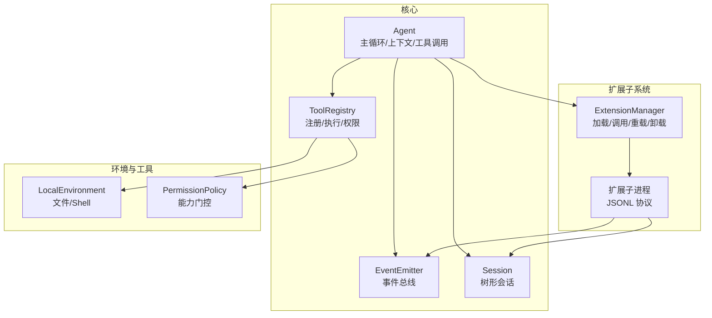
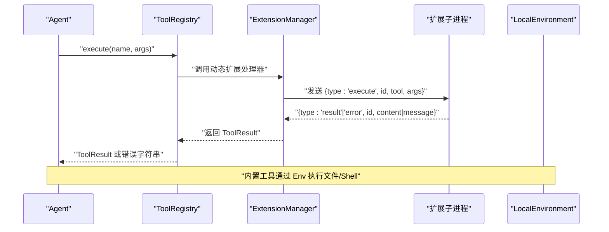
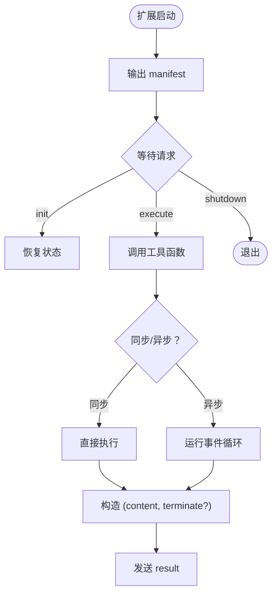
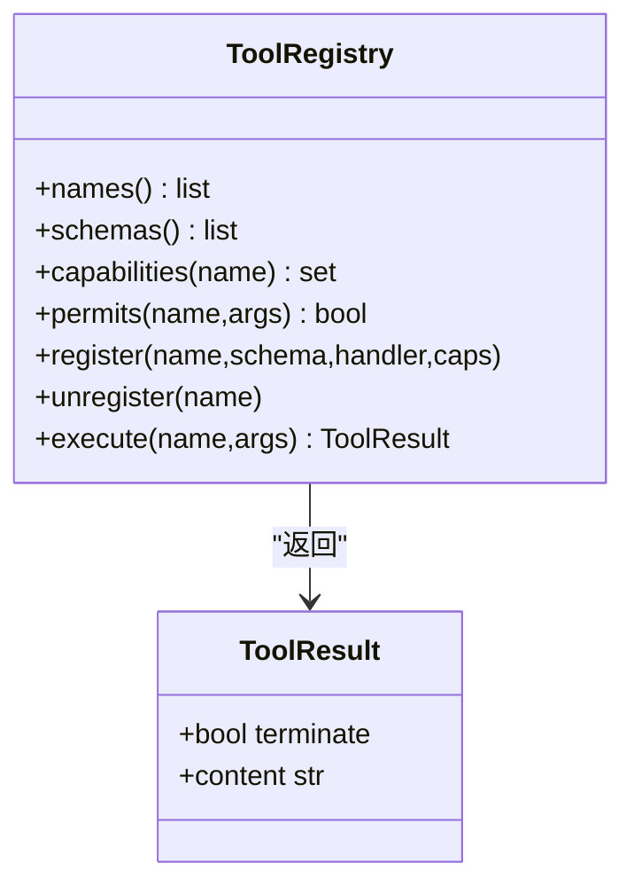
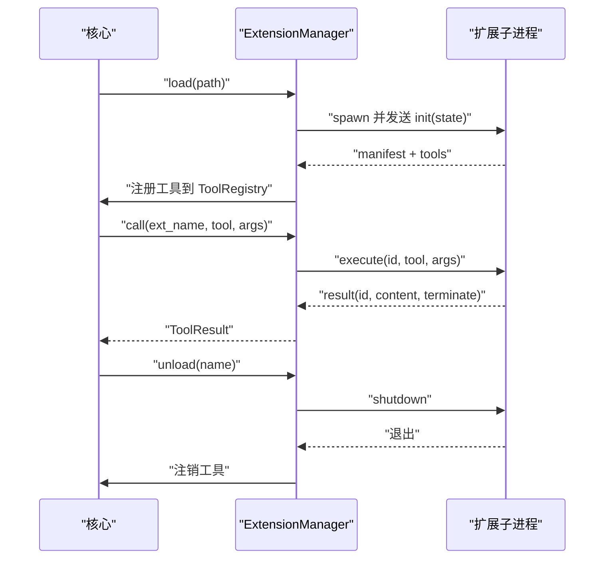
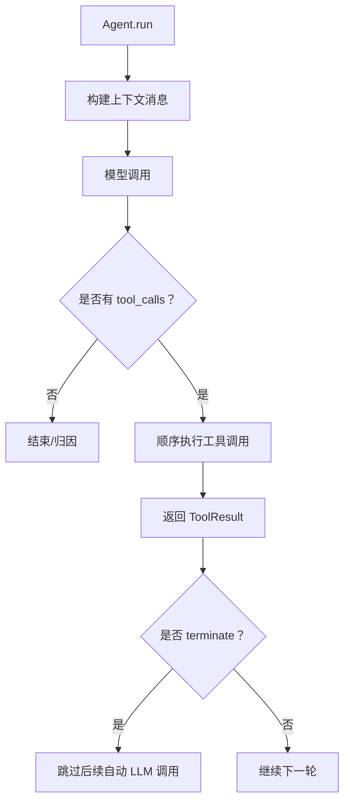
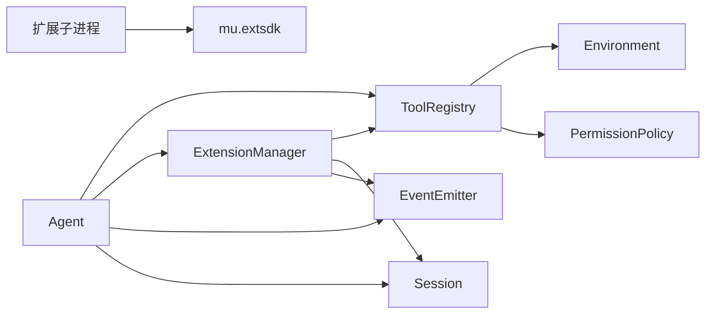

# 自定义工具开发

<cite>
**本文引用的文件列表**
- [README.md](file://README.md)
- [extensions/README.md](file://extensions/README.md)
- [extensions/example_textstats.py](file://extensions/example_textstats.py)
- [mu/extsdk.py](file://mu/extsdk.py)
- [mu/tools.py](file://mu/tools.py)
- [mu/extension.py](file://mu/extension.py)
- [mu/environment.py](file://mu/environment.py)
- [mu/session.py](file://mu/session.py)
- [mu/events.py](file://mu/events.py)
- [mu/permission.py](file://mu/permission.py)
- [mu/agent.py](file://mu/agent.py)
- [tests/test_extension.py](file://tests/test_extension.py)
</cite>

## 目录
1. [简介](#简介)
2. [项目结构](#项目结构)
3. [核心组件](#核心组件)
4. [架构总览](#架构总览)
5. [详细组件分析](#详细组件分析)
6. [依赖关系分析](#依赖关系分析)
7. [性能考量](#性能考量)
8. [故障排查指南](#故障排查指南)
9. [结论](#结论)
10. [附录](#附录)

## 简介
本指南面向希望为 μ (mu) 自定义工具的开发者，系统讲解扩展工具的开发流程、注册机制、集成方式与运行时交互。内容涵盖：
- 工具处理器签名、参数校验与错误处理模式
- 扩展 SDK 使用方法与 JSONL 协议
- 与环境（文件系统、Shell）的交互与资源管理
- 异步编程模式与生命周期管理
- 最佳实践、性能优化与安全注意事项
- 基于示例工具的二次开发模板

## 项目结构
μ 的扩展体系围绕“核心工具注册表 + 扩展子进程 + 事件流 + 会话持久化”构建。关键模块如下：
- 扩展 SDK：声明工具、状态持久化、日志输出、协议循环
- 工具注册表：内置四工具 + 动态扩展工具，统一处理器签名，权限门控
- 扩展管理器：加载/调用/重载/卸载扩展子进程，JSONL 通信
- 环境抽象：本地执行层（文件 IO、Shell）与可插拔沙箱
- 会话与事件：树形会话、事件总线、扩展日志/错误事件
- 权限策略：基于能力的门控，支持只读、工作区写入等策略
- Agent：主循环、上下文转换、工具调用与终止语义

图表来源
- [mu/agent.py:43-200](file://mu/agent.py#L43-L200)
- [mu/tools.py:191-269](file://mu/tools.py#L191-L269)
- [mu/extension.py:85-364](file://mu/extension.py#L85-L364)
- [mu/environment.py:23-150](file://mu/environment.py#L23-L150)
- [mu/events.py:121-133](file://mu/events.py#L121-L133)
- [mu/session.py:38-115](file://mu/session.py#L38-L115)
- [mu/permission.py:29-69](file://mu/permission.py#L29-L69)

章节来源
- [README.md:1-127](file://README.md#L1-L127)
- [extensions/README.md:1-58](file://extensions/README.md#L1-L58)

## 核心组件
- 扩展 SDK（mu.extsdk）
  - 工具装饰器：声明工具名称、描述、参数（OpenAI JSON Schema）、权限
  - 状态持久化：set_state/get_state，自动写入会话
  - 日志：log(level, message)，回流到事件流
  - 协议循环：run_extension，首行输出 manifest，随后处理 init/execute/shutdown
- 工具注册表（mu.tools）
  - 统一处理器签名：RegisteredHandler，内置工具绑定 LocalEnvironment
  - 动态注册/注销扩展工具，能力集合用于权限门控
  - 执行时错误转字符串，KeyError/异常捕获与统一返回
- 扩展管理器（mu.extension）
  - 子进程生命周期：spawn → 读 manifest → 注册工具 → 初始化状态 → reader 任务
  - JSONL 协议：core↔ext 的 init/execute/shutdown 与 result/error/log/state
  - 自动加载：ext_dir 下的扩展启动时自动加载
- 环境抽象（mu.environment）
  - 本地执行：文件读写、Shell 命令（新进程、进程组清理）
  - 可插拔沙箱：DockerEnvironment（仅 bash 容器化）
- 会话与事件（mu.session, mu.events）
  - 会话：树形结构、分支、线性历史、扩展状态持久化
  - 事件：扩展加载/卸载/日志/错误等结构化事件
- 权限策略（mu.permission）
  - 基于能力的门控：read/write/shell/code_exec/extension_exec
  - 支持 allow/readonly/workspace 策略

章节来源
- [mu/extsdk.py:1-130](file://mu/extsdk.py#L1-L130)
- [mu/tools.py:14-269](file://mu/tools.py#L14-L269)
- [mu/extension.py:85-364](file://mu/extension.py#L85-L364)
- [mu/environment.py:23-150](file://mu/environment.py#L23-L150)
- [mu/session.py:38-115](file://mu/session.py#L38-L115)
- [mu/events.py:121-133](file://mu/events.py#L121-L133)
- [mu/permission.py:29-69](file://mu/permission.py#L29-L69)

## 架构总览
扩展工具的运行时交互遵循“Agent → 工具注册表 → 扩展管理器 → 扩展子进程”的链路，扩展子进程通过 JSONL 协议与核心通信。

图表来源
- [mu/agent.py:134-163](file://mu/agent.py#L134-L163)
- [mu/tools.py:253-269](file://mu/tools.py#L253-L269)
- [mu/extension.py:251-272](file://mu/extension.py#L251-L272)
- [mu/environment.py:26-88](file://mu/environment.py#L26-L88)

## 详细组件分析

### 扩展 SDK 与工具声明
- 工具装饰器
  - 参数：name、description、parameters（OpenAI JSON Schema）、permissions
  - 返回：装饰器包装的函数，内部登记到全局工具表
- 状态持久化
  - set_state：整体替换扩展状态，并通过协议回写到会话
  - get_state：读取当前扩展状态（支持 --resume 恢复）
- 日志
  - log：输出扩展日志，事件流中可见
- 协议循环
  - run_extension：输出 manifest，进入请求循环，处理 init/execute/shutdown
  - execute：查找工具函数，执行并返回 result/error；支持同步/异步

图表来源
- [mu/extsdk.py:111-130](file://mu/extsdk.py#L111-L130)
- [mu/extsdk.py:86-110](file://mu/extsdk.py#L86-L110)

章节来源
- [mu/extsdk.py:34-130](file://mu/extsdk.py#L34-L130)
- [extensions/README.md:34-58](file://extensions/README.md#L34-L58)

### 工具注册表与处理器签名
- 统一处理器签名
  - 内置工具：ToolHandler，绑定 LocalEnvironment
  - 扩展工具：RegisteredHandler，统一为 (args) -> Awaitable[Any]
- 执行流程
  - 名称匹配 → 权限检查（基于能力）→ 调用处理器 → 错误捕获与字符串化 → 返回 ToolResult
- 能力与权限
  - 每个工具带能力集合（read/write/shell/code_exec/extension_exec）
  - 策略按能力 gate，支持 allow/readonly/workspace

图表来源
- [mu/tools.py:191-269](file://mu/tools.py#L191-L269)

章节来源
- [mu/tools.py:14-36](file://mu/tools.py#L14-L36)
- [mu/tools.py:221-269](file://mu/tools.py#L221-L269)
- [mu/permission.py:17-69](file://mu/permission.py#L17-L69)

### 扩展管理器与生命周期
- 生命周期
  - load：spawn 子进程 → 读 manifest → 注册工具 → 初始化 reader 任务 → 发送 init（携带会话状态）
  - call：生成唯一 id → 发 execute → 等待 result/error → 超时/崩溃快速降级
  - unload：注销工具 → 发 shutdown → 等待退出或 SIGKILL → 取消 reader 任务
  - autoload：启动时扫描 ext_dir 下的扩展文件自动加载
- 协议与事件
  - JSONL：init/execute/shutdown（core→ext），result/error/log/state（ext→core）
  - 事件：ExtensionLoaded/Unloaded/Log/Error，回流到事件流

图表来源
- [mu/extension.py:131-234](file://mu/extension.py#L131-L234)
- [mu/extension.py:251-317](file://mu/extension.py#L251-L317)

章节来源
- [mu/extension.py:85-364](file://mu/extension.py#L85-L364)
- [tests/test_extension.py:68-134](file://tests/test_extension.py#L68-L134)

### 与环境的交互与资源管理
- 文件系统
  - 本地读写：异步线程池封装，支持偏移/限制行数读取
  - 写入自动创建父目录
- Shell 命令
  - 新进程执行，进程组隔离，超时整组清理（SIGKILL）
  - DockerEnvironment：仅 bash 容器化，文件 IO 仍宿主
- Agent 主循环
  - 顺序执行工具调用，支持流式输出与取消
  - 工具结果带 terminate 标志，控制是否跳过后续自动 LLM 调用

图表来源
- [mu/agent.py:82-163](file://mu/agent.py#L82-L163)
- [mu/environment.py:26-88](file://mu/environment.py#L26-L88)

章节来源
- [mu/environment.py:23-150](file://mu/environment.py#L23-L150)
- [mu/agent.py:134-163](file://mu/agent.py#L134-L163)

### 开发示例：从简单到复杂
- 示例工具（文本统计）
  - 工具：word_count、reverse_text、set_prefix、greet
  - 特性：参数校验（required）、状态持久化（set_state/get_state）、日志输出（log）
  - 运行：作为独立脚本运行，输出 manifest，等待 core 调用
- 二次开发模板
  - 基于示例文件，新增工具函数，使用 @tool 装饰器声明
  - 将扩展文件放入扩展目录（或通过管理工具加载）
  - 使用扩展状态持久化保存配置，利用日志事件辅助调试

章节来源
- [extensions/example_textstats.py:1-67](file://extensions/example_textstats.py#L1-L67)
- [extensions/README.md:9-32](file://extensions/README.md#L9-L32)

## 依赖关系分析
- 组件耦合
  - Agent 依赖 ToolRegistry、ExtensionManager、EventEmitter、Session
  - ToolRegistry 依赖 Environment、PermissionPolicy
  - ExtensionManager 依赖 ToolRegistry、Session、EventEmitter
  - 扩展子进程依赖 SDK（装饰器、状态、日志、协议循环）
- 外部依赖
  - 事件流：结构化事件，多订阅者消费
  - 会话：JSONL 持久化，支持分支与摘要
  - 权限：基于能力的策略，支持只读/工作区写入

图表来源
- [mu/agent.py:43-75](file://mu/agent.py#L43-L75)
- [mu/tools.py:11-12](file://mu/tools.py#L11-L12)
- [mu/extension.py:86-103](file://mu/extension.py#L86-L103)
- [mu/extsdk.py:30-32](file://mu/extsdk.py#L30-L32)

章节来源
- [mu/agent.py:43-75](file://mu/agent.py#L43-L75)
- [mu/tools.py:11-12](file://mu/tools.py#L11-L12)
- [mu/extension.py:86-103](file://mu/extension.py#L86-L103)
- [mu/extsdk.py:30-32](file://mu/extsdk.py#L30-L32)

## 性能考量
- 异步优先
  - 文件读写与 Shell 命令均在事件循环外执行，避免阻塞
  - 扩展调用设置超时，崩溃时快速降级，避免长时间挂起
- 资源管理
  - Shell 命令采用进程组隔离，超时整组清理
  - 扩展子进程退出时统一注销工具，防止残留
- 会话与事件
  - 事件流同步分发，订阅者仅做轻量工作
  - 会话 append-only，便于复现与归因

章节来源
- [mu/environment.py:26-88](file://mu/environment.py#L26-L88)
- [mu/extension.py:301-317](file://mu/extension.py#L301-L317)
- [mu/events.py:121-133](file://mu/events.py#L121-L133)
- [mu/session.py:49-73](file://mu/session.py#L49-L73)

## 故障排查指南
- 工具调用失败
  - 检查工具名称是否正确、参数是否满足 JSON Schema
  - 查看 ToolRegistry.execute 的错误字符串与事件流中的 ExtensionError
- 权限拒绝
  - 确认工具能力集合与当前策略是否匹配
  - readonly/workspace 策略会拦截 write/shell/code/exec 扩展加载
- 扩展崩溃或超时
  - 观察 ExtensionError 事件与 ToolResult 中的错误信息
  - 扩展崩溃时会快速降级并注销工具，确认扩展逻辑与依赖
- 状态未恢复
  - 确认扩展状态通过 set_state 持久化，会话恢复时自动注入
  - 检查扩展名称与会话中的 ext_state 记录

章节来源
- [mu/tools.py:253-269](file://mu/tools.py#L253-L269)
- [mu/extension.py:282-317](file://mu/extension.py#L282-L317)
- [tests/test_extension.py:122-134](file://tests/test_extension.py#L122-L134)
- [mu/events.py:105-116](file://mu/events.py#L105-L116)

## 结论
μ 的扩展体系以“子进程 + JSONL 协议 + 事件流 + 会话持久化”为核心，提供了灵活、可观测且可扩展的工具生态。开发者可通过扩展 SDK 快速声明工具、管理状态与日志，并在统一的权限策略与能力门控下安全地扩展 Agent 的能力。建议在开发中遵循参数校验、错误字符串化、状态持久化与日志回流的最佳实践，结合只读/工作区策略提升安全性。

## 附录

### 开发流程与最佳实践
- 声明工具
  - 使用 @tool 装饰器，提供清晰的 description 与 OpenAI JSON Schema 的 parameters
  - 为工具指定必要的 permissions，以便策略门控
- 参数验证与错误处理
  - 在工具函数内部进行业务参数校验，必要时抛出异常，由 ToolRegistry 统一转为错误字符串
  - 对缺失必填参数的情况，确保返回明确的错误信息
- 状态持久化
  - 使用 set_state 保存配置，get_state 读取状态，支持 --resume 恢复
  - 避免在扩展中直接依赖外部状态，尽量通过会话持久化
- 日志与可观测性
  - 使用 log 输出扩展内部状态与调试信息，便于事件流追踪
  - 避免使用 print，stdout 为协议通道
- 安全与权限
  - 选择合适的权限策略（allow/readonly/workspace），避免不必要的能力暴露
  - 扩展以与 Agent 同等权限运行，谨慎加载不受信任的扩展
- 性能与资源
  - 将阻塞操作（文件/Shell）交由环境层异步执行
  - 合理设置 Shell 命令超时，避免长时间占用
  - 扩展崩溃时快速降级，减少对主循环的影响

章节来源
- [extensions/README.md:34-58](file://extensions/README.md#L34-L58)
- [mu/extsdk.py:34-130](file://mu/extsdk.py#L34-L130)
- [mu/tools.py:253-269](file://mu/tools.py#L253-L269)
- [mu/permission.py:29-69](file://mu/permission.py#L29-L69)