# 开发指南

<cite>
**本文引用的文件**
- [README.md](file://README.md)
- [pyproject.toml](file://pyproject.toml)
- [mu/__init__.py](file://mu/__init__.py)
- [mu/__main__.py](file://mu/__main__.py)
- [mu/cli.py](file://mu/cli.py)
- [mu/agent.py](file://mu/agent.py)
- [mu/model.py](file://mu/model.py)
- [mu/tools.py](file://mu/tools.py)
- [mu/environment.py](file://mu/environment.py)
- [mu/session.py](file://mu/session.py)
- [mu/events.py](file://mu/events.py)
- [mu/context.py](file://mu/context.py)
- [mu/permission.py](file://mu/permission.py)
- [mu/tui.py](file://mu/tui.py)
- [plan/M0-Walking-Skeleton-plan.md](file://plan/M0-Walking-Skeleton-plan.md)
</cite>

## 目录
1. [简介](#简介)
2. [项目结构](#项目结构)
3. [核心组件](#核心组件)
4. [架构总览](#架构总览)
5. [详细组件分析](#详细组件分析)
6. [依赖分析](#依赖分析)
7. [性能考量](#性能考量)
8. [故障排查指南](#故障排查指南)
9. [结论](#结论)
10. [附录](#附录)

## 简介
本指南面向 μ (mu) 项目的开发者，围绕开发环境搭建、依赖与配置、开发流程、代码规范与贡献、功能开发最佳实践、版本与发布、演进方向以及性能与安全建议进行系统化说明。μ 是一个“极简 Pi 风格”的异步编码智能体，采用“薄 async loop + 四工具（read/write/edit/bash）+ 原生 function-calling + OpenAI 兼容模型后端”，并逐步引入事件流、上下文管线、树形会话、可观测归因、TUI、自延伸扩展、原生 code-action 与可插拔权限/沙箱层，最终形成 M4.0 的评估与 DGM-lite 基座。

## 项目结构
- 顶层入口与配置
  - README.md：安装、配置、运行、TUI、扩展、Code-action 与权限/沙箱、评估与 DGM-lite 使用说明。
  - pyproject.toml：PEP621 元数据、运行时依赖 openai、可选依赖 textual（TUI）、pytest（测试）、脚本入口 mu。
- 核心包 mu/
  - 入口导出：__init__.py 汇总对外 API。
  - CLI：cli.py 解析参数、装配事件订阅者、构建会话与环境、调度 Agent。
  - Agent：agent.py 实现异步 while 循环、事件发射、工具调用、分支总结、收尾清理。
  - Model：model.py 封装 AsyncOpenAI，支持流式与非流式，返回 ModelResult 用于归因。
  - Tools：tools.py 定义四工具 read/write/edit/bash 的 schema 与执行器，统一 ToolResult。
  - Environment：environment.py 定义 Environment 协议与 LocalEnvironment 默认实现，DockerEnvironment 实验性沙箱。
  - Session：session.py 实现树形会话、JSONL 持久化、分支与摘要。
  - Events：events.py 定义事件模型与 EventEmitter。
  - Context：context.py 上下文变换与 LLM 消息转换钩子。
  - Permission：permission.py 基于 capability 的权限策略。
  - TUI：tui.py Textual 前端，复用事件流与 Agent。
  - 其他模块：codeact.py、eval.py、dgm.py、extension.py、extsdk.py、observability.py、prompts.py、render.py、tools.py、tui.py 等，共同构成 M3/M3.5/M4.0 能力。
- 计划与测试
  - plan/M0-Walking-Skeleton-plan.md：M0 落地计划与任务顺序。
  - tests/：pytest 测试套件，覆盖工具、Agent 循环、事件、权限、会话、TUI、扩展、可观测等。

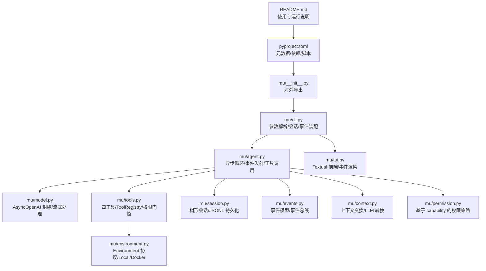

**图表来源**
- [README.md:1-127](file://README.md#L1-L127)
- [pyproject.toml:1-32](file://pyproject.toml#L1-L32)
- [mu/__init__.py:1-33](file://mu/__init__.py#L1-L33)
- [mu/cli.py:1-134](file://mu/cli.py#L1-L134)
- [mu/agent.py:1-223](file://mu/agent.py#L1-L223)
- [mu/model.py:1-147](file://mu/model.py#L1-L147)
- [mu/tools.py:1-269](file://mu/tools.py#L1-L269)
- [mu/environment.py:1-150](file://mu/environment.py#L1-L150)
- [mu/session.py:1-115](file://mu/session.py#L1-L115)
- [mu/events.py:1-133](file://mu/events.py#L1-L133)
- [mu/context.py:1-31](file://mu/context.py#L1-L31)
- [mu/permission.py:1-69](file://mu/permission.py#L1-L69)
- [mu/tui.py:1-203](file://mu/tui.py#L1-L203)

**章节来源**
- [README.md:1-127](file://README.md#L1-L127)
- [pyproject.toml:1-32](file://pyproject.toml#L1-L32)

## 核心组件
- CLI 与入口
  - 入口：__main__.py 调用 cli.main()。
  - 参数：task、--resume/--branch、--stream、--tui、--code、--permission、--sandbox。
  - 事件装配：StdoutRenderer 与 AttributionCollector 订阅 EventEmitter。
  - 会话：Session 或 Session.load，支持续跑与分支。
  - 环境与策略：make_environment、make_policy。
- Agent
  - 初始化：注入 Model、ToolRegistry、EventEmitter、Session、可选 CodeAction、ExtensionManager。
  - 运行：构建系统提示与用户任务，上下文变换与转换，调用模型，顺序执行工具，事件发射，Turn/Run 生命周期管理。
  - 分支总结：summarize_branch 将侧分支结论带回主线。
  - 清理：aclose 关闭扩展子进程。
- Model
  - 配置：MU_MODEL、MU_BASE_URL、MU_API_KEY 或 OPENAI_API_KEY。
  - 调用：acomplete 支持流式与非流式，返回 ModelResult（latency/token usage）。
- Tools
  - 四工具：read、write、edit、bash，统一返回 ToolResult（可携带 terminate）。
  - 注册表：ToolRegistry，支持动态注册/注销扩展工具，按能力 gate。
- Environment
  - 协议：Environment，LocalEnvironment 默认实现，DockerEnvironment 实验性沙箱（仅 bash 容器化）。
- Session
  - 树形结构：Node(id, parent_id, ts, msg)，append-only JSONL 持久化。
  - 分支：branch_from、add_branch_summary、path_to/path_to_head。
- Events
  - 事件模型：RunStarted/TurnStarted/ModelCallStarted/AssistantText/ToolCallFinished/RunFinished/RunAborted 等。
  - EventEmitter：同步订阅分发。
- Context
  - transform_context：上下文变换钩子（默认 identity）。
  - convert_to_llm：将内部消息转换为 OpenAI 格式，注入 branch_summary。
- Permission
  - 策略：allow_all、read_only、workspace_write，基于 capability 判断。
- TUI
  - MuApp：Textual 应用，事件渲染器 TuiRenderer，支持取消与状态展示。

**章节来源**
- [mu/__main__.py:1-5](file://mu/__main__.py#L1-L5)
- [mu/cli.py:1-134](file://mu/cli.py#L1-L134)
- [mu/agent.py:1-223](file://mu/agent.py#L1-L223)
- [mu/model.py:1-147](file://mu/model.py#L1-L147)
- [mu/tools.py:1-269](file://mu/tools.py#L1-L269)
- [mu/environment.py:1-150](file://mu/environment.py#L1-L150)
- [mu/session.py:1-115](file://mu/session.py#L1-L115)
- [mu/events.py:1-133](file://mu/events.py#L1-L133)
- [mu/context.py:1-31](file://mu/context.py#L1-L31)
- [mu/permission.py:1-69](file://mu/permission.py#L1-L69)
- [mu/tui.py:1-203](file://mu/tui.py#L1-L203)

## 架构总览
μ 的核心是“事件驱动的异步 Agent 循环”。CLI 负责参数解析与会话装配，Agent 负责循环控制与事件发射，Model 负责与 LLM 交互，Tools 负责能力执行并通过 ToolRegistry 门控，Environment 提供执行环境抽象，Session 负责树形历史与持久化，Events 提供统一事件总线，Context 提供上下文变换，Permission 提供基于 capability 的策略，TUI 复用事件流提供交互式体验。

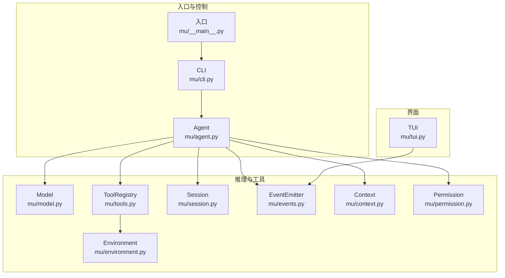

**图表来源**
- [mu/cli.py:1-134](file://mu/cli.py#L1-L134)
- [mu/agent.py:1-223](file://mu/agent.py#L1-L223)
- [mu/model.py:1-147](file://mu/model.py#L1-L147)
- [mu/tools.py:1-269](file://mu/tools.py#L1-L269)
- [mu/environment.py:1-150](file://mu/environment.py#L1-L150)
- [mu/session.py:1-115](file://mu/session.py#L1-L115)
- [mu/events.py:1-133](file://mu/events.py#L1-L133)
- [mu/context.py:1-31](file://mu/context.py#L1-L31)
- [mu/permission.py:1-69](file://mu/permission.py#L1-L69)
- [mu/tui.py:1-203](file://mu/tui.py#L1-L203)

## 详细组件分析

### CLI 与会话装配
- 功能要点
  - 解析任务来源：命令行参数优先，否则从 stdin 读取。
  - 会话：支持 --resume 与 --branch；Session.load 或新建 Session。
  - 事件：StdoutRenderer 与 AttributionCollector 订阅。
  - 环境与策略：make_environment/ns.sandbox、make_policy/ns.permission。
  - TUI：预检配置，失败提示安装 textual；MuApp.run 启动交互。
- 错误处理
  - ConfigError：配置缺失（MU_MODEL/MU_API_KEY/OPENAI_API_KEY）。
  - Session 加载异常：FileNotFoundError/KeyError。
  - KeyboardInterrupt：优雅返回码 130。

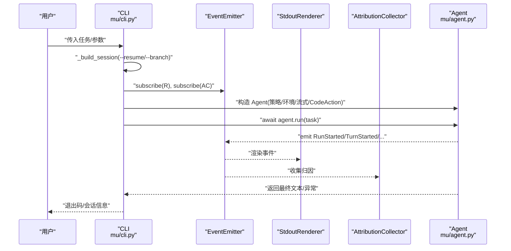

**图表来源**
- [mu/cli.py:51-134](file://mu/cli.py#L51-L134)
- [mu/agent.py:82-133](file://mu/agent.py#L82-L133)
- [mu/events.py:121-133](file://mu/events.py#L121-L133)

**章节来源**
- [mu/cli.py:1-134](file://mu/cli.py#L1-L134)

### Agent 循环与事件发射
- 运行流程
  - 注入系统提示（首次运行）与用户任务。
  - 上下文变换与转换：transform_context → convert_to_llm。
  - 调用模型：acomplete，支持流式 on_delta。
  - 工具调用：顺序执行，事件发射 ToolCallStarted/Finished，记录 terminate。
  - 终止条件：assistant 无 tool_calls；或全部工具返回 terminate。
  - 取消：CancelledError 时发射 RunAborted 并抛出。
- 分支总结
  - summarize_branch 将侧分支摘要注入主线，返回新节点 id。

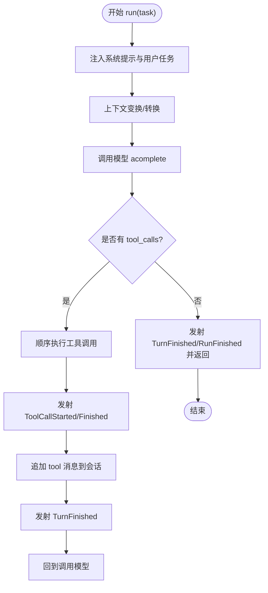

**图表来源**
- [mu/agent.py:82-163](file://mu/agent.py#L82-L163)
- [mu/model.py:112-146](file://mu/model.py#L112-L146)
- [mu/events.py:18-84](file://mu/events.py#L18-L84)

**章节来源**
- [mu/agent.py:1-223](file://mu/agent.py#L1-L223)

### Model 与流式处理
- 配置检查：MU_MODEL、MU_API_KEY/OPENAI_API_KEY 缺失抛出 ConfigError。
- 非流式：直接调用 chat.completions.create，提取 usage。
- 流式：consume_stream 累积 content 与 tool_calls，逐块回调 on_delta。
- 返回：ModelResult 包含 message、tokens、latency。

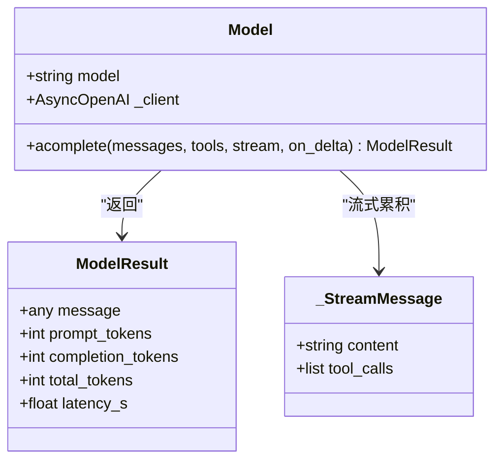

**图表来源**
- [mu/model.py:91-146](file://mu/model.py#L91-L146)

**章节来源**
- [mu/model.py:1-147](file://mu/model.py#L1-L147)

### Tools 与权限门控
- 四工具
  - read：支持 offset/limit，错误转字符串。
  - write：创建/覆盖文件，返回写入统计。
  - edit：精确唯一替换，错误转字符串。
  - bash：超时控制，返回 stdout/stderr/exit_code。
- 注册表
  - schemas/names/capabilities：统一暴露。
  - permits：基于 capability gate。
  - register/unregister：动态扩展工具，内置工具不可注销。
- ToolResult
  - 字符串兼容，支持 terminate 标志。

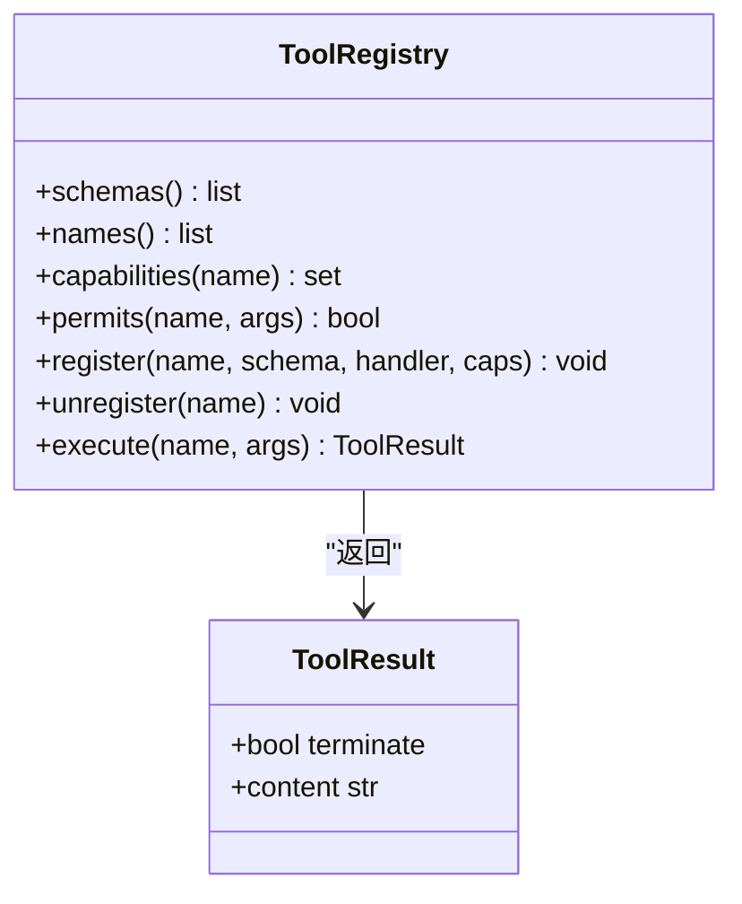

**图表来源**
- [mu/tools.py:191-269](file://mu/tools.py#L191-L269)

**章节来源**
- [mu/tools.py:1-269](file://mu/tools.py#L1-L269)

### Environment 与沙箱
- Environment 协议：run_bash/read_file/write_file。
- LocalEnvironment：每次 bash 新进程，to_thread 文件 IO。
- DockerEnvironment：实验性，仅将 bash 放入容器（--network none），文件工具仍宿主 IO。
- make_environment：根据 kind 返回具体实现。

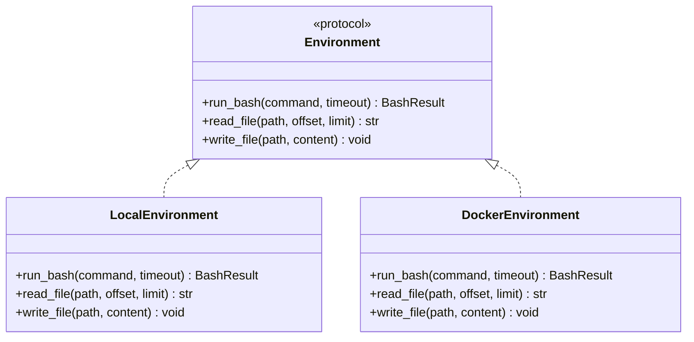

**图表来源**
- [mu/environment.py:90-150](file://mu/environment.py#L90-L150)

**章节来源**
- [mu/environment.py:1-150](file://mu/environment.py#L1-L150)

### Session 与树形历史
- Node：id/parent_id/ts/msg。
- append：追加节点并持久化。
- path_to/path_to_head：从任意节点回溯到根，生成当前分支线性历史。
- branch_from/add_branch_summary：分支与摘要注入。
- load：从 JSONL 恢复会话。

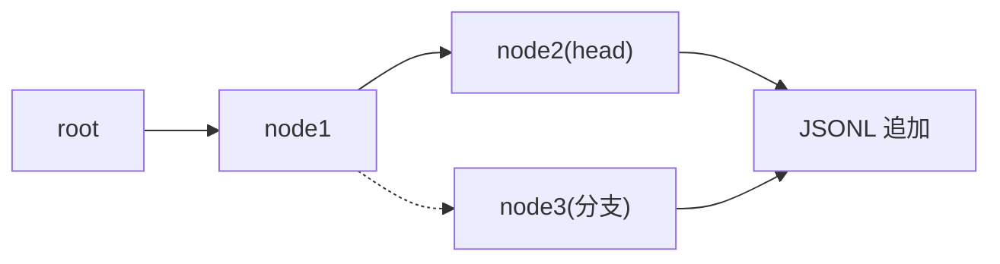

**图表来源**
- [mu/session.py:38-115](file://mu/session.py#L38-L115)

**章节来源**
- [mu/session.py:1-115](file://mu/session.py#L1-L115)

### 事件流与可观测
- 事件模型：RunStarted/TurnStarted/ModelCallStarted/AssistantText/ToolCallFinished/RunFinished/RunAborted 等。
- EventEmitter：同步订阅分发，避免引入外部 pub/sub 框架。
- StdoutRenderer：将事件渲染到 stdout。
- AttributionCollector：收集归因（轮数、LLM/工具耗时、token）。

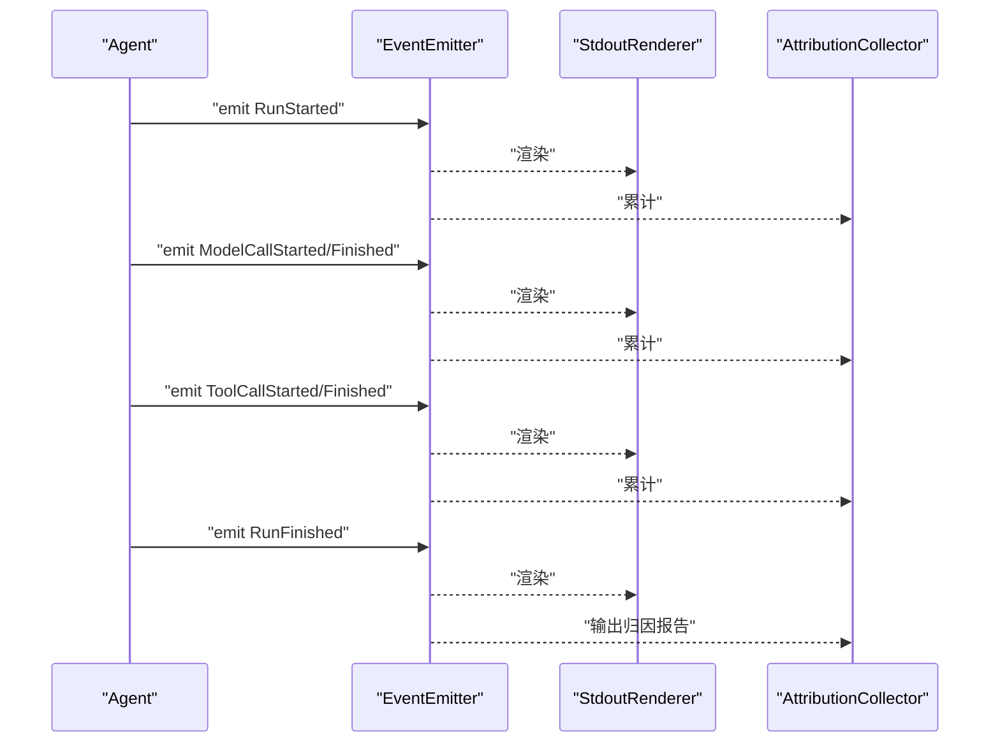

**图表来源**
- [mu/events.py:121-133](file://mu/events.py#L121-L133)
- [mu/agent.py:96-129](file://mu/agent.py#L96-L129)

**章节来源**
- [mu/events.py:1-133](file://mu/events.py#L1-L133)

### 权限策略与能力门控
- 能力常量：WRITE、SHELL、CODE_EXEC、EXTENSION_EXEC。
- 策略：
  - allow_all：默认放行。
  - read_only：阻止 WRITE/SHELL/CODE_EXEC/EXTENSION_EXEC。
  - workspace_write：限制写入在工作区范围内，无法约束 bash/code/扩展加载。
- 门控：ToolRegistry.execute 前先 permits(name,args,caps)。

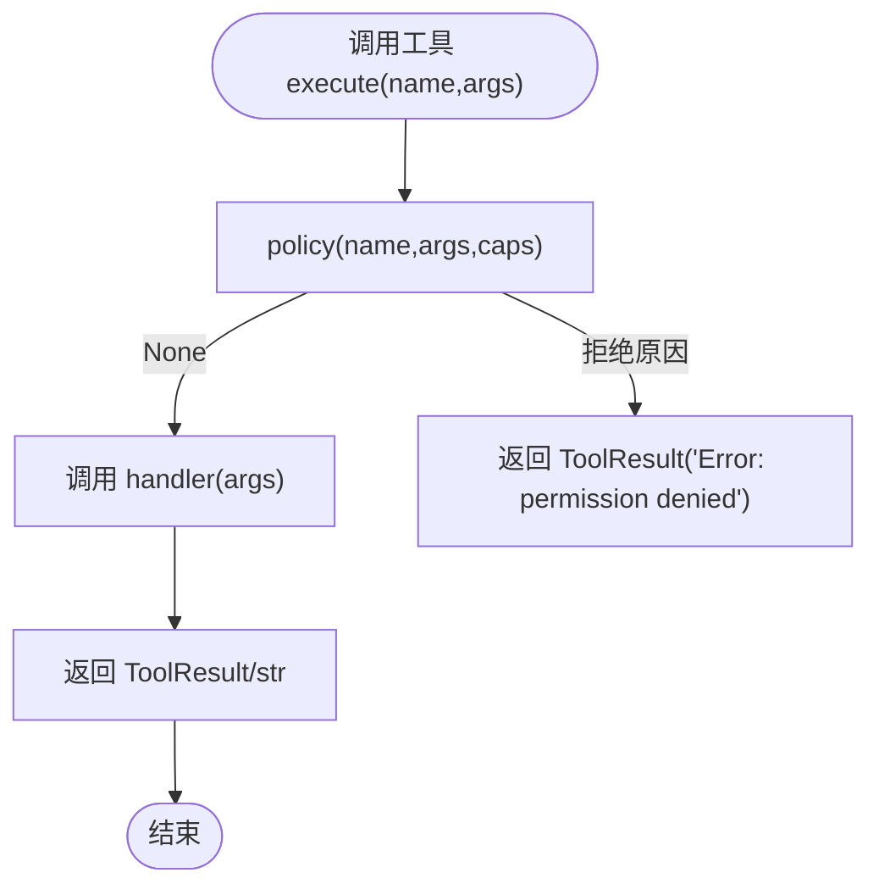

**图表来源**
- [mu/permission.py:29-68](file://mu/permission.py#L29-L68)
- [mu/tools.py:253-269](file://mu/tools.py#L253-L269)

**章节来源**
- [mu/permission.py:1-69](file://mu/permission.py#L1-L69)
- [mu/tools.py:191-269](file://mu/tools.py#L191-L269)

### TUI 与交互
- MuApp：Textual 应用，Header/Footer/Input/RichLog/Static。
- TuiRenderer：事件渲染到 RichLog 与 live Static，维护归因统计。
- 交互：回车提交任务，Esc 取消运行，Ctrl+Q 退出。
- Worker：异步运行 agent.run，异常捕获渲染。

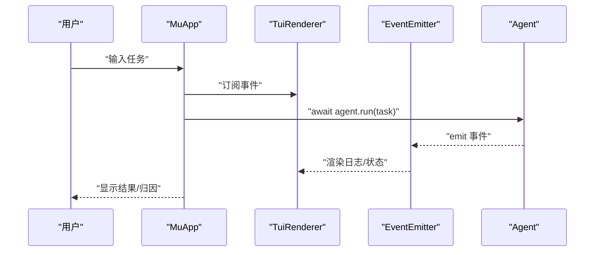

**图表来源**
- [mu/tui.py:122-203](file://mu/tui.py#L122-L203)

**章节来源**
- [mu/tui.py:1-203](file://mu/tui.py#L1-L203)

## 依赖分析
- 运行时依赖
  - openai>=1.40：官方异步 SDK，用于与 OpenAI 兼容端点通信。
- 可选依赖
  - textual>=0.80：TUI 交互界面。
  - pytest>=8、pytest-asyncio>=0.23：测试框架与异步模式。
- 元数据
  - requires-python>=3.12。
  - scripts.mu 指向 mu.cli:main。
  - 包发现 include = ["mu*"]。
  - pytest 配置：asyncio_mode="auto"，testpaths=["tests"]。

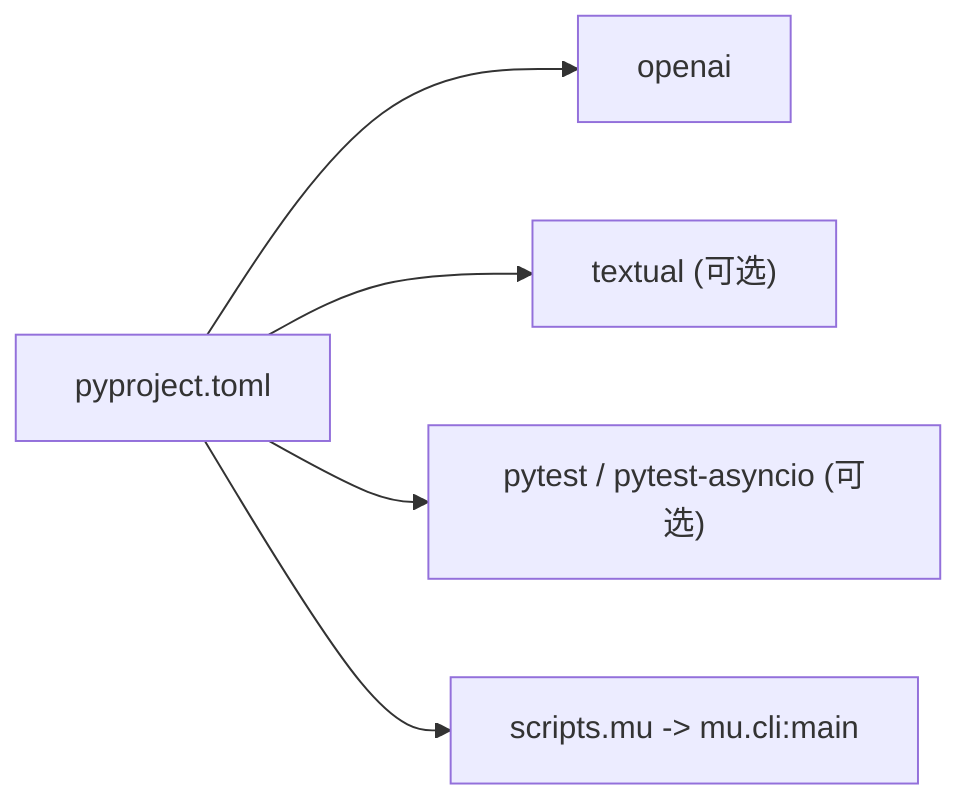

**图表来源**
- [pyproject.toml:1-32](file://pyproject.toml#L1-L32)

**章节来源**
- [pyproject.toml:1-32](file://pyproject.toml#L1-L32)

## 性能考量
- 并发与阻塞
  - bash 使用 asyncio.create_subprocess_shell + start_new_session，超时通过进程组 SIGKILL 清理，避免孤儿进程。
  - 文件读写通过 asyncio.to_thread，避免阻塞事件循环。
- 流式输出
  - Model.consume_stream 累积增量文本与 tool_calls，on_delta 回调实时渲染，降低首屏延迟。
- 事件分发
  - EventEmitter 同步分发，避免引入外部 pub/sub 框架带来的额外开销。
- 会话持久化
  - JSONL 追加写入，适合 append-only 场景，减少随机 IO。
- 优化建议
  - 工具并行：在不破坏会话一致性前提下，可考虑批内工具并行（需谨慎）。
  - 上下文压缩：在 convert_to_llm 中加入裁剪/摘要策略，减少 token 消耗。
  - 缓存：对 read/write 的热点文件可增加缓存层（注意一致性）。
  - 超时与资源限制：为 bash 设置更细粒度的 CPU/内存限制（结合沙箱）。

[本节为通用指导，不直接分析具体文件]

## 故障排查指南
- 配置问题
  - 症状：启动时报 ConfigError，提示 MU_MODEL/MU_API_KEY 未设置。
  - 排查：确认 .env 或环境变量已正确导出；或使用 OPENAI_API_KEY。
  - 参考：[mu/model.py:19-110](file://mu/model.py#L19-L110)
- 会话加载失败
  - 症状：Session.load 抛出 FileNotFoundError/KeyError。
  - 排查：检查 session_id 是否存在，JSONL 文件是否损坏。
  - 参考：[mu/session.py:99-115](file://mu/session.py#L99-L115)
- TUI 依赖缺失
  - 症状：导入 MuApp 报 ImportError，提示需要 textual。
  - 排查：安装可选依赖 pip install -e ".[tui]"。
  - 参考：[mu/cli.py:100-103](file://mu/cli.py#L100-L103)
- 工具权限被拒
  - 症状：ToolResult 返回 permission denied。
  - 排查：检查 --permission 策略与工具 capability，必要时改为 allow 或 workspace。
  - 参考：[mu/permission.py:29-68](file://mu/permission.py#L29-L68)，[mu/tools.py:253-269](file://mu/tools.py#L253-L269)
- 取消与中断
  - 症状：Ctrl+C 后出现 RunAborted。
  - 排查：CancelledError 会触发 RunAborted，确保会话中 tool_call 的 pending 结果已补写。
  - 参考：[mu/agent.py:130-133](file://mu/agent.py#L130-L133)，[mu/agent.py:165-173](file://mu/agent.py#L165-L173)

**章节来源**
- [mu/model.py:19-110](file://mu/model.py#L19-L110)
- [mu/session.py:99-115](file://mu/session.py#L99-L115)
- [mu/cli.py:100-103](file://mu/cli.py#L100-L103)
- [mu/permission.py:29-68](file://mu/permission.py#L29-L68)
- [mu/tools.py:253-269](file://mu/tools.py#L253-L269)
- [mu/agent.py:130-173](file://mu/agent.py#L130-L173)

## 结论
μ 项目以“极简 Pi 风格”为核心，通过事件驱动的异步 Agent 循环，结合原生 function-calling、OpenAI 兼容模型、四工具与可插拔环境/权限策略，逐步演进至 M4.0 的评估与 DGM-lite 基座。开发过程中应遵循 async-first、事件驱动、能力门控与可插拔架构原则，确保在保持简洁的同时具备可观测、可扩展与可评估能力。

[本节为总结，不直接分析具体文件]

## 附录

### 开发环境搭建与配置
- Python 版本：>=3.12
- 安装
  - 基础：pip install -e ".[dev]"
  - 含 TUI：pip install -e ".[tui,dev]"
- 配置
  - 方式 A：直接 export MU_BASE_URL/MU_MODEL/MU_API_KEY
  - 方式 B：复制 .env.example 并 source .env
  - 支持端点：百炼、DeepSeek、OpenAI（参考 README）

**章节来源**
- [README.md:13-41](file://README.md#L13-L41)
- [pyproject.toml:9,14-21](file://pyproject.toml#L9,L14-L21)

### 代码规范与贡献
- 语言与风格
  - Python >=3.12，使用 __future__ annotations。
  - 类型注解与 dataclass。
- 模块职责
  - 保持单一职责，事件、工具、环境、会话、权限各司其职。
  - 通过协议（如 Environment）实现可插拔。
- 测试
  - pytest + pytest-asyncio，asyncio_mode="auto"。
  - 覆盖工具、Agent 循环、事件、权限、会话、TUI、扩展、可观测等。
- 提交与评审
  - 遵循项目计划（如 M0 Walking Skeleton）与 Roadmap 范围，避免功能蔓延。

**章节来源**
- [pyproject.toml:29-31](file://pyproject.toml#L29-L31)
- [plan/M0-Walking-Skeleton-plan.md:1-91](file://plan/M0-Walking-Skeleton-plan.md#L1-L91)

### 功能开发最佳实践
- 模块设计
  - 以协议抽象环境与策略，便于替换与扩展。
  - 事件驱动，避免紧耦合。
- 接口定义
  - 工具统一返回 ToolResult，错误转字符串，便于模型自纠错。
  - Model 返回 ModelResult，承载 latency 与 token 信息。
- 测试策略
  - 无网测试：使用 FakeModel 驱动 Agent 循环。
  - 异步测试：pytest-asyncio，覆盖 cancel、timeout、权限拒绝等场景。
  - UI 测试：TUI 通过事件渲染验证，关注取消与状态展示。

**章节来源**
- [mu/tools.py:19-36](file://mu/tools.py#L19-L36)
- [mu/model.py:23-30](file://mu/model.py#L23-L30)
- [mu/tui.py:64-120](file://mu/tui.py#L64-L120)

### 版本管理、发布与兼容
- 版本
  - 当前版本号在 __version__（参考 __init__.py）。
- 发布
  - 使用 setuptools 构建系统，遵循 PEP621。
- 向后兼容
  - Model 保持异步薄封装，可替换 Provider（M1+ 可引入 litellm）。
  - 事件与上下文转换钩子保留，避免破坏上层集成。

**章节来源**
- [mu/__init__.py:32](file://mu/__init__.py#L32)
- [pyproject.toml:1-4](file://pyproject.toml#L1-L4)

### 演进计划与未来方向
- 已完成功能
  - M0：薄 async loop + 四工具 + 线性历史 + 纯 stdout。
  - M1：事件流、上下文管线、tree session、可选流式/abort/terminate、延迟-成本归因。
  - M2：Textual 终端界面。
  - M3：自延伸扩展（子进程隔离 + JSONL 协议）。
  - M3.5：native code-action + 可插拔权限/沙箱层。
  - M4.0：库内 eval runner、候选隔离验证与 archive。
- v2 后续
  - 程序性记忆、meta-tool 编译、投机/异步执行、自动应用通过候选。
  - 不做：受限解释器、E2B/Modal 具体实现、Web UI/textual serve、完整 compaction、$ 精确计费、并行工具、多 provider 切换。

**章节来源**
- [README.md:5-127](file://README.md#L5-L127)

### 性能优化与安全加固建议
- 性能
  - 使用流式响应与增量渲染，降低感知延迟。
  - 文件 IO 线程化，bash 超时与进程组清理。
  - 事件总线同步分发，避免额外中间件。
- 安全
  - M3 子进程仅做崩溃隔离，扩展以 agent 同等权限运行。
  - M3.5：readonly/workspace 策略与沙箱（local/docker）可选，默认关闭。
  - 建议：将 μ 跑入容器，或实现更严格的 E2B/Modal 环境。

**章节来源**
- [README.md:82-96](file://README.md#L82-L96)
- [mu/environment.py:99-137](file://mu/environment.py#L99-L137)