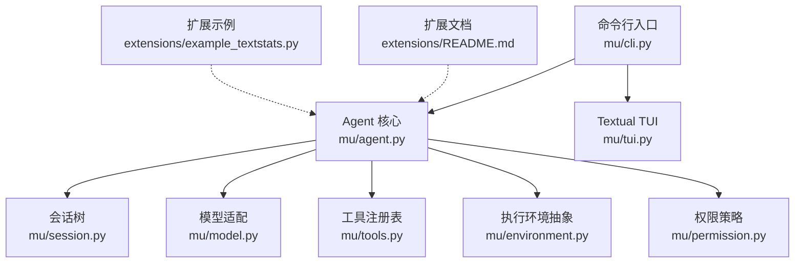
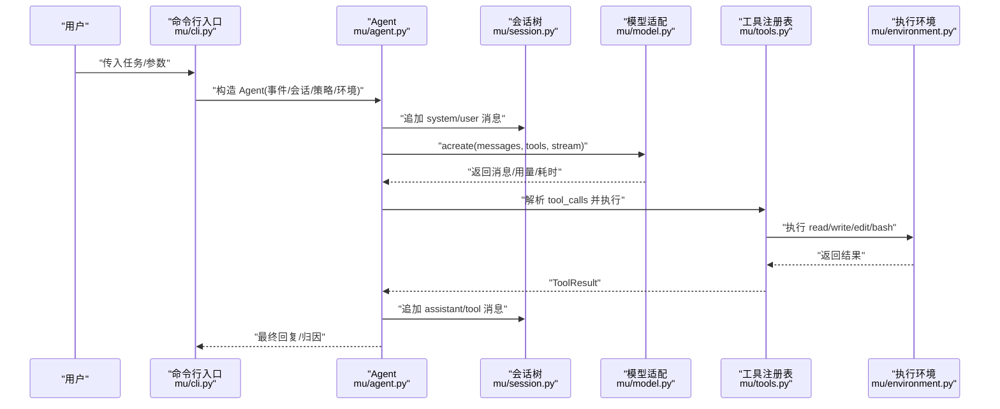
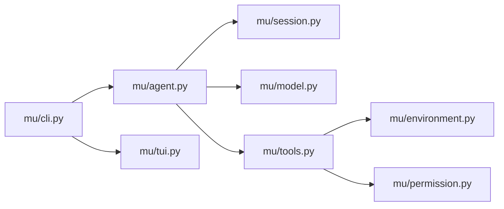
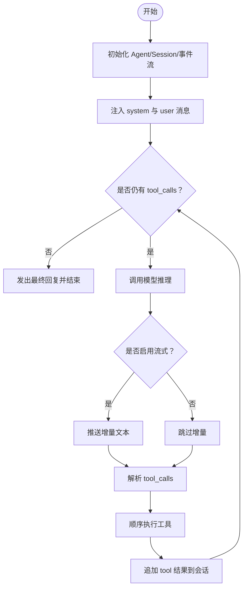

# 快速开始

<cite>
**本文引用的文件**
- [README.md](file://README.md)
- [pyproject.toml](file://pyproject.toml)
- [mu/__main__.py](file://mu/__main__.py)
- [mu/cli.py](file://mu/cli.py)
- [mu/agent.py](file://mu/agent.py)
- [mu/session.py](file://mu/session.py)
- [mu/model.py](file://mu/model.py)
- [mu/tools.py](file://mu/tools.py)
- [mu/environment.py](file://mu/environment.py)
- [mu/permission.py](file://mu/permission.py)
- [mu/tui.py](file://mu/tui.py)
- [extensions/README.md](file://extensions/README.md)
- [extensions/example_textstats.py](file://extensions/example_textstats.py)
- [tests/test_agent_loop.py](file://tests/test_agent_loop.py)
- [tests/test_session.py](file://tests/test_session.py)
</cite>

## 目录
1. [简介](#简介)
2. [项目结构](#项目结构)
3. [核心组件](#核心组件)
4. [架构总览](#架构总览)
5. [详细组件解析](#详细组件解析)
6. [依赖关系分析](#依赖关系分析)
7. [性能注意事项](#性能注意事项)
8. [故障排查指南](#故障排查指南)
9. [结论](#结论)
10. [附录](#附录)

## 简介
本指南面向初学者，带你从零完成 μ (mu) 智能体的安装、配置与首次运行，覆盖以下要点：
- 使用项目自带虚拟环境进行安装
- 配置 OpenAI 兼容端点（百炼、DeepSeek、OpenAI 等）
- 基本命令行用法与流式输出
- 会话管理、续跑与分支功能
- TUI 交互式体验
- 常见配置问题与解决方案

## 项目结构
该项目采用“核心模块 + 可选 UI/扩展”的分层组织：
- 核心模块：命令行入口、Agent 循环、会话树、模型适配、工具与权限、环境抽象
- 可选组件：Textual TUI、扩展系统（子进程 + JSONL 协议）
- 测试与示例：单元测试、扩展示例、评测与运行产物

图示来源
- [mu/cli.py:1-134](file://mu/cli.py#L1-L134)
- [mu/agent.py:1-223](file://mu/agent.py#L1-L223)
- [mu/session.py:1-115](file://mu/session.py#L1-L115)
- [mu/model.py:1-147](file://mu/model.py#L1-L147)
- [mu/tools.py:1-269](file://mu/tools.py#L1-L269)
- [mu/environment.py:1-150](file://mu/environment.py#L1-L150)
- [mu/permission.py:1-69](file://mu/permission.py#L1-L69)
- [mu/tui.py:1-203](file://mu/tui.py#L1-L203)
- [extensions/README.md:1-58](file://extensions/README.md#L1-L58)
- [extensions/example_textstats.py:1-67](file://extensions/example_textstats.py#L1-L67)

章节来源
- [README.md:1-127](file://README.md#L1-L127)
- [pyproject.toml:1-32](file://pyproject.toml#L1-L32)

## 核心组件
- 命令行入口与参数解析：负责解析任务、会话续跑/分支、流式开关、TUI、权限与沙箱等参数，并调度异步执行
- Agent 循环：围绕“上下文 → LLM 推理 → 工具调用 → 会话更新”的主循环，支持取消、事件流与归因
- 会话树：以 JSONL 追加式持久化，支持分支、侧分支摘要与回溯
- 模型适配：基于 openai SDK 的异步封装，统一 OpenAI 兼容端点
- 工具与权限：内置 read/write/edit/bash 四工具，支持动态扩展与基于能力的权限策略
- 执行环境：本地/容器两种环境抽象，支持 bash 超时与进程组清理
- TUI：Textual 前端，复用同一事件流与 Agent，提供交互式体验

章节来源
- [mu/cli.py:1-134](file://mu/cli.py#L1-L134)
- [mu/agent.py:1-223](file://mu/agent.py#L1-L223)
- [mu/session.py:1-115](file://mu/session.py#L1-L115)
- [mu/model.py:1-147](file://mu/model.py#L1-L147)
- [mu/tools.py:1-269](file://mu/tools.py#L1-L269)
- [mu/environment.py:1-150](file://mu/environment.py#L1-L150)
- [mu/permission.py:1-69](file://mu/permission.py#L1-L69)
- [mu/tui.py:1-203](file://mu/tui.py#L1-L203)

## 架构总览
下图展示了从命令行到 Agent、再到模型与工具的整体调用链路。

图示来源
- [mu/cli.py:51-134](file://mu/cli.py#L51-L134)
- [mu/agent.py:82-163](file://mu/agent.py#L82-L163)
- [mu/model.py:112-147](file://mu/model.py#L112-L147)
- [mu/tools.py:253-269](file://mu/tools.py#L253-L269)
- [mu/environment.py:26-88](file://mu/environment.py#L26-L88)

## 详细组件解析

### 安装与环境准备
- 使用项目自带虚拟环境进行安装，分别支持 headless 与带 TUI 的安装
- 依赖要求与可选组件在项目配置中声明

章节来源
- [README.md:13-18](file://README.md#L13-L18)
- [pyproject.toml:14-21](file://pyproject.toml#L14-L21)

### 配置 OpenAI 兼容端点
- 支持通过环境变量或 .env 文件配置端点、模型与密钥
- 提供百炼、DeepSeek、OpenAI 的典型配置示例

章节来源
- [README.md:20-41](file://README.md#L20-L41)

### 基本使用示例
- 从命令行传入任务、从标准输入读取任务
- 启用流式输出观察逐步生成
- 查看会话目录与归因报告

章节来源
- [README.md:42-52](file://README.md#L42-L52)

### 流式输出
- 在推理阶段开启流式，事件流将逐块推送增量文本
- CLI 层根据参数决定是否启用流式

章节来源
- [mu/cli.py:31-34](file://mu/cli.py#L31-L34)
- [mu/agent.py:100-102](file://mu/agent.py#L100-L102)
- [mu/model.py:52-88](file://mu/model.py#L52-L88)

### 会话管理与续跑/分支
- 会话以 JSONL 追加式持久化，支持从任意节点分支与添加侧分支摘要
- 支持 --resume 与 --branch 参数进行续跑与分支

章节来源
- [README.md:54-61](file://README.md#L54-L61)
- [mu/session.py:38-115](file://mu/session.py#L38-L115)
- [tests/test_session.py:27-49](file://tests/test_session.py#L27-L49)

### TUI 交互式体验
- 安装可选依赖后启用 Textual TUI，支持实时查看与取消运行
- TUI 与 headless 共享同一 Agent/Session/事件流

章节来源
- [README.md:63-71](file://README.md#L63-L71)
- [mu/tui.py:122-203](file://mu/tui.py#L122-L203)

### 自延伸扩展（M3）
- agent 可加载自定义工具扩展，扩展以子进程运行并通过 JSONL 协议通信
- 放在特定目录下的扩展可在启动时自动加载

章节来源
- [README.md:73-82](file://README.md#L73-L82)
- [extensions/README.md:1-58](file://extensions/README.md#L1-L58)
- [extensions/example_textstats.py:1-67](file://extensions/example_textstats.py#L1-L67)

### Code-action 与安全/沙箱（M3.5）
- 支持一次性组合多工具的原生 code-action
- 可选权限策略与沙箱 provider（本地/容器）

章节来源
- [README.md:84-96](file://README.md#L84-L96)
- [mu/tools.py:191-269](file://mu/tools.py#L191-L269)
- [mu/environment.py:139-150](file://mu/environment.py#L139-L150)
- [mu/permission.py:61-69](file://mu/permission.py#L61-L69)

### 评测与 DGM-lite（M4.0）
- 内置评测套件与候选隔离验证，产物写入指定目录

章节来源
- [README.md:98-115](file://README.md#L98-L115)

## 依赖关系分析
- CLI 依赖 Agent、Session、事件发射器、模型、权限与环境
- Agent 依赖模型、工具注册表、事件发射器、会话与上下文转换
- 工具注册表依赖执行环境与权限策略
- 模型适配依赖 openai SDK 与环境变量
- TUI 依赖 Agent 与事件流

图示来源
- [mu/cli.py:12-19](file://mu/cli.py#L12-L19)
- [mu/agent.py:33-38](file://mu/agent.py#L33-L38)
- [mu/tools.py:11-16](file://mu/tools.py#L11-L16)
- [mu/environment.py:23-96](file://mu/environment.py#L23-L96)
- [mu/permission.py:15-16](file://mu/permission.py#L15-L16)
- [mu/tui.py:15-35](file://mu/tui.py#L15-L35)

章节来源
- [mu/cli.py:1-134](file://mu/cli.py#L1-L134)
- [mu/agent.py:1-223](file://mu/agent.py#L1-L223)
- [mu/tools.py:1-269](file://mu/tools.py#L1-L269)
- [mu/environment.py:1-150](file://mu/environment.py#L1-L150)
- [mu/permission.py:1-69](file://mu/permission.py#L1-L69)
- [mu/tui.py:1-203](file://mu/tui.py#L1-L203)

## 性能注意事项
- 流式输出会带来额外的事件开销，建议在调试时开启，生产默认关闭
- 工具执行与 bash 调用可能阻塞事件循环，底层通过线程/子进程处理
- Docker 沙箱仅隔离 bash，文件 IO 仍在宿主执行，如需严格隔离请将 μ 运行在容器中

## 故障排查指南
- 配置缺失
  - 症状：启动时报错提示缺少模型或密钥
  - 处理：设置环境变量或加载 .env 文件后再运行
- 会话不存在
  - 症状：--resume 指定的会话 ID 不存在
  - 处理：确认会话目录与 ID 正确，或重新发起新会话
- 权限拒绝
  - 症状：工具执行返回权限不足
  - 处理：调整 --permission 策略或检查工具所需能力
- TUI 依赖缺失
  - 症状：启用 --tui 提示缺少 textual
  - 处理：安装可选依赖后重试
- Docker 超时/失败
  - 症状：容器内命令超时或失败
  - 处理：检查本机 docker 是否可用、镜像是否存在、网络隔离设置

章节来源
- [mu/model.py:19-21](file://mu/model.py#L19-L21)
- [mu/cli.py:66-82](file://mu/cli.py#L66-L82)
- [mu/permission.py:29-58](file://mu/permission.py#L29-L58)
- [mu/tui.py:99-104](file://mu/tui.py#L99-L104)
- [mu/environment.py:106-130](file://mu/environment.py#L106-L130)

## 结论
通过本指南，你可以完成 μ 的安装与配置，掌握命令行与流式输出的基本用法，并了解会话管理、续跑/分支、TUI、扩展与安全/沙箱等高级特性。建议先以默认策略与本地环境完成首次运行，再逐步探索权限与沙箱选项。

## 附录

### 从安装到首次运行的完整流程
- 准备虚拟环境并安装依赖
- 配置端点、模型与密钥（环境变量或 .env）
- 运行命令行任务，观察输出与归因
- 查看会话目录与 JSONL 文件
- 尝试流式输出与 TUI
- 使用 --resume 与 --branch 进行续跑/分支

章节来源
- [README.md:13-71](file://README.md#L13-L71)
- [tests/test_agent_loop.py:58-92](file://tests/test_agent_loop.py#L58-L92)
- [tests/test_session.py:7-25](file://tests/test_session.py#L7-L25)

### 代码级流程图：Agent 循环与工具执行

图示来源
- [mu/agent.py:82-163](file://mu/agent.py#L82-L163)
- [mu/model.py:112-147](file://mu/model.py#L112-L147)
- [mu/tools.py:253-269](file://mu/tools.py#L253-L269)