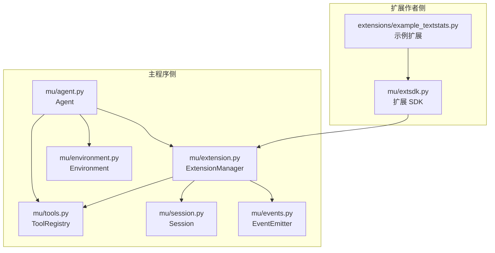
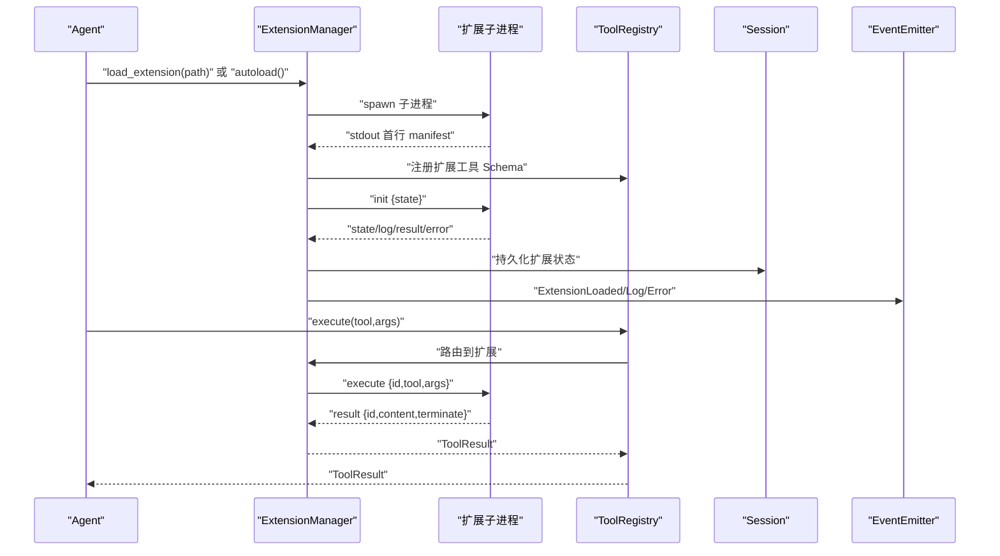
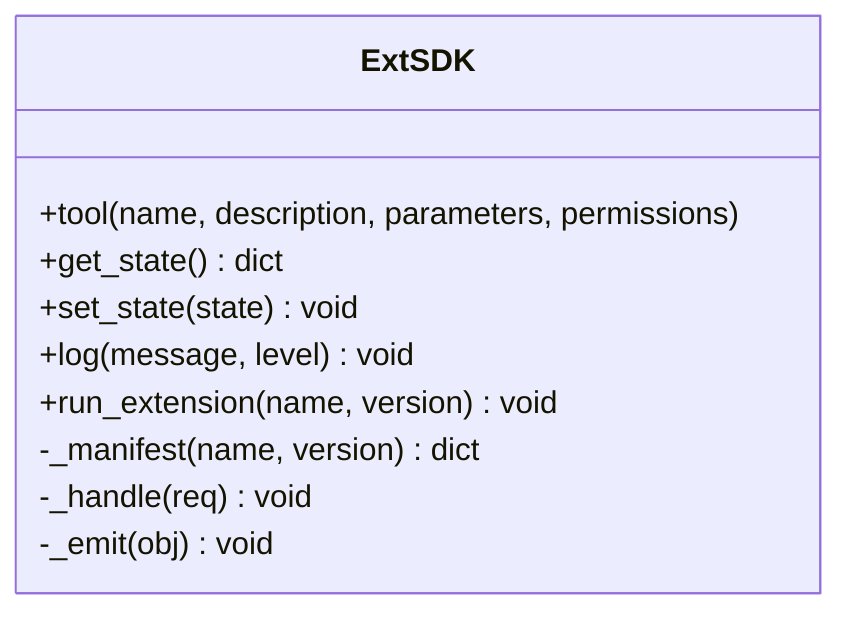
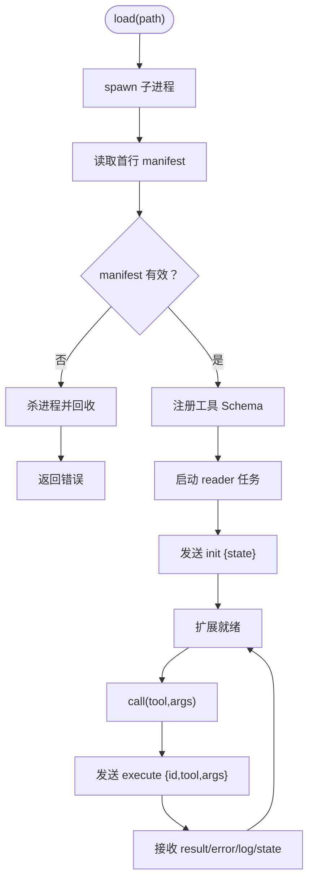
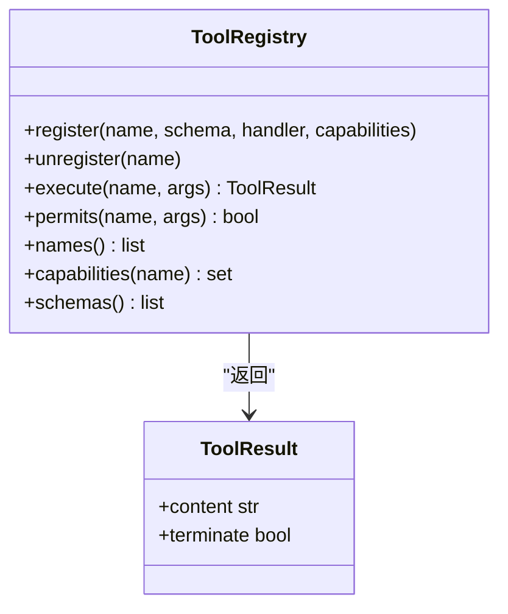
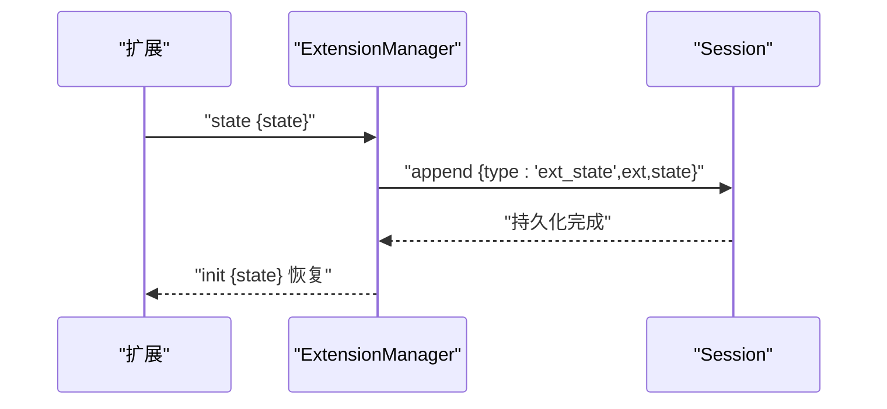
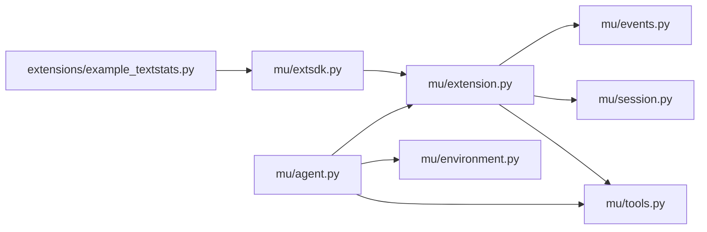

# 扩展开发 SDK

<cite>
**本文引用的文件列表**
- [README.md](file://README.md)
- [extensions/README.md](file://extensions/README.md)
- [extensions/example_textstats.py](file://extensions/example_textstats.py)
- [mu/extsdk.py](file://mu/extsdk.py)
- [mu/extension.py](file://mu/extension.py)
- [mu/tools.py](file://mu/tools.py)
- [mu/session.py](file://mu/session.py)
- [mu/events.py](file://mu/events.py)
- [mu/environment.py](file://mu/environment.py)
- [mu/agent.py](file://mu/agent.py)
- [tests/test_extension.py](file://tests/test_extension.py)
</cite>

## 目录
1. [简介](#简介)
2. [项目结构](#项目结构)
3. [核心组件](#核心组件)
4. [架构总览](#架构总览)
5. [详细组件分析](#详细组件分析)
6. [依赖关系分析](#依赖关系分析)
7. [性能考量](#性能考量)
8. [故障排查指南](#故障排查指南)
9. [结论](#结论)
10. [附录](#附录)

## 简介
本文件面向“扩展开发 SDK”的使用者，系统性阐述如何基于 μ（mu）平台编写自定义扩展工具，涵盖：
- 扩展 SDK 的 API 接口、类与方法的使用方式
- 扩展开发标准流程：清单/Schema 编写、工具函数实现、错误处理
- 完整示例：创建自定义工具、参数与返回值处理
- 最佳实践、性能优化与安全注意事项
- 调试、测试与部署指南
- 扩展与主程序的集成方式与生命周期管理

μ 的扩展机制采用“独立子进程 + JSONL 协议”模式，扩展以与 agent 同等权限运行，具备崩溃隔离能力，但不构成安全沙箱。M3.5 将引入可插拔的权限/沙箱层。

## 项目结构
围绕扩展开发的关键模块与文件如下：
- 扩展 SDK：提供装饰器、状态读写、日志、协议启动等能力
- 扩展管理器：负责扩展子进程生命周期、IPC、事件与状态恢复
- 工具注册表：统一管理内置与扩展工具，支持权限策略
- 会话与事件：扩展状态持久化与事件流回传
- 示例扩展：最小可用示例，演示工具声明、状态持久化与日志

图表来源
- [mu/extsdk.py:1-130](file://mu/extsdk.py#L1-L130)
- [extensions/example_textstats.py:1-67](file://extensions/example_textstats.py#L1-L67)
- [mu/extension.py:1-364](file://mu/extension.py#L1-L364)
- [mu/tools.py:1-269](file://mu/tools.py#L1-L269)
- [mu/session.py:1-115](file://mu/session.py#L1-L115)
- [mu/events.py:1-133](file://mu/events.py#L1-L133)
- [mu/agent.py:1-223](file://mu/agent.py#L1-L223)
- [mu/environment.py:1-150](file://mu/environment.py#L1-L150)

章节来源
- [README.md:73-82](file://README.md#L73-L82)
- [extensions/README.md:1-58](file://extensions/README.md#L1-L58)

## 核心组件
- 扩展 SDK（mu.extsdk）
  - 装饰器：用于声明工具函数及其 OpenAI JSON Schema
  - 状态：提供全局状态读写与持久化
  - 日志：将日志回流至事件流
  - 协议：启动扩展子进程并进入 JSONL 主循环
- 扩展管理器（mu.extension.ExtensionManager）
  - 子进程生命周期：spawn、读取 manifest、注册工具、初始化状态、读取响应、优雅关闭
  - IPC：stdin/stdout JSONL 交换，错误与日志事件回传
  - 自动加载：启动时扫描扩展目录
- 工具注册表（mu.tools.ToolRegistry）
  - 动态注册/注销扩展工具
  - 权限策略 gate 工具调用
  - 统一返回类型 ToolResult（支持 terminate）
- 会话与事件（mu.session.Session, mu.events.EventEmitter）
  - 扩展状态持久化到会话
  - 事件流：扩展加载/卸载/日志/错误等
- 示例扩展（extensions/example_textstats.py）
  - 展示多工具声明、状态持久化、日志输出与协议启动

章节来源
- [mu/extsdk.py:34-130](file://mu/extsdk.py#L34-L130)
- [mu/extension.py:85-364](file://mu/extension.py#L85-L364)
- [mu/tools.py:191-269](file://mu/tools.py#L191-L269)
- [mu/session.py:38-115](file://mu/session.py#L38-L115)
- [mu/events.py:91-133](file://mu/events.py#L91-L133)
- [extensions/example_textstats.py:1-67](file://extensions/example_textstats.py#L1-L67)

## 架构总览
扩展开发采用“主程序 + 扩展子进程”的双进程架构，通过 JSONL 协议进行通信。主程序侧负责工具调度、权限控制、事件与会话管理；扩展侧负责业务逻辑与状态持久化。

图表来源
- [mu/extension.py:131-188](file://mu/extension.py#L131-L188)
- [mu/extension.py:251-266](file://mu/extension.py#L251-L266)
- [mu/extsdk.py:111-130](file://mu/extsdk.py#L111-L130)
- [mu/tools.py:253-269](file://mu/tools.py#L253-L269)

## 详细组件分析

### 扩展 SDK（mu.extsdk）
- 装饰器 tool
  - 参数：name、description、parameters（OpenAI JSON Schema）、permissions
  - 行为：将工具注册到内部工具表，生成 manifest
  - 返回：装饰器包装的函数
- 状态管理
  - get_state：返回当前扩展状态字典
  - set_state：设置并持久化状态，触发 state 事件
- 日志
  - log：输出日志到事件流，避免直接 print（stdout 为协议通道）
- 协议启动
  - run_extension：输出 manifest，进入 JSONL 主循环，处理 init/execute/shutdown

图表来源
- [mu/extsdk.py:34-130](file://mu/extsdk.py#L34-L130)

章节来源
- [mu/extsdk.py:34-130](file://mu/extsdk.py#L34-L130)
- [extensions/README.md:34-42](file://extensions/README.md#L34-L42)

### 扩展管理器（mu.extension.ExtensionManager）
- 生命周期
  - load：spawn 子进程、读取 manifest、注册工具、初始化状态、启动 reader 任务
  - reload：卸载后重新加载
  - unload：注销工具、发送 shutdown、等待退出或强制杀死
  - autoload：启动时扫描扩展目录自动加载
  - aclose：统一关闭所有扩展
- IPC
  - _reader_loop：解析 JSONL，分发 result/error/log/state，崩溃时降级
  - _send/_read_json：发送请求与读取响应
- 状态与事件
  - _restore_state：从会话恢复扩展状态
  - 事件：ExtensionLoaded/Unloaded/Log/Error

图表来源
- [mu/extension.py:131-188](file://mu/extension.py#L131-L188)
- [mu/extension.py:275-300](file://mu/extension.py#L275-L300)

章节来源
- [mu/extension.py:85-364](file://mu/extension.py#L85-L364)

### 工具注册表（mu.tools.ToolRegistry）
- 动态注册/注销扩展工具，防止与内置工具冲突
- 权限策略 gate 工具调用
- 统一返回 ToolResult，支持 terminate 标志

图表来源
- [mu/tools.py:191-269](file://mu/tools.py#L191-L269)

章节来源
- [mu/tools.py:191-269](file://mu/tools.py#L191-L269)

### 会话与事件（mu.session.Session, mu.events.EventEmitter）
- Session：树形会话，支持 append、branch_from、path_to_head、持久化到 JSONL
- 扩展状态持久化：扩展通过 state 事件写入会话，resume 时恢复
- 事件流：扩展加载/卸载/日志/错误等事件，供 UI/可观测性等订阅

图表来源
- [mu/extension.py:294-297](file://mu/extension.py#L294-L297)
- [mu/session.py:49-54](file://mu/session.py#L49-L54)

章节来源
- [mu/session.py:38-115](file://mu/session.py#L38-L115)
- [mu/events.py:91-133](file://mu/events.py#L91-L133)

### 示例扩展（extensions/example_textstats.py）
- 声明多个工具：word_count、reverse_text、set_prefix、greet
- 使用 get_state/set_state 演示状态持久化
- 使用 log 输出日志
- 通过 run_extension 启动协议循环

章节来源
- [extensions/example_textstats.py:1-67](file://extensions/example_textstats.py#L1-L67)
- [extensions/README.md:9-32](file://extensions/README.md#L9-L32)

## 依赖关系分析
- 扩展 SDK 依赖于标准库（json、sys、asyncio、inspect）与主程序的事件/会话接口
- 扩展管理器依赖工具注册表、会话与事件系统
- Agent 通过 ExtensionManager 与扩展交互，同时维护工具注册表与环境抽象

图表来源
- [mu/extsdk.py:1-21](file://mu/extsdk.py#L1-L21)
- [mu/extension.py:1-32](file://mu/extension.py#L1-L32)
- [mu/agent.py:34-75](file://mu/agent.py#L34-L75)

章节来源
- [mu/extsdk.py:1-21](file://mu/extsdk.py#L1-L21)
- [mu/extension.py:1-32](file://mu/extension.py#L1-L32)
- [mu/agent.py:34-75](file://mu/agent.py#L34-L75)

## 性能考量
- 子进程开销：扩展为独立子进程，存在进程启动与 IPC 成本。建议：
  - 合理设计工具粒度，避免频繁切换
  - 复用状态减少重复计算
- JSONL 读写：stdin/stdout 为阻塞式，注意缓冲与 flush
- 超时控制：扩展调用默认超时约 120s，崩溃时快速降级（秒级返回错误）
- I/O 优化：文件读写与 bash 执行尽量批量处理，避免过多小请求

章节来源
- [mu/extension.py:31-32](file://mu/extension.py#L31-L32)
- [mu/extension.py:160-168](file://mu/extension.py#L160-L168)
- [mu/extension.py:260-265](file://mu/extension.py#L260-L265)
- [mu/extension.py:301-307](file://mu/extension.py#L301-L307)

## 故障排查指南
- manifest 未产生或格式错误
  - 症状：扩展未注册工具，加载失败
  - 排查：确认扩展首行输出合法 manifest；检查 run_extension 调用
- 工具名称冲突
  - 症状：扩展加载时报冲突
  - 排查：确保工具名唯一；内置工具名不可重用
- 调用超时
  - 症状：扩展工具长时间无响应
  - 排查：检查工具内部逻辑、外部依赖；必要时增加超时或拆分任务
- 扩展崩溃
  - 症状：调用返回错误且工具被注销
  - 排查：查看 ExtensionError 事件；修复崩溃点
- 权限拒绝
  - 症状：工具执行返回权限错误
  - 排查：检查策略与 capabilities；扩展工具默认具备 write/shell 能力
- 状态未恢复
  - 症状：resume 后状态丢失
  - 排查：确认 set_state 是否触发 state 事件；检查会话持久化路径

章节来源
- [tests/test_extension.py:122-134](file://tests/test_extension.py#L122-L134)
- [tests/test_extension.py:136-151](file://tests/test_extension.py#L136-L151)
- [tests/test_extension.py:163-186](file://tests/test_extension.py#L163-L186)
- [tests/test_extension.py:101-120](file://tests/test_extension.py#L101-L120)
- [mu/extension.py:294-297](file://mu/extension.py#L294-L297)

## 结论
μ 的扩展开发 SDK 提供了简洁而强大的工具声明与协议框架，使扩展作者能够以最小成本编写自定义工具并无缝融入主程序。通过明确的生命周期管理、事件流与状态持久化机制，扩展可在 agent 的驱动下实现“自延伸”。建议在开发中遵循命名规范、合理划分工具粒度、重视错误处理与日志输出，并结合测试用例验证扩展行为。

## 附录

### 开发流程与最佳实践
- 清单与 Schema
  - 使用 tool 装饰器声明工具，parameters 采用 OpenAI JSON Schema
  - 为每个工具提供清晰的 description，便于模型正确选择
- 工具函数实现
  - 函数签名：fn(args: dict) -> str 或 (str, terminate: bool)
  - 支持同步或异步；如为异步，SDK 会自动 await
  - 参数校验：在函数内部进行必要校验，返回字符串错误信息
- 状态与日志
  - 使用 set_state 持久化配置；get_state 读取
  - 使用 log 输出日志，避免直接 print
- 错误处理
  - 捕获异常并返回字符串错误；避免抛出异常
  - 通过事件流上报错误，便于诊断
- 性能优化
  - 合理拆分工具，避免单次调用耗时过长
  - 批量 I/O，减少子进程往返
- 安全注意事项
  - 扩展以与 agent 同等权限运行，仅做崩溃隔离
  - M3.5 引入可插拔权限/沙箱层，建议在受限策略下开发与测试

章节来源
- [extensions/README.md:34-42](file://extensions/README.md#L34-L42)
- [mu/extsdk.py:86-109](file://mu/extsdk.py#L86-L109)
- [mu/tools.py:253-269](file://mu/tools.py#L253-L269)

### 调试、测试与部署
- 调试
  - 使用 log 输出中间状态
  - 通过事件流观察 ExtensionLog/ExtensionError
  - 使用示例扩展作为模板快速定位问题
- 测试
  - 参考测试用例：加载/调用/状态/错误/崩溃/重载/卸载
  - 使用临时目录隔离测试数据
- 部署
  - 将扩展放置于扩展目录（默认 .mu/extensions），启动时自动加载
  - 使用 load_extension/reload_extension 管理扩展
  - 在受限策略下禁止扩展加载，确保安全

章节来源
- [tests/test_extension.py:68-84](file://tests/test_extension.py#L68-L84)
- [tests/test_extension.py:101-120](file://tests/test_extension.py#L101-L120)
- [tests/test_extension.py:122-134](file://tests/test_extension.py#L122-L134)
- [tests/test_extension.py:163-186](file://tests/test_extension.py#L163-L186)
- [README.md:73-82](file://README.md#L73-L82)

### 扩展与主程序的集成与生命周期
- 集成方式
  - Agent 通过 ExtensionManager 注册管理工具（load/reload/list）
  - 扩展工具经 ToolRegistry 注册，参与模型函数调用
- 生命周期
  - 加载：spawn 子进程 → 读取 manifest → 注册工具 → 初始化状态
  - 运行：调用工具 → IPC 通信 → 结果回传
  - 卸载：注销工具 → 发送 shutdown → 等待退出或强制杀死
  - 自动加载：启动时扫描扩展目录

章节来源
- [mu/agent.py:69-75](file://mu/agent.py#L69-L75)
- [mu/extension.py:131-188](file://mu/extension.py#L131-L188)
- [mu/extension.py:199-233](file://mu/extension.py#L199-L233)
- [mu/extension.py:235-244](file://mu/extension.py#L235-L244)