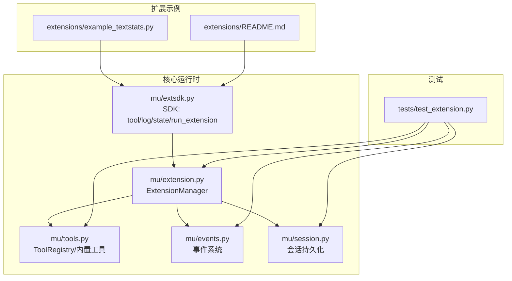
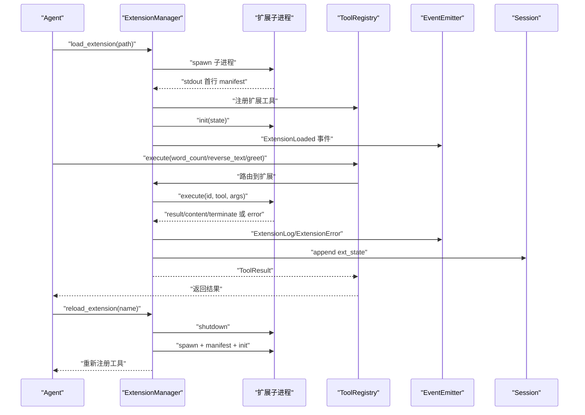
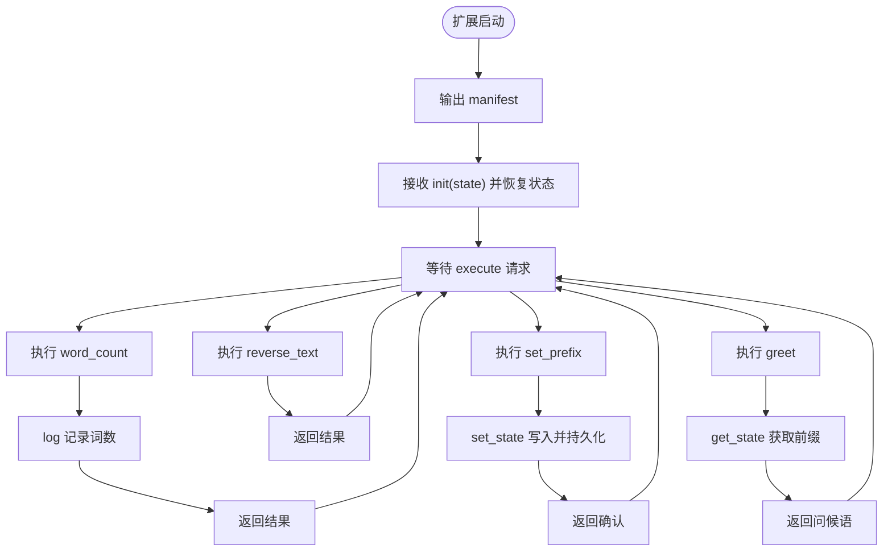
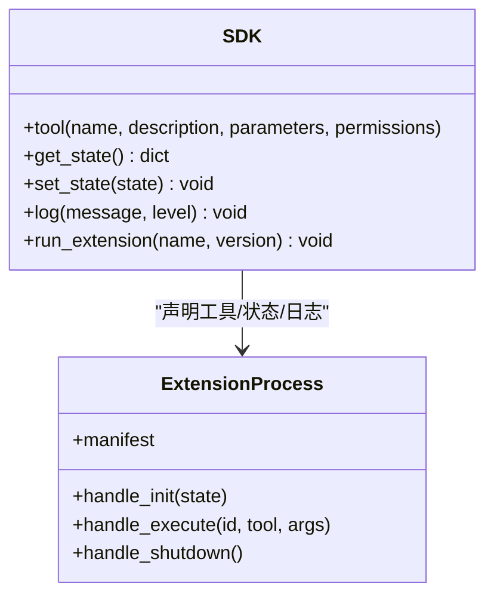
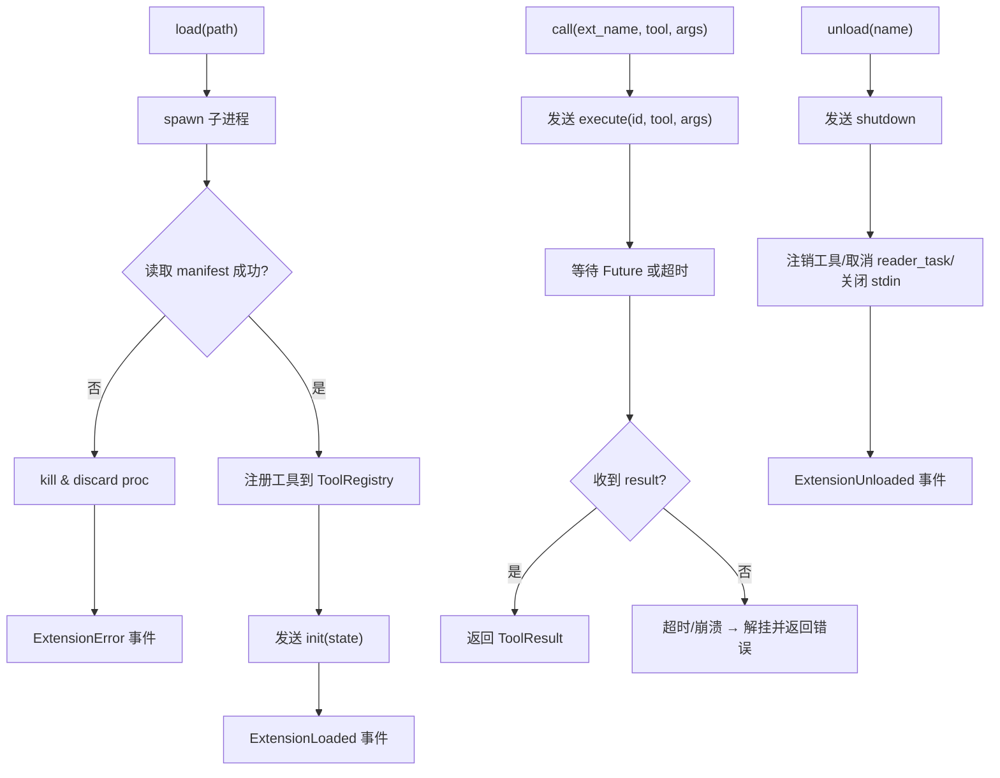
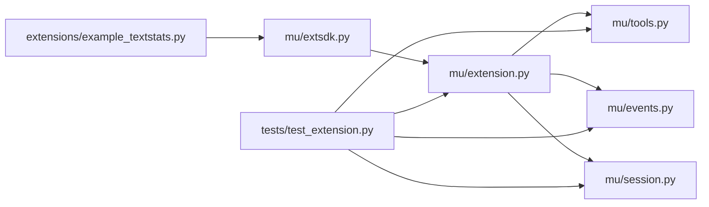

# 扩展开发示例

<cite>
**本文引用的文件**
- [extensions/example_textstats.py](file://extensions/example_textstats.py)
- [extensions/README.md](file://extensions/README.md)
- [mu/extension.py](file://mu/extension.py)
- [mu/extsdk.py](file://mu/extsdk.py)
- [mu/tools.py](file://mu/tools.py)
- [mu/events.py](file://mu/events.py)
- [mu/session.py](file://mu/session.py)
- [tests/test_extension.py](file://tests/test_extension.py)
- [README.md](file://README.md)
</cite>

## 目录
1. [简介](#简介)
2. [项目结构](#项目结构)
3. [核心组件](#核心组件)
4. [架构总览](#架构总览)
5. [详细组件分析](#详细组件分析)
6. [依赖关系分析](#依赖关系分析)
7. [性能考虑](#性能考虑)
8. [故障排查指南](#故障排查指南)
9. [结论](#结论)
10. [附录](#附录)

## 简介
本文件面向扩展开发者，系统讲解如何基于 μ（mu）框架编写“自延伸”扩展，围绕示例扩展 example_textstats.py 的完整实现进行深入剖析，包括工具定义、状态持久化、生命周期管理、协议通信、测试与调试方法，以及性能优化与最佳实践。同时提供多种典型扩展场景（文件操作、网络请求、数据分析）的开发思路与模板指引，帮助你在 M3/M3.5 架构下安全高效地扩展智能体能力。

## 项目结构
- 扩展示例位于 extensions/ 目录，其中 example_textstats.py 展示了工具声明、状态持久化与子进程运行的基本模式。
- 核心运行时位于 mu/，包含扩展管理器、SDK、工具注册表、事件系统与会话持久化等模块。
- tests/ 包含扩展加载、调用、状态恢复、错误处理、崩溃降级等端到端测试，是理解扩展行为与验证正确性的权威参考。
- README.md 提供整体背景、安装与运行说明，以及扩展加载与使用的高层指导。

图表来源
- [extensions/example_textstats.py:1-67](file://extensions/example_textstats.py#L1-L67)
- [extensions/README.md:1-58](file://extensions/README.md#L1-L58)
- [mu/extension.py:1-364](file://mu/extension.py#L1-L364)
- [mu/extsdk.py:1-130](file://mu/extsdk.py#L1-L130)
- [mu/tools.py:1-269](file://mu/tools.py#L1-L269)
- [mu/events.py:1-133](file://mu/events.py#L1-L133)
- [mu/session.py:1-115](file://mu/session.py#L1-L115)
- [tests/test_extension.py:1-245](file://tests/test_extension.py#L1-L245)

章节来源
- [README.md:73-82](file://README.md#L73-L82)
- [extensions/README.md:1-58](file://extensions/README.md#L1-L58)

## 核心组件
- 扩展 SDK（mu.extsdk）：提供工具装饰器、日志、状态读写与协议启动函数，用于声明工具并进入 JSONL 协议循环。
- 扩展管理器（mu.extension.ExtensionManager）：负责扩展子进程的 spawn、加载、调用、重载、卸载与崩溃降级，维护工具注册表与事件流。
- 工具注册表（mu.tools.ToolRegistry）：集中管理内置与扩展工具的 JSON Schema、处理器与权限能力，统一对外执行接口。
- 事件系统（mu.events）：扩展加载、卸载、日志与错误事件的同步分发，便于可观测与调试。
- 会话持久化（mu.session）：扩展状态以“ext_state”类型消息追加到会话，支持 --resume 恢复。

章节来源
- [mu/extsdk.py:1-130](file://mu/extsdk.py#L1-L130)
- [mu/extension.py:1-364](file://mu/extension.py#L1-L364)
- [mu/tools.py:1-269](file://mu/tools.py#L1-L269)
- [mu/events.py:1-133](file://mu/events.py#L1-L133)
- [mu/session.py:1-115](file://mu/session.py#L1-L115)

## 架构总览
扩展以独立子进程运行，通过 JSONL 协议与核心通信。启动时输出首行清单（manifest），随后处理初始化、执行与关闭指令；扩展内部通过 SDK 声明工具、记录日志、持久化状态；核心负责工具注册、权限校验、事件分发与会话持久化。

图表来源
- [mu/extension.py:131-188](file://mu/extension.py#L131-L188)
- [mu/extension.py:251-266](file://mu/extension.py#L251-L266)
- [mu/extsdk.py:111-130](file://mu/extsdk.py#L111-L130)
- [mu/events.py:91-116](file://mu/events.py#L91-L116)
- [mu/session.py:49-58](file://mu/session.py#L49-L58)

## 详细组件分析

### 示例扩展：textstats（文件操作与状态持久化）
- 工具定义
  - word_count：统计文本词数，返回字符串结果。
  - reverse_text：反转文本。
  - set_prefix：设置问候前缀并持久化到扩展状态。
  - greet：使用持久化的前缀问候指定名称。
- 状态机制
  - set_state 将状态写入扩展内存并发出 state 消息，核心将其追加到会话。
  - get_state 在扩展启动时接收来自会话的恢复状态。
- 日志输出
  - 使用 log 记录中间信息，回流到事件流，便于调试与审计。
- 启动流程
  - 通过 run_extension(name, version) 输出清单并进入协议循环。

图表来源
- [extensions/example_textstats.py:9-67](file://extensions/example_textstats.py#L9-L67)
- [mu/extsdk.py:56-68](file://mu/extsdk.py#L56-L68)
- [mu/extension.py:294-297](file://mu/extension.py#L294-L297)

章节来源
- [extensions/example_textstats.py:1-67](file://extensions/example_textstats.py#L1-L67)
- [extensions/README.md:34-58](file://extensions/README.md#L34-L58)

### 扩展 SDK（mu.extsdk）
- 工具装饰器 tool：生成 OpenAI 兼容的 JSON Schema，注册到扩展工具表。
- 状态 API：get_state/set_state，set_state 会触发状态广播。
- 日志 API：log(level, message)，输出到标准输出，核心解析为 ExtensionLog 事件。
- 协议启动：run_extension 输出 manifest，进入 JSONL 循环，处理 init/execute/shutdown。

图表来源
- [mu/extsdk.py:34-130](file://mu/extsdk.py#L34-L130)

章节来源
- [mu/extsdk.py:1-130](file://mu/extsdk.py#L1-L130)

### 扩展管理器（mu.extension.ExtensionManager）
- 生命周期
  - load：spawn 子进程、读取 manifest、注册工具、发送 init（携带会话恢复状态）、发出 ExtensionLoaded 事件。
  - reload：卸载后重新加载，保留会话状态。
  - unload：注销工具、发送 shutdown、回收进程、发出 ExtensionUnloaded 事件。
  - autoload：启动时自动加载 .mu/extensions/*.py。
- 调用链路
  - call：分配请求 ID、发送 execute、等待 Future 完成，超时或崩溃快速降级。
- 崩溃降级
  - 进程退出时解挂所有 pending 请求、注销工具、发出 ExtensionError 事件。
- 状态恢复
  - 从会话历史中提取扩展状态，传递给扩展 init。

图表来源
- [mu/extension.py:131-188](file://mu/extension.py#L131-L188)
- [mu/extension.py:190-234](file://mu/extension.py#L190-L234)
- [mu/extension.py:251-266](file://mu/extension.py#L251-L266)
- [mu/extension.py:275-317](file://mu/extension.py#L275-L317)

章节来源
- [mu/extension.py:1-364](file://mu/extension.py#L1-L364)

### 工具注册表（mu.tools.ToolRegistry）
- 统一的工具执行接口 execute，内置四工具（read/write/edit/bash）与扩展工具共享同一签名。
- 权限策略按“能力”（capabilities）进行 gate，扩展工具默认保守能力集合。
- 返回值 ToolResult 支持 terminate 标记，影响主循环的后续行为。

章节来源
- [mu/tools.py:191-269](file://mu/tools.py#L191-L269)

### 事件系统与会话持久化
- 事件系统：扩展加载/卸载、日志、错误事件同步分发，便于 UI 与可观测性消费。
- 会话持久化：扩展状态以 ext_state 类型消息追加到会话，支持 --resume 恢复。

章节来源
- [mu/events.py:91-116](file://mu/events.py#L91-L116)
- [mu/session.py:49-58](file://mu/session.py#L49-L58)

## 依赖关系分析
- 扩展示例依赖 SDK 提供的装饰器与协议启动函数。
- 扩展管理器依赖工具注册表、事件系统与会话持久化。
- 测试覆盖扩展加载、调用、状态恢复、错误与崩溃降级等关键路径。

图表来源
- [extensions/example_textstats.py:1-67](file://extensions/example_textstats.py#L1-L67)
- [mu/extsdk.py:1-130](file://mu/extsdk.py#L1-L130)
- [mu/extension.py:1-364](file://mu/extension.py#L1-L364)
- [mu/tools.py:1-269](file://mu/tools.py#L1-L269)
- [mu/events.py:1-133](file://mu/events.py#L1-L133)
- [mu/session.py:1-115](file://mu/session.py#L1-L115)
- [tests/test_extension.py:1-245](file://tests/test_extension.py#L1-L245)

章节来源
- [tests/test_extension.py:68-134](file://tests/test_extension.py#L68-L134)
- [tests/test_extension.py:163-186](file://tests/test_extension.py#L163-L186)

## 性能考虑
- 子进程开销：扩展为独立子进程，存在启动与 IPC 开销。建议：
  - 合理设计工具粒度，避免频繁切换工具导致过多进程间往返。
  - 在扩展内合并多次调用，减少 execute 次数。
- 状态持久化：set_state 会触发广播与会话写入，应避免高频更新。
- 超时控制：扩展调用默认超时约 120 秒，长时间任务应在扩展内拆分或采用异步/后台机制（注意扩展内异步执行由 SDK 统一封装）。
- I/O 与网络：文件与网络请求属于高风险操作，建议：
  - 限制单次调用的数据规模，必要时分页或分块处理。
  - 设置合理的超时与重试策略，避免阻塞主循环。
- 观测与归因：利用 ExtensionLog 事件与会话归因报告定位热点工具与耗时环节。

## 故障排查指南
- 扩展未加载
  - 检查 manifest 是否在首行输出，且格式正确。
  - 确认扩展文件路径有效且可执行。
- 工具冲突
  - 扩展工具名与内置工具或已有扩展冲突会导致加载失败。
- 调用超时
  - 检查扩展内部逻辑是否阻塞，必要时拆分任务或增加日志定位瓶颈。
- 崩溃降级
  - 扩展进程异常退出会触发快速降级，工具将被注销并发出错误事件。
- 状态未恢复
  - 确认会话中存在 ext_state 记录，且扩展名称匹配。
- 权限拒绝
  - 扩展工具默认具备较高能力，受权限策略 gate；必要时调整策略或在工具声明中明确权限。

章节来源
- [mu/extension.py:145-160](file://mu/extension.py#L145-L160)
- [mu/extension.py:301-317](file://mu/extension.py#L301-L317)
- [tests/test_extension.py:136-152](file://tests/test_extension.py#L136-L152)
- [tests/test_extension.py:163-186](file://tests/test_extension.py#L163-L186)

## 结论
通过示例扩展与 SDK/管理器的协同，μ 提供了简洁可靠的扩展机制：声明工具、记录日志、持久化状态、子进程隔离与协议通信。结合测试用例与事件系统，开发者可以快速构建、验证与调试扩展。在 M3.5 权限/沙箱落地之前，建议严格控制扩展权限与输入输出，确保安全性与稳定性。

## 附录

### 扩展开发步骤与注意事项
- 步骤
  - 使用 @tool 装饰器声明工具，参数遵循 OpenAI JSON Schema。
  - 在扩展文件末尾调用 run_extension(name, version) 启动协议循环。
  - 将扩展文件放入 .mu/extensions/ 目录可实现自动加载。
  - 使用 load_extension/reload_extension 管理扩展生命周期。
- 注意事项
  - 不要使用 print 输出结果，应通过工具返回字符串或 SDK log 输出日志。
  - 避免与内置工具或已加载扩展重名。
  - 状态更新频率不宜过高，避免频繁写入会话。
  - 遵循权限策略，必要时在工具声明中明确权限需求。

章节来源
- [extensions/README.md:34-58](file://extensions/README.md#L34-L58)
- [mu/extsdk.py:34-74](file://mu/extsdk.py#L34-L74)
- [mu/extension.py:107-112](file://mu/extension.py#L107-L112)

### 常见扩展场景与开发要点
- 文件操作
  - 使用内置 read/write/edit 工具或在扩展中封装文件读写逻辑。
  - 注意路径合法性与权限，避免越权访问。
- 网络请求
  - 在扩展中封装 HTTP/HTTPS 请求，设置合理超时与错误处理。
  - 避免敏感信息泄露，必要时使用代理或沙箱。
- 数据分析
  - 将计算过程拆分为多个工具，便于组合与复用。
  - 对大体量数据进行分块处理，避免内存峰值过高。

### 测试与调试方法
- 单元测试
  - 使用 ExtensionManager 与 ToolRegistry 模拟扩展加载与调用。
  - 验证状态恢复、错误回传与崩溃降级行为。
- 调试技巧
  - 使用 log 输出中间状态，结合 ExtensionLog 事件观察。
  - 通过会话归因报告定位工具耗时与调用次数。
  - 使用 --resume 验证状态一致性。

章节来源
- [tests/test_extension.py:68-134](file://tests/test_extension.py#L68-L134)
- [tests/test_extension.py:163-186](file://tests/test_extension.py#L163-L186)

### 性能优化案例与经验
- 案例
  - 将多次小文件读取合并为批量读取，减少 IPC 次数。
  - 对网络请求结果进行缓存，避免重复调用。
  - 将长耗时任务拆分为多个短任务，配合状态持久化断点续跑。
- 经验
  - 工具返回值尽量简洁，避免冗余字符串拼接。
  - 使用异步/并发时谨慎评估扩展内的异步封装与资源竞争。

### 模板与脚手架使用指南
- 最小模板
  - 引入 SDK 工具装饰器与 run_extension。
  - 声明一个或多个工具函数，返回字符串或二元组（内容, terminate）。
  - 在 __main__ 中启动扩展。
- 脚手架建议
  - 将扩展文件放置于 .mu/extensions/ 目录，便于自动加载。
  - 为每个工具提供清晰的描述与参数 Schema，提升模型调用准确性。
  - 在扩展内集中处理错误与日志，保证输出稳定可追踪。

章节来源
- [extensions/README.md:9-32](file://extensions/README.md#L9-L32)
- [extensions/example_textstats.py:65-67](file://extensions/example_textstats.py#L65-L67)