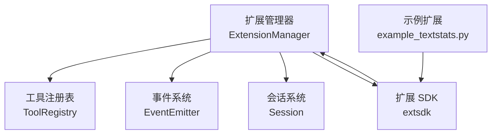
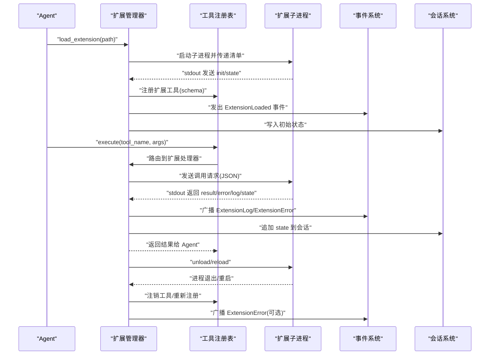
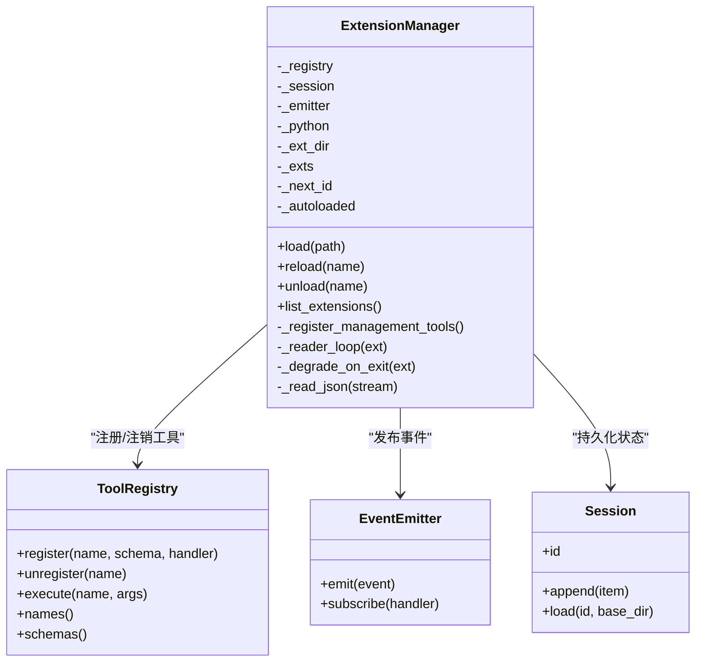
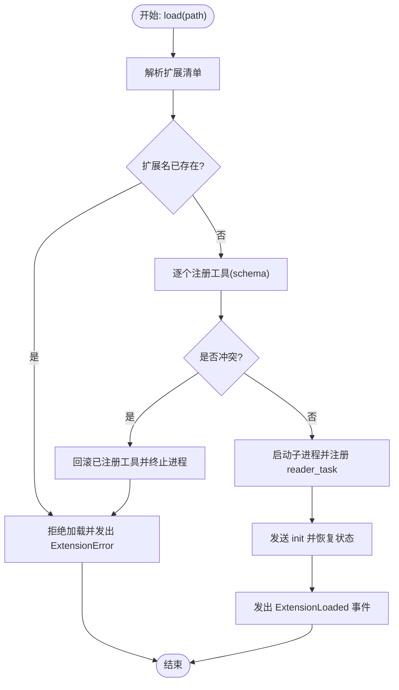
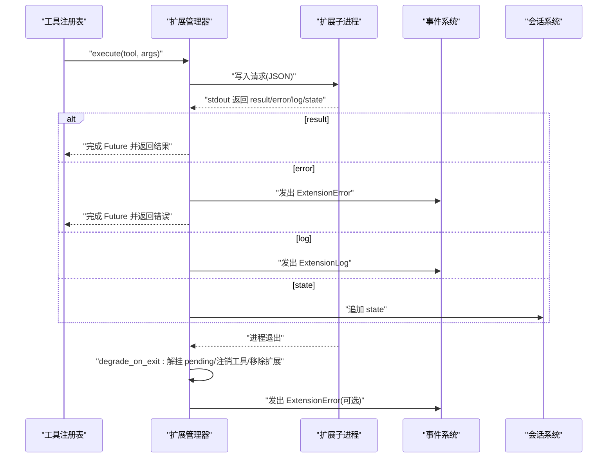
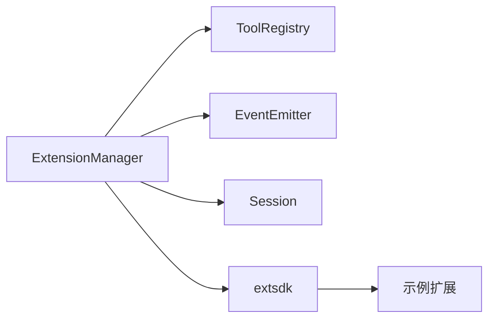

# 扩展管理器

<cite>
**本文引用的文件**
- [mu/extension.py](file://mu/extension.py)
- [mu/extsdk.py](file://mu/extsdk.py)
- [mu/events.py](file://mu/events.py)
- [mu/session.py](file://mu/session.py)
- [mu/tools.py](file://mu/tools.py)
- [tests/test_extension.py](file://tests/test_extension.py)
- [extensions/example_textstats.py](file://extensions/example_textstats.py)
</cite>

## 目录
1. [简介](#简介)
2. [项目结构](#项目结构)
3. [核心组件](#核心组件)
4. [架构总览](#架构总览)
5. [详细组件分析](#详细组件分析)
6. [依赖关系分析](#依赖关系分析)
7. [性能考量](#性能考量)
8. [故障排除指南](#故障排除指南)
9. [结论](#结论)
10. [附录](#附录)

## 简介
本文件为扩展管理器的技术文档，聚焦于 ExtensionManager 的核心能力与实现细节，涵盖扩展生命周期管理（加载、重载、卸载）、子进程隔离与 IPC 协议、与工具注册表的集成、事件系统的状态同步、配置项与错误处理策略，并给出使用示例与故障排除建议。本文面向具备基础 Python 与异步编程背景的读者，同时尽量以图示与流程帮助非专业读者理解。

## 项目结构
扩展管理器位于 mu/extension.py，围绕以下核心模块协作：
- 工具注册表：ToolRegistry，负责工具的注册、校验与执行分发
- 事件系统：EventEmitter 与各类事件类型，用于扩展状态、日志与错误的广播
- 会话系统：Session，持久化扩展状态并在会话恢复时回放
- 扩展 SDK：extsdk，提供扩展开发框架（声明式工具、运行时协议）
- 示例扩展：extensions/example_textstats.py，演示扩展清单与工具定义

图表来源
- [mu/extension.py:85-197](file://mu/extension.py#L85-L197)
- [mu/extsdk.py](file://mu/extsdk.py)
- [mu/events.py](file://mu/events.py)
- [mu/session.py](file://mu/session.py)
- [extensions/example_textstats.py](file://extensions/example_textstats.py)

章节来源
- [mu/extension.py:85-197](file://mu/extension.py#L85-L197)
- [mu/extsdk.py](file://mu/extsdk.py)
- [mu/events.py](file://mu/events.py)
- [mu/session.py](file://mu/session.py)
- [extensions/example_textstats.py](file://extensions/example_textstats.py)

## 核心组件
- 扩展管理器 ExtensionManager
  - 职责：加载/重载/卸载扩展；与工具注册表集成；维护扩展进程；处理 IPC；触发事件；持久化扩展状态
  - 关键字段：注册表、会话、事件发射器、Python 解释器路径、扩展目录、已加载扩展映射、自动加载标记等
  - 管理工具：注册 load_extension、reload_extension、list_extensions 三个管理工具，供 Agent 自延伸

- 工具注册表 ToolRegistry
  - 职责：工具 schema 校验、冲突检测、执行分发、工具名去重与内置保护
  - 与扩展管理器交互：在扩展加载时批量注册扩展工具；在扩展崩溃或卸载时批量注销

- 事件系统 EventEmitter 与事件类型
  - 事件类型：ExtensionLoaded、ExtensionError、ExtensionLog 等
  - 作用：扩展加载完成、运行期错误、日志输出、进程退出降级等状态同步

- 会话系统 Session
  - 职责：持久化扩展状态；支持会话恢复；将扩展状态写入会话流
  - 与扩展管理器交互：在扩展初始化时恢复状态；在收到 state 消息时追加到会话

- 扩展 SDK extsdk
  - 职责：提供 @tool 装饰器、run_extension 入口、IPC 协议（stdin/stdout）与消息格式
  - 与扩展管理器交互：扩展通过 SDK 启动，管理器通过子进程与之通信

章节来源
- [mu/extension.py:85-197](file://mu/extension.py#L85-L197)
- [mu/extsdk.py](file://mu/extsdk.py)
- [mu/events.py](file://mu/events.py)
- [mu/session.py](file://mu/session.py)
- [mu/tools.py](file://mu/tools.py)

## 架构总览
扩展管理器采用“主进程 + 子进程”架构，扩展以独立子进程运行，通过 JSON 行协议与主进程通信。主进程负责生命周期管理、工具注册、事件广播与状态持久化。

图表来源
- [mu/extension.py:113-188](file://mu/extension.py#L113-L188)
- [mu/extension.py:275-317](file://mu/extension.py#L275-L317)
- [mu/extsdk.py](file://mu/extsdk.py)
- [mu/events.py](file://mu/events.py)
- [mu/session.py](file://mu/session.py)

## 详细组件分析

### 扩展管理器类与生命周期
- 初始化与配置
  - 接收 ToolRegistry、Session、EventEmitter
  - 可选参数：python（解释器路径）、ext_dir（扩展目录）
  - 注册管理工具：load_extension、reload_extension、list_extensions
- 生命周期方法
  - load(path)：解析扩展清单、启动子进程、注册工具、启动读取循环、发送 init 并恢复状态、发出 ExtensionLoaded 事件
  - reload(name)：先卸载后加载，保持路径不变
  - unload(name)：停止读取循环、终止子进程、注销工具、发出 ExtensionError 事件（如有）
  - list_extensions()：返回已加载扩展列表
- 子进程隔离与 IPC
  - 使用 asyncio.StreamReader/Writer 读取扩展 stdout，按行解析 JSON
  - 支持的消息类型：result、error、log、state
  - pending 映射：按请求 ID 绑定 Future，确保调用与响应一一对应
- 事件与状态同步
  - ExtensionLoaded：加载成功
  - ExtensionError：加载失败、运行期错误、进程退出
  - ExtensionLog：扩展内部日志
  - ext_state：扩展状态持久化到会话

图表来源
- [mu/extension.py:85-197](file://mu/extension.py#L85-L197)
- [mu/extension.py:275-317](file://mu/extension.py#L275-L317)
- [mu/tools.py](file://mu/tools.py)
- [mu/events.py](file://mu/events.py)
- [mu/session.py](file://mu/session.py)

章节来源
- [mu/extension.py:85-197](file://mu/extension.py#L85-L197)
- [mu/extension.py:275-317](file://mu/extension.py#L275-L317)

### 加载流程与工具注册
- 清单解析与冲突检测
  - 若扩展名已存在，拒绝重复加载并发出 ExtensionError
  - 遍历 tools 列表，逐个尝试注册；若冲突则回滚已注册工具并终止子进程
- 子进程启动与读取循环
  - 创建 reader_task，持续从 stdout 读取 JSON 行
  - 发送 init 消息并恢复状态
- 事件与状态
  - 成功加载后发出 ExtensionLoaded
  - 将扩展状态写入会话

图表来源
- [mu/extension.py:162-188](file://mu/extension.py#L162-L188)

章节来源
- [mu/extension.py:162-188](file://mu/extension.py#L162-L188)

### 运行期调用与错误降级
- 调用路由
  - 工具注册表将调用转发至扩展处理器
  - 扩展处理器构造请求并写入子进程 stdin（由 SDK 实现）
- 结果与日志
  - stdout 返回 result：完成 Future
  - stdout 返回 error：完成 Future 并发出 ExtensionError
  - stdout 返回 log：发出 ExtensionLog
  - stdout 返回 state：写入会话
- 进程退出降级
  - 读取循环结束后，统一解挂 pending、注销工具、移除扩展记录、发出 ExtensionError（非正常退出）

图表来源
- [mu/extension.py:275-317](file://mu/extension.py#L275-L317)
- [mu/events.py](file://mu/events.py)
- [mu/session.py](file://mu/session.py)

章节来源
- [mu/extension.py:275-317](file://mu/extension.py#L275-L317)

### 重载与卸载
- reload
  - 若未加载则返回提示
  - 记录扩展路径，先卸载再加载
- unload
  - 取消 reader_task
  - 终止子进程
  - 注销工具、清理状态映射
  - 如非正常退出，发出 ExtensionError

章节来源
- [mu/extension.py:190-197](file://mu/extension.py#L190-L197)
- [mu/extension.py:301-317](file://mu/extension.py#L301-L317)

### 与工具注册表的集成
- 冲突保护：当扩展工具名与现有工具冲突或与内置工具冲突时，回滚已注册工具并终止进程
- 注册策略：按扩展清单中的每个工具 schema 注册 handler，handler 由扩展管理器生成，绑定扩展名与工具名
- 卸载策略：进程退出或显式卸载时，按工具名批量注销

章节来源
- [mu/extension.py:169-181](file://mu/extension.py#L169-L181)
- [mu/extension.py:309-312](file://mu/extension.py#L309-L312)
- [mu/tools.py](file://mu/tools.py)

### 与事件系统的集成
- 发出事件：ExtensionLoaded、ExtensionError、ExtensionLog
- 订阅事件：测试与上层组件可通过订阅事件观察扩展状态变化

章节来源
- [mu/extension.py:187](file://mu/extension.py#L187)
- [mu/extension.py:291](file://mu/extension.py#L291)
- [mu/extension.py:314-316](file://mu/extension.py#L314-L316)
- [mu/events.py](file://mu/events.py)

### 与会话系统的集成
- 初始化：发送 init 并恢复状态
- 运行期：接收 state 消息并 append 到会话
- 生命周期：aclose 或进程退出时，工具注销，但会话中的历史状态仍可恢复

章节来源
- [mu/extension.py:186](file://mu/extension.py#L186)
- [mu/extension.py:295-297](file://mu/extension.py#L295-L297)
- [mu/session.py](file://mu/session.py)

### 与扩展 SDK 的集成
- 扩展通过 @tool 定义工具，通过 run_extension 启动
- 管理器通过子进程与扩展通信，遵循 stdout 行协议
- 示例扩展 example_textstats.py 展示了工具与状态的典型用法

章节来源
- [mu/extsdk.py](file://mu/extsdk.py)
- [extensions/example_textstats.py](file://extensions/example_textstats.py)

## 依赖关系分析
- 组件耦合
  - ExtensionManager 对 ToolRegistry、EventEmitter、Session 的依赖为高内聚低耦合设计
  - 与扩展 SDK 的交互通过标准 IPC 协议，便于替换实现
- 外部依赖
  - asyncio（异步 IO 与任务调度）
  - json（消息编解码）
  - sys/executable（默认 Python 解释器）
- 潜在环路
  - 无直接环路；事件广播为单向

图表来源
- [mu/extension.py:85-197](file://mu/extension.py#L85-L197)
- [mu/extsdk.py](file://mu/extsdk.py)
- [extensions/example_textstats.py](file://extensions/example_textstats.py)

章节来源
- [mu/extension.py:85-197](file://mu/extension.py#L85-L197)

## 性能考量
- 异步 IO：使用 asyncio.StreamReader/Writer，避免阻塞主线程
- 事件驱动：通过事件系统减少轮询与同步等待
- 状态持久化：仅在 state 消息到达时追加，降低写放大
- 错误快速降级：进程退出或崩溃时立即解挂 pending，避免长时间等待

## 故障排除指南
- 加载失败
  - 现象：返回错误字符串或发出 ExtensionError
  - 原因：扩展名冲突、工具名冲突、清单解析失败
  - 处理：检查扩展清单与工具名；使用 reload 替代重复 load
- 运行期崩溃
  - 现象：调用快速返回错误、工具被注销、发出 ExtensionError
  - 原因：扩展进程异常退出
  - 处理：查看扩展日志（ExtensionLog），修复扩展逻辑后重载
- 调用超时
  - 现象：长时间无响应
  - 原因：扩展未正确实现 IPC 或死锁
  - 处理：检查扩展 SDK 使用与消息协议；必要时增加超时控制
- 状态不同步
  - 现象：会话恢复后状态不一致
  - 原因：扩展未正确发送 state 或会话未正确持久化
  - 处理：确认扩展在合适时机发送 state；验证会话 append 逻辑

章节来源
- [tests/test_extension.py:163-185](file://tests/test_extension.py#L163-L185)
- [mu/extension.py:275-317](file://mu/extension.py#L275-L317)

## 结论
扩展管理器通过清晰的生命周期管理、严格的工具注册冲突保护、稳健的 IPC 协议与事件驱动的状态同步，实现了对扩展的可靠托管。结合会话系统，扩展状态可在会话间持久化与恢复。该设计既保证了扩展的隔离性与安全性，又提供了良好的可观测性与可维护性。

## 附录

### 使用示例
- 加载扩展
  - 步骤：准备扩展文件 → 创建 ToolRegistry/Session/EventEmitter → 实例化 ExtensionManager → 调用 load(path)
  - 参考：[tests/test_extension.py:68-84](file://tests/test_extension.py#L68-L84)
- 调用扩展工具
  - 步骤：通过 ToolRegistry.execute(tool_name, args) 触发 → 扩展进程返回结果或错误
  - 参考：[tests/test_extension.py:79-80](file://tests/test_extension.py#L79-L80)
- 查看日志与事件
  - 步骤：订阅 EventEmitter → 观察 ExtensionLog/ExtensionError
  - 参考：[tests/test_extension.py:87-98](file://tests/test_extension.py#L87-L98)
- 状态持久化与恢复
  - 步骤：首次加载后发送 set_prefix → 关闭管理器 → 重新加载并恢复 greet 输出
  - 参考：[tests/test_extension.py:101-119](file://tests/test_extension.py#L101-L119)

### 配置与超时
- 配置项
  - python：扩展子进程使用的 Python 解释器路径，默认使用当前 sys.executable
  - ext_dir：扩展目录，默认使用 default_ext_dir()
- 超时设置
  - 调用超时：测试中使用 wait_for 控制调用超时，避免长时间阻塞
  - 参考：[tests/test_extension.py:179](file://tests/test_extension.py#L179)

章节来源
- [mu/extension.py:86-99](file://mu/extension.py#L86-L99)
- [tests/test_extension.py:179](file://tests/test_extension.py#L179)