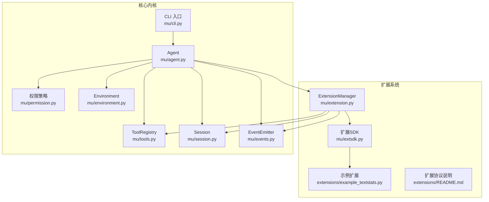
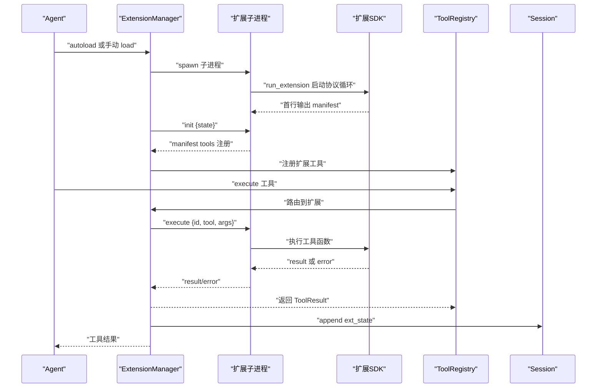
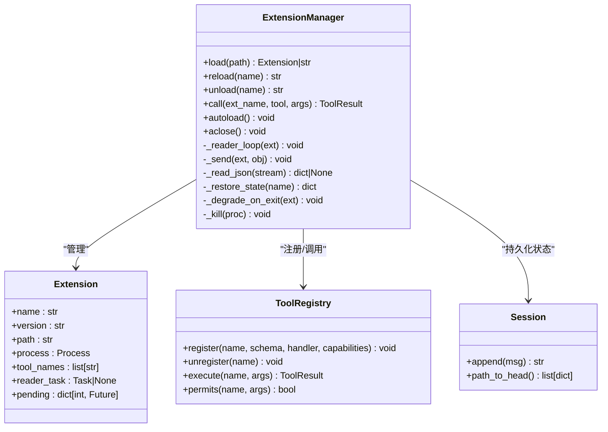
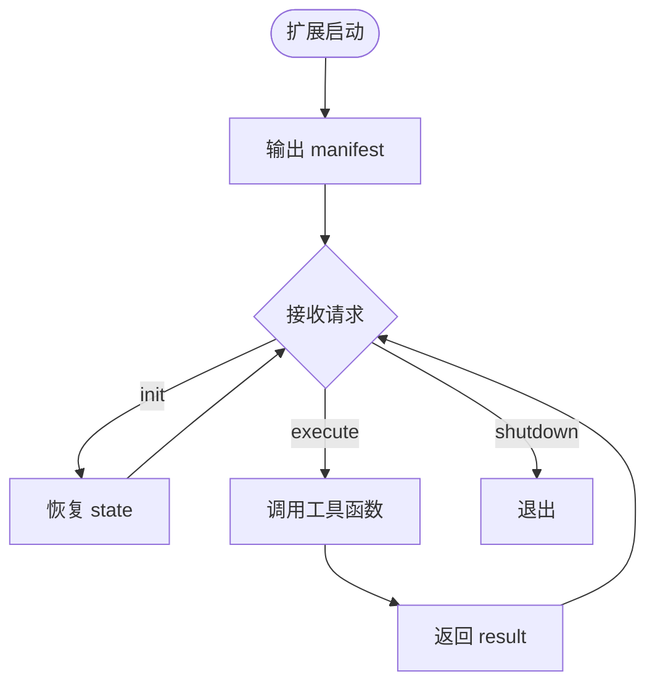
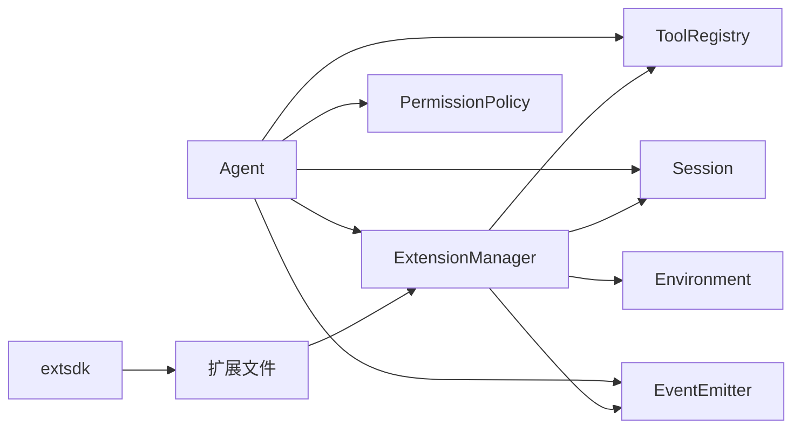

# 扩展系统

<cite>
**本文引用的文件列表**
- [extension.py](file://mu/extension.py)
- [extsdk.py](file://mu/extsdk.py)
- [example_textstats.py](file://extensions/example_textstats.py)
- [README.md](file://extensions/README.md)
- [tools.py](file://mu/tools.py)
- [session.py](file://mu/session.py)
- [events.py](file://mu/events.py)
- [agent.py](file://mu/agent.py)
- [environment.py](file://mu/environment.py)
- [permission.py](file://mu/permission.py)
- [cli.py](file://mu/cli.py)
- [test_extension.py](file://tests/test_extension.py)
</cite>

## 目录
1. [简介](#简介)
2. [项目结构](#项目结构)
3. [核心组件](#核心组件)
4. [架构总览](#架构总览)
5. [组件详解](#组件详解)
6. [依赖关系分析](#依赖关系分析)
7. [性能考量](#性能考量)
8. [故障排查指南](#故障排查指南)
9. [结论](#结论)
10. [附录](#附录)

## 简介
本文件面向 μ (mu) 扩展系统，提供从架构设计到开发实践的全景文档。重点涵盖：
- 扩展管理器的职责与工作原理：子进程隔离、JSONL 协议通信、生命周期管理、自动加载与手动加载。
- 扩展 SDK 的使用方法、API 规范与最佳实践。
- 扩展与主程序的隔离与安全边界说明。
- 与会话管理、权限控制的集成关系。
- 性能优化与错误处理建议。
- 实际扩展开发示例与调试技巧。

## 项目结构
围绕扩展系统的关键文件组织如下：
- 扩展管理与协议：mu/extension.py、extensions/README.md
- 扩展 SDK：mu/extsdk.py、extensions/example_textstats.py
- 工具与权限：mu/tools.py、mu/permission.py
- 会话与事件：mu/session.py、mu/events.py
- 主流程与 CLI：mu/agent.py、mu/cli.py
- 测试与回归：tests/test_extension.py

图表来源
- [extension.py:85-364](file://mu/extension.py#L85-L364)
- [extsdk.py:1-130](file://mu/extsdk.py#L1-L130)
- [example_textstats.py:1-67](file://extensions/example_textstats.py#L1-L67)
- [README.md:1-58](file://extensions/README.md#L1-L58)
- [agent.py:43-76](file://mu/agent.py#L43-L76)
- [tools.py:191-269](file://mu/tools.py#L191-L269)
- [session.py:38-115](file://mu/session.py#L38-L115)
- [events.py:121-133](file://mu/events.py#L121-L133)
- [permission.py:29-68](file://mu/permission.py#L29-L68)
- [environment.py:23-88](file://mu/environment.py#L23-L88)
- [cli.py:51-134](file://mu/cli.py#L51-L134)

章节来源
- [extension.py:1-364](file://mu/extension.py#L1-L364)
- [extsdk.py:1-130](file://mu/extsdk.py#L1-L130)
- [example_textstats.py:1-67](file://extensions/example_textstats.py#L1-L67)
- [README.md:1-58](file://extensions/README.md#L1-L58)
- [agent.py:1-200](file://mu/agent.py#L1-L200)
- [tools.py:1-269](file://mu/tools.py#L1-L269)
- [session.py:1-115](file://mu/session.py#L1-L115)
- [events.py:1-133](file://mu/events.py#L1-L133)
- [permission.py:1-69](file://mu/permission.py#L1-L69)
- [environment.py:1-150](file://mu/environment.py#L1-L150)
- [cli.py:1-134](file://mu/cli.py#L1-L134)

## 核心组件
- ExtensionManager：负责扩展子进程的 spawn、加载、调用、重载、卸载与崩溃降级；维护扩展清单、注册工具、处理 JSONL 协议、持久化扩展状态。
- 扩展 SDK（extsdk）：扩展作者使用的工具集，提供装饰器声明工具、状态读写、日志输出、协议循环启动。
- 示例扩展：展示如何声明工具、使用状态持久化与日志。
- 工具注册表（ToolRegistry）：统一管理内置与扩展工具，执行前进行权限校验。
- 会话（Session）：扩展状态以“ext_state”类型消息追加到会话，支持续跑恢复。
- 事件系统（EventEmitter）：扩展加载/卸载、日志、错误等事件的发布与订阅。
- 权限策略（PermissionPolicy）：基于能力（capabilities）的细粒度权限门控，扩展加载工具默认需要 extension_exec 能力。
- Agent：在运行期自动加载扩展目录中的扩展，提供扩展管理工具（load/reload/list）。

章节来源
- [extension.py:85-364](file://mu/extension.py#L85-L364)
- [extsdk.py:1-130](file://mu/extsdk.py#L1-L130)
- [example_textstats.py:1-67](file://extensions/example_textstats.py#L1-L67)
- [tools.py:191-269](file://mu/tools.py#L191-L269)
- [session.py:38-115](file://mu/session.py#L38-L115)
- [events.py:121-133](file://mu/events.py#L121-L133)
- [permission.py:29-68](file://mu/permission.py#L29-L68)
- [agent.py:43-76](file://mu/agent.py#L43-L76)

## 架构总览
扩展系统采用“主程序 + 子进程扩展”的双进程架构，通过 JSONL 协议进行通信。主程序负责调度与权限控制，扩展进程负责具体工具实现与状态持久化。

图表来源
- [extension.py:131-188](file://mu/extension.py#L131-L188)
- [extsdk.py:111-130](file://mu/extsdk.py#L111-L130)
- [agent.py:82-133](file://mu/agent.py#L82-L133)
- [tools.py:253-269](file://mu/tools.py#L253-L269)
- [session.py:49-54](file://mu/session.py#L49-L54)

## 组件详解

### 扩展管理器（ExtensionManager）
- 职责
  - 子进程管理：spawn、等待 manifest、注册工具、启动 reader 任务、发送 init（携带会话恢复状态）。
  - 调用转发：将工具调用包装为 JSONL execute 请求，等待对应 id 的 result 或 error。
  - 生命周期：load/reload/unload/aclose；崩溃降级：快速解挂 pending、注销工具、发出错误事件。
  - 自动加载：启动时扫描扩展目录，按文件名顺序加载。
- 协议与隔离
  - JSONL 协议：扩展启动即输出 manifest；核心向扩展发送 init/execute/shutdown；扩展向核心发送 result/error/log/state。
  - 进程组隔离：使用 start_new_session 并按进程组 kill，复用环境层的清理思路。
- 状态持久化
  - 扩展通过 set_state 推送状态，核心将其以 ext_state 类型追加到会话；下次加载时通过 init 恢复。
- 事件与错误
  - 通过 EventEmitter 发布 ExtensionLoaded/ExtensionUnloaded/ExtensionLog/ExtensionError 等事件。
- 超时与健壮性
  - manifest 读取与工具调用分别设置超时；崩溃时快速失败并清理。

图表来源
- [extension.py:85-364](file://mu/extension.py#L85-L364)
- [tools.py:191-269](file://mu/tools.py#L191-L269)
- [session.py:38-115](file://mu/session.py#L38-L115)

章节来源
- [extension.py:85-364](file://mu/extension.py#L85-L364)

### 扩展 SDK（extsdk）
- 工具声明
  - 使用装饰器声明工具，生成 OpenAI JSON Schema；支持同步与异步函数。
- 状态管理
  - get_state()/set_state()：读写扩展内部状态；set_state 会广播 state 消息到核心。
- 日志
  - log(level, message)：输出日志到核心事件流。
- 协议循环
  - run_extension(name, version)：输出 manifest，进入请求循环，处理 init/execute/shutdown。

图表来源
- [extsdk.py:111-130](file://mu/extsdk.py#L111-L130)

章节来源
- [extsdk.py:1-130](file://mu/extsdk.py#L1-L130)

### 示例扩展（example_textstats）
- 展示了多工具声明、状态持久化与日志输出。
- 包含 set_prefix/greet 两个工具，演示状态跨会话恢复。

章节来源
- [example_textstats.py:1-67](file://extensions/example_textstats.py#L1-L67)

### 协议与目录约定
- 协议规范详见扩展目录下的 README，明确 JSONL 字段与交互流程。
- 扩展目录默认位于工作目录下的 .mu/extensions，可通过环境变量或构造参数指定。

章节来源
- [README.md:1-58](file://extensions/README.md#L1-L58)
- [extension.py:35-37](file://mu/extension.py#L35-L37)

### 与会话管理的集成
- 扩展状态以 ext_state 消息追加到会话；恢复时通过 init 将状态回灌至扩展。
- Agent 在运行前根据权限策略决定是否自动加载扩展目录。

章节来源
- [extension.py:294-297](file://mu/extension.py#L294-L297)
- [session.py:49-54](file://mu/session.py#L49-L54)
- [agent.py:88-90](file://mu/agent.py#L88-L90)

### 与权限控制的集成
- 扩展管理工具（load/reload/list）默认需要 extension_exec 能力；内置工具具备 read/write/shell 等能力。
- 权限策略基于能力门控，readonly/workspace 等模式可阻止扩展加载与执行。

章节来源
- [extension.py:107-111](file://mu/extension.py#L107-L111)
- [tools.py:183-188](file://mu/tools.py#L183-L188)
- [permission.py:29-68](file://mu/permission.py#L29-L68)

## 依赖关系分析
- ExtensionManager 依赖 ToolRegistry、Session、EventEmitter，间接依赖环境层（用于 bash 等工具）。
- 扩展 SDK 与扩展文件耦合，扩展文件通过 SDK 与核心通信。
- Agent 在运行期装配 ExtensionManager，并根据权限策略控制自动加载。

图表来源
- [extension.py:85-103](file://mu/extension.py#L85-L103)
- [extsdk.py:1-130](file://mu/extsdk.py#L1-L130)
- [agent.py:43-76](file://mu/agent.py#L43-L76)
- [tools.py:191-269](file://mu/tools.py#L191-L269)
- [session.py:38-115](file://mu/session.py#L38-L115)
- [events.py:121-133](file://mu/events.py#L121-L133)
- [permission.py:29-68](file://mu/permission.py#L29-L68)
- [environment.py:23-88](file://mu/environment.py#L23-L88)

章节来源
- [extension.py:85-103](file://mu/extension.py#L85-L103)
- [agent.py:43-76](file://mu/agent.py#L43-L76)

## 性能考量
- 子进程开销：扩展以独立子进程运行，存在进程启动与 IPC 成本。建议：
  - 合理拆分工具，避免单扩展承担过多职责。
  - 使用状态持久化减少重复计算。
- 超时与健壮性：为 manifest 读取与工具调用设置合理超时，崩溃时快速降级并清理。
- I/O 与并发：扩展内的 I/O 应尽量异步化，避免阻塞事件循环。
- 会话写入：状态更新通过 append-only JSONL 写入，注意磁盘 I/O 压力。

## 故障排查指南
- 扩展未产生有效 manifest
  - 现象：加载失败，错误信息包含扩展 stderr。
  - 处理：检查扩展是否正确输出首行 manifest；确认参数与权限。
- 工具名称冲突
  - 现象：注册失败并回滚。
  - 处理：修改工具名或移除冲突扩展。
- 调用超时
  - 现象：工具调用超过超时时间。
  - 处理：优化工具逻辑、增加超时或拆分为多个工具。
- 崩溃降级
  - 现象：扩展进程退出，pending 调用立即返回错误，工具被注销。
  - 处理：修复扩展内部异常，必要时增加日志定位问题。
- 自动加载被拒绝
  - 现象：在 restrictive 策略下不会自动加载扩展。
  - 处理：调整权限策略或手动加载。

章节来源
- [extension.py:145-160](file://mu/extension.py#L145-L160)
- [extension.py:172-181](file://mu/extension.py#L172-L181)
- [extension.py:260-265](file://mu/extension.py#L260-L265)
- [extension.py:299-316](file://mu/extension.py#L299-L316)
- [agent.py:88-90](file://mu/agent.py#L88-L90)

## 结论
μ 的扩展系统通过子进程隔离与 JSONL 协议实现了“自延伸”的能力边界：扩展以与 agent 同等权限运行，既带来灵活性，也要求在 M3.5 引入更严格的权限与沙箱机制。通过工具注册表、事件系统与会话持久化，扩展能够无缝融入主程序的工作流。开发时遵循 SDK 规范、合理使用状态与日志、关注超时与健壮性，是构建高质量扩展的关键。

## 附录

### 开发指南与最佳实践
- 使用装饰器声明工具，参数遵循 OpenAI JSON Schema。
- 使用 set_state 持久化状态，利用会话恢复能力。
- 使用 log 输出日志，避免直接 print。
- 工具函数可同步或异步，返回字符串或二元组（内容, terminate）。
- 避免在扩展中执行高风险操作，遵循最小权限原则。

章节来源
- [extsdk.py:34-109](file://mu/extsdk.py#L34-L109)
- [README.md:34-42](file://extensions/README.md#L34-L42)

### 扩展开发示例
- 参考示例扩展文件，了解工具声明、状态与日志的使用方式。
- 将扩展文件放置于扩展目录，启动时自动加载；也可通过管理工具手动加载与重载。

章节来源
- [example_textstats.py:1-67](file://extensions/example_textstats.py#L1-L67)
- [README.md:25-32](file://extensions/README.md#L25-L32)

### 调试技巧
- 通过事件系统订阅 ExtensionLog/ExtensionError 获取扩展日志与错误。
- 在扩展中使用 log 输出关键路径信息，便于定位问题。
- 使用测试用例验证扩展加载、调用、状态恢复与错误处理。

章节来源
- [events.py:105-116](file://mu/events.py#L105-L116)
- [test_extension.py:87-134](file://tests/test_extension.py#L87-L134)