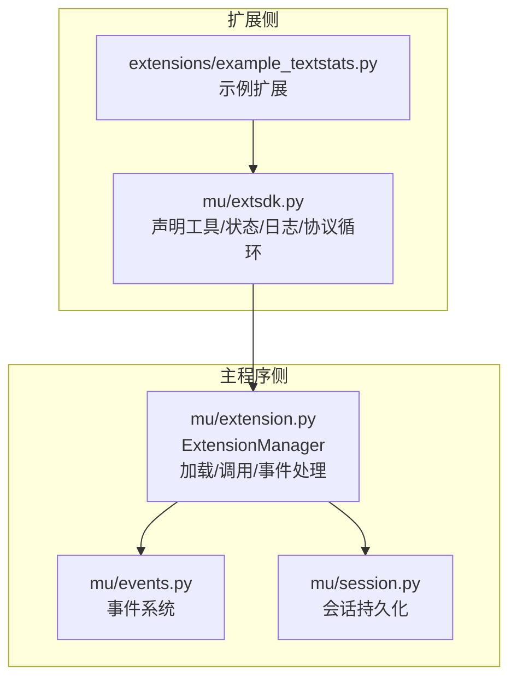
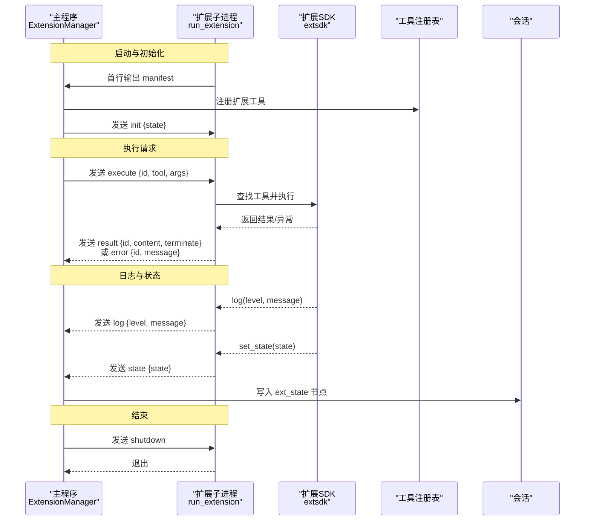
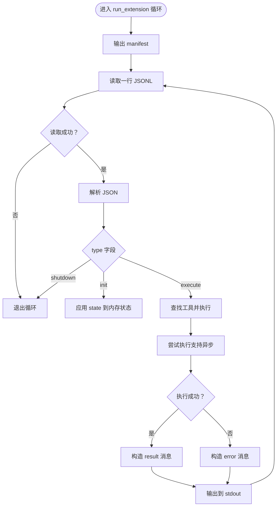
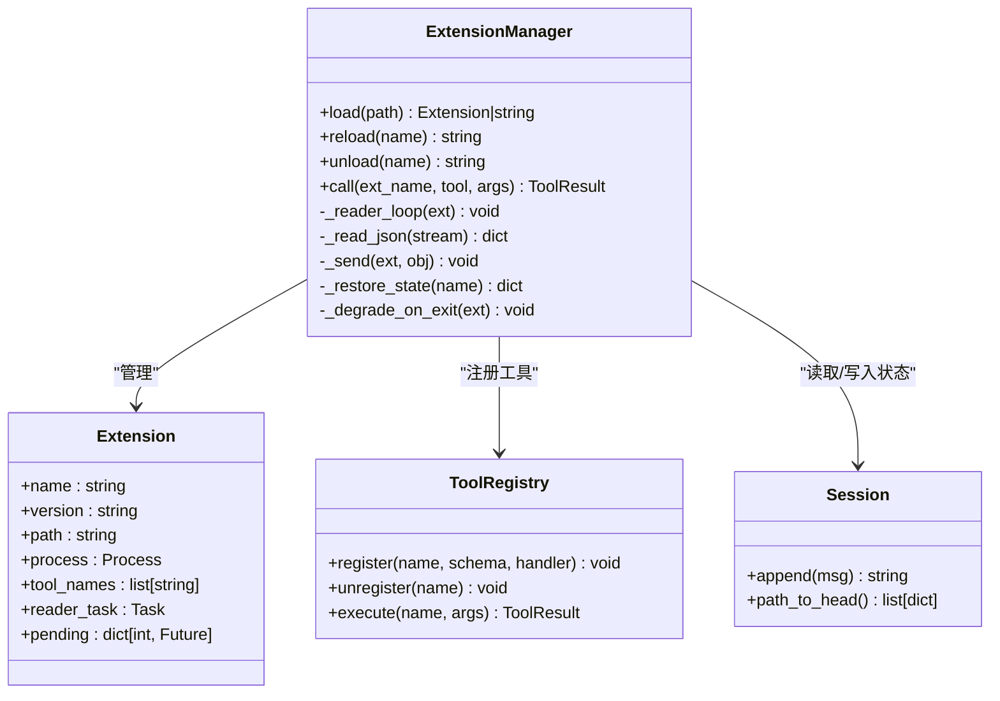
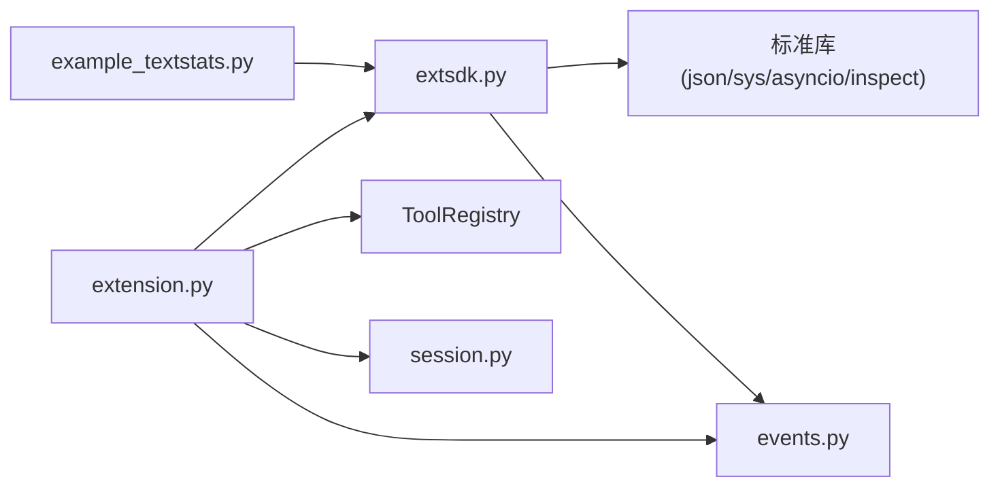

# 扩展通信协议

<cite>
**本文引用的文件**
- [extensions/README.md](file://extensions/README.md)
- [extensions/example_textstats.py](file://extensions/example_textstats.py)
- [mu/extsdk.py](file://mu/extsdk.py)
- [mu/extension.py](file://mu/extension.py)
- [mu/events.py](file://mu/events.py)
- [mu/session.py](file://mu/session.py)
- [tests/test_extension.py](file://tests/test_extension.py)
</cite>

## 目录
1. [简介](#简介)
2. [项目结构](#项目结构)
3. [核心组件](#核心组件)
4. [架构总览](#架构总览)
5. [详细组件分析](#详细组件分析)
6. [依赖分析](#依赖分析)
7. [性能考量](#性能考量)
8. [故障排查指南](#故障排查指南)
9. [结论](#结论)
10. [附录](#附录)

## 简介
本文件系统性阐述 μ（Pi）项目的“扩展通信协议”，重点覆盖以下内容：
- JSONL 协议的工作原理与消息格式
- 协议字段定义与消息类型规范
- 主程序与扩展子进程之间的双向通信机制（初始化、执行请求、结果返回、状态同步、日志与错误）
- 协议实现最佳实践与错误处理策略
- 版本兼容性与向后兼容性考虑
- 协议调试与测试方法

该协议采用 JSONL（每行一条 JSON 对象）通过标准输入/输出进行通信，扩展以独立子进程运行，具备崩溃快速降级、状态持久化与事件回流等特性。

## 项目结构
围绕扩展通信协议的关键文件与职责如下：
- 协议规范与示例：extensions/README.md、extensions/example_textstats.py
- 扩展 SDK：mu/extsdk.py（声明工具、状态、日志、协议循环）
- 扩展管理器：mu/extension.py（加载/调用/重载/卸载扩展子进程，解析 JSONL，事件派发）
- 事件系统：mu/events.py（扩展加载/卸载/日志/错误事件）
- 会话持久化：mu/session.py（扩展状态写入会话，支持 resume 恢复）

图表来源
- [mu/extsdk.py:1-130](file://mu/extsdk.py#L1-L130)
- [mu/extension.py:1-364](file://mu/extension.py#L1-L364)
- [extensions/README.md:1-58](file://extensions/README.md#L1-L58)
- [extensions/example_textstats.py:1-67](file://extensions/example_textstats.py#L1-L67)
- [mu/events.py:1-133](file://mu/events.py#L1-L133)
- [mu/session.py:1-115](file://mu/session.py#L1-L115)

章节来源
- [extensions/README.md:1-58](file://extensions/README.md#L1-L58)
- [extensions/example_textstats.py:1-67](file://extensions/example_textstats.py#L1-L67)
- [mu/extsdk.py:1-130](file://mu/extsdk.py#L1-L130)
- [mu/extension.py:1-364](file://mu/extension.py#L1-L364)
- [mu/events.py:1-133](file://mu/events.py#L1-L133)
- [mu/session.py:1-115](file://mu/session.py#L1-L115)

## 核心组件
- 扩展 SDK（mu/extsdk.py）
  - 提供 @tool 装饰器声明工具，生成工具清单（manifest）
  - 提供 set_state/get_state 实现状态持久化与回流
  - 提供 log 输出日志，回流到事件系统
  - 提供 run_extension 启动协议循环（首行输出 manifest，随后处理 core 请求）
- 扩展管理器（mu/extension.py）
  - 负责 spawn 子进程、读取 manifest、注册工具、发送 init、发起 execute、解析 result/error/log/state
  - 维护 pending Future 映射，超时与崩溃时快速降级
  - 将 state 写入会话，支持 resume 恢复
- 事件系统（mu/events.py）
  - 扩展加载/卸载/日志/错误事件，供 UI/TUI/统计模块订阅
- 会话持久化（mu/session.py）
  - 以 JSONL 追加存储，支持扩展状态节点（ext_state）写入与恢复

章节来源
- [mu/extsdk.py:34-130](file://mu/extsdk.py#L34-L130)
- [mu/extension.py:85-364](file://mu/extension.py#L85-L364)
- [mu/events.py:91-133](file://mu/events.py#L91-L133)
- [mu/session.py:38-115](file://mu/session.py#L38-L115)

## 架构总览
扩展与主程序之间通过 JSONL 协议进行双向通信，核心流程如下：
- 启动阶段：扩展在 stdout 首行输出 manifest；主程序读取并注册工具，发送 init（携带会话恢复的状态）
- 执行阶段：主程序发送 execute（带 id、tool、args），扩展执行后返回 result 或 error；扩展也可主动发送 log、state
- 状态同步：扩展 set_state 会触发 state 消息，主程序将其写入会话，后续 resume 时恢复
- 错误与日志：error 与 log 消息通过事件系统回流，便于观测与诊断
- 结束阶段：主程序发送 shutdown 或扩展自退出，管理器负责清理与降级

图表来源
- [extensions/README.md:44-49](file://extensions/README.md#L44-L49)
- [mu/extension.py:131-188](file://mu/extension.py#L131-L188)
- [mu/extension.py:251-266](file://mu/extension.py#L251-L266)
- [mu/extension.py:275-300](file://mu/extension.py#L275-L300)
- [mu/extsdk.py:67-109](file://mu/extsdk.py#L67-L109)
- [mu/session.py:49-54](file://mu/session.py#L49-L54)

## 详细组件分析

### 协议规范与消息类型
- 协议形式：JSONL（每行一个 JSON 对象），通过 stdin/stdout 通信
- 消息类型与用途
  - manifest：扩展启动后首行输出，包含 name、version、tools、permissions
  - init：主程序发送，携带会话恢复的状态 state
  - execute：主程序发送，包含 id、tool、args
  - result：扩展返回，包含 id、content、terminate
  - error：扩展返回，包含 id、message
  - log：扩展返回，包含 level、message
  - state：扩展返回，包含 state，主程序写入会话
  - shutdown：主程序发送，通知扩展退出

字段定义与约束
- id：整数型请求标识，用于匹配请求与响应
- tool：字符串，工具名称，需与 manifest 中一致
- args：对象，工具参数（OpenAI JSON Schema）
- content：字符串，工具返回值
- terminate：布尔，是否终止当前会话
- message：字符串，错误或日志消息
- level：字符串，日志级别（如 info）
- state：对象，扩展状态字典
- name/version：字符串，扩展元信息
- tools：数组，工具清单（函数模式）
- permissions：数组，权限集合

章节来源
- [extensions/README.md:44-49](file://extensions/README.md#L44-L49)
- [mu/extsdk.py:76-83](file://mu/extsdk.py#L76-L83)
- [mu/extension.py:186](file://mu/extension.py#L186)
- [mu/extension.py:259](file://mu/extension.py#L259)
- [mu/extension.py:282-297](file://mu/extension.py#L282-L297)
- [mu/extsdk.py:60-68](file://mu/extsdk.py#L60-L68)

### 扩展 SDK（mu/extsdk.py）
- 工具声明：@tool 装饰器生成工具 schema 并注册，支持 permissions
- 状态管理：set_state 触发 state 消息并更新内存状态；get_state 返回当前状态
- 日志输出：log(level, message) 将日志消息回流到事件系统
- 协议循环：run_extension 首行输出 manifest，随后循环读取 stdin 请求，处理 init/execute/shutdown
- 错误处理：未知工具与异常均转换为 error 消息返回

图表来源
- [mu/extsdk.py:111-130](file://mu/extsdk.py#L111-L130)
- [mu/extsdk.py:86-109](file://mu/extsdk.py#L86-L109)
- [mu/extsdk.py:60-68](file://mu/extsdk.py#L60-L68)

章节来源
- [mu/extsdk.py:34-130](file://mu/extsdk.py#L34-L130)

### 扩展管理器（mu/extension.py）
- 生命周期管理：spawn 子进程、读取 manifest、注册工具、发送 init、卸载与清理
- 调用机制：分配 id、创建 Future、发送 execute、等待 result/error、超时与崩溃快速降级
- 事件与状态：解析 log/error 并派发事件；解析 state 写入会话；崩溃时注销工具并上报错误
- 会话恢复：从会话历史中提取 ext_state，作为 init 的 state 传递给扩展

图表来源
- [mu/extension.py:85-364](file://mu/extension.py#L85-L364)

章节来源
- [mu/extension.py:85-364](file://mu/extension.py#L85-L364)

### 示例扩展（extensions/example_textstats.py）
- 使用 @tool 声明多个工具：word_count、reverse_text、set_prefix、greet
- 展示状态持久化：set_prefix 写入状态，greet 读取并拼接问候语
- 展示日志输出：word_count 内部 log 计数结果
- 作为独立子进程运行：通过 run_extension(name, version) 启动协议循环

章节来源
- [extensions/example_textstats.py:9-67](file://extensions/example_textstats.py#L9-L67)

### 事件系统与会话持久化
- 事件系统：扩展加载/卸载/日志/错误事件，供订阅者消费
- 会话持久化：扩展 state 以 ext_state 节点写入会话，支持 resume 恢复

章节来源
- [mu/events.py:91-133](file://mu/events.py#L91-L133)
- [mu/session.py:49-54](file://mu/session.py#L49-L54)
- [mu/extension.py:294-297](file://mu/extension.py#L294-L297)

## 依赖分析
- 扩展 SDK 依赖 Python 标准库（json、sys、asyncio、inspect）与主程序事件系统
- 扩展管理器依赖 asyncio、json、os、signal、ToolRegistry、Session、EventEmitter
- 示例扩展依赖扩展 SDK

图表来源
- [mu/extsdk.py:22-28](file://mu/extsdk.py#L22-L28)
- [mu/extension.py:21-29](file://mu/extension.py#L21-L29)
- [extensions/example_textstats.py:6](file://extensions/example_textstats.py#L6)

章节来源
- [mu/extsdk.py:22-28](file://mu/extsdk.py#L22-L28)
- [mu/extension.py:21-29](file://mu/extension.py#L21-L29)
- [extensions/example_textstats.py:6](file://extensions/example_textstats.py#L6)

## 性能考量
- JSONL 逐行读写，避免缓冲阻塞，适合高吞吐场景
- 扩展子进程隔离，避免共享内存竞争，但进程间通信存在开销
- 超时控制：加载 manifest 与工具调用分别设置超时，防止阻塞
- 异步执行：扩展工具支持异步，SDK 内部自动调度
- 崩溃快速降级：扩展退出时立即清理 pending，减少等待时间

章节来源
- [mu/extension.py:31-32](file://mu/extension.py#L31-L32)
- [mu/extension.py:146-150](file://mu/extension.py#L146-L150)
- [mu/extension.py:261](file://mu/extension.py#L261)
- [mu/extsdk.py:100-101](file://mu/extsdk.py#L100-L101)

## 故障排查指南
- 扩展未输出有效 manifest
  - 现象：主程序无法注册工具，抛出“未产生有效 manifest”错误
  - 排查：确认扩展首行输出 manifest；检查扩展进程是否正常退出
- 工具名称冲突
  - 现象：扩展工具与已有工具重名导致加载失败
  - 排查：修改工具名或卸载冲突扩展
- 调用超时
  - 现象：工具执行超过超时时间，返回错误
  - 排查：优化工具逻辑、增加并发或调整超时阈值
- 扩展崩溃
  - 现象：调用期间扩展进程退出，pending 立即返回错误并注销工具
  - 排查：查看扩展内部异常日志，修复崩溃点
- 日志与错误回流
  - 现象：扩展 log/error 通过事件系统回流
  - 排查：订阅事件流定位问题

章节来源
- [mu/extension.py:146-160](file://mu/extension.py#L146-L160)
- [mu/extension.py:172-181](file://mu/extension.py#L172-L181)
- [mu/extension.py:261](file://mu/extension.py#L261)
- [mu/extension.py:301-316](file://mu/extension.py#L301-L316)
- [tests/test_extension.py:122-134](file://tests/test_extension.py#L122-L134)
- [tests/test_extension.py:163-186](file://tests/test_extension.py#L163-L186)

## 结论
本协议以 JSONL 为基础，结合扩展 SDK 与扩展管理器，实现了稳定、可观测且可扩展的双向通信机制。通过 manifest、init、execute、result、error、log、state、shutdown 等消息类型，满足了工具动态注册、状态持久化、日志回流与崩溃快速降级等需求。配合事件系统与会话持久化，能够支撑复杂场景下的调试与复盘。

## 附录

### 协议字段与消息类型速查
- manifest：name、version、tools、permissions
- init：state
- execute：id、tool、args
- result：id、content、terminate
- error：id、message
- log：level、message
- state：state
- shutdown：无

章节来源
- [extensions/README.md:44-49](file://extensions/README.md#L44-L49)

### 最佳实践
- 工具参数使用 OpenAI JSON Schema 描述，保证一致性与可验证性
- 工具返回值统一为字符串；如需终止会话，返回二元组 (content, terminate)
- 使用 log 输出关键中间状态，便于调试与审计
- 使用 set_state 持久化关键状态，确保 resume 场景可用
- 避免在扩展中直接使用 print，改用 log，防止污染协议通道
- 对可能耗时的工具实现超时与异步执行

章节来源
- [extensions/README.md:34-42](file://extensions/README.md#L34-L42)
- [mu/extsdk.py:67-68](file://mu/extsdk.py#L67-L68)
- [mu/extsdk.py:105-108](file://mu/extsdk.py#L105-L108)

### 版本兼容性与向后兼容性
- 协议基于 JSONL 与固定字段集，新增字段建议向后兼容（忽略未知字段）
- 扩展版本号仅用于标识与展示，不影响协议交互
- 若未来扩展字段，建议保持现有字段不变，避免破坏既有扩展

章节来源
- [extensions/README.md:44-49](file://extensions/README.md#L44-L49)
- [mu/extsdk.py:76-83](file://mu/extsdk.py#L76-L83)

### 调试与测试方法
- 单元测试覆盖：加载/调用/日志/状态/错误/崩溃降级/重名冲突/自动加载等
- 离线测试：使用示例扩展文件，验证完整协议往返
- 事件订阅：订阅 ExtensionLog/ExtensionError 等事件，实时观察扩展行为
- 会话恢复：先执行 set_prefix，再 resume 验证状态恢复

章节来源
- [tests/test_extension.py:68-84](file://tests/test_extension.py#L68-L84)
- [tests/test_extension.py:87-99](file://tests/test_extension.py#L87-L99)
- [tests/test_extension.py:101-120](file://tests/test_extension.py#L101-L120)
- [tests/test_extension.py:122-134](file://tests/test_extension.py#L122-L134)
- [tests/test_extension.py:163-186](file://tests/test_extension.py#L163-L186)
- [tests/test_extension.py:188-211](file://tests/test_extension.py#L188-L211)
- [tests/test_extension.py:228-245](file://tests/test_extension.py#L228-L245)