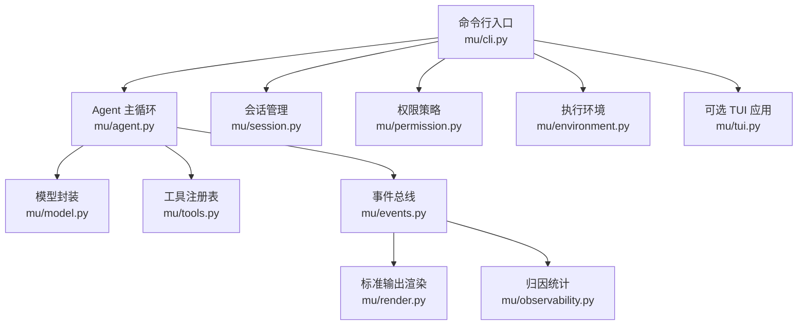
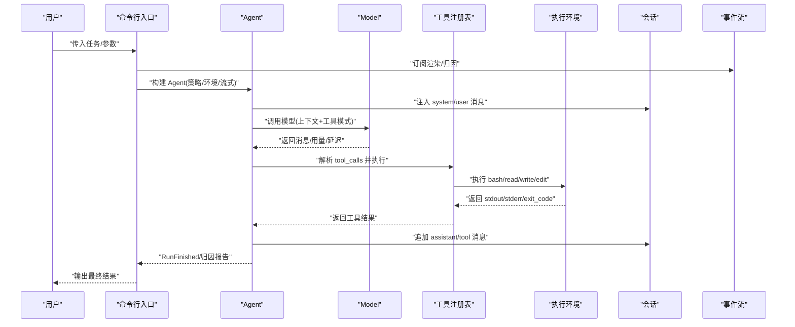
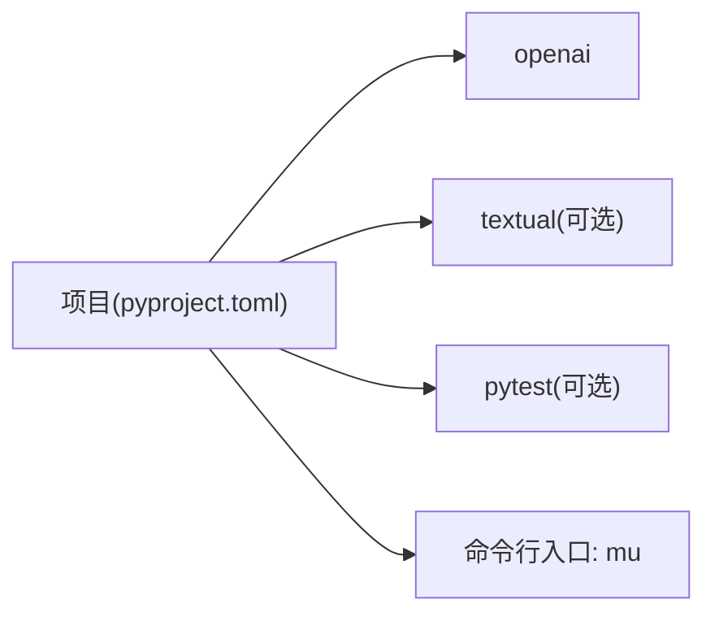

# 故障排除

<cite>
**本文引用的文件**
- [README.md](file://README.md)
- [pyproject.toml](file://pyproject.toml)
- [mu/__main__.py](file://mu/__main__.py)
- [mu/cli.py](file://mu/cli.py)
- [mu/agent.py](file://mu/agent.py)
- [mu/model.py](file://mu/model.py)
- [mu/session.py](file://mu/session.py)
- [mu/events.py](file://mu/events.py)
- [mu/observability.py](file://mu/observability.py)
- [mu/tools.py](file://mu/tools.py)
- [mu/environment.py](file://mu/environment.py)
- [mu/permission.py](file://mu/permission.py)
- [mu/render.py](file://mu/render.py)
- [tests/test_agent_loop.py](file://tests/test_agent_loop.py)
</cite>

## 目录
1. [简介](#简介)
2. [项目结构](#项目结构)
3. [核心组件](#核心组件)
4. [架构总览](#架构总览)
5. [详细组件分析](#详细组件分析)
6. [依赖分析](#依赖分析)
7. [性能考虑](#性能考虑)
8. [故障排除指南](#故障排除指南)
9. [结论](#结论)
10. [附录](#附录)

## 简介
本指南面向 μ (mu) 项目的使用者与维护者，系统化梳理安装、配置、运行与扩展过程中的常见问题与解决方案，提供可操作的问题诊断流程、日志与错误信息解读方法、性能排查与优化建议，并给出社区支持与问题反馈渠道。文档同时结合代码结构与事件流设计，帮助读者快速定位问题根因。

## 项目结构
μ 采用“核心内核 + 事件流 + 工具与权限 + 会话持久化”的模块化组织方式。命令行入口负责参数解析、会话构建、事件订阅者装配与运行调度；Agent 负责主循环与工具调用；Model 封装 OpenAI 兼容接口；Tools 提供四工具与注册表；Session 以树形 JSONL 持久化；Events/Render/Observability 提供可观测性与渲染；Environment/Permission 提供执行与权限控制；TUI 作为可选 UI。

图表来源
- [mu/cli.py:1-134](file://mu/cli.py#L1-L134)
- [mu/agent.py:1-223](file://mu/agent.py#L1-L223)
- [mu/model.py:1-147](file://mu/model.py#L1-L147)
- [mu/tools.py:1-269](file://mu/tools.py#L1-L269)
- [mu/session.py:1-115](file://mu/session.py#L1-L115)
- [mu/events.py:1-133](file://mu/events.py#L1-L133)
- [mu/observability.py:1-90](file://mu/observability.py#L1-L90)
- [mu/render.py:1-78](file://mu/render.py#L1-L78)

章节来源
- [README.md:1-127](file://README.md#L1-L127)
- [pyproject.toml:1-32](file://pyproject.toml#L1-L32)

## 核心组件
- 命令行入口与运行控制：解析参数、装配事件订阅者、构建会话与策略、调度主循环。
- Agent 主循环：上下文转换、模型调用、工具执行、事件发射、取消与恢复。
- Model：封装异步 OpenAI 兼容客户端，支持流式与非流式，返回带用量与延迟的结果。
- Tools：四工具（read/write/edit/bash）与注册表，统一返回字符串或 ToolResult，支持权限能力门控。
- Session：树形消息持久化（JSONL），支持分支与摘要，提供路径查询与加载。
- Events/Render/Observability：事件数据类、事件总线、标准输出渲染、归因统计。
- Environment/Permission：本地与 Docker 执行环境抽象、基于能力的权限策略。
- TUI：可选交互式终端界面，共享同一内核。

章节来源
- [mu/cli.py:1-134](file://mu/cli.py#L1-L134)
- [mu/agent.py:1-223](file://mu/agent.py#L1-L223)
- [mu/model.py:1-147](file://mu/model.py#L1-L147)
- [mu/tools.py:1-269](file://mu/tools.py#L1-L269)
- [mu/session.py:1-115](file://mu/session.py#L1-L115)
- [mu/events.py:1-133](file://mu/events.py#L1-L133)
- [mu/observability.py:1-90](file://mu/observability.py#L1-L90)
- [mu/render.py:1-78](file://mu/render.py#L1-L78)
- [mu/environment.py:1-150](file://mu/environment.py#L1-L150)
- [mu/permission.py:1-69](file://mu/permission.py#L1-L69)

## 架构总览
μ 的运行时由“命令行 → Agent → Model/Tools → Environment → Session/Events”构成，事件流贯穿始终，既用于渲染输出，也用于归因统计与可观测性。

图表来源
- [mu/cli.py:51-134](file://mu/cli.py#L51-L134)
- [mu/agent.py:82-163](file://mu/agent.py#L82-L163)
- [mu/model.py:112-147](file://mu/model.py#L112-L147)
- [mu/tools.py:253-269](file://mu/tools.py#L253-L269)
- [mu/environment.py:26-88](file://mu/environment.py#L26-L88)
- [mu/session.py:49-72](file://mu/session.py#L49-L72)
- [mu/events.py:18-84](file://mu/events.py#L18-L84)

## 详细组件分析

### 命令行与运行控制（mu/cli.py）
- 参数解析：支持任务、续跑/分支、流式输出、TUI、code-action、权限策略、沙箱类型。
- 会话构建：支持从已有会话 ID 加载并可选从指定节点分支。
- 错误处理：捕获配置错误、键盘中断、会话加载失败；返回相应退出码。
- TUI 预检：在进入 TUI 前预检模型配置，避免首次交互才报错。

章节来源
- [mu/cli.py:26-83](file://mu/cli.py#L26-L83)
- [mu/cli.py:86-112](file://mu/cli.py#L86-L112)
- [mu/cli.py:115-134](file://mu/cli.py#L115-L134)

### Agent 主循环（mu/agent.py）
- 上下文管线：将当前分支路径转换为 LLM 输入。
- 模型调用：支持流式增量回调；非流式一次性输出。
- 工具执行：顺序执行 tool_calls，记录每个调用的耗时与是否终止；取消时补全未执行工具的错误结果以保证会话一致性。
- 分支摘要：将侧分支结论带回主线，供上下文注入。

章节来源
- [mu/agent.py:82-163](file://mu/agent.py#L82-L163)
- [mu/agent.py:165-174](file://mu/agent.py#L165-L174)

### 模型封装（mu/model.py）
- 配置校验：必须设置模型与密钥，否则抛出配置错误。
- 流式处理：聚合增量文本与工具调用槽位，支持 on_delta 回调。
- 结果封装：返回消息、用量与延迟，供归因统计使用。

章节来源
- [mu/model.py:19-110](file://mu/model.py#L19-L110)
- [mu/model.py:52-88](file://mu/model.py#L52-L88)
- [mu/model.py:112-147](file://mu/model.py#L112-L147)

### 工具与权限（mu/tools.py, mu/permission.py）
- 工具规范：统一返回字符串或 ToolResult，错误转字符串，便于模型自纠错。
- 注册表：内置四工具，支持动态注册扩展工具；按能力门控，避免误用高风险能力。
- 权限策略：allow_all、readonly、workspace_write；对 bash/code/扩展加载等能力进行严格限制。

章节来源
- [mu/tools.py:19-36](file://mu/tools.py#L19-L36)
- [mu/tools.py:191-269](file://mu/tools.py#L191-L269)
- [mu/permission.py:29-68](file://mu/permission.py#L29-L68)

### 会话与事件（mu/session.py, mu/events.py, mu/render.py, mu/observability.py）
- 会话：树形 JSONL 持久化，支持分支与摘要；提供路径查询与加载。
- 事件：结构化事件数据类，事件总线同步分发；渲染器与归因统计订阅事件。
- 归因：统计轮数、LLM/工具耗时、token 使用与工具明细；可选估算成本。

章节来源
- [mu/session.py:38-115](file://mu/session.py#L38-L115)
- [mu/events.py:18-116](file://mu/events.py#L18-L116)
- [mu/render.py:31-78](file://mu/render.py#L31-L78)
- [mu/observability.py:26-90](file://mu/observability.py#L26-L90)

### 执行环境（mu/environment.py）
- 本地执行：文件读写与 bash 子进程，超时按进程组清理。
- Docker 沙箱：实验性实现，仅对 bash 放入容器，文件工具仍宿主 IO。

章节来源
- [mu/environment.py:23-88](file://mu/environment.py#L23-L88)
- [mu/environment.py:99-149](file://mu/environment.py#L99-L149)

## 依赖分析
- 运行时依赖：openai 异步 SDK。
- 可选依赖：textual（TUI）、pytest（测试）。
- 入口脚本：通过命令行入口暴露可执行程序。

图表来源
- [pyproject.toml:10-21](file://pyproject.toml#L10-L21)
- [pyproject.toml:23-24](file://pyproject.toml#L23-L24)

章节来源
- [pyproject.toml:1-32](file://pyproject.toml#L1-L32)

## 性能考虑
- 事件流与归因：通过事件订阅者统计轮数、LLM/工具耗时与 token 使用，便于定位瓶颈。
- 流式输出：开启流式可降低首字节延迟，但会增加事件分发开销。
- 工具执行：文件读写与 bash 执行在异步事件循环中通过线程/子进程 offload，避免阻塞。
- 模型调用：尽量减少不必要的工具调用轮次，合理使用 code-action 以合并工具调用。

章节来源
- [mu/observability.py:45-65](file://mu/observability.py#L45-L65)
- [mu/agent.py:100-111](file://mu/agent.py#L100-L111)
- [mu/environment.py:26-48](file://mu/environment.py#L26-L48)

## 故障排除指南

### 一、安装与环境问题
- 症状：安装后无法运行或缺少 TUI。
  - 排查要点：
    - 确认使用推荐的开发安装方式，包含可选依赖。
    - 如需 TUI，安装包含 textual 的可选依赖。
  - 解决方案：
    - 使用项目提供的安装命令安装开发与可选依赖。
    - 若出现导入错误，确认已安装可选依赖。

章节来源
- [README.md:13-18](file://README.md#L13-L18)
- [pyproject.toml:14-21](file://pyproject.toml#L14-L21)
- [mu/cli.py:94-103](file://mu/cli.py#L94-L103)

### 二、配置错误（模型与密钥）
- 症状：启动时报配置错误，提示缺少模型或密钥。
  - 根因：未设置必需的环境变量。
  - 解决方案：
    - 设置模型与密钥环境变量，或使用 .env 并显式加载。
    - 支持多种兼容端点（百炼、DeepSeek、OpenAI）。

章节来源
- [README.md:20-41](file://README.md#L20-L41)
- [mu/model.py:98-110](file://mu/model.py#L98-L110)
- [mu/cli.py:87-93](file://mu/cli.py#L87-L93)

### 三、运行时异常与中断
- 症状：运行中 Ctrl-C 中断、工具执行超时、会话加载失败。
  - 中断处理：捕获键盘中断并返回特定退出码，确保资源清理。
  - 工具超时：bash 超时按进程组清理，返回超时错误码。
  - 会话加载：续跑时若会话文件不存在或节点 ID 无效，抛出相应错误。
  - 解决方案：
    - 合理设置工具超时时间。
    - 确保会话 ID 与节点 ID 正确。
    - 使用归因报告定位耗时长的环节。

章节来源
- [mu/cli.py:77-83](file://mu/cli.py#L77-L83)
- [mu/environment.py:36-48](file://mu/environment.py#L36-L48)
- [mu/session.py:98-114](file://mu/session.py#L98-L114)
- [mu/observability.py:66-90](file://mu/observability.py#L66-L90)

### 四、权限与沙箱限制
- 症状：工具被拒绝、无法加载扩展、write 被限制在工作区之外。
  - 根因：权限策略限制了相关能力。
  - 解决方案：
    - readonly 模式下禁止写、编辑、bash、code、扩展加载。
    - workspace 模式下仅允许在工作区内写入，且 bash/code/扩展加载不可被限制。
    - 沙箱 docker 仅对 bash 容器化，文件工具仍宿主 IO。

章节来源
- [README.md:84-96](file://README.md#L84-L96)
- [mu/permission.py:29-68](file://mu/permission.py#L29-L68)
- [mu/environment.py:99-149](file://mu/environment.py#L99-L149)

### 五、工具调用与参数问题
- 症状：工具返回错误、参数缺失、JSON 解析失败。
  - 根因：参数缺失或 JSON 不合法、工具名未知、权限拒绝。
  - 解决方案：
    - 检查工具参数是否齐全与格式正确。
    - 确认工具名拼写与权限策略允许。
    - 使用流式输出观察增量文本，辅助定位问题。

章节来源
- [mu/tools.py:253-269](file://mu/tools.py#L253-L269)
- [mu/agent.py:142-147](file://mu/agent.py#L142-L147)
- [mu/render.py:36-78](file://mu/render.py#L36-L78)

### 六、会话与分支问题
- 症状：续跑失败、分支节点不存在、会话文件损坏。
  - 根因：会话文件不存在、节点 ID 无效。
  - 解决方案：
    - 确认会话 ID 与节点 ID 正确。
    - 使用默认从最后叶子续跑策略。
    - 分支后注意将侧分支摘要带回主线。

章节来源
- [mu/cli.py:42-48](file://mu/cli.py#L42-L48)
- [mu/session.py:90-94](file://mu/session.py#L90-L94)
- [mu/session.py:98-114](file://mu/session.py#L98-L114)

### 七、日志分析与错误解读
- 日志来源：事件流渲染器输出人类可读的交互日志；归因统计输出运行成本与耗时。
- 常见错误标签：
  - “[aborted: ...]”：运行被中断。
  - “[error: ...]”：通用错误事件。
  - “🧩 loaded/unloaded/log/error”：扩展生命周期与错误。
- 解读建议：
  - 结合归因报告查看轮数、LLM/工具耗时与 token 使用。
  - 观察工具调用耗时与次数，定位热点工具。
  - 在流式模式下关注增量输出，快速定位模型生成阶段的问题。

章节来源
- [mu/render.py:36-78](file://mu/render.py#L36-L78)
- [mu/observability.py:66-90](file://mu/observability.py#L66-L90)
- [mu/events.py:82-116](file://mu/events.py#L82-L116)

### 八、性能问题排查与优化
- 排查步骤：
  - 查看归因报告，识别高耗时轮次与工具。
  - 检查是否频繁触发工具调用，尝试合并为一次 code-action。
  - 评估是否需要开启流式输出，权衡延迟与事件开销。
  - 检查 bash 超时与进程组清理是否导致中断。
- 优化建议：
  - 减少不必要的工具调用轮次。
  - 使用更合适的权限策略，避免过度拒绝导致反复尝试。
  - 在 Docker 沙箱中运行 bash，避免宿主环境干扰。

章节来源
- [mu/observability.py:45-65](file://mu/observability.py#L45-L65)
- [mu/agent.py:100-111](file://mu/agent.py#L100-L111)
- [mu/environment.py:36-48](file://mu/environment.py#L36-L48)

### 九、实际故障案例与解决过程
- 案例 1：工具执行中被取消，会话残留悬空 tool_call。
  - 现象：取消后会话中存在未完成的工具调用。
  - 根因：取消发生在工具执行阶段。
  - 解决：Agent 在取消时补全剩余工具调用的错误结果，保证协议完整性。
- 案例 2：多工具调用在同一轮次中执行。
  - 现象：会话中出现连续的 tool 消息。
  - 根因：模型一次返回多个 tool_calls。
  - 解决：顺序执行并记录每个调用的耗时与结果。
- 案例 3：侧分支摘要带回主线。
  - 现象：主线路径包含侧分支结论摘要。
  - 根因：分支摘要注入上下文。
  - 解决：使用分支摘要功能将结论带回主线，避免重复工作。

章节来源
- [tests/test_agent_loop.py:180-203](file://tests/test_agent_loop.py#L180-L203)
- [tests/test_agent_loop.py:107-128](file://tests/test_agent_loop.py#L107-L128)
- [tests/test_agent_loop.py:205-225](file://tests/test_agent_loop.py#L205-L225)
- [mu/agent.py:175-198](file://mu/agent.py#L175-L198)

### 十、社区支持与问题反馈
- 获取帮助：
  - 查阅项目说明与安装/配置指引。
  - 使用归因报告与事件日志辅助定位问题。
- 反馈渠道：
  - 通过项目文档中提供的说明进行问题反馈（如适用）。
  - 在具备社区支持的情况下，遵循社区规范提交 Issue。

章节来源
- [README.md:1-127](file://README.md#L1-L127)

## 结论
本指南围绕 μ 项目的安装、配置、运行与扩展，提供了系统化的故障排除流程与调试技巧。通过理解事件流、权限与工具机制、会话持久化与归因统计，用户可以快速定位问题并采取针对性优化措施。建议在日常使用中充分利用归因报告与事件日志，形成持续改进的运维闭环。

## 附录

### A. 常见退出码与含义
- 1：配置错误或会话错误。
- 2：缺少任务参数。
- 130：用户中断（Ctrl-C）。

章节来源
- [mu/cli.py:62-83](file://mu/cli.py#L62-L83)

### B. 事件流与渲染对照
- RunStarted/RunFinished/RunAborted：任务开始/结束/中止。
- TurnStarted/TurnFinished：轮次开始/结束。
- ModelCallStarted/ModelCallFinished：模型调用开始/结束（含用量与延迟）。
- AssistantText/AssistantTextDelta：助手文本一次性/增量输出。
- ToolCallStarted/ToolCallFinished：工具调用开始/结束（含耗时与终止标志）。
- ExtensionLoaded/ExtensionUnloaded/ExtensionLog/ExtensionError：扩展生命周期与日志/错误。

章节来源
- [mu/events.py:18-116](file://mu/events.py#L18-L116)
- [mu/render.py:36-78](file://mu/render.py#L36-L78)