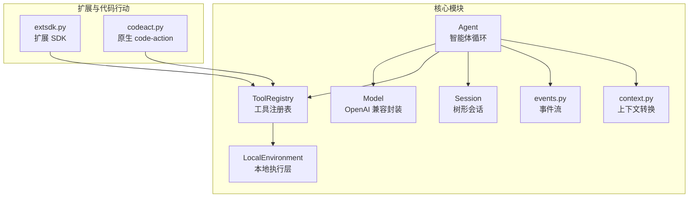
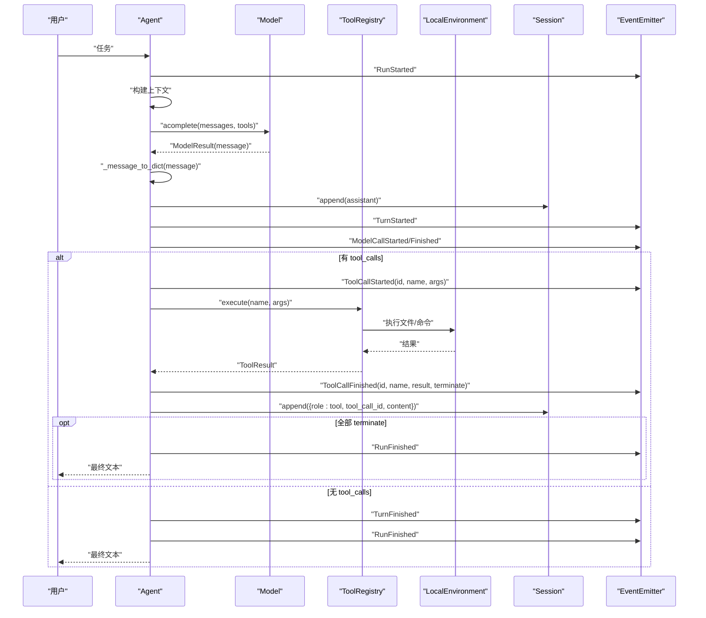
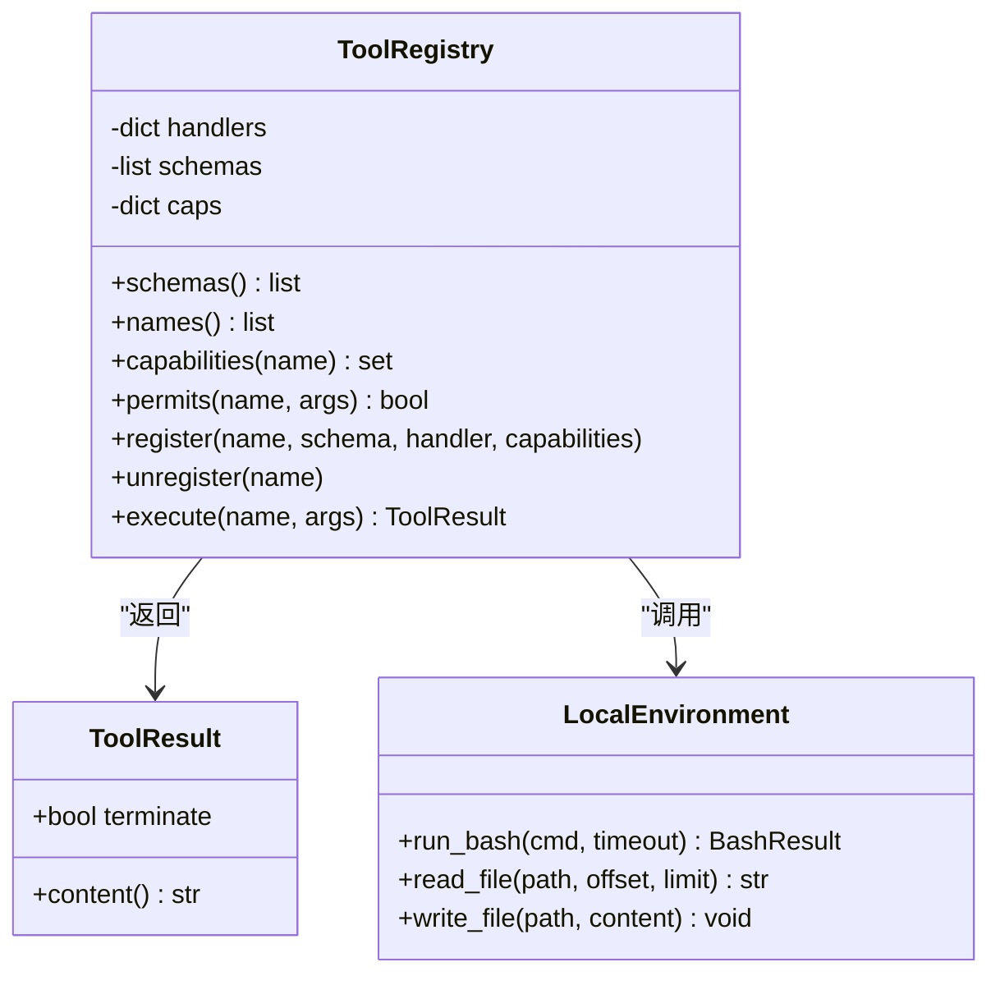
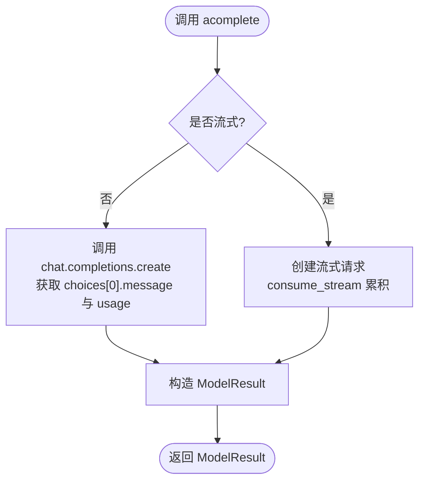
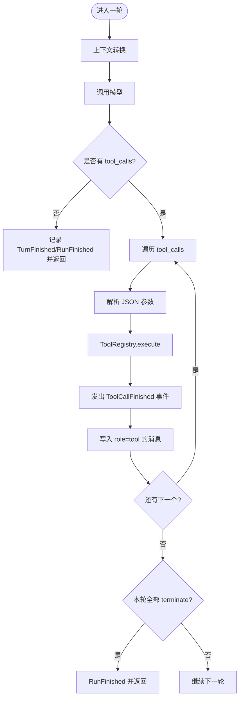
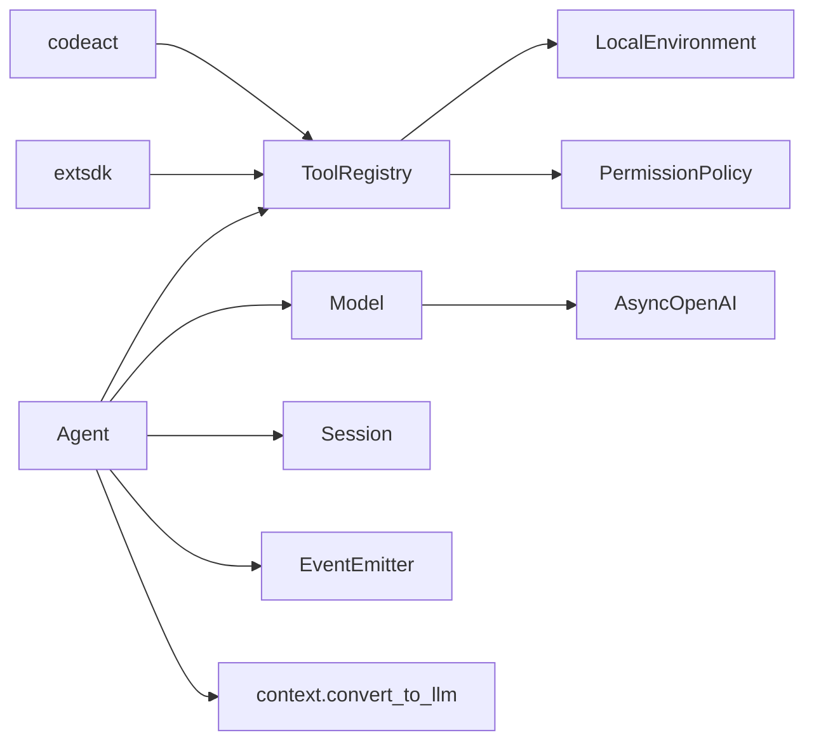

# Function Calling 概念

<cite>
**本文引用的文件列表**
- [mu/tools.py](file://mu/tools.py)
- [mu/agent.py](file://mu/agent.py)
- [mu/model.py](file://mu/model.py)
- [mu/context.py](file://mu/context.py)
- [mu/events.py](file://mu/events.py)
- [mu/environment.py](file://mu/environment.py)
- [mu/session.py](file://mu/session.py)
- [mu/extsdk.py](file://mu/extsdk.py)
- [mu/codeact.py](file://mu/codeact.py)
- [tests/test_tools.py](file://tests/test_tools.py)
- [tests/test_agent_loop.py](file://tests/test_agent_loop.py)
- [extensions/example_textstats.py](file://extensions/example_textstats.py)
- [README.md](file://README.md)
</cite>

## 目录
1. [引言](#引言)
2. [项目结构](#项目结构)
3. [核心组件](#核心组件)
4. [架构总览](#架构总览)
5. [详细组件分析](#详细组件分析)
6. [依赖关系分析](#依赖关系分析)
7. [性能考量](#性能考量)
8. [故障排查指南](#故障排查指南)
9. [结论](#结论)
10. [附录](#附录)

## 引言
本文件围绕 function-calling 与 tool_calls 的核心概念，系统阐述 μ 智能体如何借助原生 OpenAI function-calling schema 生成工具调用、如何解析与执行这些调用，以及工具执行的生命周期与与智能体循环的集成方式。文档同时覆盖参数校验、执行过程、结果格式化、失败处理、事件流与会话持久化等关键主题，并通过测试与示例文件定位具体实现路径，帮助读者快速理解并实践。

## 项目结构
μ 智能体采用“薄循环 + 四个内置工具 + 原生 function-calling”的极简设计，核心模块如下：
- 工具与注册表：内置 read/write/edit/bash 与扩展工具注册、权限策略、统一结果包装
- 模型封装：OpenAI 兼容异步客户端，支持流式累积与工具调用增量
- 智能体循环：事件驱动的消息流转、上下文转换、工具调用解析与执行
- 会话与分支：树形会话、JSONL 持久化、分支摘要注入 LLM 上下文
- 扩展与代码行动：子进程扩展工具、原生 code-action 组合工具

图表来源
- [mu/agent.py:43-223](file://mu/agent.py#L43-L223)
- [mu/model.py:91-147](file://mu/model.py#L91-L147)
- [mu/tools.py:191-269](file://mu/tools.py#L191-L269)
- [mu/environment.py:23-150](file://mu/environment.py#L23-L150)
- [mu/context.py:15-31](file://mu/context.py#L15-L31)
- [mu/events.py:121-133](file://mu/events.py#L121-L133)
- [mu/session.py:38-115](file://mu/session.py#L38-L115)
- [mu/extsdk.py:111-130](file://mu/extsdk.py#L111-L130)
- [mu/codeact.py:84-133](file://mu/codeact.py#L84-L133)

章节来源
- [README.md:1-127](file://README.md#L1-L127)
- [mu/agent.py:1-223](file://mu/agent.py#L1-L223)
- [mu/model.py:1-147](file://mu/model.py#L1-L147)
- [mu/tools.py:1-269](file://mu/tools.py#L1-L269)
- [mu/environment.py:1-150](file://mu/environment.py#L1-L150)
- [mu/context.py:1-31](file://mu/context.py#L1-L31)
- [mu/events.py:1-133](file://mu/events.py#L1-L133)
- [mu/session.py:1-115](file://mu/session.py#L1-L115)
- [mu/extsdk.py:1-130](file://mu/extsdk.py#L1-L130)
- [mu/codeact.py:1-133](file://mu/codeact.py#L1-L133)

## 核心组件
- 工具与注册表（ToolRegistry）
  - 统一工具签名与返回值包装（ToolResult），内置四工具（read/write/edit/bash）与扩展工具注册
  - 基于能力的权限策略 gate，支持动态注册/注销
- 模型封装（Model）
  - 封装 AsyncOpenAI，支持工具 schema 注入与工具调用返回
  - 流式模式下累积 content 与 tool_calls 增量
- 智能体循环（Agent.run）
  - 构建上下文 → 调用模型 → 解析 tool_calls → 顺序执行工具 → 写入会话 → 继续循环直至无工具调用
- 本地执行层（LocalEnvironment）
  - 文件读写与 bash 子进程执行，支持超时与进程组清理
- 事件流（EventEmitter）
  - 结构化事件（RunStarted/TurnStarted/ModelCallStarted/ToolCallStarted/ToolCallFinished 等），多订阅者消费
- 会话（Session）
  - 树形消息存储、JSONL 持久化、分支与摘要注入

章节来源
- [mu/tools.py:19-36](file://mu/tools.py#L19-L36)
- [mu/tools.py:191-269](file://mu/tools.py#L191-L269)
- [mu/model.py:91-147](file://mu/model.py#L91-L147)
- [mu/agent.py:82-163](file://mu/agent.py#L82-L163)
- [mu/environment.py:23-88](file://mu/environment.py#L23-L88)
- [mu/events.py:121-133](file://mu/events.py#L121-L133)
- [mu/session.py:38-115](file://mu/session.py#L38-L115)

## 架构总览
function-calling 在 μ 中的端到端流程：
- LLM 生成包含 tool_calls 的消息（OpenAI function-calling schema）
- Agent 解析 tool_calls，逐个调用 ToolRegistry.execute
- 工具执行返回 ToolResult（字符串 + terminate 标志），写入会话 role=tool
- 若本轮全部工具调用 terminate，则跳过自动后续 LLM 调用
- 事件流贯穿模型调用、工具调用开始/结束、取消与归因

图表来源
- [mu/agent.py:82-163](file://mu/agent.py#L82-L163)
- [mu/model.py:112-147](file://mu/model.py#L112-L147)
- [mu/tools.py:253-269](file://mu/tools.py#L253-L269)
- [mu/environment.py:26-88](file://mu/environment.py#L26-L88)
- [mu/events.py:18-89](file://mu/events.py#L18-L89)
- [mu/session.py:49-73](file://mu/session.py#L49-L73)

## 详细组件分析

### 工具与注册表（ToolRegistry）
- 数据结构与职责
  - ToolResult：字符串包装 + terminate 标志，用于指示本轮工具调用结束后是否跳过自动后续 LLM 调用
  - ToolHandler/RegisteredHandler：统一工具签名，内置工具通过绑定 LocalEnvironment，扩展工具通过子进程路由
  - _SCHEMAS：OpenAI function-calling schema 列表，内置四工具 + 动态扩展工具
  - _CAPABILITIES：按工具映射到能力集合，用于权限策略 gate
- 执行流程
  - permits：基于能力与策略判断是否允许执行
  - execute：权限检查 → 解析参数 → 调用处理器 → 异常捕获 → 返回 ToolResult
- 生命周期
  - 参数校验：KeyError 触发“缺少必要参数”错误
  - 执行：文件读写/编辑、bash 子进程执行
  - 结果：统一转为字符串，必要时携带 terminate 标志

图表来源
- [mu/tools.py:19-36](file://mu/tools.py#L19-L36)
- [mu/tools.py:191-269](file://mu/tools.py#L191-L269)
- [mu/environment.py:23-88](file://mu/environment.py#L23-L88)

章节来源
- [mu/tools.py:1-269](file://mu/tools.py#L1-L269)
- [mu/environment.py:1-150](file://mu/environment.py#L1-L150)

### 模型封装（Model）
- 关键点
  - acomplete：支持流式与非流式两种路径
  - consume_stream：累积 content 与 tool_calls 增量，构造 _StreamMessage
  - 返回 ModelResult：包含 message（含 content/tool_calls）、usage、latency
- 与 function-calling 的关系
  - 通过 tools 与 tool_choice="auto" 接入原生 function-calling schema
  - 流式模式下，tool_calls 以增量形式在流中出现，由 consume_stream 聚合

图表来源
- [mu/model.py:112-147](file://mu/model.py#L112-L147)
- [mu/model.py:52-88](file://mu/model.py#L52-L88)

章节来源
- [mu/model.py:1-147](file://mu/model.py#L1-L147)

### 智能体循环（Agent.run 与 _run_tool_calls）
- 循环控制
  - 无最大步数限制，以“模型不再调用工具”为终止条件
  - 每轮：构建上下文 → 调用模型 → 解析 tool_calls → 顺序执行 → 写入会话 → 继续
- tool_calls 解析与执行
  - 从 assistant 消息提取 tool_calls，逐个解析 JSON 参数
  - 发出 ToolCallStarted/ToolCallFinished 事件，记录时延与 terminate 标志
  - 将工具结果以 role=tool 写入会话
- 终止语义
  - 若本轮所有工具调用 terminate，则跳过自动后续 LLM 调用，直接结束运行

图表来源
- [mu/agent.py:82-163](file://mu/agent.py#L82-L163)

章节来源
- [mu/agent.py:82-163](file://mu/agent.py#L82-L163)

### 本地执行层（LocalEnvironment）
- 文件操作：读取指定 offset/limit 行、写入并自动创建父目录
- 命令执行：子进程执行 bash，支持超时与进程组清理，确保孤儿进程被回收
- Docker 环境（可选）：仅对 bash 放入容器，文件 IO 仍由宿主执行（最小实现）

章节来源
- [mu/environment.py:23-150](file://mu/environment.py#L23-L150)

### 事件流（EventEmitter）
- 事件类型：RunStarted/TurnStarted/ModelCallStarted/AssistantText/ToolCallStarted/ToolCallFinished/TurnFinished/RunFinished/RunAborted 等
- 订阅者：渲染器、统计、TUI 等，共享同一事件序列

章节来源
- [mu/events.py:1-133](file://mu/events.py#L1-L133)

### 会话（Session）
- 树形存储：append-only，支持分支、回溯、摘要注入
- JSONL 持久化：每条消息一行，KV-cache 友好
- 分支摘要：将侧分支结论作为自定义消息注入 LLM 上下文

章节来源
- [mu/session.py:38-115](file://mu/session.py#L38-L115)
- [mu/context.py:20-31](file://mu/context.py#L20-L31)

### 扩展与代码行动
- 扩展 SDK（extsdk.py）
  - 通过 @tool 装饰器声明工具，输出 manifest，子进程间通过 JSONL 协议通信
  - 支持 set_state/get_state、log、错误回传
- 原生 code-action（codeact.py）
  - 注册 “code” 工具，模型可在一次往返内组合多个工具
  - 通过 _MuApi 将线程内同步调用 marshaled 回事件循环，过权限策略与事件流

章节来源
- [mu/extsdk.py:1-130](file://mu/extsdk.py#L1-L130)
- [mu/codeact.py:1-133](file://mu/codeact.py#L1-L133)
- [extensions/example_textstats.py:1-67](file://extensions/example_textstats.py#L1-L67)

## 依赖关系分析
- Agent 依赖 Model、ToolRegistry、Session、EventEmitter、上下文转换函数
- ToolRegistry 依赖 LocalEnvironment 与权限策略
- Model 依赖 OpenAI SDK，支持流式累积
- 扩展与 code-action 通过 ToolRegistry 注册动态工具

图表来源
- [mu/agent.py:43-76](file://mu/agent.py#L43-L76)
- [mu/model.py:91-147](file://mu/model.py#L91-L147)
- [mu/tools.py:191-269](file://mu/tools.py#L191-L269)
- [mu/extsdk.py:111-130](file://mu/extsdk.py#L111-L130)
- [mu/codeact.py:84-133](file://mu/codeact.py#L84-L133)

章节来源
- [mu/agent.py:1-223](file://mu/agent.py#L1-L223)
- [mu/model.py:1-147](file://mu/model.py#L1-L147)
- [mu/tools.py:1-269](file://mu/tools.py#L1-L269)

## 性能考量
- 流式输出：开启流式可降低首字延迟，事件流中提供增量文本与工具调用累积
- 工具执行：文件 IO 与 bash 子进程均在事件循环之外执行，避免阻塞
- 终止优化：当工具调用返回 terminate 时，提前结束自动后续 LLM 调用，减少 token 消耗
- 会话持久化：append-only JSONL，适合复现与归因

## 故障排查指南
- 工具参数 JSON 解析失败
  - 现象：工具调用参数不是有效 JSON，返回错误提示
  - 处理：修正参数格式或在模型层面进行自纠错
  - 参考路径：[mu/agent.py:142-146](file://mu/agent.py#L142-L146)
- 工具不存在或权限不足
  - 现象：返回“未知工具”或“权限拒绝”
  - 处理：确认工具名称、schema 与权限策略配置
  - 参考路径：[mu/tools.py:253-269](file://mu/tools.py#L253-L269)
- bash 超时与孤儿进程
  - 现象：命令超时返回退出码 124，进程组被清理
  - 处理：调整超时或命令本身
  - 参考路径：[mu/environment.py:26-65](file://mu/environment.py#L26-L65)
- 取消运行导致的会话完整性
  - 现象：工具执行中取消，为剩余未执行工具补错误结果，保证每个 tool_call 都有对应 tool 结果
  - 处理：使用 --resume 继续
  - 参考路径：[mu/agent.py:150-173](file://mu/agent.py#L150-L173)
- 流式累积异常
  - 现象：流式增量丢失或拼接错误
  - 处理：检查 consume_stream 的累积逻辑与 on_delta 回调
  - 参考路径：[mu/model.py:52-88](file://mu/model.py#L52-L88)

章节来源
- [mu/agent.py:134-173](file://mu/agent.py#L134-L173)
- [mu/tools.py:253-269](file://mu/tools.py#L253-L269)
- [mu/environment.py:26-65](file://mu/environment.py#L26-L65)
- [mu/model.py:52-88](file://mu/model.py#L52-L88)

## 结论
μ 智能体通过原生 OpenAI function-calling schema 将 LLM 的工具调用能力无缝集成到循环中：模型负责生成工具调用，Agent 负责解析与执行，ToolRegistry 提供统一的工具抽象与权限控制，LocalEnvironment 提供安全可控的本地执行能力。事件流与会话持久化确保可观测性与可恢复性。该设计在保持极简的同时，提供了清晰的扩展点（扩展与 code-action）与可控的安全边界（权限与沙箱）。

## 附录
- 具体代码示例路径（不展示代码内容，仅提供定位）
  - function-calling 生成与解析
    - [mu/model.py:112-147](file://mu/model.py#L112-L147)
    - [mu/agent.py:113-123](file://mu/agent.py#L113-L123)
  - 工具调用执行与结果写入
    - [mu/agent.py:134-163](file://mu/agent.py#L134-L163)
    - [mu/tools.py:253-269](file://mu/tools.py#L253-L269)
  - 事件流与取消处理
    - [mu/events.py:121-133](file://mu/events.py#L121-L133)
    - [mu/agent.py:150-173](file://mu/agent.py#L150-L173)
  - 会话与分支摘要
    - [mu/session.py:49-73](file://mu/session.py#L49-L73)
    - [mu/context.py:20-31](file://mu/context.py#L20-L31)
  - 扩展工具与 code-action
    - [mu/extsdk.py:111-130](file://mu/extsdk.py#L111-L130)
    - [mu/codeact.py:84-133](file://mu/codeact.py#L84-L133)
    - [extensions/example_textstats.py:1-67](file://extensions/example_textstats.py#L1-L67)
  - 测试用例（验证循环、参数错误、多工具调用、取消完整性）
    - [tests/test_agent_loop.py:58-203](file://tests/test_agent_loop.py#L58-L203)
    - [tests/test_tools.py:7-117](file://tests/test_tools.py#L7-L117)