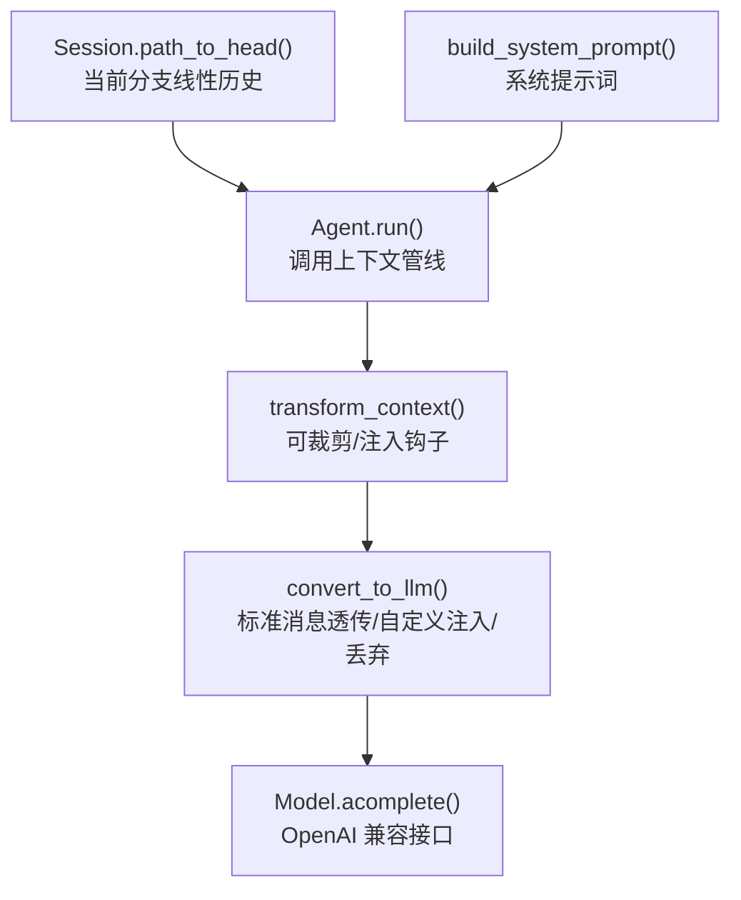
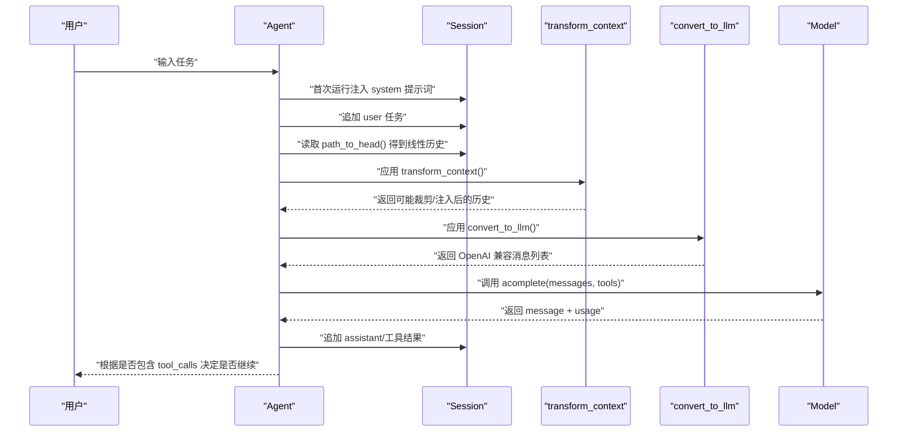
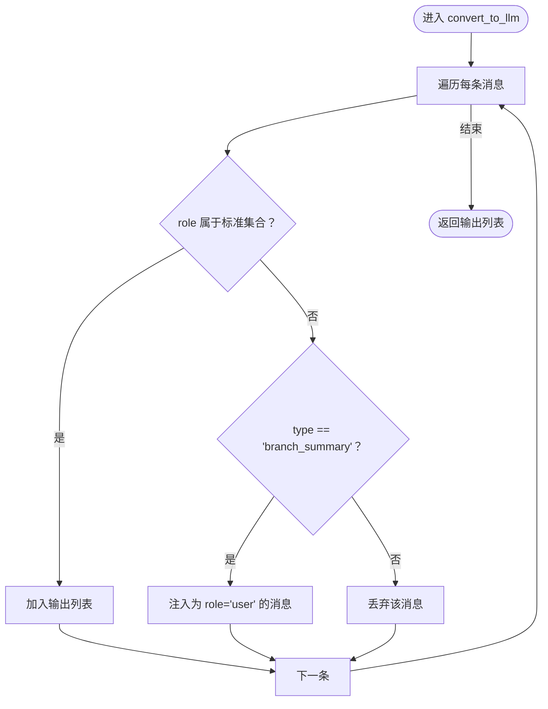
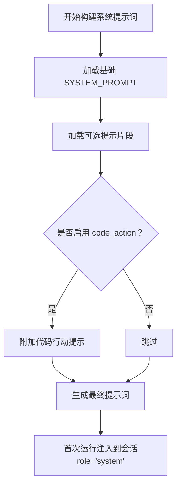
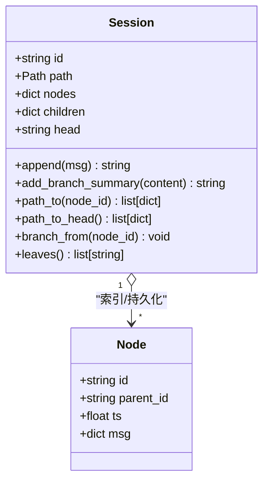
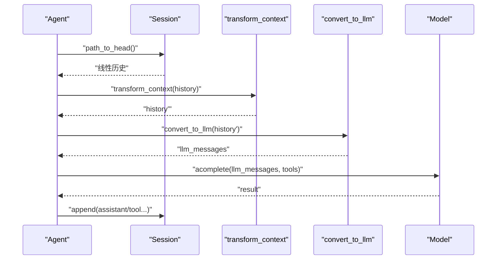
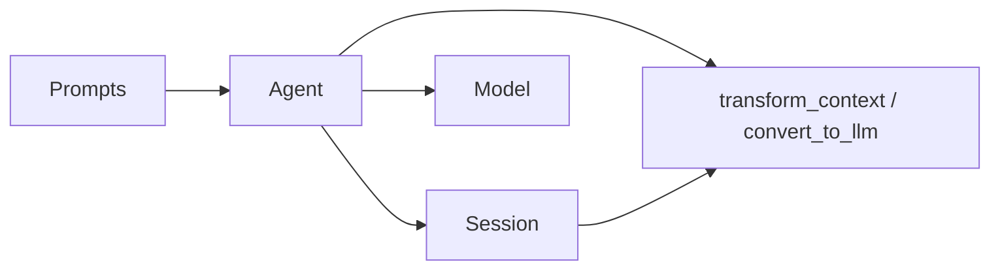

# 上下文管线

<cite>
**本文引用的文件**
- [mu/context.py](file://mu/context.py)
- [mu/agent.py](file://mu/agent.py)
- [mu/session.py](file://mu/session.py)
- [mu/prompts.py](file://mu/prompts.py)
- [mu/model.py](file://mu/model.py)
- [tests/test_context.py](file://tests/test_context.py)
- [docs/Pi-极简Agent深度调研.md](file://docs/Pi-极简Agent深度调研.md)
</cite>

## 目录
1. [引言](#引言)
2. [项目结构](#项目结构)
3. [核心组件](#核心组件)
4. [架构总览](#架构总览)
5. [详细组件分析](#详细组件分析)
6. [依赖分析](#依赖分析)
7. [性能考虑](#性能考虑)
8. [故障排查指南](#故障排查指南)
9. [结论](#结论)
10. [附录](#附录)

## 引言
本文件系统性阐述 μ 项目中的“上下文管线”设计与实现，重点覆盖以下内容：
- transform_context 与 convert_to_llm 的职责与调用顺序
- 上下文转换的两个阶段：原始消息到线性历史、线性历史到 LLM 输入格式
- 系统提示词的构建与注入机制
- 如何通过上下文管线适配不同模型接口与格式要求
- 提供可直接参考的代码示例路径，展示自定义转换器的实现方式

## 项目结构
上下文管线涉及的核心模块如下：
- 上下文转换：mu/context.py
- 代理与循环：mu/agent.py
- 会话与线性历史：mu/session.py
- 系统提示词：mu/prompts.py
- 模型封装与流式处理：mu/model.py
- 行为验证：tests/test_context.py
- 设计理念参考：docs/Pi-极简Agent深度调研.md

图表来源
- [mu/agent.py:82-132](file://mu/agent.py#L82-L132)
- [mu/context.py:15-30](file://mu/context.py#L15-L30)
- [mu/session.py:76-88](file://mu/session.py#L76-L88)
- [mu/prompts.py:57-59](file://mu/prompts.py#L57-L59)
- [mu/model.py:112-146](file://mu/model.py#L112-L146)

章节来源
- [mu/agent.py:82-132](file://mu/agent.py#L82-L132)
- [mu/context.py:15-30](file://mu/context.py#L15-L30)
- [mu/session.py:76-88](file://mu/session.py#L76-L88)
- [mu/prompts.py:57-59](file://mu/prompts.py#L57-L59)
- [mu/model.py:112-146](file://mu/model.py#L112-L146)

## 核心组件
- transform_context：默认身份函数，保留为可替换钩子，用于后续实现压缩、裁剪、注入等策略
- convert_to_llm：将内部历史（含自定义消息类型）转换为 OpenAI 兼容的消息列表；标准消息透传，自定义类型可注入或丢弃
- Agent.run：在每次推理前，先对当前分支线性历史应用上下文管线，再调用模型
- Session：维护树形消息结构，提供 path_to_head 获取当前分支线性历史
- Prompts：构建系统提示词，首次运行时注入到会话中
- Model：封装 OpenAI 兼容接口，支持流式与非流式调用

章节来源
- [mu/context.py:15-30](file://mu/context.py#L15-L30)
- [mu/agent.py:82-132](file://mu/agent.py#L82-L132)
- [mu/session.py:76-88](file://mu/session.py#L76-L88)
- [mu/prompts.py:57-59](file://mu/prompts.py#L57-L59)
- [mu/model.py:112-146](file://mu/model.py#L112-L146)

## 架构总览
上下文管线位于 Agent.run 的核心路径上，负责将 Session 中的当前分支线性历史转换为模型可接受的 OpenAI 格式消息列表。

图表来源
- [mu/agent.py:82-132](file://mu/agent.py#L82-L132)
- [mu/session.py:76-88](file://mu/session.py#L76-L88)
- [mu/context.py:15-30](file://mu/context.py#L15-L30)
- [mu/model.py:112-146](file://mu/model.py#L112-L146)

## 详细组件分析

### 上下文管线：transform_context 与 convert_to_llm
- transform_context
  - 默认行为：身份映射（不改变输入）
  - 设计意图：为后续实现“压缩/裁剪/注入”预留钩子
- convert_to_llm
  - 标准消息透传：system、user、assistant、tool
  - 自定义类型处理：例如 type="branch_summary" 将被注入为一条 user 消息，以便将侧分支摘要纳入主线上下文
  - 未知类型丢弃：不在标准角色集合且非受控自定义类型的条目不会进入 LLM 上下文

图表来源
- [mu/context.py:20-30](file://mu/context.py#L20-L30)

章节来源
- [mu/context.py:15-30](file://mu/context.py#L15-L30)
- [tests/test_context.py:7-39](file://tests/test_context.py#L7-L39)

### 系统提示词的构建与注入
- 构建流程
  - 基础系统提示词：固定模板，包含角色定位、可用工具与约束
  - 可选片段：从指定目录加载 .md/.txt 片段，拼接到基础提示词之后
  - 可选代码行动提示：当启用 code_action 时附加一段提示
- 注入时机
  - Agent.run 首次运行时，若当前分支为空（head 为 None），则注入 system 角色消息
  - 之后的回合仅追加 user 消息，复用历史

图表来源
- [mu/prompts.py:57-59](file://mu/prompts.py#L57-L59)
- [mu/agent.py:84-85](file://mu/agent.py#L84-L85)

章节来源
- [mu/prompts.py:57-59](file://mu/prompts.py#L57-L59)
- [mu/agent.py:84-85](file://mu/agent.py#L84-L85)

### 会话与线性历史：从树到线性序列
- Session 以树形结构存储消息（id/parent_id），支持分叉与合并
- 当前分支的线性历史即从 head 沿 parent_id 回溯到 root 的路径
- 侧分支结论可通过 branch_summary 自定义消息注入主线，经 convert_to_llm 转换为 user 消息

图表来源
- [mu/session.py:38-114](file://mu/session.py#L38-L114)

章节来源
- [mu/session.py:38-114](file://mu/session.py#L38-L114)

### Agent.run 中的上下文管线调用顺序
- 读取当前分支线性历史：session.path_to_head()
- 应用 transform_context：可进行裁剪/注入
- 应用 convert_to_llm：标准消息透传，自定义类型注入或丢弃
- 调用模型：Model.acomplete，支持流式与非流式
- 解析结果并写回会话：assistant 与工具结果

图表来源
- [mu/agent.py:98-111](file://mu/agent.py#L98-L111)
- [mu/context.py:15-30](file://mu/context.py#L15-L30)
- [mu/session.py:76-88](file://mu/session.py#L76-L88)
- [mu/model.py:112-146](file://mu/model.py#L112-L146)

章节来源
- [mu/agent.py:98-111](file://mu/agent.py#L98-L111)

### 适配不同模型接口与格式要求
- 标准消息透传：确保 system/user/assistant/tool 的语义在大多数 OpenAI 兼容接口中保持一致
- 自定义注入：通过 type="branch_summary" 将侧分支摘要注入为 user 消息，避免丢失重要上下文
- 未知类型丢弃：防止内部自定义消息污染 LLM 上下文
- 可替换钩子：transform_context 保留为可替换钩子，可用于实现压缩、裁剪、注入外部上下文等策略

章节来源
- [mu/context.py:15-30](file://mu/context.py#L15-L30)
- [docs/Pi-极简Agent深度调研.md:72-203](file://docs/Pi-极简Agent深度调研.md#L72-L203)

### 自定义转换器实现示例（代码示例路径）
- 示例一：自定义 transform_context
  - 目标：在现有历史基础上注入外部知识或限制长度
  - 参考实现位置：[mu/context.py:15-17](file://mu/context.py#L15-L17)
  - 使用方式：在构造 Agent 时传入自定义函数
    - [mu/agent.py:65-66](file://mu/agent.py#L65-L66)
- 示例二：自定义 convert_to_llm
  - 目标：将特定 type 的自定义消息转换为标准消息，或添加系统提示词注入
  - 参考实现位置：[mu/context.py:20-30](file://mu/context.py#L20-L30)
  - 使用方式：在构造 Agent 时传入自定义函数
    - [mu/agent.py:65-66](file://mu/agent.py#L65-L66)
- 行为验证参考：
  - [tests/test_context.py:7-39](file://tests/test_context.py#L7-L39)

章节来源
- [mu/context.py:15-30](file://mu/context.py#L15-L30)
- [mu/agent.py:65-66](file://mu/agent.py#L65-L66)
- [tests/test_context.py:7-39](file://tests/test_context.py#L7-L39)

## 依赖分析
- Agent 对上下文管线的依赖
  - 通过属性注入 transform_context 与 convert_to_llm，默认使用 mu/context.py 中的实现
  - 在 run 循环中严格遵循“线性历史 → 上下文管线 → 模型”的顺序
- Session 与上下文管线的关系
  - Session 提供 path_to_head，为上下文管线提供稳定的输入源
  - branch_summary 作为自定义消息类型，经 convert_to_llm 注入为 user 消息
- Prompts 与上下文管线的关系
  - 系统提示词在首次运行时注入到会话，随后由上下文管线透传至模型

图表来源
- [mu/agent.py:65-66](file://mu/agent.py#L65-L66)
- [mu/session.py:76-88](file://mu/session.py#L76-L88)
- [mu/prompts.py:57-59](file://mu/prompts.py#L57-L59)

章节来源
- [mu/agent.py:65-66](file://mu/agent.py#L65-L66)
- [mu/session.py:76-88](file://mu/session.py#L76-L88)
- [mu/prompts.py:57-59](file://mu/prompts.py#L57-L59)

## 性能考虑
- 上下文管线为 O(n) 遍历，其中 n 为消息数量，开销主要来自列表复制与条件判断
- transform_context 可用于实现消息裁剪与压缩，减少后续模型调用成本
- convert_to_llm 采用单次扫描，复杂度 O(n)，建议在上游（transform_context）尽量减少无效消息

## 故障排查指南
- 系统提示词未生效
  - 检查首次运行时是否注入了 system 消息
  - 参考：[mu/agent.py:84-85](file://mu/agent.py#L84-L85)
- 自定义消息未进入 LLM 上下文
  - 确认 type 是否为受控自定义类型（如 branch_summary）
  - 未知类型会被丢弃，参考：[mu/context.py:26-30](file://mu/context.py#L26-L30)
- 侧分支摘要未注入主线
  - 确认是否调用了 add_branch_summary 并在主线追加
  - 参考：[mu/session.py:56-58](file://mu/session.py#L56-L58)
- 流式输出异常
  - 检查 consume_stream 的累积逻辑与 on_delta 回调
  - 参考：[mu/model.py:52-88](file://mu/model.py#L52-L88)

章节来源
- [mu/agent.py:84-85](file://mu/agent.py#L84-L85)
- [mu/context.py:26-30](file://mu/context.py#L26-L30)
- [mu/session.py:56-58](file://mu/session.py#L56-L58)
- [mu/model.py:52-88](file://mu/model.py#L52-L88)

## 结论
上下文管线是 μ 项目中“精确控制进入模型上下文内容”的关键抓手。通过 transform_context 与 convert_to_llm 的组合，系统实现了：
- 标准消息的稳定透传
- 自定义消息的可控注入与丢弃
- 侧分支摘要的跨分支上下文复用
- 与 OpenAI 兼容接口的无缝衔接

该设计既保持了 M0 的行为一致性，又为 M1 的扩展（如压缩、裁剪、注入外部上下文）预留了清晰的接口。

## 附录
- 相关文档与背景
  - [docs/Pi-极简Agent深度调研.md:72-203](file://docs/Pi-极简Agent深度调研.md#L72-L203)
- 行为验证
  - [tests/test_context.py:7-39](file://tests/test_context.py#L7-L39)