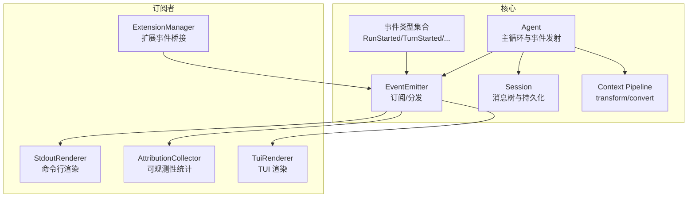
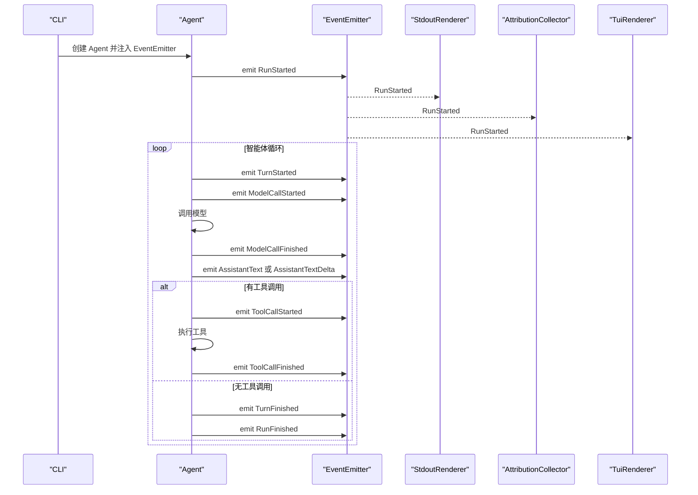
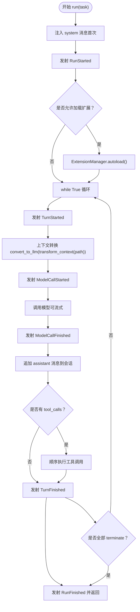
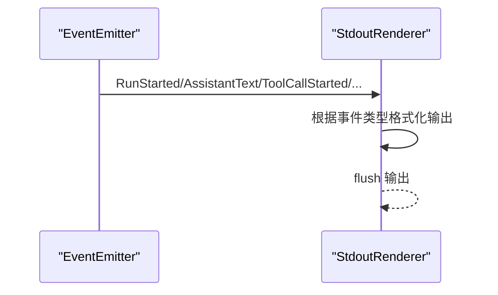
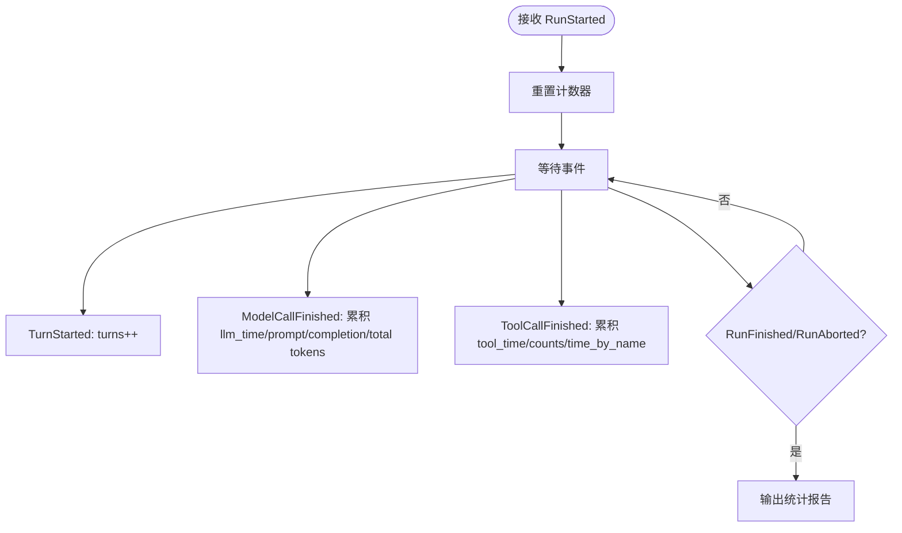
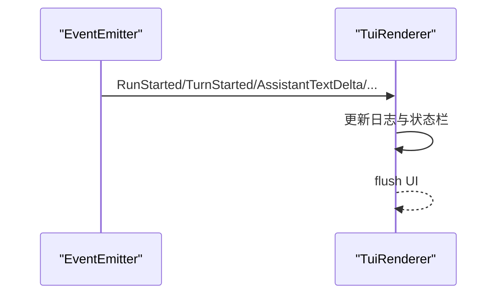
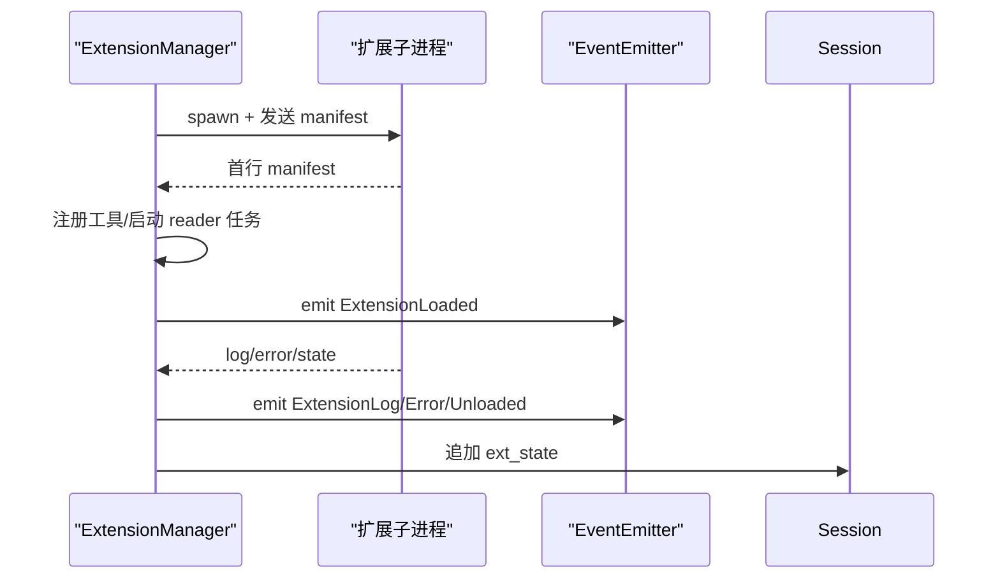
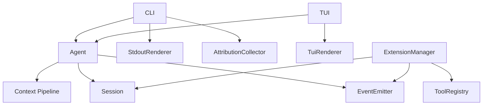

# 事件驱动架构

<cite>
**本文引用的文件列表**
- [events.py](file://mu/events.py)
- [agent.py](file://mu/agent.py)
- [cli.py](file://mu/cli.py)
- [render.py](file://mu/render.py)
- [observability.py](file://mu/observability.py)
- [tui.py](file://mu/tui.py)
- [session.py](file://mu/session.py)
- [context.py](file://mu/context.py)
- [extension.py](file://mu/extension.py)
- [extsdk.py](file://mu/extsdk.py)
- [example_textstats.py](file://extensions/example_textstats.py)
- [test_events.py](file://tests/test_events.py)
</cite>

## 目录
1. [引言](#引言)
2. [项目结构](#项目结构)
3. [核心组件](#核心组件)
4. [架构概览](#架构概览)
5. [详细组件分析](#详细组件分析)
6. [依赖关系分析](#依赖关系分析)
7. [性能考量](#性能考量)
8. [故障排查指南](#故障排查指南)
9. [结论](#结论)
10. [附录](#附录)

## 引言
本文件深入阐述 μ 项目的事件驱动架构设计与实现，重点解析 EventEmitter 的订阅者模式、各类事件类型（RunStarted、TurnStarted、ModelCallStarted 等）的作用与触发时机、事件在智能体循环中的传播路径与处理流程，以及多订阅者如何消费事件流。文档还说明事件系统如何实现松耦合的组件通信，并提供事件监听与处理的具体代码示例，指导如何扩展自定义事件处理器。

## 项目结构
μ 项目采用“事件驱动 + 松耦合订阅者”的架构，核心围绕 EventEmitter 提供的同步事件总线展开。Agent 在其主循环中发出结构化事件，stdout 渲染器、可观测性收集器、TUI 界面等订阅者分别消费这些事件，实现多视图输出与统计分析。扩展系统通过 ExtensionManager 将外部扩展子进程产生的事件也纳入统一事件流，形成完整的可观测与可扩展生态。

图表来源
- [events.py:121-133](file://mu/events.py#L121-L133)
- [agent.py:82-133](file://mu/agent.py#L82-L133)
- [cli.py:70-72](file://mu/cli.py#L70-L72)
- [render.py:31-78](file://mu/render.py#L31-L78)
- [observability.py:26-90](file://mu/observability.py#L26-L90)
- [tui.py:122-203](file://mu/tui.py#L122-L203)
- [session.py:38-115](file://mu/session.py#L38-L115)
- [context.py:15-31](file://mu/context.py#L15-L31)
- [extension.py:85-364](file://mu/extension.py#L85-L364)

章节来源
- [events.py:1-133](file://mu/events.py#L1-L133)
- [agent.py:1-223](file://mu/agent.py#L1-L223)
- [cli.py:1-134](file://mu/cli.py#L1-L134)

## 核心组件
- 事件类型体系：包含运行期事件（RunStarted/RunFinished/RunAborted）、回合事件（TurnStarted/TurnFinished）、模型调用事件（ModelCallStarted/ModelCallFinished）、助手文本事件（AssistantText/AssistantTextDelta）、工具调用事件（ToolCallStarted/ToolCallFinished）、扩展事件（ExtensionLoaded/ExtensionUnloaded/ExtensionLog/ExtensionError）以及通用错误事件（ErrorEvent）。
- EventEmitter：提供 subscribe 与 emit 接口，实现同步顺序分发，保证事件到达各订阅者的确定性顺序。
- Agent：在主循环中根据执行阶段发射相应事件，贯穿整个任务生命周期。
- 订阅者：
  - StdoutRenderer：将事件渲染为命令行输出，支持流式增量显示。
  - AttributionCollector：基于事件进行运行统计（轮数、LLM/工具耗时、token 统计等）。
  - TuiRenderer：在 TUI 中渲染事件并维护状态栏统计。
  - ExtensionManager：将扩展子进程产生的日志、错误、状态等事件桥接到统一事件流。

章节来源
- [events.py:13-116](file://mu/events.py#L13-L116)
- [events.py:121-133](file://mu/events.py#L121-L133)
- [agent.py:82-133](file://mu/agent.py#L82-L133)
- [render.py:31-78](file://mu/render.py#L31-L78)
- [observability.py:26-90](file://mu/observability.py#L26-L90)
- [tui.py:44-120](file://mu/tui.py#L44-L120)
- [extension.py:21-27](file://mu/extension.py#L21-L27)

## 架构概览
事件驱动架构的核心在于“事件生产者（Agent/ExtensionManager）—事件总线（EventEmitter）—订阅者（渲染器/统计器/TUI）”的解耦设计。Agent 在每次关键步骤（开始运行、回合开始、模型调用、工具调用、回合结束、运行结束/中止）发射事件；订阅者通过订阅函数接收事件并执行相应动作，如渲染输出、累积统计、更新 UI 状态等。这种设计使得新增订阅者无需修改核心逻辑，同时也能保证事件处理的顺序一致性。

图表来源
- [agent.py:82-133](file://mu/agent.py#L82-L133)
- [events.py:18-79](file://mu/events.py#L18-L79)
- [cli.py:70-72](file://mu/cli.py#L70-L72)
- [render.py:36-70](file://mu/render.py#L36-L70)
- [observability.py:45-64](file://mu/observability.py#L45-L64)
- [tui.py:64-106](file://mu/tui.py#L64-L106)

## 详细组件分析

### EventEmitter 与事件类型
- EventEmitter 提供 subscribe 与 emit 方法，内部维护订阅者列表，emit 时按注册顺序依次调用订阅者函数，实现同步顺序分发。
- 事件类型覆盖任务生命周期的各个阶段，包括运行开始/结束/中止、回合开始/结束、模型调用开始/结束、助手文本（一次性/增量）、工具调用开始/结束、扩展加载/卸载/日志/错误以及通用错误事件。

```mermaid
classDiagram
class Event {
<<dataclass>>
}
class RunStarted {
+string task
+string session_id
}
class TurnStarted {
+int turn
}
class ModelCallStarted {
+int turn
}
class ModelCallFinished {
+int turn
+float latency_s
+int|None prompt_tokens
+int|None completion_tokens
+int|None total_tokens
}
class AssistantText {
+string text
}
class AssistantTextDelta {
+string delta
}
class ToolCallStarted {
+string call_id
+string name
+string args_preview
}
class ToolCallFinished {
+string call_id
+string name
+string result
+float latency_s
+bool terminate
}
class TurnFinished {
+int turn
}
class RunFinished {
+string final_text
}
class RunAborted {
+string reason
}
class ErrorEvent {
+string message
}
class ExtensionLoaded {
+string name
+string version
+string[] tools
}
class ExtensionUnloaded {
+string name
}
class ExtensionLog {
+string name
+string level
+string message
}
class ExtensionError {
+string name
+string message
}
Event <|-- RunStarted
Event <|-- TurnStarted
Event <|-- ModelCallStarted
Event <|-- ModelCallFinished
Event <|-- AssistantText
Event <|-- AssistantTextDelta
Event <|-- ToolCallStarted
Event <|-- ToolCallFinished
Event <|-- TurnFinished
Event <|-- RunFinished
Event <|-- RunAborted
Event <|-- ErrorEvent
Event <|-- ExtensionLoaded
Event <|-- ExtensionUnloaded
Event <|-- ExtensionLog
Event <|-- ExtensionError
```

图表来源
- [events.py:13-116](file://mu/events.py#L13-L116)

章节来源
- [events.py:121-133](file://mu/events.py#L121-L133)
- [events.py:18-116](file://mu/events.py#L18-L116)

### Agent 的事件发射流程
- Agent 在运行开始时发射 RunStarted，并根据是否需要加载扩展决定是否自动加载。
- 主循环中每轮发射 TurnStarted，随后发射 ModelCallStarted，调用模型后发射 ModelCallFinished，并根据是否流式输出发射 AssistantText 或 AssistantTextDelta。
- 若模型返回工具调用，则逐个发射 ToolCallStarted，执行工具后发射 ToolCallFinished，并将工具结果追加到会话。
- 当一轮无工具调用或工具调用全部标记 terminate 时，发射 TurnFinished 和 RunFinished 并返回最终文本；若被取消则发射 RunAborted。

图表来源
- [agent.py:82-133](file://mu/agent.py#L82-L133)
- [context.py:15-31](file://mu/context.py#L15-L31)

章节来源
- [agent.py:82-133](file://mu/agent.py#L82-L133)
- [context.py:15-31](file://mu/context.py#L15-L31)

### 订阅者：StdoutRenderer
- StdoutRenderer 作为订阅者，接收事件后按事件类型输出到标准输出，支持流式增量（AssistantTextDelta）的实时打印。
- 对扩展事件（ExtensionLoaded/ExtensionUnloaded/ExtensionLog/ExtensionError）进行专门渲染，便于用户了解扩展状态。

图表来源
- [render.py:36-70](file://mu/render.py#L36-L70)

章节来源
- [render.py:31-78](file://mu/render.py#L31-L78)

### 订阅者：AttributionCollector
- AttributionCollector 作为订阅者，基于事件进行运行统计，包括轮数、模型调用次数与耗时、工具调用耗时与次数、token 统计等。
- 在 RunFinished 或 RunAborted 时输出汇总报告，支持可选的价格表估算成本（按 1K token 计价）。

图表来源
- [observability.py:45-64](file://mu/observability.py#L45-L64)
- [observability.py:66-90](file://mu/observability.py#L66-L90)

章节来源
- [observability.py:26-90](file://mu/observability.py#L26-L90)

### 订阅者：TuiRenderer（TUI）
- TuiRenderer 在 TUI 中渲染事件，将动态内容写入 RichLog，状态栏显示轮数、LLM/工具耗时、token 统计等。
- 支持流式增量显示，将缓冲区内容合并后输出到日志区域。

图表来源
- [tui.py:64-106](file://mu/tui.py#L64-L106)

章节来源
- [tui.py:44-120](file://mu/tui.py#L44-L120)

### 扩展事件桥接：ExtensionManager
- ExtensionManager 将扩展子进程产生的日志、错误、状态等事件通过 EventEmitter 暴露给统一订阅者，实现扩展“可观测”与“可调试”。
- 支持加载、重载、卸载扩展，自动恢复扩展状态（ext_state），并在进程异常退出时进行降级处理。

图表来源
- [extension.py:131-188](file://mu/extension.py#L131-L188)
- [extension.py:275-317](file://mu/extension.py#L275-L317)
- [extsdk.py:111-130](file://mu/extsdk.py#L111-L130)

章节来源
- [extension.py:85-364](file://mu/extension.py#L85-L364)
- [extsdk.py:1-130](file://mu/extsdk.py#L1-L130)
- [example_textstats.py:1-67](file://extensions/example_textstats.py#L1-L67)

## 依赖关系分析
- Agent 依赖 EventEmitter、Session、上下文管线（transform_context/convert_to_llm）、工具注册表与模型接口。
- CLI 负责装配 EventEmitter 并注册 StdoutRenderer 与 AttributionCollector，然后创建 Agent 并运行。
- TUI 使用相同的 EventEmitter 与 Agent，但将渲染器替换为 TuiRenderer，并在 UI 中维护状态栏统计。
- 扩展系统通过 ExtensionManager 与工具注册表协作，将扩展工具注册到 Agent 可用的工具集中，并将扩展事件桥接至 EventEmitter。

图表来源
- [cli.py:70-72](file://mu/cli.py#L70-L72)
- [tui.py:148-165](file://mu/tui.py#L148-L165)
- [agent.py:43-76](file://mu/agent.py#L43-L76)
- [extension.py:85-103](file://mu/extension.py#L85-L103)

章节来源
- [cli.py:51-83](file://mu/cli.py#L51-L83)
- [tui.py:122-203](file://mu/tui.py#L122-L203)
- [agent.py:43-76](file://mu/agent.py#L43-L76)
- [extension.py:85-103](file://mu/extension.py#L85-L103)

## 性能考量
- 同步分发：EventEmitter 采用同步顺序分发，避免引入异步框架开销，适合轻量订阅者（渲染/统计）。
- 订阅者职责单一：渲染器与统计器仅做轻量工作，降低事件处理对主循环的影响。
- 流式输出：支持 AssistantTextDelta 的增量输出，减少一次性大块文本的渲染压力。
- 事件粒度：事件类型覆盖关键执行点，既保证可观测性，又避免过度细分导致的事件风暴。

## 故障排查指南
- 事件未被消费：确认是否正确调用 emitter.subscribe 注册订阅者；检查订阅者是否实现了 callable 接口。
- 事件顺序异常：EventEmitter 保证顺序分发，若出现乱序，检查订阅者内部是否异步处理或缓存。
- 扩展事件缺失：确认 ExtensionManager 是否正确加载扩展并注册工具；检查扩展子进程是否正常输出首行 manifest。
- 统计不准确：确认 AttributionCollector 是否在 RunStarted 时重置计数器，在 RunFinished/RunAborted 时输出报告。
- TUI 渲染异常：检查 TuiRenderer 的事件类型匹配与 UI 组件更新逻辑。

章节来源
- [test_events.py:7-27](file://tests/test_events.py#L7-L27)
- [observability.py:33-35](file://mu/observability.py#L33-L35)
- [extension.py:131-188](file://mu/extension.py#L131-L188)

## 结论
μ 项目的事件驱动架构通过 EventEmitter 将 Agent 的关键执行点转化为结构化事件，使 stdout 渲染、可观测性统计、TUI 界面与扩展系统能够以订阅者模式并行消费同一事件流，实现松耦合的组件通信。该设计既保持了核心逻辑的简洁性，又提供了良好的可扩展性与可观测性，为后续功能增强（如更丰富的订阅者、异步扩展、更细粒度的统计）奠定了坚实基础。

## 附录

### 如何扩展自定义事件处理器
- 定义事件类型：在 events.py 中添加新的事件数据类，继承 Event 基类。
- 创建订阅者：实现一个可调用对象（或类的 __call__），在其中根据事件类型进行处理。
- 注册订阅者：在 CLI/TUI 或应用入口处创建 EventEmitter 并调用 subscribe 注册你的订阅者。
- 触发事件：在 Agent 或其他模块中合适的位置调用 emitter.emit 发射新事件。

参考示例路径
- [事件类型定义:13-116](file://mu/events.py#L13-L116)
- [EventEmitter 订阅/分发:121-133](file://mu/events.py#L121-L133)
- [CLI 注册订阅者:70-72](file://mu/cli.py#L70-L72)
- [TUI 注册订阅者:163-165](file://mu/tui.py#L163-L165)
- [Agent 发射事件:82-133](file://mu/agent.py#L82-L133)