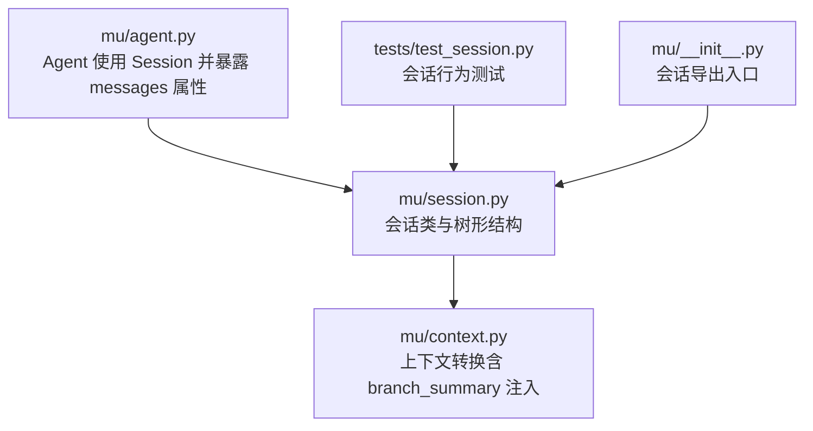
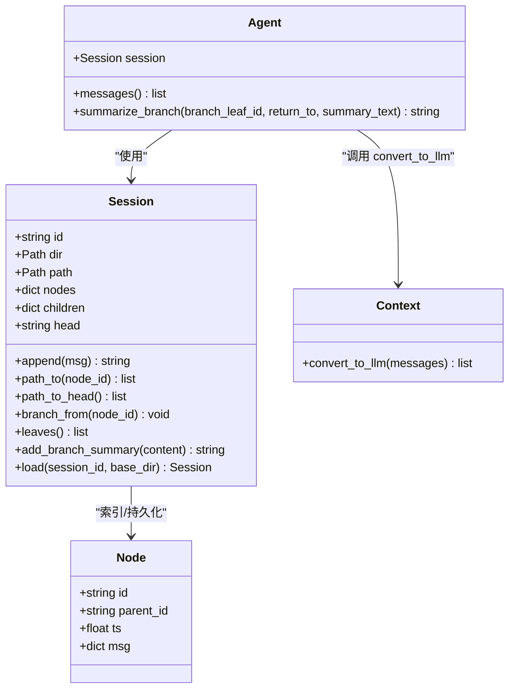
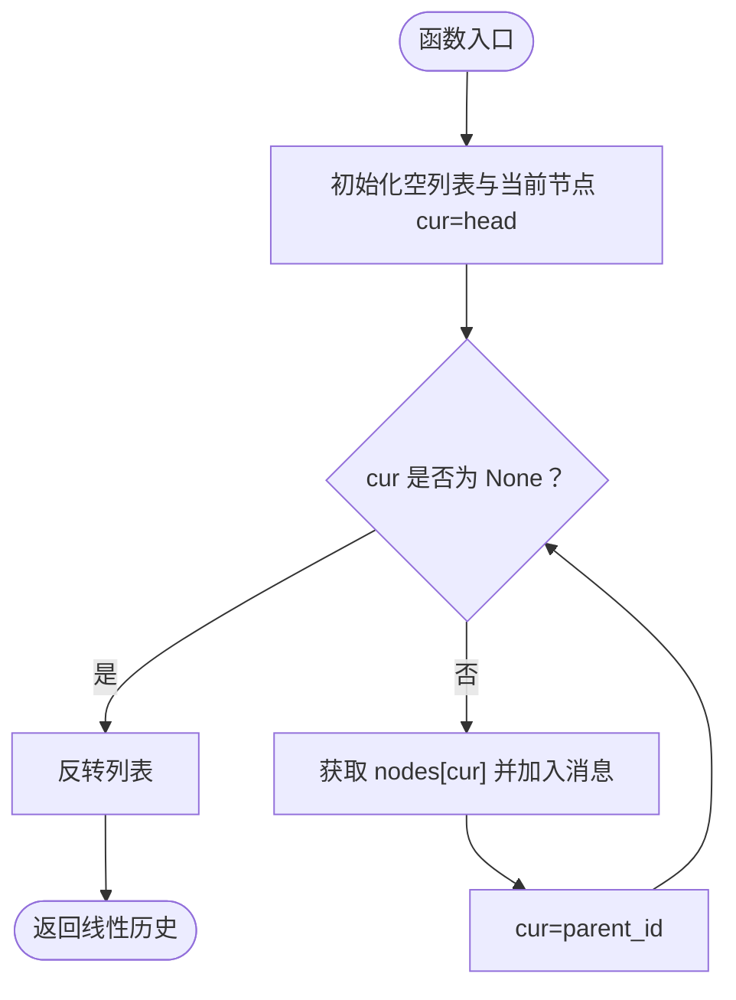
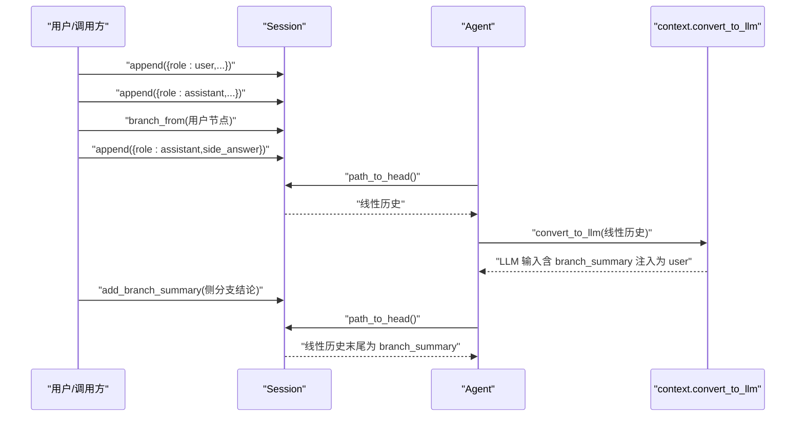
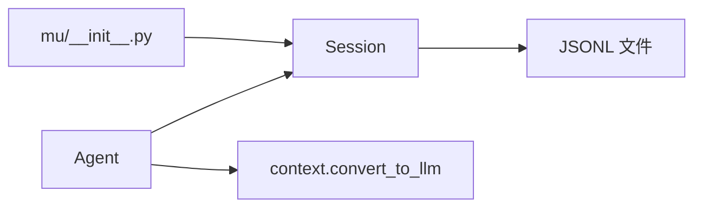

# 会话管理

<cite>
**本文引用的文件**
- [mu/session.py](file://mu/session.py)
- [tests/test_session.py](file://tests/test_session.py)
- [mu/agent.py](file://mu/agent.py)
- [mu/context.py](file://mu/context.py)
- [mu/__init__.py](file://mu/__init__.py)
</cite>

## 目录
1. [引言](#引言)
2. [项目结构](#项目结构)
3. [核心组件](#核心组件)
4. [架构总览](#架构总览)
5. [详细组件分析](#详细组件分析)
6. [依赖分析](#依赖分析)
7. [性能考量](#性能考量)
8. [故障排查指南](#故障排查指南)
9. [结论](#结论)
10. [附录](#附录)

## 引言
本文件系统性解析 μ 项目中的会话管理（Session Management）设计与实现，重点围绕 Session 类的树形结构、消息历史维护、分支与合并能力、持久化与恢复机制、会话 ID 生成规则，以及在 Agent 循环中的使用方式。文档同时提供面向开发者的操作示例与最佳实践，帮助快速理解并正确使用树形会话。

## 项目结构
本次文档聚焦于与会话管理直接相关的模块与测试：
- 会话核心：mu/session.py
- 上下文转换：mu/context.py
- Agent 使用会话：mu/agent.py
- 会话导出入口：mu/__init__.py
- 会话行为测试：tests/test_session.py

图表来源
- [mu/session.py:1-115](file://mu/session.py#L1-L115)
- [mu/context.py:1-31](file://mu/context.py#L1-L31)
- [mu/agent.py:1-223](file://mu/agent.py#L1-L223)
- [tests/test_session.py:1-59](file://tests/test_session.py#L1-L59)
- [mu/__init__.py:1-33](file://mu/__init__.py#L1-L33)

章节来源
- [mu/session.py:1-115](file://mu/session.py#L1-L115)
- [mu/context.py:1-31](file://mu/context.py#L1-L31)
- [mu/agent.py:1-223](file://mu/agent.py#L1-L223)
- [tests/test_session.py:1-59](file://tests/test_session.py#L1-L59)
- [mu/__init__.py:1-33](file://mu/__init__.py#L1-L33)

## 核心组件
- Session：树形会话核心，负责消息节点的创建、索引、持久化、导航与加载。
- Node：消息节点数据结构，包含 id、parent_id、时间戳与消息体。
- Agent.messages：会话当前分支的线性历史视图（path_to_head）。
- context.convert_to_llm：将内部历史转换为 LLM 输入格式，特殊处理 branch_summary。

章节来源
- [mu/session.py:30-115](file://mu/session.py#L30-L115)
- [mu/agent.py:77-81](file://mu/agent.py#L77-L81)
- [mu/context.py:20-31](file://mu/context.py#L20-L31)

## 架构总览
树形会话将消息以“节点”形式存储，每个节点记录父节点 id，形成可回溯的历史树。当前分支的线性历史由 head 沿 parent_id 回溯至根节点构成。会话以 JSONL 文件持久化，支持加载与恢复。

图表来源
- [mu/session.py:30-115](file://mu/session.py#L30-L115)
- [mu/agent.py:43-204](file://mu/agent.py#L43-L204)
- [mu/context.py:20-31](file://mu/context.py#L20-L31)

## 详细组件分析

### Session 类与树形结构
- 数据结构
  - Node：承载单条消息及其父子关系与时间戳。
  - nodes：节点字典，键为节点 id，值为 Node。
  - children：父到子的映射，用于快速定位分支末端（叶子）。
  - head：当前分支的最新节点 id。
- 关键方法
  - append：创建新节点，设置 parent_id 为当前 head，更新 head，并持久化。
  - path_to：从指定节点沿 parent_id 回溯到根，得到线性历史。
  - path_to_head：当前分支线性历史。
  - branch_from：切换 head 到任意已存在节点，实现分支。
  - leaves：计算当前树的所有叶子节点。
  - add_branch_summary：在当前 head 追加一条自定义类型的消息，便于后续注入到 LLM 上下文。
  - load：从 JSONL 文件重建 nodes、children 与 head。
- 持久化
  - JSONL：逐行写入节点信息，append 时立即落盘，确保可复现与 KV-cache 友好。
  - 目录优先级：可通过环境变量覆盖默认目录，否则位于工作目录下的 .mu/sessions。

章节来源
- [mu/session.py:30-115](file://mu/session.py#L30-L115)

### path_to_head 的实现原理
- path_to(head) 通过循环从 head 回溯 parent_id，收集消息，最后反转得到从根到 head 的线性序列。
- path_to_head 是 messages 属性的底层实现，确保 Agent 仅看到当前分支的线性历史。

图表来源
- [mu/session.py:76-88](file://mu/session.py#L76-L88)

章节来源
- [mu/session.py:76-88](file://mu/session.py#L76-L88)

### 分支与合并（fork 与 merge）
- 分支（fork）
  - 通过 branch_from 将 head 移动到任意已存在的节点，随后 append 即可在此分支上继续扩展。
  - 多个分支共享同一父节点，但各自拥有独立的 head。
- 合并（merge）
  - 通过 add_branch_summary 在主线 head 追加一条自定义消息，将侧分支的结论注入主线上下文。
  - Agent 的 summarize_branch 方法可辅助生成摘要并追加到主线，便于后续继续主流程。

图表来源
- [mu/session.py:49-58](file://mu/session.py#L49-L58)
- [mu/session.py:90-93](file://mu/session.py#L90-L93)
- [mu/agent.py:175-198](file://mu/agent.py#L175-L198)
- [mu/context.py:20-31](file://mu/context.py#L20-L31)

章节来源
- [mu/session.py:49-58](file://mu/session.py#L49-L58)
- [mu/session.py:90-93](file://mu/session.py#L90-L93)
- [mu/agent.py:175-198](file://mu/agent.py#L175-L198)
- [mu/context.py:20-31](file://mu/context.py#L20-L31)

### 消息历史维护与上下文转换
- 消息历史
  - 采用 append-only 的 JSONL 持久化，每条消息一行，包含 id、parent_id、ts、msg。
  - 加载时按顺序重建 nodes 与 children，并将 head 设为最后一个节点。
- 上下文转换
  - convert_to_llm 将内部历史转换为 LLM 输入格式，标准角色透传，自定义类型（如 branch_summary）转换为 user 角色消息注入主线。

章节来源
- [mu/session.py:65-72](file://mu/session.py#L65-L72)
- [mu/session.py:98-114](file://mu/session.py#L98-L114)
- [mu/context.py:20-31](file://mu/context.py#L20-L31)

### 会话 ID 生成与唯一性
- 会话 ID 由 UUID v4 的十六进制前缀截断组成，长度为 12 字符。
- 会话文件名以会话 ID 命名，避免冲突。
- 唯一性保障：基于 UUID v4 的随机性，结合前缀截断，满足工程场景下的唯一性需求。

章节来源
- [mu/session.py:20-21](file://mu/session.py#L20-L21)
- [mu/session.py:40-42](file://mu/session.py#L40-L42)

### 会话目录与环境变量
- 默认目录：工作目录下的 .mu/sessions。
- 可通过环境变量 MU_SESSION_DIR 覆盖默认目录，便于统一管理或测试隔离。

章节来源
- [mu/session.py:24-27](file://mu/session.py#L24-L27)

### Agent 中的会话使用
- messages 属性：返回当前分支的线性历史（path_to_head），供上下文管线使用。
- run 循环：在首次运行时注入 system 消息，随后按轮次追加 user、assistant、tool 消息。
- summarize_branch：将侧分支结论作为 branch_summary 追加到主线，便于后续继续主流程。

章节来源
- [mu/agent.py:77-81](file://mu/agent.py#L77-L81)
- [mu/agent.py:82-132](file://mu/agent.py#L82-L132)
- [mu/agent.py:175-198](file://mu/agent.py#L175-L198)

### 测试验证要点
- 线性路径构建：连续 append 生成正确的线性历史。
- 持久化往返：写入 JSONL 后可正确加载并恢复 head 与历史。
- 分支行为：从中间节点 branch_from 后继续 append，形成两条叶子路径。
- 分支摘要：在主线追加 branch_summary，最终注入到 LLM 上下文。

章节来源
- [tests/test_session.py:7-12](file://tests/test_session.py#L7-L12)
- [tests/test_session.py:15-24](file://tests/test_session.py#L15-L24)
- [tests/test_session.py:27-39](file://tests/test_session.py#L27-L39)
- [tests/test_session.py:42-48](file://tests/test_session.py#L42-L48)

## 依赖分析
- Session 与 Agent
  - Agent 持有 Session 实例，并通过 messages 获取当前分支线性历史。
  - Agent 在工具调用前后追加 tool 与 assistant 消息，维持线性历史。
- Session 与 context
  - Agent 在调用模型前，先将 messages 经过 transform_context，再经 convert_to_llm 转换为 LLM 输入。
  - convert_to_llm 对 branch_summary 进行特殊处理，注入到主线上下文。
- 导出与入口
  - mu/__init__.py 将 Session 暴露为公共 API，便于外部导入使用。

图表来源
- [mu/agent.py:77-81](file://mu/agent.py#L77-L81)
- [mu/context.py:20-31](file://mu/context.py#L20-L31)
- [mu/session.py:65-72](file://mu/session.py#L65-L72)
- [mu/__init__.py:11](file://mu/__init__.py#L11)

章节来源
- [mu/agent.py:77-81](file://mu/agent.py#L77-L81)
- [mu/context.py:20-31](file://mu/context.py#L20-L31)
- [mu/session.py:65-72](file://mu/session.py#L65-L72)
- [mu/__init__.py:11](file://mu/__init__.py#L11)

## 性能考量
- 写入开销
  - append 采用追加写 JSONL，每次写入为 O(1) 操作，适合增量持久化。
- 查询与导航
  - path_to 为 O(L)，L 为路径长度；leaves 计算为 O(N)，N 为节点数。
- 内存占用
  - nodes 与 children 映射在内存中，适合中小规模对话历史；大规模历史建议分段或定期归档。
- 恢复效率
  - load 顺序扫描 JSONL，重建索引，时间复杂度 O(N)；适合离线恢复。

[本节为通用性能讨论，无需特定文件来源]

## 故障排查指南
- 无法找到会话文件
  - 症状：加载会话时报错。
  - 排查：确认会话 ID 正确且 JSONL 文件存在；检查 MU_SESSION_DIR 环境变量是否指向正确目录。
  - 参考：[mu/session.py:98-102](file://mu/session.py#L98-L102)
- 分支节点不存在
  - 症状：branch_from 抛出 KeyError。
  - 排查：确认传入的 node_id 来自同一会话实例；检查 nodes 索引是否正确。
  - 参考：[mu/session.py:90-93](file://mu/session.py#L90-L93)
- 分支摘要未注入 LLM
  - 症状：branch_summary 未出现在 LLM 输入。
  - 排查：确认 convert_to_llm 被调用；检查消息类型是否为 branch_summary。
  - 参考：[mu/context.py:20-31](file://mu/context.py#L20-L31)
- 会话目录权限问题
  - 症状：无法创建或写入 JSONL 文件。
  - 排查：确认目标目录存在且具备写权限；必要时调整 MU_SESSION_DIR。
  - 参考：[mu/session.py:65-72](file://mu/session.py#L65-L72)

章节来源
- [mu/session.py:98-102](file://mu/session.py#L98-L102)
- [mu/session.py:90-93](file://mu/session.py#L90-L93)
- [mu/context.py:20-31](file://mu/context.py#L20-L31)
- [mu/session.py:65-72](file://mu/session.py#L65-L72)

## 结论
Session 的树形结构设计提供了灵活的消息历史管理能力：线性历史（path_to_head）满足 LLM 上下文输入，分支（branch_from）支持探索性任务，合并（add_branch_summary）将侧分支成果带回主线。配合 JSONL 持久化与加载，实现了可复现、可恢复、可观察的会话闭环。在 Agent 中，messages 属性统一了上下文来源，convert_to_llm 则确保自定义消息（如 branch_summary）被正确注入主线。

[本节为总结性内容，无需特定文件来源]

## 附录

### 会话操作示例（步骤说明）
以下示例以“代码片段路径”形式给出，便于在实际项目中定位与参考。

- 创建会话并追加消息
  - 步骤：构造 Session 实例，连续调用 append 追加消息。
  - 参考：[mu/session.py:49-54](file://mu/session.py#L49-L54)
- 查看当前分支线性历史
  - 步骤：调用 path_to_head 或使用 Agent.messages。
  - 参考：[mu/session.py:87-88](file://mu/session.py#L87-L88)、[mu/agent.py:77-81](file://mu/agent.py#L77-L81)
- 从中间节点分支
  - 步骤：先记录某个节点的 id，再调用 branch_from，随后继续 append。
  - 参考：[tests/test_session.py:27-39](file://tests/test_session.py#L27-L39)、[mu/session.py:90-93](file://mu/session.py#L90-L93)
- 在主线追加分支摘要
  - 步骤：在主线 head 调用 add_branch_summary，将侧分支结论注入主线。
  - 参考：[mu/session.py:56-58](file://mu/session.py#L56-L58)、[tests/test_session.py:42-48](file://tests/test_session.py#L42-L48)
- 加载并恢复会话
  - 步骤：使用 Session.load 指定会话 ID 与目录，恢复 nodes、children 与 head。
  - 参考：[mu/session.py:98-114](file://mu/session.py#L98-L114)、[tests/test_session.py:15-24](file://tests/test_session.py#L15-L24)
- 会话 ID 生成与目录配置
  - 步骤：若未显式传入 session_id，则自动生成；可通过 MU_SESSION_DIR 指定存储目录。
  - 参考：[mu/session.py:20-21](file://mu/session.py#L20-L21)、[mu/session.py:24-27](file://mu/session.py#L24-L27)