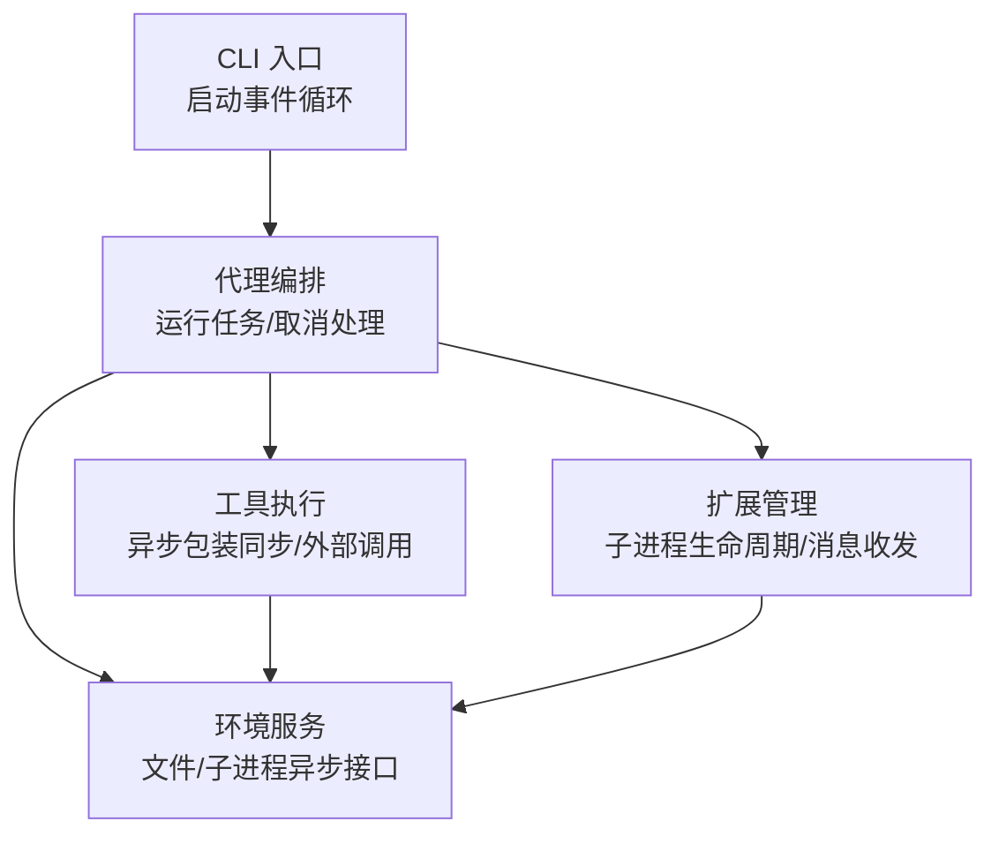
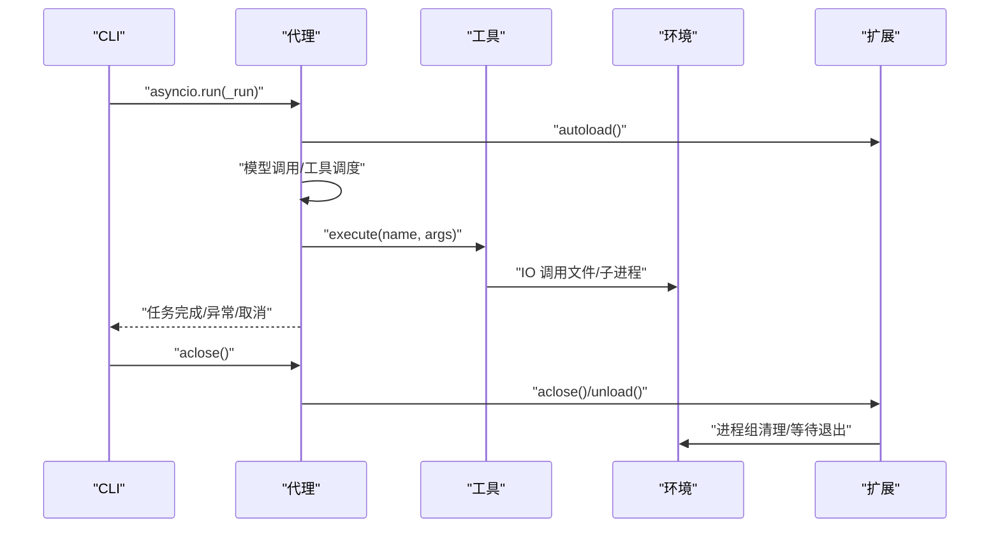
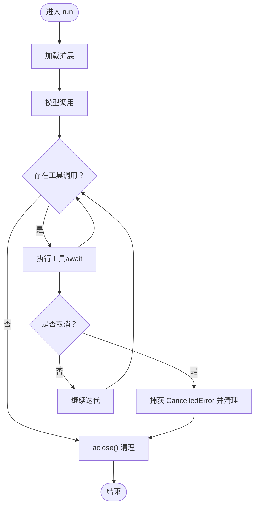
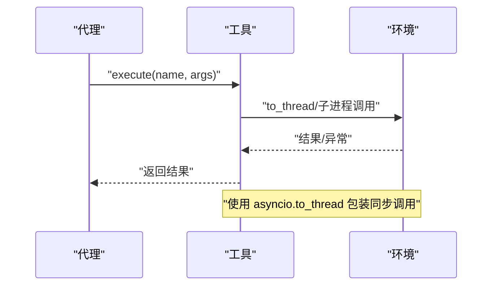
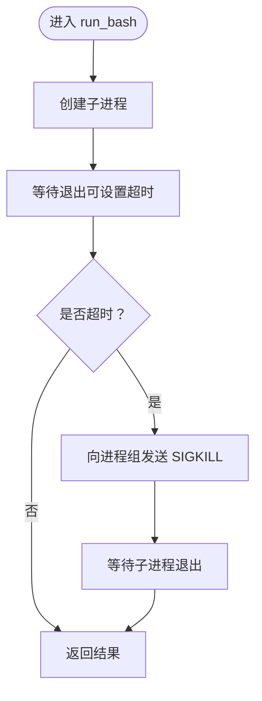
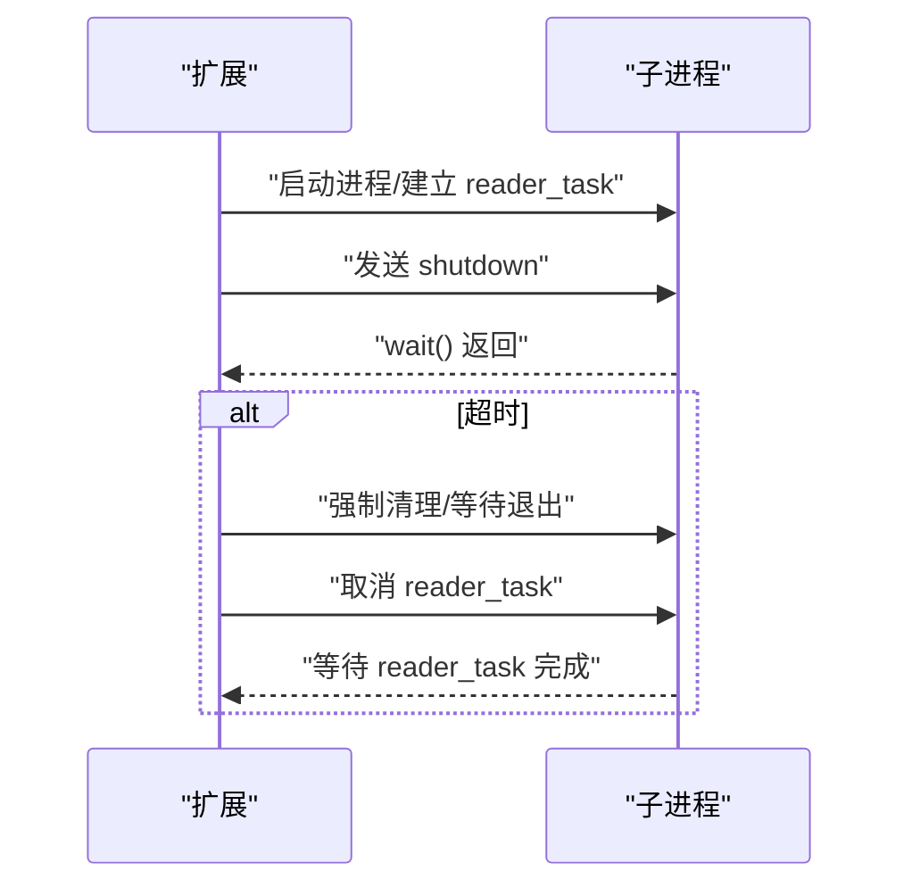
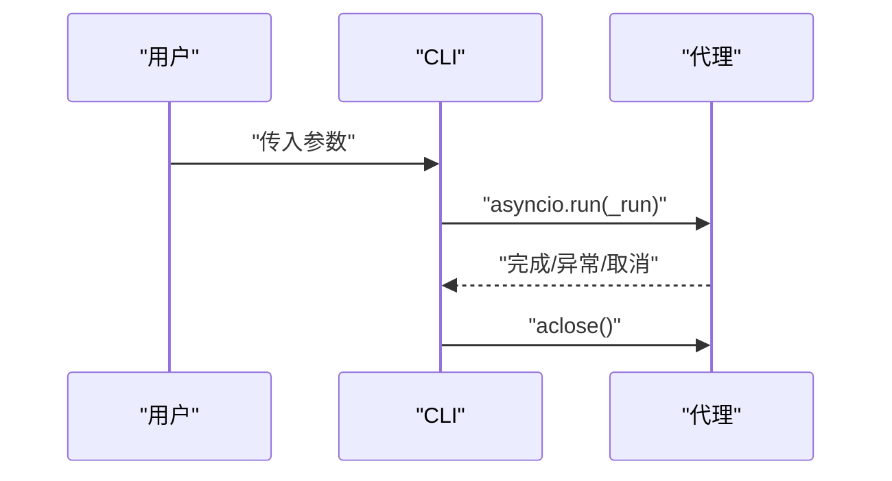
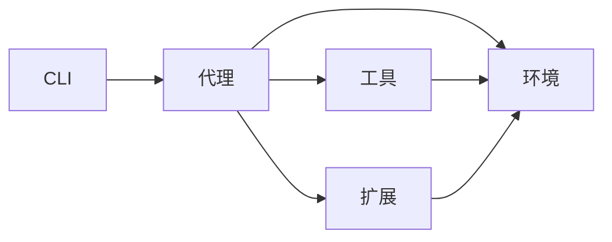

# 异步编程模型

<cite>
**本文引用的文件**
- [mu/agent.py](file://mu/agent.py)
- [mu/cli.py](file://mu/cli.py)
- [mu/tools.py](file://mu/tools.py)
- [mu/environment.py](file://mu/environment.py)
- [mu/extension.py](file://mu/extension.py)
- [mu/codeact.py](file://mu/codeact.py)
- [tests/test_agent_loop.py](file://tests/test_agent_loop.py)
- [tests/test_terminate.py](file://tests/test_terminate.py)
- [tests/test_streaming.py](file://tests/test_streaming.py)
</cite>

## 目录
1. [引言](#引言)
2. [项目结构](#项目结构)
3. [核心组件](#核心组件)
4. [架构总览](#架构总览)
5. [详细组件分析](#详细组件分析)
6. [依赖关系分析](#依赖关系分析)
7. [性能考量](#性能考量)
8. [故障排查指南](#故障排查指南)
9. [结论](#结论)
10. [附录](#附录)

## 引言
本文件系统化阐述 μ 项目中的异步编程模型与实践，重点覆盖以下方面：
- asyncio 的使用场景与调用方式：异步模型调用、工具执行、取消处理
- 异步模式对并发性能与响应性的提升
- 取消机制（CancelledError）的实现与处理策略
- 异步上下文管理器与 aclose 方法的使用
- 异步编程最佳实践与常见陷阱（错误处理、资源管理）
- 具体异步代码示例路径与性能优化技巧

## 项目结构
μ 项目采用模块化的异步架构，围绕“代理-工具-环境-扩展”四层协作展开。入口通过 CLI 启动事件循环，代理负责编排工具调用与取消处理，工具层封装同步/外部进程调用为异步接口，环境层提供文件与子进程等 IO 密集型操作的异步包装，扩展层负责外部子进程生命周期与消息收发。

图表来源
- [mu/cli.py:1-140](file://mu/cli.py#L1-L140)
- [mu/agent.py:1-220](file://mu/agent.py#L1-L220)
- [mu/tools.py:1-200](file://mu/tools.py#L1-L200)
- [mu/environment.py:1-120](file://mu/environment.py#L1-L120)
- [mu/extension.py:1-250](file://mu/extension.py#L1-L250)

章节来源
- [mu/cli.py:1-140](file://mu/cli.py#L1-L140)
- [mu/agent.py:1-220](file://mu/agent.py#L1-L220)

## 核心组件
- 代理（Agent）：负责任务编排、模型调用、工具执行、取消处理与资源关闭（aclose）。在关键流程中捕获 CancelledError 并进行清理。
- 工具（Tools）：提供工具注册与执行接口，内部以异步方式包装同步或外部进程调用，确保非阻塞。
- 环境（Environment）：提供文件读写与 bash 子进程执行的异步接口，并包含进程组清理逻辑。
- 扩展（Extension）：管理外部扩展子进程的加载、消息收发与卸载，包含超时与取消处理。
- CLI：统一通过 asyncio.run 启动事件循环，协调代理生命周期与资源关闭。

章节来源
- [mu/agent.py:80-200](file://mu/agent.py#L80-L200)
- [mu/tools.py:1-200](file://mu/tools.py#L1-L200)
- [mu/environment.py:20-120](file://mu/environment.py#L20-L120)
- [mu/extension.py:199-233](file://mu/extension.py#L199-L233)
- [mu/cli.py:1-140](file://mu/cli.py#L1-L140)

## 架构总览
下图展示了从 CLI 到代理、工具、环境与扩展的异步调用链路，以及取消与资源关闭的关键节点。

图表来源
- [mu/cli.py:70-130](file://mu/cli.py#L70-L130)
- [mu/agent.py:80-200](file://mu/agent.py#L80-L200)
- [mu/tools.py:1-200](file://mu/tools.py#L1-L200)
- [mu/environment.py:20-120](file://mu/environment.py#L20-L120)
- [mu/extension.py:199-233](file://mu/extension.py#L199-L233)

## 详细组件分析

### 代理（Agent）：异步编排与取消处理
- 运行流程：代理在 run 中依次完成扩展自动加载、模型调用与工具执行；在工具执行过程中捕获 CancelledError 并进行清理。
- 取消处理：在 run 与 _run_tool_calls 中显式捕获 CancelledError，保证取消时能安全退出。
- 资源关闭：提供 aclose，确保扩展等子系统在取消或异常情况下也能被正确关闭。

图表来源
- [mu/agent.py:80-150](file://mu/agent.py#L80-L150)
- [mu/agent.py:120-150](file://mu/agent.py#L120-L150)
- [mu/agent.py:199-205](file://mu/agent.py#L199-L205)

章节来源
- [mu/agent.py:80-205](file://mu/agent.py#L80-L205)

### 工具（Tools）：异步包装同步/外部调用
- 工具执行：通过 execute 将工具名与参数映射到具体实现，内部以异步方式包装同步或外部进程调用，避免阻塞事件循环。
- 超时控制：在代码执行场景中使用 wait_for 限制单次工具执行时间，防止卡死。

图表来源
- [mu/tools.py:1-200](file://mu/tools.py#L1-L200)
- [mu/codeact.py:90-130](file://mu/codeact.py#L90-L130)

章节来源
- [mu/tools.py:1-200](file://mu/tools.py#L1-L200)
- [mu/codeact.py:90-130](file://mu/codeact.py#L90-L130)

### 环境（Environment）：文件与子进程的异步接口
- 文件读写：通过 asyncio.to_thread 将同步文件操作放入线程池，避免阻塞事件循环。
- 子进程执行：提供 run_bash 异步接口，支持超时与进程组清理。
- 进程组清理：在超时或异常时，向整个进程组发送信号并等待回收，确保僵尸进程不遗留。

图表来源
- [mu/environment.py:20-80](file://mu/environment.py#L20-L80)

章节来源
- [mu/environment.py:20-80](file://mu/environment.py#L20-L80)

### 扩展（Extension）：子进程生命周期与消息收发
- 加载与卸载：加载时建立子进程与读取任务，卸载时先发送 shutdown 消息，再等待退出；若超时则强制清理。
- 取消处理：读取任务在卸载时显式取消并捕获 CancelledError，避免未处理异常。
- 资源关闭：显式关闭 stdin，避免事件循环关闭后产生资源告警。

图表来源
- [mu/extension.py:199-233](file://mu/extension.py#L199-L233)

章节来源
- [mu/extension.py:199-233](file://mu/extension.py#L199-L233)

### CLI：事件循环与生命周期管理
- 启动：通过 asyncio.run 启动事件循环，统一调度代理运行与资源关闭。
- 生命周期：在任务完成后调用 agent.aclose，确保扩展等子系统得到清理。

图表来源
- [mu/cli.py:1-140](file://mu/cli.py#L1-L140)

章节来源
- [mu/cli.py:1-140](file://mu/cli.py#L1-L140)

## 依赖关系分析
- 组件耦合：代理依赖工具与环境；工具依赖环境；扩展独立但与代理交互；CLI 仅作为入口。
- 取消传播：代理与扩展在关键路径上显式处理 CancelledError，避免异常冒泡导致资源泄漏。
- 资源管理：aclose 与显式取消 reader_task 保证资源有序释放。

图表来源
- [mu/cli.py:1-140](file://mu/cli.py#L1-L140)
- [mu/agent.py:80-205](file://mu/agent.py#L80-L205)
- [mu/tools.py:1-200](file://mu/tools.py#L1-L200)
- [mu/environment.py:20-120](file://mu/environment.py#L20-L120)
- [mu/extension.py:199-233](file://mu/extension.py#L199-L233)

章节来源
- [mu/cli.py:1-140](file://mu/cli.py#L1-L140)
- [mu/agent.py:80-205](file://mu/agent.py#L80-L205)
- [mu/tools.py:1-200](file://mu/tools.py#L1-L200)
- [mu/environment.py:20-120](file://mu/environment.py#L20-L120)
- [mu/extension.py:199-233](file://mu/extension.py#L199-L233)

## 性能考量
- 线程池隔离：使用 asyncio.to_thread 将 CPU 密集或阻塞调用移出事件循环，避免阻塞主循环。
- 超时控制：在工具执行与扩展等待中引入超时，防止长时间挂起。
- 进程组清理：对子进程组进行统一清理，降低资源泄漏风险与系统压力。
- 取消早返回：在代理与扩展中及时捕获取消并清理，减少无效工作量。

## 故障排查指南
- 取消相关问题
  - 症状：任务被取消但资源未释放
  - 排查点：确认代理与扩展是否在关键路径捕获 CancelledError 并清理
  - 参考路径：[mu/agent.py:120-150](file://mu/agent.py#L120-L150)、[mu/extension.py:226-233](file://mu/extension.py#L226-L233)
- 子进程清理失败
  - 症状：僵尸进程或句柄泄漏
  - 排查点：检查 run_bash 的进程组清理逻辑与 wait 调用
  - 参考路径：[mu/environment.py:50-80](file://mu/environment.py#L50-L80)
- 工具执行超时
  - 症状：工具执行无响应
  - 排查点：确认 wait_for 超时设置与异常处理
  - 参考路径：[mu/codeact.py:90-130](file://mu/codeact.py#L90-L130)
- 资源关闭顺序
  - 症状：事件循环关闭后出现资源告警
  - 排查点：确认显式关闭 stdin 与取消 reader_task
  - 参考路径：[mu/extension.py:220-233](file://mu/extension.py#L220-L233)

章节来源
- [mu/agent.py:120-150](file://mu/agent.py#L120-L150)
- [mu/extension.py:220-233](file://mu/extension.py#L220-L233)
- [mu/environment.py:50-80](file://mu/environment.py#L50-L80)
- [mu/codeact.py:90-130](file://mu/codeact.py#L90-L130)

## 结论
μ 项目通过清晰的异步分层与严格的取消/资源管理策略，在保持高响应性的同时提升了并发性能。关键实践包括：使用 asyncio.to_thread 隔离阻塞调用、在工具与扩展中引入超时与取消处理、在生命周期末尾统一调用 aclose 与取消任务。这些设计共同保障了系统的稳定性与可维护性。

## 附录
- 最佳实践清单
  - 使用 asyncio.to_thread 包装同步/阻塞调用
  - 对外部进程调用设置合理超时
  - 在取消路径显式捕获 CancelledError 并清理
  - 在生命周期末尾调用 aclose 与取消任务
  - 显式关闭 stdin 等底层资源，避免告警
- 常见陷阱
  - 忽略取消：未捕获 CancelledError 导致资源泄漏
  - 忽略超时：工具或扩展无超时导致事件循环阻塞
  - 资源关闭顺序不当：事件循环关闭后再释放底层资源