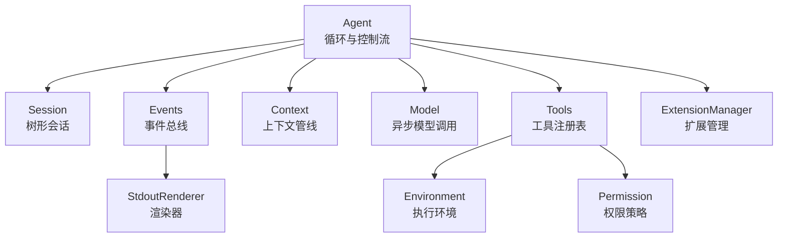
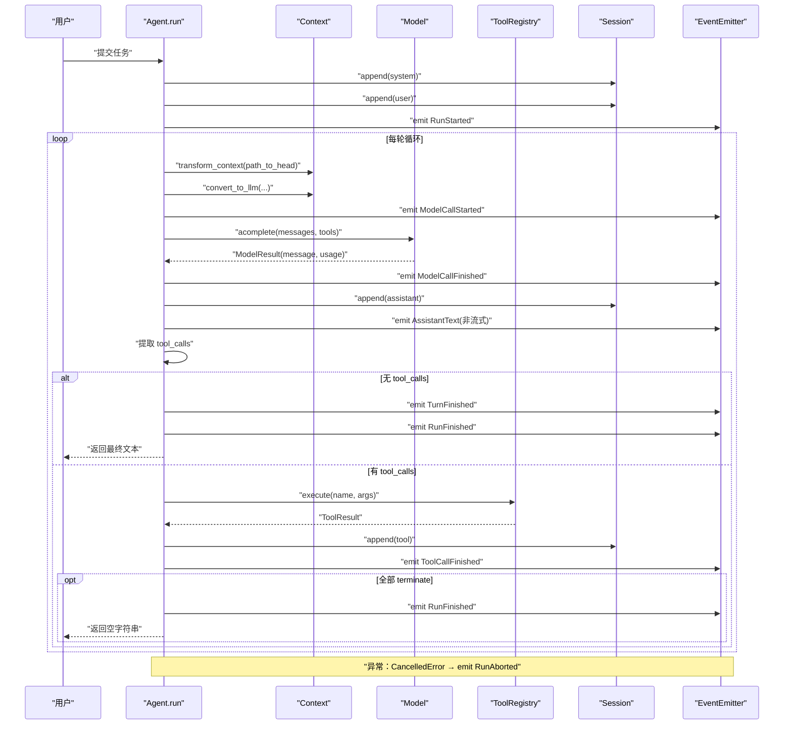
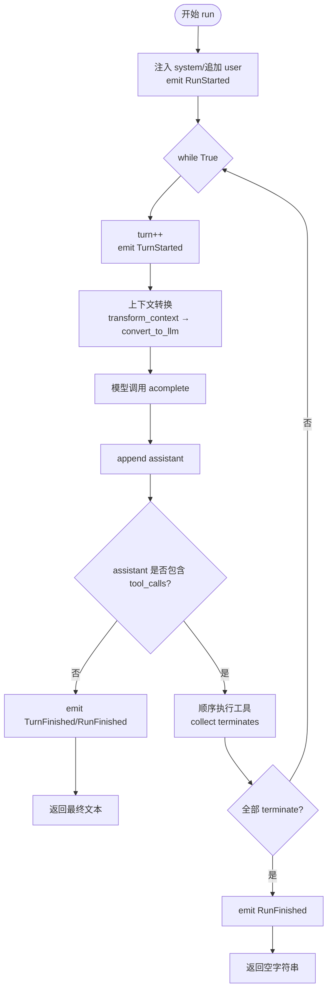
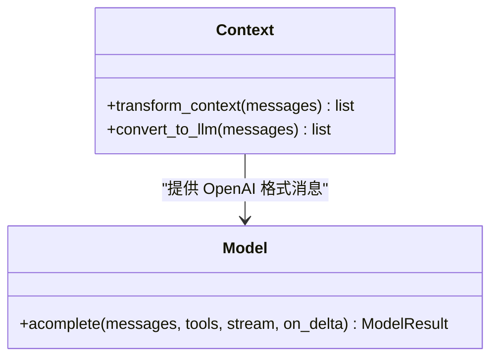
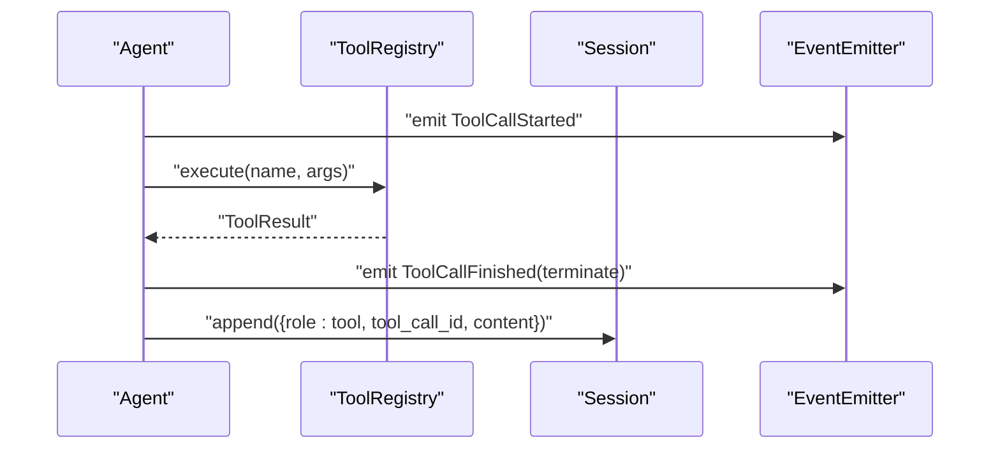
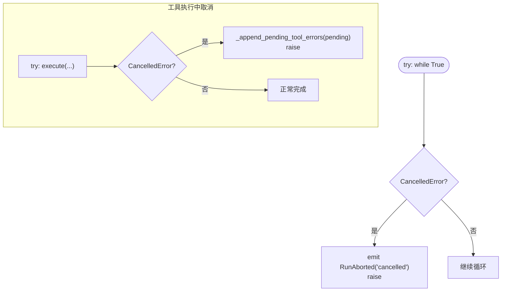
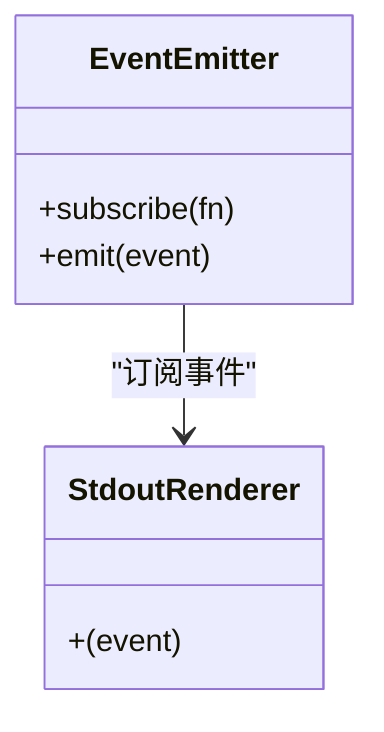
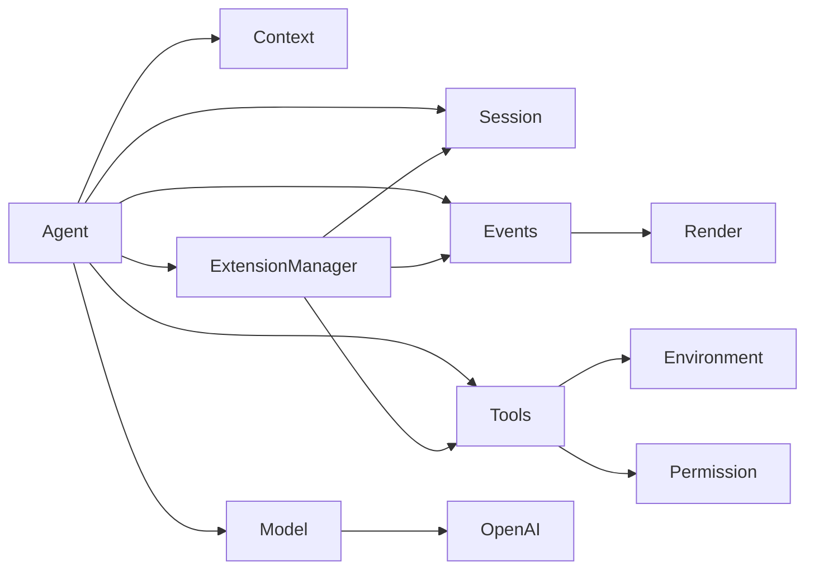

# 智能体循环机制

<cite>
**本文引用的文件列表**
- [README.md](file://README.md)
- [mu/agent.py](file://mu/agent.py)
- [mu/session.py](file://mu/session.py)
- [mu/events.py](file://mu/events.py)
- [mu/context.py](file://mu/context.py)
- [mu/model.py](file://mu/model.py)
- [mu/tools.py](file://mu/tools.py)
- [mu/extension.py](file://mu/extension.py)
- [mu/environment.py](file://mu/environment.py)
- [mu/permission.py](file://mu/permission.py)
- [mu/render.py](file://mu/render.py)
- [tests/test_agent_loop.py](file://tests/test_agent_loop.py)
</cite>

## 目录
1. [引言](#引言)
2. [项目结构](#项目结构)
3. [核心组件](#核心组件)
4. [架构总览](#架构总览)
5. [详细组件分析](#详细组件分析)
6. [依赖关系分析](#依赖关系分析)
7. [性能考量](#性能考量)
8. [故障排查指南](#故障排查指南)
9. [结论](#结论)
10. [附录](#附录)

## 引言
本文围绕 μ 智能体循环（Agent Loop）进行深入解析，重点阐述以下主题：
- 无 max_steps 的 while 循环设计哲学与终止条件判断（以「无 tool_calls」为准）
- 每轮循环的关键步骤：上下文转换、模型调用、工具执行、状态更新
- 异常处理与取消机制（asyncio.CancelledError）的落地实践
- 事件系统与循环的协作关系
- 提供具体测试用例路径，展示正常执行与异常中断场景

## 项目结构
μ 项目采用“薄 async loop + 四个工具 + 原生 function-calling”的极简架构，围绕 Agent 循环展开。核心模块如下：
- Agent：循环主体，负责 run、turn、tool 调用与事件发射
- Session：树形会话存储，支持分支、摘要与 JSONL 持久化
- Events：结构化事件总线，统一订阅与分发
- Context：上下文管线（transform_context → convert_to_llm）
- Model：OpenAI 兼容异步封装，支持流式
- Tools：工具注册表与内置工具（read/write/edit/bash）
- Extension：扩展管理（子进程、JSONL 协议、生命周期）
- Environment/Permission：执行环境与权限策略
- Render：事件流的 stdout 渲染器

图表来源
- [mu/agent.py:82-133](file://mu/agent.py#L82-L133)
- [mu/session.py:38-115](file://mu/session.py#L38-L115)
- [mu/events.py:121-133](file://mu/events.py#L121-L133)
- [mu/context.py:15-31](file://mu/context.py#L15-L31)
- [mu/model.py:91-147](file://mu/model.py#L91-L147)
- [mu/tools.py:191-269](file://mu/tools.py#L191-L269)
- [mu/extension.py:85-364](file://mu/extension.py#L85-L364)
- [mu/environment.py:23-150](file://mu/environment.py#L23-L150)
- [mu/permission.py:29-69](file://mu/permission.py#L29-L69)
- [mu/render.py:31-78](file://mu/render.py#L31-L78)

章节来源
- [README.md:1-127](file://README.md#L1-L127)
- [mu/agent.py:82-133](file://mu/agent.py#L82-L133)

## 核心组件
- Agent.run：主循环入口，负责注入 system、追加 user、触发事件、循环调用模型与工具、终止判断与清理
- Session：树形节点存储，append-only 追加，支持 branch_from、path_to、path_to_head、add_branch_summary
- Events：RunStarted/TurnStarted/ModelCallStarted/AssistantText/ToolCallStarted/ToolCallFinished/TurnFinished/RunFinished/RunAborted 等事件
- Context：transform_context（默认 identity）、convert_to_llm（标准消息透传，自定义类型注入 user 上下文）
- Model：acreate/acomplete 封装，支持流式 consume_stream，返回 ModelResult
- Tools：ToolRegistry 统一执行接口，ToolResult 支持 terminate 标志
- ExtensionManager：扩展加载/调用/重载/卸载，IPC 通信，事件上报
- Environment/Permission：本地 bash 与文件 IO，权限策略基于 capability

章节来源
- [mu/agent.py:43-223](file://mu/agent.py#L43-L223)
- [mu/session.py:38-115](file://mu/session.py#L38-L115)
- [mu/events.py:18-133](file://mu/events.py#L18-L133)
- [mu/context.py:15-31](file://mu/context.py#L15-L31)
- [mu/model.py:91-147](file://mu/model.py#L91-L147)
- [mu/tools.py:191-269](file://mu/tools.py#L191-L269)
- [mu/extension.py:85-364](file://mu/extension.py#L85-L364)
- [mu/environment.py:23-150](file://mu/environment.py#L23-L150)
- [mu/permission.py:29-69](file://mu/permission.py#L29-L69)

## 架构总览
Agent 循环以“无 max_steps”为核心理念，通过「无 tool_calls」作为自然终止条件。每轮循环包含：
- 上下文转换：transform_context → convert_to_llm
- 模型调用：acomplete 返回 ModelResult
- 工具执行：顺序执行 tool_calls，收集 ToolResult 与 terminate 标志
- 状态更新：将 assistant/tool 消息写入 Session，必要时注入 branch_summary
- 事件发射：RunStarted/TurnStarted/ModelCallStarted/AssistantText/ToolCallStarted/ToolCallFinished/TurnFinished/RunFinished/RunAborted

图表来源
- [mu/agent.py:82-133](file://mu/agent.py#L82-L133)
- [mu/context.py:15-31](file://mu/context.py#L15-L31)
- [mu/model.py:112-147](file://mu/model.py#L112-L147)
- [mu/tools.py:253-269](file://mu/tools.py#L253-L269)
- [mu/session.py:49-88](file://mu/session.py#L49-L88)
- [mu/events.py:18-84](file://mu/events.py#L18-L84)

## 详细组件分析

### Agent.run：无 max_steps 循环与终止条件
- 初始化：注入 system、追加 user、触发 RunStarted；按策略 autoload 扩展
- 循环：无限 while True，每轮递增 turn，emit TurnStarted
- 上下文转换：_convert(_transform(session.path_to_head())) → OpenAI 格式
- 模型调用：acomplete 返回 ModelResult，emit ModelCallFinished
- 终止判断：若 assistant_msg 无 tool_calls，则 emit TurnFinished/RunFinished 并返回
- 工具执行：_run_tool_calls 顺序执行，收集 terminate 列表；若全部 terminate，emit RunFinished 并返回空字符串

图表来源
- [mu/agent.py:82-133](file://mu/agent.py#L82-L133)
- [mu/agent.py:134-163](file://mu/agent.py#L134-L163)

章节来源
- [mu/agent.py:82-133](file://mu/agent.py#L82-L133)
- [tests/test_agent_loop.py:58-92](file://tests/test_agent_loop.py#L58-L92)

### 上下文转换与模型调用
- transform_context：默认 identity，后续可做压缩/裁剪/注入
- convert_to_llm：标准消息透传；自定义类型（如 branch_summary）注入为 user 上下文
- Model.acomplete：支持流式 consume_stream，返回 ModelResult（含 usage 与 latency）

图表来源
- [mu/context.py:15-31](file://mu/context.py#L15-L31)
- [mu/model.py:112-147](file://mu/model.py#L112-L147)

章节来源
- [mu/context.py:15-31](file://mu/context.py#L15-L31)
- [mu/model.py:112-147](file://mu/model.py#L112-L147)

### 工具执行与状态更新
- ToolRegistry.execute：统一执行入口，按能力策略 gate，返回 ToolResult（可带 terminate）
- _run_tool_calls：顺序执行 tool_calls，emit ToolCallStarted/ToolCallFinished，append tool 消息
- Session.append：追加 assistant/tool 消息，维护 head 与父子关系，JSONL 持久化

图表来源
- [mu/agent.py:134-163](file://mu/agent.py#L134-L163)
- [mu/tools.py:253-269](file://mu/tools.py#L253-L269)
- [mu/session.py:49-54](file://mu/session.py#L49-L54)

章节来源
- [mu/agent.py:134-163](file://mu/agent.py#L134-L163)
- [mu/tools.py:191-269](file://mu/tools.py#L191-L269)
- [mu/session.py:49-88](file://mu/session.py#L49-L88)

### 异常处理与取消机制
- asyncio.CancelledError：在 run 中捕获，emit RunAborted 并重新抛出，确保会话可恢复
- 工具执行中被取消：_append_pending_tool_errors 为剩余未执行的 tool_call 补充错误结果，保证“每个 assistant tool_call 都有对应 tool 结果”
- 扩展管理：unload 时显式关闭 stdin，避免资源告警；进程组隔离与超时清理

图表来源
- [mu/agent.py:130-133](file://mu/agent.py#L130-L133)
- [mu/agent.py:165-173](file://mu/agent.py#L165-L173)
- [mu/extension.py:235-248](file://mu/extension.py#L235-L248)

章节来源
- [tests/test_agent_loop.py:180-203](file://tests/test_agent_loop.py#L180-L203)
- [mu/agent.py:130-133](file://mu/agent.py#L130-L133)
- [mu/agent.py:165-173](file://mu/agent.py#L165-L173)

### 事件系统与渲染
- EventEmitter：同步订阅分发，emit 多种事件
- StdoutRenderer：订阅事件，支持流式增量打印与块级输出
- 事件贯穿整个循环：RunStarted/TurnStarted/ModelCallStarted/AssistantText/ToolCallStarted/ToolCallFinished/TurnFinished/RunFinished/RunAborted

图表来源
- [mu/events.py:121-133](file://mu/events.py#L121-L133)
- [mu/render.py:31-78](file://mu/render.py#L31-L78)

章节来源
- [mu/events.py:18-84](file://mu/events.py#L18-L84)
- [mu/render.py:31-78](file://mu/render.py#L31-L78)

### 代码示例路径（测试用例）
- 正常执行路径（工具调用后停止）：[tests/test_agent_loop.py:58-81](file://tests/test_agent_loop.py#L58-L81)
- 无 tool_calls 直接停止：[tests/test_agent_loop.py:83-92](file://tests/test_agent_loop.py#L83-L92)
- 工具参数 JSON 解析失败：[tests/test_agent_loop.py:94-105](file://tests/test_agent_loop.py#L94-L105)
- 单轮内多个 tool_calls：[tests/test_agent_loop.py:107-128](file://tests/test_agent_loop.py#L107-L128)
- 多轮闭环（read → edit → bash）：[tests/test_agent_loop.py:130-163](file://tests/test_agent_loop.py#L130-L163)
- 工具执行中被取消（保持会话可恢复）：[tests/test_agent_loop.py:180-203](file://tests/test_agent_loop.py#L180-L203)
- 侧分支摘要带回主线并注入 LLM 上下文：[tests/test_agent_loop.py:205-225](file://tests/test_agent_loop.py#L205-L225)

章节来源
- [tests/test_agent_loop.py:58-225](file://tests/test_agent_loop.py#L58-L225)

## 依赖关系分析
- Agent 依赖：Session、Events、Context、Model、Tools、ExtensionManager
- Tools 依赖：Environment、Permission
- ExtensionManager 依赖：Tools、Session、Events
- Model 依赖：OpenAI SDK
- Events 与 Render：事件与渲染解耦

图表来源
- [mu/agent.py:43-76](file://mu/agent.py#L43-L76)
- [mu/tools.py:191-211](file://mu/tools.py#L191-L211)
- [mu/extension.py:85-104](file://mu/extension.py#L85-L104)
- [mu/model.py:91-111](file://mu/model.py#L91-L111)
- [mu/render.py:10-23](file://mu/render.py#L10-L23)

章节来源
- [mu/agent.py:43-76](file://mu/agent.py#L43-L76)
- [mu/tools.py:191-211](file://mu/tools.py#L191-L211)
- [mu/extension.py:85-104](file://mu/extension.py#L85-L104)
- [mu/model.py:91-111](file://mu/model.py#L91-L111)
- [mu/render.py:10-23](file://mu/render.py#L10-L23)

## 性能考量
- 流式输出：Model.consume_stream 支持增量回调，降低等待时间
- 事件同步分发：避免引入复杂 pub/sub，减少开销
- 会话持久化：JSONL 追加写入，适合大历史与可复现
- 工具执行：顺序执行，避免并发带来的复杂性；并行留待后续版本
- 取消与超时：工具/扩展调用设置超时，进程组隔离清理，防止僵尸进程

## 故障排查指南
- 取消运行：Ctrl-C 触发 asyncio.CancelledError，Agent 会 emit RunAborted 并抛出异常；检查会话尾部 tool_call 是否补全错误结果
- 工具参数 JSON 错误：ToolRegistry.execute 返回“JSON not valid”错误，确认 tool_calls 的 arguments 字符串格式
- 权限拒绝：PermissionPolicy 按能力 gate，readonly/workspace 模式下 write/edit/bash/code/扩展加载均被拦截
- 扩展崩溃：ExtensionManager._degrade_on_exit 会解挂 pending、注销工具并上报 ExtensionError
- bash 超时：LocalEnvironment._kill_process_group 会 SIGKILL 整个进程组，避免孤儿进程

章节来源
- [tests/test_agent_loop.py:94-105](file://tests/test_agent_loop.py#L94-L105)
- [tests/test_agent_loop.py:180-203](file://tests/test_agent_loop.py#L180-L203)
- [mu/permission.py:33-58](file://mu/permission.py#L33-L58)
- [mu/extension.py:275-317](file://mu/extension.py#L275-L317)
- [mu/environment.py:26-48](file://mu/environment.py#L26-L48)

## 结论
μ 智能体循环以“无 max_steps + 无 tool_calls 终止”的简洁设计，实现了稳定、可观测且可扩展的自动化工作流。通过事件系统与上下文管线，Agent 能够在每轮循环中清晰地推进任务，同时在异常与取消场景下保持会话一致性与可恢复性。内置工具与扩展机制进一步增强了系统的实用性与演进空间。

## 附录
- 会话与分支：Session 支持 branch_from、add_branch_summary，配合 convert_to_llm 注入 LLM 上下文
- 侧分支摘要：Agent.summarize_branch 将侧分支结论带回主线，用于后续任务推进
- TUI 与 headless：事件流共享同一 Agent/Session，TUI 作为另一个订阅者

章节来源
- [mu/session.py:56-58](file://mu/session.py#L56-L58)
- [mu/context.py:26-29](file://mu/context.py#L26-L29)
- [mu/agent.py:175-199](file://mu/agent.py#L175-L199)
- [README.md:63-72](file://README.md#L63-L72)