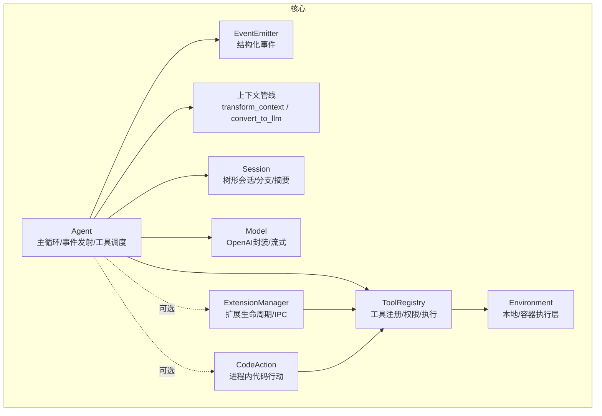
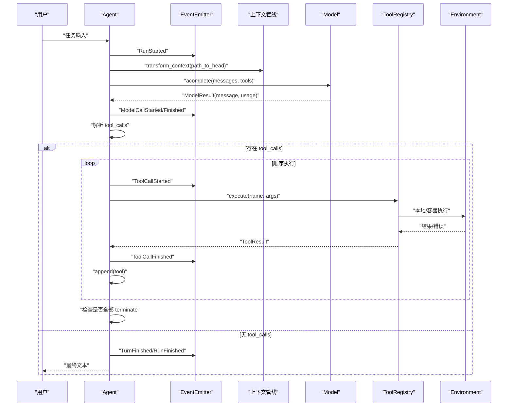
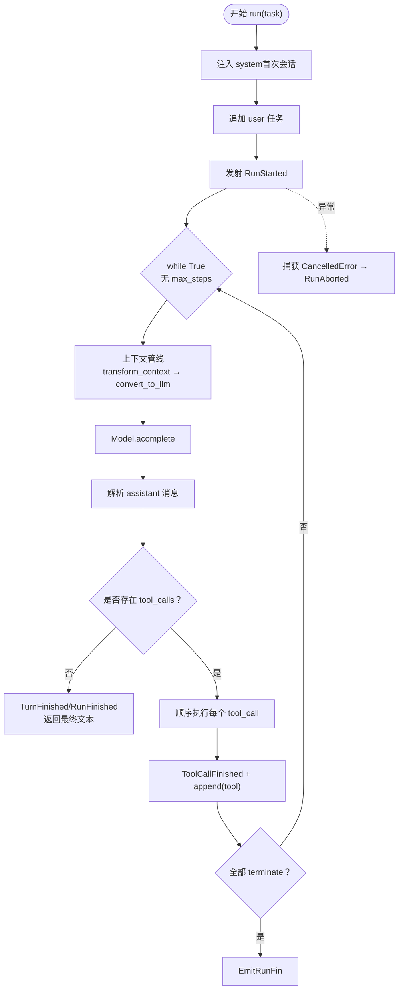
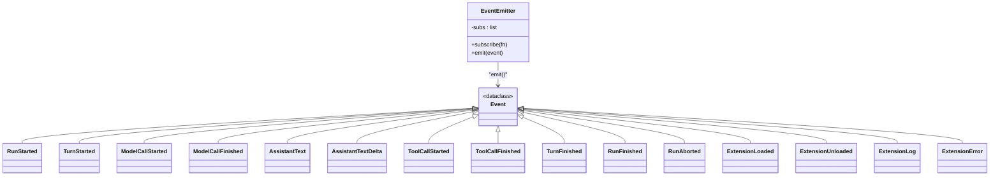
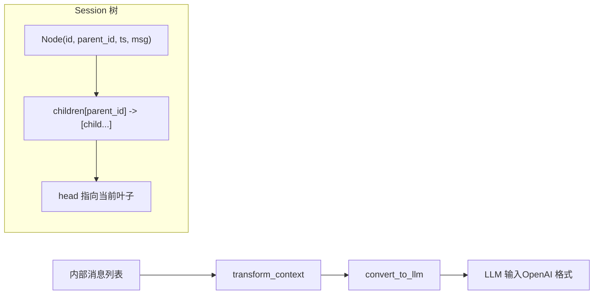
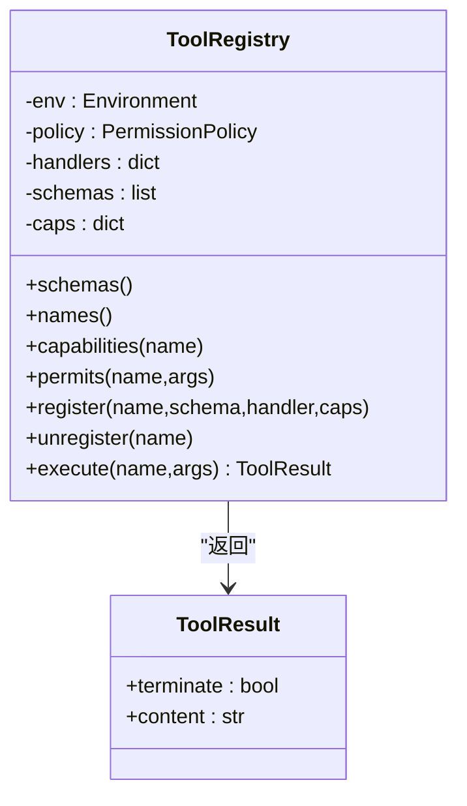
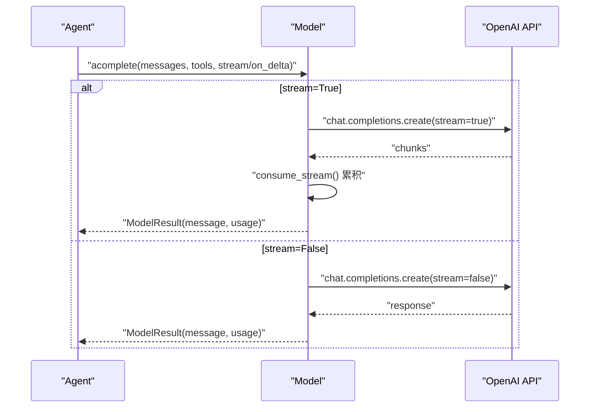
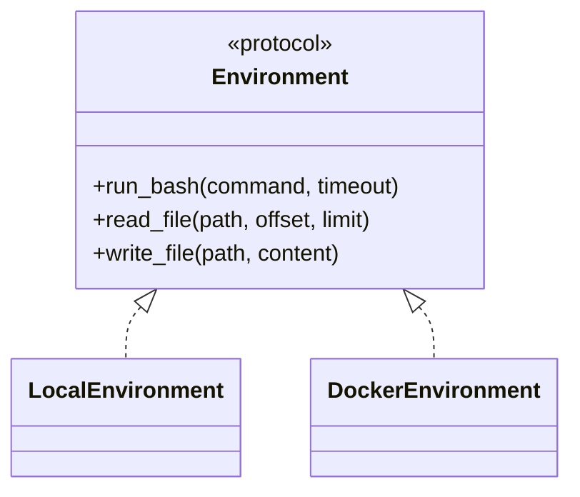
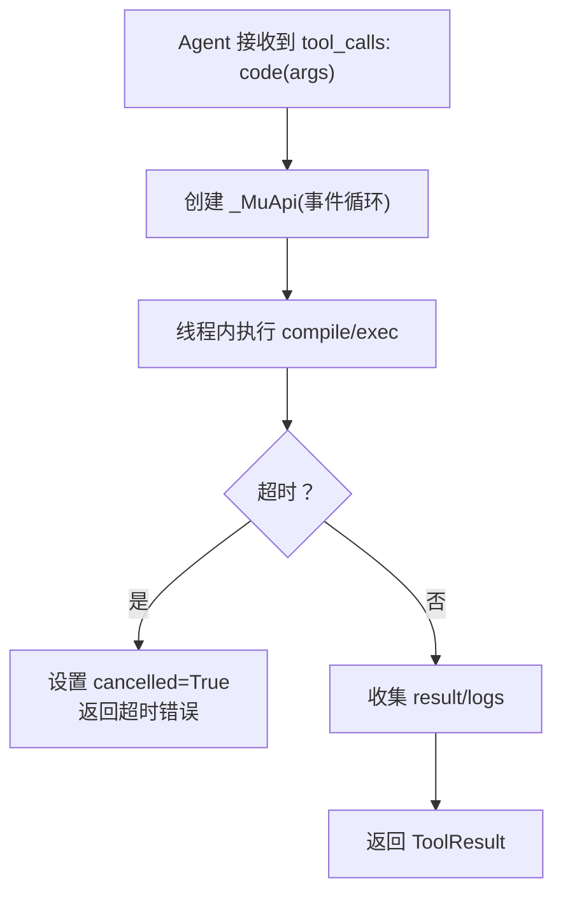
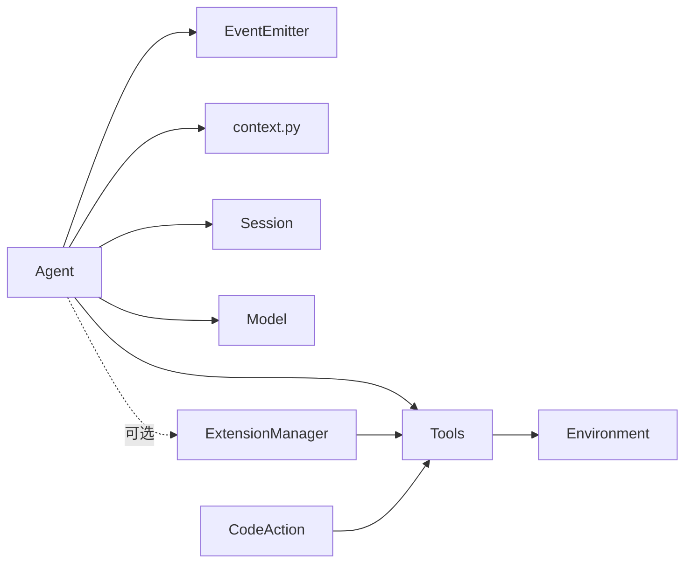

# 核心概念

<cite>
**本文引用的文件**
- [mu/__init__.py](file://mu/__init__.py)
- [mu/agent.py](file://mu/agent.py)
- [mu/events.py](file://mu/events.py)
- [mu/context.py](file://mu/context.py)
- [mu/session.py](file://mu/session.py)
- [mu/tools.py](file://mu/tools.py)
- [mu/model.py](file://mu/model.py)
- [mu/codeact.py](file://mu/codeact.py)
- [mu/environment.py](file://mu/environment.py)
- [mu/extension.py](file://mu/extension.py)
- [mu/extsdk.py](file://mu/extsdk.py)
- [tests/test_agent_loop.py](file://tests/test_agent_loop.py)
- [tests/test_session.py](file://tests/test_session.py)
- [tests/test_events.py](file://tests/test_events.py)
</cite>

## 目录
1. [引言](#引言)
2. [项目结构](#项目结构)
3. [核心组件](#核心组件)
4. [架构总览](#架构总览)
5. [详细组件分析](#详细组件分析)
6. [依赖分析](#依赖分析)
7. [性能考量](#性能考量)
8. [故障排查指南](#故障排查指南)
9. [结论](#结论)
10. [附录](#附录)

## 引言
本文件系统性阐述 μ（mu）智能体的核心概念与架构原理，重点覆盖以下主题：
- 智能体循环（Agent Loop）机制：事件驱动、function-calling 与 tool_calls 流程
- 事件系统：订阅者模式、消息传递与状态管理
- 异步编程模式：在工具执行、模型调用与扩展子进程中的应用与优势
- 上下文管线：transform_context → convert_to_llm 的职责边界
- 会话管理与树形结构：append-only、分支与摘要注入
- 代码示例与架构图解：通过源码路径定位具体实现，帮助初学者建立概念，高级用户获得实现细节

## 项目结构
μ（mu）采用“功能模块化 + 层次清晰”的组织方式：
- 核心入口与导出：通过包级导出统一暴露对外 API
- 智能体与循环：Agent 负责主循环、事件发射、工具调度
- 事件系统：EventEmitter 提供结构化事件与同步订阅分发
- 上下文管线：transform_context 与 convert_to_llm 将内部消息转换为 LLM 输入
- 会话与树：Session 以树形结构存储消息，支持分支与摘要
- 工具与策略：ToolRegistry 统一工具注册、权限策略与执行
- 模型与流式：Model 封装 OpenAI 兼容接口，支持流式累积
- 环境抽象：LocalEnvironment/DockerEnvironment 提供 bash 与文件操作
- 扩展系统：ExtensionManager 管理扩展子进程，提供 load/reload/list 管理工具
- 代码行动：CodeAction 将多轮工具调用压缩为单轮 Python 代码执行



图表来源
- [mu/agent.py:82-133](file://mu/agent.py#L82-L133)
- [mu/events.py:121-133](file://mu/events.py#L121-L133)
- [mu/context.py:15-31](file://mu/context.py#L15-L31)
- [mu/session.py:38-115](file://mu/session.py#L38-L115)
- [mu/tools.py:191-269](file://mu/tools.py#L191-L269)
- [mu/model.py:91-147](file://mu/model.py#L91-L147)
- [mu/environment.py:23-150](file://mu/environment.py#L23-L150)
- [mu/extension.py:85-364](file://mu/extension.py#L85-L364)
- [mu/codeact.py:84-133](file://mu/codeact.py#L84-L133)

章节来源
- [mu/__init__.py:14-31](file://mu/__init__.py#L14-L31)

## 核心组件
- Agent：主循环主体，负责构建上下文、调用模型、解析 tool_calls、触发工具执行、发射事件、处理取消与终止
- EventEmitter：结构化事件与同步订阅分发，支撑多订阅者（渲染、可观测、TUI）
- 上下文管线：transform_context（钩子）与 convert_to_llm（格式转换），保证标准消息透传与自定义消息注入
- Session：树形会话，append-only、分支、摘要注入、持久化
- ToolRegistry：工具注册、权限策略、统一执行接口
- Model：OpenAI 兼容封装，支持流式累积与 usage 返回
- Environment：本地/容器执行层，提供 bash 与文件操作
- ExtensionManager：扩展生命周期管理、IPC、状态恢复
- CodeAction：将多轮工具调用压缩为单轮 Python 代码执行

章节来源
- [mu/agent.py:43-223](file://mu/agent.py#L43-L223)
- [mu/events.py:13-133](file://mu/events.py#L13-L133)
- [mu/context.py:15-31](file://mu/context.py#L15-L31)
- [mu/session.py:38-115](file://mu/session.py#L38-L115)
- [mu/tools.py:191-269](file://mu/tools.py#L191-L269)
- [mu/model.py:91-147](file://mu/model.py#L91-L147)
- [mu/environment.py:23-150](file://mu/environment.py#L23-L150)
- [mu/extension.py:85-364](file://mu/extension.py#L85-L364)
- [mu/codeact.py:84-133](file://mu/codeact.py#L84-L133)

## 架构总览
μ 的核心是“事件驱动 + function-calling”的智能体循环。Agent 在每一轮中：
- 将当前分支路径经上下文管线转换为 LLM 输入
- 调用模型，得到包含 content 与 tool_calls 的响应
- 若存在 tool_calls，则顺序执行工具，记录结果并注入会话
- 若无 tool_calls 或工具返回 terminate，则结束本轮并可继续下一轮直到终止条件满足



图表来源
- [mu/agent.py:82-133](file://mu/agent.py#L82-L133)
- [mu/context.py:15-31](file://mu/context.py#L15-L31)
- [mu/model.py:112-147](file://mu/model.py#L112-L147)
- [mu/tools.py:253-269](file://mu/tools.py#L253-L269)
- [mu/environment.py:23-88](file://mu/environment.py#L23-L88)

## 详细组件分析

### Agent 循环与事件驱动
- 初始化：注入 Model、ToolRegistry、EventEmitter、Session、可选扩展与代码行动
- 主循环：注入 system、追加 user、发射 RunStarted；每轮发射 TurnStarted，构建 LLM 输入，调用模型，发射 ModelCallStarted/Finished
- 工具调用：解析 tool_calls，顺序执行，发射 ToolCallStarted/Finished，记录 terminate 标志；若全部 terminate 则提前结束
- 取消处理：捕获 CancelledError，发射 RunAborted，保持会话一致性（每个 tool_call 都有对应 tool 结果）



图表来源
- [mu/agent.py:82-133](file://mu/agent.py#L82-L133)
- [mu/agent.py:134-163](file://mu/agent.py#L134-L163)

章节来源
- [mu/agent.py:82-133](file://mu/agent.py#L82-L133)
- [tests/test_agent_loop.py:58-92](file://tests/test_agent_loop.py#L58-L92)
- [tests/test_agent_loop.py:107-128](file://tests/test_agent_loop.py#L107-L128)
- [tests/test_agent_loop.py:130-163](file://tests/test_agent_loop.py#L130-L163)
- [tests/test_agent_loop.py:180-203](file://tests/test_agent_loop.py#L180-L203)

### 事件系统：订阅者模式、消息传递与状态管理
- 结构化事件：RunStarted、TurnStarted、ModelCallStarted/Finished、AssistantText/TextDelta、ToolCallStarted/Finished、TurnFinished、RunFinished、RunAborted、扩展相关事件等
- 订阅者模式：EventEmitter 维护订阅列表，emit 时顺序分发；多订阅者（渲染、可观测、TUI）各自消费同一事件流
- 状态管理：通过 Session 的 path_to_head 与分支摘要注入，结合 convert_to_llm 将摘要作为 user 上下文注入 LLM



图表来源
- [mu/events.py:13-133](file://mu/events.py#L13-L133)

章节来源
- [mu/events.py:121-133](file://mu/events.py#L121-L133)
- [tests/test_events.py:7-27](file://tests/test_events.py#L7-L27)

### 上下文管线与会话管理
- 上下文管线
  - transform_context：默认 identity，后续可替换为压缩/裁剪/注入钩子
  - convert_to_llm：标准消息透传；自定义消息（如 branch_summary）转换为 user 上下文
- 会话管理
  - Session 以树形结构存储 Node（id/parent_id/ts/msg），append-only，支持 branch_from/fork、leaves、path_to/path_to_head
  - 分支摘要：在主线 head 追加 {type:"branch_summary"}，由 convert_to_llm 注入 LLM 上下文
  - 持久化：JSONL 文件，KV-cache/可复现友好



图表来源
- [mu/context.py:15-31](file://mu/context.py#L15-L31)
- [mu/session.py:38-115](file://mu/session.py#L38-L115)

章节来源
- [mu/context.py:15-31](file://mu/context.py#L15-L31)
- [mu/session.py:38-115](file://mu/session.py#L38-L115)
- [tests/test_session.py:7-25](file://tests/test_session.py#L7-L25)
- [tests/test_session.py:27-49](file://tests/test_session.py#L27-L49)
- [tests/test_agent_loop.py:205-225](file://tests/test_agent_loop.py#L205-L225)

### 工具与 function-calling：ToolRegistry、权限策略与执行
- 工具注册：内置 read/write/edit/bash；支持动态 register/unregister 扩展工具
- 权限策略：按工具能力 gate（如 read/write/shell/code_exec/extension_exec），可配置 restrictiveness
- 执行流程：execute 前先策略校验，再调用 handler（绑定 LocalEnvironment），返回 ToolResult（可带 terminate）
- 错误处理：KeyError/异常统一转为字符串错误，保障模型自纠错



图表来源
- [mu/tools.py:191-269](file://mu/tools.py#L191-L269)

章节来源
- [mu/tools.py:191-269](file://mu/tools.py#L191-L269)

### 模型与流式：OpenAI 兼容封装
- Model 封装 AsyncOpenAI.chat.completions.create，支持 stream=True
- consume_stream 负责累积 content 与 tool_calls 增量，按索引合并，支持 on_delta 回调
- 返回 ModelResult（message/usage/latency），供归因统计与可观测



图表来源
- [mu/model.py:112-147](file://mu/model.py#L112-L147)
- [mu/model.py:52-89](file://mu/model.py#L52-L89)

章节来源
- [mu/model.py:91-147](file://mu/model.py#L91-L147)

### 环境抽象与安全边界
- LocalEnvironment：bash 子进程（进程组隔离）、文件读写（offload 至线程）
- DockerEnvironment：将 bash 放入容器（网络隔离+进程隔离），文件工具仍由宿主执行（最小实现）
- make_environment：工厂方法，按参数选择环境实现



图表来源
- [mu/environment.py:91-150](file://mu/environment.py#L91-L150)

章节来源
- [mu/environment.py:23-88](file://mu/environment.py#L23-L88)
- [mu/environment.py:99-149](file://mu/environment.py#L99-L149)

### 扩展系统：生命周期、IPC 与状态恢复
- 生命周期：load → 读 manifest → 注册工具 → reader 任务 → init（携带 session 状态）
- 调用：execute → 等待 future → result/error；超时/崩溃统一降级
- 状态恢复：ext_state 自定义消息注入 Session，重启后 restore_state
- 管理工具：load_extension/reload_extension/list_extensions

```mermaid
sequenceDiagram
participant AG as "Agent"
participant EM as "ExtensionManager"
participant EXT as "扩展子进程"
participant REG as "ToolRegistry"
AG->>EM : "load_extension(...)"
EM->>EXT : "spawn + send init(state)"
EXT-->>EM : "manifest + tools"
EM->>REG : "register(tool schemas)"
EM-->>AG : "Loaded ...; new tools : ..."
AG->>EM : "call(tool, args)"
EM->>EXT : "execute{id, tool, args}"
EXT-->>EM : "result/error/log/state"
EM-->>AG : "ToolResult"
```

图表来源
- [mu/extension.py:131-188](file://mu/extension.py#L131-L188)
- [mu/extension.py:251-266](file://mu/extension.py#L251-L266)
- [mu/extension.py:275-300](file://mu/extension.py#L275-L300)
- [mu/extsdk.py:111-130](file://mu/extsdk.py#L111-L130)

章节来源
- [mu/extension.py:85-364](file://mu/extension.py#L85-L364)
- [mu/extsdk.py:34-130](file://mu/extsdk.py#L34-L130)

### 代码行动：将多轮工具调用压缩为单轮
- CodeAction 注册 "code" 工具，schema 描述在一次往返中组合工具与共享变量
- 在 worker 线程执行 Python 代码，通过 _MuApi 将同步调用 marshal 回事件循环
- 超时软停止：标记 cancelled，阻止后续工具调用继续发起



图表来源
- [mu/codeact.py:84-133](file://mu/codeact.py#L84-L133)

章节来源
- [mu/codeact.py:84-133](file://mu/codeact.py#L84-L133)

## 依赖分析
- 组件耦合与内聚
  - Agent 与 EventEmitter 高内聚（事件驱动），低耦合（订阅者彼此独立）
  - ToolRegistry 与 Environment 解耦，通过协议抽象支持本地/容器
  - ExtensionManager 与 ToolRegistry 解耦，通过 IPC 通信
- 外部依赖
  - openai SDK（AsyncOpenAI）用于模型调用
  - asyncio 用于异步与并发
  - json、uuid、pathlib 用于序列化与文件系统



图表来源
- [mu/agent.py:18-38](file://mu/agent.py#L18-L38)
- [mu/tools.py:11-16](file://mu/tools.py#L11-L16)
- [mu/extension.py:21-29](file://mu/extension.py#L21-L29)

章节来源
- [mu/agent.py:18-38](file://mu/agent.py#L18-L38)
- [mu/tools.py:11-16](file://mu/tools.py#L11-L16)
- [mu/extension.py:21-29](file://mu/extension.py#L21-L29)

## 性能考量
- 异步优先：模型调用、工具执行、扩展 IPC、文件读写均在异步环境中进行，避免阻塞事件循环
- 流式累积：consume_stream 减少等待时间，提升交互体验
- 事件同步分发：EventEmitter 采用同步顺序分发，避免引入额外框架开销
- 会话持久化：append-only JSONL，KV-cache 友好，适合复现与审计
- 取消与恢复：取消时补全 pending 工具错误，保持会话一致性，便于恢复

## 故障排查指南
- 取消导致的悬挂问题：确认 _append_pending_tool_errors 是否被调用，确保每个 tool_call 都有对应 tool 结果
- 工具参数 JSON 解析失败：检查 arguments 字符串，Agent 会返回 ToolResult 包含错误信息
- 扩展 manifest 无效或超时：检查扩展进程 stdout 首行是否输出合法 manifest，超时将触发错误事件
- bash 超时与进程组清理：确认 start_new_session 与进程组信号处理，避免孤儿进程
- 会话加载失败：确认 .jsonl 文件存在且可读，使用 Session.load 进行验证

章节来源
- [mu/agent.py:165-173](file://mu/agent.py#L165-L173)
- [mu/agent.py:142-155](file://mu/agent.py#L142-L155)
- [mu/extension.py:146-160](file://mu/extension.py#L146-L160)
- [mu/environment.py:26-48](file://mu/environment.py#L26-L48)
- [tests/test_agent_loop.py:180-203](file://tests/test_agent_loop.py#L180-L203)

## 结论
μ（mu）以“事件驱动 + function-calling”的简洁架构实现了 Pi 风格的智能体循环。通过结构化的事件流、可替换的上下文管线、树形会话与严格的异步模式，系统在可维护性、可观测性与可扩展性之间取得平衡。扩展系统与代码行动进一步增强了实用性与效率。对于初学者，建议从 Agent 循环与事件系统入手；对于高级用户，可关注上下文管线、会话树与扩展 IPC 的实现细节。

## 附录
- 使用示例（代码路径）
  - 基础循环与工具调用：[tests/test_agent_loop.py:58-92](file://tests/test_agent_loop.py#L58-L92)
  - 多轮工具闭环（read → edit → bash）：[tests/test_agent_loop.py:130-163](file://tests/test_agent_loop.py#L130-L163)
  - 事件订阅与分发：[tests/test_events.py:7-27](file://tests/test_events.py#L7-L27)
  - 会话分支与摘要注入：[tests/test_session.py:27-49](file://tests/test_session.py#L27-L49)
  - 会话持久化 round-trip：[tests/test_session.py:15-25](file://tests/test_session.py#L15-L25)