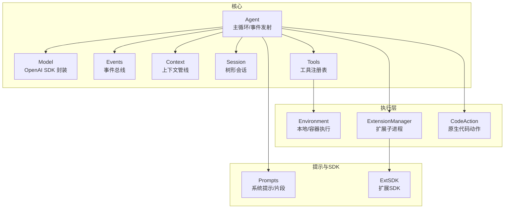
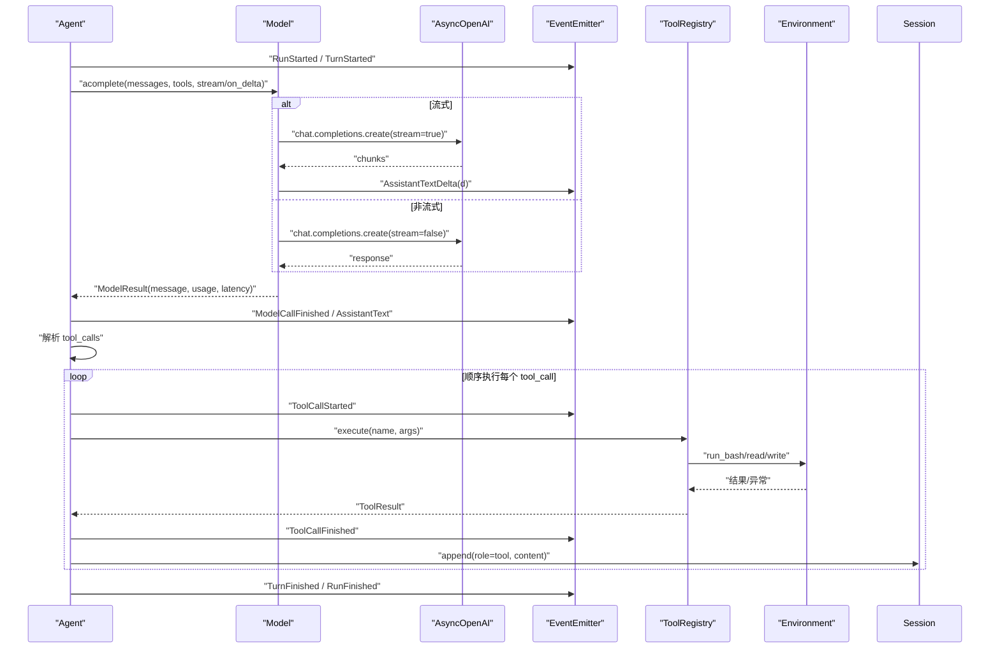
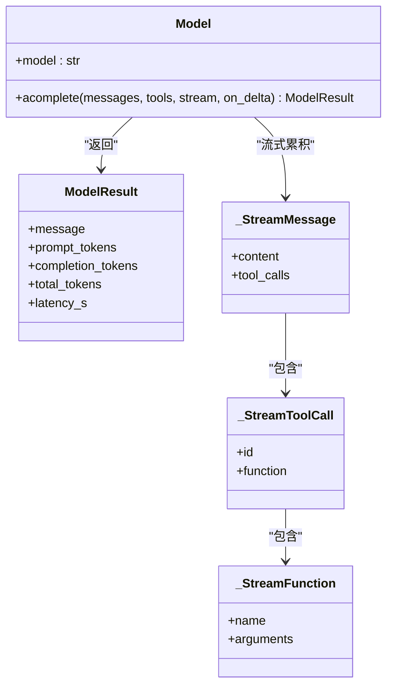
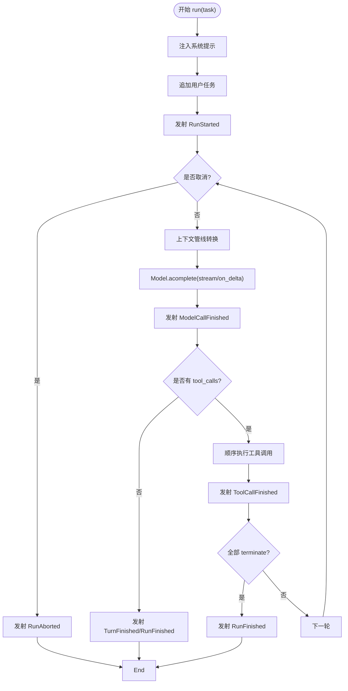
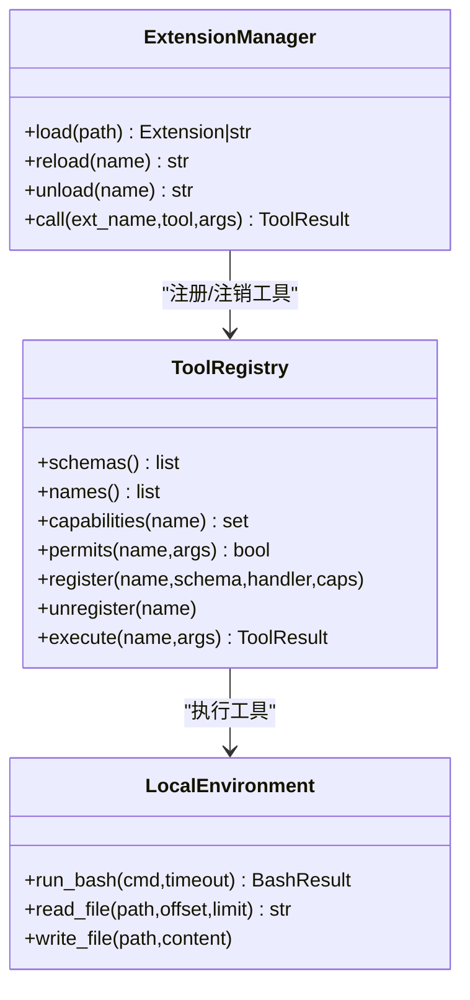
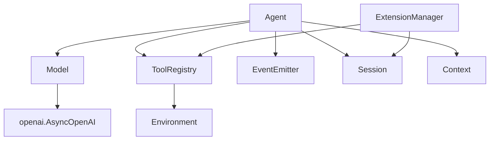

# 模型接口

<cite>
**本文引用的文件**
- [model.py](file://mu/model.py)
- [agent.py](file://mu/agent.py)
- [events.py](file://mu/events.py)
- [context.py](file://mu/context.py)
- [session.py](file://mu/session.py)
- [tools.py](file://mu/tools.py)
- [environment.py](file://mu/environment.py)
- [extension.py](file://mu/extension.py)
- [codeact.py](file://mu/codeact.py)
- [prompts.py](file://mu/prompts.py)
- [extsdk.py](file://mu/extsdk.py)
- [test_streaming.py](file://tests/test_streaming.py)
- [test_events.py](file://tests/test_events.py)
- [README.md](file://README.md)
- [pyproject.toml](file://pyproject.toml)
</cite>

## 目录
1. [简介](#简介)
2. [项目结构](#项目结构)
3. [核心组件](#核心组件)
4. [架构总览](#架构总览)
5. [组件详解](#组件详解)
6. [依赖关系分析](#依赖关系分析)
7. [性能与成本优化](#性能与成本优化)
8. [故障排查指南](#故障排查指南)
9. [结论](#结论)
10. [附录](#附录)

## 简介
本文件面向 μ（mu）模型接口的技术文档，聚焦于 OpenAI SDK 的异步封装、请求构建、响应处理、流式响应与增量回调、错误管理、超时与重试策略、多模型提供商兼容与配置、事件系统集成、函数调用（function-calling）实现与限制，以及最佳实践、性能优化与成本控制建议。文档同时提供可视化图示与调试技巧，帮助读者快速理解并正确使用模型接口。

## 项目结构
μ 的模型接口位于 mu/model.py，围绕 OpenAI 兼容端点进行薄封装，配合事件系统、上下文管线、会话树与工具注册表，形成完整的 agent 循环。关键模块职责如下：
- model.py：模型封装（AsyncOpenAI）、流式累积、结果归一化
- agent.py：主循环、事件发射、上下文转换、工具调用与终止语义
- events.py：结构化事件总线，支持多订阅者
- context.py：上下文变换与 LLM 输入转换
- session.py：树形会话（JSONL 持久化）
- tools.py：内置工具与工具注册表、权限策略
- environment.py：本地执行层（bash、文件 IO），可插拔沙箱
- extension.py：扩展子进程管理、工具注册、JSONL 协议
- codeact.py：原生代码动作（一次性组合多工具）
- prompts.py：系统提示与提示片段加载
- extsdk.py：扩展 SDK（声明工具、运行扩展进程）

**图表来源**
- [agent.py:43-223](file://mu/agent.py#L43-L223)
- [model.py:91-147](file://mu/model.py#L91-L147)
- [events.py:121-133](file://mu/events.py#L121-L133)
- [context.py:15-31](file://mu/context.py#L15-L31)
- [session.py:38-115](file://mu/session.py#L38-L115)
- [tools.py:191-269](file://mu/tools.py#L191-L269)
- [environment.py:23-150](file://mu/environment.py#L23-L150)
- [extension.py:85-364](file://mu/extension.py#L85-L364)
- [codeact.py:84-133](file://mu/codeact.py#L84-L133)
- [prompts.py:32-60](file://mu/prompts.py#L32-L60)
- [extsdk.py:34-130](file://mu/extsdk.py#L34-L130)

**章节来源**
- [README.md:1-127](file://README.md#L1-L127)
- [pyproject.toml:1-32](file://pyproject.toml#L1-L32)

## 核心组件
- 模型封装（Model）
  - 通过 AsyncOpenAI.chat.completions.create 发起请求
  - 支持非流式与流式两种模式，流式通过 on_delta 回调增量文本
  - 流式累积逻辑抽取为 consume_stream，便于离线测试
  - 返回 ModelResult，包含 message、prompt/completion/total tokens 与延迟
- 事件系统（EventEmitter）
  - RunStarted/TurnStarted/ModelCallStarted/AssistantTextDelta/ToolCallStarted/Finished 等
  - 多订阅者并行消费同一事件流，不引入外部 pub/sub 框架
- 上下文管线（transform_context/convert_to_llm）
  - transform_context 默认 identity，convert_to_llm 将内部消息转换为 OpenAI 格式
  - 标准消息透传，自定义类型（如 branch_summary）注入用户消息
- 会话树（Session）
  - JSONL 追加式持久化，支持分支、回溯、侧分支摘要注入
- 工具与权限（Tools/Permission）
  - 内置 read/write/edit/bash 四工具，工具 schema 与执行器统一签名
  - 基于能力的权限策略 gate 工具调用
- 执行层（Environment）
  - 本地 bash 子进程与文件 IO；可插拔 DockerEnvironment
  - 超时软杀进程组，避免孤儿进程
- 扩展与原生代码动作
  - 扩展子进程 JSONL 协议，工具注册进 ToolRegistry
  - CodeAction 在一次往返中组合多工具，支持软超时

**章节来源**
- [model.py:91-147](file://mu/model.py#L91-L147)
- [events.py:121-133](file://mu/events.py#L121-L133)
- [context.py:15-31](file://mu/context.py#L15-L31)
- [session.py:38-115](file://mu/session.py#L38-L115)
- [tools.py:191-269](file://mu/tools.py#L191-L269)
- [environment.py:23-150](file://mu/environment.py#L23-L150)
- [extension.py:85-364](file://mu/extension.py#L85-L364)
- [codeact.py:84-133](file://mu/codeact.py#L84-L133)

## 架构总览
以下序列图展示从 Agent 发起模型调用到工具执行的完整流程，涵盖流式增量回调、事件发射与会话写入。

**图表来源**
- [agent.py:82-163](file://mu/agent.py#L82-L163)
- [model.py:112-147](file://mu/model.py#L112-L147)
- [events.py:121-133](file://mu/events.py#L121-L133)
- [tools.py:253-269](file://mu/tools.py#L253-L269)
- [environment.py:26-88](file://mu/environment.py#L26-L88)

## 组件详解

### 模型封装（Model）与流式处理
- 请求构建
  - 从环境变量读取 MU_MODEL、MU_BASE_URL、MU_API_KEY（或 OPENAI_API_KEY）
  - 非流式：直接调用 chat.completions.create，取 choices[0].message 与 usage
  - 流式：开启 stream=true 并设置 stream_options={"include_usage": True}，使用 consume_stream 累积增量
- 响应处理
  - 非流式：直接返回 ModelResult
  - 流式：consume_stream 累积 content 与 tool_calls，逐块触发 on_delta；末块包含 usage
- 错误管理
  - 配置缺失抛出 ConfigError
  - consume_stream 忽略无 choices 的无效块，稳定累积
- 超时与重试
  - 未实现客户端侧重试；超时由底层 SDK 与服务端控制
- 数据结构
  - ModelResult：message、prompt_tokens、completion_tokens、total_tokens、latency_s
  - _StreamMessage/_StreamToolCall/_StreamFunction：流式累积中间结构

**图表来源**
- [model.py:23-147](file://mu/model.py#L23-L147)

**章节来源**
- [model.py:91-147](file://mu/model.py#L91-L147)
- [test_streaming.py:19-49](file://tests/test_streaming.py#L19-L49)

### Agent 主循环与事件系统集成
- 主循环
  - 注入系统提示，追加用户任务
  - 调用上下文管线 convert_to_llm(transform_context(path_to_head()))
  - 触发 ModelCallStarted，调用 Model.acomplete
  - 根据是否流式决定是否发射 AssistantText/AssistantTextDelta
  - 解析 tool_calls，顺序执行，记录 ToolCallStarted/Finished
  - 全部 terminate 则提前结束，否则等待下一轮
- 事件发射
  - RunStarted/TurnStarted/ModelCallStarted/AssistantText/AssistantTextDelta/ToolCallStarted/ToolCallFinished/TurnFinished/RunFinished/RunAborted
  - 多订阅者（渲染、可观测、TUI）并行消费

**图表来源**
- [agent.py:82-163](file://mu/agent.py#L82-L163)
- [events.py:18-116](file://mu/events.py#L18-L116)

**章节来源**
- [agent.py:82-163](file://mu/agent.py#L82-L163)
- [events.py:18-116](file://mu/events.py#L18-L116)
- [test_events.py:7-27](file://tests/test_events.py#L7-L27)

### 上下文管线与会话树
- 上下文管线
  - transform_context 默认 identity，未来可做压缩/裁剪/注入
  - convert_to_llm 将内部消息转为 OpenAI 格式，标准消息透传，自定义类型（如 branch_summary）注入用户消息
- 会话树
  - 追加式 JSONL 持久化，支持分支、回溯、侧分支摘要注入
  - path_to_head 获取当前分支线性历史，作为 LLM 输入

**图表来源**
- [context.py:15-31](file://mu/context.py#L15-L31)
- [session.py:76-89](file://mu/session.py#L76-L89)

**章节来源**
- [context.py:15-31](file://mu/context.py#L15-L31)
- [session.py:38-115](file://mu/session.py#L38-L115)

### 工具与权限、执行层与扩展
- 工具注册表
  - 内置 read/write/edit/bash 四工具，统一 schema 与 handler 签名
  - 支持动态注册/注销扩展工具，capabilities 用于权限 gate
- 执行层
  - LocalEnvironment：bash 子进程 + 文件 IO；超时软杀进程组
  - DockerEnvironment：仅 bash 放容器，文件 IO 仍宿主（最小实现）
- 扩展
  - 子进程 JSONL 协议，首行 manifest，支持 init/execute/shutdown
  - 自动加载 ext_dir 下扩展；支持 load_extension/reload_extension/list_extensions

**图表来源**
- [tools.py:191-269](file://mu/tools.py#L191-L269)
- [environment.py:23-150](file://mu/environment.py#L23-L150)
- [extension.py:85-364](file://mu/extension.py#L85-L364)

**章节来源**
- [tools.py:191-269](file://mu/tools.py#L191-L269)
- [environment.py:23-150](file://mu/environment.py#L23-L150)
- [extension.py:85-364](file://mu/extension.py#L85-L364)

### 原生代码动作（CodeAction）
- 设计目标：将 N 轮工具调用压缩为一次往返，提升效率
- 实现要点：在 worker 线程执行模型提供的 Python 代码，通过 _MuApi 将同步调用 marshal 回事件循环
- 风险与限制：软超时（线程可能滞留），隔离等同 bash；建议在容器中运行

**章节来源**
- [codeact.py:84-133](file://mu/codeact.py#L84-L133)

### 函数调用（function-calling）实现与限制
- 实现细节
  - Model.acomplete 使用 tool_choice="auto"，允许模型选择工具
  - consume_stream 正确累积 tool_calls 增量（按 index 聚合 id/name/arguments）
  - Agent 顺序执行 tool_calls，解析 JSON 参数，捕获异常并记录 ToolResult
- 限制
  - 顺序执行（并行留待后续）
  - 参数必须为有效 JSON；失败时返回错误字符串
  - 未实现自动重试；超时由底层 SDK 控制

**章节来源**
- [model.py:112-147](file://mu/model.py#L112-L147)
- [agent.py:134-163](file://mu/agent.py#L134-L163)
- [test_streaming.py:19-49](file://tests/test_streaming.py#L19-L49)

## 依赖关系分析
- 组件耦合
  - Agent 依赖 Model、ToolRegistry、EventEmitter、Session、上下文管线
  - Model 依赖 AsyncOpenAI（第三方 SDK）
  - ToolRegistry 依赖 Environment（可插拔）
  - ExtensionManager 依赖 ToolRegistry 与 Session，负责扩展生命周期与 JSONL 协议
- 外部依赖
  - openai>=1.40（异步 SDK）
  - 可选 textual（TUI）、pytest（测试）

**图表来源**
- [pyproject.toml:10-12](file://pyproject.toml#L10-L12)
- [agent.py:33-38](file://mu/agent.py#L33-L38)
- [model.py:16](file://mu/model.py#L16)
- [tools.py:11-12](file://mu/tools.py#L11-L12)
- [extension.py:29](file://mu/extension.py#L29)

**章节来源**
- [pyproject.toml:10-21](file://pyproject.toml#L10-L21)

## 性能与成本优化
- 流式输出
  - 开启 --stream 可获得实时增量文本，降低感知延迟
  - on_delta 回调仅在流式模式触发，适合实时渲染与 TUI
- 降低 token 成本
  - 使用 branch_summary 将侧分支结论带回主线，减少重复描述
  - 合理使用系统提示片段（MU_PROMPT_SNIPPET_DIR），避免冗余指令
- 代码动作（CodeAction）
  - 在一次往返中组合多工具，减少轮次与 token
  - 注意软超时与隔离风险，必要时在容器中运行
- 权限与沙箱
  - 使用 --permission readonly/workspace 限制工具使用，避免不必要的调用
  - 使用 --sandbox docker 仅隔离 bash，文件 IO 仍宿主（最小实现）

**章节来源**
- [README.md:48-96](file://README.md#L48-L96)
- [prompts.py:32-60](file://mu/prompts.py#L32-L60)
- [codeact.py:84-133](file://mu/codeact.py#L84-L133)
- [environment.py:99-150](file://mu/environment.py#L99-L150)

## 故障排查指南
- 配置问题
  - MU_MODEL 与 MU_API_KEY（或 OPENAI_API_KEY）未设置将抛出 ConfigError
  - 建议使用 .env 示例文件并通过 source 加载到当前 shell
- 流式累积异常
  - consume_stream 忽略无 choices 的块，若出现内容不完整，检查服务端是否正确返回 usage
  - 使用测试用例中的 fake 异步流进行离线验证
- 工具调用失败
  - 参数非 JSON 或缺少必需参数：返回错误字符串，模型可自纠错
  - 权限不足：根据策略返回 permission denied
- 超时与取消
  - bash 超时：软杀进程组，返回超时信息
  - 运行取消：Agent 发射 RunAborted，已增量完成的消息已落盘
- 扩展进程异常
  - manifest 无效或超时：记录 ExtensionError 并清理进程
  - 调用超时：返回错误字符串，pending 任务解挂

**章节来源**
- [model.py:19-109](file://mu/model.py#L19-L109)
- [environment.py:26-88](file://mu/environment.py#L26-L88)
- [agent.py:130-133](file://mu/agent.py#L130-L133)
- [extension.py:146-160](file://mu/extension.py#L146-L160)
- [test_streaming.py:19-49](file://tests/test_streaming.py#L19-L49)

## 结论
μ 的模型接口以 OpenAI SDK 为基础，提供简洁可靠的异步封装与流式处理能力，结合事件系统、上下文管线、会话树与工具体系，形成可扩展、可观测、可评估的 agent 循环。通过合理的配置、权限与沙箱策略，可在保证安全的前提下最大化性能与成本效益。函数调用（function-calling）与原生代码动作进一步提升了工具组合的灵活性与效率。

## 附录
- 模型提供商兼容与配置
  - 支持通过 MU_BASE_URL/MU_MODEL/MU_API_KEY 配置 OpenAI 兼容端点
  - 示例：百炼、DeepSeek、OpenAI 的端点与模型键值
- 代码示例与调试技巧
  - 使用 tests/test_streaming.py 与 tests/test_events.py 验证流式累积与事件分发
  - 使用 --stream 与 TUI 观察实时增量输出
  - 使用 --resume 与 --branch 进行会话续跑与分支探索

**章节来源**
- [README.md:20-96](file://README.md#L20-L96)
- [test_streaming.py:19-49](file://tests/test_streaming.py#L19-L49)
- [test_events.py:7-27](file://tests/test_events.py#L7-L27)