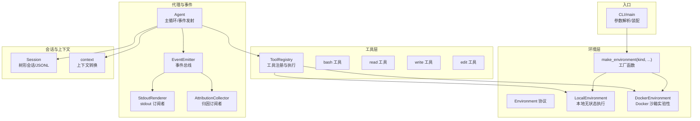
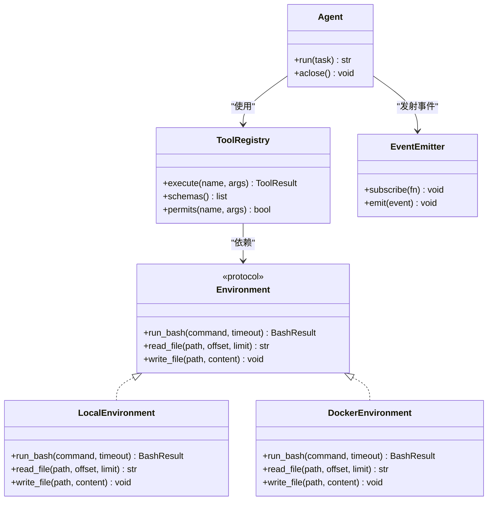
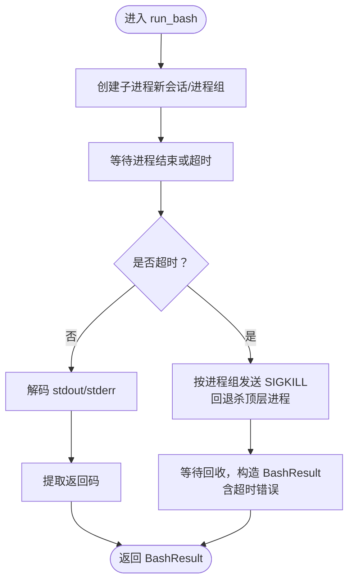
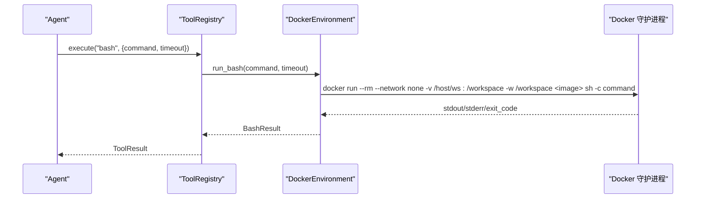
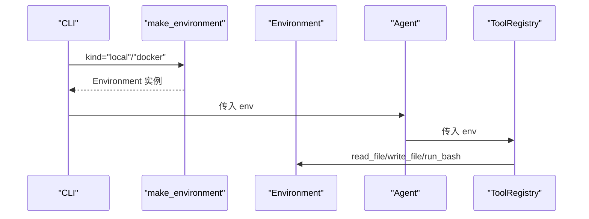
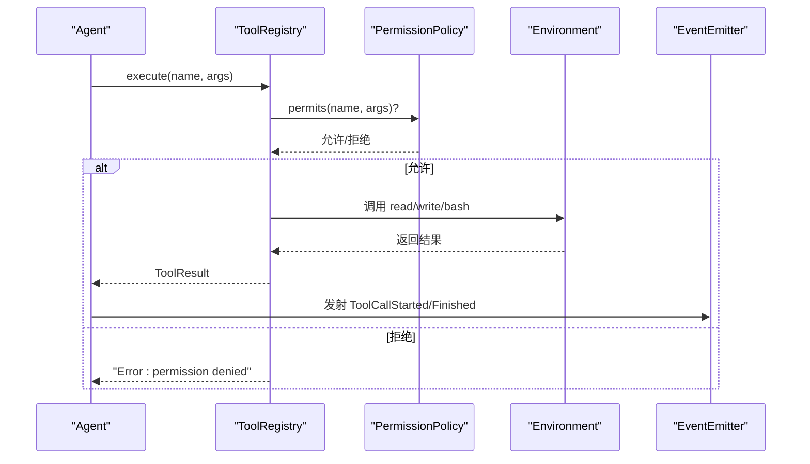
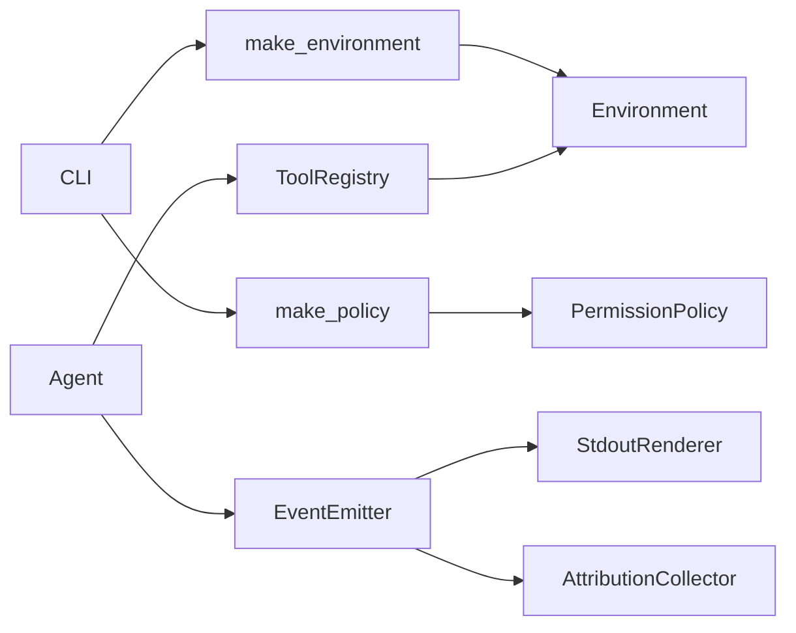

# 环境抽象

<cite>
**本文引用的文件**
- [environment.py](file://mu/environment.py)
- [__init__.py](file://mu/__init__.py)
- [agent.py](file://mu/agent.py)
- [tools.py](file://mu/tools.py)
- [events.py](file://mu/events.py)
- [session.py](file://mu/session.py)
- [context.py](file://mu/context.py)
- [permission.py](file://mu/permission.py)
- [model.py](file://mu/model.py)
- [cli.py](file://mu/cli.py)
- [README.md](file://README.md)
- [test_sandbox.py](file://tests/test_sandbox.py)
- [observability.py](file://mu/observability.py)
- [render.py](file://mu/render.py)
</cite>

## 目录
1. [引言](#引言)
2. [项目结构](#项目结构)
3. [核心组件](#核心组件)
4. [架构总览](#架构总览)
5. [组件详解](#组件详解)
6. [依赖关系分析](#依赖关系分析)
7. [性能考量](#性能考量)
8. [故障排除指南](#故障排除指南)
9. [结论](#结论)
10. [附录](#附录)

## 引言
本文件聚焦 μ (mu) 的“环境抽象层”，系统阐述本地执行环境的设计与实现，涵盖资源管理、隔离机制与安全控制；解释可插拔的 Environment provider 架构，展示如何实现不同的执行环境（local、docker）；说明 Docker 沙箱的网络隔离、容器管理与资源限制现状；给出环境配置的最佳实践与性能优化建议；提供部署示例与故障排除指南；并阐明环境抽象与工具系统的交互关系及事件传播机制。

## 项目结构
围绕环境抽象的核心模块与职责如下：
- 环境抽象与实现：LocalEnvironment、DockerEnvironment、Environment 协议与工厂函数
- 工具系统：ToolRegistry 将工具统一调度至 Environment
- 代理与事件：Agent 通过事件总线驱动工具执行与可观测性
- 会话与上下文：Session 与 context 转换确保上下文管线稳定
- CLI：装配环境、权限策略与事件订阅者，驱动 Agent 运行
- 测试：验证环境选择与 Docker 环境的 bash 执行

图表来源
- [environment.py:90-150](file://mu/environment.py#L90-L150)
- [tools.py:191-269](file://mu/tools.py#L191-L269)
- [agent.py:43-223](file://mu/agent.py#L43-L223)
- [events.py:121-133](file://mu/events.py#L121-L133)
- [session.py:38-115](file://mu/session.py#L38-L115)
- [context.py:15-31](file://mu/context.py#L15-L31)
- [cli.py:51-134](file://mu/cli.py#L51-L134)

章节来源
- [README.md:1-127](file://README.md#L1-L127)
- [__init__.py:14-33](file://mu/__init__.py#L14-L33)

## 核心组件
- Environment 协议：定义统一接口 run_bash/read_file/write_file，支持可插拔实现
- LocalEnvironment：基于 asyncio subprocess 与线程池的本地执行，无状态、超时与进程组清理
- DockerEnvironment：实验性实现，将 bash 放入容器（网络隔离），文件 IO 仍走宿主
- ToolRegistry：将工具注册为统一签名，绑定 Environment 并进行权限校验
- Agent：通过事件总线驱动工具执行，支持流式与终止语义
- EventEmitter：事件总线，StdoutRenderer 与 AttributionCollector 作为订阅者
- Session 与 context：会话树与上下文转换，保证历史可追溯与 LLM 输入格式化

章节来源
- [environment.py:90-150](file://mu/environment.py#L90-L150)
- [tools.py:191-269](file://mu/tools.py#L191-L269)
- [agent.py:43-223](file://mu/agent.py#L43-L223)
- [events.py:121-133](file://mu/events.py#L121-L133)
- [session.py:38-115](file://mu/session.py#L38-L115)
- [context.py:15-31](file://mu/context.py#L15-L31)

## 架构总览
环境抽象采用“协议 + 工厂 + 注入”的设计：
- 协议层：Environment 规范了 bash 执行与文件 IO 的统一接口
- 实现层：LocalEnvironment 与 DockerEnvironment 分别满足本地与容器场景
- 注入层：ToolRegistry 与 Agent 将环境实例注入工具执行链路
- 事件层：Agent 发射结构化事件，渲染与归因订阅者消费

图表来源
- [environment.py:90-150](file://mu/environment.py#L90-L150)
- [tools.py:191-269](file://mu/tools.py#L191-L269)
- [agent.py:43-223](file://mu/agent.py#L43-L223)
- [events.py:121-133](file://mu/events.py#L121-L133)

## 组件详解

### 本地执行环境 LocalEnvironment
- 设计要点
  - 无状态 bash 子进程：每次 run_bash 创建新进程，避免状态泄漏
  - 超时与进程组清理：使用 start_new_session=True，超时后按进程组 SIGKILL，防止孤儿进程
  - 文件 IO：offload 至线程池，避免阻塞事件循环
- 数据结构与复杂度
  - BashResult 包含 stdout/stderr/exit_code
  - 文件读写为 O(n) 行切片，按需截取
- 错误处理
  - 超时返回特定 exit_code 与错误信息
  - 文件不存在/目录错误等异常转为字符串返回
- 性能影响
  - 子进程开销与线程池切换成本；适合短时、无状态命令

图表来源
- [environment.py:26-48](file://mu/environment.py#L26-L48)
- [environment.py:50-65](file://mu/environment.py#L50-L65)

章节来源
- [environment.py:23-88](file://mu/environment.py#L23-L88)

### Docker 沙箱 DockerEnvironment
- 设计要点
  - 仅将 bash 放入容器，网络隔离使用 --network none
  - 文件工具（read/write/edit）仍走宿主 IO，不隔离
  - 通过卷挂载将 workspace 挂入容器 /workspace 并设置工作目录
- 容器生命周期
  - run_bash 使用 docker run --rm，命令结束后容器自动删除
  - 超时清理与本地环境一致
- 限制与风险
  - 文件 IO 不隔离，若需文件级隔离，需将整个 μ 运行在容器内或实现更严格的 Environment
  - bash 在容器内执行，但扩展加载与代码执行仍以 agent 同等权限运行（M3 子进程隔离）

图表来源
- [environment.py:112-130](file://mu/environment.py#L112-L130)

章节来源
- [environment.py:99-137](file://mu/environment.py#L99-L137)
- [test_sandbox.py:19-25](file://tests/test_sandbox.py#L19-L25)

### 可插拔 Environment provider 架构
- 协议与实现
  - Environment 协议定义统一接口，LocalEnvironment 与 DockerEnvironment 分别实现
- 工厂函数
  - make_environment(kind, ...) 根据参数选择具体实现
- 注入与使用
  - ToolRegistry 初始化时绑定 env 参数；Agent 构造时接收 env 并传递给 ToolRegistry
  - CLI 解析 --sandbox 选项并通过 make_environment 生成环境实例

图表来源
- [environment.py:139-150](file://mu/environment.py#L139-L150)
- [cli.py:74-75](file://mu/cli.py#L74-L75)
- [tools.py:203](file://mu/tools.py#L203)
- [agent.py:60](file://mu/agent.py#L60)

章节来源
- [environment.py:90-150](file://mu/environment.py#L90-L150)
- [cli.py:37-38](file://mu/cli.py#L37-L38)
- [__init__.py:14-33](file://mu/__init__.py#L14-L33)

### 环境与工具系统的交互关系
- 工具注册与签名统一
  - 内置工具统一签名：(env, args) -> str/ToolResult
  - ToolRegistry 将 env 绑定为偏函数，对外暴露一致的 execute 接口
- 权限策略
  - 基于能力集（capabilities）gate 工具调用，而非工具名黑名单
  - 支持 allow_all、read_only、workspace_write 策略
- 事件传播
  - Agent 在工具调用前后发射 ToolCallStarted/ToolCallFinished 等事件
  - StdoutRenderer 与 AttributionCollector 订阅事件，分别负责输出与归因

图表来源
- [tools.py:253-269](file://mu/tools.py#L253-L269)
- [permission.py:29-68](file://mu/permission.py#L29-L68)
- [events.py:56-69](file://mu/events.py#L56-L69)

章节来源
- [tools.py:191-269](file://mu/tools.py#L191-L269)
- [permission.py:1-69](file://mu/permission.py#L1-L69)
- [events.py:18-89](file://mu/events.py#L18-L89)

### 事件流与可观测性
- 事件类型
  - RunStarted/TurnStarted/ModelCallStarted/AssistantText/ToolCallStarted/ToolCallFinished/TurnFinished/RunFinished/RunAborted 等
- 订阅者
  - StdoutRenderer：将事件渲染为人类可读输出，支持流式增量
  - AttributionCollector：累计轮数、LLM/工具耗时、token 与工具明细，生成归因报告
- 与 Agent 的集成
  - Agent 在关键阶段 emit 事件，确保可观测性与调试体验

章节来源
- [events.py:13-133](file://mu/events.py#L13-L133)
- [render.py:31-78](file://mu/render.py#L31-L78)
- [observability.py:26-90](file://mu/observability.py#L26-L90)
- [agent.py:82-133](file://mu/agent.py#L82-L133)

## 依赖关系分析
- 组件耦合
  - ToolRegistry 依赖 Environment 协议；Agent 依赖 ToolRegistry 与 EventEmitter
  - CLI 依赖 make_environment 与 make_policy，装配 Agent 所需的环境与策略
- 外部依赖
  - DockerEnvironment 依赖本机 docker 可用性
  - Model 依赖 OpenAI SDK 与环境变量配置
- 潜在循环依赖
  - 未发现循环导入；模块间通过协议与工厂函数解耦

图表来源
- [cli.py:74-75](file://mu/cli.py#L74-L75)
- [permission.py:61-68](file://mu/permission.py#L61-L68)
- [agent.py:60](file://mu/agent.py#L60)
- [tools.py:203](file://mu/tools.py#L203)
- [events.py:121-133](file://mu/events.py#L121-L133)

章节来源
- [cli.py:51-134](file://mu/cli.py#L51-L134)
- [permission.py:1-69](file://mu/permission.py#L1-L69)
- [environment.py:90-150](file://mu/environment.py#L90-L150)

## 性能考量
- 本地执行
  - 子进程创建与通信存在开销；短时、无状态命令较优
  - 文件读写 offload 至线程池，避免阻塞事件循环
- Docker 沙箱
  - 容器启动与网络初始化带来额外延迟；建议复用镜像与减少频繁拉起
  - --network none 提升安全性但可能影响网络访问需求
- 事件与渲染
  - 事件同步分发，订阅者应保持轻量；流式渲染按增量输出
- 归因与可观测
  - 归因收集为轻量聚合，建议在生产中按需开启

[本节为通用指导，不直接分析具体文件]

## 故障排除指南
- 环境选择错误
  - 现象：传入未知 kind 抛出异常
  - 处理：确认 --sandbox 选项为 local 或 docker
- Docker 不可用
  - 现象：测试或运行时报 docker not found 或权限问题
  - 处理：安装并配置 docker；确保用户加入 docker 组；或改用 local
- 超时与僵尸进程
  - 现象：命令长时间运行或卡死
  - 处理：检查 timeout 设置；确认 start_new_session 与进程组清理逻辑生效
- 文件权限与路径
  - 现象：write 被拒绝或路径无效
  - 处理：workspace 策略下确保路径在工作区范围内；read_only 策略下禁用写/编辑/bash/code/扩展加载
- 模型配置缺失
  - 现象：启动时报 MU_MODEL/MU_API_KEY 未设置
  - 处理：按 README 配置环境变量或 .env 文件

章节来源
- [test_sandbox.py:15-17](file://tests/test_sandbox.py#L15-L17)
- [environment.py:139-150](file://mu/environment.py#L139-L150)
- [permission.py:40-58](file://mu/permission.py#L40-L58)
- [model.py:19-109](file://mu/model.py#L19-L109)
- [README.md:20-41](file://README.md#L20-L41)

## 结论
μ 的环境抽象层通过协议与工厂模式实现了可插拔的执行环境，LocalEnvironment 提供轻量、无状态的本地执行，DockerEnvironment 以实验性方式引入容器隔离。结合 ToolRegistry 的统一工具接口与权限策略，Agent 在事件驱动下完成工具调用与可观测性采集。对于需要更强隔离与资源限制的场景，建议将 μ 本身置于容器内，或实现更严格的 Environment（如 E2B/Modal）以满足生产级需求。

[本节为总结性内容，不直接分析具体文件]

## 附录

### 环境配置最佳实践
- 本地开发
  - 使用 local 环境，快速迭代；必要时调整超时与日志级别
- 生产/受限环境
  - 使用 read_only 或 workspace 策略，严格限制工具能力
  - 如需容器隔离，优先考虑将 μ 运行在容器内，而非仅隔离 bash
- Docker 沙箱
  - 仅隔离网络（--network none）；文件 IO 仍走宿主，注意路径与权限
  - 预热常用镜像，减少容器启动开销

章节来源
- [README.md:84-96](file://README.md#L84-L96)
- [permission.py:29-68](file://mu/permission.py#L29-L68)

### 部署示例
- 基础运行
  - 参考 README 的运行示例，设置模型与密钥
- 启用沙箱
  - 使用 --sandbox docker 运行 bash 命令；需本机安装 docker
- 启用只读策略
  - 使用 --permission readonly 禁止写/编辑/bash/code/扩展加载
- 启用工作区策略
  - 使用 --permission workspace 限定写入范围

章节来源
- [README.md:42-96](file://README.md#L42-L96)
- [cli.py:35-38](file://mu/cli.py#L35-L38)