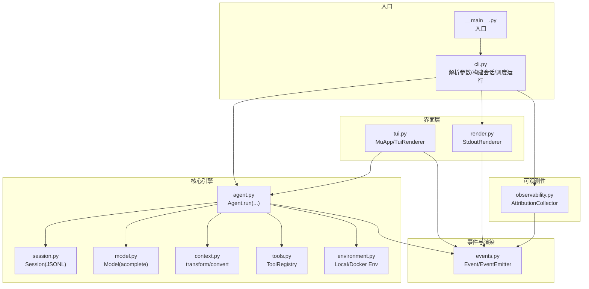
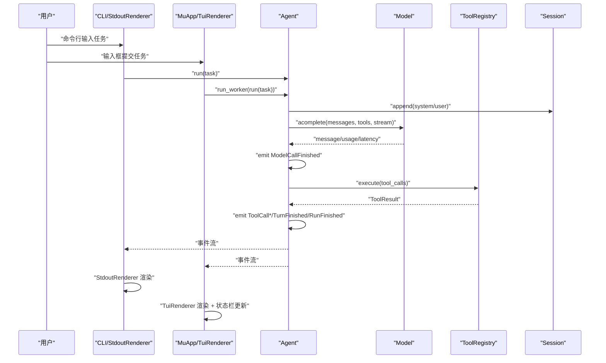
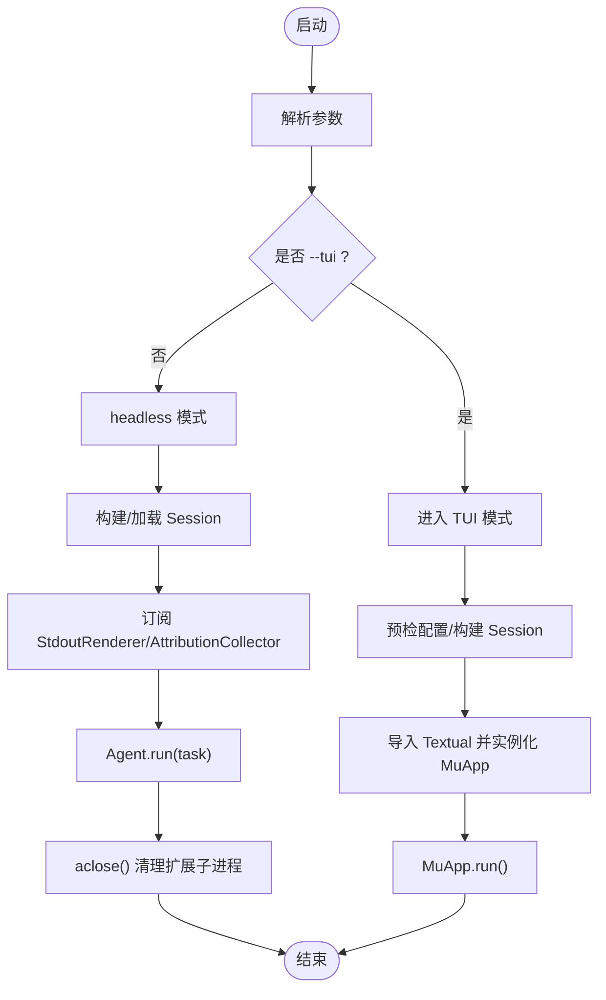
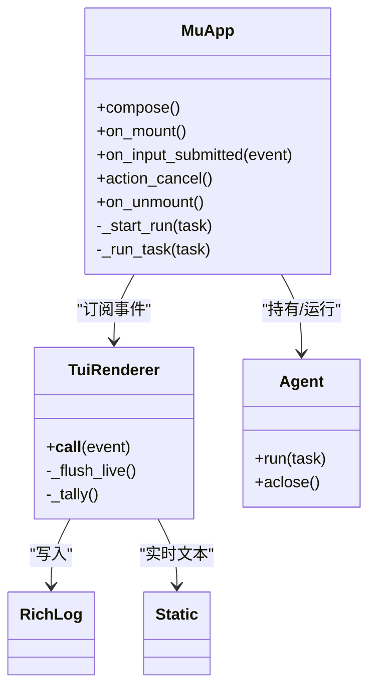
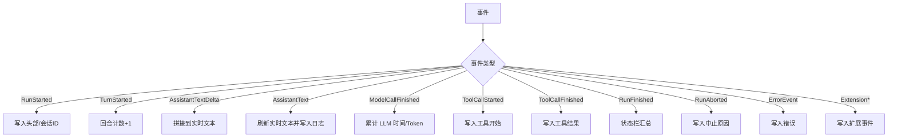
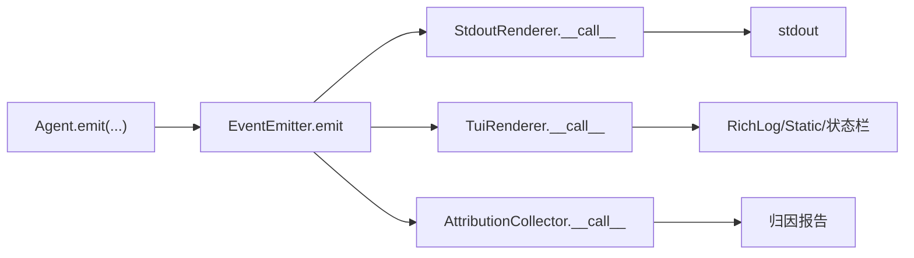
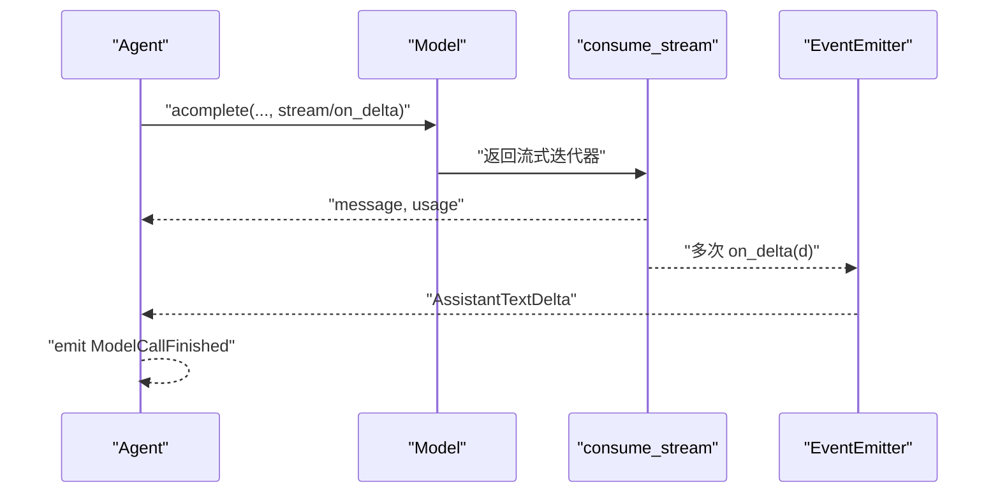
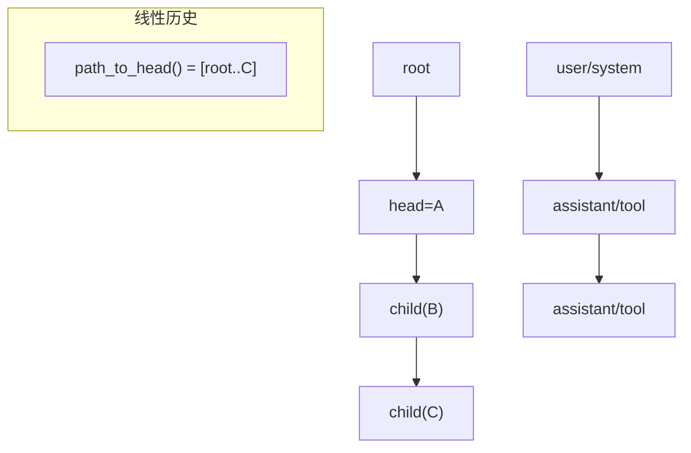
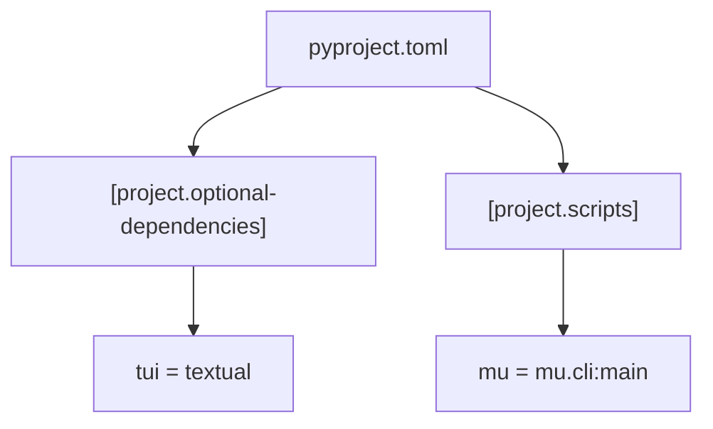

# 用户界面

<cite>
**本文引用的文件**
- [README.md](file://README.md)
- [pyproject.toml](file://pyproject.toml)
- [mu/__main__.py](file://mu/__main__.py)
- [mu/cli.py](file://mu/cli.py)
- [mu/tui.py](file://mu/tui.py)
- [mu/render.py](file://mu/render.py)
- [mu/events.py](file://mu/events.py)
- [mu/agent.py](file://mu/agent.py)
- [mu/session.py](file://mu/session.py)
- [mu/model.py](file://mu/model.py)
- [mu/context.py](file://mu/context.py)
- [mu/tools.py](file://mu/tools.py)
- [mu/environment.py](file://mu/environment.py)
- [mu/observability.py](file://mu/observability.py)
- [tests/test_tui.py](file://tests/test_tui.py)
</cite>

## 目录
1. [简介](#简介)
2. [项目结构](#项目结构)
3. [核心组件](#核心组件)
4. [架构总览](#架构总览)
5. [组件详解](#组件详解)
6. [依赖关系分析](#依赖关系分析)
7. [性能考量](#性能考量)
8. [故障排查指南](#故障排查指南)
9. [结论](#结论)
10. [附录](#附录)

## 简介
本文件系统性阐述 μ (mu) 用户界面系统，重点覆盖：
- CLI 界面与 TUI 界面的设计与实现
- Textual 框架的集成与交互式 UI 功能特性
- 渲染系统的架构与消息显示机制
- TUI 模式的使用指南（快捷键、状态显示、实时更新）
- Headless 模式与 TUI 模式的差异与切换机制
- 界面定制、主题配置与用户体验优化建议
- 界面系统与事件流的集成与数据绑定机制

μ 的核心设计遵循“事件流优先”的原则：Agent/Session/Model 等核心逻辑保持不变，CLI 与 TUI 作为事件流的不同订阅者，分别将事件渲染到 stdout 与 Textual widgets，共享同一套业务闭环。

## 项目结构
- 入口模块
  - 命令行入口：[mu/__main__.py](file://mu/__main__.py)
  - CLI 主流程：[mu/cli.py](file://mu/cli.py)
- 界面层
  - TUI 应用与渲染器：[mu/tui.py](file://mu/tui.py)
  - 标准输出渲染器：[mu/render.py](file://mu/render.py)
- 事件与渲染
  - 事件定义与事件总线：[mu/events.py](file://mu/events.py)
- 核心引擎
  - 代理与会话：[mu/agent.py](file://mu/agent.py)、[mu/session.py](file://mu/session.py)
  - 模型与上下文管线：[mu/model.py](file://mu/model.py)、[mu/context.py](file://mu/context.py)
  - 工具与执行环境：[mu/tools.py](file://mu/tools.py)、[mu/environment.py](file://mu/environment.py)
- 可观测性
  - 归因底座（统计与报告）：[mu/observability.py](file://mu/observability.py)
- 测试
  - TUI 行为与事件映射测试：[tests/test_tui.py](file://tests/test_tui.py)
- 文档与配置
  - 项目说明与运行指引：[README.md](file://README.md)
  - 可选依赖与脚本：[pyproject.toml](file://pyproject.toml)

图表来源
- [mu/__main__.py:1-5](file://mu/__main__.py#L1-L5)
- [mu/cli.py:51-83](file://mu/cli.py#L51-L83)
- [mu/tui.py:122-203](file://mu/tui.py#L122-L203)
- [mu/render.py:31-78](file://mu/render.py#L31-L78)
- [mu/events.py:121-133](file://mu/events.py#L121-L133)
- [mu/agent.py:82-133](file://mu/agent.py#L82-L133)
- [mu/session.py:38-115](file://mu/session.py#L38-L115)
- [mu/model.py:91-147](file://mu/model.py#L91-L147)
- [mu/context.py:20-31](file://mu/context.py#L20-L31)
- [mu/tools.py:191-269](file://mu/tools.py#L191-L269)
- [mu/environment.py:23-150](file://mu/environment.py#L23-L150)
- [mu/observability.py:26-90](file://mu/observability.py#L26-L90)

章节来源
- [README.md:42-72](file://README.md#L42-L72)
- [pyproject.toml:14-21](file://pyproject.toml#L14-L21)

## 核心组件
- 事件系统
  - 事件类型：RunStarted/TurnStarted/ModelCallStarted/AssistantText/AssistantTextDelta/ToolCall*/RunFinished/RunAborted/ErrorEvent/Extension* 等
  - 事件总线：EventEmitter 同步订阅分发，保证多订阅者（stdout/TUI/归因）并行消费同一事件序列
- 渲染器
  - StdoutRenderer：面向 headless 模式，支持流式增量输出
  - TuiRenderer：面向 TUI 模式，将事件写入 RichLog 与实时 Static，维护归因统计并在状态栏展示
- 应用与界面
  - MuApp：Textual App，负责布局、输入、绑定、生命周期与 worker 管理
  - TuiRenderer：事件订阅者，负责 UI 更新与状态栏刷新
- 核心引擎
  - Agent：围绕事件流的异步 while 循环，发出结构化事件
  - Session：树形会话，JSONL 持久化，支持分支与摘要
  - Model：封装 OpenAI SDK，支持流式累积与 on_delta 回调
  - Tools/Environment：工具注册表与执行环境抽象，支持本地与 Docker

章节来源
- [mu/events.py:13-133](file://mu/events.py#L13-L133)
- [mu/render.py:31-78](file://mu/render.py#L31-L78)
- [mu/tui.py:44-120](file://mu/tui.py#L44-L120)
- [mu/tui.py:122-203](file://mu/tui.py#L122-L203)
- [mu/agent.py:43-133](file://mu/agent.py#L43-L133)
- [mu/session.py:38-115](file://mu/session.py#L38-L115)
- [mu/model.py:91-147](file://mu/model.py#L91-L147)
- [mu/tools.py:191-269](file://mu/tools.py#L191-L269)
- [mu/environment.py:23-150](file://mu/environment.py#L23-L150)

## 架构总览
μ 的界面层采用“事件驱动 + 多订阅者”模式：
- CLI 与 TUI 分别订阅事件流，彼此互不影响
- CLI 使用 StdoutRenderer 输出到 stdout，同时可选地订阅 AttributionCollector 生成归因报告
- TUI 使用 MuApp 与 TuiRenderer 将事件渲染到 RichLog 与实时文本区域，并在状态栏汇总统计信息
- Agent.run(...) 在同一事件循环中通过 Textual worker 执行，确保 UI 与业务逻辑在同一事件循环内，避免竞态

图表来源
- [mu/cli.py:115-130](file://mu/cli.py#L115-L130)
- [mu/tui.py:180-195](file://mu/tui.py#L180-L195)
- [mu/agent.py:82-133](file://mu/agent.py#L82-L133)
- [mu/model.py:112-147](file://mu/model.py#L112-L147)
- [mu/render.py:36-78](file://mu/render.py#L36-L78)
- [mu/tui.py:64-120](file://mu/tui.py#L64-L120)

## 组件详解

### CLI 界面与 Headless 模式
- 参数解析与模式选择
  - 支持任务参数、续跑/分支、流式输出、TUI 开关、权限策略、沙箱 provider 等
  - 未指定 --tui 时进入 headless 模式，行为与 M1 一致
- 事件订阅
  - 注册 StdoutRenderer 与 AttributionCollector，分别负责输出与归因报告
- 运行流程
  - 构建 Session（支持 resume/branch）
  - 创建 Agent 并运行任务，最终关闭扩展子进程

图表来源
- [mu/cli.py:26-83](file://mu/cli.py#L26-L83)
- [mu/cli.py:86-112](file://mu/cli.py#L86-L112)
- [mu/agent.py:200-204](file://mu/agent.py#L200-L204)

章节来源
- [mu/cli.py:26-83](file://mu/cli.py#L26-L83)
- [mu/cli.py:86-112](file://mu/cli.py#L86-L112)
- [mu/render.py:31-78](file://mu/render.py#L31-L78)
- [mu/observability.py:26-90](file://mu/observability.py#L26-L90)

### TUI 界面与 Textual 集成
- 应用结构
  - 布局：Header/RichLog/Static(Input)/Footer
  - 绑定：ctrl+q 退出，Escape 取消运行
  - 生命周期：on_mount 初始化渲染器与 Agent，on_unmount 清理
- 事件渲染
  - TuiRenderer 将事件映射到 RichLog 与实时 Static，维护 turns、llm/tool 时间与 token 数
  - 状态栏显示 running…/turns=/llm=/tool=/tok= 等
- 交互控制
  - 输入框提交触发 run_worker，禁用输入框防止并发
  - action_cancel 取消当前 worker
  - 通过 agent_factory 可注入 FakeModel 等进行离线测试

图表来源
- [mu/tui.py:122-203](file://mu/tui.py#L122-L203)
- [mu/tui.py:44-120](file://mu/tui.py#L44-L120)
- [mu/agent.py:82-133](file://mu/agent.py#L82-L133)

章节来源
- [mu/tui.py:122-203](file://mu/tui.py#L122-L203)
- [mu/tui.py:44-120](file://mu/tui.py#L44-L120)
- [tests/test_tui.py:59-91](file://tests/test_tui.py#L59-L91)
- [tests/test_tui.py:93-144](file://tests/test_tui.py#L93-L144)

### 渲染系统与消息显示机制
- StdoutRenderer
  - 非流式：一次性输出块级消息
  - 流式：AssistantTextDelta 实时增量输出，遇非增量事件换行收尾
  - 扩展事件：ExtensionLoaded/ExtensionLog/ExtensionError/ExtensionUnloaded
- TuiRenderer
  - 与 StdoutRenderer 同构，但写入 RichLog 与 Static，使用 rich.Text 避免 markup 解析
  - 维护归因统计并在 RunFinished 时更新状态栏
  - ToolCallStarted/ToolCallFinished 输出工具调用与结果摘要

图表来源
- [mu/render.py:36-78](file://mu/render.py#L36-L78)
- [mu/tui.py:64-120](file://mu/tui.py#L64-L120)

章节来源
- [mu/render.py:31-78](file://mu/render.py#L31-L78)
- [mu/tui.py:44-120](file://mu/tui.py#L44-L120)

### 事件流与数据绑定
- 事件定义
  - RunStarted/TurnStarted/ModelCall*/AssistantText/AssistantTextDelta/ToolCall*/RunFinished/RunAborted/ErrorEvent/Extension*
- 订阅与分发
  - EventEmitter 同步订阅列表，emit 顺序分发至各订阅者
- 数据绑定
  - TUI 通过订阅者直接更新 widgets（RichLog/Static/状态栏）
  - CLI 通过 StdoutRenderer 输出到 stdout
  - 归因底座通过 AttributionCollector 累计指标并在结束时输出报告

图表来源
- [mu/events.py:121-133](file://mu/events.py#L121-L133)
- [mu/render.py:36-78](file://mu/render.py#L36-L78)
- [mu/tui.py:64-120](file://mu/tui.py#L64-L120)
- [mu/observability.py:45-65](file://mu/observability.py#L45-L65)

章节来源
- [mu/events.py:13-133](file://mu/events.py#L13-L133)
- [mu/render.py:31-78](file://mu/render.py#L31-L78)
- [mu/tui.py:44-120](file://mu/tui.py#L44-L120)
- [mu/observability.py:26-90](file://mu/observability.py#L26-L90)

### 模型与流式渲染
- Model.acomplete 支持流式与非流式两种模式
- 流式时，consume_stream 聚合 content 与 tool_calls 增量，并通过 on_delta 回调通知订阅者
- Agent 在开启 stream 时注册 on_delta，将增量事件（AssistantTextDelta）推送到事件流

图表来源
- [mu/model.py:52-88](file://mu/model.py#L52-L88)
- [mu/model.py:112-147](file://mu/model.py#L112-L147)
- [mu/agent.py:100-111](file://mu/agent.py#L100-L111)

章节来源
- [mu/model.py:52-88](file://mu/model.py#L52-L88)
- [mu/model.py:112-147](file://mu/model.py#L112-L147)
- [mu/agent.py:82-133](file://mu/agent.py#L82-L133)

### 会话与分支
- Session 以树形结构存储消息，支持 append-only 与分支
- path_to/path_to_head 提供线性历史视图，convert_to_llm 将自定义消息注入 LLM 上下文
- branch_summary 可将侧分支结论带回主线

图表来源
- [mu/session.py:76-88](file://mu/session.py#L76-L88)
- [mu/context.py:20-31](file://mu/context.py#L20-L31)

章节来源
- [mu/session.py:38-115](file://mu/session.py#L38-L115)
- [mu/context.py:15-31](file://mu/context.py#L15-L31)

### 工具与权限/沙箱
- 工具注册表提供 read/write/edit/bash 四大工具，支持动态注册/注销
- 权限策略按“能力”门控，支持 allow/readonly/workspace
- 沙箱 provider 支持 local 与 docker（仅 bash 容器化）

章节来源
- [mu/tools.py:191-269](file://mu/tools.py#L191-L269)
- [mu/environment.py:139-150](file://mu/environment.py#L139-L150)

## 依赖关系分析
- 可选依赖
  - [pyproject.toml] 中定义了 [project.optional-dependencies]，其中 tui 依赖 textual>=0.80
- 运行时导入
  - CLI 在 --tui 模式下延迟导入 textual，避免 headless 用户安装负担
- 包导出
  - [pyproject.toml] 定义了脚本入口 mu 指向 mu.cli:main

图表来源
- [pyproject.toml:14-25](file://pyproject.toml#L14-L25)

章节来源
- [pyproject.toml:14-25](file://pyproject.toml#L14-L25)
- [mu/cli.py:100-103](file://mu/cli.py#L100-L103)

## 性能考量
- 事件总线为同步分发，避免引入额外的 pub/sub 框架开销
- TUI 与 Agent 共享同一事件循环，通过 Textual worker 执行，减少线程切换
- 流式渲染仅在 --stream 开启时生效，降低非必要增量输出的 CPU/GIL 压力
- 归因统计在内存中累积，结束时一次性输出，避免频繁 IO

## 故障排查指南
- TUI 无法启动
  - 确认已安装可选依赖：pip install -e ".[tui]"
  - 检查配置：Model 初始化需要 MU_MODEL/MU_API_KEY 或 OPENAI_API_KEY
- 任务无法提交
  - TUI 下输入框被禁用时，等待当前 run 完成或使用 Escape 取消
- 事件未显示
  - 确认事件订阅是否正确注册（StdoutRenderer/TuiRenderer）
  - 检查流式模式是否开启（--stream）
- 归因报告缺失
  - 确认是否订阅了 AttributionCollector
  - 检查 RunFinished/RunAborted 是否到达

章节来源
- [mu/cli.py:86-112](file://mu/cli.py#L86-L112)
- [mu/model.py:91-110](file://mu/model.py#L91-L110)
- [mu/tui.py:173-195](file://mu/tui.py#L173-L195)
- [mu/render.py:36-78](file://mu/render.py#L36-L78)
- [mu/observability.py:45-65](file://mu/observability.py#L45-L65)

## 结论
μ 的用户界面系统以事件流为核心，实现了 CLI 与 TUI 的统一与解耦：两者共享 Agent/Session/事件流，分别承担 headless 与交互式体验。Textual 的集成简洁高效，TuiRenderer 将事件映射到 RichLog 与实时文本，配合状态栏实现完整的可观测性。通过可选依赖与延迟导入，系统在保持最小依赖的同时提供了丰富的交互能力。

## 附录

### TUI 使用指南
- 启动
  - 安装可选依赖：pip install -e ".[tui,dev]"
  - 启动：python -m mu --tui
  - 流式：python -m mu --tui --stream
- 快捷键
  - Ctrl+Q：退出
  - Esc：取消当前运行
- 状态显示
  - 状态栏显示 running…/turns=/llm=/tool=/tok= 等
- 实时更新
  - AssistantTextDelta 实时拼接显示
  - ToolCallStarted/ToolCallFinished 输出工具调用与结果摘要

章节来源
- [README.md:63-72](file://README.md#L63-L72)
- [mu/tui.py:129-132](file://mu/tui.py#L129-L132)
- [mu/tui.py:64-120](file://mu/tui.py#L64-L120)

### 界面定制与主题配置
- CSS 定制
  - 通过 MuApp.CSS 自定义 RichLog/Static/Input/Footer 的样式与布局
- 主题与样式
  - 使用 rich.Text 的 style 字段控制颜色与样式
- 布局与交互
  - 可通过自定义 ComposeResult 与绑定扩展布局与快捷键

章节来源
- [mu/tui.py:122-127](file://mu/tui.py#L122-L127)
- [mu/tui.py:151-156](file://mu/tui.py#L151-L156)

### 与事件流的集成与数据绑定
- 订阅者模式
  - StdoutRenderer/TuiRenderer/AttributionCollector 均为事件订阅者
- 数据绑定
  - TUI 通过查询 DOM（query_one）获取 RichLog/Static/Input/状态栏并直接更新
  - CLI 通过标准输出流进行渲染

章节来源
- [mu/events.py:121-133](file://mu/events.py#L121-L133)
- [mu/render.py:36-78](file://mu/render.py#L36-L78)
- [mu/tui.py:161-164](file://mu/tui.py#L161-L164)