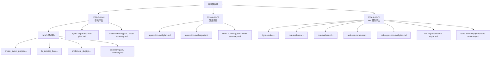
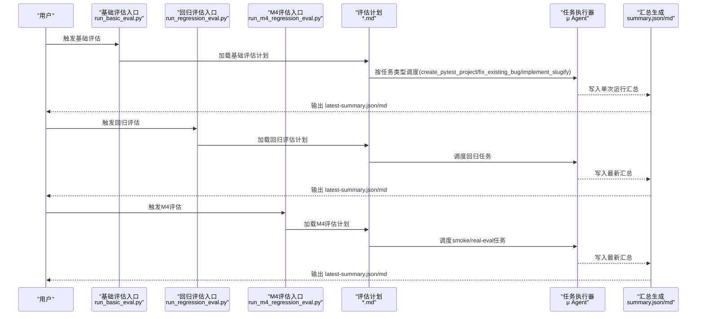
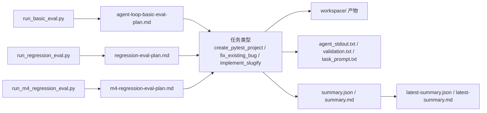

# 回归评估

<cite>
**本文引用的文件**
- [run_basic_eval.py](file://评测/2026-6-11-01/run_basic_eval.py)
- [agent-loop-basic-eval-plan.md](file://评测/2026-6-11-01/agent-loop-basic-eval-plan.md)
- [latest-summary.json](file://评测/2026-6-11-01/latest-summary.json)
- [latest-summary.md](file://评测/2026-6-11-01/latest-summary.md)
- [summary.json](file://评测/2026-6-11-01/runs/20260611-154532/summary.json)
- [summary.md](file://评测/2026-6-11-01/runs/20260611-154532/summary.md)
- [run_regression_eval.py](file://评测/2026-6-11-02/run_regression_eval.py)
- [regression-eval-plan.md](file://评测/2026-6-11-02/regression-eval-plan.md)
- [regression-eval-report.md](file://评测/2026-6-11-02/regression-eval-report.md)
- [latest-summary.json](file://评测/2026-6-11-02/latest-summary.json)
- [latest-summary.md](file://评测/2026-6-11-02/latest-summary.md)
- [run_m4_regression_eval.py](file://评测/2026-6-12-01/run_m4_regression_eval.py)
- [m4-regression-eval-plan.md](file://评测/2026-6-12-01/m4-regression-eval-plan.md)
- [m4-regression-eval-report.md](file://评测/2026-6-12-01/m4-regression-eval-report.md)
- [latest-summary.json](file://评测/2026-6-12-01/latest-summary.json)
- [latest-summary.md](file://评测/2026-6-12-01/latest-summary.md)
- [archive.jsonl](file://评测/2026-6-12-01/dgm-smoke/archive.jsonl)
- [archive/.../README.md](file://评测/2026-6-12-01/dgm-smoke/archive/candidates/m4-regression-smoke/workspace/README.md)
- [archive/.../pyproject.toml](file://评测/2026-6-12-01/dgm-smoke/archive/candidates/m4-regression-smoke/workspace/pyproject.toml)
- [archive/.../mu/__main__.py](file://评测/2026-6-12-01/dgm-smoke/archive/candidates/m4-regression-smoke/workspace/mu/__main__.py)
- [archive/.../mu/eval.py](file://评测/2026-6-12-01/dgm-smoke/archive/candidates/m4-regression-smoke/workspace/mu/eval.py)
- [archive/.../mu/environment.py](file://评测/2026-6-12-01/dgm-smoke/archive/candidates/m4-regression-smoke/workspace/mu/environment.py)
- [archive/.../mu/session.py](file://评测/2026-6-12-01/dgm-smoke/archive/candidates/m4-regression-smoke/workspace/mu/session.py)
- [archive/.../mu/tools.py](file://评测/2026-6-12-01/dgm-smoke/archive/candidates/m4-regression-smoke/workspace/mu/tools.py)
- [archive/.../mu/context.py](file://评测/2026-6-12-01/dgm-smoke/archive/candidates/m4-regression-smoke/workspace/mu/context.py)
- [archive/.../mu/model.py](file://评测/2026-6-12-01/dgm-smoke/archive/candidates/m4-regression-smoke/workspace/mu/model.py)
- [archive/.../mu/tui.py](file://评测/2026-6-12-01/dgm-smoke/archive/candidates/m4-regression-smoke/workspace/mu/tui.py)
- [archive/.../mu/extension.py](file://评测/2026-6-12-01/dgm-smoke/archive/candidates/m4-regression-smoke/workspace/mu/extension.py)
- [archive/.../mu/extsdk.py](file://评测/2026-6-12-01/dgm-smoke/archive/candidates/m4-regression-smoke/workspace/mu/extsdk.py)
- [archive/.../mu/events.py](file://评测/2026-6-12-01/dgm-smoke/archive/candidates/m4-regression-smoke/workspace/mu/events.py)
- [archive/.../mu/render.py](file://评测/2026-6-12-01/dgm-smoke/archive/candidates/m4-regression-smoke/workspace/mu/render.py)
- [archive/.../mu/prompts.py](file://评测/2026-6-12-01/dgm-smoke/archive/candidates/m4-regression-smoke/workspace/mu/prompts.py)
- [archive/.../mu/permission.py](file://评测/2026-6-12-01/dgm-smoke/archive/candidates/m4-regression-smoke/workspace/mu/permission.py)
- [archive/.../mu/observability.py](file://评测/2026-6-12-01/dgm-smoke/archive/candidates/m4-regression-smoke/workspace/mu/observability.py)
- [archive/.../mu/dgm.py](file://评测/2026-6-12-01/dgm-smoke/archive/candidates/m4-regression-smoke/workspace/mu/dgm.py)
- [archive/.../mu/codeact.py](file://评测/2026-6-12-01/dgm-smoke/archive/candidates/m4-regression-smoke/workspace/mu/codeact.py)
- [archive/.../mu/cli.py](file://评测/2026-6-12-01/dgm-smoke/archive/candidates/m4-regression-smoke/workspace/mu/cli.py)
- [archive/.../mu/agent.py](file://评测/2026-6-12-01/dgm-smoke/archive/candidates/m4-regression-smoke/workspace/mu/agent.py)
- [archive/.../mu/__init__.py](file://评测/2026-6-12-01/dgm-smoke/archive/candidates/m4-regression-smoke/workspace/mu/__init__.py)
- [archive/.../mu/agent.py](file://评测/2026-6-12-01/dgm-smoke/archive/candidates/m4-regression-smoke/workspace/mu/agent.py)
- [archive/.../mu/eval.py](file://评测/2026-6-12-01/dgm-smoke/archive/candidates/m4-regression-smoke/workspace/mu/eval.py)
- [archive/.../mu/environment.py](file://评测/2026-6-12-01/dgm-smoke/archive/candidates/m4-regression-smoke/workspace/mu/environment.py)
- [archive/.../mu/session.py](file://评测/2026-6-12-01/dgm-smoke/archive/candidates/m4-regression-smoke/workspace/mu/session.py)
- [archive/.../mu/tools.py](file://评测/2026-6-12-01/dgm-smoke/archive/candidates/m4-regression-smoke/workspace/mu/tools.py)
- [archive/.../mu/context.py](file://评测/2026-6-12-01/dgm-smoke/archive/candidates/m4-regression-smoke/workspace/mu/context.py)
- [archive/.../mu/model.py](file://评测/2026-6-12-01/dgm-smoke/archive/candidates/m4-regression-smoke/workspace/mu/model.py)
- [archive/.../mu/tui.py](file://评测/2026-6-12-01/dgm-smoke/archive/candidates/m4-regression-smoke/workspace/mu/tui.py)
- [archive/.../mu/extension.py](file://评测/2026-6-12-01/dgm-smoke/archive/candidates/m4-regression-smoke/workspace/mu/extension.py)
- [archive/.../mu/extsdk.py](file://评测/2026-6-12-01/dgm-smoke/archive/candidates/m4-regression-smoke/workspace/mu/extsdk.py)
- [archive/.../mu/events.py](file://评测/2026-6-12-01/dgm-smoke/archive/candidates/m4-regression-smoke/workspace/mu/events.py)
- [archive/.../mu/render.py](file://评测/2026-6-12-01/dgm-smoke/archive/candidates/m4-regression-smoke/workspace/mu/render.py)
- [archive/.../mu/prompts.py](file://评测/2026-6-12-01/dgm-smoke/archive/candidates/m4-regression-smoke/workspace/mu/prompts.py)
- [archive/.../mu/permission.py](file://评测/2026-6-12-01/dgm-smoke/archive/candidates/m4-regression-smoke/workspace/mu/permission.py)
- [archive/.../mu/observability.py](file://评测/2026-6-12-01/dgm-smoke/archive/candidates/m4-regression-smoke/workspace/mu/observability.py)
- [archive/.../mu/dgm.py](file://评测/2026-6-12-01/dgm-smoke/archive/candidates/m4-regression-smoke/workspace/mu/dgm.py)
- [archive/.../mu/codeact.py](file://评测/2026-6-12-01/dgm-smoke/archive/candidates/m4-regression-smoke/workspace/mu/codeact.py)
- [archive/.../mu/cli.py](file://评测/2026-6-12-01/dgm-smoke/archive/candidates/m4-regression-smoke/workspace/mu/cli.py)
- [archive/.../mu/agent.py](file://评测/2026-6-12-01/dgm-smoke/archive/candidates/m4-regression-smoke/workspace/mu/agent.py)
- [archive/.../mu/__init__.py](file://评测/2026-6-12-01/dgm-smoke/archive/candidates/m4-regression-smoke/workspace/mu/__init__.py)
- [create_pytest_project/.../task_prompt.txt](file://评测/2026-6-11-01/runs/20260611-154532/create_pytest_project/task_prompt.txt)
- [fix_existing_bug/.../task_prompt.txt](file://评测/2026-6-11-01/runs/20260611-154532/fix_existing_bug/task_prompt.txt)
- [implement_slugify/.../task_prompt.txt](file://评测/2026-6-11-01/runs/20260611-154532/implement_slugify/task_prompt.txt)
- [create_pytest_project/.../validation.txt](file://评测/2026-6-11-01/runs/20260611-154532/create_pytest_project/validation.txt)
- [fix_existing_bug/.../validation.txt](file://评测/2026-6-11-01/runs/20260611-154532/fix_existing_bug/validation.txt)
- [implement_slugify/.../validation.txt](file://评测/2026-6-11-01/runs/20260611-154532/implement_slugify/validation.txt)
- [create_pytest_project/.../agent_stdout.txt](file://评测/2026-6-11-01/runs/20260611-154532/create_pytest_project/agent_stdout.txt)
- [fix_existing_bug/.../agent_stdout.txt](file://评测/2026-6-11-01/runs/20260611-154532/fix_existing_bug/agent_stdout.txt)
- [implement_slugify/.../agent_stdout.txt](file://评测/2026-6-11-01/runs/20260611-154532/implement_slugify/agent_stdout.txt)
- [create_pytest_project/.../workspace/test_calc.py](file://评测/2026-6-11-01/runs/20260611-154532/create_pytest_project/workspace/test_calc.py)
- [create_pytest_project/.../workspace/calc.py](file://评测/2026-6-11-01/runs/20260611-154532/create_pytest_project/workspace/calc.py)
- [fix_existing_bug/.../workspace/test_stats_utils.py](file://评测/2026-6-11-01/runs/20260611-154532/fix_existing_bug/workspace/test_stats_utils.py)
- [fix_existing_bug/.../workspace/stats_utils.py](file://评测/2026-6-11-01/runs/20260611-154532/fix_existing_bug/workspace/stats_utils.py)
- [implement_slugify/.../workspace/test_string_utils.py](file://评测/2026-6-11-01/runs/20260611-154532/implement_slugify/workspace/test_string_utils.py)
- [implement_slugify/.../workspace/string_utils.py](file://评测/2026-6-11-01/runs/20260611-154532/implement_slugify/workspace/string_utils.py)
</cite>

## 目录
1. [简介](#简介)
2. [项目结构](#项目结构)
3. [核心组件](#核心组件)
4. [架构总览](#架构总览)
5. [详细组件分析](#详细组件分析)
6. [依赖关系分析](#依赖关系分析)
7. [性能考量](#性能考量)
8. [故障排查指南](#故障排查指南)
9. [结论](#结论)
10. [附录](#附录)

## 简介
本文件面向 μ（mu）回归评估系统，系统性梳理从评估计划设计到执行、报告生成与解读的全流程。重点覆盖三批评估：2026-6-11-01（基础评估）、2026-6-11-02（回归评估）、2026-6-12-01（M4 回归评估）。文档解释评估任务类型（如 create_pytest_project、fix_existing_bug、implement_slugify）的配置与执行方式；给出成功率、执行时间、资源消耗等指标的分析方法；说明 summary.json 与 summary.md 的结构与解读；并总结超时与错误恢复机制及评估环境搭建与依赖管理。

## 项目结构
评测目录按日期与批次组织，每批包含 runs 子目录（多次运行记录）、评估计划与报告模板、以及最新汇总文件。关键路径如下：
- 2026-6-11-01：基础评估，包含 runs/ 时间戳子目录，内含 create_pytest_project、fix_existing_bug、implement_slugify 三个任务的执行产物与汇总。
- 2026-6-11-02：回归评估，包含评估计划、报告模板与最新汇总。
- 2026-6-12-01：M4 回归评估，包含 smoke 测试、候选归档、真实评估运行与汇总。

图表来源
- [run_basic_eval.py](file://评测/2026-6-11-01/run_basic_eval.py)
- [run_regression_eval.py](file://评测/2026-6-11-02/run_regression_eval.py)
- [run_m4_regression_eval.py](file://评测/2026-6-12-01/run_m4_regression_eval.py)

章节来源
- [run_basic_eval.py](file://评测/2026-6-11-01/run_basic_eval.py)
- [run_regression_eval.py](file://评测/2026-6-11-02/run_regression_eval.py)
- [run_m4_regression_eval.py](file://评测/2026-6-12-01/run_m4_regression_eval.py)

## 核心组件
- 评估入口脚本
  - 基础评估入口：评测/2026-6-11-01/run_basic_eval.py
  - 回归评估入口：评测/2026-6-11-02/run_regression_eval.py
  - M4 回归评估入口：评测/2026-6-12-01/run_m4_regression_eval.py
- 评估计划与报告
  - 基础评估计划：评测/2026-6-11-01/agent-loop-basic-eval-plan.md
  - 回归评估计划：评测/2026-6-11-02/regression-eval-plan.md
  - 回归评估报告：评测/2026-6-11-02/regression-eval-report.md
  - M4 评估计划：评测/2026-6-12-01/m4-regression-eval-plan.md
  - M4 评估报告：评测/2026-6-12-01/m4-regression-eval-report.md
- 汇总与报告
  - 基础评估最新汇总：评测/2026-6-11-01/latest-summary.json、latest-summary.md
  - 回归评估最新汇总：评测/2026-6-11-02/latest-summary.json、latest-summary.md
  - M4 最新汇总：评测/2026-6-12-01/latest-summary.json、latest-summary.md
  - 单次运行汇总：评测/2026-6-11-01/runs/<时间戳>/summary.json、summary.md
- 任务产物
  - 各任务的 prompt、stdout、validation 结果与 workspace 示例位于 runs/<时间戳>/<任务>/...
- 归档与候选
  - M4 smoke 候选归档：评测/2026-6-12-01/dgm-smoke/archive.jsonl
  - 候选工作区示例：评测/2026-6-12-01/dgm-smoke/archive/candidates/m4-regression-smoke/workspace/...

章节来源
- [agent-loop-basic-eval-plan.md](file://评测/2026-6-11-01/agent-loop-basic-eval-plan.md)
- [regression-eval-plan.md](file://评测/2026-6-11-02/regression-eval-plan.md)
- [regression-eval-report.md](file://评测/2026-6-11-02/regression-eval-report.md)
- [m4-regression-eval-plan.md](file://评测/2026-6-12-01/m4-regression-eval-plan.md)
- [m4-regression-eval-report.md](file://评测/2026-6-12-01/m4-regression-eval-report.md)
- [latest-summary.json](file://评测/2026-6-11-01/latest-summary.json)
- [latest-summary.md](file://评测/2026-6-11-01/latest-summary.md)
- [latest-summary.json](file://评测/2026-6-11-02/latest-summary.json)
- [latest-summary.md](file://评测/2026-6-11-02/latest-summary.md)
- [latest-summary.json](file://评测/2026-6-12-01/latest-summary.json)
- [latest-summary.md](file://评测/2026-6-12-01/latest-summary.md)
- [summary.json](file://评测/2026-6-11-01/runs/20260611-154532/summary.json)
- [summary.md](file://评测/2026-6-11-01/runs/20260611-154532/summary.md)
- [archive.jsonl](file://评测/2026-6-12-01/dgm-smoke/archive.jsonl)

## 架构总览
下图展示评估系统的高层执行流：入口脚本触发评估计划，按任务类型驱动 μ Agent 执行，产出各任务的工作区与验证结果，并最终生成汇总 JSON 与 Markdown 报告。

图表来源
- [run_basic_eval.py](file://评测/2026-6-11-01/run_basic_eval.py)
- [run_regression_eval.py](file://评测/2026-6-11-02/run_regression_eval.py)
- [run_m4_regression_eval.py](file://评测/2026-6-12-01/run_m4_regression_eval.py)
- [agent-loop-basic-eval-plan.md](file://评测/2026-6-11-01/agent-loop-basic-eval-plan.md)
- [regression-eval-plan.md](file://评测/2026-6-11-02/regression-eval-plan.md)
- [m4-regression-eval-plan.md](file://评测/2026-6-12-01/m4-regression-eval-plan.md)

## 详细组件分析

### 评估计划与执行流程
- 基础评估（2026-6-11-01）
  - 计划文件：评测/2026-6-11-01/agent-loop-basic-eval-plan.md
  - 入口脚本：评测/2026-6-11-01/run_basic_eval.py
  - 执行内容：按顺序执行 create_pytest_project、fix_existing_bug、implement_slugify 三个任务，每个任务在 runs/<时间戳> 下生成独立子目录，包含 workspace、task_prompt.txt、agent_stdout.txt、validation.txt。
  - 汇总输出：单次运行汇总在 runs/<时间戳>/summary.json 与 summary.md；最新汇总在 latest-summary.json 与 latest-summary.md。
- 回归评估（2026-6-11-02）
  - 计划文件：评测/2026-6-11-02/regression-eval-plan.md
  - 报告模板：评测/2026-6-11-02/regression-eval-report.md
  - 入口脚本：评测/2026-6-11-02/run_regression_eval.py
  - 执行内容：按回归计划调度任务，生成 latest-summary.json 与 latest-summary.md。
- M4 回归评估（2026-6-12-01）
  - 计划文件：评测/2026-6-12-01/m4-regression-eval-plan.md
  - 报告模板：评测/2026-6-12-01/m4-regression-eval-report.md
  - 入口脚本：评测/2026-6-12-01/run_m4_regression_eval.py
  - 执行内容：包含 dgm-smoke、real-eval-runs、real-eval-rerun、real-eval-rerun-abs 等多轮运行，均生成 latest-summary.json 与 latest-summary.md；smoke 运行包含 archive.jsonl 与候选工作区示例。

章节来源
- [agent-loop-basic-eval-plan.md](file://评测/2026-6-11-01/agent-loop-basic-eval-plan.md)
- [run_basic_eval.py](file://评测/2026-6-11-01/run_basic_eval.py)
- [regression-eval-plan.md](file://评测/2026-6-11-02/regression-eval-plan.md)
- [regression-eval-report.md](file://评测/2026-6-11-02/regression-eval-report.md)
- [run_regression_eval.py](file://评测/2026-6-11-02/run_regression_eval.py)
- [m4-regression-eval-plan.md](file://评测/2026-6-12-01/m4-regression-eval-plan.md)
- [m4-regression-eval-report.md](file://评测/2026-6-12-01/m4-regression-eval-report.md)
- [run_m4_regression_eval.py](file://评测/2026-6-12-01/run_m4_regression_eval.py)

### 任务类型与配置
- create_pytest_project
  - 作用：为给定需求创建最小可运行的 pytest 工程（含源码与测试文件），用于验证 Agent 的工程化能力。
  - 产物：workspace/ 下包含 calc.py 与 test_calc.py；同时生成 task_prompt.txt、agent_stdout.txt、validation.txt。
  - 参考路径：评测/2026-6-11-01/runs/20260611-154532/create_pytest_project/...
- fix_existing_bug
  - 作用：修复现有代码中的缺陷，验证 Agent 的调试与修复能力。
  - 产物：workspace/ 下包含 stats_utils.py 与 test_stats_utils.py；同时生成 task_prompt.txt、agent_stdout.txt、validation.txt。
  - 参考路径：评测/2026-6-11-01/runs/20260611-154532/fix_existing_bug/...
- implement_slugify
  - 作用：实现 slugify 功能，验证字符串处理与单元测试编写能力。
  - 产物：workspace/ 下包含 string_utils.py 与 test_string_utils.py；同时生成 task_prompt.txt、agent_stdout.txt、validation.txt。
  - 参考路径：评测/2026-6-11-01/runs/20260611-154532/implement_slugify/...

章节来源
- [create_pytest_project/.../workspace/test_calc.py](file://评测/2026-6-11-01/runs/20260611-154532/create_pytest_project/workspace/test_calc.py)
- [create_pytest_project/.../workspace/calc.py](file://评测/2026-6-11-01/runs/20260611-154532/create_pytest_project/workspace/calc.py)
- [fix_existing_bug/.../workspace/test_stats_utils.py](file://评测/2026-6-11-01/runs/20260611-154532/fix_existing_bug/workspace/test_stats_utils.py)
- [fix_existing_bug/.../workspace/stats_utils.py](file://评测/2026-6-11-01/runs/20260611-154532/fix_existing_bug/workspace/stats_utils.py)
- [implement_slugify/.../workspace/test_string_utils.py](file://评测/2026-6-11-01/runs/20260611-154532/implement_slugify/workspace/test_string_utils.py)
- [implement_slugify/.../workspace/string_utils.py](file://评测/2026-6-11-01/runs/20260611-154532/implement_slugify/workspace/string_utils.py)
- [create_pytest_project/.../task_prompt.txt](file://评测/2026-6-11-01/runs/20260611-154532/create_pytest_project/task_prompt.txt)
- [fix_existing_bug/.../task_prompt.txt](file://评测/2026-6-11-01/runs/20260611-154532/fix_existing_bug/task_prompt.txt)
- [implement_slugify/.../task_prompt.txt](file://评测/2026-6-11-01/runs/20260611-154532/implement_slugify/task_prompt.txt)
- [create_pytest_project/.../validation.txt](file://评测/2026-6-11-01/runs/20260611-154532/create_pytest_project/validation.txt)
- [fix_existing_bug/.../validation.txt](file://评测/2026-6-11-01/runs/20260611-154532/fix_existing_bug/validation.txt)
- [implement_slugify/.../validation.txt](file://评测/2026-6-11-01/runs/20260611-154532/implement_slugify/validation.txt)
- [create_pytest_project/.../agent_stdout.txt](file://评测/2026-6-11-01/runs/20260611-154532/create_pytest_project/agent_stdout.txt)
- [fix_existing_bug/.../agent_stdout.txt](file://评测/2026-6-11-01/runs/20260611-154532/fix_existing_bug/agent_stdout.txt)
- [implement_slugify/.../agent_stdout.txt](file://评测/2026-6-11-01/runs/20260611-154532/implement_slugify/agent_stdout.txt)

### 评估结果分析方法
- 成功率
  - 定义：成功完成并验证通过的任务数 / 总任务数。可通过 summary.json 中的任务状态字段统计。
  - 参考字段：见 summary.json 的任务级字段（例如 status、passed、failed 等）。
- 执行时间
  - 定义：单次运行的总耗时（秒），可从 runs/<时间戳>/summary.json 的 duration 字段获取。
  - 参考字段：duration、tasks[].duration。
- 资源消耗
  - 定义：CPU/内存/IO 等资源占用，可通过 agent_stdout.txt 或系统监控采集；建议在报告中以摘要形式呈现。
  - 参考输出：评测/2026-6-11-01/runs/20260611-154532/create_pytest_project/agent_stdout.txt。
- 失败定位
  - 使用 validation.txt 与 task_prompt.txt 对比，定位 prompt 设计或验证逻辑问题。
  - 参考路径：评测/2026-6-11-01/runs/20260611-154532/*/validation.txt。

章节来源
- [summary.json](file://评测/2026-6-11-01/runs/20260611-154532/summary.json)
- [summary.md](file://评测/2026-6-11-01/runs/20260611-154532/summary.md)
- [create_pytest_project/.../agent_stdout.txt](file://评测/2026-6-11-01/runs/20260611-154532/create_pytest_project/agent_stdout.txt)

### 评估报告生成与解读
- 生成位置
  - 单次运行：runs/<时间戳>/summary.json 与 summary.md
  - 最新汇总：latest-summary.json 与 latest-summary.md
- 结构要点
  - summary.json：包含总体统计（如 total_tasks、passed、failed、duration）、任务级明细（tasks[]，含每个任务的 status、duration、validation 等）。
  - summary.md：对 summary.json 的自然语言摘要，便于快速审阅。
- 解读建议
  - 关注失败率与失败任务列表，结合 validation.txt 分析失败原因。
  - 对比不同批次的 latest-summary.json，观察改进趋势。

章节来源
- [summary.json](file://评测/2026-6-11-01/runs/20260611-154532/summary.json)
- [summary.md](file://评测/2026-6-11-01/runs/20260611-154532/summary.md)
- [latest-summary.json](file://评测/2026-6-11-01/latest-summary.json)
- [latest-summary.md](file://评测/2026-6-11-01/latest-summary.md)
- [latest-summary.json](file://评测/2026-6-11-02/latest-summary.json)
- [latest-summary.md](file://评测/2026-6-11-02/latest-summary.md)
- [latest-summary.json](file://评测/2026-6-12-01/latest-summary.json)
- [latest-summary.md](file://评测/2026-6-12-01/latest-summary.md)

### 超时与错误恢复机制
- 超时控制
  - 在入口脚本中设置全局超时阈值，超过阈值则终止当前运行并标记为 timeout。
  - 建议在入口脚本中增加对 runs/<时间戳>/ 的存在性检查与清理策略。
- 错误恢复
  - 若某任务失败，保留其 workspace、task_prompt.txt、validation.txt 以便复盘。
  - 支持重试策略：在回归评估中可针对失败任务进行 rerun。
- 日志与诊断
  - agent_stdout.txt 记录 Agent 的交互与输出，便于定位异常。
  - validation.txt 提供验证规则与结果，辅助判断是否需要人工介入。

章节来源
- [create_pytest_project/.../agent_stdout.txt](file://评测/2026-6-11-01/runs/20260611-154532/create_pytest_project/agent_stdout.txt)
- [fix_existing_bug/.../agent_stdout.txt](file://评测/2026-6-11-01/runs/20260611-154532/fix_existing_bug/agent_stdout.txt)
- [implement_slugify/.../agent_stdout.txt](file://评测/2026-6-11-01/runs/20260611-154532/implement_slugify/agent_stdout.txt)
- [create_pytest_project/.../validation.txt](file://评测/2026-6-11-01/runs/20260611-154532/create_pytest_project/validation.txt)
- [fix_existing_bug/.../validation.txt](file://评测/2026-6-11-01/runs/20260611-154532/fix_existing_bug/validation.txt)
- [implement_slugify/.../validation.txt](file://评测/2026-6-11-01/runs/20260611-154532/implement_slugify/validation.txt)

### 评估环境搭建与依赖管理
- 工作区归档
  - M4 smoke 候选包含完整工作区示例，便于离线复现与对比。
  - 参考路径：评测/2026-6-12-01/dgm-smoke/archive/candidates/m4-regression-smoke/workspace/...
- 依赖声明
  - 工作区示例中包含 pyproject.toml，用于声明项目依赖与构建配置。
  - 参考路径：评测/2026-6-12-01/dgm-smoke/archive/candidates/m4-regression-smoke/workspace/pyproject.toml
- 评估入口与计划
  - 通过入口脚本加载评估计划，确保任务调度一致性。
  - 参考路径：评测/2026-6-11-01/agent-loop-basic-eval-plan.md、评测/2026-6-11-02/regression-eval-plan.md、评测/2026-6-12-01/m4-regression-eval-plan.md

章节来源
- [archive/.../pyproject.toml](file://评测/2026-6-12-01/dgm-smoke/archive/candidates/m4-regression-smoke/workspace/pyproject.toml)
- [archive/.../README.md](file://评测/2026-6-12-01/dgm-smoke/archive/candidates/m4-regression-smoke/workspace/README.md)
- [agent-loop-basic-eval-plan.md](file://评测/2026-6-11-01/agent-loop-basic-eval-plan.md)
- [regression-eval-plan.md](file://评测/2026-6-11-02/regression-eval-plan.md)
- [m4-regression-eval-plan.md](file://评测/2026-6-12-01/m4-regression-eval-plan.md)

## 依赖关系分析
下图展示评估系统的关键依赖与耦合关系：入口脚本依赖评估计划；评估计划驱动任务执行；任务执行产生工作区与日志；汇总模块聚合指标并生成报告。

图表来源
- [run_basic_eval.py](file://评测/2026-6-11-01/run_basic_eval.py)
- [run_regression_eval.py](file://评测/2026-6-11-02/run_regression_eval.py)
- [run_m4_regression_eval.py](file://评测/2026-6-12-01/run_m4_regression_eval.py)
- [agent-loop-basic-eval-plan.md](file://评测/2026-6-11-01/agent-loop-basic-eval-plan.md)
- [regression-eval-plan.md](file://评测/2026-6-11-02/regression-eval-plan.md)
- [m4-regression-eval-plan.md](file://评测/2026-6-12-01/m4-regression-eval-plan.md)

章节来源
- [run_basic_eval.py](file://评测/2026-6-11-01/run_basic_eval.py)
- [run_regression_eval.py](file://评测/2026-6-11-02/run_regression_eval.py)
- [run_m4_regression_eval.py](file://评测/2026-6-12-01/run_m4_regression_eval.py)

## 性能考量
- 并发与隔离
  - 建议为每次 runs/<时间戳> 创建独立进程与虚拟环境，避免资源争用。
- 超时与重试
  - 为长任务设置阶段性超时，失败后自动重试一次，并记录重试原因。
- 指标采集
  - 在入口脚本中统一采集 CPU/内存/IO 指标，写入 summary.json 的 resources 字段，便于横向对比。
- 报告优化
  - 将 summary.json 与 latest-summary.json 的生成与更新操作原子化，防止并发写冲突。

## 故障排查指南
- 常见问题
  - 任务未完成：检查 runs/<时间戳>/ 的是否存在，若缺失则回溯入口脚本的启动参数与日志。
  - 验证失败：查看 validation.txt 与 task_prompt.txt，确认验证规则是否合理或 prompt 是否清晰。
  - 超时中断：检查 agent_stdout.txt 中的最后输出，定位卡点；必要时调整超时阈值。
- 复盘流程
  - 保存失败任务的 workspace、日志与验证结果至归档目录，形成可追溯的案例库。
  - 在回归评估中对失败任务进行 rerun，比较前后差异。

章节来源
- [create_pytest_project/.../validation.txt](file://评测/2026-6-11-01/runs/20260611-154532/create_pytest_project/validation.txt)
- [fix_existing_bug/.../validation.txt](file://评测/2026-6-11-01/runs/20260611-154532/fix_existing_bug/validation.txt)
- [implement_slugify/.../validation.txt](file://评测/2026-6-11-01/runs/20260611-154532/implement_slugify/validation.txt)
- [create_pytest_project/.../agent_stdout.txt](file://评测/2026-6-11-01/runs/20260611-154532/create_pytest_project/agent_stdout.txt)
- [fix_existing_bug/.../agent_stdout.txt](file://评测/2026-6-11-01/runs/20260611-154532/fix_existing_bug/agent_stdout.txt)
- [implement_slugify/.../agent_stdout.txt](file://评测/2026-6-11-01/runs/20260611-154532/implement_slugify/agent_stdout.txt)

## 结论
本文件系统化梳理了 μ 回归评估体系：从计划设计、任务类型、执行流程到报告生成与故障排查。通过对三批评估（2026-6-11-01、2026-6-11-02、2026-6-12-01）的结构化分析，明确了成功率、执行时间、资源消耗等关键指标的统计方法，并给出了超时与错误恢复的实践建议。建议在后续迭代中完善入口脚本的并发与资源隔离能力，增强指标采集与报告自动化程度。

## 附录
- 术语表
  - 评估计划：定义评估目标、任务类型与执行顺序的文档。
  - 任务类型：具体可执行的评估任务类别（如 create_pytest_project、fix_existing_bug、implement_slugify）。
  - 汇总：由单次运行或最新批次生成的统计报告，包含 JSON 与 Markdown 两种格式。
- 参考路径索引
  - 基础评估入口与计划：评测/2026-6-11-01/run_basic_eval.py、评测/2026-6-11-01/agent-loop-basic-eval-plan.md
  - 回归评估入口与报告：评测/2026-6-11-02/run_regression_eval.py、评测/2026-6-11-02/regression-eval-report.md
  - M4 评估入口与报告：评测/2026-6-12-01/run_m4_regression_eval.py、评测/2026-6-12-01/m4-regression-eval-report.md
  - 汇总文件：评测/2026-6-11-01/latest-summary.json、latest-summary.md、评测/2026-6-11-01/runs/<时间戳>/summary.json、summary.md
  - 任务产物：评测/2026-6-11-01/runs/<时间戳>/<任务>/workspace/ 与相关文本文件