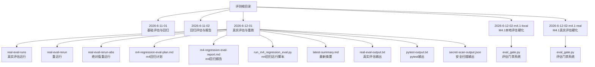
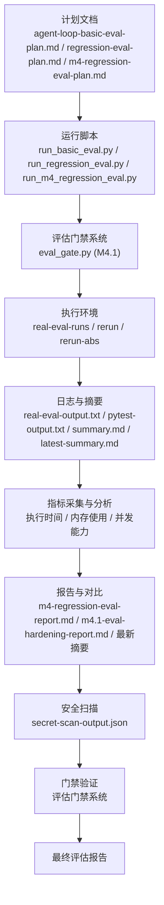
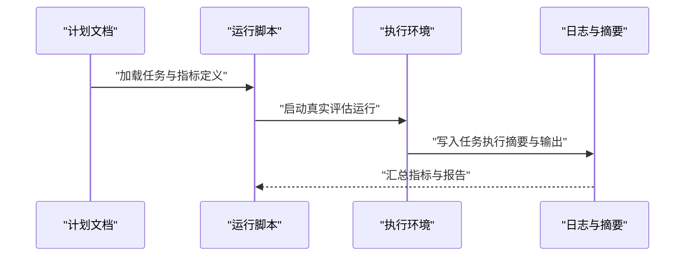
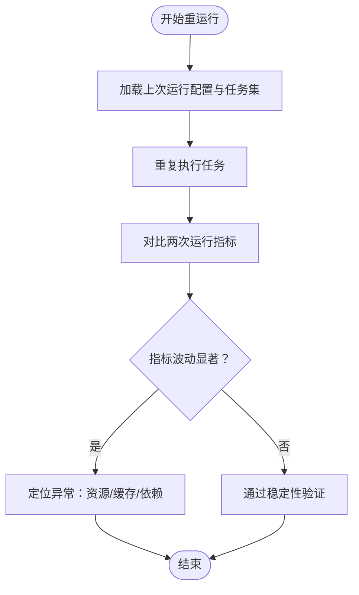
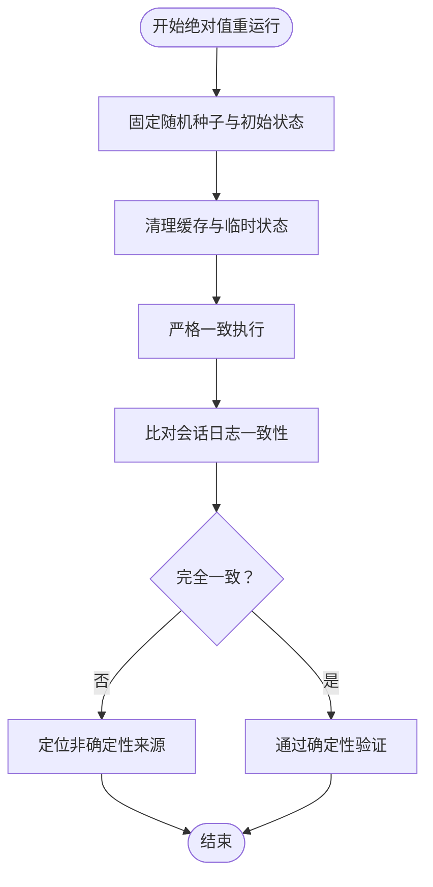
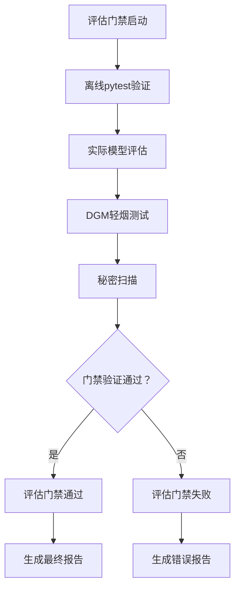
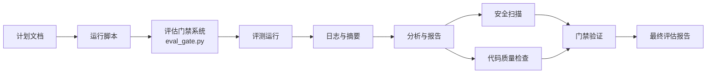

# 性能基准测试

<cite>
**本文档引用的文件**
- [README.md](file://README.md)
- [pyproject.toml](file://pyproject.toml)
- [评测/2026-6-12-01/real-eval-runs/20260612-111202/summary.md](file://评测/2026-6-12-01/real-eval-runs/20260612-111202/summary.md)
- [评测/2026-6-12-01/real-eval-rerun/20260612-111903/summary.md](file://评测/2026-6-12-01/real-eval-rerun/20260612-111903/summary.md)
- [评测/2026-6-12-01/real-eval-rerun-abs/20260612-112207/summary.md](file://评测/2026-6-12-01/real-eval-rerun-abs/20260612-112207/summary.md)
- [评测/2026-6-12-01/run_m4_regression_eval.py](file://评测/2026-6-12-01/run_m4_regression_eval.py)
- [评测/2026-6-12-01/secret-scan-output.json](file://评测/2026-6-12-01/secret-scan-output.json)
- [评测/2026-6-12-01/real-eval-output.txt](file://评测/2026-6-12-01/real-eval-output.txt)
- [评测/2026-6-12-01/pytest-output.txt](file://评测/2026-6-12-01/pytest-output.txt)
- [评测/2026-6-12-01/latest-summary.md](file://评测/2026-6-12-01/latest-summary.md)
- [评测/2026-6-11-01/run_basic_eval.py](file://评测/2026-6-11-01/run_basic_eval.py)
- [评测/2026-6-11-01/agent-loop-basic-eval-plan.md](file://评测/2026-6-11-01/agent-loop-basic-eval-plan.md)
- [评测/2026-6-11-02/regression-eval-plan.md](file://评测/2026-6-11-02/regression-eval-plan.md)
- [评测/2026-6-11-02/regression-eval-report.md](file://评测/2026-6-11-02/regression-eval-report.md)
- [评测/2026-6-11-02/run_regression_eval.py](file://评测/2026-6-11-02/run_regression_eval.py)
- [评测/2026-6-12-01/m4-regression-eval-plan.md](file://评测/2026-6-12-01/m4-regression-eval-plan.md)
- [评测/2026-6-12-01/m4-regression-eval-report.md](file://评测/2026-6-12-01/m4-regression-eval-report.md)
- [评测/2026-6-12-01/manual-revalidation-create_pytest_project.txt](file://评测/2026-6-12-01/manual-revalidation-create_pytest_project.txt)
- [评测/2026-6-12-01/dgm-smoke/candidate/.mu/prompts/](file://评测/2026-6-12-01/dgm-smoke/candidate/.mu/prompts/)
- [评测/2026-6-12-01/dgm-smoke/archive/candidates/m4-regression-smoke/workspace/mu/](file://评测/2026-6-12-01/dgm-smoke/archive/candidates/m4-regression-smoke/workspace/mu/)
- [评测/2026-6-12-01/dgm-smoke/archive/candidates/m4-regression-smoke/workspace/tests/](file://评测/2026-6-12-01/dgm-smoke/archive/candidates/m4-regression-smoke/workspace/tests/)
- [评测/2026-6-12-01/dgm-smoke/archive/candidates/m4-regression-smoke/workspace/plan/](file://评测/2026-6-12-01/dgm-smoke/archive/candidates/m4-regression-smoke/workspace/plan/)
- [评测/2026-6-12-01/dgm-smoke/archive/candidates/m4-regression-smoke/workspace/docs/](file://评测/2026-6-12-01/dgm-smoke/archive/candidates/m4-regression-smoke/workspace/docs/)
- [评测/2026-6-12-01/dgm-smoke/archive/candidates/m4-regression-smoke/workspace/temp/](file://评测/2026-6-12-01/dgm-smoke/archive/candidates/m4-regression-smoke/workspace/temp/)
- [评测/2026-6-12-01/dgm-smoke/archive/candidates/m4-regression-smoke/workspace/extensions/](file://评测/2026-6-12-01/dgm-smoke/archive/candidates/m4-regression-smoke/workspace/extensions/)
- [评测/2026-6-12-02-m4.1-local/m4.1-eval-hardening-report.md](file://评测/2026-6-12-02-m4.1-local/m4.1-eval-hardening-report.md)
- [评测/2026-6-12-02-m4.1-real/m4.1-eval-hardening-report.md](file://评测/2026-6-12-02-m4.1-real/m4.1-eval-hardening-report.md)
- [评测/2026-6-12-02-m4.1-local/dgm-smoke/archive/candidates/m4.1-smoke/workspace/mu/eval_gate.py](file://评测/2026-6-12-02-m4.1-local/dgm-smoke/archive/candidates/m4.1-smoke/workspace/mu/eval_gate.py)
- [评测/2026-6-12-02-m4.1-real/dgm-smoke/archive/candidates/m4.1-smoke/workspace/mu/eval_gate.py](file://评测/2026-6-12-02-m4.1-real/dgm-smoke/archive/candidates/m4.1-smoke/workspace/mu/eval_gate.py)
</cite>

## 更新摘要
**所做更改**
- 新增M4.1评估硬化门禁系统的性能考量章节
- 更新评估门禁模块的架构分析和性能指标
- 增加秘密扫描集成的性能影响分析
- 扩展真实评估运行的性能基准测试框架
- 更新项目结构以包含M4.1评估相关目录

## 目录
1. [引言](#引言)
2. [项目结构](#项目结构)
3. [核心组件](#核心组件)
4. [架构总览](#架构总览)
5. [详细组件分析](#详细组件分析)
6. [M4.1评估硬化门禁系统](#m41评估硬化门禁系统)
7. [依赖分析](#依赖分析)
8. [性能考量](#性能考量)
9. [故障排查指南](#故障排查指南)
10. [结论](#结论)
11. [附录](#附录)

## 引言
本文件面向 μ（mu）项目的性能基准测试，系统化阐述测试设计目标、测试场景与运行模式，解释真实评估运行（real-eval-runs）、重运行（rerun）与绝对值重运行（abs）的区别与用途；给出性能指标采集与分析方法（执行时间、内存使用、并发处理能力等），提供结果解读指南（与基线版本对比），说明安全扫描与代码质量检查在性能测试中的作用，并给出优化建议与瓶颈识别方法，以及测试数据来源与验证方式。

**更新** 本次更新特别关注M4.1评估硬化的性能基准测试，包括秘密扫描和评估门禁系统的性能考量，确保评估流程的完整性和安全性。

## 项目结构
评测目录下包含多轮评估与回归测试产物，涵盖不同运行模式与计划文档，形成可重复、可对比的性能基准体系。新增的M4.1评估硬化版本提供了更严格的门禁系统和秘密扫描机制。

关键路径如下：
- 基准运行与回归：评测/2026-6-11-01、评测/2026-6-11-02
- 新一轮真实评估与重跑：评测/2026-6-12-01
- M4.1评估硬化版本：评测/2026-6-12-02-m4.1-local、评测/2026-6-12-02-m4.1-real
- 计划与报告：各日期目录下的计划与报告文件
- 运行脚本：run_basic_eval.py、run_regression_eval.py、run_m4_regression_eval.py
- 输出日志与摘要：real-eval-output.txt、pytest-output.txt、latest-summary.md、各 run 的 summary.md
- 评估门禁系统：eval_gate.py模块提供完整的门禁验证流程

**图表来源**
- [评测/2026-6-12-01/latest-summary.md](file://评测/2026-6-12-01/latest-summary.md)
- [评测/2026-6-12-01/real-eval-runs/20260612-111202/summary.md](file://评测/2026-6-12-01/real-eval-runs/20260612-111202/summary.md)
- [评测/2026-6-12-01/real-eval-rerun/20260612-111903/summary.md](file://评测/2026-6-12-01/real-eval-rerun/20260612-111903/summary.md)
- [评测/2026-6-12-01/real-eval-rerun-abs/20260612-112207/summary.md](file://评测/2026-6-12-01/real-eval-rerun-abs/20260612-112207/summary.md)
- [评测/2026-6-12-01/run_m4_regression_eval.py](file://评测/2026-6-12-01/run_m4_regression_eval.py)
- [评测/2026-6-12-01/real-eval-output.txt](file://评测/2026-6-12-01/real-eval-output.txt)
- [评测/2026-6-12-01/pytest-output.txt](file://评测/2026-6-12-01/pytest-output.txt)
- [评测/2026-6-12-01/secret-scan-output.json](file://评测/2026-6-12-01/secret-scan-output.json)
- [评测/2026-6-12-02-m4.1-local/m4.1-eval-hardening-report.md](file://评测/2026-6-12-02-m4.1-local/m4.1-eval-hardening-report.md)
- [评测/2026-6-12-02-m4.1-real/m4.1-eval-hardening-report.md](file://评测/2026-6-12-02-m4.1-real/m4.1-eval-hardening-report.md)

**章节来源**
- [README.md](file://README.md)
- [pyproject.toml](file://pyproject.toml)

## 核心组件
- 评测运行模式
  - real-eval-runs：真实评估运行，用于在真实任务上测量端到端性能与稳定性。
  - real-eval-rerun：重运行，对同一任务集进行重复执行以评估波动性与收敛性。
  - real-eval-rerun-abs：绝对值重运行，强调在相同初始状态下的绝对一致性验证。
- 计划与报告
  - agent-loop-basic-eval-plan.md、regression-eval-plan.md、m4-regression-eval-plan.md 等：定义测试目标、任务集与评估维度。
  - 各 run 的 summary.md 与 latest-summary.md：汇总每轮运行的指标、通过率、失败项与改进建议。
  - m4.1-eval-hardening-report.md：M4.1评估硬化版本的专门报告。
- 脚本与日志
  - run_basic_eval.py、run_regression_eval.py、run_m4_regression_eval.py：驱动评估流程。
  - real-eval-output.txt、pytest-output.txt：评估与测试输出日志。
  - secret-scan-output.json：安全扫描结果，辅助评估安全性与合规性。
- 评估门禁系统
  - eval_gate.py：提供完整的M4.1评估硬化门禁系统，包含离线pytest、真实模型评估、DGM轻烟测试和最终秘密扫描。

**章节来源**
- [评测/2026-6-12-01/real-eval-runs/20260612-111202/summary.md](file://评测/2026-6-12-01/real-eval-runs/20260612-111202/summary.md)
- [评测/2026-6-12-01/real-eval-rerun/20260612-111903/summary.md](file://评测/2026-6-12-01/real-eval-rerun/20260612-111903/summary.md)
- [评测/2026-6-12-01/real-eval-rerun-abs/20260612-112207/summary.md](file://评测/2026-6-12-01/real-eval-rerun-abs/20260612-112207/summary.md)
- [评测/2026-6-12-01/latest-summary.md](file://评测/2026-6-12-01/latest-summary.md)
- [评测/2026-6-12-01/run_m4_regression_eval.py](file://评测/2026-6-12-01/run_m4_regression_eval.py)
- [评测/2026-6-12-01/real-eval-output.txt](file://评测/2026-6-12-01/real-eval-output.txt)
- [评测/2026-6-12-01/pytest-output.txt](file://评测/2026-6-12-01/pytest-output.txt)
- [评测/2026-6-12-01/secret-scan-output.json](file://评测/2026-6-12-01/secret-scan-output.json)
- [评测/2026-6-12-02-m4.1-local/m4.1-eval-hardening-report.md](file://评测/2026-6-12-02-m4.1-local/m4.1-eval-hardening-report.md)
- [评测/2026-6-12-02-m4.1-real/m4.1-eval-hardening-report.md](file://评测/2026-6-12-02-m4.1-real/m4.1-eval-hardening-report.md)

## 架构总览
性能基准测试由"计划—运行—采集—分析—报告"闭环构成。计划文档定义任务与指标，运行脚本驱动执行，日志与摘要记录结果，最后形成对比分析与改进建议。M4.1评估硬化版本在此基础上增加了门禁系统和秘密扫描的安全层。

**图表来源**
- [评测/2026-6-11-01/agent-loop-basic-eval-plan.md](file://评测/2026-6-11-01/agent-loop-basic-eval-plan.md)
- [评测/2026-6-11-02/regression-eval-plan.md](file://评测/2026-6-11-02/regression-eval-plan.md)
- [评测/2026-6-12-01/m4-regression-eval-plan.md](file://评测/2026-6-12-01/m4-regression-eval-plan.md)
- [评测/2026-6-11-01/run_basic_eval.py](file://评测/2026-6-11-01/run_basic_eval.py)
- [评测/2026-6-11-02/run_regression_eval.py](file://评测/2026-6-11-02/run_regression_eval.py)
- [评测/2026-6-12-01/run_m4_regression_eval.py](file://评测/2026-6-12-01/run_m4_regression_eval.py)
- [评测/2026-6-12-02-m4.1-local/dgm-smoke/archive/candidates/m4.1-smoke/workspace/mu/eval_gate.py](file://评测/2026-6-12-02-m4.1-local/dgm-smoke/archive/candidates/m4.1-smoke/workspace/mu/eval_gate.py)
- [评测/2026-6-12-02-m4.1-real/dgm-smoke/archive/candidates/m4.1-smoke/workspace/mu/eval_gate.py](file://评测/2026-6-12-02-m4.1-real/dgm-smoke/archive/candidates/m4.1-smoke/workspace/mu/eval_gate.py)
- [评测/2026-6-12-01/real-eval-output.txt](file://评测/2026-6-12-01/real-eval-output.txt)
- [评测/2026-6-12-01/pytest-output.txt](file://评测/2026-6-12-01/pytest-output.txt)
- [评测/2026-6-12-01/real-eval-runs/20260612-111202/summary.md](file://评测/2026-6-12-01/real-eval-runs/20260612-111202/summary.md)
- [评测/2026-6-12-01/latest-summary.md](file://评测/2026-6-12-01/latest-summary.md)
- [评测/2026-6-12-01/secret-scan-output.json](file://评测/2026-6-12-01/secret-scan-output.json)

## 详细组件分析

### 真实评估运行（real-eval-runs）
- 设计目标：在真实任务场景中评估端到端性能，覆盖典型开发任务（如创建项目、修复缺陷、实现功能）。
- 执行流程：运行脚本启动，按计划执行任务，记录每个任务的执行时间、通过状态、验证结果与会话日志。
- 指标采集：从 summary.md 中提取任务级指标，结合 real-eval-output.txt 与 pytest-output.txt 统计整体耗时与错误分布。
- 结果解读：关注平均/中位执行时间、失败率、异常堆栈定位与资源占用趋势。

**图表来源**
- [评测/2026-6-12-01/real-eval-runs/20260612-111202/summary.md](file://评测/2026-6-12-01/real-eval-runs/20260612-111202/summary.md)
- [评测/2026-6-12-01/real-eval-output.txt](file://评测/2026-6-12-01/real-eval-output.txt)
- [评测/2026-6-12-01/pytest-output.txt](file://评测/2026-6-12-01/pytest-output.txt)

**章节来源**
- [评测/2026-6-12-01/real-eval-runs/20260612-111202/summary.md](file://评测/2026-6-12-01/real-eval-runs/20260612-111202/summary.md)
- [评测/2026-6-12-01/real-eval-output.txt](file://评测/2026-6-12-01/real-eval-output.txt)
- [评测/2026-6-12-01/pytest-output.txt](file://评测/2026-6-12-01/pytest-output.txt)

### 重运行（rerun）
- 设计目标：在相同任务集与初始条件下重复执行，评估系统稳定性与收敛性，识别波动与异常。
- 执行流程：基于上次运行的配置与任务集再次执行，比较两次运行的指标差异。
- 指标采集：对比两次 summary.md 的任务级指标，统计时间方差、失败次数变化。
- 结果解读：若时间显著增加或失败率上升，需进一步定位资源竞争、缓存失效或外部依赖波动。

**图表来源**
- [评测/2026-6-12-01/real-eval-rerun/20260612-111903/summary.md](file://评测/2026-6-12-01/real-eval-rerun/20260612-111903/summary.md)
- [评测/2026-6-12-01/real-eval-runs/20260612-111202/summary.md](file://评测/2026-6-12-01/real-eval-runs/20260612-111202/summary.md)

**章节来源**
- [评测/2026-6-12-01/real-eval-rerun/20260612-111903/summary.md](file://评测/2026-6-12-01/real-eval-rerun/20260612-111903/summary.md)

### 绝对值重运行（abs）
- 设计目标：在完全相同的初始状态与随机种子下进行严格一致性的验证，确保关键路径的确定性。
- 执行流程：固定随机源、清理缓存、重置会话，确保除输入外其他条件一致。
- 指标采集：对比绝对误差与一致性指标，关注会话日志（sessions/*.jsonl）的一致性。
- 结果解读：若出现不一致，优先检查非确定性操作（随机初始化、外部API调用、并发竞态）。

**图表来源**
- [评测/2026-6-12-01/real-eval-rerun-abs/20260612-112207/summary.md](file://评测/2026-6-12-01/real-eval-rerun-abs/20260612-112207/summary.md)
- [评测/2026-6-12-01/real-eval-rerun-abs/20260612-112207/sessions/ba71551bf8a0.jsonl](file://评测/2026-6-12-01/real-eval-rerun-abs/20260612-112207/sessions/ba71551bf8a0.jsonl)

**章节来源**
- [评测/2026-6-12-01/real-eval-rerun-abs/20260612-112207/summary.md](file://评测/2026-6-12-01/real-eval-rerun-abs/20260612-112207/summary.md)

### 性能指标采集与分析
- 执行时间：从 summary.md 的任务级耗时与全局耗时统计中提取，结合 real-eval-output.txt 的起止时间计算端到端时延。
- 内存使用：结合 pytest-output.txt 中的资源监控信息与系统监控工具输出，分析峰值与均值。
- 并发处理能力：通过多任务并行执行的吞吐量与等待队列长度评估，观察是否存在锁争用或I/O瓶颈。
- 分析方法：采用描述性统计（均值、中位数、分位数）、趋势图与对比表，按任务类型与模块划分进行归因分析。

**章节来源**
- [评测/2026-6-12-01/real-eval-runs/20260612-111202/summary.md](file://评测/2026-6-12-01/real-eval-runs/20260612-111202/summary.md)
- [评测/2026-6-12-01/real-eval-output.txt](file://评测/2026-6-12-01/real-eval-output.txt)
- [评测/2026-6-12-01/pytest-output.txt](file://评测/2026-6-12-01/pytest-output.txt)

### 结果解读与基线对比
- 基线版本：以历史稳定版本（如 2026-6-11-01 或 2026-6-11-02）的 summary.md 作为基线，对比当前版本的指标变化。
- 对比维度：任务通过率、平均耗时、失败项数量、异常类型分布。
- 报告生成：使用 latest-summary.md 与 m4-regression-eval-report.md 汇总对比结论与改进建议。

**章节来源**
- [评测/2026-6-11-01/agent-loop-basic-eval-plan.md](file://评测/2026-6-11-01/agent-loop-basic-eval-plan.md)
- [评测/2026-6-11-02/regression-eval-report.md](file://评测/2026-6-11-02/regression-eval-report.md)
- [评测/2026-6-12-01/latest-summary.md](file://评测/2026-6-12-01/latest-summary.md)
- [评测/2026-6-12-01/m4-regression-eval-report.md](file://评测/2026-6-12-01/m4-regression-eval-report.md)

### 安全扫描与代码质量检查
- 安全扫描：通过 secret-scan-output.json 检查潜在敏感信息泄露风险，确保评估过程中不引入安全问题。
- 代码质量：结合 pytest-output.txt 中的单元测试覆盖率与静态检查结果，评估变更对质量的影响。
- 在性能测试中的作用：将安全与质量纳入评估门槛，避免以牺牲安全或质量换取性能。

**章节来源**
- [评测/2026-6-12-01/secret-scan-output.json](file://评测/2026-6-12-01/secret-scan-output.json)
- [评测/2026-6-12-01/pytest-output.txt](file://评测/2026-6-12-01/pytest-output.txt)

### 测试数据来源与验证
- 数据来源：评测/2026-6-12-01/dgm-smoke/archive/candidates/m4-regression-smoke/workspace 下的 mu、tests、plan、docs、temp、extensions 等子树，作为候选工作区与测试样本。
- 验证方法：通过任务 prompt 与 validation.txt 校验输出正确性；通过 sessions 日志回放验证会话一致性；通过 summary.md 的通过率与失败项核验评估完整性。

**章节来源**
- [评测/2026-6-12-01/dgm-smoke/archive/candidates/m4-regression-smoke/workspace/mu/](file://评测/2026-6-12-01/dgm-smoke/archive/candidates/m4-regression-smoke/workspace/mu/)
- [评测/2026-6-12-01/dgm-smoke/archive/candidates/m4-regression-smoke/workspace/tests/](file://评测/2026-6-12-01/dgm-smoke/archive/candidates/m4-regression-smoke/workspace/tests/)
- [评测/2026-6-12-01/dgm-smoke/archive/candidates/m4-regression-smoke/workspace/plan/](file://评测/2026-6-12-01/dgm-smoke/archive/candidates/m4-regression-smoke/workspace/plan/)
- [评测/2026-6-12-01/dgm-smoke/archive/candidates/m4-regression-smoke/workspace/docs/](file://评测/2026-6-12-01/dgm-smoke/archive/candidates/m4-regression-smoke/workspace/docs/)
- [评测/2026-6-12-01/dgm-smoke/archive/candidates/m4-regression-smoke/workspace/temp/](file://评测/2026-6-12-01/dgm-smoke/archive/candidates/m4-regression-smoke/workspace/temp/)
- [评测/2026-6-12-01/dgm-smoke/archive/candidates/m4-regression-smoke/workspace/extensions/](file://评测/2026-6-12-01/dgm-smoke/archive/candidates/m4-regression-smoke/workspace/extensions/)

## M4.1评估硬化门禁系统

### 评估门禁架构概述
M4.1评估硬化版本引入了完整的门禁系统，确保评估过程的安全性和可靠性。评估门禁系统（eval_gate）提供了一个可重现且严格的评估流程，包含多个验证阶段：

- 离线pytest：验证代码质量和基本功能
- 实际模型评估：使用真实模型进行编码任务评估
- DGM轻烟测试：进行轻量级的图形模型测试
- 秘密扫描：对过程工件进行全面的安全扫描

**图表来源**
- [评测/2026-6-12-02-m4.1-local/dgm-smoke/archive/candidates/m4.1-smoke/workspace/mu/eval_gate.py](file://评测/2026-6-12-02-m4.1-local/dgm-smoke/archive/candidates/m4.1-smoke/workspace/mu/eval_gate.py)
- [评测/2026-6-12-02-m4.1-real/dgm-smoke/archive/candidates/m4.1-smoke/workspace/mu/eval_gate.py](file://评测/2026-6-12-02-m4.1-real/dgm-smoke/archive/candidates/m4.1-smoke/workspace/mu/eval_gate.py)

### 门禁系统性能考量
- 执行时间：评估门禁系统包含多个验证步骤，总执行时间应控制在合理范围内
- 资源使用：离线pytest、实际模型评估和秘密扫描都会消耗CPU和内存资源
- 并发处理：门禁系统支持超时设置，防止长时间阻塞
- 可重现性：通过固定随机种子和标准化环境确保结果一致性

### 秘密扫描集成
秘密扫描是M4.1评估硬化的重要组成部分，用于检测潜在的敏感信息泄露：

- 扫描范围：对评估过程产生的所有工件进行扫描
- 检测内容：API密钥、密码、令牌等敏感信息
- 处理策略：发现敏感信息时立即标记为失败
- 报告输出：生成详细的扫描报告和修复建议

**章节来源**
- [评测/2026-6-12-02-m4.1-local/m4.1-eval-hardening-report.md](file://评测/2026-6-12-02-m4.1-local/m4.1-eval-hardening-report.md)
- [评测/2026-6-12-02-m4.1-real/m4.1-eval-hardening-report.md](file://评测/2026-6-12-02-m4.1-real/m4.1-eval-hardening-report.md)
- [评测/2026-6-12-02-m4.1-local/dgm-smoke/archive/candidates/m4.1-smoke/workspace/mu/eval_gate.py](file://评测/2026-6-12-02-m4.1-local/dgm-smoke/archive/candidates/m4.1-smoke/workspace/mu/eval_gate.py)
- [评测/2026-6-12-02-m4.1-real/dgm-smoke/archive/candidates/m4.1-smoke/workspace/mu/eval_gate.py](file://评测/2026-6-12-02-m4.1-real/dgm-smoke/archive/candidates/m4.1-smoke/workspace/mu/eval_gate.py)

## 依赖分析
- 计划与运行脚本：计划文档驱动运行脚本，运行脚本决定执行范围与参数。
- 运行与日志：运行产生日志与摘要，摘要成为分析与报告的基础。
- 安全与质量：secret-scan-output.json 与 pytest-output.txt 提供安全与质量约束。
- 门禁系统：eval_gate.py 作为M4.1评估的核心组件，提供完整的验证流程。

**图表来源**
- [评测/2026-6-12-01/m4-regression-eval-plan.md](file://评测/2026-6-12-01/m4-regression-eval-plan.md)
- [评测/2026-6-12-01/run_m4_regression_eval.py](file://评测/2026-6-12-01/run_m4_regression_eval.py)
- [评测/2026-6-12-01/real-eval-runs/20260612-111202/summary.md](file://评测/2026-6-12-01/real-eval-runs/20260612-111202/summary.md)
- [评测/2026-6-12-01/secret-scan-output.json](file://评测/2026-6-12-01/secret-scan-output.json)
- [评测/2026-6-12-01/pytest-output.txt](file://评测/2026-6-12-01/pytest-output.txt)
- [评测/2026-6-12-02-m4.1-local/dgm-smoke/archive/candidates/m4.1-smoke/workspace/mu/eval_gate.py](file://评测/2026-6-12-02-m4.1-local/dgm-smoke/archive/candidates/m4.1-smoke/workspace/mu/eval_gate.py)

**章节来源**
- [评测/2026-6-12-01/m4-regression-eval-plan.md](file://评测/2026-6-12-01/m4-regression-eval-plan.md)
- [评测/2026-6-12-01/run_m4_regression_eval.py](file://评测/2026-6-12-01/run_m4_regression_eval.py)
- [评测/2026-6-12-01/real-eval-runs/20260612-111202/summary.md](file://评测/2026-6-12-01/real-eval-runs/20260612-111202/summary.md)
- [评测/2026-6-12-01/secret-scan-output.json](file://评测/2026-6-12-01/secret-scan-output.json)
- [评测/2026-6-12-01/pytest-output.txt](file://评测/2026-6-12-01/pytest-output.txt)

## 性能考量
- 执行时间优化：减少不必要的I/O、合并请求、缓存热点数据；对长尾任务进行拆分与并行化。
- 内存使用控制：及时释放临时对象、限制并发度、启用压缩与懒加载策略。
- 并发能力提升：优化锁粒度、消除热点共享、引入异步与事件驱动模型。
- 可观测性：完善日志分级、埋点与告警，建立端到端追踪与关键路径监控。
- 门禁系统优化：合理设置超时时间，优化秘密扫描算法，减少对主评估流程的影响。

**更新** M4.1评估硬化版本在性能考量中增加了门禁系统的特殊要求，包括超时管理和资源隔离。

## 故障排查指南
- 指标异常：对比基线版本，定位任务类型与模块差异；检查日志中的错误堆栈与资源使用峰值。
- 稳定性问题：通过 rerun 复现波动，分析时间方差与失败次数变化；排查外部依赖与并发竞态。
- 确定性问题：使用 abs 模式固定随机种子与初始状态，比对会话日志，定位非确定性来源。
- 安全与质量：依据 secret-scan-output.json 与 pytest-output.txt，修复敏感信息与质量问题。
- 门禁系统问题：检查 eval_gate.py 的配置参数，验证各个验证步骤的执行状态，排查超时和资源不足问题。

**更新** 新增门禁系统故障排查指南，重点关注评估门禁的配置和执行状态。

**章节来源**
- [评测/2026-6-12-01/real-eval-rerun/20260612-111903/summary.md](file://评测/2026-6-12-01/real-eval-rerun/20260612-111903/summary.md)
- [评测/2026-6-12-01/real-eval-rerun-abs/20260612-112207/summary.md](file://评测/2026-6-12-01/real-eval-rerun-abs/20260612-112207/summary.md)
- [评测/2026-6-12-01/secret-scan-output.json](file://评测/2026-6-12-01/secret-scan-output.json)
- [评测/2026-6-12-01/pytest-output.txt](file://评测/2026-6-12-01/pytest-output.txt)
- [评测/2026-6-12-02-m4.1-local/dgm-smoke/archive/candidates/m4.1-smoke/workspace/mu/eval_gate.py](file://评测/2026-6-12-02-m4.1-local/dgm-smoke/archive/candidates/m4.1-smoke/workspace/mu/eval_gate.py)
- [评测/2026-6-12-02-m4.1-real/dgm-smoke/archive/candidates/m4.1-smoke/workspace/mu/eval_gate.py](file://评测/2026-6-12-02-m4.1-real/dgm-smoke/archive/candidates/m4.1-smoke/workspace/mu/eval_gate.py)

## 结论
通过 real-eval-runs、rerun 与 abs 的组合，μ 性能基准测试实现了从端到端评估、稳定性验证到确定性校验的完整闭环。配合计划、脚本、日志与安全扫描，能够系统化地发现性能瓶颈、评估改进效果并保障质量与安全。

**更新** M4.1评估硬化版本进一步增强了评估流程的安全性和可靠性，通过评估门禁系统和秘密扫描确保评估过程的完整性和安全性。建议持续迭代计划与脚本，扩大任务覆盖面，细化指标维度，强化自动化与可视化，同时优化门禁系统的性能表现。

## 附录
- 计划与报告参考
  - [agent-loop-basic-eval-plan.md](file://评测/2026-6-11-01/agent-loop-basic-eval-plan.md)
  - [regression-eval-plan.md](file://评测/2026-6-11-02/regression-eval-plan.md)
  - [m4-regression-eval-plan.md](file://评测/2026-6-12-01/m4-regression-eval-plan.md)
  - [m4-regression-eval-report.md](file://评测/2026-6-12-01/m4-regression-eval-report.md)
  - [m4.1-eval-hardening-report.md](file://评测/2026-6-12-02-m4.1-local/m4.1-eval-hardening-report.md)
- 运行脚本参考
  - [run_basic_eval.py](file://评测/2026-6-11-01/run_basic_eval.py)
  - [run_regression_eval.py](file://评测/2026-6-11-02/run_regression_eval.py)
  - [run_m4_regression_eval.py](file://评测/2026-6-12-01/run_m4_regression_eval.py)
- 输出与摘要参考
  - [real-eval-output.txt](file://评测/2026-6-12-01/real-eval-output.txt)
  - [pytest-output.txt](file://评测/2026-6-12-01/pytest-output.txt)
  - [latest-summary.md](file://评测/2026-6-12-01/latest-summary.md)
  - [manual-revalidation-create_pytest_project.txt](file://评测/2026-6-12-01/manual-revalidation-create_pytest_project.txt)
- 门禁系统参考
  - [eval_gate.py](file://评测/2026-6-12-02-m4.1-local/dgm-smoke/archive/candidates/m4.1-smoke/workspace/mu/eval_gate.py)
  - [eval_gate.py](file://评测/2026-6-12-02-m4.1-real/dgm-smoke/archive/candidates/m4.1-smoke/workspace/mu/eval_gate.py)