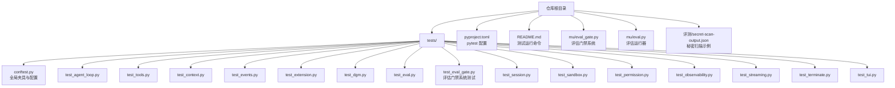
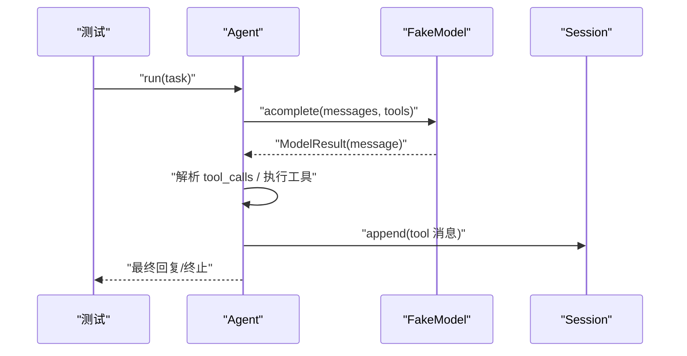
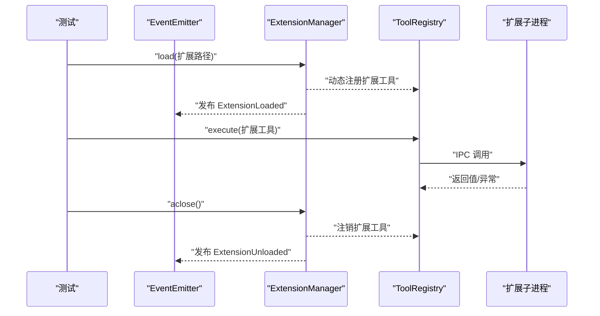
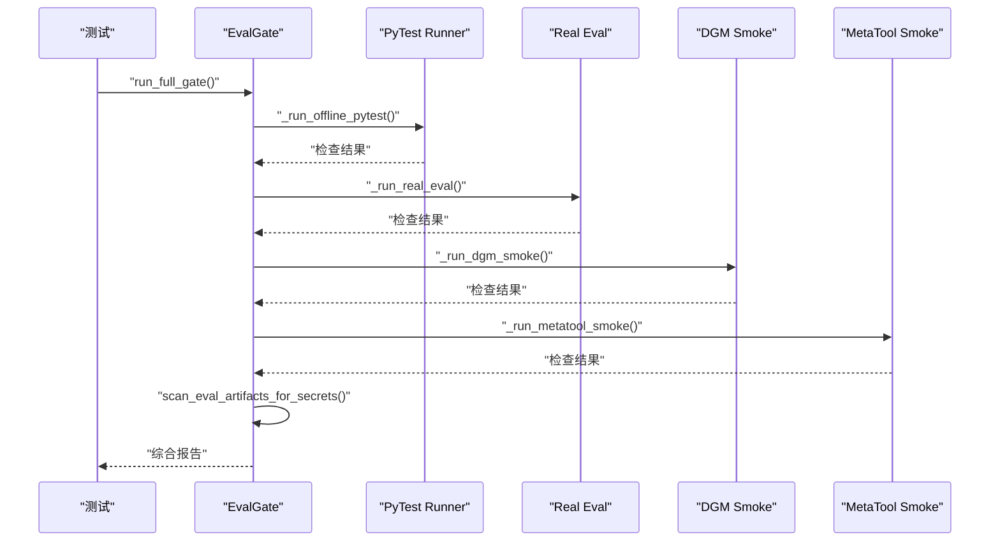
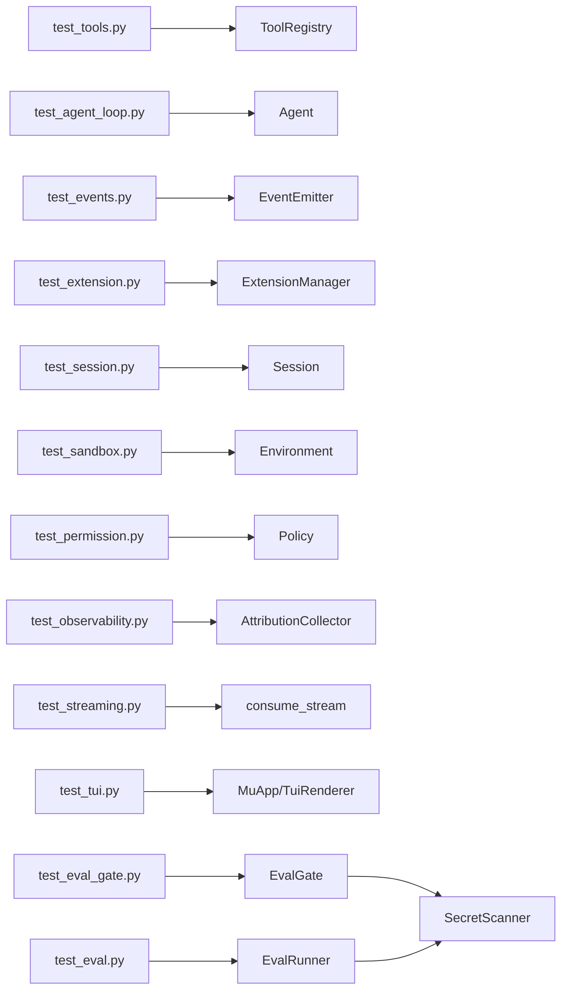

# 测试框架

<cite>
**本文引用的文件**
- [pyproject.toml](file://pyproject.toml)
- [README.md](file://README.md)
- [tests/conftest.py](file://tests/conftest.py)
- [tests/test_agent_loop.py](file://tests/test_agent_loop.py)
- [tests/test_tools.py](file://tests/test_tools.py)
- [tests/test_context.py](file://tests/test_context.py)
- [tests/test_events.py](file://tests/test_events.py)
- [tests/test_extension.py](file://tests/test_extension.py)
- [tests/test_dgm.py](file://tests/test_dgm.py)
- [tests/test_eval.py](file://tests/test_eval.py)
- [tests/test_eval_gate.py](file://tests/test_eval_gate.py)
- [tests/test_session.py](file://tests/test_session.py)
- [tests/test_sandbox.py](file://tests/test_sandbox.py)
- [tests/test_permission.py](file://tests/test_permission.py)
- [tests/test_observability.py](file://tests/test_observability.py)
- [tests/test_streaming.py](file://tests/test_streaming.py)
- [tests/test_terminate.py](file://tests/test_terminate.py)
- [tests/test_tui.py](file://tests/test_tui.py)
- [mu/eval_gate.py](file://mu/eval_gate.py)
- [mu/eval.py](file://mu/eval.py)
- [评测/2026-6-12-01/secret-scan-output.json](file://评测/2026-6-12-01/secret-scan-output.json)
</cite>

## 目录
1. [简介](#简介)
2. [项目结构](#项目结构)
3. [核心组件](#核心组件)
4. [架构总览](#架构总览)
5. [详细组件分析](#详细组件分析)
6. [依赖分析](#依赖分析)
7. [性能考虑](#性能考虑)
8. [故障排查指南](#故障排查指南)
9. [结论](#结论)
10. [附录](#附录)

## 简介
本文件面向 μ (mu) 测试框架，系统化阐述测试体系的架构、PyTest 配置、夹具（fixtures）设计与使用、各测试模块的功能与覆盖范围，并提供异步测试处理、测试数据准备、命令行选项与调试技巧等实用指南。目标读者既包括需要快速上手的开发者，也包括希望深入理解测试实现细节的高级用户。

**更新** 本次更新反映了新增的秘密扫描测试覆盖、评估运行器稳定性测试和评估门禁系统测试，增强了测试框架的安全性和可靠性保障能力。

## 项目结构
测试相关的核心位置如下：
- 测试根目录：tests/
- 全局夹具与配置：tests/conftest.py
- PyTest 配置与入口：pyproject.toml
- 顶层使用说明与测试运行命令：README.md
- 评估门禁系统：mu/eval_gate.py
- 评估运行器：mu/eval.py
- 秘密扫描输出示例：评测/2026-6-12-01/secret-scan-output.json



**图表来源**
- [pyproject.toml:29-32](file://pyproject.toml#L29-L32)
- [README.md:116-120](file://README.md#L116-L120)
- [tests/test_eval_gate.py:1-143](file://tests/test_eval_gate.py#L1-L143)
- [mu/eval_gate.py:1-499](file://mu/eval_gate.py#L1-L499)
- [mu/eval.py:1-685](file://mu/eval.py#L1-L685)
- [评测/2026-6-12-01/secret-scan-output.json:1-11](file://评测/2026-6-12-01/secret-scan-output.json#L1-L11)

**章节来源**
- [pyproject.toml:29-32](file://pyproject.toml#L29-L32)
- [README.md:116-120](file://README.md#L116-L120)
- [tests/test_eval_gate.py:1-143](file://tests/test_eval_gate.py#L1-L143)
- [mu/eval_gate.py:1-499](file://mu/eval_gate.py#L1-L499)
- [mu/eval.py:1-685](file://mu/eval.py#L1-L685)
- [评测/2026-6-12-01/secret-scan-output.json:1-11](file://评测/2026-6-12-01/secret-scan-output.json#L1-L11)

## 核心组件
- PyTest 配置与运行入口
  - asyncio_mode: auto，使异步测试无需手动标注。
  - testpaths: tests，限定测试扫描目录。
- 全局夹具
  - registry：ToolRegistry 实例，供工具类测试复用。
- 测试模块分类
  - Agent 循环与终止：test_agent_loop.py
  - 工具集（read/write/edit/bash）：test_tools.py
  - 上下文管线：test_context.py
  - 事件系统：test_events.py
  - 扩展系统（自延伸）：test_extension.py
  - DGM 与评估：test_dgm.py、test_eval.py
  - 评估门禁系统：test_eval_gate.py
  - 会话树与分支：test_session.py
  - 沙箱抽象与 Docker 环境：test_sandbox.py
  - 权限策略：test_permission.py
  - 可观测性（归因）：test_observability.py
  - 流式处理：test_streaming.py
  - 终止提示：test_terminate.py
  - TUI 界面：test_tui.py

**更新** 新增了评估门禁系统测试模块，专门用于验证评估运行器的稳定性和安全性。

**章节来源**
- [pyproject.toml:29-32](file://pyproject.toml#L29-L32)
- [tests/conftest.py:7-10](file://tests/conftest.py#L7-L10)
- [tests/test_agent_loop.py:1-225](file://tests/test_agent_loop.py#L1-L225)
- [tests/test_tools.py:1-117](file://tests/test_tools.py#L1-L117)
- [tests/test_context.py:1-40](file://tests/test_context.py#L1-L40)
- [tests/test_events.py:1-27](file://tests/test_events.py#L1-L27)
- [tests/test_extension.py:1-245](file://tests/test_extension.py#L1-L245)
- [tests/test_dgm.py:1-218](file://tests/test_dgm.py#L1-L218)
- [tests/test_eval.py:1-129](file://tests/test_eval.py#L1-L129)
- [tests/test_eval_gate.py:1-143](file://tests/test_eval_gate.py#L1-L143)
- [tests/test_session.py:1-59](file://tests/test_session.py#L1-L59)
- [tests/test_sandbox.py:1-25](file://tests/test_sandbox.py#L1-L25)
- [tests/test_permission.py:1-116](file://tests/test_permission.py#L1-L116)
- [tests/test_observability.py:1-71](file://tests/test_observability.py#L1-L71)
- [tests/test_streaming.py:1-49](file://tests/test_streaming.py#L1-L49)
- [tests/test_terminate.py:1-73](file://tests/test_terminate.py#L1-L73)
- [tests/test_tui.py:1-144](file://tests/test_tui.py#L1-L144)

## 架构总览
测试架构围绕"离线驱动 + 事件驱动 + 会话持久化 + 安全扫描"展开，确保无网络、无付费、可重复的单元与集成测试，同时提供安全性的端到端验证。

```mermaid
graph TB
subgraph "测试运行"
P["PyTest Runner"]
CFG["pytest 配置<br/>asyncio_mode=auto<br/>testpaths=tests"]
end
subgraph "夹具与工具"
REG["ToolRegistry<br/>registry 夹具"]
EVT["EventEmitter"]
SESS["Session<br/>临时目录持久化"]
END
subgraph "核心模块"
AG["Agent"]
MD["ModelResult/FakeModel"]
CTX["convert_to_llm/transform_context"]
EXT["ExtensionManager"]
PERM["Policy: allow/read_only/workspace"]
ENV["Environment/LocalEnvironment/DockerEnvironment"]
OBS["AttributionCollector"]
STR["consume_stream"]
EVAL["EvalRunner<br/>评估运行器"]
GATE["EvalGate<br/>评估门禁系统"]
SCAN["SecretScanner<br/>秘密扫描器"]
end
P --> CFG
P --> REG
P --> EVT
P --> SESS
REG --> AG
EVT --> AG
SESS --> AG
AG --> MD
AG --> CTX
AG --> EXT
REG --> PERM
ENV --> AG
EVT --> OBS
MD --> STR
EVAL --> SCAN
GATE --> EVAL
GATE --> SCAN
```

**更新** 新增了评估门禁系统和秘密扫描器，提供端到端的安全性验证。

**图表来源**
- [pyproject.toml:29-32](file://pyproject.toml#L29-L32)
- [tests/conftest.py:7-10](file://tests/conftest.py#L7-L10)
- [tests/test_agent_loop.py:38-51](file://tests/test_agent_loop.py#L38-L51)
- [tests/test_context.py:4](file://tests/test_context.py#L4)
- [tests/test_extension.py:68-84](file://tests/test_extension.py#L68-L84)
- [tests/test_permission.py:6](file://tests/test_permission.py#L6)
- [tests/test_sandbox.py:8](file://tests/test_sandbox.py#L8)
- [tests/test_observability.py:13](file://tests/test_observability.py#L13)
- [tests/test_streaming.py:4](file://tests/test_streaming.py#L4)
- [mu/eval.py:253-304](file://mu/eval.py#L253-L304)
- [mu/eval_gate.py:46-92](file://mu/eval_gate.py#L46-L92)
- [mu/eval.py:126-184](file://mu/eval.py#L126-L184)

## 详细组件分析

### PyTest 配置与夹具（conftest）
- 配置要点
  - asyncio_mode=auto：异步测试无需手动标记，简化协程测试。
  - testpaths=tests：限定扫描目录，避免误扫源码或其他目录。
- 全局夹具
  - registry：返回 ToolRegistry 实例，供工具类测试复用，减少重复初始化。

**章节来源**
- [pyproject.toml:29-32](file://pyproject.toml#L29-L32)
- [tests/conftest.py:1-10](file://tests/conftest.py#L1-L10)

### Agent 循环与终止测试（test_agent_loop）
- 设计思想
  - 使用 FakeModel 脚本化返回消息，控制每轮的 assistant/tool_calls/content，验证循环、终止条件、消息结构与会话角色序列。
  - 使用临时目录 Session，确保不污染工作目录。
- 关键断言
  - 单工具调用后停止、无工具调用立即停止、多工具调用顺序、read/edit/bash 闭环、取消时会话完整性、分支摘要注入 LLM 上下文。
- 异步处理
  - 所有测试均为 async，配合 asyncio.create_task 与取消流程，验证取消后的会话一致性。



**图表来源**
- [tests/test_agent_loop.py:58-81](file://tests/test_agent_loop.py#L58-L81)
- [tests/test_agent_loop.py:180-203](file://tests/test_agent_loop.py#L180-L203)

**章节来源**
- [tests/test_agent_loop.py:1-225](file://tests/test_agent_loop.py#L1-L225)

### 工具集测试（test_tools）
- 覆盖范围
  - write/read/edit/bash 的基本行为、参数校验、错误处理、超时与孤儿进程清理。
- 断言重点
  - 文件读写一致性、偏移与限制读取、缺失文件与空文件处理、编辑唯一性与失败回滚、bash 退出码与 stderr 捕获、超时与进程组清理、未知工具与缺失参数的报错。
- 异步与资源
  - 使用 tmp_path 作为隔离工作区，确保并发与重复测试的稳定性。

**章节来源**
- [tests/test_tools.py:1-117](file://tests/test_tools.py#L1-L117)

### 上下文管线测试（test_context）
- 职责
  - transform_context 保持消息不变；convert_to_llm 透传标准消息、注入分支摘要为 user、丢弃未知自定义类型。
- 断言
  - 标准消息透传、分支摘要注入、未知类型丢弃。

**章节来源**
- [tests/test_context.py:1-40](file://tests/test_context.py#L1-L40)

### 事件系统测试（test_events）
- 职责
  - EventEmitter 订阅与顺序分发，确保事件到达所有订阅者且顺序一致。
- 断言
  - 有序分发、无订阅者静默。

**章节来源**
- [tests/test_events.py:1-27](file://tests/test_events.py#L1-L27)

### 扩展系统测试（test_extension）
- 覆盖范围
  - ToolRegistry 动态注册/注销、扩展子进程加载/调用/状态持久化/错误事件、扩展崩溃快速降级、同名扩展拒绝与泄漏防护、Agent 自延伸闭环。
- 关键流程
  - 加载示例扩展，注册 word_count/reverse_text/set_prefix/greet 等工具，验证事件与状态恢复；崩溃场景下秒级返回错误并注销工具；禁止与内置冲突的名称。
- 异步与生命周期
  - 使用 tmp_path 与 Session 持久化，扩展加载后 aclose 清理子进程与工具注册。



**图表来源**
- [tests/test_extension.py:68-84](file://tests/test_extension.py#L68-L84)
- [tests/test_extension.py:163-186](file://tests/test_extension.py#L163-L186)

**章节来源**
- [tests/test_extension.py:1-245](file://tests/test_extension.py#L1-L245)

### DGM 与评估测试（test_dgm、test_eval）
- DGM 测试
  - 在候选工作区运行评估套件，断言通过情况、变更路径、归档保留与最佳候选标记、补丁候选应用、核心路径拒绝、受限权限下的扩展候选拒绝、提示片段注入。
- 评估测试
  - 运行评估套件，断言摘要生成与密钥脱敏、验证器失败记录、超时处理、模型环境必需性、归因提取。
  - **新增** 秘密扫描测试：验证 process artifacts 和忽略复制的 fixtures，确保安全扫描能够正确识别泄露的密钥和令牌。

**更新** 新增了秘密扫描测试覆盖，确保评估过程中的安全性。

**章节来源**
- [tests/test_dgm.py:1-218](file://tests/test_dgm.py#L1-L218)
- [tests/test_eval.py:1-129](file://tests/test_eval.py#L1-L129)
- [tests/test_eval.py:241-320](file://tests/test_eval.py#L241-L320)
- [mu/eval.py:126-184](file://mu/eval.py#L126-L184)

### 评估门禁系统测试（test_eval_gate）
- 设计思想
  - 验证完整的评估门禁流程，包括离线 pytest、真实模型评估、DGM 烟雾测试和元工具烟雾测试。
  - 集成秘密扫描，确保所有评估产物都经过安全检查。
- 关键测试点
  - 门禁目录命名规范（零填充日期格式）
  - 报告渲染覆盖跳过和秘密扫描失败的情况
  - 假代理源满足基本验证器要求
  - 固定根目录的可重复性测试
  - OS 错误报告为失败命令
- 安全性验证
  - 集成秘密扫描，验证评估产物中没有泄露的密钥
  - 支持忽略复制的测试夹具，避免误报



**更新** 新增了评估门禁系统测试模块，提供端到端的评估流程验证。

**图表来源**
- [tests/test_eval_gate.py:17-20](file://tests/test_eval_gate.py#L17-L20)
- [tests/test_eval_gate.py:23-67](file://tests/test_eval_gate.py#L23-L67)
- [tests/test_eval_gate.py:70-93](file://tests/test_eval_gate.py#L70-L93)
- [tests/test_eval_gate.py:96-131](file://tests/test_eval_gate.py#L96-L131)
- [tests/test_eval_gate.py:134-142](file://tests/test_eval_gate.py#L134-L142)

**章节来源**
- [tests/test_eval_gate.py:1-143](file://tests/test_eval_gate.py#L1-L143)
- [mu/eval_gate.py:46-92](file://mu/eval_gate.py#L46-L92)
- [mu/eval.py:126-184](file://mu/eval.py#L126-L184)

### 会话树与分支测试（test_session）
- 覆盖范围
  - 线性追加、持久化往返、从指定节点分支、分支摘要消息、未知节点分支异常。
- 断言
  - 路径构建、加载一致性、分支历史与叶子数量、摘要注入与丢弃。

**章节来源**
- [tests/test_session.py:1-59](file://tests/test_session.py#L1-L59)

### 沙箱抽象与 Docker 环境测试（test_sandbox）
- 覆盖范围
  - make_environment 选择本地或 Docker 环境；Docker 可用时 bash 正常执行。
- 断言
  - 本地环境实例化与协议满足；Docker 环境执行命令与退出码。

**章节来源**
- [tests/test_sandbox.py:1-25](file://tests/test_sandbox.py#L1-L25)

### 权限策略测试（test_permission）
- 覆盖范围
  - 默认 allow_all、只读策略阻止写/编辑/bash、工作区写入限制、按能力（capabilities）拦截 code_exec/extension_exec、动态工具默认保守能力、autoload 在只读下跳过。
- 断言
  - 能力判定、策略选择、扩展加载抑制。

**章节来源**
- [tests/test_permission.py:1-116](file://tests/test_permission.py#L1-L116)

### 可观测性（归因）测试（test_observability）
- 覆盖范围
  - 合成事件累计与报告、可选成本估算、跨 run 重置。
- 断言
  - 轮次、模型调用次数、LLM/工具耗时与 token、工具计数、报告文本与重置逻辑。

**章节来源**
- [tests/test_observability.py:1-71](file://tests/test_observability.py#L1-L71)

### 流式处理测试（test_streaming）
- 覆盖范围
  - consume_stream 将分片拼接为完整消息，支持文本增量与 tool_calls 参数增量，同时产出 usage。
- 断言
  - 内容拼接、tool_calls 增量合并、usage 合计。

**章节来源**
- [tests/test_streaming.py:1-49](file://tests/test_streaming.py#L1-L49)

### 终止提示测试（test_terminate）
- 覆盖范围
  - 工具返回 terminate=True 导致循环提前结束，不触发后续模型调用。
- 断言
  - 模型调用次数、消息角色序列、默认非终止语义。

**章节来源**
- [tests/test_terminate.py:1-73](file://tests/test_terminate.py#L1-L73)

### TUI 界面测试（test_tui）
- 覆盖范围
  - 使用 Textual Pilot 离线驱动，验证 TUI 与 headless 共享同一 Agent/Session/工具；渲染器映射事件、扩展事件展示与状态更新。
- 断言
  - 自动提交初始任务、输入提交后清空、渲染器事件映射、扩展事件可视化。

**章节来源**
- [tests/test_tui.py:1-144](file://tests/test_tui.py#L1-L144)

## 依赖分析
- 测试耦合与内聚
  - 大多数测试模块围绕单一职责（如工具、事件、权限）进行高内聚测试，依赖通过夹具与共享的 Session/EventEmitter/ToolRegistry 解耦。
- 外部依赖
  - Docker 环境测试对系统环境敏感，使用 pytest.mark.skipif 条件执行。
- 潜在循环依赖
  - 测试之间无直接循环导入；夹具与工具通过接口（如 ToolRegistry）解耦，避免循环依赖。
- **新增** 安全性依赖
  - 评估门禁系统依赖秘密扫描器进行安全检查
  - 评估运行器集成秘密扫描功能

**更新** 新增了安全性相关的依赖关系，确保测试框架的完整性。



**更新** 新增了评估门禁系统和评估运行器对秘密扫描器的依赖关系。

**图表来源**
- [tests/test_tools.py:7-12](file://tests/test_tools.py#L7-L12)
- [tests/test_agent_loop.py:53-55](file://tests/test_agent_loop.py#L53-L55)
- [tests/test_events.py:4](file://tests/test_events.py#L4)
- [tests/test_extension.py:68-74](file://tests/test_extension.py#L68-L74)
- [tests/test_session.py:4](file://tests/test_session.py#L4)
- [tests/test_sandbox.py:8](file://tests/test_sandbox.py#L8)
- [tests/test_permission.py:6](file://tests/test_permission.py#L6)
- [tests/test_observability.py:13](file://tests/test_observability.py#L13)
- [tests/test_streaming.py:4](file://tests/test_streaming.py#L4)
- [tests/test_tui.py:18-20](file://tests/test_tui.py#L18-L20)
- [tests/test_eval_gate.py:9](file://tests/test_eval_gate.py#L9)
- [tests/test_eval.py:10-14](file://tests/test_eval.py#L10-L14)
- [mu/eval_gate.py:20-37](file://mu/eval_gate.py#L20-L37)
- [mu/eval.py:22-31](file://mu/eval.py#L22-L31)

## 性能考虑
- 异步测试
  - 使用 asyncio_mode=auto，避免在大量协程测试中重复标注 async/await。
- 事件聚合
  - 归因收集器在单次运行内重置，避免跨 run 累计导致指标失真。
- 资源隔离
  - 使用 tmp_path 与临时 Session，避免磁盘竞争与状态污染。
- 超时与清理
  - bash 超时测试验证进程组清理，防止孤儿进程影响后续测试。
- **新增** 安全扫描优化
  - 秘密扫描器支持忽略复制的测试夹具，避免不必要的文件扫描
  - 缓存机制减少重复扫描的开销

**更新** 新增了安全性扫描相关的性能优化考虑。

## 故障排查指南
- Docker 环境不可用
  - 现象：Docker 相关测试被跳过。
  - 排查：确认系统已安装并可执行 docker；必要时安装或调整 PATH。
- 权限策略导致扩展加载失败
  - 现象：扩展工具未出现在 ToolRegistry 名称列表。
  - 排查：检查策略是否为只读或工作区写入，确认 autoload 是否被策略禁用。
- 会话分支异常
  - 现象：从不存在的节点分支抛出 KeyError。
  - 排查：确认分支节点 ID 来源于合法 user 节点。
- 归因报告异常
  - 现象：跨 run 指标累加或成本估算缺失。
  - 排查：确认 RunStarted 事件触发后收集器已重置；如需成本估算，提供价格配置。
- **新增** 评估门禁失败
  - 现象：评估门禁测试失败，报告包含秘密扫描失败。
  - 排查：检查评估产物中是否存在泄露的密钥或令牌；确认秘密扫描配置正确。
- **新增** 秘密扫描误报
  - 现象：秘密扫描报告包含被忽略的复制夹具。
  - 排查：确认扫描配置中的 ignore_copied_fixtures 设置；检查被忽略文件的原因。

**更新** 新增了评估门禁系统和秘密扫描相关的故障排查指南。

**章节来源**
- [tests/test_sandbox.py:19-24](file://tests/test_sandbox.py#L19-L24)
- [tests/test_permission.py:86-115](file://tests/test_permission.py#L86-L115)
- [tests/test_session.py:51-59](file://tests/test_session.py#L51-L59)
- [tests/test_observability.py:53-71](file://tests/test_observability.py#L53-L71)
- [tests/test_eval_gate.py:134-142](file://tests/test_eval_gate.py#L134-L142)
- [mu/eval.py:126-184](file://mu/eval.py#L126-L184)

## 结论
该测试框架以 PyTest 为核心，结合 asyncio_mode=auto、全局夹具与严格的离线驱动策略，实现了对 Agent 循环、工具集、上下文管线、事件系统、扩展机制、DGM/评估、会话树、沙箱、权限、可观测性、流式处理、终止提示与 TUI 的全面覆盖。**更新** 新增的评估门禁系统和秘密扫描功能进一步增强了测试框架的安全性和可靠性，通过端到端的评估流程验证和安全性检查，确保代码质量的同时保护敏感信息不被泄露。通过临时目录与事件驱动，测试具备高内聚、低耦合与强可重复性，适合持续集成与回归验证。

## 附录

### 测试运行命令与选项
- 基本运行
  - 使用仓库提供的命令运行测试：参考 README 中的测试章节。
- 常用选项
  - -v：显示更详细输出。
  - -k <表达式>：筛选测试名称匹配的用例。
  - -x：遇到失败即停止。
  - --tb=short 或 --tb=long：控制回溯信息长度。
  - -q：简洁模式。
  - --maxfail=N：最多失败 N 次后停止。
- Docker 环境测试
  - 仅在系统存在 docker 时执行；否则被跳过。
- **新增** 评估门禁测试
  - 可使用 python -m mu.eval_gate 命令运行完整的评估门禁流程
  - 支持 --run-root、--project-root、--timeout、--allow-missing-model 等参数

**更新** 新增了评估门禁系统的命令行选项说明。

**章节来源**
- [README.md:116-120](file://README.md#L116-L120)
- [tests/test_sandbox.py:19](file://tests/test_sandbox.py#L19)
- [mu/eval_gate.py:438-451](file://mu/eval_gate.py#L438-L451)

### 异步测试处理与最佳实践
- 使用 asyncio_mode=auto，统一异步测试风格。
- 使用 tmp_path 作为隔离工作区，避免并发与状态干扰。
- 使用夹具（如 registry）复用昂贵对象，减少初始化开销。
- 对于长时间运行的工具（如 bash），设置合理超时并验证进程组清理。
- 对于取消场景，确保会话中每个 tool_call 都有对应 tool 结果，保持协议完整性。
- **新增** 安全性测试
  - 在评估门禁测试中使用 monkeypatch 模拟外部命令，确保测试的可重复性
  - 利用假代理源进行基本验证器测试，避免真实环境依赖

**更新** 新增了安全性测试的最佳实践指导。

**章节来源**
- [pyproject.toml:30](file://pyproject.toml#L30)
- [tests/test_agent_loop.py:180-203](file://tests/test_agent_loop.py#L180-L203)
- [tests/test_tools.py:108-117](file://tests/test_tools.py#L108-L117)
- [tests/test_eval_gate.py:101-111](file://tests/test_eval_gate.py#L101-L111)
- [tests/test_eval_gate.py:70-93](file://tests/test_eval_gate.py#L70-L93)

### 测试数据准备与隔离
- 临时目录
  - 使用 tmp_path 创建隔离工作区，确保文件系统操作不影响其他测试。
- 会话持久化
  - 使用 Session(base_dir=tmp_path) 保存会话，支持加载与分支摘要注入。
- 事件与收集器
  - 使用 EventEmitter 订阅事件，使用 AttributionCollector 汇总与报告。
- **新增** 评估门禁测试数据
  - 使用 tmp_path 创建评估门禁测试所需的目录结构
  - 准备假代理源文件和测试夹具，模拟真实评估场景
  - 配置适当的环境变量进行秘密扫描测试

**更新** 新增了评估门禁系统测试的数据准备指导。

**章节来源**
- [tests/test_agent_loop.py:53-55](file://tests/test_agent_loop.py#L53-L55)
- [tests/test_session.py:7-24](file://tests/test_session.py#L7-L24)
- [tests/test_observability.py:16-42](file://tests/test_observability.py#L16-L42)
- [tests/test_eval_gate.py:96-131](file://tests/test_eval_gate.py#L96-L131)
- [tests/test_eval_gate.py:70-93](file://tests/test_eval_gate.py#L70-L93)

### 测试用例编写指南与最佳实践
- 单一职责
  - 每个测试聚焦一个功能点，断言清晰明确。
- 离线驱动
  - 使用 FakeModel/FakeRegistry 等脚本化对象，避免网络与外部依赖。
- 事件与状态
  - 通过 EventEmitter 与 Session 验证事件顺序与状态一致性。
- 权限与安全
  - 使用只读/工作区策略验证能力拦截与 autoload 抑制。
- 可观测性
  - 验证归因报告中的轮次、token、工具计数与可选成本估算。
- **新增** 安全性测试
  - 验证秘密扫描能够正确识别泄露的密钥和令牌
  - 测试忽略复制夹具的机制，避免误报
  - 验证评估门禁系统的完整流程，包括多个检查点的组合验证
  - 使用 monkeypatch 确保测试的可重复性和独立性

**更新** 新增了安全性测试的编写指南和最佳实践。

**章节来源**
- [tests/test_events.py:7-21](file://tests/test_events.py#L7-L21)
- [tests/test_permission.py:16-36](file://tests/test_permission.py#L16-L36)
- [tests/test_observability.py:16-42](file://tests/test_observability.py#L16-L42)
- [tests/test_eval.py:241-320](file://tests/test_eval.py#L241-L320)
- [tests/test_eval_gate.py:23-67](file://tests/test_eval_gate.py#L23-L67)
- [tests/test_eval_gate.py:134-142](file://tests/test_eval_gate.py#L134-L142)