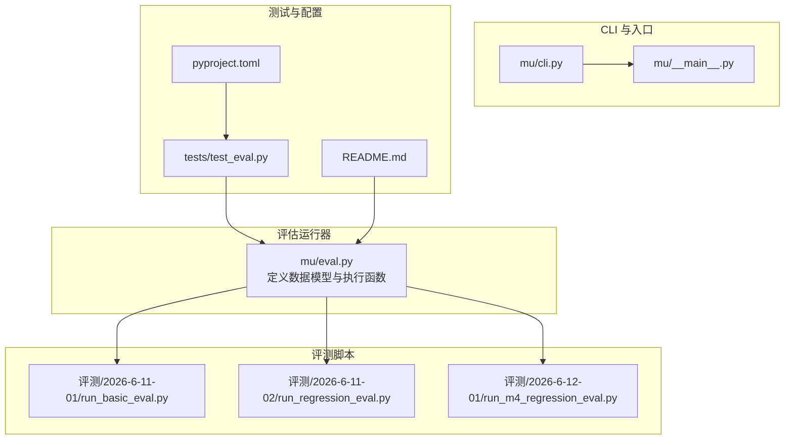
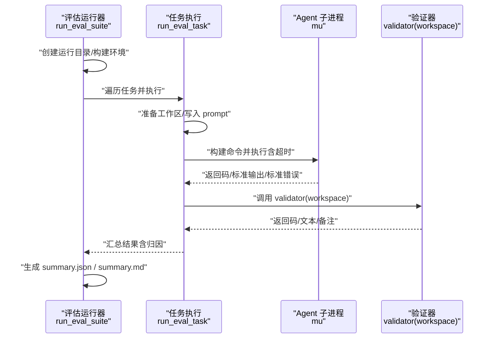
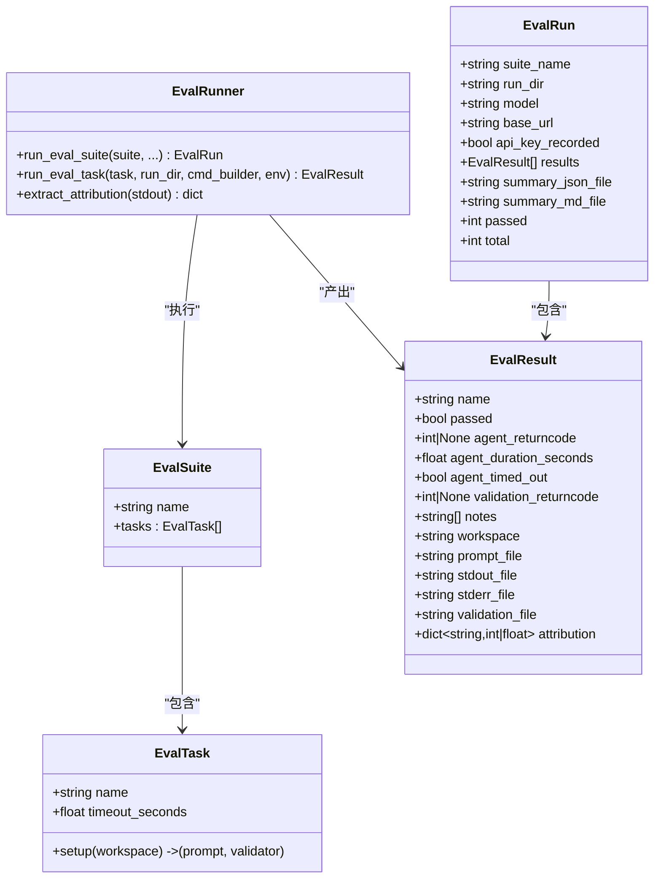
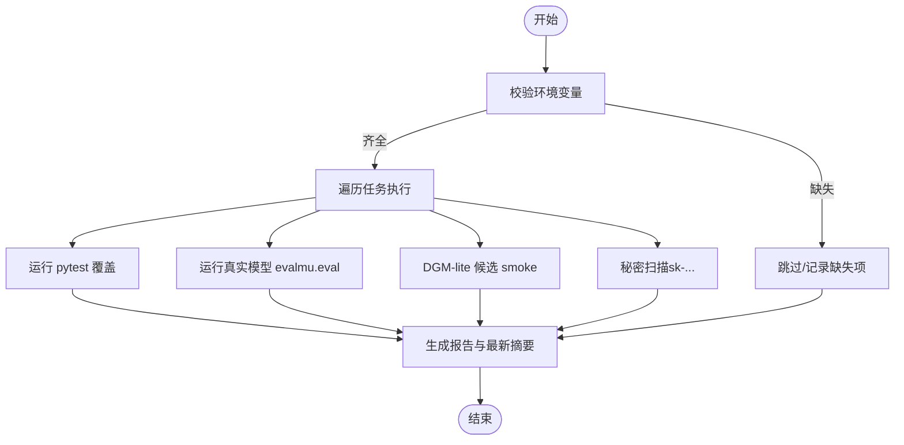
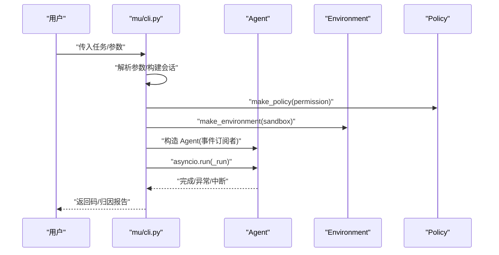
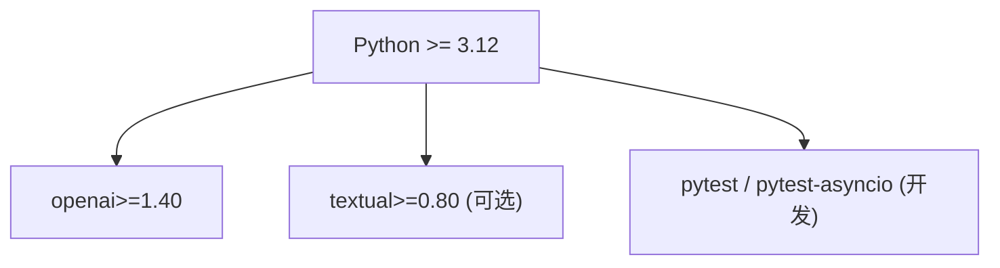

# 评估与测试

<cite>
**本文引用的文件**
- [mu/eval.py](file://mu/eval.py)
- [tests/test_eval.py](file://tests/test_eval.py)
- [评测/2026-6-11-01/run_basic_eval.py](file://评测/2026-6-11-01/run_basic_eval.py)
- [评测/2026-6-11-02/run_regression_eval.py](file://评测/2026-6-11-02/run_regression_eval.py)
- [评测/2026-6-12-01/run_m4_regression_eval.py](file://评测/2026-6-12-01/run_m4_regression_eval.py)
- [mu/cli.py](file://mu/cli.py)
- [mu/__main__.py](file://mu/__main__.py)
- [pyproject.toml](file://pyproject.toml)
- [README.md](file://README.md)
- [tests/conftest.py](file://tests/conftest.py)
</cite>

## 目录
1. [引言](#引言)
2. [项目结构](#项目结构)
3. [核心组件](#核心组件)
4. [架构总览](#架构总览)
5. [详细组件分析](#详细组件分析)
6. [依赖分析](#依赖分析)
7. [性能考虑](#性能考虑)
8. [故障排查指南](#故障排查指南)
9. [结论](#结论)
10. [附录](#附录)

## 引言
本文件面向 μ (mu) 评估与测试系统，系统性阐述测试框架的架构、回归测试执行流程、评估指标与结果分析方法，并提供评估套件的使用指南（任务配置、超时设置、结果解读）、测试环境搭建与依赖管理、实际测试示例与调试技巧、统计分析与性能基准建议，以及测试覆盖率与质量保证最佳实践。内容既适合开发者深入理解代码实现，也便于非技术读者快速上手。

## 项目结构
- 评估运行器与套件定义位于 mu/eval.py，提供 EvalSuite/EvalTask/EvalResult/EvalRun 数据模型与 run_eval_suite/run_eval_task 执行函数，支持命令行入口与库内调用。
- 评测脚本位于 评测/ 年-月-日 目录中，包含基础评测 run_basic_eval.py、回归评测 run_regression_eval.py、M4 完整回归 run_m4_regression_eval.py。
- CLI 入口位于 mu/cli.py 与 mu/__main__.py，负责解析参数、装配事件渲染器与可观测归因收集器、构建会话与环境，驱动 Agent 执行任务。
- 测试与开发依赖在 pyproject.toml 中声明，测试入口在 tests/，其中 tests/test_eval.py 验证评估运行器的关键行为。
- README.md 提供安装、配置与运行说明，涵盖 eval 子系统与 DGM-lite 候选验证的基本用法。

图表来源
- [mu/eval.py:163-211](file://mu/eval.py#L163-L211)
- [评测/2026-6-11-01/run_basic_eval.py:36-67](file://评测/2026-6-11-01/run_basic_eval.py#L36-L67)
- [评测/2026-6-11-02/run_regression_eval.py:12-22](file://评测/2026-6-11-02/run_regression_eval.py#L12-L22)
- [评测/2026-6-12-01/run_m4_regression_eval.py:282-288](file://评测/2026-6-12-01/run_m4_regression_eval.py#L282-L288)
- [mu/cli.py:51-83](file://mu/cli.py#L51-L83)
- [mu/__main__.py:1-5](file://mu/__main__.py#L1-L5)
- [tests/test_eval.py:46-78](file://tests/test_eval.py#L46-L78)
- [pyproject.toml:29-32](file://pyproject.toml#L29-L32)
- [README.md:100-115](file://README.md#L100-L115)

章节来源
- [README.md:100-115](file://README.md#L100-L115)
- [pyproject.toml:29-32](file://pyproject.toml#L29-L32)

## 核心组件
- 评估套件与任务
  - EvalSuite：包含名称与任务列表。
  - EvalTask：包含任务名、setup 函数（返回 prompt 与 validator）、超时秒数。
- 评估运行与结果
  - EvalRun：包含套件名、运行目录、模型信息、结果列表与摘要文件路径。
  - EvalResult：包含任务名、是否通过、Agent 与验证返回码、耗时、是否超时、备注、文件路径与归因指标。
- 执行器
  - run_eval_suite：创建运行目录、构建 Agent 环境、选择任务、执行并生成摘要。
  - run_eval_task：为单任务准备工作区、写入 prompt、构建命令、执行子进程、捕获输出、调用 validator、汇总结果。
- 默认套件与任务
  - basic_coding_suite：内置 create_pytest_project、fix_existing_bug、implement_slugify 三个任务，每个任务均提供 setup 与 validator。
- CLI 与命令行入口
  - mu/cli.py：解析参数、装配事件渲染器与归因收集器、构建会话与环境、运行 Agent。
  - mu/__main__.py：将 CLI 主函数暴露为模块入口。

章节来源
- [mu/eval.py:32-80](file://mu/eval.py#L32-L80)
- [mu/eval.py:163-211](file://mu/eval.py#L163-L211)
- [mu/eval.py:213-284](file://mu/eval.py#L213-L284)
- [mu/eval.py:370-501](file://mu/eval.py#L370-L501)
- [mu/cli.py:26-39](file://mu/cli.py#L26-L39)
- [mu/cli.py:51-83](file://mu/cli.py#L51-L83)
- [mu/__main__.py:1-5](file://mu/__main__.py#L1-L5)

## 架构总览
评估系统由“套件-任务-执行器-验证器”构成，Agent 作为外部进程被评估器调用，验证器决定最终通过与否。CLI 负责将用户任务传递给 Agent 并输出归因报告。

图表来源
- [mu/eval.py:163-211](file://mu/eval.py#L163-L211)
- [mu/eval.py:213-284](file://mu/eval.py#L213-L284)
- [mu/cli.py:51-83](file://mu/cli.py#L51-L83)

## 详细组件分析

### 评估运行器与套件（mu/eval.py）
- 数据模型
  - EvalTask：任务名、setup、超时秒数。
  - EvalResult：通过标志、返回码、耗时、超时标志、验证返回码、备注、文件路径、归因指标。
  - EvalRun：套件名、运行目录、模型与 base_url、结果列表、摘要文件路径。
- 执行流程
  - run_eval_suite：选择任务、构建 Agent 环境（含 PYTHONPATH、扩展与提示词目录、敏感变量脱敏）、校验模型环境变量、执行任务并生成摘要。
  - run_eval_task：准备工作区、写入 prompt、构建命令、执行子进程、捕获输出、调用 validator、汇总结果并提取归因。
- 归因提取
  - extract_attribution：从 stdout 中解析轮数、总耗时、LLM/工具耗时、prompt/completion/total tokens 等指标。
- 默认套件
  - basic_coding_suite：包含三个典型任务，每个任务提供 setup 与 validator，validator 通过运行 pytest 验证结果。

图表来源
- [mu/eval.py:32-80](file://mu/eval.py#L32-L80)
- [mu/eval.py:163-211](file://mu/eval.py#L163-L211)
- [mu/eval.py:213-284](file://mu/eval.py#L213-L284)
- [mu/eval.py:287-306](file://mu/eval.py#L287-L306)

章节来源
- [mu/eval.py:32-80](file://mu/eval.py#L32-L80)
- [mu/eval.py:163-211](file://mu/eval.py#L163-L211)
- [mu/eval.py:213-284](file://mu/eval.py#L213-L284)
- [mu/eval.py:287-306](file://mu/eval.py#L287-L306)
- [mu/eval.py:370-501](file://mu/eval.py#L370-L501)

### 评测脚本（基础/回归/M4）
- 基础评测 run_basic_eval.py
  - 校验环境变量、创建运行目录、遍历任务、执行 Agent、调用 validator、写入 summary。
- 回归评测 run_regression_eval.py
  - 通过 runpy.run_path 复用基础评测逻辑，替换运行根目录与常量，实现“旧脚本新目录”的回归执行。
- M4 完整回归 run_m4_regression_eval.py
  - 组合 pytest 覆盖、真实模型 eval（通过 mu.eval）、DGM-lite 候选 smoke、秘密扫描，统一生成报告与最新摘要。

图表来源
- [评测/2026-6-11-01/run_basic_eval.py:36-67](file://评测/2026-6-11-01/run_basic_eval.py#L36-L67)
- [评测/2026-6-11-02/run_regression_eval.py:12-22](file://评测/2026-6-11-02/run_regression_eval.py#L12-L22)
- [评测/2026-6-12-01/run_m4_regression_eval.py:282-288](file://评测/2026-6-12-01/run_m4_regression_eval.py#L282-L288)

章节来源
- [评测/2026-6-11-01/run_basic_eval.py:36-67](file://评测/2026-6-11-01/run_basic_eval.py#L36-L67)
- [评测/2026-6-11-02/run_regression_eval.py:12-22](file://评测/2026-6-11-02/run_regression_eval.py#L12-L22)
- [评测/2026-6-12-01/run_m4_regression_eval.py:282-288](file://评测/2026-6-12-01/run_m4_regression_eval.py#L282-L288)

### CLI 与 Agent 执行（mu/cli.py）
- 参数解析：支持任务描述、续跑/分支、流式输出、TUI、code-action、权限策略、沙箱 provider。
- 事件与可观测：StdoutRenderer 输出人类可读内容，AttributionCollector 收集归因指标。
- 会话与环境：构建 Session，根据 sandbox 选择 Environment，根据 permission 选择 Policy。
- 异步运行：_run 将 Agent.run 包裹在 asyncio.run 中，确保资源清理。

图表来源
- [mu/cli.py:26-39](file://mu/cli.py#L26-L39)
- [mu/cli.py:51-83](file://mu/cli.py#L51-L83)
- [mu/cli.py:115-130](file://mu/cli.py#L115-L130)

章节来源
- [mu/cli.py:26-39](file://mu/cli.py#L26-L39)
- [mu/cli.py:51-83](file://mu/cli.py#L51-L83)
- [mu/cli.py:115-130](file://mu/cli.py#L115-L130)

### 测试用例（tests/test_eval.py）
- 覆盖要点
  - 秘密脱敏：验证 stdout/summary 中 API key 被脱敏。
  - 归因提取：验证从 stdout 解析出轮数与 token 指标。
  - 验证器失败：验证器返回失败或备注导致整体失败。
  - 超时处理：超时应标记 agent_timed_out 并返回 None 退出码。
  - 模型环境校验：缺少 MU_MODEL 或 MU_API_KEY/OPENAI_API_KEY 时抛出配置错误。

章节来源
- [tests/test_eval.py:46-78](file://tests/test_eval.py#L46-L78)
- [tests/test_eval.py:80-94](file://tests/test_eval.py#L80-L94)
- [tests/test_eval.py:96-113](file://tests/test_eval.py#L96-L113)
- [tests/test_eval.py:115-125](file://tests/test_eval.py#L115-L125)
- [tests/test_eval.py:127-129](file://tests/test_eval.py#L127-L129)

## 依赖分析
- 语言与运行时
  - Python >= 3.12，使用 asyncio、subprocess、argparse、dataclasses 等标准库。
- 第三方依赖
  - openai>=1.40（核心依赖）。
  - 可选依赖：textual>=0.80（TUI）、pytest>=8、pytest-asyncio>=0.23（开发）。
- 测试入口与模式
  - pyproject.toml 指定 testpaths 与 asyncio_mode=auto，pytest 自动发现 tests/ 下的测试。

图表来源
- [pyproject.toml:10-21](file://pyproject.toml#L10-L21)
- [pyproject.toml:29-32](file://pyproject.toml#L29-L32)

章节来源
- [pyproject.toml:10-21](file://pyproject.toml#L10-L21)
- [pyproject.toml:29-32](file://pyproject.toml#L29-L32)

## 性能考虑
- 超时控制
  - 每任务超时由 EvalTask.timeout_seconds 控制；run_eval_task 使用 subprocess.run(timeout=...) 保护长耗时任务。
- I/O 与磁盘
  - 评估运行器将 stdout/stderr/prompt/validation 写入工作区，建议在 CI 中限制运行目录大小与保留周期。
- 归因指标
  - 通过 extract_attribution 解析轮数、总耗时、LLM/工具耗时、token 消耗，可用于性能基线与回归对比。
- 并发与吞吐
  - 当前实现串行执行任务；如需提升吞吐，可在任务间引入轻量并发（注意工作区隔离与资源竞争）。

章节来源
- [mu/eval.py:36-37](file://mu/eval.py#L36-L37)
- [mu/eval.py:240-241](file://mu/eval.py#L240-L241)
- [mu/eval.py:287-306](file://mu/eval.py#L287-L306)

## 故障排查指南
- 环境变量缺失
  - 缺少 MU_MODEL 或 MU_API_KEY/OPENAI_API_KEY 会导致配置错误；检查 README 的配置说明与 .env 加载方式。
- 超时与中断
  - 若 agent_timed_out 为真且返回码为 None，检查任务复杂度与超时设置；必要时增大 --timeout。
- 验证失败
  - 若 validation_returncode 非 0 或 notes 包含错误，查看对应任务的工作区与 validation.txt 输出。
- 秘密泄露风险
  - 评估运行器会对输出进行脱敏；若发现未脱敏内容，检查 redact_secrets 逻辑与 extra_env。
- TUI 依赖
  - 启用 --tui 需安装 textual；否则会提示安装依赖。

章节来源
- [mu/eval.py:183-187](file://mu/eval.py#L183-L187)
- [mu/eval.py:245-249](file://mu/eval.py#L245-L249)
- [mu/eval.py:257-263](file://mu/eval.py#L257-L263)
- [mu/eval.py:105-115](file://mu/eval.py#L105-L115)
- [mu/cli.py:100-103](file://mu/cli.py#L100-L103)
- [README.md:20-41](file://README.md#L20-L41)

## 结论
μ 评估与测试系统以“套件-任务-执行器-验证器”为核心，结合 CLI 的事件与归因能力，形成可重复、可审计、可扩展的评测闭环。通过基础评测、回归评测与 M4 完整回归，能够覆盖从功能正确性到候选验证与安全扫描的多维质量保障。建议在持续集成中固定超时、保留关键日志与归因指标，并对秘密信息进行自动化扫描，以维持评测的稳定性与安全性。

## 附录

### 评估套件使用指南
- 基本运行
  - 使用 python -m mu.eval 启动内置 basic-coding 套件；可通过 --task 指定任务名，--timeout 设置每任务超时秒数，--permission/--sandbox/--code 传递给 Agent。
- 回归评测
  - 使用 评测/2026-6-11-02/run_regression_eval.py 复用旧脚本逻辑，切换运行根目录与常量，实现历史结果的回归比对。
- M4 完整回归
  - 使用 评测/2026-6-12-01/run_m4_regression_eval.py 组合 pytest 覆盖、真实模型 eval、DGM-lite 候选 smoke 与秘密扫描，统一生成报告。

章节来源
- [README.md:100-115](file://README.md#L100-L115)
- [评测/2026-6-11-02/run_regression_eval.py:12-22](file://评测/2026-6-11-02/run_regression_eval.py#L12-L22)
- [评测/2026-6-12-01/run_m4_regression_eval.py:75-102](file://评测/2026-6-12-01/run_m4_regression_eval.py#L75-L102)

### 任务配置与验证器设计原则
- 任务职责单一：每个 EvalTask 的 setup 应明确写出 prompt 与 validator。
- 验证器幂等：validator 必须可重复执行且不依赖外部状态；如需外部工具（如 pytest），应在任务工作区内就地准备。
- 失败信息清晰：validator 返回 notes，用于在 summary 中呈现失败原因。
- 超时合理：根据任务复杂度设置 timeout_seconds，避免误判。

章节来源
- [mu/eval.py:32-37](file://mu/eval.py#L32-L37)
- [mu/eval.py:381-401](file://mu/eval.py#L381-L401)
- [mu/eval.py:404-451](file://mu/eval.py#L404-L451)
- [mu/eval.py:454-500](file://mu/eval.py#L454-L500)

### 结果解读与统计分析
- 通过率：EvalRun.passed / EvalRun.total。
- 任务级指标：agent_returncode、agent_duration_seconds、agent_timed_out、validation_returncode、notes。
- 归因指标：轮数、总耗时、LLM/工具耗时、prompt/completion/total tokens。
- 报告文件：summary.json（机器可读）与 summary.md（人类可读），包含过程文件路径以便溯源。

章节来源
- [mu/eval.py:73-80](file://mu/eval.py#L73-L80)
- [mu/eval.py:308-367](file://mu/eval.py#L308-L367)
- [mu/eval.py:287-306](file://mu/eval.py#L287-L306)

### 测试环境搭建与依赖管理
- 安装
  - 使用仓库自带 .venv 安装开发依赖：pip install -e ".[dev]"（含 pytest/pytest-asyncio）。
  - 如需 TUI：pip install -e ".[tui,dev]"。
- 配置
  - 设置 MU_BASE_URL、MU_MODEL、MU_API_KEY（或 OPENAI_API_KEY）；README 提供多种提供商示例。
- 运行
  - pytest -q 运行单元测试；python -m mu.eval 执行评估套件。

章节来源
- [README.md:13-18](file://README.md#L13-L18)
- [README.md:20-41](file://README.md#L20-L41)
- [README.md:116-120](file://README.md#L116-L120)
- [pyproject.toml:14-21](file://pyproject.toml#L14-L21)

### 实际测试示例与调试技巧
- 示例
  - 基础评测：评测/2026-6-11-01/run_basic_eval.py 展示了从 prompt 到 validator 的完整链路。
  - 回归评测：评测/2026-6-11-02/run_regression_eval.py 通过 runpy 复用旧脚本，便于历史对比。
  - M4 完整回归：评测/2026-6-12-01/run_m4_regression_eval.py 展示了多维度评测与报告生成。
- 调试技巧
  - 查看工作区与过程文件：summary.md 中列出每个任务的 workspace、prompt、stdout、stderr、validation 路径。
  - 调整超时：针对复杂任务增加 --timeout。
  - 检查归因：关注 stdout 中的轮数与 token 指标，定位高开销环节。
  - 脱敏验证：确认敏感信息已被 redact_secrets 替换。

章节来源
- [评测/2026-6-11-01/run_basic_eval.py:36-67](file://评测/2026-6-11-01/run_basic_eval.py#L36-L67)
- [评测/2026-6-11-02/run_regression_eval.py:12-22](file://评测/2026-6-11-02/run_regression_eval.py#L12-L22)
- [评测/2026-6-12-01/run_m4_regression_eval.py:282-288](file://评测/2026-6-12-01/run_m4_regression_eval.py#L282-L288)
- [mu/eval.py:308-367](file://mu/eval.py#L308-L367)
- [mu/eval.py:105-115](file://mu/eval.py#L105-L115)

### 测试覆盖率与质量保证最佳实践
- 覆盖率
  - 使用 pytest 与 pytest-asyncio（pyproject.toml 已配置）；建议为关键模块（如 eval、agent、tools、dgm）补充单元测试。
- 质量保证
  - 回归测试：通过 run_regression_eval.py 与 run_m4_regression_eval.py 保持历史结果稳定。
  - 安全扫描：run_m4_regression_eval.py 的 secret_scan 用于检测 sk-... 模式的秘密泄露。
  - 日志与归因：保留 summary.json/md 与工作区文件，便于问题复现与根因分析。
  - 超时与资源：为长任务设置合理超时，避免 CI 资源浪费。

章节来源
- [pyproject.toml:18-21](file://pyproject.toml#L18-L21)
- [评测/2026-6-12-01/run_m4_regression_eval.py:207-220](file://评测/2026-6-12-01/run_m4_regression_eval.py#L207-L220)
- [mu/eval.py:183-187](file://mu/eval.py#L183-L187)