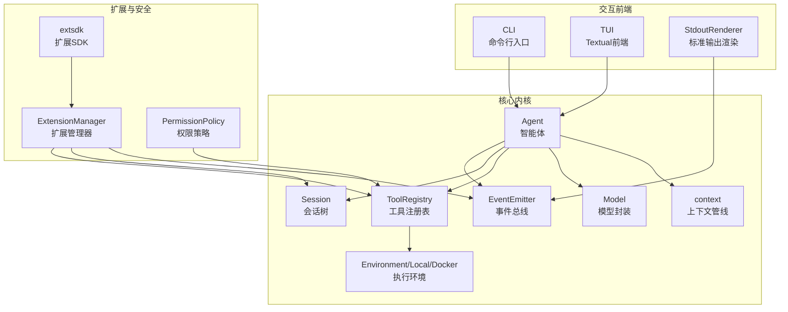
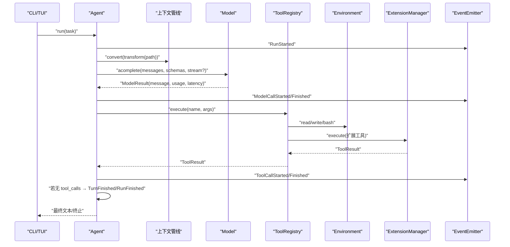
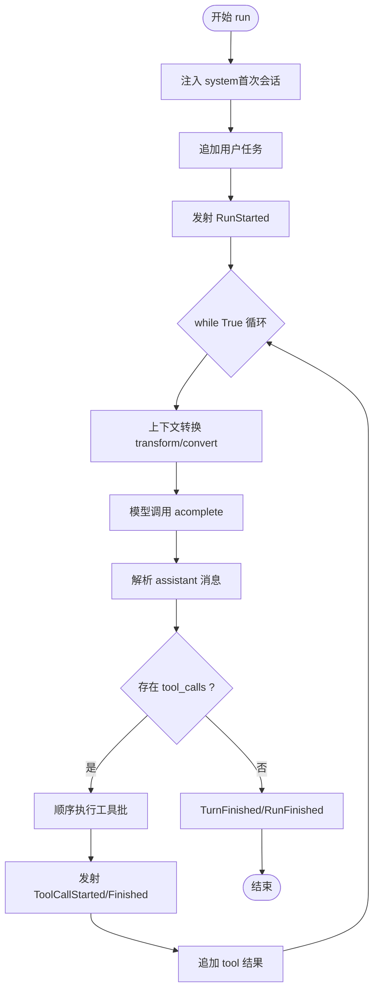
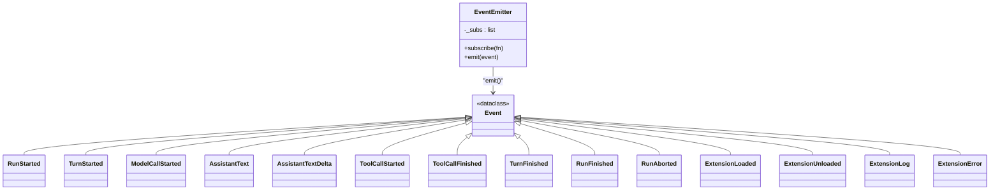
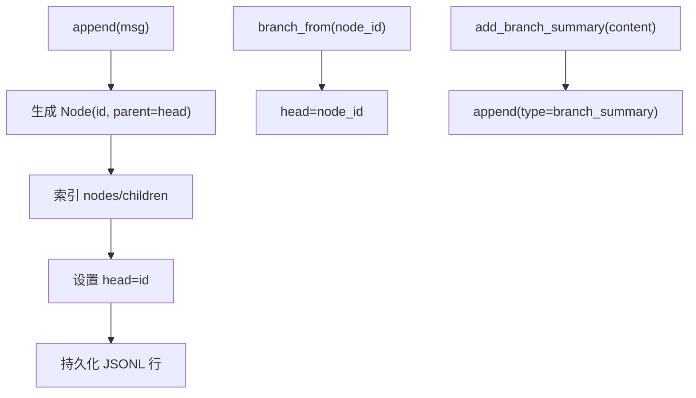
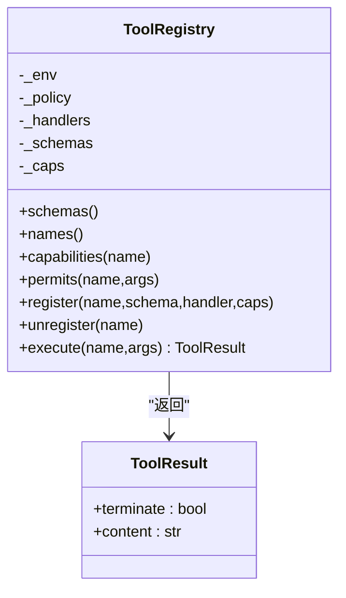
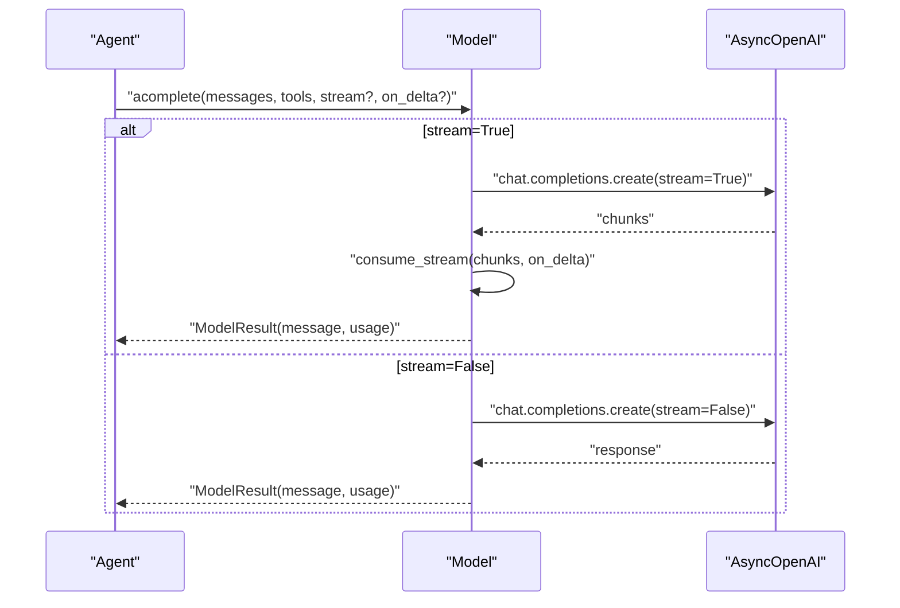
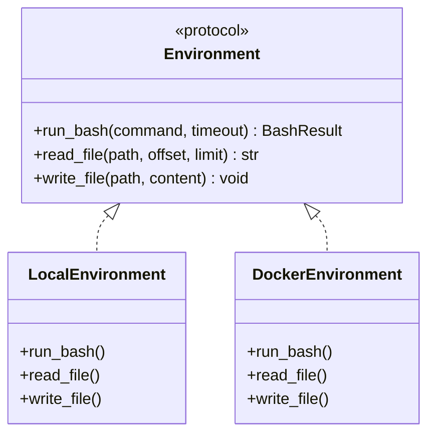
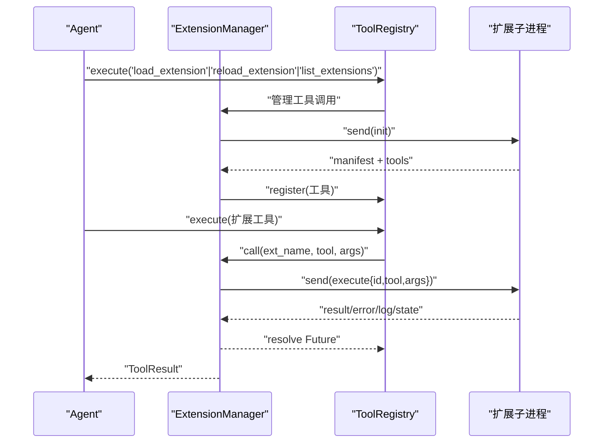
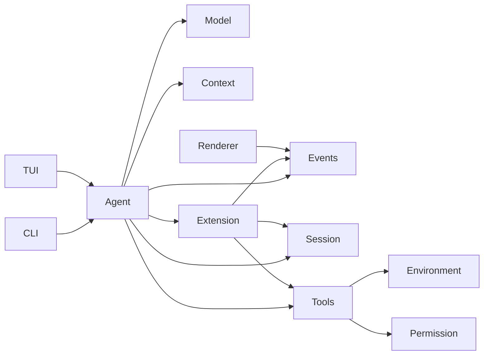

# 技术架构

<cite>
**本文引用的文件**
- [mu/__init__.py](file://mu/__init__.py)
- [mu/agent.py](file://mu/agent.py)
- [mu/events.py](file://mu/events.py)
- [mu/session.py](file://mu/session.py)
- [mu/tools.py](file://mu/tools.py)
- [mu/model.py](file://mu/model.py)
- [mu/environment.py](file://mu/environment.py)
- [mu/context.py](file://mu/context.py)
- [mu/extension.py](file://mu/extension.py)
- [mu/extsdk.py](file://mu/extsdk.py)
- [mu/permission.py](file://mu/permission.py)
- [mu/render.py](file://mu/render.py)
- [mu/codeact.py](file://mu/codeact.py)
- [mu/tui.py](file://mu/tui.py)
- [mu/cli.py](file://mu/cli.py)
</cite>

## 目录
1. [引言](#引言)
2. [项目结构](#项目结构)
3. [核心组件](#核心组件)
4. [架构总览](#架构总览)
5. [详细组件分析](#详细组件分析)
6. [依赖分析](#依赖分析)
7. [性能考量](#性能考量)
8. [故障排查指南](#故障排查指南)
9. [结论](#结论)
10. [附录](#附录)

## 引言
本文件面向架构师与高级开发者，系统化解析 μ (mu) 极简智能体项目的整体技术架构。项目采用事件驱动与模块化设计，围绕“智能体-事件系统-会话管理-工具系统”构建闭环，辅以插件扩展机制与权限策略，形成可观察、可观测、可演进的异步编程范式。本文深入剖析核心组件交互关系、数据与控制流、异步模式应用与性能权衡，并提供可视化图示与实践建议。

## 项目结构
项目采用按职责分层的模块化组织方式：
- 核心内核：agent、model、events、session、tools、context、environment
- 交互前端：cli、tui、render
- 扩展体系：extension、extsdk、permission
- 包导出：__init__.py 汇总对外接口

图表来源
- [mu/agent.py:43-223](file://mu/agent.py#L43-L223)
- [mu/events.py:121-133](file://mu/events.py#L121-L133)
- [mu/session.py:38-115](file://mu/session.py#L38-L115)
- [mu/tools.py:191-269](file://mu/tools.py#L191-L269)
- [mu/model.py:91-147](file://mu/model.py#L91-L147)
- [mu/context.py:15-31](file://mu/context.py#L15-L31)
- [mu/environment.py:23-150](file://mu/environment.py#L23-L150)
- [mu/extension.py:85-364](file://mu/extension.py#L85-L364)
- [mu/extsdk.py:34-130](file://mu/extsdk.py#L34-L130)
- [mu/permission.py:29-69](file://mu/permission.py#L29-L69)
- [mu/cli.py:51-134](file://mu/cli.py#L51-L134)
- [mu/tui.py:122-203](file://mu/tui.py#L122-L203)
- [mu/render.py:31-78](file://mu/render.py#L31-L78)

章节来源
- [mu/__init__.py:1-33](file://mu/__init__.py#L1-L33)
- [mu/cli.py:51-134](file://mu/cli.py#L51-L134)
- [mu/tui.py:122-203](file://mu/tui.py#L122-L203)

## 核心组件
- 智能体 Agent：负责主循环、上下文转换、模型调用、工具执行与事件发射，维持“无最大步数”的朴素 while 循环，以“无工具调用”自然终止。
- 事件系统 EventEmitter：同步订阅分发，承载 Run/Turn/Model/Tool/Extension 等结构化事件，支撑多订阅者（渲染、可观测、TUI）。
- 会话 Session：树形消息存储与分支，支持 JSONL 持久化、从任意节点分叉、路径回溯与侧分支摘要注入。
- 工具系统 ToolRegistry：内置四工具（读/写/编辑/Shell），支持动态注册扩展工具，统一返回 ToolResult，具备能力门控与权限策略。
- 模型 Model：OpenAI 兼容异步封装，支持流式累积与非流式调用，返回包含用量与延迟的结果对象。
- 执行环境 Environment：本地/容器执行抽象，提供 bash、文件读写能力，支持超时与进程组清理。
- 权限策略 PermissionPolicy：基于能力集的细粒度门控，支持只读、工作区受限与宽松策略。
- 扩展系统 ExtensionManager：长驻子进程扩展加载/调用/重载/卸载，JSONL 协议通信，注册工具并广播事件。
- 前端渲染 StdoutRenderer 与 TUI：事件驱动的文本输出与富文本 UI，支持流式增量展示与状态统计。

章节来源
- [mu/agent.py:43-223](file://mu/agent.py#L43-L223)
- [mu/events.py:121-133](file://mu/events.py#L121-L133)
- [mu/session.py:38-115](file://mu/session.py#L38-L115)
- [mu/tools.py:191-269](file://mu/tools.py#L191-L269)
- [mu/model.py:91-147](file://mu/model.py#L91-L147)
- [mu/environment.py:23-150](file://mu/environment.py#L23-L150)
- [mu/permission.py:29-69](file://mu/permission.py#L29-L69)
- [mu/extension.py:85-364](file://mu/extension.py#L85-L364)
- [mu/extsdk.py:34-130](file://mu/extsdk.py#L34-L130)
- [mu/render.py:31-78](file://mu/render.py#L31-L78)
- [mu/tui.py:122-203](file://mu/tui.py#L122-L203)

## 架构总览
μ 的架构遵循事件驱动与模块化原则，Agent 为核心控制中枢，通过事件总线串联各模块，形成“输入任务 → 上下文转换 → 模型推理 → 工具调用 → 事件渲染/观测 → 会话持久化”的闭环。异步模式贯穿模型调用、工具执行与扩展 IPC，提升吞吐与响应性。

图表来源
- [mu/agent.py:82-133](file://mu/agent.py#L82-L133)
- [mu/model.py:112-147](file://mu/model.py#L112-L147)
- [mu/tools.py:253-269](file://mu/tools.py#L253-L269)
- [mu/environment.py:26-88](file://mu/environment.py#L26-L88)
- [mu/extension.py:251-266](file://mu/extension.py#L251-L266)
- [mu/events.py:19-84](file://mu/events.py#L19-L84)

## 详细组件分析

### Agent 智能体
- 控制流：初始化 → 注入 system → 追加用户任务 → 事件 RunStarted → 循环（上下文转换 → 模型调用 → 工具批执行 → 事件 TurnFinished → 若无工具调用则 RunFinished）。
- 异步取消：捕获 CancelledError，发射 RunAborted 并向上抛出，确保会话落盘与状态一致。
- 代码行动：可选 native code-action，将多轮工具调用压缩为单轮执行，降低 token 与延迟成本。
- 分支摘要：支持将侧分支结论注入主线上下文，实现 Pi 风格的 side-quest 回主线。

图表来源
- [mu/agent.py:82-133](file://mu/agent.py#L82-L133)
- [mu/agent.py:134-163](file://mu/agent.py#L134-L163)

章节来源
- [mu/agent.py:43-223](file://mu/agent.py#L43-L223)

### 事件系统 EventEmitter 与事件模型
- 事件类型：RunStarted/TurnStarted/ModelCallStarted/AssistantText/AssistantTextDelta/ToolCallStarted/ToolCallFinished/TurnFinished/RunFinished/RunAborted/Error/Extension* 等。
- 订阅分发：同步遍历订阅者列表，避免引入外部 pub/sub 框架，降低耦合与复杂度。
- 多订阅者：StdoutRenderer、TUI 渲染器、AttributionCollector 等各自消费事件，互不影响。

图表来源
- [mu/events.py:13-133](file://mu/events.py#L13-L133)

章节来源
- [mu/events.py:121-133](file://mu/events.py#L121-L133)

### 会话管理 Session（树形与分支）
- 数据结构：Node(id, parent_id, ts, msg)，nodes 与 children 映射，head 指向当前叶子。
- 持久化：JSONL 追加写入，键包含 id/parent_id/ts/msg，支持从任意节点分叉与回溯。
- 分支摘要：在主线 head 追加 type=branch_summary 的自定义消息，经 convert_to_llm 注入为 user 角色内容。
- 加载恢复：按文件逐行解析，重建索引与 head。

图表来源
- [mu/session.py:49-98](file://mu/session.py#L49-L98)
- [mu/session.py:99-115](file://mu/session.py#L99-L115)

章节来源
- [mu/session.py:38-115](file://mu/session.py#L38-L115)

### 工具系统 ToolRegistry 与内置工具
- 统一签名：RegisteredHandler 接收 dict 参数，返回 ToolResult 或 str；内置工具通过 functools.partial 绑定 LocalEnvironment。
- 能力门控：每个工具映射能力集合（read/write/shell/code_exec/extension_exec），策略按能力判断。
- 动态注册：扩展工具通过 ExtensionManager 注册，冲突检测与回滚；内置工具不可注销。
- 内置四工具：read、write、edit、bash，错误统一转为字符串返回，保持模型自纠错。

图表来源
- [mu/tools.py:191-269](file://mu/tools.py#L191-L269)

章节来源
- [mu/tools.py:19-269](file://mu/tools.py#L19-L269)

### 模型 Model 与流式累积
- 封装 AsyncOpenAI：支持流式与非流式两种模式，返回 ModelResult（message/usage/latency）。
- 流式累积：consume_stream 聚合 content 增量与 tool_calls 增量，逐块回调 on_delta。
- 配置校验：MU_MODEL/MU_API_KEY 缺失抛出 ConfigError。

图表来源
- [mu/model.py:112-147](file://mu/model.py#L112-L147)
- [mu/model.py:52-89](file://mu/model.py#L52-L89)

章节来源
- [mu/model.py:91-147](file://mu/model.py#L91-L147)

### 执行环境 Environment 与沙箱抽象
- LocalEnvironment：文件读写与 bash 子进程执行，超时按进程组清理，避免孤儿进程。
- DockerEnvironment：将 bash 放入容器（网络隔离+进程隔离），文件 IO 仍委托宿主（最小实现）。
- Environment 协议：可插拔替换，支持未来接入 E2B/Modal 等。

图表来源
- [mu/environment.py:91-150](file://mu/environment.py#L91-L150)

章节来源
- [mu/environment.py:23-150](file://mu/environment.py#L23-L150)

### 权限策略 PermissionPolicy
- 能力常量：WRITE/SHELL/CODE_EXEC/EXTENSION_EXEC
- 策略实现：
  - allow_all：默认宽松
  - read_only：阻断写/Shell/Code/扩展执行
  - workspace：限制写入范围，阻断不可受限能力
- 门控位置：ToolRegistry.execute 中按能力与参数进行判定。

章节来源
- [mu/permission.py:29-69](file://mu/permission.py#L29-L69)

### 扩展系统 ExtensionManager 与扩展 SDK
- 生命周期：load → 读取 manifest → 注册工具 → 启动 reader 任务 → init（恢复状态）→ 运行中。
- IPC 协议：JSONL（stdin/stdout），支持 execute/shutdown/init/log/state/error。
- 调用机制：call 生成请求 id，等待 Future 完成，超时/异常统一返回 ToolResult 错误。
- 协同：事件广播扩展加载/卸载/日志/错误；状态持久化为 ext_state 自定义消息。

图表来源
- [mu/extension.py:131-248](file://mu/extension.py#L131-L248)
- [mu/extension.py:251-272](file://mu/extension.py#L251-L272)
- [mu/extension.py:275-317](file://mu/extension.py#L275-L317)
- [mu/extsdk.py:111-130](file://mu/extsdk.py#L111-L130)

章节来源
- [mu/extension.py:85-364](file://mu/extension.py#L85-L364)
- [mu/extsdk.py:34-130](file://mu/extsdk.py#L34-L130)

### 代码行动 CodeAction（进程内执行）
- 目标：将多轮工具调用压缩为一次模型往返，通过 Python 代码组合工具与共享状态。
- 实现：worker 线程执行模型代码，_MuApi 将同步调用 marshal 回事件循环，经 ToolRegistry.execute 过权限策略与事件发射。
- 风险：隔离≠安全，建议容器化运行。

章节来源
- [mu/codeact.py:84-133](file://mu/codeact.py#L84-L133)

### 前端与可观测性
- CLI：解析参数 → 组装 EventEmitter（StdoutRenderer + AttributionCollector）→ 创建 Agent → 运行 → 清理扩展。
- TUI：Textual 应用，事件订阅者渲染到 RichLog/Static，支持取消运行、状态统计。
- 渲染：StdoutRenderer 支持流式增量输出；TUIRenderer 统计 turns、LLM 时间、工具时间与 token 数。

章节来源
- [mu/cli.py:51-134](file://mu/cli.py#L51-L134)
- [mu/tui.py:122-203](file://mu/tui.py#L122-L203)
- [mu/render.py:31-78](file://mu/render.py#L31-L78)

## 依赖分析
- 组件内聚与耦合：
  - Agent 与 events、session、tools、model、context、extension 高内聚低耦合，通过事件与接口交互。
  - tools 依赖 environment 与 permission，形成清晰边界。
  - extension 与 tools/session/events 协作，IPC 通过 extsdk 协议。
- 外部依赖：
  - openai SDK（异步客户端）
  - textual（TUI 可选）
  - asyncio（异步运行时）

图表来源
- [mu/agent.py:43-76](file://mu/agent.py#L43-L76)
- [mu/tools.py:198-211](file://mu/tools.py#L198-L211)
- [mu/extension.py:85-103](file://mu/extension.py#L85-L103)
- [mu/cli.py:70-72](file://mu/cli.py#L70-L72)
- [mu/tui.py:163-165](file://mu/tui.py#L163-L165)

章节来源
- [mu/agent.py:43-76](file://mu/agent.py#L43-L76)
- [mu/tools.py:198-211](file://mu/tools.py#L198-L211)
- [mu/extension.py:85-103](file://mu/extension.py#L85-L103)
- [mu/cli.py:70-72](file://mu/cli.py#L70-L72)
- [mu/tui.py:163-165](file://mu/tui.py#L163-L165)

## 性能考量
- 异步优先：模型调用、工具执行、扩展 IPC、文件 IO 均采用异步与线程 offload，避免阻塞事件循环。
- 流式输出：开启 stream 时，模型增量文本实时发射事件，减少等待时间，提升感知速度。
- 事件同步分发：EventEmitter 采用同步顺序分发，订阅者仅做轻量工作，避免引入额外开销。
- 会话持久化：JSONL 追加写入，KV-cache 友好，支持断点续跑与分支探索。
- 超时与清理：bash 超时按进程组清理，避免僵尸进程；扩展进程异常退出统一降级，pending 结果及时解挂。
- 代码行动：将多轮工具调用压缩为单轮，显著降低 token 与往返延迟。

## 故障排查指南
- 配置错误（MU_MODEL/MU_API_KEY）：抛出 ConfigError，检查环境变量与 .env 示例。
- 会话错误（resume/branch）：Session.load/branch_from 抛出 FileNotFoundError/KeyError，确认 session_id 与 node_id。
- 工具错误：ToolRegistry.execute 将异常转为 ToolResult 错误字符串，检查参数完整性与权限策略。
- 扩展错误：ExtensionManager 记录 ExtensionError/Log，检查 manifest、工具名冲突与进程退出码。
- 取消与中断：Agent 捕获 CancelledError，发射 RunAborted；CLI 捕获 KeyboardInterrupt，优雅退出。
- TUI 依赖：缺少 textual 时报错提示安装，确认 extras[tui]。

章节来源
- [mu/model.py:19-21](file://mu/model.py#L19-L21)
- [mu/cli.py:66-68](file://mu/cli.py#L66-L68)
- [mu/cli.py:77-82](file://mu/cli.py#L77-L82)
- [mu/extension.py:146-160](file://mu/extension.py#L146-L160)
- [mu/agent.py:130-133](file://mu/agent.py#L130-L133)
- [mu/tui.py:101-103](file://mu/tui.py#L101-L103)

## 结论
μ 架构以事件驱动为核心，结合模块化与插件化设计，在保持 Pi 哲学简洁性的同时，提供了可观测、可扩展与可演进的异步智能体框架。通过清晰的上下文管线、树形会话与工具门控，以及对流式与代码行动的支持，项目在性能与易用性之间取得良好平衡。建议在生产环境中启用容器沙箱与严格权限策略，并利用事件系统扩展更多观测与治理能力。

## 附录
- 关键流程图与类图已在前述章节中给出，读者可据此快速定位源码位置与实现细节。
- 如需进一步了解扩展开发规范与 IPC 协议，可参考扩展 SDK 与扩展管理器的实现。