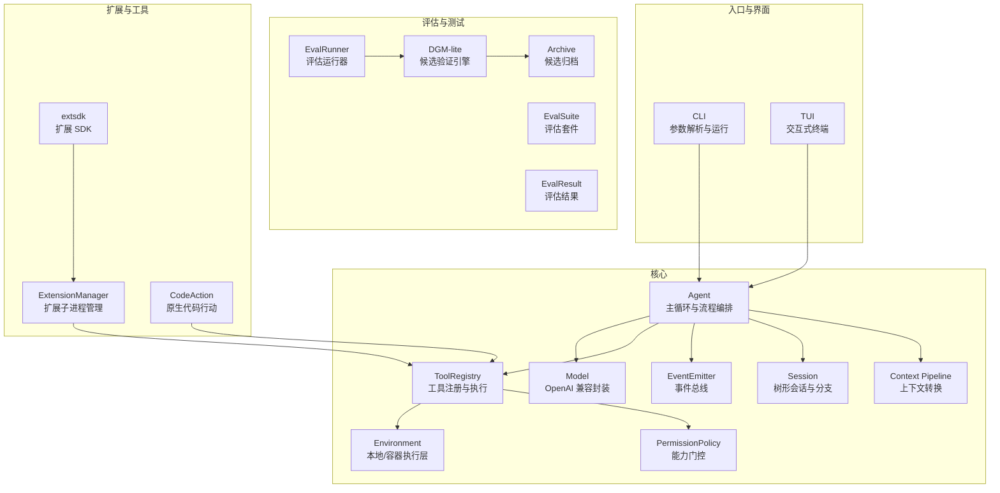
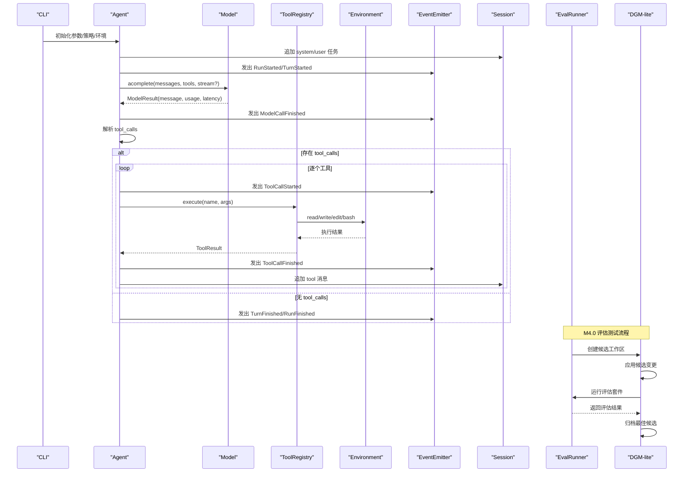
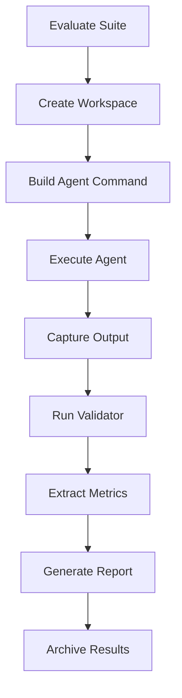
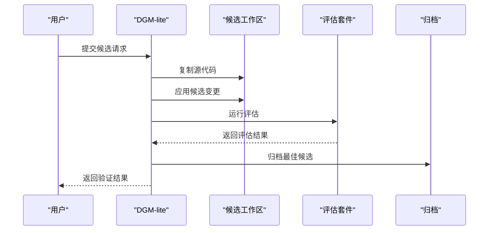
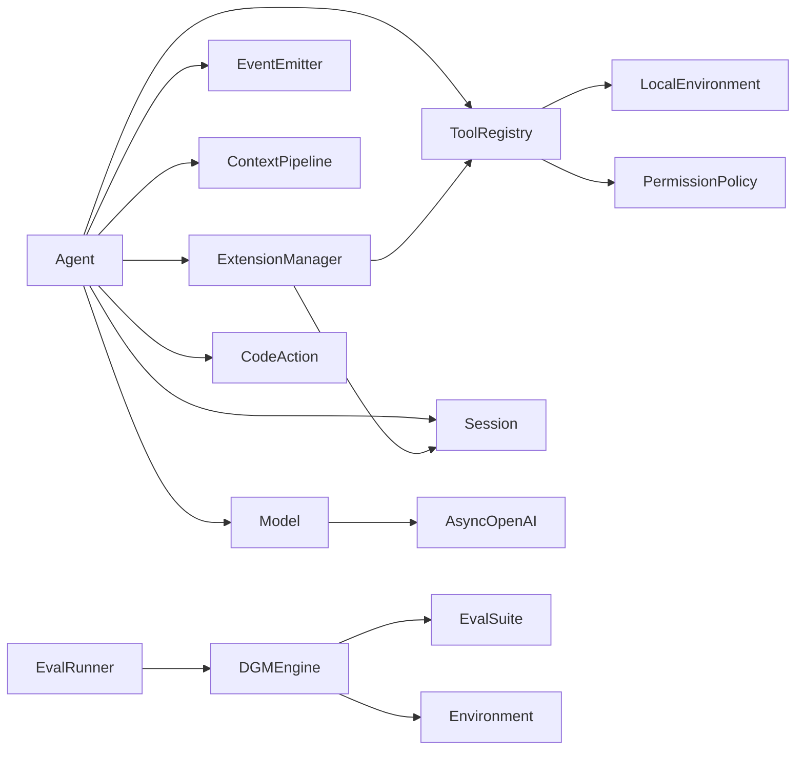

# 核心特性

<cite>
**本文引用的文件列表**
- [README.md](file://README.md)
- [mu/tools.py](file://mu/tools.py)
- [mu/environment.py](file://mu/environment.py)
- [mu/model.py](file://mu/model.py)
- [mu/events.py](file://mu/events.py)
- [mu/session.py](file://mu/session.py)
- [mu/permission.py](file://mu/permission.py)
- [mu/agent.py](file://mu/agent.py)
- [mu/context.py](file://mu/context.py)
- [mu/extsdk.py](file://mu/extsdk.py)
- [mu/extension.py](file://mu/extension.py)
- [mu/codeact.py](file://mu/codeact.py)
- [mu/cli.py](file://mu/cli.py)
- [mu/eval.py](file://mu/eval.py)
- [mu/dgm.py](file://mu/dgm.py)
- [extensions/example_textstats.py](file://extensions/example_textstats.py)
- [temp/M3.5-CodeAction-Sandbox-code-review.md](file://temp/M3.5-CodeAction-Sandbox-code-review.md)
- [plan/M3.5-CodeAction-Sandbox-plan.md](file://plan/M3.5-CodeAction-Sandbox-plan.md)
- [评测/2026-6-12-01/m4-regression-eval-plan.md](file://评测/2026-6-12-01/m4-regression-eval-plan.md)
- [评测/2026-6-12-01/m4-regression-eval-report.md](file://评测/2026-6-12-01/m4-regression-eval-report.md)
- [评测/2026-6-12-01/run_m4_regression_eval.py](file://评测/2026-6-12-01/run_m4_regression_eval.py)
</cite>

## 更新摘要
**所做更改**
- 新增评估与测试子系统章节，涵盖 mu.eval 模块的完整功能
- 新增 DGM-lite 候选隔离验证章节，介绍候选生成、评估和归档机制
- 更新安全沙箱与权限控制章节，反映 M4.0 的安全改进
- 新增扩展开发与部署机制章节，说明扩展管理的最佳实践
- 更新架构图以反映新的评估和验证流程

## 目录
1. [简介](#简介)
2. [项目结构](#项目结构)
3. [核心组件](#核心组件)
4. [架构总览](#架构总览)
5. [详细组件分析](#详细组件分析)
6. [依赖关系分析](#依赖关系分析)
7. [性能考量](#性能考量)
8. [故障排查指南](#故障排查指南)
9. [结论](#结论)
10. [附录](#附录)

## 简介
本文件面向 μ (mu) 极简智能体项目，系统梳理其核心特性与实现要点，重点包括：
- 四个核心工具（read/write/edit/bash）的功能、使用场景与实现原理
- function-calling 机制的工作原理与优势
- OpenAI 兼容模型后端的支持能力与配置方式
- 事件驱动架构、会话管理、权限控制、沙箱隔离等关键特性
- **M4.0 新增**：评估与测试子系统、DGM-lite 候选隔离验证、安全沙箱与权限控制、扩展开发与部署机制
- 为开发者提供全面的功能概览与使用指导

## 项目结构
μ 采用"核心内核 + 可插拔扩展"的模块化组织方式，围绕 Agent-Model-Tools-Events-Session-Permission 等关键模块构建，同时提供 CLI/TUI、扩展 SDK、代码行动（code-action）与 Docker 沙箱等增强能力。**M4.0 版本新增了完整的评估测试框架和 DGM-lite 候选验证机制**。

**图表来源**
- [mu/agent.py:43-223](file://mu/agent.py#L43-L223)
- [mu/model.py:91-147](file://mu/model.py#L91-L147)
- [mu/tools.py:191-269](file://mu/tools.py#L191-L269)
- [mu/events.py:121-133](file://mu/events.py#L121-L133)
- [mu/session.py:38-115](file://mu/session.py#L38-L115)
- [mu/context.py:15-31](file://mu/context.py#L15-L31)
- [mu/permission.py:29-69](file://mu/permission.py#L29-L69)
- [mu/environment.py:23-150](file://mu/environment.py#L23-L150)
- [mu/extension.py:85-364](file://mu/extension.py#L85-L364)
- [mu/codeact.py:84-133](file://mu/codeact.py#L84-L133)
- [mu/extsdk.py:34-130](file://mu/extsdk.py#L34-L130)
- [mu/cli.py:51-134](file://mu/cli.py#L51-L134)
- [mu/eval.py:163-211](file://mu/eval.py#L163-L211)
- [mu/dgm.py:65-135](file://mu/dgm.py#L65-L135)

**章节来源**
- [README.md:1-127](file://README.md#L1-L127)
- [mu/agent.py:1-223](file://mu/agent.py#L1-L223)
- [mu/cli.py:1-134](file://mu/cli.py#L1-L134)

## 核心组件
- 四工具与工具注册中心：统一的工具签名、OpenAI function schema、权限能力门控、错误转字符串的自纠错设计。
- 事件驱动：结构化事件与同步订阅，支持 stdout 渲染、归因统计、扩展日志与错误等多订阅者。
- 会话管理：树形 JSONL 持久化，支持分支、摘要注入、续跑与侧分支结论带回主线。
- 权限控制：基于"能力"（capability）的策略门控，支持 allow/readonly/workspace 三种模式。
- 沙箱隔离：本地与 Docker 两套 Environment provider，Docker 仅对 bash 进行网络隔离，文件工具仍为宿主 IO。
- function-calling：原生 OpenAI tools schema，支持流式增量累积与工具调用事件。
- OpenAI 兼容模型后端：AsyncOpenAI 封装，支持流式与非流式，自动提取 usage 并归因。
- 扩展与代码行动：扩展子进程 JSONL 协议、扩展状态持久化、原生 code-action（进程内 exec，软超时）。
- **M4.0 新增**：评估与测试子系统、DGM-lite 候选隔离验证、安全沙箱与权限控制、扩展开发与部署机制。

**章节来源**
- [mu/tools.py:191-269](file://mu/tools.py#L191-L269)
- [mu/events.py:121-133](file://mu/events.py#L121-L133)
- [mu/session.py:38-115](file://mu/session.py#L38-L115)
- [mu/permission.py:29-69](file://mu/permission.py#L29-L69)
- [mu/environment.py:23-150](file://mu/environment.py#L23-L150)
- [mu/model.py:91-147](file://mu/model.py#L91-L147)
- [mu/extension.py:85-364](file://mu/extension.py#L85-L364)
- [mu/codeact.py:84-133](file://mu/codeact.py#L84-L133)
- [mu/eval.py:163-211](file://mu/eval.py#L163-L211)
- [mu/dgm.py:65-135](file://mu/dgm.py#L65-L135)

## 架构总览
μ 的运行时由 Agent 主循环驱动，按轮次进行"上下文转换 → LLM 推理 → 工具调用 → 事件上报 → 会话落盘"的闭环。function-calling 与流式输出通过 Model 层与事件总线协同实现；权限策略贯穿工具注册与执行；扩展与代码行动作为可选增强能力按需启用。**M4.0 版本增加了完整的评估测试流程和候选验证机制**。

**图表来源**
- [mu/agent.py:82-163](file://mu/agent.py#L82-L163)
- [mu/model.py:112-147](file://mu/model.py#L112-L147)
- [mu/tools.py:253-269](file://mu/tools.py#L253-L269)
- [mu/environment.py:26-88](file://mu/environment.py#L26-L88)
- [mu/events.py:121-133](file://mu/events.py#L121-L133)
- [mu/session.py:49-58](file://mu/session.py#L49-L58)
- [mu/eval.py:163-211](file://mu/eval.py#L163-L211)
- [mu/dgm.py:65-135](file://mu/dgm.py#L65-L135)

## 详细组件分析

### 四个核心工具（read/write/edit/bash）
- 设计哲学
  - 工具统一返回字符串，错误也返回字符串，便于模型自纠错。
  - 使用原生 OpenAI tools schema，确保与主流模型后端兼容。
  - 内置工具永不 terminate，为扩展工具预留 terminate seam。
- 功能与使用场景
  - read：读取文件内容，支持偏移与行数限制，适合上下文检索与审阅。
  - write：创建/覆盖文件，父目录自动创建，适合生成新文件或批量写入。
  - edit：精确替换唯一出现的旧字符串，避免歧义修改，适合小范围修复。
  - bash：运行 shell 命令，支持超时与进程组清理，适合系统操作与外部工具集成。
- 实现要点
  - 统一的 ToolResult 包裹与 terminate 标记，支持扩展工具在工具批后跳过自动 LLM 调用。
  - 权限能力映射：read=read；write=write；edit=write；bash=shell。
  - 错误处理：捕获各类异常并转为字符串，避免中断主循环。
- 典型调用链
  - Agent 解析 tool_calls → ToolRegistry.execute → LocalEnvironment.run/read/write → 返回 ToolResult → 事件上报 → Session 追加。

**章节来源**
- [mu/tools.py:40-106](file://mu/tools.py#L40-L106)
- [mu/tools.py:175-188](file://mu/tools.py#L175-L188)
- [mu/tools.py:253-269](file://mu/tools.py#L253-L269)
- [mu/environment.py:26-88](file://mu/environment.py#L26-L88)

### function-calling 机制
- 工作原理
  - Agent 在每轮开始前将当前分支线性历史经上下文管线转换为 OpenAI 格式消息。
  - Model.acomplete 以 tools 参数开启 function-calling，支持流式与非流式两种模式。
  - 流式模式通过 consume_stream 累积 content 与 tool_calls 增量，逐块触发 on_delta 回调。
  - Agent 将 assistant 消息写入 Session，并根据是否存在 tool_calls 决定是否继续工具调用。
- 优势
  - 与主流模型后端天然兼容（OpenAI tools schema）。
  - 流式输出提升可观测性与交互体验。
  - 工具调用事件化，便于归因统计与调试。
- 关键接口
  - Model.acomplete(messages, tools, stream, on_delta)
  - consume_stream(chunks, on_delta)

**章节来源**
- [mu/agent.py:98-123](file://mu/agent.py#L98-L123)
- [mu/model.py:52-89](file://mu/model.py#L52-L89)
- [mu/model.py:112-147](file://mu/model.py#L112-L147)
- [mu/context.py:20-31](file://mu/context.py#L20-L31)

### OpenAI 兼容模型后端支持与配置
- 支持能力
  - AsyncOpenAI 封装，仅调用 chat.completions.create，不自建 HTTP/provider 适配。
  - 支持可选流式（stream=True），并提供 consume_stream 用于离线测试。
  - 自动提取 usage 并封装为 ModelResult，便于归因底座统计。
- 配置方式
  - 通过环境变量 MU_MODEL、MU_BASE_URL、MU_API_KEY 或 OPENAI_API_KEY 设置。
  - README 提供多种常见后端（百炼、DeepSeek、OpenAI）的配置示例。
- 错误处理
  - ConfigError：当必要配置缺失时抛出，CLI 捕获并提示。

**章节来源**
- [mu/model.py:91-147](file://mu/model.py#L91-L147)
- [README.md:20-41](file://README.md#L20-L41)

### 事件驱动架构
- 事件模型
  - 结构化事件类（RunStarted/TurnStarted/ModelCallStarted/AssistantText/ToolCallStarted/ToolCallFinished/TurnFinished/RunFinished/ErrorEvent/Extension*）。
  - EventEmitter 同步订阅分发，避免引入复杂 pub/sub 框架。
- 订阅者
  - StdoutRenderer：将事件渲染为人类可读输出。
  - AttributionCollector：收集轮次、时延、token 等指标。
  - 扩展日志与错误：ExtensionLog/ExtensionError。
- 价值
  - 多订阅者共享同一事件流，便于观测、调试与 UI 适配。

**章节来源**
- [mu/events.py:13-133](file://mu/events.py#L13-L133)
- [mu/cli.py:70-72](file://mu/cli.py#L70-L72)

### 会话管理（Tree Session）
- 特性
  - JSONL 追加只读历史，KV-cache/可复现友好。
  - 树形结构（id/parent_id），支持从任意节点分支（branch_from）并继续追加。
  - 当前分支线性历史=path_to_head，便于上下文转换。
  - 支持 branch_summary：将侧分支结论注入主线上下文。
- 持久化
  - 默认会话目录 MU_SESSION_DIR，否则为工作目录下的 .mu/sessions。
  - 每条消息一行 JSONL，包含 id、parent_id、ts、msg。
- 续跑与分支
  - CLI 支持 --resume 与 --branch，结合 Agent.summarize_branch API 实现侧分支结论带回主线。

**章节来源**
- [mu/session.py:38-115](file://mu/session.py#L38-L115)
- [mu/agent.py:175-199](file://mu/agent.py#L175-L199)
- [README.md:54-61](file://README.md#L54-L61)

### 权限控制（基于 capability 的策略门控）
- 能力集合
  - 内置能力：read、write、shell、code_exec、extension_exec。
  - 策略模式：allow_all、read_only、workspace_write（根目录约束）。
- 门控逻辑
  - ToolRegistry.execute 在执行前按工具能力集与策略判断，拒绝后返回错误字符串。
  - 扩展加载/重载/列出工具均受策略影响，避免在 restrict 模式下执行任意 Python。
- 配置
  - CLI 通过 --permission 选择策略，或通过 MU_PERMISSION 环境变量设置。

**更新** M4.0 版本增强了权限控制机制，特别针对扩展执行和代码行动进行了强化

**章节来源**
- [mu/permission.py:29-69](file://mu/permission.py#L29-L69)
- [mu/tools.py:221-224](file://mu/tools.py#L221-L224)
- [mu/extension.py:107-112](file://mu/extension.py#L107-L112)
- [README.md:84-96](file://README.md#L84-L96)

### 沙箱隔离（Environment Provider）
- 本地执行层（LocalEnvironment）
  - run_bash：新进程 + 进程组 + 超时清理，避免孤儿进程。
  - read_file/write_file：线程池执行，支持偏移与行数限制。
- Docker 沙箱（DockerEnvironment）
  - 仅对 bash 放入容器（--network none），文件工具仍为宿主 IO。
  - 通过 make_environment(kind="docker") 启用。
- 隔离边界
  - 当前实现为崩溃隔离，非安全沙箱；如需文件级隔离，建议将 μ 本身放入容器或实现 E2B/Modal 等 provider。

**更新** M4.0 版本提供了更完善的沙箱隔离机制，特别是针对扩展执行的安全控制

**章节来源**
- [mu/environment.py:23-150](file://mu/environment.py#L23-L150)
- [mu/cli.py:37-38](file://mu/cli.py#L37-L38)
- [README.md:84-96](file://README.md#L84-L96)

### 扩展与扩展 SDK（子进程 + JSONL 协议）
- 扩展生命周期
  - load：spawn 子进程 → 读取首行 manifest → 注册工具 → 初始化状态 → 启动 reader 任务。
  - call：execute 请求 → 等待对应 id 的 result/error → ToolResult。
  - unload：发送 shutdown，清理进程组，注销工具，发出 ExtensionUnloaded。
- 协议与状态
  - JSONL 协议（stdin/stdout），支持 result/error/log/state。
  - 扩展状态持久化到 Session，支持 --resume 恢复。
- SDK 与示例
  - extsdk 提供 @tool 装饰器、set_state/get_state、log 等 API。
  - extensions/example_textstats.py 展示多工具与状态持久化。

**更新** M4.0 版本加强了扩展执行的安全控制，特别是针对扩展顶层代码的执行限制

**章节来源**
- [mu/extension.py:85-364](file://mu/extension.py#L85-L364)
- [mu/extsdk.py:34-130](file://mu/extsdk.py#L34-L130)
- [extensions/example_textstats.py:1-67](file://extensions/example_textstats.py#L1-L67)

### 原生代码行动（CodeAction，M3.5）
- 目标
  - 将 N 轮工具调用压缩为一次模型往返，通过 Python 控制流组合工具与共享状态。
- 实现
  - _MuApi 将线程内的同步调用 marshal 回事件循环，经 ToolRegistry.execute 与权限策略。
  - _CODE_SCHEMA 描述 code 工具，capabilities={"code_exec"}。
  - 软超时（120s）：线程仍在运行，但后续 mu.* 调用被拒。
- 风险与建议
  - 进程内 exec 风险等同 bash，建议在容器中运行或启用 --sandbox docker。

**更新** M4.0 版本对代码行动的安全控制进行了重要改进，确保在权限策略下的安全执行

**章节来源**
- [mu/codeact.py:84-133](file://mu/codeact.py#L84-L133)
- [README.md:84-96](file://README.md#L84-L96)

### 评估与测试子系统（M4.0 新增）
- 设计目标
  - 将历史的一次性评测脚本转化为可复用的评估运行器和命令行工具。
  - 保持验证逻辑与智能体分离，确保客观的通过/失败判定。
- 核心组件
  - EvalRunner：负责执行评估套件，管理工作区和结果收集。
  - EvalSuite：定义评估任务集合和超时配置。
  - EvalResult：封装单个任务的执行结果和指标。
  - EvalConfigError：评估配置错误的专用异常类型。
- 功能特性
  - 支持自定义 Agent 命令构建器，适应不同的运行环境。
  - 自动红化敏感信息（API Key、Token、Secret），保护隐私数据。
  - 提取并归因统计信息，包括轮数、时延、Token 使用量等。
  - 生成详细的评估报告，支持 JSON 和 Markdown 格式。
- 使用场景
  - 回归测试：验证智能体在不同任务上的表现稳定性。
  - A/B 测试：比较不同配置或版本的效果差异。
  - 性能基准：监控智能体的资源消耗和响应时间。

**图表来源**
- [mu/eval.py:163-211](file://mu/eval.py#L163-L211)
- [mu/eval.py:213-284](file://mu/eval.py#L213-L284)
- [mu/eval.py:308-367](file://mu/eval.py#L308-L367)

**章节来源**
- [mu/eval.py:1-569](file://mu/eval.py#L1-L569)
- [评测/2026-6-12-01/m4-regression-eval-plan.md](file://评测/2026-6-12-01/m4-regression-eval-plan.md)
- [评测/2026-6-12-01/m4-regression-eval-report.md](file://评测/2026-6-12-01/m4-regression-eval-report.md)

### DGM-lite 候选隔离验证（M4.0 新增）
- 核心理念
  - 候选在复制的工作区中进行评估，通过后才考虑应用到源代码库。
  - 评估过程完全隔离，不会自动将候选变更应用回主仓库。
- 候选来源
  - 目录覆盖：从指定目录复制文件到候选工作区。
  - 补丁应用：应用预定义的补丁文件，仅影响允许的候选路径。
  - 自动生成：通过 LLM 生成候选变更，限制在指定范围内。
- 验证流程
  - 复制源代码到候选工作区，排除无关文件和目录。
  - 应用候选变更，验证路径合法性（仅允许扩展和提示词相关文件）。
  - 运行评估套件，收集通过率、时长、Token 消耗等指标。
  - 归档最佳候选，生成可视化报告。
- 安全控制
  - 严格的路径验证，防止越权访问源代码库其他部分。
  - 权限策略强制执行，特别是对扩展候选的严格限制。
  - 自动红化敏感信息，保护 API Key 和其他机密数据。

**图表来源**
- [mu/dgm.py:65-135](file://mu/dgm.py#L65-L135)
- [mu/dgm.py:137-151](file://mu/dgm.py#L137-L151)
- [mu/dgm.py:324-354](file://mu/dgm.py#L324-L354)

**章节来源**
- [mu/dgm.py:1-475](file://mu/dgm.py#L1-L475)
- [temp/M3.5-CodeAction-Sandbox-code-review.md](file://temp/M3.5-CodeAction-Sandbox-code-review.md)

### CLI/TUI 与运行流程
- CLI
  - 解析参数（task/resume/branch/stream/tui/code/permission/sandbox），装配事件订阅者与策略/环境，调用 Agent.run。
  - 支持 headless 与 TUI 两种模式，TUI 预检模型配置。
- TUI
  - 基于 Textual，复用同一 Agent/Session/事件流，支持取消与退出。

**章节来源**
- [mu/cli.py:51-134](file://mu/cli.py#L51-L134)
- [README.md:63-72](file://README.md#L63-L72)

## 依赖关系分析
- 组件耦合
  - Agent 依赖 Model、ToolRegistry、EventEmitter、Session、Context Pipeline、ExtensionManager、CodeAction。
  - ToolRegistry 依赖 LocalEnvironment 与 PermissionPolicy。
  - ExtensionManager 依赖 ToolRegistry 与 Session，通过子进程与 JSONL 协议通信。
  - Model 依赖 AsyncOpenAI，封装流式与非流式两种调用。
  - **M4.0 新增**：EvalRunner 依赖 DGM-lite 引擎，DGM-lite 依赖评估套件和环境配置。
- 外部依赖
  - openai.AsyncOpenAI（仅封装调用，不自建 HTTP 适配）。
  - asyncio、signal、pathlib 等标准库。
- 循环依赖
  - 未发现直接循环依赖；扩展与工具通过注册表间接协作。

**图表来源**
- [mu/agent.py:43-76](file://mu/agent.py#L43-L76)
- [mu/tools.py:191-211](file://mu/tools.py#L191-L211)
- [mu/permission.py:29-69](file://mu/permission.py#L29-L69)
- [mu/extension.py:85-104](file://mu/extension.py#L85-L104)
- [mu/model.py:91-111](file://mu/model.py#L91-L111)
- [mu/eval.py:163-211](file://mu/eval.py#L163-L211)
- [mu/dgm.py:65-135](file://mu/dgm.py#L65-L135)

## 性能考量
- 流式输出
  - Model.consume_stream 逐块累积，减少等待时间，提升交互体验。
- I/O 优化
  - 文件读写与 bash 执行通过线程池/子进程执行，避免阻塞事件循环。
- 事件分发
  - 同步订阅分发，避免引入额外框架开销。
- 会话存储
  - JSONL 追加写入，KV-cache 友好，适合长期复现与归档。
- 代码行动
  - 将多轮工具调用合并为一次往返，显著降低 token 与轮次成本（在允许策略下）。
- **M4.0 新增**：评估测试的并发执行和结果缓存机制，提升大规模评测效率。

## 故障排查指南
- 配置错误
  - MU_MODEL/MU_API_KEY 未设置：抛出 ConfigError，CLI 捕获并提示。
- 权限拒绝
  - 工具调用被策略拦截：返回错误字符串，检查 --permission 与工具能力。
- 超时问题
  - bash 超时：LocalEnvironment 通过进程组清理，返回超时信息；适当提高 timeout。
  - 代码行动软超时：线程仍在运行，后续调用被拒，建议缩短任务或启用容器隔离。
- 扩展问题
  - manifest 无效：检查扩展首行输出与工具 schema；查看 ExtensionError 事件。
  - 进程崩溃：ExtensionManager 会降级处理，注销工具并发出错误事件。
- 会话问题
  - 会话文件不存在或节点 ID 无效：Session.load 抛出异常，检查 --resume/--branch。
- **M4.0 新增**：评估测试问题
  - 评估配置错误：检查环境变量和任务配置，查看 EvalConfigError 详情。
  - 候选验证失败：检查候选路径合法性，确认权限策略设置。
  - 归档写入失败：检查磁盘空间和权限，确保归档目录可写。

**章节来源**
- [mu/model.py:19-21](file://mu/model.py#L19-L21)
- [mu/cli.py:77-82](file://mu/cli.py#L77-L82)
- [mu/permission.py:33-37](file://mu/permission.py#L33-L37)
- [mu/environment.py:36-48](file://mu/environment.py#L36-L48)
- [mu/codeact.py:98-106](file://mu/codeact.py#L98-L106)
- [mu/extension.py:146-160](file://mu/extension.py#L146-L160)
- [mu/extension.py:299-317](file://mu/extension.py#L299-L317)
- [mu/session.py:99-114](file://mu/session.py#L99-L114)
- [mu/eval.py:28-30](file://mu/eval.py#L28-L30)
- [mu/dgm.py:34-36](file://mu/dgm.py#L34-L36)

## 结论
μ 极简智能体以"薄 async loop + 四工具 + 原生 function-calling + OpenAI 兼容后端"为核心，结合事件驱动、树形会话、能力门控与可插拔沙箱，形成高可观察、可扩展、可复现的极简 Agent 基座。**M4.0 版本进一步增强了系统的安全性、可测试性和可维护性，通过完整的评估测试框架和 DGM-lite 候选验证机制，为智能体的持续改进和安全发布提供了坚实保障**。通过 CLI/TUI、扩展 SDK、代码行动与 Docker 沙箱，开发者可在不同安全与性能需求之间灵活权衡，快速落地从简单脚本到复杂工程任务的自动化。

## 附录
- 快速上手
  - 安装与运行：参考 README 的安装与运行章节。
  - 配置 OpenAI 兼容端点：参考 README 的配置章节。
  - 续跑与分支：参考 README 的续跑/分支章节。
  - TUI 交互：参考 README 的 TUI 章节。
  - 扩展开发：参考 README 的扩展章节与示例扩展。
  - Code-action 与安全/沙箱：参考 README 的 Code-action 与安全/沙箱章节。
  - **M4.0 新增**：评估测试运行：使用 `python -m mu.eval` 运行评估套件，使用 `python -m mu.dgm` 进行候选验证。
  - **M4.0 新增**：安全配置：通过 `--permission` 参数设置安全策略，通过 `--sandbox docker` 启用容器隔离。

**章节来源**
- [README.md:13-127](file://README.md#L13-L127)
- [extensions/example_textstats.py:1-67](file://extensions/example_textstats.py#L1-L67)
- [评测/2026-6-12-01/m4-regression-eval-plan.md](file://评测/2026-6-12-01/m4-regression-eval-plan.md)
- [评测/2026-6-12-01/m4-regression-eval-report.md](file://评测/2026-6-12-01/m4-regression-eval-report.md)