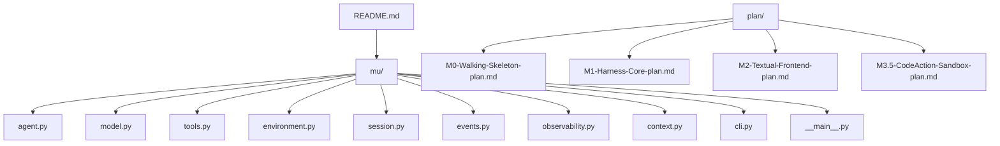
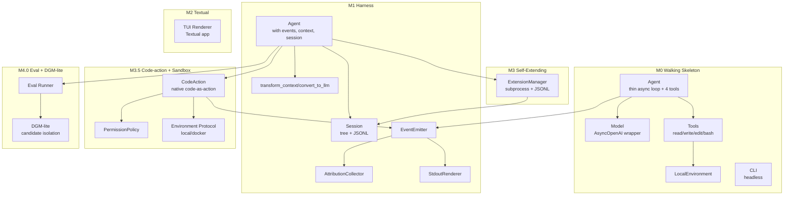
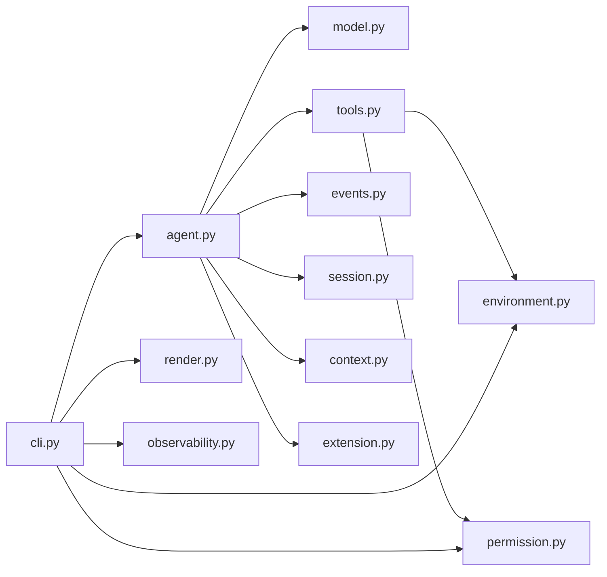

# 版本演进

<cite>
**本文引用的文件**
- [README.md](file://README.md)
- [M0-Walking-Skeleton-plan.md](file://plan/M0-Walking-Skeleton-plan.md)
- [M1-Harness-Core-plan.md](file://plan/M1-Harness-Core-plan.md)
- [M2-Textual-Frontend-plan.md](file://plan/M2-Textual-Frontend-plan.md)
- [M3.5-CodeAction-Sandbox-plan.md](file://plan/M3.5-CodeAction-Sandbox-plan.md)
- [__main__.py](file://mu/__main__.py)
- [cli.py](file://mu/cli.py)
- [agent.py](file://mu/agent.py)
- [model.py](file://mu/model.py)
- [tools.py](file://mu/tools.py)
- [environment.py](file://mu/environment.py)
- [session.py](file://mu/session.py)
- [events.py](file://mu/events.py)
- [observability.py](file://mu/observability.py)
- [context.py](file://mu/context.py)
</cite>

## 目录
1. [简介](#简介)
2. [项目结构](#项目结构)
3. [核心组件](#核心组件)
4. [架构总览](#架构总览)
5. [详细组件分析](#详细组件分析)
6. [依赖分析](#依赖分析)
7. [性能考量](#性能考量)
8. [故障排查指南](#故障排查指南)
9. [结论](#结论)
10. [附录](#附录)

## 简介
本文件系统梳理 μ (mu) 极简智能体从 M0 到 M4.0 的完整版本演进历程，聚焦每个里程碑的关键特性、技术突破与架构演进。重点覆盖：
- M0 Walking Skeleton：薄 async loop + 四工具 + 线性历史 + 纯 stdout
- M1 Harness：事件流、上下文管线、树形会话、可观测归因底座
- M2 Textual 终端界面：与 headless 共享核心，TUI 作为事件流消费者
- M3 自延伸扩展系统：子进程隔离 + JSONL 协议 + 自动加载
- M3.5 Code-action 与安全沙箱：native code-action + 可插拔权限/沙箱层
- M4.0 Eval 与 DGM-lite 基座：库内评估套件与候选隔离验证

## 项目结构
仓库采用“单包扁平”组织方式，核心模块位于 mu/，配套计划文档位于 plan/，评测与回归在 评测/ 与 tests/。README 提供高层说明与运行指引。

图示来源
- [__main__.py:1-5](file://mu/__main__.py#L1-L5)
- [cli.py:1-134](file://mu/cli.py#L1-L134)
- [agent.py:1-223](file://mu/agent.py#L1-L223)
- [model.py:1-147](file://mu/model.py#L1-L147)
- [tools.py:1-269](file://mu/tools.py#L1-L269)
- [environment.py:1-150](file://mu/environment.py#L1-L150)
- [session.py:1-115](file://mu/session.py#L1-L115)
- [events.py:1-133](file://mu/events.py#L1-L133)
- [observability.py:1-90](file://mu/observability.py#L1-L90)
- [context.py:1-31](file://mu/context.py#L1-L31)
- [M0-Walking-Skeleton-plan.md:26-48](file://plan/M0-Walking-Skeleton-plan.md#L26-L48)
- [M1-Harness-Core-plan.md:39-49](file://plan/M1-Harness-Core-plan.md#L39-L49)
- [M2-Textual-Frontend-plan.md:31-38](file://plan/M2-Textual-Frontend-plan.md#L31-L38)
- [M3.5-CodeAction-Sandbox-plan.md:31-44](file://plan/M3.5-CodeAction-Sandbox-plan.md#L31-L44)

章节来源
- [README.md:1-127](file://README.md#L1-L127)
- [M0-Walking-Skeleton-plan.md:1-91](file://plan/M0-Walking-Skeleton-plan.md#L1-L91)
- [M1-Harness-Core-plan.md:1-98](file://plan/M1-Harness-Core-plan.md#L1-L98)
- [M2-Textual-Frontend-plan.md:1-109](file://plan/M2-Textual-Frontend-plan.md#L1-L109)
- [M3.5-CodeAction-Sandbox-plan.md:1-99](file://plan/M3.5-CodeAction-Sandbox-plan.md#L1-L99)

## 核心组件
- Agent：薄 async while loop，贯穿 M0→M4.0。M1 起引入事件流、上下文管线、树形会话与 terminate 语义；M3 起支持自延伸扩展；M3.5 起可选 native code-action。
- Model：封装 AsyncOpenAI，M1 起返回 ModelResult（含 usage/latency），支持可选流式。
- ToolRegistry：统一工具注册与执行，M1 起支持 terminate；M3.5 起接入权限策略与可插拔环境。
- Environment：本地/可选 Docker 沙箱 provider，M3.5 起作为可插拔抽象。
- Session：树形消息持久化（JSONL），支持分支/续跑/侧分支摘要。
- 事件流与可观测：EventEmitter + StdoutRenderer + AttributionCollector，M1 落地 v1 归因底座。
- CLI：统一入口，装配订阅者、解析 flags（resume/branch/stream/tui/code/permission/sandbox）。

章节来源
- [agent.py:43-223](file://mu/agent.py#L43-L223)
- [model.py:91-147](file://mu/model.py#L91-L147)
- [tools.py:191-269](file://mu/tools.py#L191-L269)
- [environment.py:90-150](file://mu/environment.py#L90-L150)
- [session.py:38-115](file://mu/session.py#L38-L115)
- [events.py:121-133](file://mu/events.py#L121-L133)
- [observability.py:26-90](file://mu/observability.py#L26-L90)
- [cli.py:26-134](file://mu/cli.py#L26-L134)

## 架构总览
下图展示 M0→M4.0 的演进路径与关键模块关系：

图示来源
- [agent.py:43-223](file://mu/agent.py#L43-L223)
- [model.py:91-147](file://mu/model.py#L91-L147)
- [tools.py:191-269](file://mu/tools.py#L191-L269)
- [environment.py:90-150](file://mu/environment.py#L90-L150)
- [session.py:38-115](file://mu/session.py#L38-L115)
- [events.py:121-133](file://mu/events.py#L121-L133)
- [observability.py:26-90](file://mu/observability.py#L26-L90)
- [context.py:15-31](file://mu/context.py#L15-L31)
- [cli.py:51-134](file://mu/cli.py#L51-L134)
- [M0-Walking-Skeleton-plan.md:26-61](file://plan/M0-Walking-Skeleton-plan.md#L26-L61)
- [M1-Harness-Core-plan.md:25-63](file://plan/M1-Harness-Core-plan.md#L25-L63)
- [M2-Textual-Frontend-plan.md:22-29](file://plan/M2-Textual-Frontend-plan.md#L22-L29)
- [M3.5-CodeAction-Sandbox-plan.md:20-29](file://plan/M3.5-CodeAction-Sandbox-plan.md#L20-L29)

## 详细组件分析

### M0 Walking Skeleton（M0）
- 目标：按 Pi 思路复刻最小内核，验证“薄 async loop + 四工具 + 原生 function-calling + OpenAI 兼容端点”的端到端闭环。
- 关键特性
  - 朴素 while loop，无 max_steps；assistant 无 tool_calls 即终止
  - 四工具：read/write/edit/bash，返回字符串，错误也返回字符串
  - async-first：模型异步、bash 子进程、文件 IO offload 至线程
  - 单点打印 seam（_emit）为后续事件流留接口
  - 线性 append-only 历史，不提前造 M1 的树形会话
- 与 M1 的差异
  - 无事件流、无上下文管线、无树形会话、无可观测归因
  - 无 TUI、无自延伸扩展、无权限/沙箱、无 code-action

章节来源
- [M0-Walking-Skeleton-plan.md:7-25](file://plan/M0-Walking-Skeleton-plan.md#L7-L25)
- [M0-Walking-Skeleton-plan.md:50-82](file://plan/M0-Walking-Skeleton-plan.md#L50-L82)
- [agent.py:82-133](file://mu/agent.py#L82-L133)
- [model.py:112-147](file://mu/model.py#L112-L147)
- [tools.py:38-106](file://mu/tools.py#L38-L106)
- [environment.py:23-88](file://mu/environment.py#L23-L88)

### M1 Harness（M1）
- 目标：落地 Pi 的“三件武器”与 v1 可观测创新，将 μ 从“能跑”提升到“有骨架质感”。
- 关键特性
  - 事件流：EventEmitter + 多订阅者（StdoutRenderer、AttributionCollector）
  - 上下文管线：transform_context（默认 identity）+ convert_to_llm（标准消息透传）
  - 树形会话：Session（JSONL 持久化、分支/续跑/侧分支摘要）
  - Provider 打磨：可选流式、可取消（CancelledError → 落盘 + RunAborted）
  - 归因底座：turns/Latency/Tokens 统计，支持可选成本估算
- 与 M0 的差异
  - 用 Session 替代内存线性历史
  - 用事件流替代 _emit 打印
  - 保持 M0 行为回归测试（messages 透传、convert_to_llm 透传）

章节来源
- [M1-Harness-Core-plan.md:7-23](file://plan/M1-Harness-Core-plan.md#L7-L23)
- [M1-Harness-Core-plan.md:25-63](file://plan/M1-Harness-Core-plan.md#L25-L63)
- [events.py:121-133](file://mu/events.py#L121-L133)
- [session.py:38-115](file://mu/session.py#L38-L115)
- [context.py:15-31](file://mu/context.py#L15-L31)
- [observability.py:26-90](file://mu/observability.py#L26-L90)
- [agent.py:82-133](file://mu/agent.py#L82-L133)

### M2 Textual 终端界面（M2）
- 目标：在不改动 core 的前提下，增加 Textual TUI 作为事件流的另一个消费者与输入驱动。
- 关键特性
  - --tui 显式开启，headless 默认；与 headless 共享同一 Agent/Session/事件流
  - TUI = 事件订阅者 + 输入驱动；async worker 驱动 agent，UI 不卡顿
  - 可注入 agent_factory 用于离线测试（FakeModel）
- 与 M1 的差异
  - 新增 TUI 渲染器与 App 生命周期管理
  - CLI 增加 --tui 预检与依赖提示

章节来源
- [M2-Textual-Frontend-plan.md:7-21](file://plan/M2-Textual-Frontend-plan.md#L7-L21)
- [M2-Textual-Frontend-plan.md:22-58](file://plan/M2-Textual-Frontend-plan.md#L22-L58)
- [cli.py:86-112](file://mu/cli.py#L86-L112)

### M3 自延伸扩展系统（M3）
- 目标：允许 agent 自己写 Python 工具扩展并通过 load_extension 动态加载，扩展以子进程隔离 + JSONL 协议通信。
- 关键特性
  - ExtensionManager 注册 load/reload/list 等管理工具
  - 扩展状态存入 session，支持 --resume 恢复
  - ./mu/extensions/ 启动自动加载（restrictive 策略下跳过 autoload）
- 与 M1 的差异
  - 新增 ExtensionManager 与扩展生命周期管理
  - 事件流新增扩展相关事件（ExtensionLoaded/Unloaded/Log/Error）

章节来源
- [agent.py:68-75](file://mu/agent.py#L68-L75)
- [README.md:73-82](file://README.md#L73-L82)

### M3.5 Code-action 与安全沙箱（M3.5）
- 目标：v1 收口，落地两项创新：native code-action 与可插拔权限/沙箱层。
- 关键特性
  - CodeAction：模型写 Python，在一次调用内组合多个工具调用 + 控制流（进程内线程执行，软超时）
  - 权限策略：allow_all/read_only/workspace_write，统一在 ToolRegistry.execute 前 gate
  - 沙箱 provider：Environment Protocol，默认 local，可选 docker（实验性，仅 bash 容器化）
- 与 M3 的差异
  - 新增 code 工具（默认关闭），权限策略与沙箱 provider 可独立开关
  - 内层工具调用复用事件流与归因，自动可观测

章节来源
- [M3.5-CodeAction-Sandbox-plan.md:7-19](file://plan/M3.5-CodeAction-Sandbox-plan.md#L7-L19)
- [M3.5-CodeAction-Sandbox-plan.md:20-29](file://plan/M3.5-CodeAction-Sandbox-plan.md#L20-L29)
- [tools.py:191-269](file://mu/tools.py#L191-L269)
- [environment.py:90-150](file://mu/environment.py#L90-L150)
- [cli.py:26-39](file://mu/cli.py#L26-L39)

### M4.0 Eval 与 DGM-lite 基座（M4.0）
- 目标：建立库内 eval 子系统与 DGM-lite 候选隔离验证，形成“候选只归档，不自动应用回主仓库”的基座。
- 关键特性
  - Eval Runner：内置 basic-coding 任务集，产物写入 eval_runs/<timestamp>，summary 不记录 API key
  - DGM-lite：在候选 workspace 中叠加扩展/提示词候选，跑同一 eval suite，写入 append-only archive
  - 候选范围严格限制：.mu/extensions/*.py、.mu/prompts/*.{md,txt}、extensions/*.{py,md,txt}
- 与 M3.5 的差异
  - 新增 eval 与 dgm 子系统，形成“验证—归档—沉淀”的闭环
  - 保持 M3.5 的默认开关（code-action/permission/sandbox 默认关闭）

章节来源
- [README.md:98-127](file://README.md#L98-L127)

## 依赖分析
- 模块耦合
  - Agent 依赖 Model、ToolRegistry、EventEmitter、Session、context、prompts、extensions、codeact
  - ToolRegistry 依赖 Environment 与 PermissionPolicy
  - CLI 装配 EventEmitter、StdoutRenderer、AttributionCollector、Session、Agent
- 外部依赖
  - openai SDK（AsyncOpenAI）用于模型调用
  - textual（可选）用于 M2 TUI
  - docker（可选）用于 M3.5 沙箱
- 可插拔点
  - Environment Protocol（local/docker/E2B/Modal）
  - PermissionPolicy（allow/readonly/workspace）
  - CodeAction（默认关闭）

图示来源
- [cli.py:12-19](file://mu/cli.py#L12-L19)
- [agent.py:33-38](file://mu/agent.py#L33-L38)
- [tools.py:11-12](file://mu/tools.py#L11-L12)
- [environment.py:90-96](file://mu/environment.py#L90-L96)
- [observability.py:15-23](file://mu/observability.py#L15-L23)

章节来源
- [cli.py:51-134](file://mu/cli.py#L51-L134)
- [agent.py:43-223](file://mu/agent.py#L43-L223)
- [tools.py:191-269](file://mu/tools.py#L191-L269)
- [environment.py:90-150](file://mu/environment.py#L90-L150)

## 性能考量
- 流式输出：M1 引入可选流式，减少等待时间；M2 TUI 复用同一流式能力
- 工具并行：M1 仍顺序执行工具，避免并发复杂度；并行工具执行留后续
- 超时与取消：bash 超时按进程组清理；Agent 支持 asyncio.CancelledError 安全落盘
- 归因统计：AttributionCollector 提供 best-effort 时延与 token 统计，辅助优化

## 故障排查指南
- 配置错误
  - MU_MODEL/MU_API_KEY 未设置：抛出 ConfigError，CLI 输出提示并退出
- 会话错误
  - --resume/--branch 参数无效：Session.load/branch_from 抛错，CLI 输出并退出
- TUI 依赖
  - 未安装 textual：CLI 提示安装 .[tui] 后重试
- 代码行动态
  - 未开启 --code：ToolRegistry 无 code 工具；开启后注意软超时与权限策略
- 沙箱限制
  - --sandbox docker：仅 bash 容器化，文件工具仍宿主 IO；需要真隔离请将 μ 跑容器

章节来源
- [model.py:19-21](file://mu/model.py#L19-L21)
- [cli.py:77-103](file://mu/cli.py#L77-L103)
- [M3.5-CodeAction-Sandbox-plan.md:13-16](file://plan/M3.5-CodeAction-Sandbox-plan.md#L13-L16)

## 结论
μ 项目以“Pi 风格极简”为指导，按里程碑渐进演进：M0 奠基、M1 落地核心骨架、M2 增强交互体验、M3 实现自延伸、M3.5 引入安全与 code-action、M4.0 建立评估与候选基座。各版本在保持向后兼容的同时，逐步引入事件流、树形会话、权限/沙箱与评估体系，形成可验证、可扩展、可归档的演进路径。

## 附录
- 运行与配置
  - 使用仓库自带 .venv 安装依赖，支持 headless 与 TUI
  - 支持多种 OpenAI 兼容端点（百炼/DeepSeek/OpenAI）
- 测试
  - 全量 pytest 通过，覆盖事件流、会话树、上下文管线、归因、流式、terminate、TUI、权限、code-action、沙箱等

章节来源
- [README.md:13-127](file://README.md#L13-L127)
- [M0-Walking-Skeleton-plan.md:63-82](file://plan/M0-Walking-Skeleton-plan.md#L63-L82)
- [M1-Harness-Core-plan.md:72-90](file://plan/M1-Harness-Core-plan.md#L72-L90)
- [M2-Textual-Frontend-plan.md:85-100](file://plan/M2-Textual-Frontend-plan.md#L85-L100)
- [M3.5-CodeAction-Sandbox-plan.md:73-92](file://plan/M3.5-CodeAction-Sandbox-plan.md#L73-L92)