# 设计理念

<cite>
**本文引用的文件**
- [README.md](file://README.md)
- [docs/Pi-极简Agent深度调研.md](file://docs/Pi-极简Agent深度调研.md)
- [mu/__main__.py](file://mu/__main__.py)
- [mu/cli.py](file://mu/cli.py)
- [mu/agent.py](file://mu/agent.py)
- [mu/model.py](file://mu/model.py)
- [mu/tools.py](file://mu/tools.py)
- [mu/context.py](file://mu/context.py)
- [mu/session.py](file://mu/session.py)
- [mu/events.py](file://mu/events.py)
- [mu/environment.py](file://mu/environment.py)
- [mu/permission.py](file://mu/permission.py)
- [mu/codeact.py](file://mu/codeact.py)
- [mu/extension.py](file://mu/extension.py)
- [mu/render.py](file://mu/render.py)
</cite>

## 目录
1. [引言](#引言)
2. [项目结构](#项目结构)
3. [核心组件](#核心组件)
4. [架构总览](#架构总览)
5. [组件深度解析](#组件深度解析)
6. [依赖关系分析](#依赖关系分析)
7. [性能考量](#性能考量)
8. [故障排查指南](#故障排查指南)
9. [结论](#结论)
10. [附录](#附录)

## 引言
本项目以“Pi 风格极简智能体”为核心范式，目标是在“循环已收敛”的前提下，将“夹具（harness）”尽可能削薄：以一个“薄 async loop + 四个工具 + 原生 function-calling + OpenAI 兼容模型后端”构成的最小闭环，承载上下文工程、可观测性、可扩展与可评估能力。项目在 M0（薄 loop + 四工具 + 线性历史 + 纯 stdout）基础上，逐步演进到 M1（事件流 + 上下文管线 + tree session + provider 打磨）、M2（TUI）、M3（自延伸扩展 + 子进程隔离 + JSONL 协议）、M3.5（原生 code-action + 权限/沙箱层）、M4（库内 eval + DGM-lite 候选隔离验证与归档）。本文围绕设计理念、设计动机、实现原理与工程权衡展开，帮助开发者在理解“为何如此设计”的同时，掌握“如何正确扩展与优化”。

## 项目结构
项目采用“功能域 + 层次化模块”的组织方式：
- 入口与运行时：命令行入口、事件发射器、渲染器、归因收集器
- 核心循环：Agent（薄 async while loop）、上下文管线、会话树
- 工具与执行：工具注册表、四个内置工具、权限策略、环境抽象
- 模型与后端：OpenAI 兼容封装、流式累积、结果归因
- 扩展与自延伸：扩展管理器（子进程 + JSONL 协议）
- 可视化与交互：Headless stdout 渲染、TUI（M2）

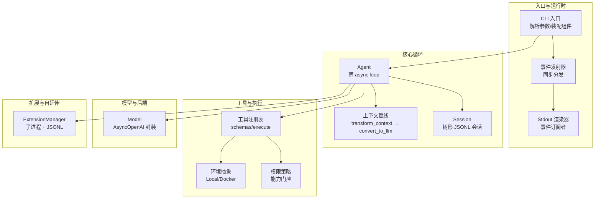

图示来源
- [mu/cli.py:1-134](file://mu/cli.py#L1-L134)
- [mu/agent.py:1-223](file://mu/agent.py#L1-L223)
- [mu/context.py:1-31](file://mu/context.py#L1-L31)
- [mu/session.py:1-115](file://mu/session.py#L1-L115)
- [mu/model.py:1-147](file://mu/model.py#L1-L147)
- [mu/tools.py:1-269](file://mu/tools.py#L1-L269)
- [mu/environment.py:1-150](file://mu/environment.py#L1-L150)
- [mu/permission.py:1-69](file://mu/permission.py#L1-L69)
- [mu/extension.py:1-364](file://mu/extension.py#L1-L364)
- [mu/render.py:1-78](file://mu/render.py#L1-L78)

章节来源
- [README.md:1-127](file://README.md#L1-L127)
- [mu/cli.py:1-134](file://mu/cli.py#L1-L134)
- [mu/agent.py:1-223](file://mu/agent.py#L1-L223)

## 核心组件
- 薄 async loop（Agent）：无 max_steps、以“无 tool_calls”为终止条件；支持 turn 级停止、批量 tool_calls 的 terminate 语义、事件驱动的可观测性。
- 四个工具：read、write、edit、bash；统一以 OpenAI tools schema 原生 function-calling；错误以字符串返回，交由模型自纠错。
- 上下文管线：transform_context（默认 identity，预留压缩/注入）、convert_to_llm（标准消息透传，自定义类型转换或丢弃）。
- 会话树（Session）：append-only JSONL，支持分支、回溯、侧分支摘要注入主线。
- 模型后端：OpenAI 兼容封装，支持可选流式、累计增量、usage 归因。
- 权限与沙箱：基于能力（capability）的门控策略；可插拔环境抽象（Local/Docker）。
- 自延伸扩展：子进程隔离 + JSONL 协议，支持 load/reload/list 扩展工具，扩展状态持久化于 session。

章节来源
- [mu/agent.py:1-223](file://mu/agent.py#L1-L223)
- [mu/tools.py:1-269](file://mu/tools.py#L1-L269)
- [mu/context.py:1-31](file://mu/context.py#L1-L31)
- [mu/session.py:1-115](file://mu/session.py#L1-L115)
- [mu/model.py:1-147](file://mu/model.py#L1-L147)
- [mu/permission.py:1-69](file://mu/permission.py#L1-L69)
- [mu/environment.py:1-150](file://mu/environment.py#L1-L150)
- [mu/extension.py:1-364](file://mu/extension.py#L1-L364)

## 架构总览
Pi 的核心哲学是“上下文工程至上”，将 4 个工具 + 极简系统提示（含工具定义）最大化留给代码与项目信息，其余一切交给扩展系统。μ 在此基础上，将“薄 harness”进一步工程化落地：以事件流替代单点打印、以树形会话承载可追溯的历史、以原生 function-calling 降低 schema 注入的上下文成本、以 OpenAI 兼容后端实现多 provider 适配。

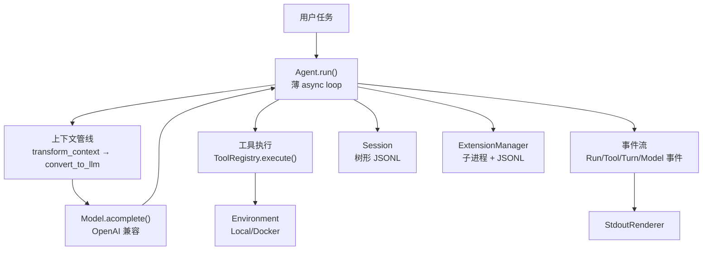

图示来源
- [mu/agent.py:82-133](file://mu/agent.py#L82-L133)
- [mu/context.py:20-31](file://mu/context.py#L20-L31)
- [mu/model.py:112-147](file://mu/model.py#L112-L147)
- [mu/tools.py:253-269](file://mu/tools.py#L253-L269)
- [mu/events.py:13-133](file://mu/events.py#L13-L133)
- [mu/session.py:38-115](file://mu/session.py#L38-L115)
- [mu/extension.py:85-364](file://mu/extension.py#L85-L364)

## 组件深度解析

### 薄 async loop 的设计动机与实现
- 动机
  - 无 max_steps：遵循 Pi 的“循环已收敛”假设，让模型决定何时结束；避免人为上限带来的“早停”风险。
  - 细粒度终止：工具返回 terminate 标志，仅当一批 tool_calls 的最终结果均 terminate 时才跳过自动后续 LLM 调用，兼顾可控性与灵活性。
  - turn 级停止：支持在 turn 结束后插入“优雅停止”钩子，确保 steering/follow-up 队列在下一轮开始前被处理。
  - 事件驱动：以结构化事件流替代单点打印，支撑 TUI、归因统计、扩展可观测等多订阅者场景。
- 实现要点
  - 会话注入 system 消息仅在新建会话时进行；resume 时复用历史，仅追加用户任务。
  - 工具调用顺序执行（并行留后续），每个 call 产生 ToolCallStarted/Finished 事件，便于归因与可视化。
  - 取消与落盘：支持 asyncio.CancelledError，为已执行的 tool call 补充错误结果，保证 session 可恢复。

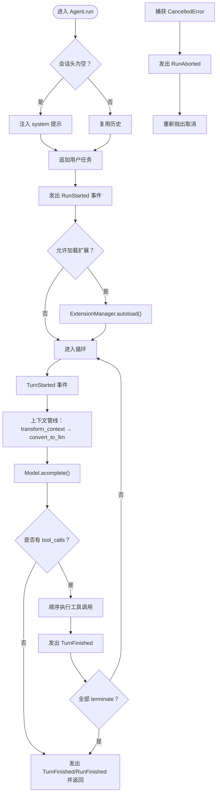

图示来源
- [mu/agent.py:82-133](file://mu/agent.py#L82-L133)
- [mu/agent.py:134-173](file://mu/agent.py#L134-L173)
- [mu/extension.py:235-244](file://mu/extension.py#L235-L244)

章节来源
- [mu/agent.py:1-223](file://mu/agent.py#L1-L223)
- [mu/events.py:13-133](file://mu/events.py#L13-L133)
- [mu/extension.py:85-244](file://mu/extension.py#L85-L244)

### 四个工具的选择依据与协作机制
- 选择依据
  - 以“最小必要工具集”承载绝大多数编码任务：读取、写入、精确替换、执行命令；避免预置工具 schema 注入带来的上下文成本。
  - 统一以 OpenAI tools schema 的原生 function-calling，减少额外的 schema 适配与上下文开销。
- 协作机制
  - 工具错误统一以字符串返回，交由模型自纠错，降低异常传播成本。
  - 权限策略基于“能力”门控（read/write/shell/code_exec/extension_exec），而非工具名黑名单，使 code-action 与扩展加载在 restrict 模式下也能被真正拦截。
  - 工具注册表支持动态注册/注销扩展工具，配合扩展管理器实现“agent 自己造工具并加载”的闭环。

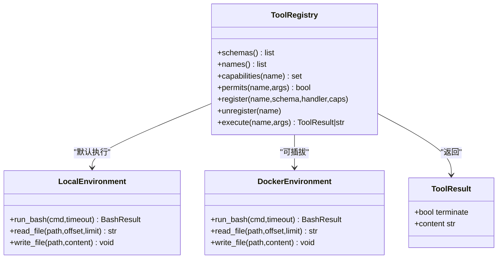

图示来源
- [mu/tools.py:191-269](file://mu/tools.py#L191-L269)
- [mu/environment.py:23-150](file://mu/environment.py#L23-L150)

章节来源
- [mu/tools.py:1-269](file://mu/tools.py#L1-L269)
- [mu/permission.py:1-69](file://mu/permission.py#L1-L69)
- [mu/environment.py:1-150](file://mu/environment.py#L1-L150)

### 原生 function-calling 的优势与实现
- 优势
  - 降低 schema 注入成本：直接使用 OpenAI tools schema，无需额外的工具描述与参数校验适配。
  - 与模型训练对齐：前沿模型已“内化”编码 agent 的行为模式，无需冗长系统提示。
  - 事件可观测：每个 tool_call 产生 ToolCallStarted/Finished 事件，便于归因与可视化。
- 实现方式
  - Agent 在调用模型前，将内部历史经上下文管线转换为 LLM 可接受的消息格式；工具 schema 由 ToolRegistry.schemas() 提供。
  - 流式模式下，Model.consume_stream 负责累积 content 与 tool_calls 增量，并通过 on_delta 回调实时通知。

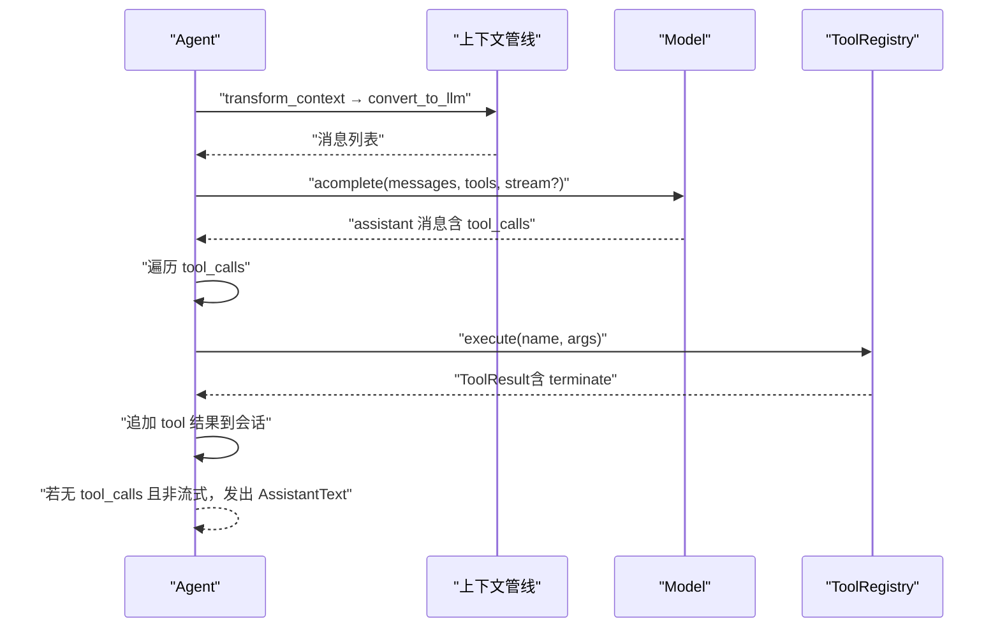

图示来源
- [mu/agent.py:92-133](file://mu/agent.py#L92-L133)
- [mu/model.py:112-147](file://mu/model.py#L112-L147)
- [mu/tools.py:253-269](file://mu/tools.py#L253-L269)

章节来源
- [mu/agent.py:1-223](file://mu/agent.py#L1-L223)
- [mu/model.py:1-147](file://mu/model.py#L1-L147)
- [mu/context.py:1-31](file://mu/context.py#L1-L31)

### OpenAI 兼容模型后端的设计考虑
- 仅封装 AsyncOpenAI.chat.completions.create，不自建 HTTP/provider 适配，降低耦合与维护成本。
- 支持可选流式：开启时通过 consume_stream 累积增量文本与 tool_calls，并提供 on_delta 回调；关闭时一次性返回。
- 统一 ModelResult：包含 message、usage 与 latency，用于归因底座与统计。
- 环境变量驱动：MU_BASE_URL、MU_MODEL、MU_API_KEY（或 OPENAI_API_KEY），零依赖加载 .env 的前提下，通过 shell 导入。

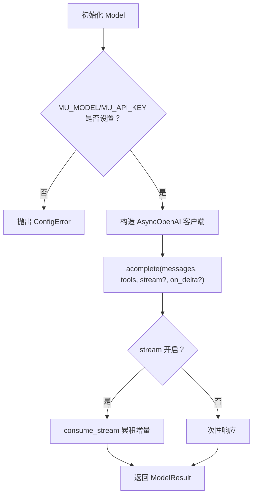

图示来源
- [mu/model.py:91-147](file://mu/model.py#L91-L147)

章节来源
- [mu/model.py:1-147](file://mu/model.py#L1-L147)
- [README.md:20-41](file://README.md#L20-L41)

### 事件流与可观测性
- 事件类型覆盖：RunStarted/TurnStarted/ModelCallStarted/AssistantText/ToolCallStarted/ToolCallFinished/TurnFinished/RunFinished/RunAborted 等。
- 多订阅者：StdoutRenderer、AttributionCollector（归因统计）、未来可扩展的 TUI。
- 同步分发：EventEmitter 采用同步订阅分发，避免引入额外 pub/sub 框架，保持轻量与确定性。

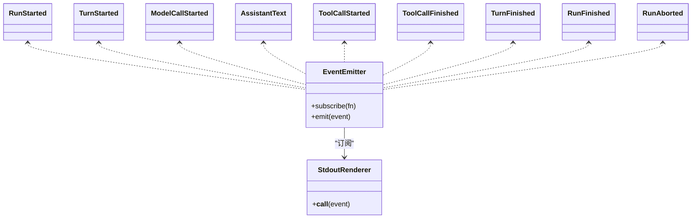

图示来源
- [mu/events.py:121-133](file://mu/events.py#L121-L133)
- [mu/render.py:31-78](file://mu/render.py#L31-L78)

章节来源
- [mu/events.py:1-133](file://mu/events.py#L1-L133)
- [mu/render.py:1-78](file://mu/render.py#L1-L78)

### 权限策略与沙箱层
- 权限策略
  - 基于能力门控：read/write/shell/code_exec/extension_exec；默认 allow_all（YOLO）；readonly 严格拦截 write/edit/bash/code/load_extension；workspace_write 限制写入范围。
- 沙箱层
  - 可插拔 Environment 抽象：LocalEnvironment 默认实现；DockerEnvironment 实验性实现（仅 bash 容器化，文件工具仍宿主 IO）。
  - make_environment 工厂函数根据 --sandbox 选择 provider。

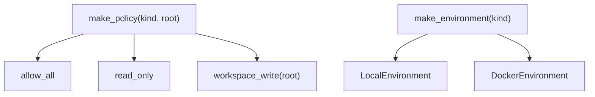

图示来源
- [mu/permission.py:61-69](file://mu/permission.py#L61-L69)
- [mu/environment.py:139-150](file://mu/environment.py#L139-L150)

章节来源
- [mu/permission.py:1-69](file://mu/permission.py#L1-L69)
- [mu/environment.py:1-150](file://mu/environment.py#L1-L150)

### 自延伸扩展（M3）与原生 code-action（M3.5）
- 自延伸扩展
  - 子进程 + JSONL 协议：每个扩展为独立进程，首行发送 manifest，随后注册工具、起 reader 任务、接收 execute 请求、回传 result/log/state。
  - 生命周期：load/reload/unload，失败路径自动清理与降级；扩展状态持久化到 session（ext_state）。
- 原生 code-action
  - 模型写 Python，一次性组合多个工具；通过 _MuApi 将线程内同步调用 marshal 到事件循环，经 ToolRegistry.execute 并触发内层 ToolCall 事件。
  - 风险提示：进程内 exec，隔离不等于安全沙箱；建议容器化运行或使用 --sandbox docker。

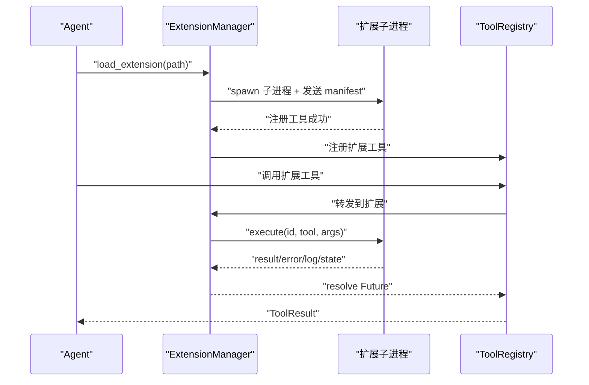

图示来源
- [mu/extension.py:131-188](file://mu/extension.py#L131-L188)
- [mu/extension.py:251-266](file://mu/extension.py#L251-L266)
- [mu/extension.py:275-317](file://mu/extension.py#L275-L317)

章节来源
- [mu/extension.py:1-364](file://mu/extension.py#L1-L364)
- [mu/codeact.py:1-133](file://mu/codeact.py#L1-L133)

### 会话树与分支总结（Pi side-quest → 主线带回）
- 会话树
  - append-only JSONL，节点含 id/parent_id/ts/msg；支持 branch_from/fork、path_to/head、leaves 等导航。
  - branch_summary 作为自定义消息注入主线，convert_to_llm 转换为 user 消息参与上下文。
- 分支总结
  - 通过 summarize_branch 将某侧分支的结论带回主线，支持 deterministic 概括或后续接入模型概括。

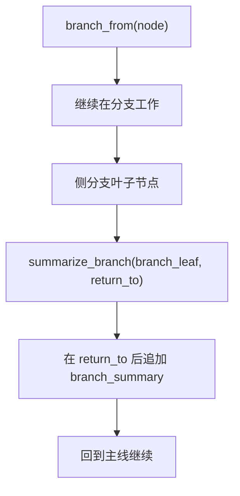

图示来源
- [mu/session.py:90-98](file://mu/session.py#L90-L98)
- [mu/session.py:56-58](file://mu/session.py#L56-L58)
- [mu/context.py:26-30](file://mu/context.py#L26-L30)
- [mu/agent.py:175-199](file://mu/agent.py#L175-L199)

章节来源
- [mu/session.py:1-115](file://mu/session.py#L1-L115)
- [mu/context.py:1-31](file://mu/context.py#L1-L31)
- [mu/agent.py:175-199](file://mu/agent.py#L175-L199)

## 依赖关系分析
- 组件耦合
  - Agent 依赖 Model、ToolRegistry、EventEmitter、Session、ExtensionManager；通过上下文管线与工具注册表解耦具体实现。
  - ToolRegistry 依赖 Environment 与 PermissionPolicy；默认 LocalEnvironment + allow_all。
  - Model 依赖 AsyncOpenAI，仅封装官方 SDK，避免多 provider 适配。
  - ExtensionManager 与 Session 协作持久化扩展状态，与 ToolRegistry 协作注册扩展工具。
- 外部依赖
  - openai SDK（AsyncOpenAI）为唯一外部模型依赖；TUI 依赖 textual（可选）。
- 潜在循环依赖
  - 未发现直接循环；事件流与渲染器通过订阅解耦。

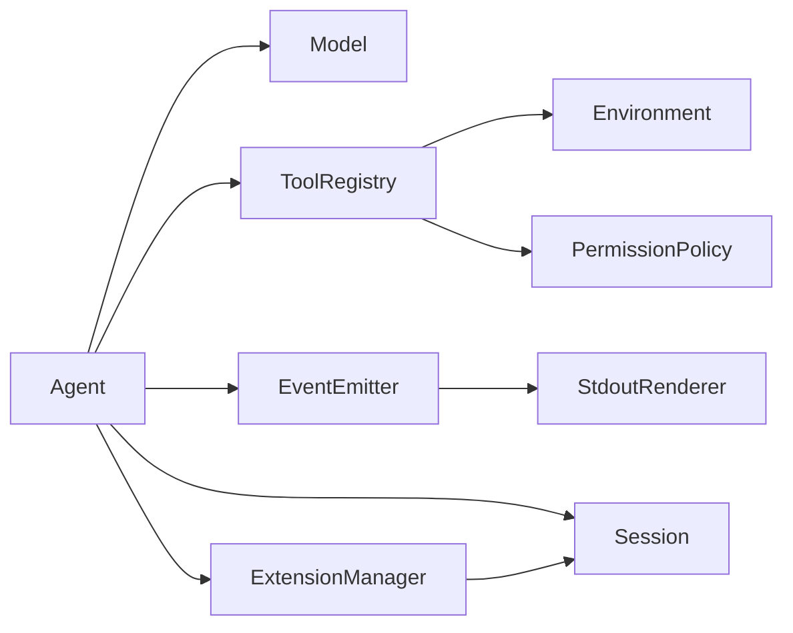

图示来源
- [mu/agent.py:33-75](file://mu/agent.py#L33-L75)
- [mu/tools.py:198-211](file://mu/tools.py#L198-L211)
- [mu/extension.py:95-103](file://mu/extension.py#L95-L103)
- [mu/events.py:121-133](file://mu/events.py#L121-L133)
- [mu/render.py:31-78](file://mu/render.py#L31-L78)

章节来源
- [mu/agent.py:1-223](file://mu/agent.py#L1-L223)
- [mu/tools.py:1-269](file://mu/tools.py#L1-L269)
- [mu/extension.py:1-364](file://mu/extension.py#L1-L364)
- [mu/events.py:1-133](file://mu/events.py#L1-L133)
- [mu/render.py:1-78](file://mu/render.py#L1-L78)

## 性能考量
- 循环与终止
  - 无 max_steps 与细粒度 terminate 语义，避免不必要的 LLM 调用，减少 token 与延迟。
- 流式输出
  - 可选流式开启时，通过 consume_stream 累积增量文本与 tool_calls，降低等待时延；关闭时一次性返回，减少事件风暴。
- I/O 与隔离
  - 文件读写与 bash 均 offload 至线程/子进程，避免阻塞事件循环；DockerEnvironment 仅容器化 bash，文件工具仍宿主 IO，需结合容器运行获得完整隔离。
- 归因与统计
  - ModelResult 携带 usage 与 latency，结合事件流可形成细粒度归因报告（轮数、LLM 时延、工具时延、token 消耗）。

章节来源
- [mu/model.py:52-89](file://mu/model.py#L52-L89)
- [mu/model.py:112-147](file://mu/model.py#L112-L147)
- [mu/environment.py:26-88](file://mu/environment.py#L26-L88)
- [README.md:52](file://README.md#L52)

## 故障排查指南
- 配置错误
  - MU_MODEL 或 MU_API_KEY 未设置：抛出 ConfigError；检查 .env 或 shell 导入。
- 会话错误
  - 未知会话 ID 或文件不存在：Session.load 抛出 FileNotFoundError/KeyError；确认 --resume/--branch 参数。
- 扩展错误
  - manifest 无效、工具名冲突、超时或进程退出：ExtensionManager 记录 ExtensionError，自动清理并降级；检查扩展输出首行 manifest 与工具 schema。
- 取消与中断
  - Ctrl-C 或程序取消：发出 RunAborted；Agent 在取消后补充 pending tool 错误，保证 session 可恢复。
- TUI 依赖
  - 未安装 textual：导入时报错；使用 pip 安装可选依赖后重试。

章节来源
- [mu/model.py:19-21](file://mu/model.py#L19-L21)
- [mu/cli.py:66-68](file://mu/cli.py#L66-L68)
- [mu/extension.py:146-160](file://mu/extension.py#L146-L160)
- [mu/agent.py:130-133](file://mu/agent.py#L130-L133)
- [mu/cli.py:100-103](file://mu/cli.py#L100-L103)

## 结论
μ 以 Pi 的“循环已收敛、夹具应薄”为指导，将“原生 function-calling + OpenAI 兼容后端 + 事件流 + 树形会话 + 自延伸扩展”整合为可评估、可观测、可扩展的极简智能体基座。其设计权衡在于：以最小上下文承载最大能力，将复杂性外推至扩展与工具层面；通过能力门控与可插拔沙箱在安全与灵活性之间取得平衡。对于开发者，建议优先从“上下文工程”“事件可观测”“工具注册表”“会话树”入手扩展，再按需引入 code-action 与沙箱层。

## 附录
- 进度与范围
  - M0-M4：按里程碑推进，M4.0 引入库内 eval 与 DGM-lite 候选隔离验证。
- 使用与配置
  - 通过环境变量配置端点、模型与密钥；支持 headless 与 TUI 两种运行形态；支持 --code/--permission/--sandbox 等高级选项。

章节来源
- [README.md:5-127](file://README.md#L5-L127)
- [docs/Pi-极简Agent深度调研.md:1-217](file://docs/Pi-极简Agent深度调研.md#L1-L217)