# 项目介绍

<cite>
**本文引用的文件**
- [README.md](file://README.md)
- [mu/__main__.py](file://mu/__main__.py)
- [mu/agent.py](file://mu/agent.py)
- [mu/tools.py](file://mu/tools.py)
- [mu/model.py](file://mu/model.py)
- [mu/cli.py](file://mu/cli.py)
- [mu/session.py](file://mu/session.py)
- [mu/events.py](file://mu/events.py)
- [mu/environment.py](file://mu/environment.py)
- [mu/permission.py](file://mu/permission.py)
- [mu/codeact.py](file://mu/codeact.py)
- [mu/context.py](file://mu/context.py)
- [mu/extension.py](file://mu/extension.py)
- [mu/extsdk.py](file://mu/extsdk.py)
- [extensions/example_textstats.py](file://extensions/example_textstats.py)
- [docs/Pi-极简Agent深度调研.md](file://docs/Pi-极简Agent深度调研.md)
</cite>

## 目录
1. [简介](#简介)
2. [项目结构](#项目结构)
3. [核心组件](#核心组件)
4. [架构总览](#架构总览)
5. [详细组件分析](#详细组件分析)
6. [依赖关系分析](#依赖关系分析)
7. [性能考量](#性能考量)
8. [故障排查指南](#故障排查指南)
9. [结论](#结论)
10. [附录](#附录)

## 简介
μ (mu) 是一个按 Pi 风格实现的极简智能体，目标是以“薄 async loop + 四个工具 + 原生 function-calling + OpenAI 兼容模型后端”的最小可用形态，支撑从基础编码任务到可扩展的自延伸 Agent 生态。项目遵循 Pi 的“我若不需要，便不会构建”的原则，将复杂度留给扩展系统与上下文工程，而非在框架内堆砌功能。

- 价值主张
  - 极简：仅四个核心工具（read/write/edit/bash），原生 function-calling，OpenAI 兼容模型后端，无 max_steps 的自然终止。
  - 可观测：事件流驱动，结构化事件贯穿模型调用、工具调用、分支摘要、扩展生命周期等。
  - 可扩展：自延伸扩展（子进程隔离 + JSONL 协议），支持热重载与状态持久化；M3.5 引入原生 code-action（一次调用组合多工具）。
  - 实用：Headless 与 TUI 双形态，支持续跑/分支、流式输出、可插拔权限/沙箱层，满足个人与受限环境需求。

- 为什么选择 Pi 风格的极简实现
  - Pi 的核心洞见是“Agent Loop 已收敛”，复杂度应转移到 harness：Provider 抽象、上下文转换管线、Tree Session、扩展系统与可观测事件流。μ 复刻这一思想，将“loop”保持朴素 while，把“harness”做薄做精。
  - 通过“缺能力就现写”的策略，避免预置工具带来的上下文占用与维护成本，让模型在真实项目上下文中高效工作。

- 主要特性概览
  - 薄 async loop：无 max_steps，以“无 tool_calls”自然终止。
  - 四个核心工具：read/write/edit/bash，统一走 OpenAI tools schema。
  - 原生 function-calling：模型直接决定工具调用序列，支持流式增量。
  - OpenAI 兼容模型后端：支持百炼、DeepSeek、OpenAI 等，可通过环境变量配置。
  - 事件流与可观测：RunStarted/TurnStarted/ModelCallFinished/ToolCallFinished 等事件，配套归因统计。
  - Tree Session：JSONL 持久化，支持分支、侧分支摘要回主线。
  - 自延伸扩展：子进程扩展，JSONL 协议，支持 load/reload/list，状态存 session。
  - M3.5 原生 code-action：一次调用内组合多工具，减少轮次与 token。
  - 可插拔权限/沙箱：策略式能力门控，沙箱可插拔（local/docker）。

**章节来源**
- [README.md:1-127](file://README.md#L1-L127)
- [docs/Pi-极简Agent深度调研.md:1-217](file://docs/Pi-极简Agent深度调研.md#L1-L217)

## 项目结构
- 核心模块
  - 入口与 CLI：命令行解析、会话构建、事件订阅、TUI 启动。
  - Agent：薄 async loop，事件发射，上下文管线，工具执行，分支摘要。
  - Model：AsyncOpenAI 封装，支持流式与非流式，返回 ModelResult 用于归因。
  - Tools：四个内置工具 + 注册表，统一 schema 与能力门控。
  - Environment/Permission：本地执行层与策略式权限门控。
  - Session：Tree Session，JSONL 持久化，分支与摘要。
  - Events：结构化事件总线，多订阅者消费。
  - CodeAction：原生 code-action（M3.5），一次调用组合多工具。
  - Extension/ExtSDK：扩展管理与 SDK，子进程隔离 + JSONL 协议。
- 文档与示例
  - Pi 调研文档：深入解读 Pi 的设计哲学与工程实践。
  - 扩展示例：展示如何编写与加载扩展工具。

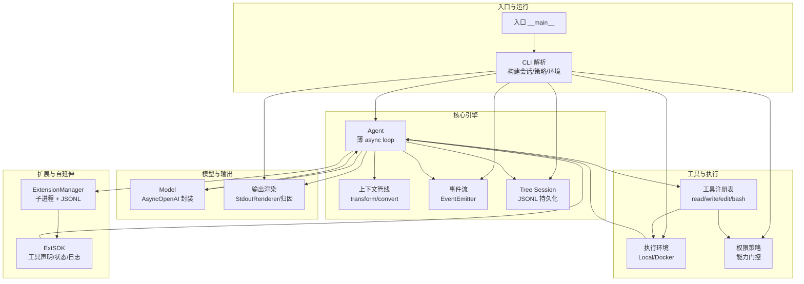

**图表来源**
- [mu/cli.py:1-134](file://mu/cli.py#L1-L134)
- [mu/agent.py:1-223](file://mu/agent.py#L1-L223)
- [mu/model.py:1-147](file://mu/model.py#L1-L147)
- [mu/tools.py:1-269](file://mu/tools.py#L1-L269)
- [mu/session.py:1-115](file://mu/session.py#L1-L115)
- [mu/events.py:1-133](file://mu/events.py#L1-L133)
- [mu/environment.py:1-150](file://mu/environment.py#L1-L150)
- [mu/permission.py:1-69](file://mu/permission.py#L1-L69)
- [mu/extension.py:1-364](file://mu/extension.py#L1-L364)
- [mu/extsdk.py:1-130](file://mu/extsdk.py#L1-L130)

**章节来源**
- [mu/__main__.py:1-5](file://mu/__main__.py#L1-L5)
- [mu/cli.py:1-134](file://mu/cli.py#L1-L134)
- [mu/agent.py:1-223](file://mu/agent.py#L1-L223)
- [mu/session.py:1-115](file://mu/session.py#L1-L115)

## 核心组件
- 薄 async loop（Agent.run）
  - 无 max_steps：以“模型不再调用工具”为终止条件。
  - 事件驱动：RunStarted/TurnStarted/ModelCallFinished/ToolCallFinished/TurnFinished/RunFinished。
  - 上下文管线：transform_context → convert_to_llm，将内部消息转换为 LLM 输入。
  - 工具批处理：顺序执行 tool_calls，支持 terminate 控制跳过自动后续 LLM 调用。
- 四个核心工具（Tools）
  - read：读取文件内容，支持 offset/limit。
  - write：创建/覆盖文件，自动建目录。
  - edit：精确文本替换（唯一匹配）。
  - bash：执行命令，可选 timeout，返回 stdout/stderr/exit code。
  - 统一 schema：OpenAI tools 格式，能力门控（read/write/edit/bash）。
- 原生 function-calling 与 OpenAI 兼容模型后端（Model）
  - AsyncOpenAI 封装，支持流式与非流式。
  - 返回 ModelResult：包含 message/usage/latency，用于归因统计。
  - 流式累积：consume_stream 聚合增量 content/tool_calls。
- Tree Session（Session）
  - JSONL 持久化，节点含 id/parent_id/ts/msg。
  - 支持 branch_from/leaves/path_to/head 操作。
  - branch_summary 注入主线上下文，Pi side-quest 回主线工作流。
- 事件流（Events）
  - 结构化事件：RunStarted/TurnStarted/ModelCallStarted/ToolCallFinished 等。
  - EventEmitter：同步订阅分发，多消费者（渲染/归因/TUI）共享事件流。
- 权限策略（Permission）
  - 基于能力（capabilities）门控：write/shell/code_exec/extension_exec。
  - 支持 allow/readonly/workspace 三种策略，readonly/workspace 限制扩展加载与 code 工具。
- 执行环境（Environment）
  - LocalEnvironment：文件读写与 bash 子进程执行，超时整组清理。
  - DockerEnvironment（M3.5 实验性）：仅 bash 放容器，文件工具仍宿主 IO。
- 原生 code-action（M3.5）
  - 模型写 Python，一次调用内组合 mu.read/mu.write/mu.edit/mu.bash/mu.call。
  - 线程内 exec，软超时（线程可能滞留），隔离≠安全沙箱。
- 自延伸扩展（ExtensionManager + ExtSDK）
  - 子进程扩展，JSONL 协议，支持 load/reload/list，状态持久化到 session。
  - 扩展以 agent 同等权限运行，权限/沙箱见 M3.5。

**章节来源**
- [mu/agent.py:1-223](file://mu/agent.py#L1-L223)
- [mu/tools.py:1-269](file://mu/tools.py#L1-L269)
- [mu/model.py:1-147](file://mu/model.py#L1-L147)
- [mu/session.py:1-115](file://mu/session.py#L1-L115)
- [mu/events.py:1-133](file://mu/events.py#L1-L133)
- [mu/permission.py:1-69](file://mu/permission.py#L1-L69)
- [mu/environment.py:1-150](file://mu/environment.py#L1-L150)
- [mu/codeact.py:1-133](file://mu/codeact.py#L1-L133)
- [mu/extension.py:1-364](file://mu/extension.py#L1-L364)
- [mu/extsdk.py:1-130](file://mu/extsdk.py#L1-L130)

## 架构总览
μ 的架构围绕“薄 async loop + 事件驱动 + 上下文管线 + Tree Session + 可插拔执行层”展开。Agent.run 作为主循环，驱动模型调用与工具执行；事件流贯穿全过程；Session 记录历史与分支；Tools/Environment/Permission/Model/Extension 等模块通过统一接口协作。

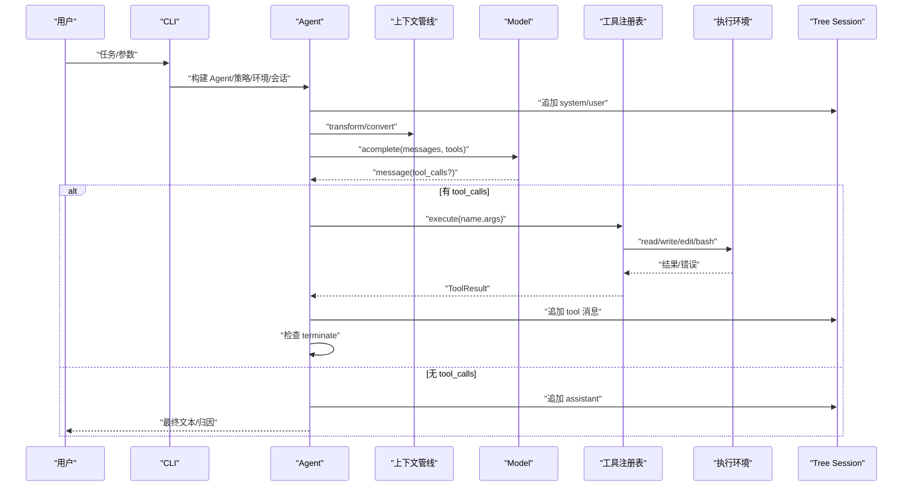

**图表来源**
- [mu/agent.py:82-133](file://mu/agent.py#L82-L133)
- [mu/model.py:112-146](file://mu/model.py#L112-L146)
- [mu/tools.py:253-269](file://mu/tools.py#L253-L269)
- [mu/session.py:49-58](file://mu/session.py#L49-L58)

**章节来源**
- [mu/agent.py:82-133](file://mu/agent.py#L82-L133)
- [mu/model.py:112-146](file://mu/model.py#L112-L146)
- [mu/tools.py:253-269](file://mu/tools.py#L253-L269)
- [mu/session.py:49-58](file://mu/session.py#L49-L58)

## 详细组件分析

### Agent（薄 async loop）
- 设计要点
  - 无 max_steps，以“模型不再调用工具”为自然终止。
  - 事件发射：RunStarted/TurnStarted/ModelCallFinished/ToolCallFinished/TurnFinished/RunFinished。
  - 上下文管线：transform_context → convert_to_llm，标准消息透传，自定义消息（如 branch_summary）注入。
  - 工具批处理：顺序执行 tool_calls，支持 terminate 控制跳过自动后续 LLM 调用。
  - 取消与落盘：支持 asyncio.CancelledError，落盘已增量，发出 RunAborted。
- 价值
  - 将 loop 保持朴素，复杂度交给 harness（事件流、上下文管线、Tree Session、扩展系统）。

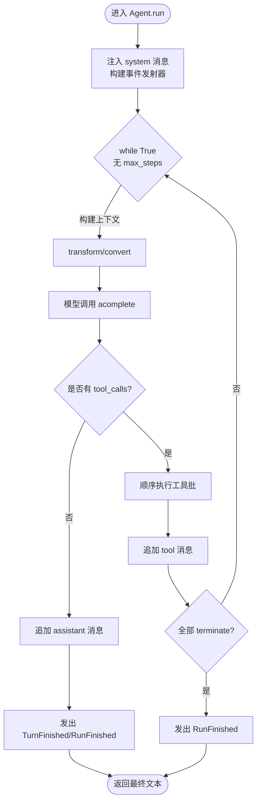

**图表来源**
- [mu/agent.py:82-133](file://mu/agent.py#L82-L133)
- [mu/context.py:15-31](file://mu/context.py#L15-L31)

**章节来源**
- [mu/agent.py:1-223](file://mu/agent.py#L1-L223)
- [mu/context.py:15-31](file://mu/context.py#L15-L31)

### Tools（四个工具 + 注册表）
- 四个工具
  - read：支持 offset/limit，错误转字符串。
  - write：自动建目录，返回写入字符数与行数。
  - edit：唯一匹配替换，错误转字符串。
  - bash：执行命令，返回 stdout/stderr/exit code。
- 注册表（ToolRegistry）
  - 统一 schema 与 handler 签名，内置四工具固定。
  - 能力门控：按能力集合（read/write/edit/bash）进行策略判断。
  - 动态注册/注销扩展工具，支持 capabilities 保守默认。
- 设计哲学
  - 工具返回字符串，错误也返回字符串，让模型自纠错。
  - 原生 function-calling，OpenAI tools schema。

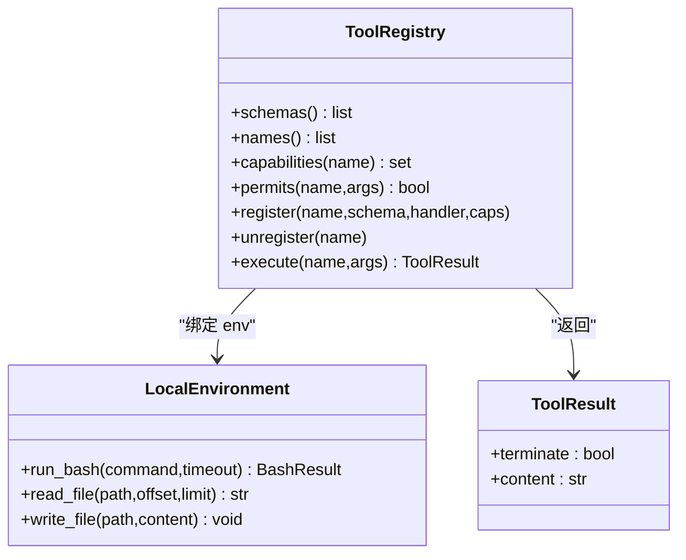

**图表来源**
- [mu/tools.py:191-269](file://mu/tools.py#L191-L269)
- [mu/environment.py:23-88](file://mu/environment.py#L23-L88)

**章节来源**
- [mu/tools.py:1-269](file://mu/tools.py#L1-L269)
- [mu/environment.py:1-150](file://mu/environment.py#L1-L150)

### Model（OpenAI 兼容模型后端）
- 封装 AsyncOpenAI，支持流式与非流式。
- 返回 ModelResult：message/usage/latency，供归因统计。
- 流式累积：consume_stream 聚合增量 content/tool_calls。
- 配置校验：MU_MODEL/MU_API_KEY（或 OPENAI_API_KEY）必填。

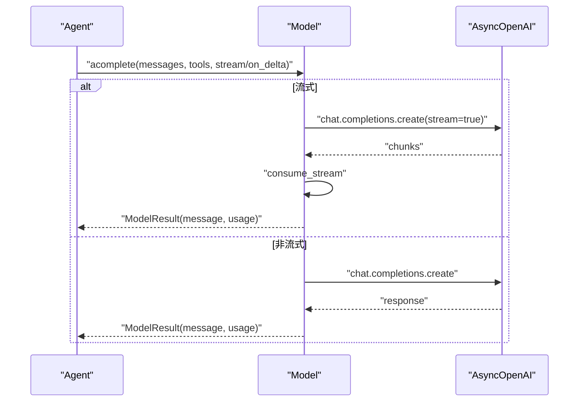

**图表来源**
- [mu/model.py:112-146](file://mu/model.py#L112-L146)
- [mu/model.py:52-88](file://mu/model.py#L52-L88)

**章节来源**
- [mu/model.py:1-147](file://mu/model.py#L1-L147)

### Session（Tree Session）
- JSONL 持久化，节点含 id/parent_id/ts/msg。
- 支持 branch_from/leaves/path_to/head 操作。
- branch_summary 注入主线上下文，Pi side-quest 回主线工作流。
- 会话目录可覆盖（MU_SESSION_DIR），默认工作目录本地 ./.mu/sessions。

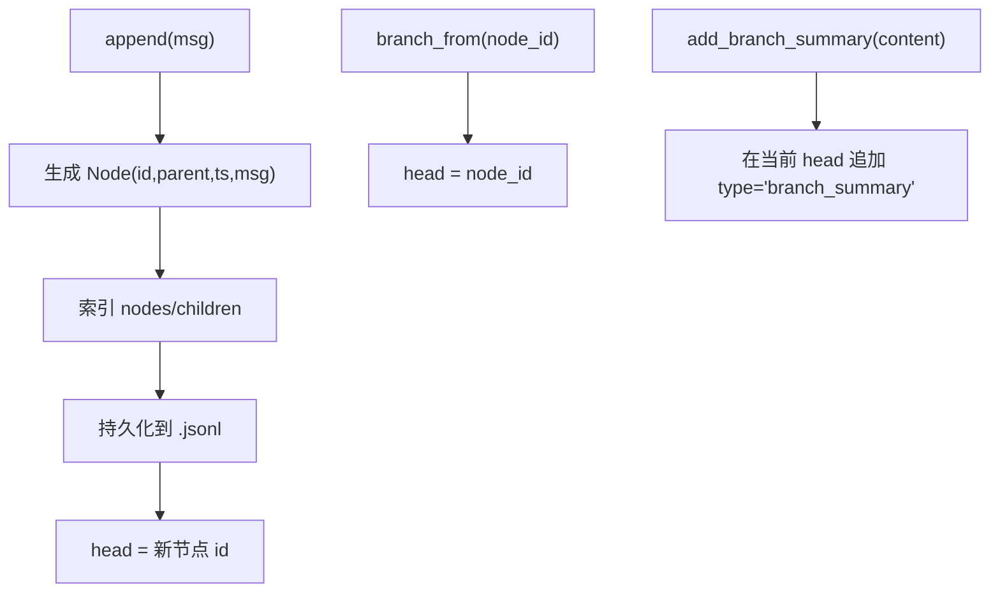

**图表来源**
- [mu/session.py:49-98](file://mu/session.py#L49-L98)

**章节来源**
- [mu/session.py:1-115](file://mu/session.py#L1-L115)

### Events（事件流）
- 结构化事件：RunStarted/TurnStarted/ModelCallStarted/ToolCallFinished/TurnFinished/RunFinished/RunAborted。
- EventEmitter：同步订阅分发，多消费者（StdoutRenderer/AttributionCollector/TUI）共享事件流。
- M3 扩展事件：ExtensionLoaded/ExtensionUnloaded/ExtensionLog/ExtensionError。

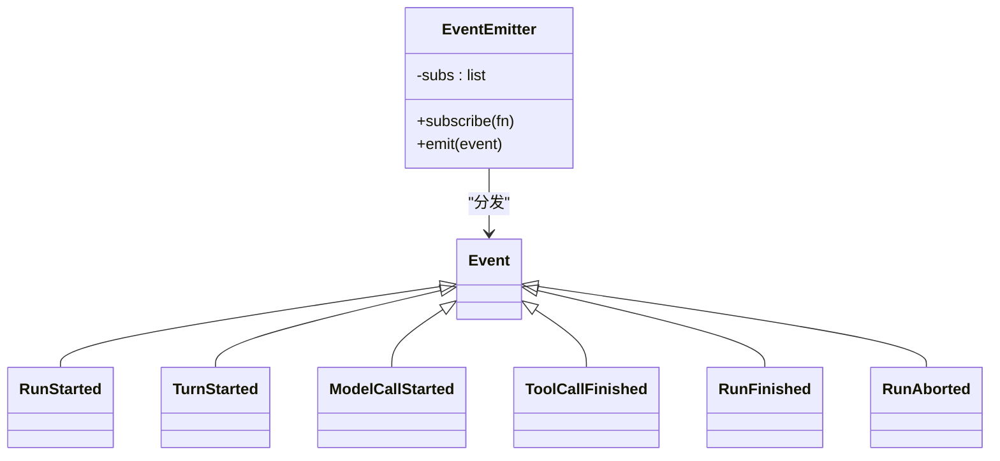

**图表来源**
- [mu/events.py:18-133](file://mu/events.py#L18-L133)

**章节来源**
- [mu/events.py:1-133](file://mu/events.py#L1-L133)

### 权限策略（Permission）
- 能力常量：WRITE/SHELL/CODE_EXEC/EXTENSION_EXEC。
- 策略
  - allow_all：默认 YOLO。
  - read_only：禁止 write/edit/bash/code/扩展加载。
  - workspace_write：写入限制在工作区，bash/code/扩展因无法限定而拒绝。
- 门控在 ToolRegistry.execute，按能力集合判断。

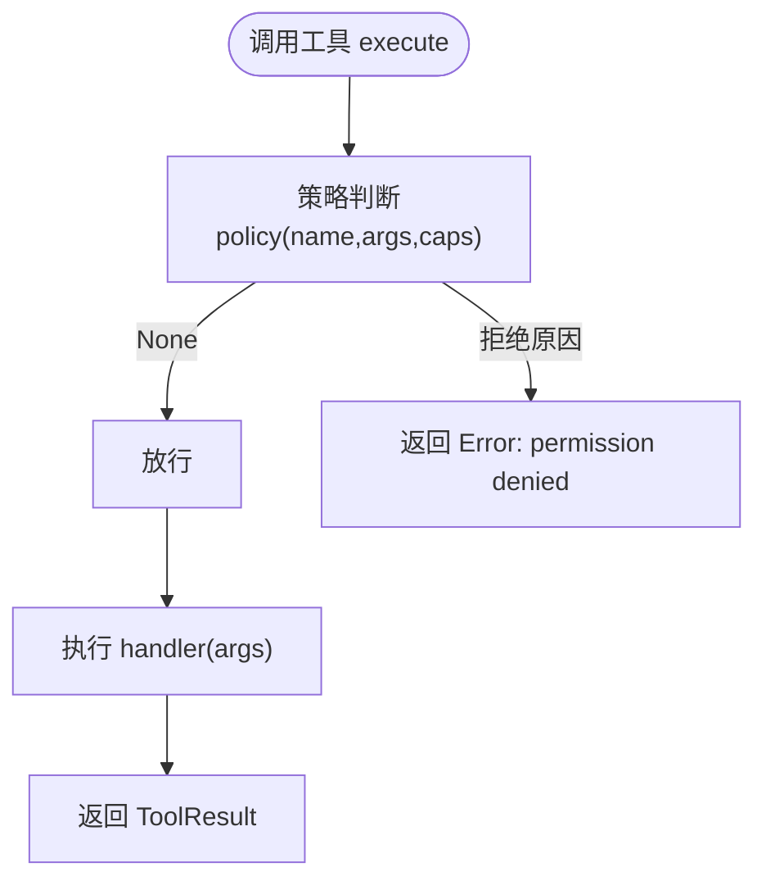

**图表来源**
- [mu/permission.py:29-69](file://mu/permission.py#L29-L69)
- [mu/tools.py:253-269](file://mu/tools.py#L253-L269)

**章节来源**
- [mu/permission.py:1-69](file://mu/permission.py#L1-L69)
- [mu/tools.py:221-269](file://mu/tools.py#L221-L269)

### 执行环境（Environment）
- LocalEnvironment：文件读写与 bash 子进程执行，超时整组清理（进程组 SIGKILL）。
- DockerEnvironment（M3.5 实验性）：仅 bash 放容器（--network none），文件工具仍宿主 IO。
- make_environment(kind)：工厂函数，返回 LocalEnvironment 或 DockerEnvironment。

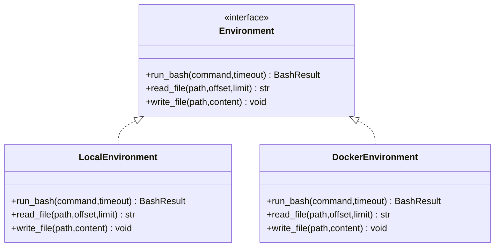

**图表来源**
- [mu/environment.py:90-150](file://mu/environment.py#L90-L150)

**章节来源**
- [mu/environment.py:1-150](file://mu/environment.py#L1-L150)

### 原生 code-action（M3.5）
- 模型写 Python，一次调用内组合 mu.read/mu.write/mu.edit/mu.bash/mu.call。
- 线程内 exec，超时软停止（线程可能滞留），隔离≠安全沙箱。
- 注册 code 工具，能力为 code_exec，restrictive 策略会整体拦截。

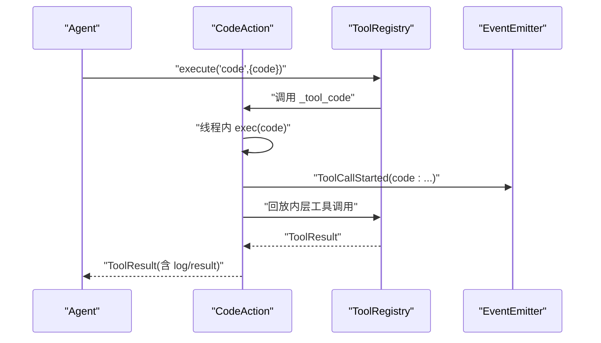

**图表来源**
- [mu/codeact.py:84-133](file://mu/codeact.py#L84-L133)
- [mu/codeact.py:42-83](file://mu/codeact.py#L42-L83)

**章节来源**
- [mu/codeact.py:1-133](file://mu/codeact.py#L1-L133)

### 自延伸扩展（ExtensionManager + ExtSDK）
- ExtensionManager：子进程扩展管理，JSONL 协议，支持 load/reload/list，状态持久化到 session。
- ExtSDK：扩展作者声明工具、状态、日志，run_extension 启动协议循环。
- 扩展以 agent 同等权限运行，权限/沙箱见 M3.5。

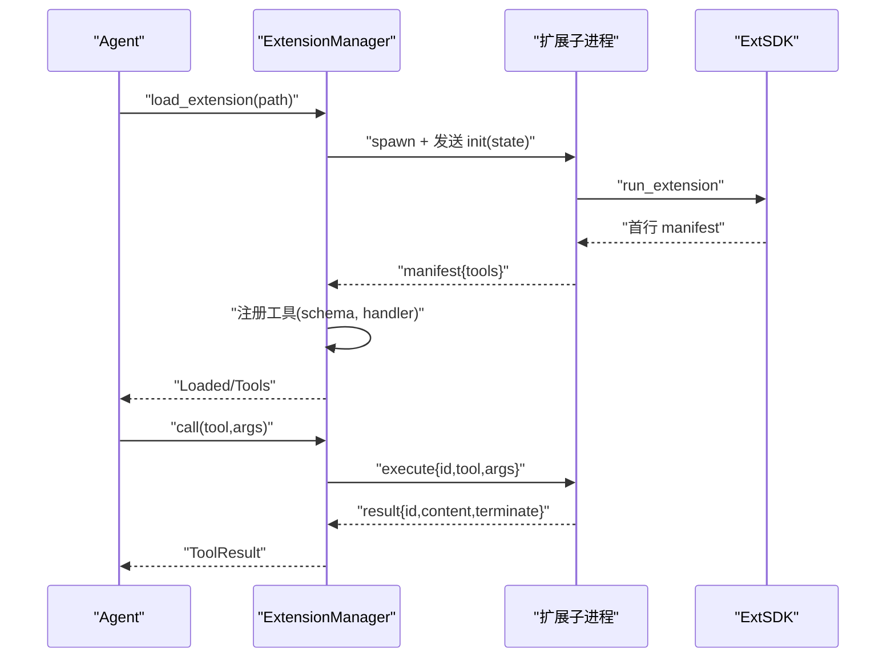

**图表来源**
- [mu/extension.py:131-188](file://mu/extension.py#L131-L188)
- [mu/extension.py:251-266](file://mu/extension.py#L251-L266)
- [mu/extsdk.py:111-130](file://mu/extsdk.py#L111-L130)

**章节来源**
- [mu/extension.py:1-364](file://mu/extension.py#L1-L364)
- [mu/extsdk.py:1-130](file://mu/extsdk.py#L1-L130)
- [extensions/example_textstats.py:1-67](file://extensions/example_textstats.py#L1-L67)

## 依赖关系分析
- 组件耦合
  - Agent 依赖 Model/ToolRegistry/Session/EventEmitter/Environment/Permission/Context。
  - Tools 依赖 Environment 与 PermissionPolicy。
  - ExtensionManager 依赖 ToolRegistry/Session/EventEmitter。
  - CLI 依赖 Agent/Session/EventEmitter/Policy/Environment。
- 外部依赖
  - openai SDK（AsyncOpenAI）。
  - Python 标准库（asyncio/os/pathlib/json/signal）。
- 可能的循环依赖
  - 通过模块导入避免循环；ExtensionManager 与 ExtSDK 通过 JSONL 协议解耦。

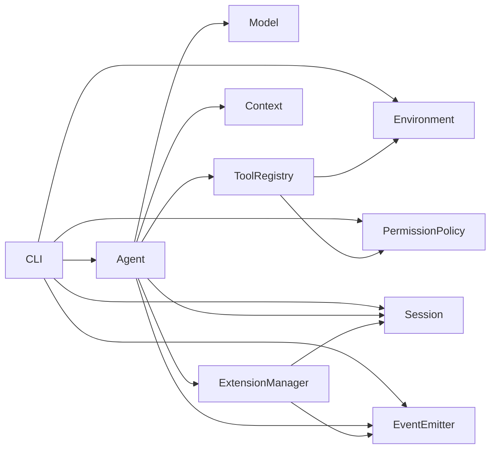

**图表来源**
- [mu/cli.py:12-20](file://mu/cli.py#L12-L20)
- [mu/agent.py:33-38](file://mu/agent.py#L33-L38)
- [mu/tools.py:198-211](file://mu/tools.py#L198-L211)
- [mu/extension.py:85-104](file://mu/extension.py#L85-L104)

**章节来源**
- [mu/cli.py:1-134](file://mu/cli.py#L1-L134)
- [mu/agent.py:1-223](file://mu/agent.py#L1-L223)
- [mu/tools.py:1-269](file://mu/tools.py#L1-L269)
- [mu/extension.py:1-364](file://mu/extension.py#L1-L364)

## 性能考量
- 事件流与可观测
  - 事件同步分发，避免引入重型 pub/sub 框架，降低开销。
  - 流式输出（--stream）仅在需要时开启，减少不必要的增量回调。
- 工具执行
  - 文件读写与 bash 执行均 offload 到线程/子进程，避免阻塞事件循环。
  - bash 超时采用进程组整组清理，避免孤儿进程。
- 模型调用
  - 流式累积 consume_stream，便于离线测试与最小化内存占用。
  - 使用 AsyncOpenAI，减少自建 HTTP 适配成本。
- 会话持久化
  - JSONL 追加写入，KV-cache/可复现友好，分支与摘要注入主线，减少冗余上下文。

[本节为通用性能建议，不直接分析具体文件]

## 故障排查指南
- 配置错误（MU_MODEL/MU_API_KEY）
  - 现象：启动时报 ConfigError。
  - 排查：确认环境变量设置或 .env 文件加载。
- 会话错误（Session.load）
  - 现象：Session not found 或 node id 不存在。
  - 排查：检查 session id/branch node id 是否正确。
- 工具权限被拒
  - 现象：返回 Error: permission denied。
  - 排查：检查策略（allow/readonly/workspace）与工具能力集合。
- 扩展加载失败
  - 现象：扩展未产生有效 manifest 或工具名冲突。
  - 排查：检查扩展 manifest 与工具 schema，确保名称唯一。
- bash 超时
  - 现象：返回 timeout 与 exit code 124。
  - 排查：调整 timeout，检查命令与容器网络（docker 沙箱）。
- code-action 软超时
  - 现象：返回 soft timeout 提示，线程可能滞留。
  - 排查：缩短执行逻辑，必要时在容器中运行。

**章节来源**
- [mu/model.py:19-21](file://mu/model.py#L19-L21)
- [mu/cli.py:66-68](file://mu/cli.py#L66-L68)
- [mu/extension.py:146-160](file://mu/extension.py#L146-L160)
- [mu/environment.py:37-43](file://mu/environment.py#L37-L43)
- [mu/codeact.py:99-106](file://mu/codeact.py#L99-L106)

## 结论
μ (mu) 以 Pi 的极简思想为核心，将 Agent Loop 保持朴素 while，复杂度集中在 harness：事件流、上下文管线、Tree Session、扩展系统与可插拔执行层。通过“薄 async loop + 四个工具 + 原生 function-calling + OpenAI 兼容模型后端”，μ 在简洁性、可扩展性与实用性之间取得平衡，既适合个人日常开发任务，也为后续自延伸与评估基座（M4.0）奠定坚实基础。

[本节为总结性内容，不直接分析具体文件]

## 附录
- 使用场景
  - 快速原型与小步迭代：利用四工具与原生 function-calling，快速验证想法。
  - 自延伸生态：agent 自己写扩展并热重载，形成“自进化脚手架”闭环。
  - 受限环境：readonly/workspace 策略与 docker 沙箱，满足合规与安全要求。
  - 评测与回归：M4.0 候选隔离验证与 archive，支持库内 eval runner。
- 快速上手
  - 安装与配置：见 README 的安装与配置章节。
  - 运行与续跑：支持 headless 与 TUI，支持 --resume/--branch。
  - 扩展与 code-action：按需启用 --code 与权限/沙箱策略。

**章节来源**
- [README.md:13-127](file://README.md#L13-L127)