# 项目概述

<cite>
**本文引用的文件**
- [README.md](file://README.md)
- [__main__.py](file://mu/__main__.py)
- [agent.py](file://mu/agent.py)
- [tools.py](file://mu/tools.py)
- [model.py](file://mu/model.py)
- [session.py](file://mu/session.py)
- [events.py](file://mu/events.py)
- [cli.py](file://mu/cli.py)
- [environment.py](file://mu/environment.py)
- [permission.py](file://mu/permission.py)
- [codeact.py](file://mu/codeact.py)
- [dgm.py](file://mu/dgm.py)
- [eval.py](file://mu/eval.py)
- [M0-Walking-Skeleton-plan.md](file://plan/M0-Walking-Skeleton-plan.md)
- [M1-Harness-Core-plan.md](file://plan/M1-Harness-Core-plan.md)
- [M2-Textual-Frontend-plan.md](file://plan/M2-Textual-Frontend-plan.md)
- [M3.5-CodeAction-Sandbox-plan.md](file://plan/M3.5-CodeAction-Sandbox-plan.md)
</cite>

## 目录
1. [简介](#简介)
2. [项目结构](#项目结构)
3. [核心组件](#核心组件)
4. [架构总览](#架构总览)
5. [详细组件分析](#详细组件分析)
6. [依赖关系分析](#依赖关系分析)
7. [性能考量](#性能考量)
8. [故障排查指南](#故障排查指南)
9. [结论](#结论)
10. [附录](#附录)

## 简介
μ（mu）是一个按 Pi 风格复刻的极简智能体，目标是以“薄 async loop + 四个工具（read/write/edit/bash）+ 原生 function-calling + OpenAI 兼容模型后端”实现可运行、可观测、可扩展的代码型智能体。项目采用渐进式演进路线（M0–M4.0），在保持 Pi 哲学（朴素 while、无 max_steps、以“无 tool_calls”终止）的同时，逐步引入事件流、上下文管线、树形会话、TUI、自延伸扩展、原生 code-action、可插拔权限/沙箱与库内评估与 DGM-lite 候选隔离验证。

- 核心能力
  - 薄 async while 循环：无最大轮次限制，以模型不再调用工具为终止条件。
  - 四工具：read、write、edit、bash，统一通过 OpenAI 风格 function-calling 调用。
  - 原生 function-calling：模型直接生成 tool_calls，无需正则解析。
  - OpenAI 兼容模型后端：通过 AsyncOpenAI 客户端对接百炼、DeepSeek、OpenAI 等。
  - 可观测与归因：事件流 + 归因收集器，输出轮数、时延、token 使用等。
  - 交互式 TUI：Textual 驱动的终端界面，与 headless 共享同一核心。
  - 自延伸扩展：agent 可加载子进程扩展，扩展状态持久化在会话中。
  - 原生 code-action：一次模型调用内组合多工具与控制流，减少轮次与 token。
  - 权限/沙箱：基于 capability 的 gate 策略与可插拔执行环境（本地/容器）。
  - 评估与 DGM-lite：内置评估套件与候选隔离验证，归档最佳方案。

- 使用场景
  - 代码生成与测试：在工作区内生成项目、编写测试并运行验证。
  - 问题修复：读取现有代码与测试，定位并修复缺陷。
  - 功能实现：根据测试用例实现函数或模块。
  - 交互式开发：通过 TUI 实时观察对话、工具调用与归因。

**章节来源**
- [README.md:1-127](file://README.md#L1-L127)

## 项目结构
项目采用扁平单包（mu/）组织，核心模块围绕“Agent-Model-Tools-Session-Events”展开，CLI 作为入口负责参数解析与事件订阅者装配，TUI 作为事件流的另一个消费者，扩展与权限/沙箱通过可插拔协议接入。

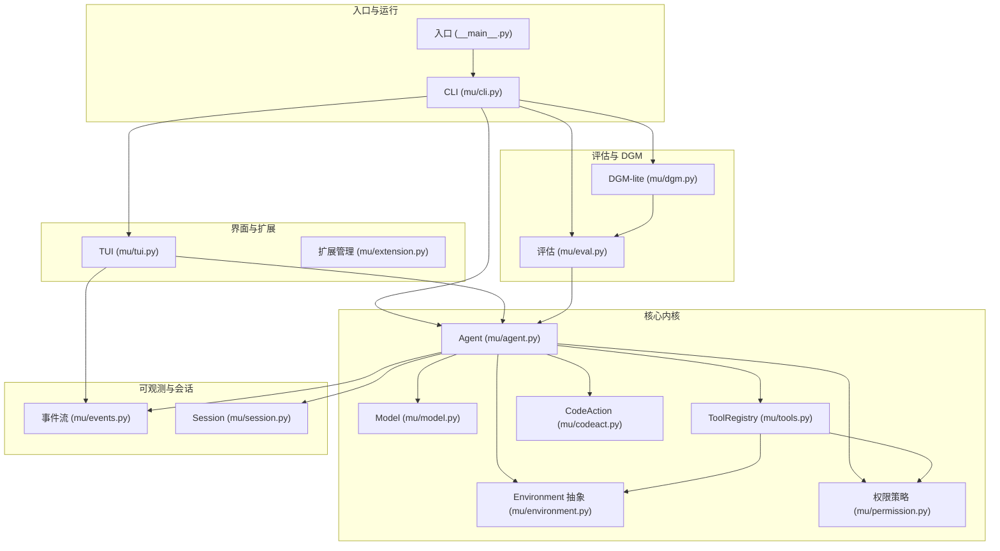

**图示来源**
- [__main__.py:1-5](file://mu/__main__.py#L1-L5)
- [cli.py:1-134](file://mu/cli.py#L1-L134)
- [agent.py:1-223](file://mu/agent.py#L1-L223)
- [model.py:1-147](file://mu/model.py#L1-L147)
- [tools.py:1-269](file://mu/tools.py#L1-L269)
- [environment.py:1-150](file://mu/environment.py#L1-L150)
- [permission.py:1-69](file://mu/permission.py#L1-L69)
- [codeact.py:1-133](file://mu/codeact.py#L1-L133)
- [events.py:1-133](file://mu/events.py#L1-L133)
- [session.py:1-115](file://mu/session.py#L1-L115)
- [eval.py:1-569](file://mu/eval.py#L1-L569)
- [dgm.py:1-475](file://mu/dgm.py#L1-L475)

**章节来源**
- [README.md:13-127](file://README.md#L13-L127)
- [M0-Walking-Skeleton-plan.md:26-48](file://plan/M0-Walking-Skeleton-plan.md#L26-L48)
- [M1-Harness-Core-plan.md:39-51](file://plan/M1-Harness-Core-plan.md#L39-L51)
- [M2-Textual-Frontend-plan.md:31-41](file://plan/M2-Textual-Frontend-plan.md#L31-L41)
- [M3.5-CodeAction-Sandbox-plan.md:31-46](file://plan/M3.5-CodeAction-Sandbox-plan.md#L31-L46)

## 核心组件
- Agent：薄 async while 循环，负责消息历史构建、模型调用、工具执行与事件发射。支持流式输出、取消与归因。
- Model：AsyncOpenAI 封装，支持流式累积与 usage 提取，返回包含 message、tokens、latency 的结果。
- ToolRegistry：注册与执行工具，统一 schema 与 handler 签名，支持权限策略 gate、扩展工具注册与 capabilities。
- Environment：可插拔执行环境抽象，本地默认实现与 Docker 实验实现。
- PermissionPolicy：基于 capability 的权限策略，支持 allow、readonly、workspace_write。
- CodeAction：原生 code-action 工具，进程内执行模型 Python，通过事件循环桥接工具调用。
- Session：树形会话，JSONL 持久化，支持分支、摘要与续跑。
- Events：结构化事件与 EventEmitter，支撑多订阅者渲染与归因。
- CLI/TUI：参数解析、事件订阅者装配、TUI 交互与 headless 输出。
- Eval/DGM：评估套件与 DGM-lite 候选隔离验证，归档最佳方案。

**章节来源**
- [agent.py:43-223](file://mu/agent.py#L43-L223)
- [model.py:91-147](file://mu/model.py#L91-L147)
- [tools.py:191-269](file://mu/tools.py#L191-L269)
- [environment.py:90-150](file://mu/environment.py#L90-L150)
- [permission.py:29-69](file://mu/permission.py#L29-L69)
- [codeact.py:84-133](file://mu/codeact.py#L84-L133)
- [session.py:38-115](file://mu/session.py#L38-L115)
- [events.py:121-133](file://mu/events.py#L121-L133)
- [cli.py:51-134](file://mu/cli.py#L51-L134)

## 架构总览
μ 的架构以“事件驱动 + 会话树 + 可插拔执行层”为核心，Agent 作为中枢协调 Model 与 Tools，通过事件流与归因收集器实现可观测性；Session 提供树形历史与分支能力；权限与沙箱在 ToolRegistry 与 Environment 层面统一接入；TUI 与 headless 共享同一核心。

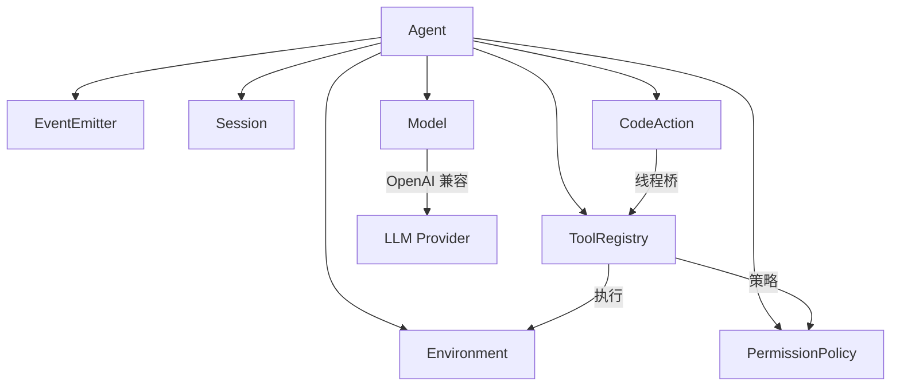

**图示来源**
- [agent.py:82-133](file://mu/agent.py#L82-L133)
- [model.py:112-147](file://mu/model.py#L112-L147)
- [tools.py:253-269](file://mu/tools.py#L253-L269)
- [environment.py:139-150](file://mu/environment.py#L139-L150)
- [permission.py:61-69](file://mu/permission.py#L61-L69)
- [codeact.py:93-133](file://mu/codeact.py#L93-L133)

## 详细组件分析

### Agent 与薄 async loop
- 无 max_steps：以“assistant 消息不含 tool_calls”为终止条件，支持 Ctrl-C 取消与会话落盘。
- 事件发射：RunStarted/TurnStarted/ModelCall*/ToolCall*/TurnFinished/RunFinished/RunAborted。
- 上下文管线：convert_to_llm(transform_context(session.path_to_head()))。
- 归因：记录 turns、LLM 时延、工具时延、tokens。
- 终止语义：ToolResult.terminate 控制本轮工具结束后是否跳过自动后续 LLM 调用。

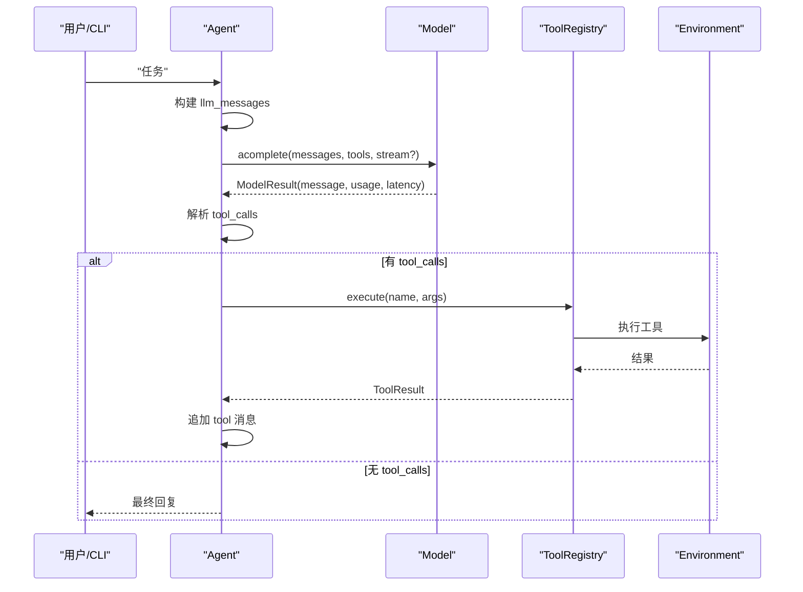

**图示来源**
- [agent.py:82-133](file://mu/agent.py#L82-L133)
- [model.py:112-147](file://mu/model.py#L112-L147)
- [tools.py:253-269](file://mu/tools.py#L253-L269)
- [environment.py:26-88](file://mu/environment.py#L26-L88)

**章节来源**
- [agent.py:1-223](file://mu/agent.py#L1-L223)
- [M0-Walking-Skeleton-plan.md:13-25](file://plan/M0-Walking-Skeleton-plan.md#L13-L25)

### 四工具与 ToolRegistry
- 工具职责
  - read：读取文件内容，支持 offset/limit。
  - write：创建/覆盖文件，自动创建父目录。
  - edit：精确替换唯一出现的 old_string。
  - bash：执行 shell 命令，返回 stdout/stderr/exit_code。
- Schema 与 handler：统一 OpenAI tools schema，handler 统一签名。
- 权限策略：基于 capabilities gate，内置 read/write/edit/bash 的能力集合。
- 扩展注册：支持动态注册/注销扩展工具，capabilities 保守默认。

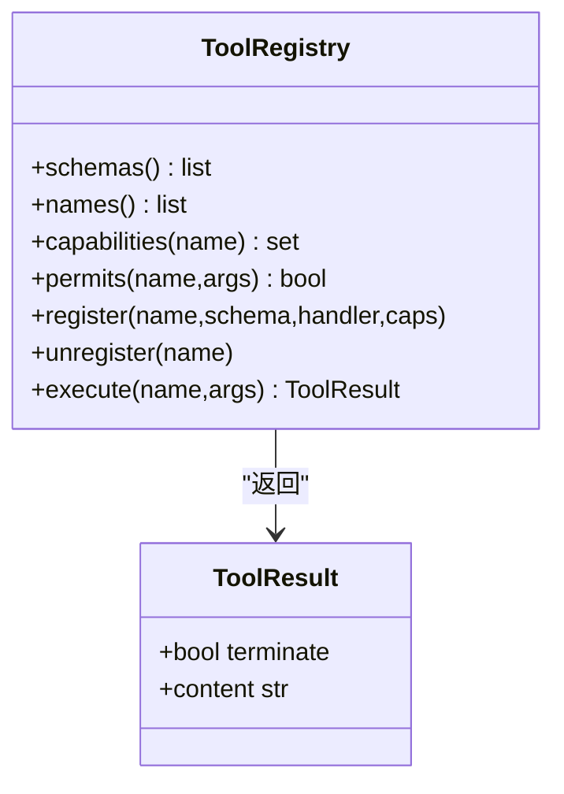

**图示来源**
- [tools.py:191-269](file://mu/tools.py#L191-L269)

**章节来源**
- [tools.py:1-269](file://mu/tools.py#L1-L269)
- [M0-Walking-Skeleton-plan.md:13-25](file://plan/M0-Walking-Skeleton-plan.md#L13-L25)

### Model 与 OpenAI 兼容后端
- AsyncOpenAI 封装：支持流式与非流式，返回 ModelResult（message、usage、latency）。
- 流式累积：consume_stream 聚合 content 与 tool_calls 增量，支持 on_delta 回调。
- 配置：MU_MODEL、MU_BASE_URL、MU_API_KEY（或 OPENAI_API_KEY）。

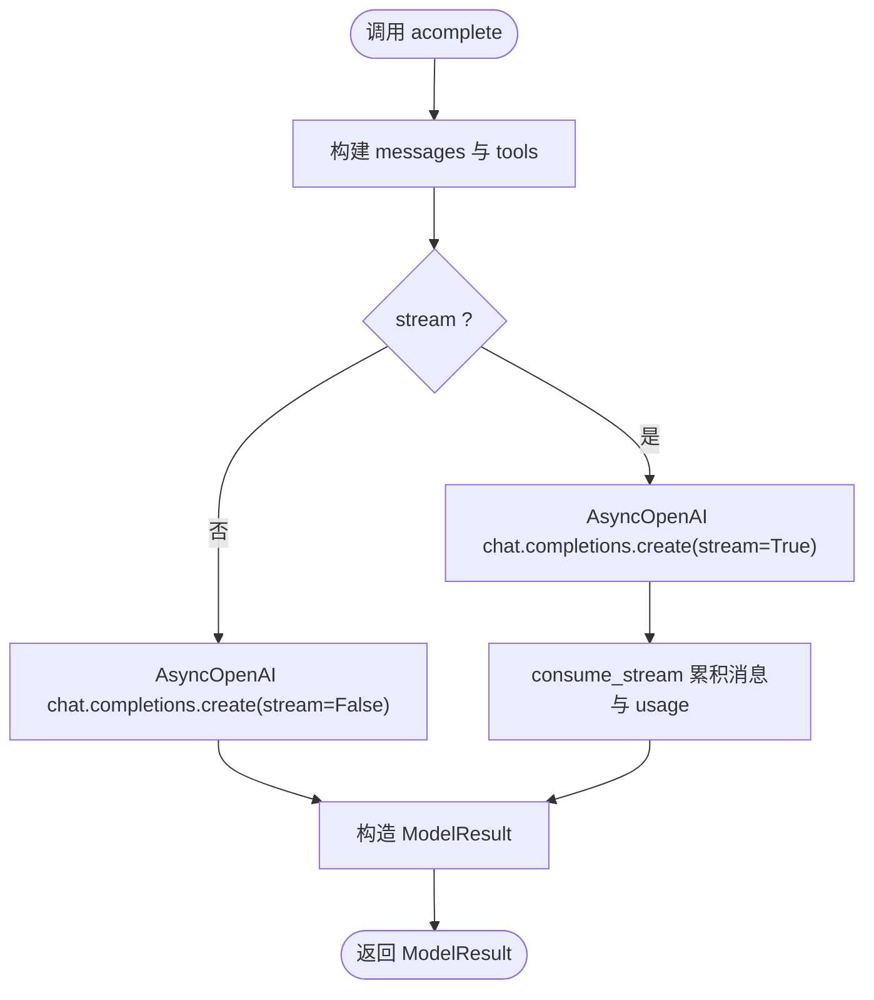

**图示来源**
- [model.py:112-147](file://mu/model.py#L112-L147)
- [model.py:52-88](file://mu/model.py#L52-L88)

**章节来源**
- [model.py:1-147](file://mu/model.py#L1-L147)
- [M0-Walking-Skeleton-plan.md:24-25](file://plan/M0-Walking-Skeleton-plan.md#L24-L25)

### 会话树与分支摘要
- Session：append-only JSONL，节点包含 id/parent_id/ts/msg；支持 path_to/path_to_head/branch_from/add_branch_summary。
- 分支与摘要：支持从任意节点分支，将侧分支结论以 branch_summary 注入上下文。
- 续跑：Session.load(id) 从指定节点续跑，支持 --resume/--branch。

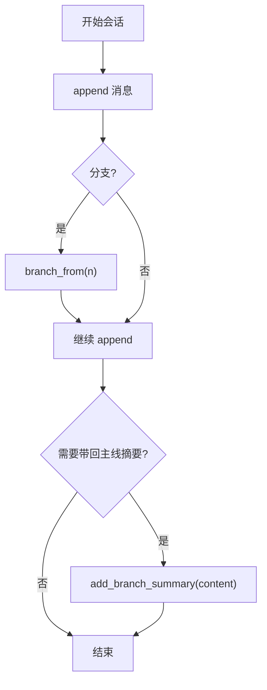

**图示来源**
- [session.py:38-115](file://mu/session.py#L38-L115)

**章节来源**
- [session.py:1-115](file://mu/session.py#L1-L115)
- [M1-Harness-Core-plan.md:56-63](file://plan/M1-Harness-Core-plan.md#L56-L63)

### 事件流与可观测归因
- 事件类型：RunStarted、TurnStarted、ModelCallStarted/Finished、AssistantText/Delta、ToolCallStarted/Finished、TurnFinished、RunFinished、RunAborted、扩展相关事件。
- 订阅者：StdoutRenderer（headless）、AttributionCollector（归因报告）、TuiRenderer（M2）。
- 归因：累计 turns、LLM wall-clock、工具 wall-clock、tokens（prompt/completion/total）。

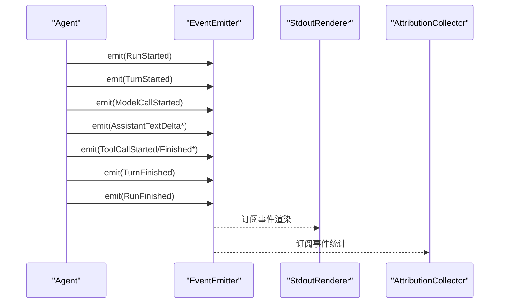

**图示来源**
- [events.py:121-133](file://mu/events.py#L121-L133)
- [M1-Harness-Core-plan.md:56-63](file://plan/M1-Harness-Core-plan.md#L56-L63)

**章节来源**
- [events.py:1-133](file://mu/events.py#L1-L133)
- [M1-Harness-Core-plan.md:15-24](file://plan/M1-Harness-Core-plan.md#L15-L24)

### 权限策略与沙箱
- 权限策略：allow_all、read_only、workspace_write；基于 capabilities gate，而非工具名黑名单。
- 沙箱：Environment Protocol，默认 local；DockerEnvironment 实验实现（仅 bash 容器化，文件 IO 仍宿主）。
- 与 code-action：code 工具具备 code_exec 能力，受策略统一约束。

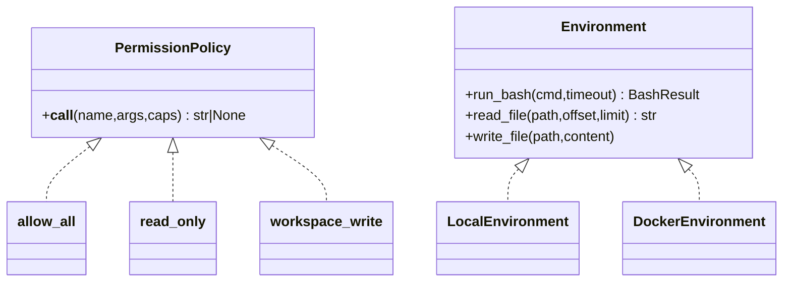

**图示来源**
- [permission.py:15-69](file://mu/permission.py#L15-L69)
- [environment.py:90-150](file://mu/environment.py#L90-L150)

**章节来源**
- [permission.py:1-69](file://mu/permission.py#L1-L69)
- [environment.py:1-150](file://mu/environment.py#L1-L150)
- [M3.5-CodeAction-Sandbox-plan.md:11-19](file://plan/M3.5-CodeAction-Sandbox-plan.md#L11-L19)

### 原生 code-action
- 一次模型调用内组合多工具与控制流，减少轮次与 token。
- 线程内执行模型 Python，通过 run_coroutine_threadsafe 将工具调用桥回事件循环。
- 软超时：线程可能滞留，进一步工具调用被拒；建议容器隔离。

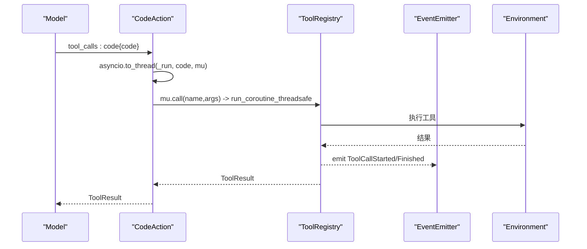

**图示来源**
- [codeact.py:93-133](file://mu/codeact.py#L93-L133)
- [tools.py:253-269](file://mu/tools.py#L253-L269)

**章节来源**
- [codeact.py:1-133](file://mu/codeact.py#L1-L133)
- [M3.5-CodeAction-Sandbox-plan.md:48-55](file://plan/M3.5-CodeAction-Sandbox-plan.md#L48-L55)

### 评估与 DGM-lite
- 评估：内置 basic-coding 套件（创建项目/修复缺陷/实现功能），支持 per-task 超时、归因提取、结果汇总。
- DGM-lite：在复制的工作区应用候选（overlay/dir/patch/generate），运行评估并归档，通过项仅归档不自动应用回主仓库。

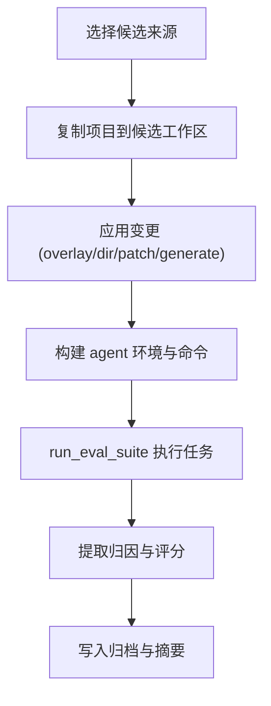

**图示来源**
- [eval.py:163-211](file://mu/eval.py#L163-L211)
- [dgm.py:65-135](file://mu/dgm.py#L65-L135)

**章节来源**
- [eval.py:1-569](file://mu/eval.py#L1-L569)
- [dgm.py:1-475](file://mu/dgm.py#L1-L475)
- [README.md:98-127](file://README.md#L98-L127)

## 依赖关系分析
- 模块耦合
  - Agent 依赖 Model、ToolRegistry、Session、EventEmitter、Environment、PermissionPolicy、CodeAction。
  - ToolRegistry 依赖 Environment 与 PermissionPolicy。
  - CLI/TUI 依赖 Agent 与 EventEmitter。
  - Eval/DGM 依赖 Agent 与工具链。
- 外部依赖
  - openai（AsyncOpenAI）。
  - textual（可选，M2）。
  - docker（可选，M3.5 实验沙箱）。
- 可能的循环依赖
  - 无直接循环；事件订阅者仅做渲染/统计，不反向影响 Agent 核心。

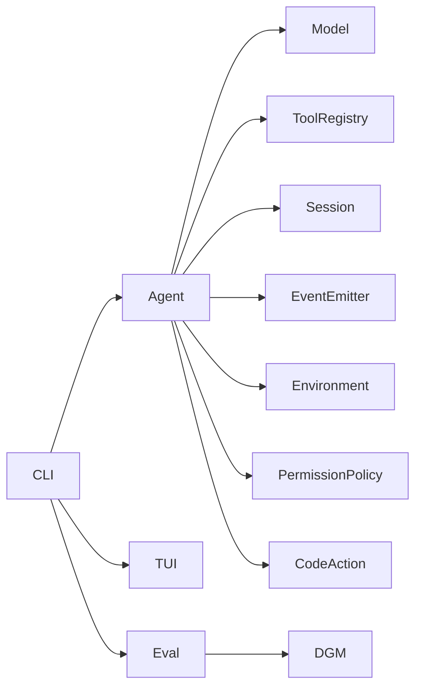

**图示来源**
- [cli.py:12-19](file://mu/cli.py#L12-L19)
- [agent.py:33-75](file://mu/agent.py#L33-L75)
- [tools.py:10-16](file://mu/tools.py#L10-L16)
- [environment.py:11-13](file://mu/environment.py#L11-L13)
- [permission.py:9-15](file://mu/permission.py#L9-L15)
- [codeact.py:17-18](file://mu/codeact.py#L17-L18)
- [eval.py:21-31](file://mu/eval.py#L21-L31)
- [dgm.py:21-31](file://mu/dgm.py#L21-L31)

**章节来源**
- [cli.py:1-134](file://mu/cli.py#L1-L134)
- [agent.py:1-223](file://mu/agent.py#L1-L223)

## 性能考量
- 事件流与渲染：事件同步分发，渲染与统计均为轻量操作，避免引入额外 pub/sub 框架。
- 流式输出：仅在显式开启 --stream 时进行，避免默认开销。
- 工具执行：文件 IO 与 bash 均 offload 至线程/子进程，避免阻塞事件循环。
- 归因与日志：归因收集器仅累计数值，不引入昂贵计算。
- 评估与 DGM：候选工作区复制与归档为一次性开销，建议使用增量策略与缓存。

[本节为通用指导，无需特定文件引用]

## 故障排查指南
- 配置错误
  - MU_MODEL/MU_API_KEY 未设置：Model 初始化抛出 ConfigError；CLI 捕获并提示。
- 会话错误
  - 不存在的会话 ID 或节点：Session.load/branch_from 抛出 FileNotFoundError/KeyError；CLI 捕获并提示。
- 取消与中断
  - Ctrl-C：Agent 捕获 CancelledError，emit RunAborted，确保会话落盘。
- 权限拒绝
  - read_only/workspace_write：ToolRegistry.execute 前经策略 gate，返回 permission denied。
- Docker 环境
  - 未安装 docker：DockerEnvironment 无法运行；可降级为 local 沙箱或关闭沙箱。

**章节来源**
- [model.py:19-21](file://mu/model.py#L19-L21)
- [cli.py:77-83](file://mu/cli.py#L77-L83)
- [session.py:99-115](file://mu/session.py#L99-L115)
- [agent.py:130-133](file://mu/agent.py#L130-L133)
- [tools.py:257-265](file://mu/tools.py#L257-L265)
- [environment.py:106-130](file://mu/environment.py#L106-L130)

## 结论
μ 以 Pi 风格的极简实现，将“薄 async loop + 四工具 + 原生 function-calling + OpenAI 兼容后端”落地为可运行、可观测、可扩展的智能体内核。通过事件流与树形会话，项目实现了从 M0 的最小骨架到 M4.0 的评估与 DGM-lite 候选验证的完整演进。M3.5 的原生 code-action 与可插拔权限/沙箱进一步提升了实用性与安全性。对于初学者，项目提供了清晰的 CLI/TUI 使用路径与 e2e 示例；对于有经验的开发者，事件驱动、可插拔协议与评估体系提供了深入定制的空间。

[本节为总结，无需特定文件引用]

## 附录
- 演进历程（M0–M4.0）
  - M0：Walking Skeleton，async-first，四工具 + OpenAI 兼容 + 线性历史 + 单点打印 seam。
  - M1：事件流 + 上下文管线 + tree session + 归因底座 + 可选流式/abort/terminate。
  - M2：Textual TUI，与 headless 共享核心。
  - M3：自延伸扩展（子进程 + JSONL 协议），自动加载，支持 --resume。
  - M3.5：原生 code-action + 权限/沙箱层（默认全关）。
  - M4.0：库内 eval + DGM-lite 候选隔离验证与 archive。
- 使用示例
  - 基础运行：在 calc.py 写 add(a,b)，再写 test_calc.py 用 pytest 测试它，然后运行 pytest 确认通过。
  - 流式输出：--stream 实时查看 assistant 文本增量。
  - 续跑/分支：--resume/--branch 从指定会话/节点继续。
  - TUI：--tui 交互式界面。
  - Code-action：--code 在一次模型调用内组合多工具。
  - 权限/沙箱：--permission/--sandbox 控制工具调用与执行环境。
  - 评估：python -m mu.eval 运行内置 basic-coding 套件。
  - DGM-lite：python -m mu.dgm 在候选工作区叠加扩展/提示词，跑评估并归档。

**章节来源**
- [README.md:5-127](file://README.md#L5-L127)
- [M0-Walking-Skeleton-plan.md:84-91](file://plan/M0-Walking-Skeleton-plan.md#L84-L91)
- [M1-Harness-Core-plan.md:91-98](file://plan/M1-Harness-Core-plan.md#L91-L98)
- [M2-Textual-Frontend-plan.md:102-109](file://plan/M2-Textual-Frontend-plan.md#L102-L109)
- [M3.5-CodeAction-Sandbox-plan.md:94-99](file://plan/M3.5-CodeAction-Sandbox-plan.md#L94-L99)